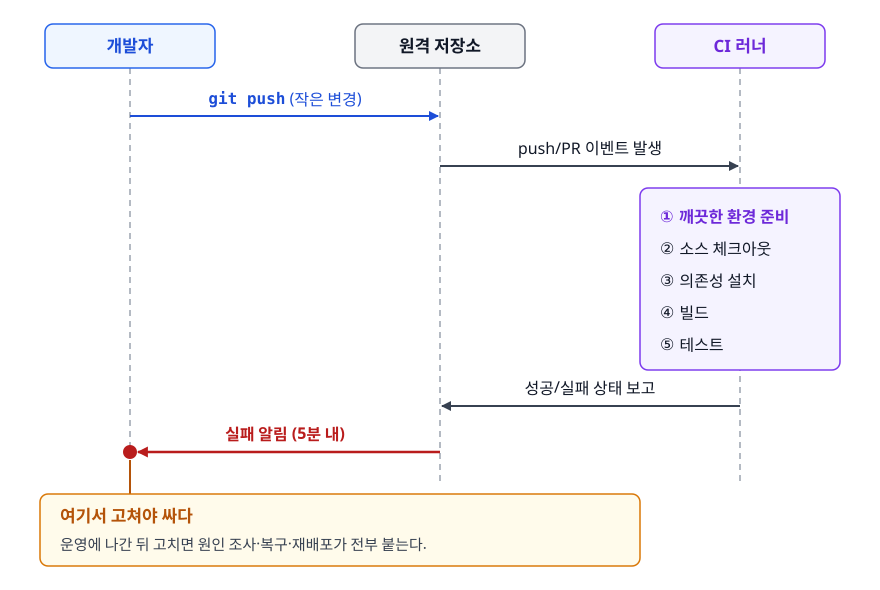
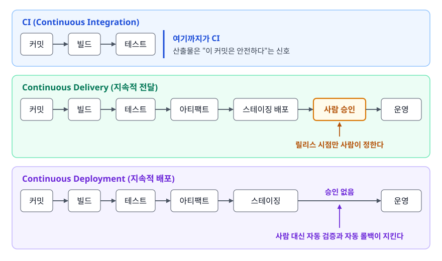
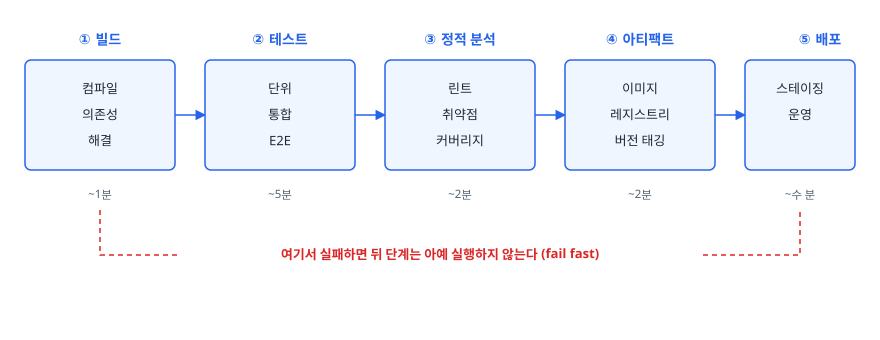
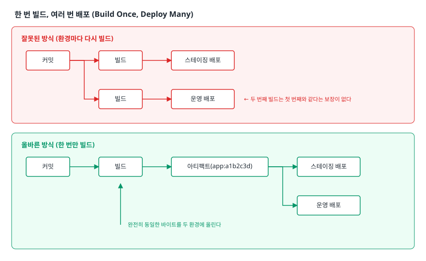
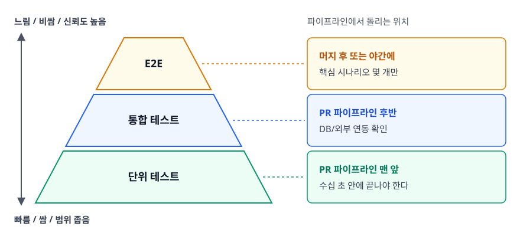
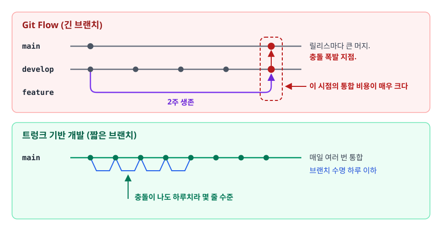
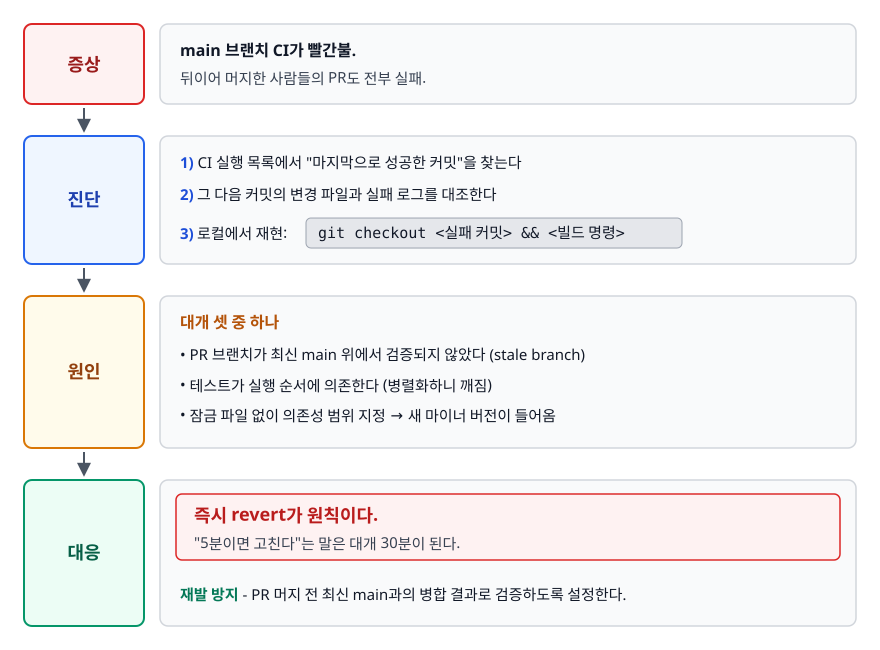

# CI/CD 개념 (Continuous Integration / Delivery / Deployment)

> 통합 지옥은 왜 생기고, CI는 그걸 어떻게 막을까요? 두 종류의 CD가 각각 무엇을 자동화하고 무엇을 사람에게 남기는지도 구분해서 설명합니다.

## 학습 목표

- [ ] 통합 지옥이 왜 생기는지, CI가 그 문제를 어떤 방식으로 없애는지 설명할 수 있다
- [ ] CI / Continuous Delivery / Continuous Deployment의 경계를 정확히 그을 수 있다
- [ ] 빌드 → 테스트 → 정적 분석 → 아티팩트 → 배포 파이프라인에서 각 단계의 순서가 왜 그렇게 정해졌는지 설명할 수 있다
- [ ] 테스트 피라미드를 파이프라인 단계에 배치해 피드백 시간을 설계할 수 있다
- [ ] 트렁크 기반 개발과 CI가 왜 한 세트로 다녀야 하는지 설명할 수 있다

## 선행 지식

- Git의 브랜치와 머지 개념 — [qna-version-control.md](../../07-version-control/qna-version-control.md)
- 없어도 읽을 수 있습니다. 1장부터 순서대로 읽으면 됩니다.

---

## 1. 왜 필요한가 — 통합 지옥(Integration Hell)

CI가 없던 시절의 팀은 이렇게 일했습니다. 개발자 네 명이 각자 브랜치를 따서 2주 동안 자기 기능을 만듭니다. 스프린트 마지막 날, 네 개의 브랜치를 한꺼번에 `main`에 합칩니다. 문제는 그 마지막 날에 벌어지는 일이었습니다.

- A와 B가 같은 파일을 각자 리팩터링해서 충돌이 수백 줄 납니다
- 충돌을 손으로 풀다가 A의 의도와 B의 의도를 둘 다 오해해서 새 버그를 만듭니다
- 겨우 합쳤더니 컴파일은 되는데 테스트가 깨집니다. 누구의 변경 때문인지 알 수 없습니다
- 2주 전 코드라 작성자 본인도 왜 그렇게 짰는지 기억이 흐릿합니다

이 상태를 **통합 지옥(Integration Hell)** 이라고 부릅니다. **통합을 미룰수록 비용이 선형이 아니라 가파르게 증가합니다.** 브랜치 두 개가 하루치 차이면 충돌 지점이 몇 군데지만, 2주치 차이면 서로가 서로의 전제를 무너뜨려서 "누가 옳은가"부터 다시 설계해야 하는 수준이 됩니다.

일상 비유로 옮기면 **방 청소**와 같습니다. 매일 5분씩 치우면 5분이지만, 한 달을 미루면 하루가 통째로 날아갑니다. 미룬 만큼 더 걸리는 게 아니라, 미룬 만큼 곱해져서 걸립니다.

> **비유의 한계**: 방은 내가 안 치우면 그대로 있을 뿐입니다. 코드는 다릅니다. 내가 브랜치를 들고 있는 동안 **다른 사람이 내 코드의 전제를 바꿔버립니다**. 방치의 대가가 단순 누적이 아니라 상호 간섭이라서, 코드 쪽이 훨씬 나쁩니다.

그래서 나온 답이 단순합니다. **미루지 마라. 매일 합쳐라.** 그런데 매일 합치려면 매일 "합쳐도 안 깨졌는지"를 확인해야 하고, 그 확인을 사람이 하면 아무도 안 하게 됩니다. 그래서 자동화가 필요했습니다. 이것이 CI입니다.

---

## 2. CI — 지속적 통합

### 정의

CI(Continuous Integration, 지속적 통합)는 **모든 개발자가 자기 작업을 하루에 한 번 이상 공유 브랜치에 통합하고 통합할 때마다 자동 빌드와 자동 테스트로 검증하는 습관**입니다.

여기서 중요한 건 "습관"이라는 단어입니다. CI는 도구 이름이 아닙니다. GitHub Actions를 켜놨어도 팀원들이 2주짜리 브랜치를 들고 있으면 그 팀은 CI를 하고 있지 않습니다.

### 동작 원리

<!-- diagram:cloud-cicd-concepts-1 -->


<!-- 위 그림이 대체한 원본 ASCII.
     내용을 고칠 때는 그림도 함께 갱신할 것.
```
개발자                     원격 저장소                    CI 러너
  │                            │                            │
  │  git push (작은 변경)      │                            │
  ├───────────────────────────▶│                            │
  │                            │  push/PR 이벤트 발생        │
  │                            ├───────────────────────────▶│
  │                            │                            │  ① 깨끗한 환경 준비
  │                            │                            │  ② 소스 체크아웃
  │                            │                            │  ③ 의존성 설치
  │                            │                            │  ④ 빌드
  │                            │                            │  ⑤ 테스트
  │                            │  성공/실패 상태 보고        │
  │                            │◀───────────────────────────┤
  │  실패 알림 (5분 내)        │                            │
  │◀───────────────────────────┤                            │
  │                            │                            │
  │  ← 여기서 고쳐야 싸다. 운영에 나간 뒤 고치면 원인 조사·복구·재배포가 전부 붙는다.
```
-->

①번 **깨끗한 환경**이 핵심입니다. 내 노트북에는 3년간 쌓인 전역 패키지와 IDE가 몰래 넣어주는 환경 변수가 있습니다. CI 러너는 매번 아무것도 없는 상태에서 시작합니다. 그래서 "내 컴퓨터에서는 되는데" 문제가 CI 단계에서 걸러집니다.

### CI가 실제로 굴러가려면 지켜야 할 규칙

도구를 켜는 것보다 이 규칙들이 훨씬 어렵고 훨씬 중요합니다.

1. **빌드는 자기 검증적(self-testing)이어야 합니다.** 컴파일 성공이 아니라 테스트 통과가 성공 기준입니다.
2. **깨진 빌드는 최우선으로 고칩니다.** `main`이 빨간 상태로 30분 이상 방치되면 다른 사람들이 그 위에서 작업을 못 합니다. 못 고칠 것 같으면 되돌리는(revert) 게 정답입니다.
3. **파이프라인은 빨라야 합니다.** 결과가 40분 뒤에 나오면 개발자는 기다리지 않고 다른 일을 시작합니다. 컨텍스트가 날아가면 CI의 의미가 절반 사라집니다.
4. **깜빡이는 테스트(flaky test)를 방치하지 않습니다.** 재실행하면 통과하는 테스트가 하나라도 있으면, 사람들은 실패를 보고도 "또 그거겠지" 하며 재실행 버튼을 누릅니다. 그 순간 CI는 신호가 아니라 소음이 됩니다.

### 흔한 오해

**"CI는 테스트를 자동으로 돌려주는 것이다."** 절반만 맞습니다. 자동 테스트는 CI의 수단이고 목적은 **통합 시점을 앞당기는 것**입니다. 테스트를 아무리 잘 돌려도 브랜치가 길면 통합 지옥은 그대로 옵니다.

---

## 3. CD의 두 얼굴 — Delivery와 Deployment

CD는 약자가 겹쳐서 혼동이 잦습니다. 두 개는 자동화의 끝점이 다릅니다.

<!-- diagram:cloud-cicd-concepts-2 -->


<!-- 위 그림이 대체한 원본 ASCII.
     내용을 고칠 때는 그림도 함께 갱신할 것.
```
┌──────────────────────────────────────────────────────────────────────┐
│ CI (Continuous Integration)                                          │
│   커밋 ─▶ 빌드 ─▶ 테스트                                              │
│                    ↑ 여기까지가 CI. 산출물은 "이 커밋은 안전하다"는 신호 │
└──────────────────────────────────────────────────────────────────────┘
┌──────────────────────────────────────────────────────────────────────┐
│ Continuous Delivery (지속적 전달)                                     │
│   커밋 ─▶ 빌드 ─▶ 테스트 ─▶ 아티팩트 ─▶ 스테이징 배포 ─▶ [사람 승인] ─▶ 운영 │
│                                                        ↑             │
│                                     릴리스 시점만 사람이 정한다        │
└──────────────────────────────────────────────────────────────────────┘
┌──────────────────────────────────────────────────────────────────────┐
│ Continuous Deployment (지속적 배포)                                   │
│   커밋 ─▶ 빌드 ─▶ 테스트 ─▶ 아티팩트 ─▶ 스테이징 ─▶ 운영 (승인 없음)     │
│                                                   ↑                  │
│                              사람 대신 자동 검증과 자동 롤백이 지킨다   │
└──────────────────────────────────────────────────────────────────────┘
```
-->

| 구분 | CI | Continuous Delivery | Continuous Deployment |
|------|-----|--------------------|----------------------|
| 자동화 끝점 | 테스트 통과 확인 | 운영 배포 직전까지 | 운영 배포까지 |
| 사람의 개입 | 코드 리뷰/머지 | 릴리스 승인 버튼 | 없음 |
| 필수 전제 | 자동 테스트 | 재현 가능한 아티팩트, 스테이징 환경 | 높은 테스트 신뢰도, 관측성, 자동 롤백 |
| 실패했을 때 | 머지 차단 | 승인 안 하면 됨 | 자동 롤백이 유일한 방어선 |
| 어울리는 조직 | 모든 팀 | 규제 산업, 릴리스 노트가 필요한 제품 | 웹 서비스, 실험 문화가 강한 팀 |

**언제 뭘 쓰나**: 대부분의 팀은 Continuous Delivery까지가 현실적인 목표입니다. Continuous Deployment는 "테스트를 믿는다"가 아니라 "터져도 5분 안에 되돌릴 수 있다"가 갖춰진 뒤에 도전합니다.

### 배포(Deploy)와 릴리스(Release)를 분리해서 생각하기

여기서 한 단계 더 나가면 시야가 넓어집니다.

- **배포**: 새 코드를 운영 서버에 올려놓는 기술적 행위
- **릴리스**: 그 기능을 사용자에게 실제로 보여주는 비즈니스적 행위

이 둘을 분리하면 "코드는 이미 운영에 올라가 있지만 아무도 못 보는 상태"를 만들 수 있습니다. 그 장치가 [Feature Flag](./03-deployment-strategies.md)입니다. 이 분리 덕분에 Continuous Deployment를 하는 조직이 겁 없이 매일 배포할 수 있습니다.

---

## 4. 파이프라인 단계 설계

### 표준 순서와 그 이유

<!-- diagram:cloud-cicd-concepts-3 -->


<!-- 위 그림이 대체한 원본 ASCII.
     내용을 고칠 때는 그림도 함께 갱신할 것.
```
① 빌드          ② 테스트         ③ 정적 분석      ④ 아티팩트       ⑤ 배포
┌──────────┐   ┌──────────┐   ┌──────────┐   ┌──────────┐   ┌──────────┐
│ 컴파일    │──▶│ 단위     │──▶│ 린트     │──▶│ 이미지    │──▶│ 스테이징 │
│ 의존성    │   │ 통합     │   │ 취약점   │   │ 레지스트리│   │ 운영     │
│ 해결      │   │ E2E      │   │ 커버리지 │   │ 버전 태깅 │   │          │
└──────────┘   └──────────┘   └──────────┘   └──────────┘   └──────────┘
   ~1분           ~5분            ~2분           ~2분          ~수 분
    │              │               │              │              │
    └──── 여기서 실패하면 뒤 단계는 아예 실행하지 않는다 (fail fast) ────┘
```
-->

- **빌드가 먼저인 이유**: 컴파일도 안 되는 코드에 테스트를 돌리는 건 낭비입니다. 가장 싸고 가장 확실한 검증부터 합니다.
- **정적 분석이 테스트 뒤인 이유**: 취향 논쟁의 여지가 있습니다. 린트처럼 몇 초면 끝나는 건 맨 앞에 두는 게 낫고, SAST나 의존성 취약점 스캔처럼 수 분씩 걸리는 건 테스트와 병렬로 돌립니다. 원칙은 **빠르고 실패 가능성이 높은 것을 앞으로**입니다.
- **아티팩트가 배포 앞인 이유**: 다음 절의 핵심입니다.

### 한 번 빌드, 여러 번 배포 (Build Once, Deploy Many)

파이프라인 설계에서 가장 자주 어기는 원칙입니다.

<!-- diagram:cloud-cicd-concepts-4 -->


<!-- 위 그림이 대체한 원본 ASCII.
     내용을 고칠 때는 그림도 함께 갱신할 것.
```
잘못된 방식 (환경마다 다시 빌드)
  커밋 ─▶ 빌드 ─▶ 스테이징 배포
       └▶ 빌드 ─▶ 운영 배포        ← 두 번째 빌드는 첫 번째와 같다는 보장이 없다

올바른 방식 (한 번만 빌드)
  커밋 ─▶ 빌드 ─▶ 아티팩트(app:a1b2c3d) ─┬─▶ 스테이징 배포
                                        └─▶ 운영 배포
                    ↑ 완전히 동일한 바이트를 두 환경에 올린다
```
-->

같은 소스를 두 번 빌드해도 결과가 다를 수 있습니다. 의존성 버전 범위가 `^1.2.0` 같은 형태면 그 사이에 1.3.0이 나올 수 있고, 베이스 이미지 태그가 `ubuntu:22.04` 같은 이동 태그면 내용물이 바뀔 수 있습니다. 스테이징에서 검증한 것과 운영에 올라간 것이 다르면, 스테이징 검증은 아무 의미가 없습니다.

그래서 아티팩트는 **불변(immutable)** 이어야 하고 **커밋 해시로 태깅**해야 합니다. `app:latest`가 아니라 `app:a1b2c3d`입니다. 환경별로 달라지는 것은 아티팩트가 아니라 **설정**입니다. 설정은 환경 변수나 ConfigMap으로 주입합니다.

---

## 5. 빠른 피드백을 위한 테스트 배치

### 테스트 피라미드를 파이프라인에 눕히기

<!-- diagram:cloud-cicd-concepts-5 -->


<!-- 위 그림이 대체한 원본 ASCII.
     내용을 고칠 때는 그림도 함께 갱신할 것.
```
        느림 / 비쌈 / 신뢰도 높음
             ┌───────┐
             │  E2E  │   ← 핵심 시나리오 몇 개만. 머지 후 또는 야간에.
           ┌─┴───────┴─┐
           │  통합 테스트 │  ← PR 파이프라인 후반. DB/외부 연동 확인.
        ┌──┴───────────┴──┐
        │    단위 테스트    │ ← PR 파이프라인 맨 앞. 수십 초 안에 끝나야 한다.
        └─────────────────┘
        빠름 / 쌈 / 범위 좁음
```
-->

배치의 기준은 하나입니다. **개발자를 기다리게 하는 시간과, 그 단계가 잡아내는 버그의 비율.**

| 단계 | 어디서 돌리나 | 목표 시간 | 실패 시 |
|------|-------------|----------|--------|
| 린트/포맷 | PR, 맨 앞 | 수십 초 | 즉시 중단 |
| 단위 테스트 | PR, 앞부분 | 1~3분 | 즉시 중단 |
| 통합 테스트 | PR, 뒷부분 | 5~10분 | 머지 차단 |
| E2E | 머지 후 또는 야간 | 제한 없음 | 알림 + 롤백 검토 |

**언제 뭘 쓰나**: PR 파이프라인 전체가 10분을 넘어가기 시작하면 사람들은 결과를 안 기다립니다. 10분을 넘으면 E2E부터 PR 밖으로 빼는 게 첫 번째 처방입니다.

### 아이스크림 콘 안티패턴

피라미드를 뒤집은 모양이 나오면 위험 신호입니다. E2E가 가장 많고 단위 테스트가 거의 없는 상태입니다.

- 테스트 한 번 돌리는 데 40분이 걸립니다
- 실패해도 어디가 문제인지 스택 트레이스가 안 알려줍니다
- 브라우저 타이밍 때문에 랜덤하게 실패합니다 → 사람들이 재실행 버튼만 누릅니다

이 지경이 되면 CI가 신뢰를 잃고, 신뢰를 잃은 CI는 우회당합니다.

---

## 6. 트렁크 기반 개발과 CI의 관계

### 왜 브랜치 전략이 CI 이야기에 끼어드나

1장으로 돌아가 보겠습니다. CI의 목적은 통합을 자주 하는 것이었습니다. 그런데 브랜치를 오래 들고 있으면 통합을 자주 할 수가 없습니다. 즉 **브랜치 수명이 CI의 실효성을 결정합니다.**

**트렁크 기반 개발(Trunk Based Development)** 은 이 관계를 극단까지 밀어붙인 전략입니다. 모두가 `main`(트렁크) 하나에 직접 합치거나, 수명이 하루를 넘지 않는 짧은 브랜치에서 합칩니다.

<!-- diagram:cloud-cicd-concepts-6 -->


<!-- 위 그림이 대체한 원본 ASCII.
     내용을 고칠 때는 그림도 함께 갱신할 것.
```
Git Flow (긴 브랜치)
  main    ──●──────────────────●─────  릴리스마다 큰 머지. 충돌 폭발 지점.
  develop ──●────●────●────●───●─────
  feature   └────────────────┘         2주 생존
                              ↑ 이 시점의 통합 비용이 매우 크다

트렁크 기반 개발 (짧은 브랜치)
  main ──●──●──●──●──●──●──●──●──────  매일 여러 번 통합
          └┘ └┘ └┘ └┘                  브랜치 수명 하루 이하
             ↑ 충돌이 나도 하루치라 몇 줄 수준
```
-->

### 그럼 미완성 기능은 어떻게 하나

여기서 자연스럽게 나오는 반박이 "아직 안 끝난 기능을 어떻게 `main`에 넣냐"입니다. 두 가지 답이 있습니다.

- **Feature Flag**: 코드는 넣되 조건문으로 꺼둡니다. 플래그 값을 설정 저장소에 두면 재배포 없이 켜고 끌 수 있습니다.
- **추상화에 의한 분기(Branch by Abstraction)**: 기존 구현과 새 구현을 같은 인터페이스 뒤에 두고, 준비되면 주입하는 구현체를 바꿉니다. 대규모 리팩터링에 씁니다.

### 브랜치 전략 선택 기준

| 전략 | 브랜치 수명 | CI 성숙도 요구 | 어울리는 곳 |
|------|-----------|--------------|-----------|
| Git Flow | 길다 (주 단위) | 낮아도 굴러간다 | 버전 릴리스가 있는 패키지 SW, 모바일 앱 |
| GitHub Flow | 짧다 (일 단위) | 중간 | PR 리뷰 기반 웹 서비스 |
| Trunk Based | 매우 짧다 (시간~일) | 높습니다. 필수. | 하루 여러 번 배포하는 서비스 |

**언제 뭘 쓰나**: 자동 테스트가 부실한 팀이 트렁크 기반으로 가면 `main`이 상시 빨간 상태가 됩니다. 테스트를 먼저 갖추고 브랜치를 줄이는 순서지, 그 반대가 아닙니다.

---

## 7. 실무에서는

### 파이프라인 시간 예산 잡기

실무에서 파이프라인을 설계할 때는 "무엇을 넣을까"보다 **"몇 분 안에 끝낼까"** 를 먼저 정합니다. 예산을 정해두면 단계 추가 요청이 왔을 때 "그럼 무엇을 뒤로 뺄까"라는 대화가 가능해집니다.

전형적인 배분은 이렇습니다. PR 파이프라인은 린트와 단위 테스트로 짧게 끊습니다. 통합 테스트는 병렬 잡으로 분리하고, E2E와 보안 스캔은 머지 후 파이프라인이나 야간 스케줄로 넘깁니다.

### DORA 4대 지표

파이프라인이 잘 돌아가는지를 감이 아니라 숫자로 보는 표준 지표입니다.

- **배포 빈도(Deployment Frequency)**: 얼마나 자주 운영에 나가는가
- **변경 리드 타임(Lead Time for Changes)**: 커밋이 운영에 반영되기까지 걸리는 시간
- **변경 실패율(Change Failure Rate)**: 배포 중 장애로 이어진 비율
- **실패 배포 복구 시간(Failed Deployment Recovery Time)**: 배포가 일으킨 장애를 복구하기까지 걸린 시간. 2023년 전에는 서비스 복원 시간(Time to Restore Service)이라고 불렀습니다

앞의 두 개는 속도, 뒤의 두 개는 안정성으로 묶어 왔습니다. 2024년부터 DORA는 복구 시간을 처리량(속도) 쪽으로 옮기고 배포 재작업률(Deployment Rework Rate)을 다섯 번째 지표로 추가했습니다. **네 지표는 트레이드오프가 아니라 같이 좋아집니다.** DORA 연구의 핵심 주장입니다. 배포가 잦으면 배포 단위가 작아지고, 단위가 작으면 터져도 원인 특정과 복구가 빠르기 때문입니다.

### 장애 시나리오 — main 빌드가 깨졌다

<!-- diagram:cloud-cicd-concepts-7 -->


<!-- 위 그림이 대체한 원본 ASCII.
     내용을 고칠 때는 그림도 함께 갱신할 것.
```
증상   : main 브랜치 CI가 빨간불. 뒤이어 머지한 사람들의 PR도 전부 실패.
진단   : 1) CI 실행 목록에서 "마지막으로 성공한 커밋"을 찾는다
         2) 그 다음 커밋의 변경 파일과 실패 로그를 대조한다
         3) 로컬에서 재현: git checkout <실패 커밋> && <빌드 명령>
원인   : 대개 셋 중 하나
         - PR 브랜치가 최신 main 위에서 검증되지 않았다 (stale branch)
         - 테스트가 실행 순서에 의존한다 (병렬화하니 깨짐)
         - 잠금 파일 없이 의존성 범위 지정 → 새 마이너 버전이 들어옴
대응   : 즉시 revert가 원칙이다. "5분이면 고친다"는 말은 대개 30분이 된다.
         재발 방지 - PR 머지 전 최신 main과의 병합 결과로 검증하도록 설정한다.
```
-->

---

## 8. 면접 포인트

> 면접에서 이 주제가 나오면 이렇게 답한다

**Q. CI와 CD를 구분해서 설명해주세요.**

A. CI는 개발자들이 작업을 자주 공유 브랜치에 통합하고, 통합할 때마다 자동 빌드와 테스트로 검증하는 프랙티스입니다. 목표는 통합 지옥을 피하고 문제를 몇 분 안에 발견하는 것입니다. CD는 두 가지로 나뉘는데, Continuous Delivery는 운영 배포 직전까지 자동화하고 릴리스 시점만 사람이 승인하는 방식입니다. Continuous Deployment는 그 승인까지 없애서 테스트를 통과하면 자동으로 운영에 나가는 방식입니다. 후자는 자동 롤백과 관측성이 갖춰져야 성립합니다.

- 꼬리 질문: "그럼 두 CD 중 어느 쪽을 택하시겠어요?" → 조직의 리스크 허용도와 롤백 능력으로 답합니다. 결제나 규제 도메인은 Delivery, 사용자 영향이 제한적이고 5분 내 롤백이 가능하면 Deployment.

**Q. CI 도구를 도입했는데도 배포가 여전히 무섭습니다. 무엇이 문제일까요?**

A. 도구가 아니라 프랙티스가 빠져 있을 가능성이 큽니다. 확인할 것은 세 가지입니다. 첫째, 브랜치 수명이 긴지 봅니다. 브랜치가 길면 CI를 켜놨어도 통합은 여전히 스프린트 끝에 몰립니다. 둘째, 테스트가 실제로 회귀를 잡는지 봅니다. 커버리지 숫자만 높고 단정문이 없는 테스트는 통과해도 신호가 아닙니다. 셋째, 롤백 시간을 재봅니다. 롤백이 30분 걸리면 배포는 당연히 무섭습니다.

- 꼬리 질문: "깜빡이는 테스트는 어떻게 처리하나요?" → 즉시 격리(quarantine)해서 파이프라인 신호에서 빼고 별도 이슈로 기한을 정해 고칩니다. 방치하면 팀 전체가 실패 신호를 무시하게 된다는 점이 핵심.

**Q. 파이프라인을 설계할 때 테스트를 어떤 순서로 배치하시겠습니까?**

A. 빠르고 실패 가능성이 높은 것부터 앞에 둡니다. 린트와 단위 테스트를 PR 파이프라인 앞쪽에 두어 수 분 안에 결과가 나오게 하고, 통합 테스트는 병렬 잡으로 분리합니다. E2E는 느리고 불안정해서 핵심 시나리오만 남기고, 머지 후 파이프라인이나 야간 스케줄로 뺍니다. 기준은 개발자가 기다릴 수 있는 시간이고, PR 파이프라인이 10분을 넘으면 뒤로 빼는 작업을 시작합니다.

- 꼬리 질문: "그러면 E2E에서 잡히는 버그는 늦게 발견되지 않나요?" → 맞습니다. 그래서 스테이징에 자동 배포하고 E2E를 거기서 돌린 뒤 운영으로 승격하는 구조를 만듭니다. 늦게 발견되는 대신 발견 지점이 운영 앞이면 충분합니다.

**Q. 스테이징에서는 잘 됐는데 운영에서 터졌습니다. 파이프라인 관점에서 무엇을 의심하시겠습니까?**

A. 먼저 스테이징과 운영에 올라간 아티팩트가 동일한 바이트인지 확인합니다. 환경마다 다시 빌드하는 파이프라인이면 두 결과물이 다를 수 있습니다. 동일하다면 차이는 설정이나 데이터입니다. 환경 변수, 시크릿, DB 데이터 규모, 외부 연동 대상이 다른지 봅니다. 실제로는 데이터 규모 차이 때문에 스테이징에서 안 보이던 N+1 쿼리나 인덱스 미사용이 운영에서 드러나는 경우가 많습니다.

---

## 자주 하는 실수

| 실수 | 왜 틀렸나 | 올바른 이해 |
|------|----------|-----------|
| "CI 도구를 설치했으니 CI를 하고 있다" | CI는 통합 빈도에 관한 프랙티스입니다. 도구는 그걸 가능하게 하는 수단일 뿐 | 브랜치 수명이 하루 이하로 줄어야 CI가 작동한다 |
| CD를 무조건 Continuous Deployment로 이해 | 두 개는 자동화 끝점이 다르고 요구 조건도 완전히 다르다 | 문맥에서 "승인 버튼이 있느냐"로 구분한다 |
| 환경마다 다시 빌드 | 스테이징에서 검증한 것과 운영에 올라간 것이 다를 수 있다 | 한 번 빌드해서 커밋 해시로 태깅하고 여러 환경에 재사용 |
| 아티팩트를 `latest` 태그로 관리 | 어떤 커밋이 배포됐는지 특정 불가, 롤백 대상도 특정 불가 | 커밋 해시나 시맨틱 버전으로 불변 태깅 |
| 커버리지 숫자를 CI 게이트로 삼음 | 단정문 없는 테스트도 커버리지는 올린다 | 커버리지는 참고 지표. 게이트는 "변경분에 테스트가 있는가"로 |
| 깜빡이는 테스트를 재실행으로 넘김 | 팀이 실패 신호 자체를 불신하게 된다 | 즉시 격리하고 기한을 정해 수정 |
| 파이프라인에 단계를 계속 추가 | 시간이 늘어나 개발자가 결과를 안 기다린다 | 시간 예산을 먼저 정하고 넘치면 뒤 단계로 이동 |

---

## 한 줄 정리

CI/CD는 "빌드를 자동으로 돌려주는 도구"가 아니라 **통합과 배포의 단위를 잘게 쪼개서 실패의 크기와 발견 시점을 동시에 줄이는 설계**입니다. 그래서 브랜치 전략·테스트 배치·아티팩트 불변성이 전부 한 문제로 엮입니다.

---

## 연관 개념

- [02-pipeline-tools.md](./02-pipeline-tools.md) - 이 개념을 GitHub Actions와 Jenkins로 실제 구현하는 방법
- [03-deployment-strategies.md](./03-deployment-strategies.md) - 파이프라인의 마지막 단계인 배포를 무중단으로 만드는 전략
- [04-gitops.md](./04-gitops.md) - 배포 권한과 드리프트 문제를 Pull 모델로 푸는 방식
- [qna-cicd.md](./qna-cicd.md) - 이 주제 면접 질문과 답변 모음
- [qna-version-control.md](../../07-version-control/qna-version-control.md) - 브랜치 전략과 머지/리베이스
- [qna-software-engineering.md](../../06-software-engineering/qna-software-engineering.md) - 테스트 피라미드, TDD, DevOps 문화
