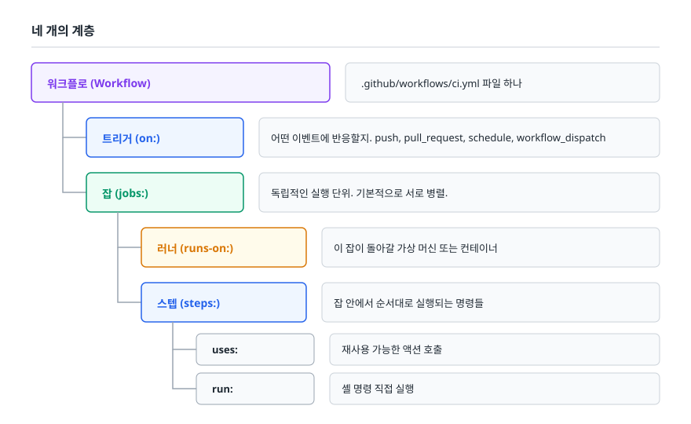
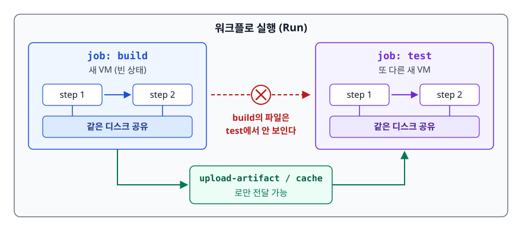
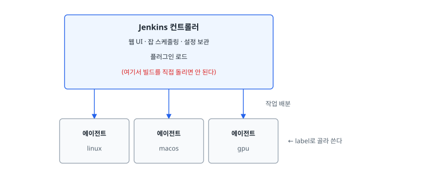
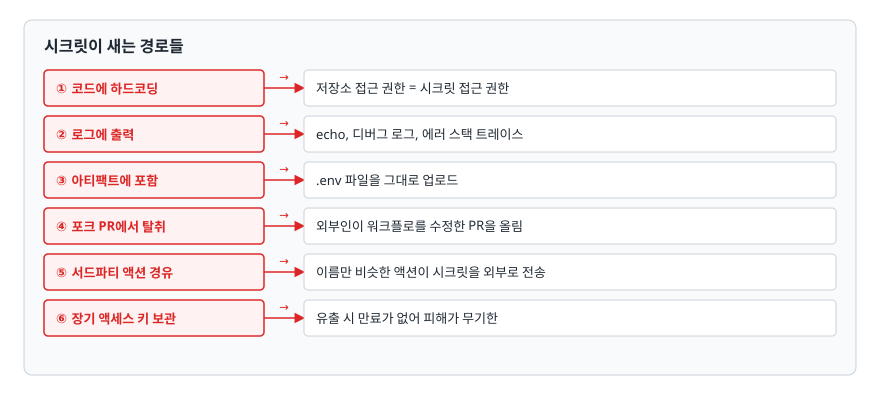

# 파이프라인 도구 (GitHub Actions / Jenkins)

> 워크플로 YAML을 읽고 쓸 수 있게 되는 것을 넘어, 잡과 러너가 어떤 격리 모델 위에서 돌아가는지 알기 때문에 캐시·시크릿·빌드 시간 문제를 스스로 진단할 수 있게 된다.

## 학습 목표

- [ ] GitHub Actions의 트리거/잡/스텝/러너 구조와 실행 격리 모델을 설명할 수 있다
- [ ] 동작하는 CI 워크플로 YAML을 처음부터 작성할 수 있다
- [ ] Jenkins의 컨트롤러/에이전트 구조와 GitHub Actions의 차이를 설명할 수 있다
- [ ] 시크릿이 유출되는 경로를 알고 OIDC로 장기 키를 없앨 수 있다
- [ ] 캐시 키를 올바르게 설계하고 캐시 오염을 진단할 수 있다
- [ ] 자체 호스팅 러너를 언제 써야 하고 언제 쓰면 안 되는지 판단할 수 있다

## 선행 지식

- [01-cicd-concepts.md](./01-cicd-concepts.md) - CI 파이프라인 단계 설계
- YAML 문법과 Docker 이미지의 기본 개념

---

## 1. 왜 필요한가 — 빌드 서버를 사람이 관리하던 시절

CI를 하기로 마음먹었다면 "빌드와 테스트를 돌려줄 컴퓨터"가 필요하다. 처음엔 사무실 구석의 남는 PC 한 대에 빌드 스크립트를 걸어두는 것으로 시작한다. 그리고 이런 일들이 순서대로 일어난다.

- 새 프로젝트가 Java 21을 쓰는데 빌드 서버엔 Java 17만 깔려 있다. 21을 깔았더니 기존 프로젝트가 깨진다
- 빌드 서버에만 있는 전역 설정 파일에 의존하는 스크립트가 생긴다. 서버를 재설치하면 아무도 복구 못 한다
- 배포용 SSH 키와 클라우드 액세스 키가 서버 안에 평문으로 쌓인다

여기서 두 가지 요구가 나온다. **첫째, 실행 환경은 매번 깨끗해야 한다.** 둘째, **파이프라인 정의는 서버가 아니라 저장소 안에 코드로 있어야 한다.** 파이프라인이 코드로 저장소에 있으면 리뷰 대상이 되고, 브랜치별로 다를 수 있고, 되돌릴 수 있다.

비유하자면 **공유 주방과 밀키트**의 차이다. 공유 주방은 앞사람이 쓴 흔적이 남아서 내 요리 결과가 달라지지만, 밀키트는 매번 같은 재료가 봉인된 채로 온다.

> 비유의 한계: 밀키트는 재료가 완전히 고정되지만, CI 러너 이미지는 도구 버전이 갱신된다. `ubuntu-latest`가 어느 날 조용히 바뀌어 빌드가 깨지는 일이 실제로 있다. 그래서 언어 런타임 버전은 러너 이미지에 맡기지 말고 워크플로에서 명시적으로 고정한다.

---

## 2. GitHub Actions의 구조

### 네 개의 계층

<!-- diagram:cloud-pipeline-tools-1 -->


<!-- 위 그림이 대체한 원본 ASCII.
     내용을 고칠 때는 그림도 함께 갱신할 것.
```
워크플로 (Workflow)  .github/workflows/ci.yml 파일 하나
  ├─ 트리거 (on:)     어떤 이벤트에 반응할지. push, pull_request, schedule, workflow_dispatch
  └─ 잡 (jobs:)       독립적인 실행 단위. 기본적으로 서로 병렬.
       ├─ 러너 (runs-on:)  이 잡이 돌아갈 가상 머신 또는 컨테이너
       └─ 스텝 (steps:)    잡 안에서 순서대로 실행되는 명령들
            ├─ uses: 재사용 가능한 액션 호출
            └─ run:  셸 명령 직접 실행
```
-->

### 실행 격리 모델 — 초심자가 가장 많이 넘어지는 지점

<!-- diagram:cloud-pipeline-tools-2 -->


<!-- 위 그림이 대체한 원본 ASCII.
     내용을 고칠 때는 그림도 함께 갱신할 것.
```
┌─────────────────────── 워크플로 실행 (Run) ───────────────────────┐
│  ┌──── job: build ────┐        ┌──── job: test ────┐             │
│  │ 새 VM (빈 상태)     │        │ 또 다른 새 VM      │             │
│  │  step 1 ─▶ step 2  │        │  step 1 ─▶ step 2 │             │
│  │  같은 디스크 공유   │        │  같은 디스크 공유  │             │
│  └────────────────────┘        └───────────────────┘             │
│           │                              ▲                        │
│           │  build의 파일은 test에서 안 보인다                     │
│           └──── upload-artifact / cache 로만 전달 가능 ───────────┘│
└───────────────────────────────────────────────────────────────────┘
```
-->

- **스텝끼리는 같은 파일 시스템을 공유한다.** 앞 스텝이 만든 `build/` 디렉터리를 뒤 스텝이 그대로 쓴다.
- **잡끼리는 아무것도 공유하지 않는다.** 잡이 끝나면 VM이 통째로 사라진다. 잡 간에 파일을 넘기려면 아티팩트 업로드/다운로드나 캐시를 써야 한다.
- 스텝 간 환경 변수도 셸 프로세스가 스텝마다 새로 뜨기 때문에 `export`로는 전달되지 않는다. `$GITHUB_ENV` 파일에 써야 다음 스텝으로 넘어간다.

### 실제 동작하는 CI 워크플로

Node.js 프로젝트를 예로 든다. 필요한 요소를 다 넣되 과하지 않은 수준이다.

```yaml
# .github/workflows/ci.yml
name: CI

on:
  pull_request:
    branches: [main]
  push:
    branches: [main]
  workflow_dispatch:        # 수동 실행 버튼

# 같은 PR에 연속 푸시하면 이전 실행을 취소해 러너 낭비를 막는다
concurrency:
  group: ci-${{ github.ref }}
  cancel-in-progress: true

# 최소 권한 원칙. 명시하지 않으면 기본 권한이 넓게 잡힐 수 있다
permissions:
  contents: read

jobs:
  lint:
    runs-on: ubuntu-latest
    steps:
      - uses: actions/checkout@v4
      - uses: actions/setup-node@v4
        with:
          node-version: '20'
          cache: 'npm'          # setup-node가 npm 캐시를 알아서 처리
      - run: npm ci
      - run: npm run lint

  test:
    runs-on: ubuntu-latest
    steps:
      - uses: actions/checkout@v4
      - uses: actions/setup-node@v4
        with:
          node-version: '20'
          cache: 'npm'
      - run: npm ci
      - run: npm test -- --coverage

  build:
    needs: [lint, test]         # 앞의 두 잡이 모두 성공해야 실행
    runs-on: ubuntu-latest
    steps:
      - uses: actions/checkout@v4   # 새 러너이므로 체크아웃부터 다시 한다
      - uses: actions/setup-node@v4
        with:
          node-version: '20'
          cache: 'npm'
      - run: npm ci
      - run: npm run build
      - uses: actions/upload-artifact@v4
        with:
          name: dist-${{ github.sha }}   # 어느 커밋의 산출물인지 특정 가능
          path: dist/
```

읽는 순서는 이렇다. `on:`이 언제 도는지, `jobs:` 아래에 몇 개의 잡이 있는지, `needs:`로 어떤 순서가 강제되는지. `needs`가 없는 `lint`와 `test`는 동시에 시작한다. 세 잡 모두 체크아웃과 `npm ci`를 반복하는 것이 낭비처럼 보이지만, 잡마다 러너가 달라 피할 수 없다. 아티팩트 이름에 커밋 해시를 붙인 것은 [01-cicd-concepts.md](./01-cicd-concepts.md)의 "한 번 빌드, 여러 번 배포" 원칙과 이어진다. 참고로 테스트 리포트처럼 실패했을 때 더 필요한 산출물은 스텝에 `if: always()`를 붙여야 남는다. 기본값은 앞 스텝이 실패하면 이후 스텝을 건너뛰는 것이기 때문이다.

---

## 3. Jenkins와의 비교

### Jenkins의 구조

<!-- diagram:cloud-pipeline-tools-3 -->


<!-- 위 그림이 대체한 원본 ASCII.
     내용을 고칠 때는 그림도 함께 갱신할 것.
```
┌──────────────────────────────────────┐
│         Jenkins 컨트롤러              │
│  웹 UI · 잡 스케줄링 · 설정 보관       │
│  플러그인 로드                        │
│  (여기서 빌드를 직접 돌리면 안 된다)   │
└───────────────┬──────────────────────┘
     ┌──────────┼──────────┐  작업 배분
     ▼          ▼          ▼
┌─────────┐ ┌─────────┐ ┌─────────┐
│ 에이전트 │ │ 에이전트 │ │ 에이전트 │
│ linux    │ │ macos    │ │ gpu      │   ← label로 골라 쓴다
└─────────┘ └─────────┘ └─────────┘
```
-->

Jenkins도 파이프라인을 저장소의 `Jenkinsfile`로 관리하는 것이 현재의 표준이다.

```groovy
// Jenkinsfile
pipeline {
    agent { label 'linux' }
    environment {
        // Jenkins Credentials에 등록된 값을 환경 변수로 주입
        REGISTRY_CRED = credentials('registry-login')
    }
    options { timeout(time: 30, unit: 'MINUTES') }
    stages {
        stage('Build') { steps { sh 'npm ci && npm run build' } }
        stage('Test') {
            parallel {
                stage('unit')  { steps { sh 'npm run test:unit' } }
                stage('integ') { steps { sh 'npm run test:integ' } }
            }
        }
        stage('Approve') {
            when { branch 'main' }
            steps { input message: '운영 배포를 승인하시겠습니까?' }
        }
    }
    post {
        always  { junit 'reports/**/*.xml' }
        failure { echo '실패 알림 전송 지점' }
    }
}
```

### 비교

| 항목 | GitHub Actions | Jenkins |
|------|---------------|---------|
| 운영 주체 | GitHub이 러너 인프라 제공 (SaaS) | 우리가 컨트롤러와 에이전트를 직접 운영 |
| 파이프라인 정의 | YAML | Groovy 기반 DSL (선언형/스크립트형) |
| 확장 방식 | Marketplace의 Action 조합 | 플러그인 설치 |
| 실행 환경 | 잡마다 새 VM. 기본이 격리 | 에이전트를 재사용하는 경우가 많아 상태가 남기 쉽다 |
| 학습 곡선 | 낮다 | 높다. 플러그인 조합 지식이 필요 |
| 관리 부담 | 낮다 | 컨트롤러 백업, 플러그인 버전 충돌, 보안 패치가 상시 업무 |
| 강한 지점 | GitHub 이벤트와의 밀착, 빠른 시작 | 사내망/특수 하드웨어, 복잡한 승인 흐름, 기존 자산 재활용 |
| 과금 모델 | 관리형 러너의 사용 시간을 계량해 과금. 자체 호스팅 러너는 계량 대상이 아니고, 퍼블릭 저장소의 표준 러너도 계량되지 않는다 | 도구는 무료. 서버 비용과 사람의 운영 시간이 비용 |

**언제 뭘 쓰나**: GitHub에 코드가 있고 새로 시작하는 프로젝트면 GitHub Actions가 기본값이다. 사내망 안쪽 자원에만 접근 가능하거나, 이미 수백 개의 Jenkins 잡이 돌고 있거나, 빌드에 특수 하드웨어가 필요하면 Jenkins를 유지하는 편이 낫다. 둘을 섞어 GitHub Actions가 트리거하고 Jenkins가 배포를 맡는 구성도 흔하다. Jenkins의 진짜 비용은 라이선스가 아니라 **플러그인 생태계 관리**라는 점을 기억해두면 판단이 쉬워진다. 플러그인 A를 올려야 하는데 플러그인 B가 그 버전을 지원 안 해서 못 올리고, 그러다 보안 권고가 나오는 상황이 반복된다.

---

## 4. 시크릿 관리

### 시크릿이 새는 경로들

파이프라인은 배포 권한을 가진 자동화이므로, 파이프라인 탈취는 곧 인프라 탈취다.

<!-- diagram:cloud-pipeline-tools-4 -->


<!-- 위 그림이 대체한 원본 ASCII.
     내용을 고칠 때는 그림도 함께 갱신할 것.
```
① 코드에 하드코딩       → 저장소 접근 권한 = 시크릿 접근 권한
② 로그에 출력           → echo, 디버그 로그, 에러 스택 트레이스
③ 아티팩트에 포함       → .env 파일을 그대로 업로드
④ 포크 PR에서 탈취      → 외부인이 워크플로를 수정한 PR을 올림
⑤ 서드파티 액션 경유    → 이름만 비슷한 액션이 시크릿을 외부로 전송
⑥ 장기 액세스 키 보관   → 유출 시 만료가 없어 피해가 무기한
```
-->

### 방어 방법

**저장 위치별 범위를 구분한다.** 조직 시크릿은 여러 저장소가 공유하고, 저장소 시크릿은 그 저장소만, 환경(Environment) 시크릿은 특정 환경에 배포하는 잡만 접근한다. 운영 배포 자격증명은 환경 시크릿에 두고 그 환경에 승인자를 지정하면, 사람의 승인 전에는 시크릿이 실행 컨텍스트에 들어가지 않는다. 함께 `GITHUB_TOKEN` 권한도 워크플로 맨 위에서 `contents: read`로 좁히고 필요한 잡에서만 늘린다.

**포크 PR에서는 시크릿이 주입되지 않는다.** `pull_request` 이벤트는 포크에서 온 경우 시크릿을 비우고 `GITHUB_TOKEN`도 읽기 전용으로 준다. 그런데 `pull_request_target`은 다르다. 이 이벤트는 **베이스 저장소 컨텍스트에서 시크릿을 가진 채로** 실행된다. 여기서 포크의 코드를 체크아웃해서 실행하면 외부인에게 시크릿을 넘겨주는 것과 같다. 꼭 써야 한다면 포크 코드를 실행하지 않는 작업(라벨링 등)에만 쓴다.

**장기 키 대신 OIDC를 쓴다.** 클라우드 액세스 키를 시크릿에 저장하는 대신, 워크플로가 발급받은 단기 토큰으로 IAM 역할을 위임받는 방식이다.

```yaml
jobs:
  deploy:
    runs-on: ubuntu-latest
    permissions:
      id-token: write       # OIDC 토큰 발급에 필요
      contents: read
    steps:
      - uses: actions/checkout@v4
      - uses: aws-actions/configure-aws-credentials@v4
        with:
          role-to-assume: arn:aws:iam::123456789012:role/github-actions-deploy
          aws-region: ap-northeast-2
      - run: aws s3 sync ./dist s3://my-bucket/
```

이렇게 하면 저장소에 보관되는 장기 자격증명이 없다. IAM 역할의 신뢰 정책에서 특정 저장소와 특정 브랜치만 허용하도록 조건을 걸면, 다른 저장소의 워크플로가 이 역할을 위임받을 수 없다.

**서드파티 액션은 커밋 SHA로 고정한다.** `uses: some-org/some-action@v1`은 태그이고, 태그는 이동 가능하다. 액션 저장소가 탈취되면 `v1` 태그가 악성 코드를 가리키도록 바뀔 수 있다. 민감한 작업이 있는 워크플로에서는 `@<40자리 커밋 SHA>`로 고정한다.

---

## 5. 캐싱으로 빌드 시간 줄이기

캐시 대상은 **재생성 가능하지만 오래 걸리는 것**이다. 의존성 디렉터리, 컴파일 중간 산출물, 도커 레이어가 여기 해당한다. **빌드 결과물 자체는 캐시가 아니라 아티팩트**로 다룬다. 캐시는 없어도 파이프라인이 성립해야 하고, 아티팩트는 없으면 다음 단계가 실패한다.

### 캐시 키 설계

```yaml
- uses: actions/cache@v4
  with:
    path: ~/.gradle/caches
    key: gradle-${{ runner.os }}-${{ hashFiles('**/*.gradle*', 'gradle/wrapper/gradle-wrapper.properties') }}
    restore-keys: |
      gradle-${{ runner.os }}-
```

키 설계의 원칙은 하나다. **캐시 내용이 달라져야 하는 입력을 전부 키에 넣는다.**

- `hashFiles()`로 잠금 파일이나 빌드 스크립트의 해시를 넣는다. 의존성이 바뀌면 키가 바뀌어 새 캐시를 만든다
- `runner.os`를 넣는다. 리눅스에서 만든 네이티브 바이너리 캐시를 macOS 러너가 쓰면 깨진다
- `restore-keys`는 정확히 일치하는 키가 없을 때의 대체 후보다. 접두어가 일치하는 가장 최근 캐시를 가져와 부분적으로 재사용한다

### 도커 레이어 캐시

컨테이너 이미지를 빌드한다면 여기가 시간을 가장 많이 잡아먹는 지점이다.

```yaml
- uses: docker/setup-buildx-action@v3
- uses: docker/login-action@v3
  with:
    registry: ghcr.io
    username: ${{ github.actor }}
    password: ${{ secrets.GITHUB_TOKEN }}
- uses: docker/build-push-action@v5
  with:
    context: .
    push: true
    tags: ghcr.io/${{ github.repository }}:${{ github.sha }}
    cache-from: type=gha          # 이전 빌드의 레이어를 가져온다
    cache-to: type=gha,mode=max   # 중간 레이어까지 전부 저장
```

도커 캐시는 Dockerfile의 작성 순서가 효과를 좌우한다. 의존성 설치를 소스 복사보다 **앞에** 두어야 소스가 바뀔 때마다 의존성을 다시 받지 않는다.

```dockerfile
# 나쁜 순서 - 소스가 한 글자만 바뀌어도 npm ci를 다시 한다
COPY . .
RUN npm ci

# 좋은 순서 - package-lock.json이 안 바뀌면 캐시 적중
COPY package.json package-lock.json ./
RUN npm ci
COPY . .
```

### 장애 시나리오 — 캐시가 오염됐다

```
증상   : 로컬에서는 통과하는 테스트가 CI에서만 실패. 재실행해도 동일.
         로그를 보니 라이브러리 버전이 잠금 파일과 다르다.
진단   : 1) 실패한 실행 로그에서 "Cache restored from key: ..." 줄을 찾는다
         2) 그 키가 현재 잠금 파일의 해시와 맞는지 본다
         3) 캐시를 끄고(워크플로에서 임시로 제거) 재실행해 정상 통과하는지 확인
원인   : 캐시 키에 잠금 파일 해시가 빠졌거나, restore-keys가 너무 느슨해서
         오래된 캐시를 끌어왔다. 또는 캐시된 디렉터리 안에 빌드 결과물이 섞여 있다.
대응   : 즉시 - 저장소 설정에서 해당 캐시 항목을 삭제하고 재실행
         근본 - 키에 hashFiles(잠금 파일)를 넣고, restore-keys 접두어를 좁힌다.
         캐시 경로에서 빌드 산출물 디렉터리를 제외한다.
```

캐시 관련 문제를 진단할 때의 원칙: **캐시를 지우고도 재현되면 캐시 문제가 아니다.** 이 한 번의 확인으로 조사 범위가 절반으로 준다.

---

## 6. 매트릭스 빌드

같은 스텝을 여러 조합으로 돌려야 할 때 쓴다. 라이브러리가 여러 런타임 버전을 지원해야 하거나, 여러 OS에서 동작을 보장해야 할 때다.

```yaml
jobs:
  test:
    runs-on: ${{ matrix.os }}
    strategy:
      fail-fast: false        # 하나 실패해도 나머지는 계속 (실패 범위 파악용)
      max-parallel: 4
      matrix:
        os: [ubuntu-latest, windows-latest]
        node: ['18', '20', '22']
        exclude:
          - os: windows-latest
            node: '18'        # 이 조합은 지원 대상이 아님
    steps:
      - uses: actions/checkout@v4
      - uses: actions/setup-node@v4
        with:
          node-version: ${{ matrix.node }}
      - run: npm ci
      - run: npm test
```

위 정의는 2×3에서 제외 1개를 뺀 5개 잡을 만든다. 주의할 점 둘과 응용 하나가 있다.

- **`fail-fast`의 기본값은 참이다.** 하나가 실패하면 나머지가 취소된다. "어느 조합에서만 깨지는가"를 알아야 하는 상황에서는 꺼야 한다.
- **매트릭스는 러너 사용 시간을 곱한다.** 조합이 늘수록 비용과 대기열이 함께 늘어난다. PR에서는 대표 조합 하나만, 야간이나 릴리스 전에 전체 매트릭스를 돌리는 분리가 현실적이다.
- **테스트 샤딩에도 쓴다.** 테스트 스위트를 N등분해 병렬로 돌려 전체 시간을 줄이는 방식인데, 각 샤드의 결과를 합치는 잡이 하나 더 필요하다.

---

## 7. 자체 호스팅 러너

### 언제 쓰나

- **사내망 안쪽에만 있는 자원**에 접근해야 할 때. 폐쇄망 DB, 온프레미스 아티팩트 저장소, 사내 인증 서버
- **특수 하드웨어**가 필요할 때. GPU 빌드/테스트, 특정 아키텍처 크로스 컴파일
- **빌드가 무겁거나 캐시가 거대해서** 관리형 러너에서는 시간이 과도할 때
- **규제상 소스와 빌드 산출물이 특정 경계 밖으로 나갈 수 없을 때**

### 절대 하면 안 되는 것

**퍼블릭 저장소에 자체 호스팅 러너를 붙이면 안 된다.** 누구나 포크를 떠서 워크플로를 수정한 PR을 올릴 수 있고, 그 워크플로가 우리 러너에서 실행되면 러너가 있는 네트워크 안에서 임의 코드가 도는 것과 같다. 러너가 사내망에 있다면 그대로 침투 경로가 된다.

### 운영할 때 챙길 것

- **격리**: 잡마다 새 컨테이너/VM에서 실행하거나 일회용(ephemeral) 러너로 폐기한다. 재사용 러너는 앞 잡의 파일과 프로세스가 남아 관리형 러너의 장점이 사라진다
- **디스크**: 워크스페이스, 도커 이미지, 캐시가 계속 쌓인다. 정리 잡이 없으면 언젠가 반드시 꽉 찬다
- **권한**: 러너 머신이 가진 IAM 역할과 네트워크 접근 범위가 곧 파이프라인의 권한이다. 최소 권한으로 잡는다
- **확장**: 대기열이 길어지면 러너를 늘려야 한다. Kubernetes 위에 띄워 수요에 따라 조절하는 구성이 일반적이다
- **버전**: 러너 에이전트와 빌드 도구 버전이 표류하지 않도록 이미지로 관리하고 코드로 갱신한다

### 장애 시나리오 — 파이프라인이 대기 상태에서 안 움직인다

```
증상   : 워크플로가 "Waiting for a runner" 상태로 멈춰 있다.
진단   : 1) 저장소/조직 설정의 러너 목록에서 온라인 상태를 본다
         2) 워크플로의 runs-on 라벨과 러너에 붙은 라벨이 정확히 같은지 대조한다
         3) 러너 머신에 접속해 에이전트 프로세스와 디스크 여유를 확인한다
           df -h            (디스크 여유)
           systemctl status <러너 서비스명>
원인   : 라벨 오타가 첫 번째로 흔하다. 다음이 디스크 부족으로 인한 러너 다운,
         그다음이 동시 실행 한도 초과로 인한 대기.
대응   : 즉시 - 러너 워크스페이스와 미사용 도커 이미지를 정리하고 에이전트 재시작
         근본 - 일회용 러너로 전환하고, 디스크 사용률 알림을 건다.
```

---

## 8. 실무에서는

파이프라인이 한두 개일 때는 안 보이다가, 서비스가 열 개쯤 되면 반드시 튀어나오는 문제가 둘 있다.

**워크플로 중복.** 거의 같은 YAML이 저장소마다 한 벌씩 생기고, 하나를 고치면 나머지가 조용히 뒤처진다. GitHub Actions는 두 가지 해법을 준다. 재사용 워크플로는 `workflow_call` 트리거를 가진 워크플로를 다른 워크플로에서 `uses:`로 호출해 **잡 단위**를 통째로 공유한다. 복합 액션(composite action)은 여러 스텝을 하나의 액션으로 묶어 **스텝 묶음**을 공유한다. 배포처럼 잡 구조가 통째로 같으면 전자, "체크아웃 → 언어 세팅 → 캐시 복원"처럼 앞머리만 같으면 후자다.

**모노레포에서 전부 도는 문제.** 문서 한 줄을 고쳤는데 서비스 열 개의 테스트가 다 돈다. 트리거에 `paths` 필터를 걸어 변경된 경로에 해당하는 워크플로만 실행되게 한다. 다만 함정이 하나 있다. 브랜치 보호에서 필수 체크로 지정한 잡이 `paths` 때문에 아예 실행되지 않으면, 그 체크는 성공도 실패도 아닌 상태로 남아 PR이 영원히 머지 대기가 된다. 필수 체크 목록과 `paths` 필터는 반드시 같이 놓고 확인한다.

여기에 하나 더. **파이프라인 자체도 관측 대상이다.** 어느 잡이 가장 오래 걸리는지, 어떤 테스트가 가장 자주 깜빡이는지, 캐시 적중률이 얼마인지를 주기적으로 본다. 측정하지 않으면 파이프라인 시간은 한 번도 줄지 않고 늘어나기만 한다.

---

## 9. 면접 포인트

> 면접에서 이 주제가 나오면 이렇게 답한다

**Q. GitHub Actions에서 잡과 스텝의 차이를 설명해주세요.**

A. 스텝은 하나의 잡 안에서 순서대로 실행되는 명령이고, 같은 실행 환경과 파일 시스템을 공유합니다. 잡은 독립적인 실행 단위로 각각 별도의 러너에서 돌고, 기본적으로 서로 병렬입니다. 잡 사이에는 파일 시스템이 공유되지 않기 때문에 빌드 산출물을 다음 잡으로 넘기려면 아티팩트 업로드와 다운로드를 써야 합니다. 순서를 강제하려면 `needs`로 의존 관계를 선언합니다.

- 꼬리 질문: "그럼 잡을 나누는 기준은 뭔가요?" → 병렬로 돌릴 수 있는가, 실행 환경이 다른가, 실패했을 때 재실행 단위로 적절한가. 이유 없이 나누면 체크아웃과 의존성 설치가 중복돼 오히려 느려진다.

**Q. CI에서 클라우드 자격증명을 어떻게 관리하시겠습니까?**

A. 장기 액세스 키를 저장소 시크릿에 넣는 방식은 피합니다. 유출되면 만료가 없고 회수 전까지 계속 유효하기 때문입니다. 대신 OIDC를 써서 워크플로가 발급받은 단기 토큰으로 IAM 역할을 위임받게 하고, 역할의 신뢰 정책에서 특정 저장소와 브랜치만 허용하도록 조건을 겁니다. 운영 배포용 자격증명은 환경 시크릿에 두고 그 환경에 승인자를 지정해서, 승인 없이는 시크릿이 실행 컨텍스트에 주입되지 않게 합니다.

- 꼬리 질문: "포크에서 온 PR은 어떻게 되나요?" → 시크릿이 주입되지 않고 토큰도 읽기 전용이라 안전하다. 다만 `pull_request_target`은 시크릿을 가진 채 실행되므로 포크 코드를 체크아웃해 실행하면 위험하다.

**Q. CI 빌드 시간이 20분입니다. 어떻게 줄이시겠습니까?**

A. 먼저 어디서 시간이 가는지 단계별로 측정합니다. 대개 의존성 설치와 도커 빌드가 대부분을 차지합니다. 의존성은 잠금 파일 해시를 키로 캐시하고, 도커는 의존성 설치 레이어를 소스 복사보다 앞에 두어 레이어 캐시가 살도록 Dockerfile 순서를 정리합니다. 그다음 잡을 병렬로 쪼갭니다. 린트와 단위 테스트는 서로 의존이 없으니 동시에 돌릴 수 있고, 테스트 자체도 샤딩으로 나눌 수 있습니다. 그래도 길면 E2E 같은 느린 단계를 PR 파이프라인 밖으로 뺍니다.

- 꼬리 질문: "캐시를 넣었는데 오히려 안 빨라졌다면?" → 캐시 적중률을 확인한다. 키에 매번 바뀌는 값이 들어가 있으면 매번 미스가 나고, 캐시를 저장하고 복원하는 시간만 추가된다.

**Q. Jenkins 대신 GitHub Actions를 쓰자고 제안하려면 어떤 근거를 들겠습니까?**

A. 관리 비용과 격리 수준입니다. Jenkins는 컨트롤러 백업, 플러그인 버전 충돌 해결, 보안 패치가 상시 업무로 남습니다. 또 에이전트를 재사용하는 구성이 많아 앞 빌드의 상태가 남고 "이 서버에서만 빌드된다"는 문제가 생기기 쉽습니다. GitHub Actions는 잡마다 새 환경이 기본이라 이 문제가 줄어듭니다. 다만 사내망 자원 접근이나 특수 하드웨어 때문에 자체 호스팅 러너를 쓰게 되면 관리 부담 일부는 돌아온다는 점도 함께 말합니다.

---

## 자주 하는 실수

| 실수 | 왜 틀렸나 | 올바른 이해 |
|------|----------|-----------|
| 잡 A에서 만든 파일을 잡 B에서 그냥 쓰려 함 | 잡마다 러너가 다르고 실행 후 폐기된다 | 아티팩트 업로드/다운로드 또는 캐시로 명시적으로 전달 |
| 스텝에서 `export VAR=x` 하고 다음 스텝에서 사용 | 스텝마다 셸이 새로 뜬다 | `echo "VAR=x" >> $GITHUB_ENV` 로 전달 |
| 빌드 산출물을 캐시에 넣음 | 캐시는 없어도 되는 것, 아티팩트는 없으면 안 되는 것 | 산출물은 아티팩트, 재생성 가능한 중간물은 캐시 |
| 캐시 키에 잠금 파일 해시를 안 넣음 | 의존성이 바뀌어도 옛 캐시를 쓴다 | `hashFiles('**/package-lock.json')` 같은 형태로 포함 |
| 서드파티 액션을 태그로 참조 | 태그는 이동 가능해 공급망 공격 표면이 된다 | 민감 워크플로는 커밋 SHA로 고정 |
| 퍼블릭 저장소에 자체 호스팅 러너 연결 | 포크 PR로 임의 코드가 우리 네트워크에서 실행된다 | 퍼블릭 저장소는 관리형 러너만 사용 |
| `pull_request_target`을 편하다고 사용 | 시크릿을 가진 채 포크 코드를 실행할 위험 | 포크 코드를 실행하지 않는 작업에만 제한적으로 |

---

## 한 줄 정리

파이프라인 도구는 YAML 문법이 아니라 **실행 격리 모델(잡마다 새 환경)과 신뢰 경계(시크릿이 어디까지 주입되는가)** 를 이해하는 것이 본질이며, 캐시·매트릭스·자체 호스팅 러너의 함정도 전부 이 두 축에서 파생된다.

---

## 연관 개념

- [01-cicd-concepts.md](./01-cicd-concepts.md) - 파이프라인 단계 설계와 테스트 배치 원칙
- [03-deployment-strategies.md](./03-deployment-strategies.md) - 파이프라인이 만든 아티팩트를 무중단으로 배포하는 방법
- [04-gitops.md](./04-gitops.md) - 파이프라인에 클러스터 권한을 주지 않는 Pull 모델
- [qna-cicd.md](./qna-cicd.md) - GitHub Actions와 Jenkins 비교 면접 질문
- [qna-docker.md](../containerization/docker/qna-docker.md) - 이미지 레이어와 Dockerfile 최적화
- [qna-aws.md](../aws/qna-aws.md) - IAM 역할과 자격증명 위임
