# 배포 전략 (Deployment Strategies)

> Rolling·Blue-Green·Canary·Recreate를 외워서 나열하는 수준을 넘어, 다운타임·비용·롤백 속도의 트레이드오프로 전략을 고르고, 무중단 배포를 실제로 망가뜨리는 DB 스키마 문제까지 대응할 수 있게 됩니다.

## 학습 목표

- [ ] 네 가지 배포 전략의 절차를 그림으로 설명할 수 있다
- [ ] 다운타임/추가 자원/롤백 속도/리스크 기준으로 전략을 선택할 수 있다
- [ ] 무중단 배포가 성립하기 위한 전제 조건(헬스체크, 우아한 종료, 하위 호환)을 나열할 수 있다
- [ ] DB 스키마 변경이 왜 무중단 배포를 깨뜨리는지 설명하고 확장-수축 패턴으로 해결할 수 있다
- [ ] Feature Flag로 배포와 릴리스를 분리하는 이유를 설명할 수 있다

## 선행 지식

- [01-cicd-concepts.md](./01-cicd-concepts.md) - 배포와 릴리스의 구분
- 로드 밸런서와 헬스 체크의 기본 개념

---

## 1. 왜 필요한가 — "새벽 2시 점검"의 진짜 비용

예전 배포 공지는 이렇게 생겼습니다. "3월 1일 02:00~03:00 서비스 점검이 있습니다."

한 시간의 다운타임이 매출 손실이라는 건 누구나 압니다. 그런데 더 깊은 비용이 따로 있습니다.

<!-- diagram:cloud-deployment-strategies-1 -->
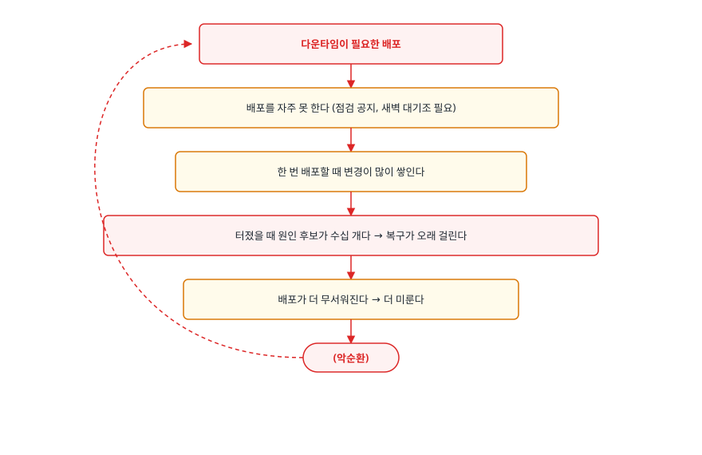

<!-- 위 그림이 대체한 원본 ASCII.
     내용을 고칠 때는 그림도 함께 갱신할 것.
```
다운타임이 필요한 배포
        ↓
배포를 자주 못 한다 (점검 공지, 새벽 대기조 필요)
        ↓
한 번 배포할 때 변경이 많이 쌓인다
        ↓
터졌을 때 원인 후보가 수십 개다 → 복구가 오래 걸린다
        ↓
배포가 더 무서워진다 → 더 미룬다
        ↓
        (악순환)
```
-->

무중단 배포는 "사용자가 안 끊기게 하는 기술"이면서 동시에 **이 악순환을 끊는 장치**입니다. 배포가 싸지면 배포 단위가 작아지고, 작아지면 장애 반경과 복구 시간이 같이 줄어듭니다.

무중단 배포의 아이디어 자체는 단순합니다. **새 버전과 기존 버전을 동시에 띄워두고 트래픽을 옮깁니다.** 어떻게 옮기느냐가 전략의 차이입니다.

---

## 2. 네 가지 전략

### Recreate — 다 내리고 다 올린다

```
시각 t0   [v1] [v1] [v1]      정상 서비스
시각 t1   [  ] [  ] [  ]      전부 종료 ← 이 구간이 다운타임
시각 t2   [v2] [v2] [v2]      새 버전 기동 (기동 시간만큼 더 소요)
```

가장 단순하고, 유일하게 다운타임이 있는 전략입니다. 그런데도 쓰는 이유가 있습니다.

- **두 버전이 절대 공존하면 안 되는 경우.** 배타적 락이 걸린 리소스를 쓰거나, 스키마가 호환되지 않는 변경을 한꺼번에 해야 할 때
- 내부 관리 도구나 배치 잡처럼 **잠깐의 중단이 문제가 안 되는 시스템**
- 스테이징 환경. 무중단을 흉내 낼 이유가 없습니다

Kubernetes Deployment에서 `strategy.type: Recreate`로 지정합니다.

### Rolling Update — 한 대씩 갈아탄다

<!-- diagram:cloud-deployment-strategies-2 -->
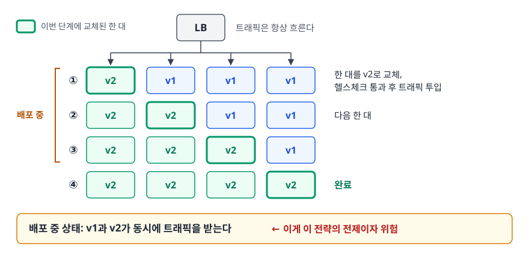

<!-- 위 그림이 대체한 원본 ASCII.
     내용을 고칠 때는 그림도 함께 갱신할 것.
```
   LB
    │  트래픽은 항상 흐른다
 ┌──┴──┬─────┬─────┐
 │     │     │     │
[v2]  [v1]  [v1]  [v1]     ① 한 대를 v2로 교체, 헬스체크 통과 후 트래픽 투입
[v2]  [v2]  [v1]  [v1]     ② 다음 한 대
[v2]  [v2]  [v2]  [v1]     ③
[v2]  [v2]  [v2]  [v2]     ④ 완료

배포 중 상태: v1과 v2가 동시에 트래픽을 받는다  ← 이게 이 전략의 전제이자 위험
```
-->

Kubernetes Deployment의 기본 전략입니다. 두 개의 손잡이로 속도와 안전성을 조절합니다.

- `maxSurge`: 목표 개수보다 몇 개까지 더 띄울 수 있는가. 크면 빠르지만 순간 자원 사용이 늘어납니다
- `maxUnavailable`: 몇 개까지 없어도 되는가. 0으로 두면 용량이 절대 줄지 않습니다

```yaml
spec:
  strategy:
    type: RollingUpdate
    rollingUpdate:
      maxSurge: 1
      maxUnavailable: 0     # 용량을 줄이지 않고 항상 하나 더 띄운 뒤 교체
```

**장점**: 추가 자원이 거의 안 듭니다. 별도 도구 없이 기본 기능으로 됩니다.
**단점**: 롤백도 같은 속도로 되감아야 해서 즉시가 아닙니다. 그리고 배포 중 두 버전이 공존하므로 **하위 호환이 깨지면 그 구간의 요청이 실패합니다.**

### Blue-Green — 통째로 하나 더 만들고 스위치를 넘긴다

<!-- diagram:cloud-deployment-strategies-3 -->
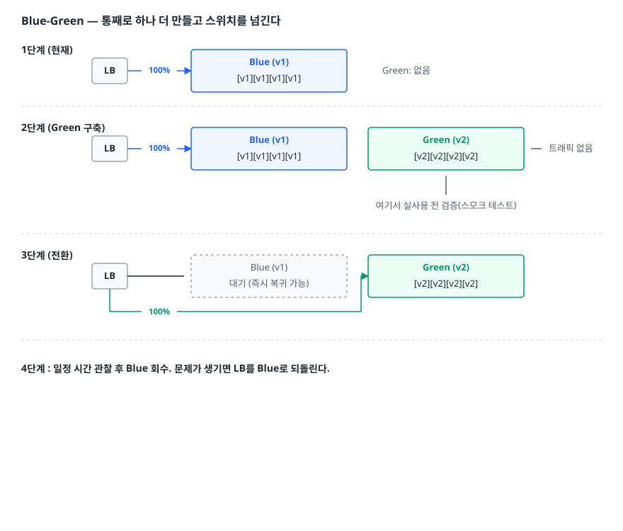

<!-- 위 그림이 대체한 원본 ASCII.
     내용을 고칠 때는 그림도 함께 갱신할 것.
```
1단계 (현재)
        LB ──100%──▶ ┌──── Blue (v1) ────┐        Green: 없음
                     │ [v1][v1][v1][v1]  │
                     └───────────────────┘

2단계 (Green 구축)
        LB ──100%──▶ ┌──── Blue (v1) ────┐   ┌──── Green (v2) ───┐
                     │ [v1][v1][v1][v1]  │   │ [v2][v2][v2][v2]  │ ← 트래픽 없음
                     └───────────────────┘   └───────────────────┘
                                                      ▲
                                          여기서 실사용 전 검증(스모크 테스트)

3단계 (전환)
        LB ─────────▶ ┌──── Blue (v1) ────┐   ┌──── Green (v2) ───┐
             └─100%──────────────────────────▶│ [v2][v2][v2][v2]  │
                      │ 대기 (즉시 복귀 가능) │   └───────────────────┘
                      └───────────────────┘

4단계 : 일정 시간 관찰 후 Blue 회수. 문제가 생기면 LB를 Blue로 되돌린다.
```
-->

**장점**: 롤백이 트래픽 전환 한 번이라 가장 빠릅니다. 전환 전에 실제와 동일한 환경에서 검증할 수 있습니다.
**단점**: 전환 직전 잠깐이지만 인프라를 두 벌 유지해야 합니다. 그리고 **상태를 가진 것**이 걸립니다. 두 환경이 같은 DB를 보므로 스키마 호환 문제는 그대로 남고, 인메모리 세션을 쓰면 전환 순간 사용자가 로그아웃됩니다.

### Canary — 소수에게 먼저 보내고 지켜본다

<!-- diagram:cloud-deployment-strategies-4 -->
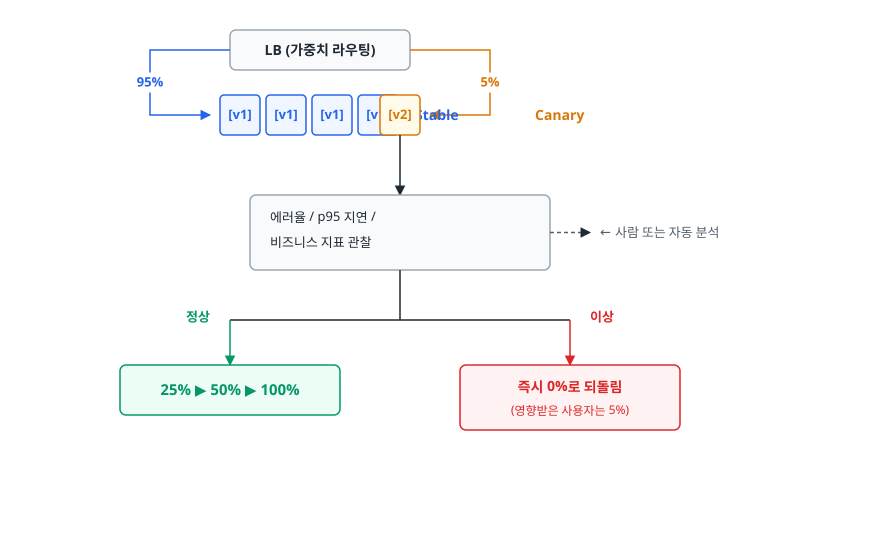

<!-- 위 그림이 대체한 원본 ASCII.
     내용을 고칠 때는 그림도 함께 갱신할 것.
```
      LB (가중치 라우팅)
       ├──── 95% ───▶ [v1][v1][v1][v1]   Stable
       └──── 5%  ───▶ [v2]               Canary
                        │
                        ▼
             ┌──────────────────────┐
             │ 에러율 / p95 지연 /    │
             │ 비즈니스 지표 관찰      │  ← 사람 또는 자동 분석
             └──────────┬───────────┘
                        │
          정상 ─────────┴───────── 이상
            │                       │
            ▼                       ▼
     25% ▶ 50% ▶ 100%          즉시 0%로 되돌림
                                (영향받은 사용자는 5%)
```
-->

이름은 탄광의 카나리아에서 왔습니다. 유독 가스에 사람보다 먼저 반응하는 새를 앞세워 위험을 감지하던 방식입니다.

> 비유의 한계: 탄광의 새는 소모품이지만 카나리 배포의 5%는 **실제 사용자**입니다. "5%니까 괜찮다"가 아니라 "5%로 제한하되 최대한 빨리 판정한다"가 목표입니다. 판정이 느리면 그만큼 오래 5%를 희생시킵니다.

**장점**: 실사용 트래픽으로 검증합니다. 스테이징에서 재현 불가능한 문제(실제 데이터 분포, 실제 동시성)를 잡아냅니다. 장애 반경이 비율만큼으로 제한됩니다.
**단점**: 관측 체계가 없으면 성립하지 않습니다. "5%를 보냈는데 잘 되고 있나?"를 판단할 지표가 없으면 그냥 느린 Rolling Update일 뿐입니다.

Kubernetes 기본 기능만으로는 부족해서 Argo Rollouts나 Flagger 같은 도구, 또는 서비스 메시의 가중치 라우팅을 함께 씁니다.

---

## 3. 비교와 선택

| 기준 | Recreate | Rolling | Blue-Green | Canary |
|------|----------|---------|-----------|--------|
| 다운타임 | 있음 | 없음 | 없음 | 없음 |
| 추가 자원 | 없음 | 소량 (maxSurge 만큼) | 전환 구간에 약 2배 | 소량 (카나리 몫) |
| 롤백 속도 | 재배포 시간만큼 | 되감는 시간만큼 (느림) | 즉시 (트래픽 전환) | 즉시 (가중치 0) |
| 두 버전 공존 | 없음 | 있음 (배포 중) | 있음 (전환 구간) | 있음 (검증 내내) |
| 장애 반경 | 전체 | 교체된 비율 | 전환 후 전체 | 카나리 비율만 |
| 필요한 것 | 없음 | 헬스체크 | 여분 자원, 트래픽 전환 장치 | 관측 지표, 가중치 라우팅 |
| 구현 난이도 | 매우 낮음 | 낮음 | 중간 | 높음 |
| 어울리는 상황 | 내부 도구, 배치, 호환 불가 변경 | 일반 웹 서비스의 기본값 | 즉시 롤백이 중요한 핵심 서비스 | 리스크가 큰 변경, 대규모 트래픽 |

**언제 뭘 쓰나**: 기본값은 Rolling입니다. 여기서 "롤백이 5분 걸리는 게 용납 안 되는가?"라면 Blue-Green으로, "이 변경이 실제 트래픽에서 어떻게 될지 모르겠는가?"라면 Canary로 올립니다. 전략을 올릴 때마다 필요한 인프라와 관측 요구가 함께 올라간다는 점을 기억합니다.

실무에서는 섞어 씁니다. Blue-Green으로 환경을 통째로 만들되 전환을 한 번에 하지 않고 가중치를 5%부터 올리는 방식이 흔합니다.

---

## 4. 무중단 배포가 성립하기 위한 전제 조건

전략을 고르기 전에 이것부터 갖춰야 합니다. 이게 없으면 어떤 전략을 써도 배포 중 요청이 실패합니다.

### 준비 상태와 생존 상태를 구분한다

<!-- diagram:cloud-deployment-strategies-5 -->
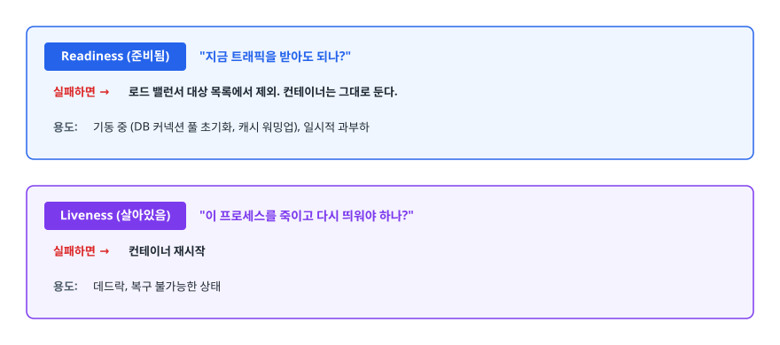

<!-- 위 그림이 대체한 원본 ASCII.
     내용을 고칠 때는 그림도 함께 갱신할 것.
```
Readiness (준비됨)  "지금 트래픽을 받아도 되나?"
   실패하면 → 로드 밸런서 대상 목록에서 제외. 컨테이너는 그대로 둔다.
   용도: 기동 중 (DB 커넥션 풀 초기화, 캐시 워밍업), 일시적 과부하

Liveness (살아있음)  "이 프로세스를 죽이고 다시 띄워야 하나?"
   실패하면 → 컨테이너 재시작
   용도: 데드락, 복구 불가능한 상태
```
-->

이 둘을 같은 엔드포인트로 붙이는 실수가 매우 흔합니다. 일시적으로 느려졌을 때 준비 상태만 빠져야 하는데 생존 검사까지 실패하면 프로세스가 재시작되고, 재시작 폭풍이 시작됩니다.

또 하나 중요한 건 **준비 검사가 의존성까지 확인해야 하는가**입니다. DB가 잠깐 느려졌다고 모든 인스턴스의 준비 검사가 동시에 실패하면 서비스 전체가 로드 밸런서에서 빠집니다. 준비 검사는 "내가 요청을 처리할 수 있는가"만 보고, 외부 의존성 장애는 별도 알림으로 다루는 편이 안전합니다.

### 우아한 종료(Graceful Shutdown)

<!-- diagram:cloud-deployment-strategies-6 -->
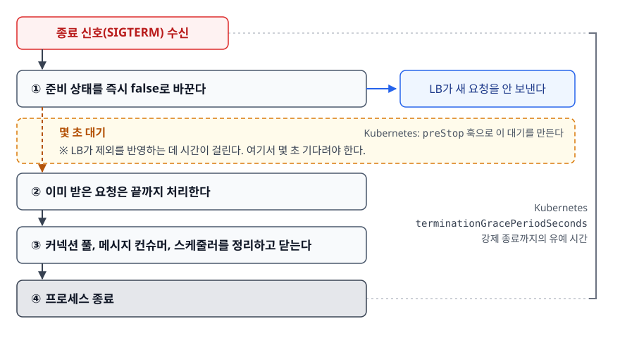

<!-- 위 그림이 대체한 원본 ASCII.
     내용을 고칠 때는 그림도 함께 갱신할 것.
```
종료 신호(SIGTERM) 수신
   │
   ├─ ① 준비 상태를 즉시 false로 바꾼다 → LB가 새 요청을 안 보낸다
   │      ※ LB가 제외를 반영하는 데 시간이 걸린다. 여기서 몇 초 기다려야 한다.
   │
   ├─ ② 이미 받은 요청은 끝까지 처리한다
   │
   ├─ ③ 커넥션 풀, 메시지 컨슈머, 스케줄러를 정리하고 닫는다
   │
   └─ ④ 프로세스 종료
```
-->

이 절차가 없으면 배포할 때마다 처리 중이던 요청이 잘려 사용자에게 오류가 갑니다. Kubernetes에서는 `terminationGracePeriodSeconds`로 강제 종료까지의 유예 시간을 주고, `preStop` 훅으로 ①의 대기 구간을 만듭니다.

### 두 버전이 공존해도 괜찮아야 한다

Rolling과 Canary는 물론이고 Blue-Green도 전환 구간에는 두 버전이 함께 삽니다. 그래서 다음이 지켜져야 합니다.

- **API 하위 호환**: v2가 v1의 요청 형식을 계속 받아줘야 합니다. 필드를 삭제하거나 이름을 바꾸는 변경은 한 번에 하면 안 됩니다
- **공유 캐시 호환**: v1이 쓴 캐시 값을 v2가 읽어도 깨지지 않아야 합니다. 직렬화 포맷이 바뀌면 캐시 키에 버전을 넣습니다
- **메시지 큐 호환**: v1이 넣은 메시지를 v2가, v2가 넣은 메시지를 v1이 처리할 수 있어야 합니다
- **DB 스키마 호환**: 다음 장 전체가 이 이야기입니다

---

## 5. DB 스키마 변경이 무중단 배포를 깨뜨리는 이유

<!-- diagram:cloud-deployment-strategies -->
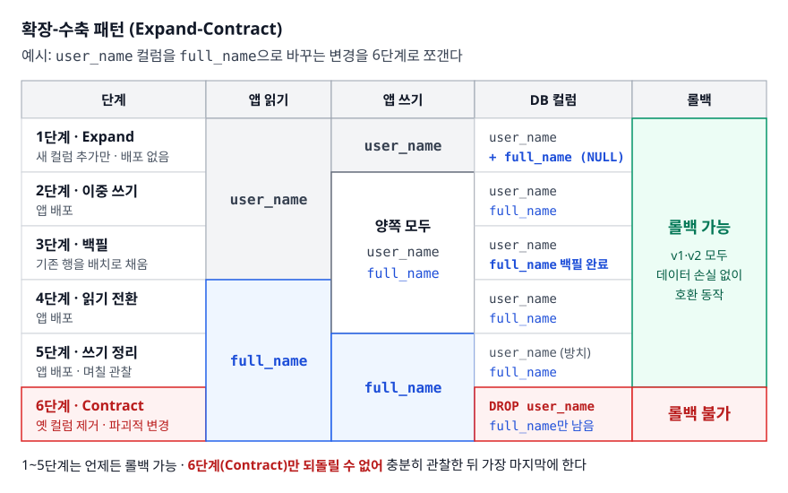

### 문제의 구조

애플리케이션 인스턴스는 여러 개고 배포 중에 버전이 섞이지만, **DB는 하나입니다.** 애플리케이션은 롤백하면 되돌아가지만 데이터는 되돌아가지 않습니다. 이 비대칭이 문제의 뿌리입니다.

```
    [v1] [v1] [v2] [v2]      애플리케이션은 배포 중 섞인다
      └────┬────┬────┘
           ▼    ▼
      ┌──────────────┐
      │      DB      │       그런데 DB는 한 벌이다
      └──────────────┘       스키마는 v1 기준일까 v2 기준일까?
```

구체적으로 무슨 일이 나는지 보겠습니다. `user_name` 컬럼을 `full_name`으로 바꾸는 작업을 "그냥" 했다고 가정합니다.

<!-- diagram:cloud-deployment-strategies-7 -->
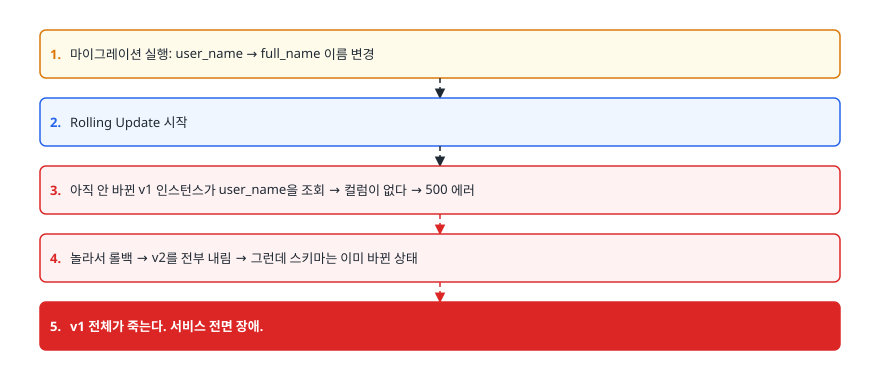

<!-- 위 그림이 대체한 원본 ASCII.
     내용을 고칠 때는 그림도 함께 갱신할 것.
```
1. 마이그레이션 실행: user_name → full_name 이름 변경
2. Rolling Update 시작
3. 아직 안 바뀐 v1 인스턴스가 user_name을 조회 → 컬럼이 없다 → 500 에러
4. 놀라서 롤백 → v2를 전부 내림 → 그런데 스키마는 이미 바뀐 상태
5. v1 전체가 죽는다. 서비스 전면 장애.
```
-->

핵심 교훈: **롤백 가능한 배포를 하려면 스키마 변경도 롤백 가능해야 하는데, 파괴적 변경은 롤백이 안 됩니다.** 그래서 파괴적 변경 자체를 하지 않는 방법이 필요합니다.

### 확장-수축 패턴 (Expand-Contract)

하나의 파괴적 변경을 여러 번의 비파괴적 변경으로 쪼갭니다. 각 단계 사이에 배포가 들어가고, 각 단계는 앞뒤 버전과 모두 호환됩니다.

<!-- diagram:cloud-deployment-strategies-8 -->
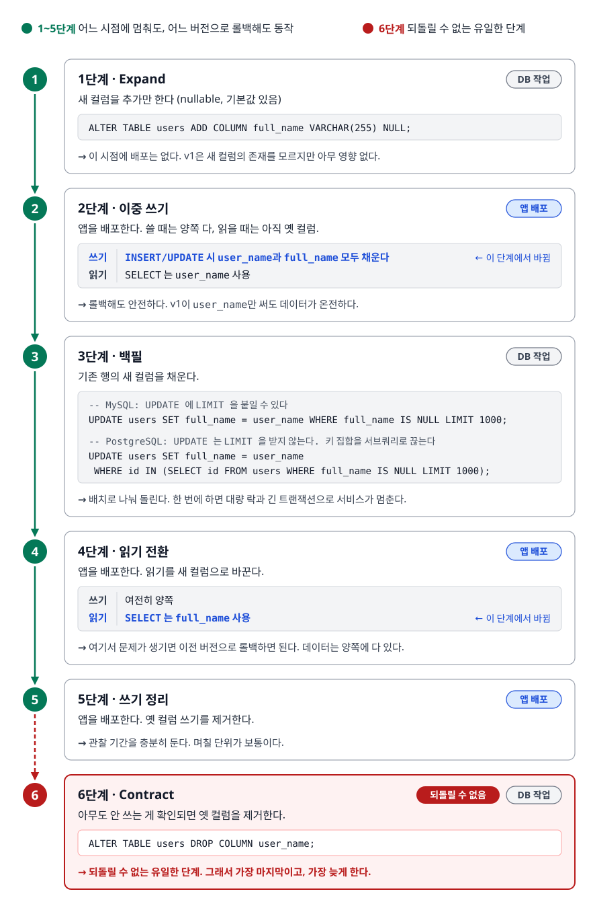

<!-- 위 그림이 대체한 원본 ASCII.
     내용을 고칠 때는 그림도 함께 갱신할 것.
```
[1단계 · Expand] 새 컬럼을 추가만 한다 (nullable, 기본값 있음)
    ALTER TABLE users ADD COLUMN full_name VARCHAR(255) NULL;
    → 이 시점에 배포는 없다. v1은 새 컬럼의 존재를 모르지만 아무 영향 없다.

[2단계 · 이중 쓰기] 앱을 배포한다. 쓸 때는 양쪽 다, 읽을 때는 아직 옛 컬럼.
    INSERT/UPDATE 시 user_name과 full_name 모두 채운다
    SELECT 는 user_name 사용
    → 롤백해도 안전하다. v1이 user_name만 써도 데이터가 온전하다.

[3단계 · 백필] 기존 행의 새 컬럼을 채운다.
    -- MySQL: UPDATE 에 LIMIT 을 붙일 수 있다
    UPDATE users SET full_name = user_name WHERE full_name IS NULL LIMIT 1000;
    -- PostgreSQL: UPDATE 는 LIMIT 을 받지 않는다. 키 집합을 서브쿼리로 끊는다
    UPDATE users SET full_name = user_name
     WHERE id IN (SELECT id FROM users WHERE full_name IS NULL LIMIT 1000);
    → 배치로 나눠 돌린다. 한 번에 하면 대량 락과 긴 트랜잭션으로 서비스가 멈춘다.

[4단계 · 읽기 전환] 앱을 배포한다. 읽기를 새 컬럼으로 바꾼다.
    SELECT 는 full_name 사용, 쓰기는 여전히 양쪽
    → 여기서 문제가 생기면 이전 버전으로 롤백하면 된다. 데이터는 양쪽에 다 있다.

[5단계 · 쓰기 정리] 앱을 배포한다. 옛 컬럼 쓰기를 제거한다.
    → 관찰 기간을 충분히 둔다. 며칠 단위가 보통이다.

[6단계 · Contract] 아무도 안 쓰는 게 확인되면 옛 컬럼을 제거한다.
    ALTER TABLE users DROP COLUMN user_name;
    → 되돌릴 수 없는 유일한 단계. 그래서 가장 마지막이고, 가장 늦게 한다.
```
-->

번거로워 보이지만 원리는 하나입니다. **어느 시점에 멈춰도, 어느 버전으로 롤백해도 시스템이 동작합니다.**

### 스키마 변경 자체가 서비스를 멈추는 경우

호환성과는 별개의 문제도 있습니다. 큰 테이블에 인덱스를 추가하거나 컬럼 타입을 바꾸면, DB 엔진과 버전에 따라 테이블 전체 락이 걸려 그동안 쿼리가 대기합니다. 개발 DB에서는 데이터가 적어 1초 만에 끝나던 것이 운영에서는 몇 분간 서비스를 멈춥니다.

대응은 세 가지입니다. 쓰는 DB와 버전이 그 변경을 온라인 DDL로 처리하는지 미리 확인하고, MySQL 계열이라면 `pt-online-schema-change`나 `gh-ost` 같은 무중단 스키마 변경 도구를 쓰고, 마이그레이션에 락 타임아웃을 걸어 오래 잡으면 스스로 포기하게 만듭니다.

### 장애 시나리오 — 롤백했는데 더 나빠졌다

<!-- diagram:cloud-deployment-strategies-9 -->
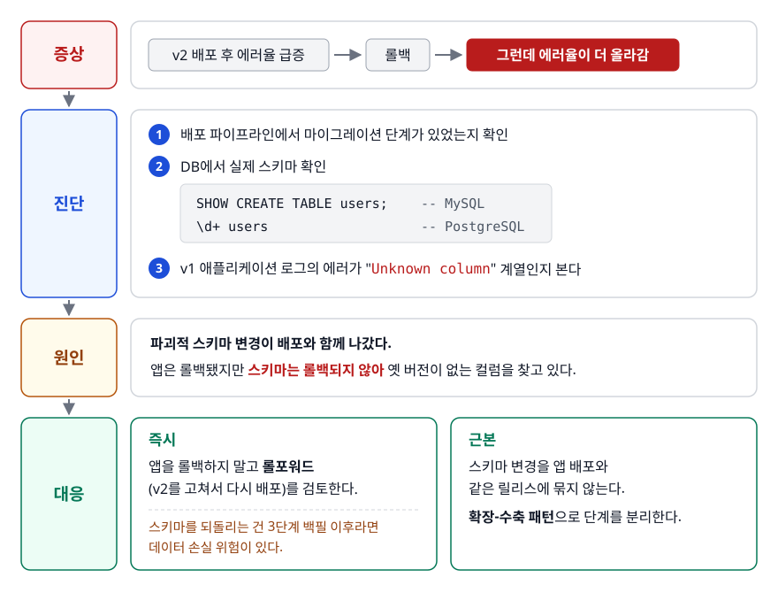

<!-- 위 그림이 대체한 원본 ASCII.
     내용을 고칠 때는 그림도 함께 갱신할 것.
```
증상   : v2 배포 후 에러율 급증 → 롤백 → 그런데 에러율이 더 올라감
진단   : 1) 배포 파이프라인에서 마이그레이션 단계가 있었는지 확인
         2) DB에서 실제 스키마 확인
              SHOW CREATE TABLE users;          -- MySQL
              \d+ users                          -- PostgreSQL
         3) v1 애플리케이션 로그의 에러가 "Unknown column" 계열인지 본다
원인   : 파괴적 스키마 변경이 배포와 함께 나갔다. 앱은 롤백됐지만
         스키마는 롤백되지 않아 옛 버전이 없는 컬럼을 찾고 있다.
대응   : 즉시 - 앱을 롤백하지 말고 롤포워드(v2를 고쳐서 다시 배포)를 검토한다.
         스키마를 되돌리는 건 3단계 백필 이후라면 데이터 손실 위험이 있다.
         근본 - 스키마 변경을 앱 배포와 같은 릴리스에 묶지 않는다.
                확장-수축 패턴으로 단계를 분리한다.
```
-->

**여기서 얻는 원칙**: 스키마 변경이 포함된 배포는 "롤백"이 항상 답이 아닙니다. 배포 전에 "이 배포는 롤백 가능한가, 아니면 롤포워드만 가능한가"를 미리 정해두고 그에 맞는 대응 절차를 준비합니다.

---

## 6. Feature Flag — 배포와 릴리스를 분리한다

### 왜 필요한가

지금까지의 전략은 전부 **인프라 층위**에서 트래픽을 조절했습니다. 그런데 훨씬 세밀한 조절이 필요할 때가 있습니다. 기능은 완성됐지만 마케팅 일정에 맞춰 특정 날짜에 켜야 하거나, 내부 직원이나 특정 고객사에만 먼저 열어야 하거나, 문제가 생겼을 때 배포 없이 그 기능만 꺼야 하는 경우입니다. 이런 요구는 인스턴스 단위 트래픽 전환으로는 못 풉니다. 코드 안에서 조건 분기해야 합니다.

```java
if (featureFlags.isEnabled("new-checkout", user)) {
    return newCheckoutFlow(order);
}
return legacyCheckoutFlow(order);
```

플래그 값을 설정 저장소나 전용 서비스에 두면, **재배포 없이 값만 바꿔서** 기능을 켜고 끌 수 있습니다.

<!-- diagram:cloud-deployment-strategies-10 -->
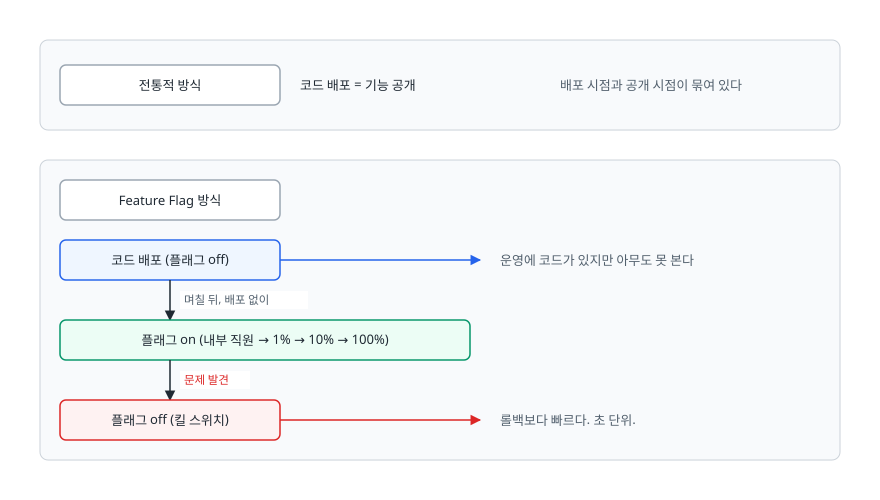

<!-- 위 그림이 대체한 원본 ASCII.
     내용을 고칠 때는 그림도 함께 갱신할 것.
```
전통적 방식
  코드 배포 = 기능 공개        배포 시점과 공개 시점이 묶여 있다

Feature Flag 방식
  코드 배포 (플래그 off)  ─────▶  운영에 코드가 있지만 아무도 못 본다
        │  며칠 뒤, 배포 없이
        ▼
  플래그 on (내부 직원 → 1% → 10% → 100%)
        │  문제 발견
        ▼
  플래그 off (킬 스위치)      ─▶  롤백보다 빠르다. 초 단위.
```
-->

### Canary와 무엇이 다른가

둘 다 점진적 노출이지만 층위가 다릅니다.

| | Canary 배포 | Feature Flag |
|---|---|---|
| 조절 대상 | 어느 인스턴스로 트래픽을 보낼까 | 어느 사용자에게 어떤 코드 경로를 줄까 |
| 조절 단위 | 요청 비율 | 사용자, 조직, 지역, 요금제 등 임의 속성 |
| 되돌리는 속도 | 가중치 변경 (수 초~수십 초) | 설정 값 변경 (즉시) |
| 대상 범위 | 배포 단위 전체 | 개별 기능 하나 |
| 비용 | 인프라 | 코드 복잡도 |

**언제 뭘 쓰나**: 배포 자체의 안전성을 확인하려면 Canary, 특정 기능의 노출을 통제하려면 Feature Flag. 실무에서는 둘을 겹쳐 씁니다. Canary로 배포가 안전한지 보고, 그 안에서 개별 기능은 플래그로 엽니다.

### 플래그 부채

Feature Flag의 비용은 **코드에 남는 조건 분기**입니다. 플래그가 100개 쌓이면 실제 실행 경로 조합이 폭발하고, 아무도 어떤 조합이 검증됐는지 모르게 됩니다. 그래서 플래그를 만들 때 **제거 예정일과 담당자를 함께 기록**하고, 완전히 켜진 지 오래된 플래그는 조건문과 함께 코드에서 삭제합니다. 장기 운영이 필요한 플래그(요금제별 기능 차단 등)와 임시 릴리스 플래그는 구분해서 관리합니다.

---

## 7. 실무에서는

배포 전략은 도구가 이미 대부분 제공합니다. 실무에서 실제로 시간을 쓰는 건 전략 선택이 아니라 **그 전략이 성립할 조건을 갖추는 일**입니다. Kubernetes를 쓴다면 Deployment의 RollingUpdate가 기본으로 주어지고, Argo Rollouts를 얹으면 Blue-Green과 Canary를 CRD로 선언할 수 있습니다. AWS에서 ECS나 Lambda를 쓴다면 CodeDeploy가 배포 방식과 자동 롤백 조건을 관리해줍니다. 어떤 도구를 쓰든 반드시 정해야 하는 것은 다음입니다.

- **판정 지표와 임계치**: 무엇을 보고 진행/중단을 결정하는가. 보통 에러율과 p95 지연이 기본이고, 결제 성공률 같은 비즈니스 지표를 함께 봅니다
- **관찰 시간**: 각 단계에서 얼마나 지켜볼 것인가. 너무 짧으면 문제가 드러나기 전에 다음 단계로 넘어갑니다
- **자동 롤백 조건**: 사람이 새벽에 대시보드를 보고 있을 수 없습니다
- **롤백 가능 여부**: 스키마 변경이나 데이터 마이그레이션이 포함됐다면 롤백이 아니라 롤포워드가 답일 수 있습니다

### 장애 시나리오 — 카나리가 정상인데 100%에서 터졌다

```
증상   : 카나리 5%, 25%, 50% 모두 지표 정상. 100% 전환 직후 장애.
진단   : 1) 카나리 구간과 100% 구간의 트래픽 특성을 비교한다
         2) 외부 의존성(DB 커넥션 수, 캐시, 외부 API 쿼터)의 포화 여부를 본다
         3) 카나리 인스턴스에 어떤 사용자가 라우팅됐는지 확인한다
원인   : 흔한 세 가지
         - 자원 포화형: 커넥션 풀이나 외부 API 쿼터가 5%에서는 안 걸리고
           100%에서만 걸린다. 비율에 비례하지 않는 임계 지점이 있다.
         - 캐시 워밍형: 카나리 한 대는 캐시가 금방 차지만, 전면 전환하면
           모든 인스턴스가 동시에 콜드 캐시가 되어 DB가 폭주한다.
         - 라우팅 편향형: 세션 고정(sticky session) 때문에 카나리에
           특정 사용자군만 계속 들어가 대표성이 없었다.
대응   : 즉시 - 트래픽을 이전 버전으로 되돌린다
         근본 - 마지막 단계를 100%로 한 번에 가지 말고 75% 같은 중간 단계를 둔다.
                커넥션 풀과 외부 쿼터 사용량을 카나리 판정 지표에 포함시킨다.
```

---

## 8. 면접 포인트

> 면접에서 이 주제가 나오면 이렇게 답한다

**Q. Blue-Green과 Canary 중 무엇을 쓰시겠습니까?**

A. 무엇을 걱정하느냐에 따라 다릅니다. 롤백 속도가 가장 중요하고 인프라를 두 벌 유지할 수 있으면 Blue-Green이 낫습니다. 전환이 로드 밸런서 한 번이라 되돌리는 것도 한 번입니다. 반면 이 변경이 실제 트래픽에서 어떻게 동작할지 확신이 없다면 Canary가 낫습니다. 장애 반경이 트래픽 비율만큼으로 제한되기 때문입니다. 다만 Canary는 판정할 지표와 자동 롤백이 없으면 그냥 느린 Rolling일 뿐이라, 관측 체계가 먼저 갖춰져 있어야 합니다.

- 꼬리 질문: "Blue-Green에서 DB는 어떻게 하나요?" → 두 환경이 같은 DB를 봅니다. 그래서 스키마는 두 버전 모두와 호환돼야 하고, 확장-수축 패턴이 필요합니다.

**Q. 무중단 배포를 구성했는데도 배포할 때마다 에러가 몇 건씩 발생합니다. 무엇을 확인하시겠습니까?**

A. 우아한 종료가 제대로 구현됐는지부터 봅니다. 종료 신호를 받았을 때 즉시 프로세스를 내리면 처리 중이던 요청이 잘립니다. 준비 상태를 먼저 false로 바꾸고, 로드 밸런서가 그 인스턴스를 제외할 때까지 몇 초 기다린 뒤, 진행 중인 요청을 끝내고 종료해야 합니다. 그다음으로 준비 검사 엔드포인트가 실제 트래픽 처리 가능 시점을 반영하는지 봅니다. 프로세스는 떴지만 커넥션 풀이 아직 준비 안 된 상태에서 트래픽을 받으면 초기 요청들이 실패합니다.

- 꼬리 질문: "그래도 남는 에러는요?" → 클라이언트 쪽 커넥션 재사용 문제일 수 있습니다. keep-alive 연결이 서버 종료와 겹치는 경우로, 클라이언트 재시도 정책이 필요합니다.

**Q. 컬럼 이름을 바꿔야 하는데 무중단 배포를 유지해야 합니다. 어떻게 하시겠습니까?**

A. 한 번에 바꾸지 않고 확장-수축 패턴으로 나눕니다. 먼저 새 컬럼을 nullable로 추가만 합니다. 다음 배포에서 쓰기는 양쪽 컬럼에 하되 읽기는 옛 컬럼을 유지합니다. 그다음 기존 행을 배치로 나눠 백필합니다. 그 후 배포에서 읽기를 새 컬럼으로 전환하고, 다시 한 배포 뒤에 옛 컬럼 쓰기를 제거합니다. 마지막으로 충분한 관찰 기간을 두고 옛 컬럼을 삭제합니다. 이렇게 하면 어느 단계에서 멈추거나 롤백해도 양쪽 버전이 모두 동작합니다.

- 꼬리 질문: "왜 이렇게까지 번거롭게 하나요?" → 롤백 가능성을 유지하기 위해서입니다. 배포 중에는 두 버전이 공존하고, DB는 한 벌이며, 데이터는 앱과 달리 되돌릴 수 없습니다.

**Q. Feature Flag와 Canary 배포는 어떻게 다른가요?**

A. 조절하는 층위가 다릅니다. Canary는 인프라 층위에서 어느 인스턴스로 트래픽을 얼마나 보낼지를 조절하고, 배포 단위 전체에 적용됩니다. Feature Flag는 코드 안의 분기라 개별 기능 하나를 사용자 속성 기준으로 켜고 끌 수 있고, 재배포 없이 즉시 반영됩니다. 실무에서는 겹쳐 씁니다. Canary로 배포 자체가 안전한지 확인하고, 그 안에서 개별 기능은 플래그로 점진 공개합니다.

- 꼬리 질문: "Feature Flag의 단점은요?" → 조건 분기가 코드에 쌓여 실행 경로 조합이 폭발합니다. 만들 때부터 제거 시점을 정해두고 다 켜진 플래그는 코드에서 지워야 합니다.

---

## 자주 하는 실수

| 실수 | 왜 틀렸나 | 올바른 이해 |
|------|----------|-----------|
| 무중단 배포 = 도구 설정만 하면 됨 | 우아한 종료와 하위 호환이 없으면 도구가 뭐든 요청이 잘린다 | 전략보다 전제 조건이 먼저다 |
| 준비 검사와 생존 검사를 같은 엔드포인트로 | 일시적 지연에도 컨테이너가 재시작돼 재시작 폭풍이 난다 | 준비는 트래픽 제외, 생존은 재시작. 목적이 다르다 |
| 준비 검사에서 DB까지 확인 | DB가 잠깐 느려지면 전 인스턴스가 동시에 LB에서 빠진다 | 준비 검사는 자기 상태만. 의존성은 별도 알림으로 |
| 스키마 변경을 앱 배포와 같은 릴리스에 묶음 | 롤백하면 앱만 돌아가고 스키마는 안 돌아간다 | 확장-수축으로 분리, 파괴적 변경은 맨 마지막 |
| Rolling이니까 롤백도 빠를 거라 생각 | 롤백도 같은 속도로 되감아야 한다 | 즉시 롤백이 필요하면 Blue-Green이나 Canary |
| Canary를 지표 없이 운영 | 판정 근거가 없으면 느린 Rolling과 같다 | 지표, 임계치, 관찰 시간, 자동 롤백을 먼저 정한다 |
| 카나리 마지막 단계를 50%에서 100%로 점프 | 자원 포화나 콜드 캐시는 비율에 비례하지 않는다 | 중간 단계를 두고, 자원 사용률도 판정 지표에 넣는다 |
| Feature Flag를 만들고 안 지움 | 조건 분기 조합이 폭발해 아무도 검증 상태를 모른다 | 생성 시점에 제거 기한과 담당자를 함께 기록 |

---

## 한 줄 정리

배포 전략의 차이는 **트래픽을 얼마나 잘게 나눠 옮기느냐**이고, 어떤 전략을 고르든 실제 무중단을 결정하는 것은 **우아한 종료·헬스체크·두 버전 호환성**이며, 그중 가장 자주 발목을 잡는 것이 롤백되지 않는 **DB 스키마**입니다.

---

## 연관 개념

- [01-cicd-concepts.md](./01-cicd-concepts.md) - 배포와 릴리스의 분리, 아티팩트 불변성
- [02-pipeline-tools.md](./02-pipeline-tools.md) - 배포를 실행하는 파이프라인 구성
- [04-gitops.md](./04-gitops.md) - 배포 상태를 Git으로 선언하고 자동 조정하기
- [qna-cicd.md](./qna-cicd.md) - 배포 전략과 롤백 전략 면접 질문
- [qna-kubernetes.md](../kubernetes/qna-kubernetes.md) - Deployment, 프로브, 서비스 라우팅
- [qna-monitoring.md](../monitoring-observability/qna-monitoring.md) - 카나리 판정에 쓰는 지표와 알림
- [qna-troubleshooting.md](../practical-scenarios/qna-troubleshooting.md) - 배포 후 장애 대응 시나리오
