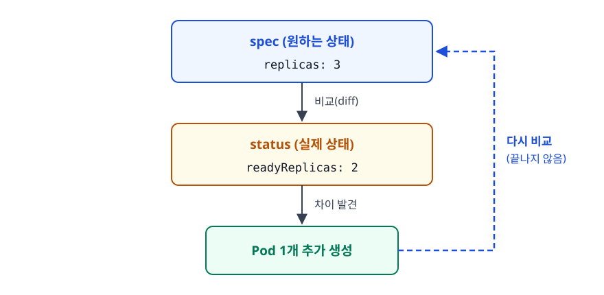
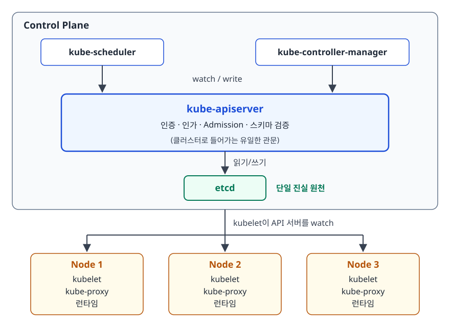
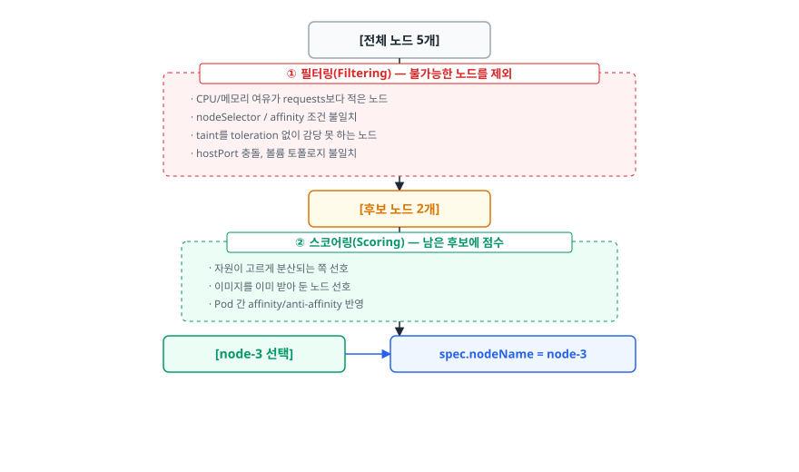
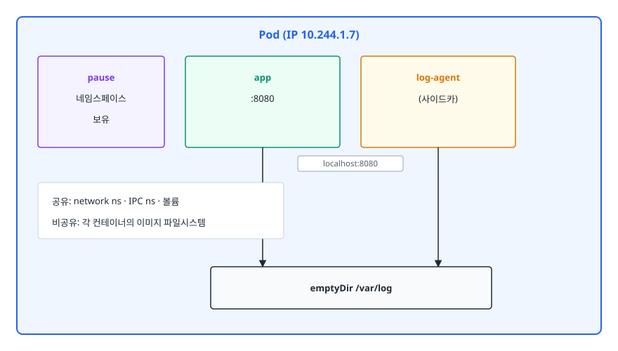
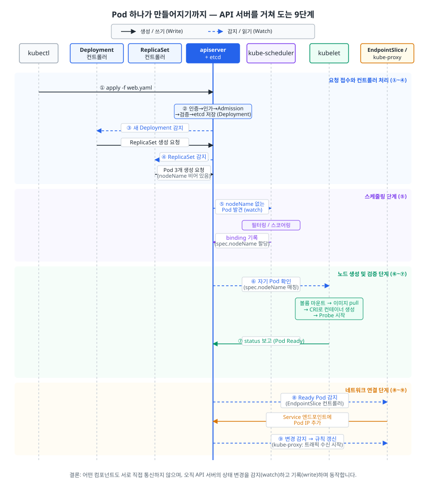

# 쿠버네티스 아키텍처와 핵심 개념 (Kubernetes Architecture)

> 컨테이너가 서버 여러 대에 흩어지면, 새 컨테이너는 어느 서버에 띄우고 죽은 서버의 컨테이너는 누가 되살릴까요? 쿠버네티스가 "선언 + 조정 루프"라는 단 하나의 구조로 이 문제들을 어떻게 한꺼번에 푸는지 설명합니다.

## 학습 목표

- [ ] 컨테이너 오케스트레이션이 필요해지는 지점을 구체적인 운영 문제로 설명할 수 있다
- [ ] 컨트롤 플레인 구성요소(API Server / etcd / Scheduler / Controller Manager)의 역할을 구분한다
- [ ] 노드 구성요소(kubelet / kube-proxy / 컨테이너 런타임)가 하는 일을 설명할 수 있다
- [ ] 선언적 API와 조정 루프(reconciliation loop)가 자가 치유의 원리임을 이해한다
- [ ] 컨테이너가 아니라 Pod가 최소 배포 단위인 이유를 답할 수 있다

## 선행 지식

- 컨테이너와 이미지의 관계 — [qna-docker.md](../containerization/docker/qna-docker.md)
- [가상화와 Hypervisor](../cloud-fundamentals/02-virtualization-hypervisor.md) - VM과 컨테이너의 격리 방식 차이

---

## 1. 왜 필요한가: 컨테이너가 많아지는 순간 무너지는 것들

컨테이너 하나를 띄우는 건 어렵지 않습니다. `docker run` 한 줄이면 됩니다. 서버 한 대에 대여섯 개를 띄우는 것도 Docker Compose로 충분합니다. 문제는 그다음부터입니다.

서버 10대, 컨테이너 200개짜리 서비스를 운영한다고 해보겠습니다. 다음 질문에 사람이 매번 답해야 합니다.

- **"새로 배포할 컨테이너를 어느 서버에 띄우지?"** — 서버마다 남은 CPU와 메모리를 확인하고, GPU가 필요한 워크로드인지 보고, 같은 서비스의 복제본이 한 서버에 몰리지 않게 신경 써야 합니다.
- **"3번 서버가 죽었다. 거기 있던 컨테이너 20개는?"** — 새벽 3시에 누군가 일어나서 남은 서버 9대의 여유 자원을 계산하고 재배치해야 합니다.
- **"결제 API 트래픽이 5배가 됐다"** — 컨테이너를 늘리고, 로드밸런서 대상 목록에 추가하고, 트래픽이 빠지면 다시 줄여야 합니다.
- **"새 버전을 배포하는데 다운타임은 안 된다"** — 한 대씩 내리고 올리면서, 새 버전이 정상인지 확인해 가며 진행해야 합니다. 문제가 생기면 즉시 되돌려야 합니다.
- **"방금 뜬 컨테이너의 IP를 다른 서비스가 어떻게 알지?"** — 컨테이너는 죽고 살아날 때마다 IP가 바뀝니다.
- **"DB 비밀번호를 200개 컨테이너에 어떻게 전달하지?"** — 이미지에 박아 넣을 수도 없고, 서버마다 파일을 복사해 둘 수도 없습니다.

하나하나는 스크립트로 풀 수 있습니다. 어려운 건 이 여섯 가지가 **동시에, 계속, 서로 얽혀서** 터진다는 데 있습니다. 배포하는 중에 노드가 죽고, 그 와중에 트래픽이 튀고, 스케일아웃해서 새로 뜬 컨테이너의 IP를 다른 서비스는 아직 모르는 일이 실제로 벌어집니다.

이 판단을 사람 대신 맡아 주는 시스템이 **컨테이너 오케스트레이션(Container Orchestration)** 이고, 사실상의 표준이 쿠버네티스입니다.

| 사람이 하던 일 | 쿠버네티스가 대신하는 것 | 담당 구성요소 |
|---|---|---|
| 어느 서버에 띄울지 고르기 | 스케줄링 | kube-scheduler |
| 죽은 컨테이너 재시작 | 자가 치유 | kubelet + 컨트롤러 |
| 노드 장애 시 재배치 | Pod 축출 후 재스케줄 | Node 컨트롤러 + 스케줄러 |
| 복제본 개수 유지 | 조정 루프 | ReplicaSet 컨트롤러 |
| 무중단 배포·롤백 | 롤링 업데이트 | Deployment 컨트롤러 |
| 바뀌는 IP 추적 | 서비스 디스커버리 | EndpointSlice 컨트롤러 + kube-proxy |
| 설정·비밀값 배포 | ConfigMap / Secret 주입 | kubelet |

결국 **쿠버네티스는 "서버 운영자가 하던 판단을 코드로 옮긴 시스템"** 입니다. 뒤집어 말하면 서버가 한두 대이고 컨테이너가 몇 개 안 될 때는 쿠버네티스의 복잡도가 이득보다 큽니다. Compose로 충분한 규모에 클러스터를 들이는 건 흔한 과잉 설계입니다.

---

## 2. 선언적 API와 조정 루프

### 명령형과 선언형의 차이

쿠버네티스를 이해하는 열쇠는 API 목록이 아니라 이 한 가지 사고방식입니다.

```
명령형(Imperative): "컨테이너를 3개 만들어라"   → 실행 순간의 동작을 지시
선언형(Declarative): "컨테이너가 3개인 상태여야 한다" → 유지해야 할 목표를 기술
```

차이가 중요한 이유는 **책임 범위**에 있습니다. 명령형 스크립트는 실행되는 그 순간까지만 책임집니다. 스크립트가 끝난 뒤 컨테이너 하나가 죽어도 아무도 모릅니다. 반면 선언형은 목표 상태가 시스템 안에 **기록으로 남습니다.** 기록이 남아 있으니 누군가 계속 실제 상태와 비교하고, 어긋나면 맞출 수 있습니다.

**비유하자면 온도조절기입니다.** "난방을 30분 켜라"는 명령형이고, "실내를 22도로 유지하라"는 선언형입니다. 온도조절기는 목표 22도를 기억한 채 현재 온도를 계속 재고, 낮으면 난방을 켜고 높으면 끕니다. 창문이 열려 온도가 떨어져도, 사람이 실수로 에어컨을 켜도, 결국 22도로 돌아옵니다.

> **비유의 한계**: 온도조절기 안에는 센서 하나와 히터 하나가 전부입니다. 쿠버네티스에서는 수십 종류의 컨트롤러가 각자 다른 리소스를 감시하며 동시에 돌아갑니다. 그래서 "지금 이 상태를 누가 왜 바꿨는가"를 추적하기가 온도조절기와는 비교가 안 되게 어렵습니다. 이벤트와 감사 로그를 들여다보는 습관이 필요합니다.

### 조정 루프(Reconciliation Loop)

쿠버네티스의 모든 오브젝트는 `spec`(원하는 상태)과 `status`(관측된 실제 상태)를 가집니다. 컨트롤러는 이 둘을 비교하는 무한 루프입니다.

<!-- diagram:cloud-architecture-concepts-1 -->


<!-- 위 그림이 대체한 원본 ASCII.
     내용을 고칠 때는 그림도 함께 갱신할 것.
```
        ┌────────────────────────────────┐
        │  spec  (원하는 상태)           │
        │    replicas: 3                 │
        └───────────────┬────────────────┘
                        │  비교(diff)
        ┌───────────────▼────────────────┐
        │  status (실제 상태)            │
        │    readyReplicas: 2            │
        └───────────────┬────────────────┘
                        │  차이 발견
                        ▼
              ┌───────────────────┐
              │  Pod 1개 추가 생성 │
              └─────────┬─────────┘
                        │
                        └────► 다시 비교 (끝나지 않음)
```
-->

놓치기 쉬운 점이 두 가지 있습니다.

첫째, **루프는 끝나지 않습니다.** 배포는 "완료"되지 않고 계속 유지됩니다. 누군가 `kubectl delete pod`으로 Pod를 지워도 몇 초 안에 새로 생깁니다. 자가 치유(Self-healing)의 정체가 이겁니다. 장애를 감지하는 특별한 모듈이 따로 있는 게 아니라, 루프가 계속 돌고 있을 뿐입니다.

둘째, 쿠버네티스는 **이벤트가 아니라 상태를 봅니다.** "Pod가 죽었다"는 이벤트를 놓쳐도 상관없습니다. 다음 루프에서 "지금 2개뿐이네"라고 현재 상태를 다시 읽으면 되기 때문입니다. 이 설계를 level-triggered라고 부르고, 덕분에 컨트롤러가 잠깐 죽었다 살아나도 복구됩니다. 이벤트 하나만 놓쳐도 영영 어긋나는 edge-triggered 방식과 갈리는 지점이 여기입니다.

### 코드로 보기

```yaml
apiVersion: apps/v1
kind: Deployment
metadata:
  name: web
spec:
  replicas: 3                 # 원하는 상태: Pod 3개
  selector:
    matchLabels:
      app: web
  template:                   # 어떤 Pod를 만들지에 대한 설계도
    metadata:
      labels:
        app: web
    spec:
      containers:
      - name: web
        image: nginx:1.25
        ports:
        - containerPort: 80
```

```bash
kubectl apply -f web.yaml      # "이 상태로 만들어 주고 유지해라"
kubectl delete pod web-xxxxx   # 하나 지워도
kubectl get pods               # 잠시 뒤 다시 3개
```

### 흔한 오해

`kubectl apply`는 "명령을 실행"하는 게 아니라 "목표를 등록"하는 것입니다. 그래서 명령이 성공했다고 Pod가 떴다는 뜻이 아닙니다. `apply`는 API 서버가 오브젝트를 받아 저장했다는 것까지만 보장합니다. 실제로 떴는지는 `kubectl rollout status`나 `kubectl get pods`로 따로 확인해야 합니다.

---

## 3. 컨트롤 플레인 구성요소

클러스터는 **컨트롤 플레인(Control Plane)** 과 **워커 노드(Node)** 로 나뉩니다. 컨트롤 플레인은 "무엇을 어디에 둘지 결정하는 두뇌"이고, 노드는 "실제로 컨테이너를 돌리는 손발"입니다.

<!-- diagram:cloud-architecture-concepts-2 -->


<!-- 위 그림이 대체한 원본 ASCII.
     내용을 고칠 때는 그림도 함께 갱신할 것.
```
┌────────────────────── Control Plane ───────────────────────┐
│                                                            │
│  ┌────────────────┐      ┌──────────────────────────┐      │
│  │ kube-scheduler │      │ kube-controller-manager  │      │
│  └───────┬────────┘      └────────────┬─────────────┘      │
│          │  watch / write             │                    │
│          ▼                            ▼                    │
│  ┌──────────────────────────────────────────────────┐      │
│  │              kube-apiserver                      │      │
│  │   인증 · 인가 · Admission · 스키마 검증          │      │
│  │   (클러스터로 들어가는 유일한 관문)              │      │
│  └───────────────────────┬──────────────────────────┘      │
│                          │ 읽기/쓰기                        │
│                   ┌──────▼──────┐                          │
│                   │    etcd     │  단일 진실 원천           │
│                   └─────────────┘                          │
└──────────────────────────┬─────────────────────────────────┘
                           │ kubelet이 API 서버를 watch
        ┌──────────────────┼──────────────────┐
        ▼                  ▼                  ▼
  ┌───────────┐      ┌───────────┐      ┌───────────┐
  │  Node 1   │      │  Node 2   │      │  Node 3   │
  │ kubelet   │      │ kubelet   │      │ kubelet   │
  │ kube-proxy│      │ kube-proxy│      │ kube-proxy│
  │ 런타임    │      │ 런타임    │      │ 런타임    │
  └───────────┘      └───────────┘      └───────────┘
```
-->

### 3-1. kube-apiserver — 유일한 관문

모든 요청은 API 서버를 지납니다. `kubectl`도, 스케줄러도, 각 노드의 kubelet도 마찬가지입니다. **컴포넌트끼리 직접 대화하는 경로는 없습니다.** 스케줄러가 kubelet에게 "이거 띄워"라고 전화하지 않습니다. 스케줄러는 API 서버에 "이 Pod는 node-2 담당"이라고 써 넣고, kubelet이 그걸 읽어 갑니다.

API 서버가 하는 일은 순서대로 이렇습니다.

1. **인증(Authentication)** — 누구인가. 인증서, 토큰, OIDC 등
2. **인가(Authorization)** — 이 작업을 할 권한이 있는가. 주로 RBAC
3. **Admission Control** — 요청을 검사하거나 변형합니다. 기본값 주입, 정책 위반 거부, 사이드카 자동 삽입 등
4. **스키마 검증 후 etcd에 저장**

또 하나 중요한 기능이 **watch API**입니다. 클라이언트가 "이 리소스가 바뀌면 알려줘"라고 연결을 열어 두면, 변경이 생길 때마다 스트림으로 전달됩니다. 모든 컨트롤러와 kubelet이 이 방식으로 동작합니다. 주기적으로 전체 목록을 다시 조회하는 폴링보다 훨씬 가볍습니다.

왜 이렇게 중앙 집중으로 설계했을까요. 컴포넌트가 서로 직접 통신하면 연결 조합이 급격히 늘고, 인증과 감사(audit)를 여러 곳에 중복 구현해야 합니다. 관문을 하나로 두면 보안 검사도 한 곳, 변경 이력도 한 곳입니다. 무엇보다 **새 컴포넌트를 끼워 넣기 쉽습니다.** 커스텀 컨트롤러나 오퍼레이터가 기존 코드를 전혀 건드리지 않고 클러스터에 참여할 수 있는 이유가 이 구조입니다.

### 3-2. etcd — 단일 진실 원천

분산 키-값 저장소입니다. Raft 합의 알고리즘으로 복제되며, 과반수가 살아 있어야 쓰기가 가능하므로 보통 3대나 5대처럼 홀수로 구성합니다.

클러스터의 모든 오브젝트가 여기 저장됩니다. Deployment, Pod, Service, ConfigMap, Secret, 심지어 리소스별 변경 버전까지. **etcd를 잃으면 클러스터의 상태 전부를 잃습니다.** 그래서 자체 구축 클러스터를 운영한다면 `etcdctl snapshot save`로 뜨는 정기 백업이 다른 어떤 작업보다 우선합니다.

etcd에 직접 접근하는 컴포넌트는 API 서버뿐입니다. 컨트롤러가 etcd를 직접 읽지 않습니다. 이 제약 덕분에 접근 통제와 캐싱이 한 곳에서 이뤄집니다.

### 3-3. kube-scheduler — 자리만 정한다

스케줄러는 **"아직 노드가 정해지지 않은 Pod"** 를 찾아 어느 노드에 놓을지 결정합니다. 직접 컨테이너를 띄우지는 않습니다. 결정 결과를 Pod 오브젝트의 `spec.nodeName`에 기록하는 것이 전부입니다(binding).

결정은 두 단계로 이뤄집니다.

<!-- diagram:cloud-architecture-concepts-3 -->


<!-- 위 그림이 대체한 원본 ASCII.
     내용을 고칠 때는 그림도 함께 갱신할 것.
```
[전체 노드 5개]
      │
      │ ① 필터링(Filtering) — 불가능한 노드를 제외
      │    · CPU/메모리 여유가 requests보다 적은 노드
      │    · nodeSelector / affinity 조건 불일치
      │    · taint를 toleration 없이 감당 못 하는 노드
      │    · hostPort 충돌, 볼륨 토폴로지 불일치
      ▼
[후보 노드 2개]
      │
      │ ② 스코어링(Scoring) — 남은 후보에 점수
      │    · 자원이 고르게 분산되는 쪽 선호
      │    · 이미지를 이미 받아 둔 노드 선호
      │    · Pod 간 affinity/anti-affinity 반영
      ▼
[node-3 선택] → spec.nodeName = node-3
```
-->

필터링을 통과한 노드가 **0개면 Pod는 `Pending` 상태로 남습니다.** 이때 `kubectl describe pod`의 이벤트에 `0/5 nodes are available: 3 Insufficient cpu, 2 node(s) had untolerated taint...` 같은 메시지가 뜹니다. Pending 진단은 [05-troubleshooting.md](./05-troubleshooting.md)에서 자세히 다룹니다.

### 3-4. kube-controller-manager — 조정 루프들의 집합

이름은 하나지만 안에서 여러 컨트롤러가 각자의 조정 루프를 돌립니다.

| 컨트롤러 | 감시 대상 | 하는 일 |
|---|---|---|
| Deployment | Deployment | 새 ReplicaSet을 만들고 롤링 업데이트 진행 |
| ReplicaSet | ReplicaSet | Pod 개수를 spec에 맞게 유지 |
| Node | Node | 노드 하트비트 감시, 응답 없으면 상태 변경 후 Pod 축출 |
| EndpointSlice | Service, Pod | selector에 맞는 Ready Pod의 IP 목록 유지 |
| Job / CronJob | Job, CronJob | 배치 작업 실행과 스케줄 관리 |
| ServiceAccount / Token | ServiceAccount | 네임스페이스별 기본 계정과 토큰 관리 |

**cloud-controller-manager**는 클라우드 연동만 따로 떼어 낸 컴포넌트입니다. LoadBalancer 타입 Service를 만들면 실제 클라우드 로드밸런서를 프로비저닝하고, 노드가 클라우드에서 삭제되면 클러스터에서도 제거합니다. EKS·GKE·AKS 같은 관리형 서비스를 쓰면 사용자가 직접 볼 일은 거의 없습니다.

### 3-5. 관리형 클러스터에서는

EKS, GKE, AKS는 컨트롤 플레인을 클라우드가 대신 운영합니다. 사용자가 신경 쓸 것은 워커 노드뿐입니다.

과금은 대체로 **"컨트롤 플레인 사용 시간 + 워커 노드의 컴퓨팅/스토리지/네트워크 사용량"** 으로 나뉩니다. 단가는 리전과 시점에 따라 달라지므로 반드시 각 클라우드의 요금 페이지에서 확인해야 합니다. 기억할 것은 숫자가 아니라 구조입니다. **"컨트롤 플레인에도 별도 과금 축이 있다"** 는 사실 하나면 충분합니다. 환경마다 클러스터를 무한정 쪼개는 대신 네임스페이스로 나누는 판단이 여기서 나옵니다.

---

## 4. 노드 구성요소

### kubelet — 노드의 대리인

각 노드에서 상시 동작하는 에이전트입니다. API 서버를 watch하다가 **자기 노드에 배정된 Pod**를 발견하면 실제로 만들어 냅니다.

- CRI(Container Runtime Interface)를 통해 런타임에 컨테이너 생성을 요청합니다
- 볼륨을 마운트하고 ConfigMap·Secret을 주입합니다
- Probe(liveness/readiness/startup)를 실행하고 결과에 따라 컨테이너를 재시작하거나 Ready 상태를 바꿉니다
- Pod와 노드의 상태를 API 서버에 보고합니다
- 노드 자원이 부족해지면 Pod를 축출(eviction)합니다

kubelet이 죽으면 그 노드의 Pod들은 **당장은 계속 돌아갑니다.** 컨테이너는 런타임이 돌리고 있기 때문입니다. 다만 상태 보고가 끊기므로 일정 시간 뒤 노드가 `NotReady`가 되고, Node 컨트롤러가 Pod를 다른 노드로 옮기기 시작합니다.

### 컨테이너 런타임

실제로 컨테이너를 실행하는 소프트웨어입니다. containerd와 CRI-O가 널리 쓰입니다.

여기서 자주 나오는 오해 하나. 쿠버네티스는 Docker Engine을 직접 지원하지 않습니다(dockershim 제거). 하지만 이것이 **"Docker로 만든 이미지를 못 쓴다"는 뜻은 전혀 아닙니다.** 이미지는 OCI 표준 포맷이라 어떤 런타임에서든 동작합니다. 바뀐 것은 kubelet이 런타임과 대화하는 방식뿐입니다.

### kube-proxy

Service로 들어온 트래픽을 실제 Pod로 보내는 규칙을 노드 커널에 설치합니다. iptables나 IPVS를 씁니다. 자세한 동작은 [03-networking-service.md](./03-networking-service.md)에서 다룹니다.

---

## 5. Pod가 최소 단위인 이유

### 왜 컨테이너가 아닌가

컨테이너의 원래 철학은 "한 컨테이너에 한 프로세스"입니다. 그런데 실무에서는 **메인 프로세스와 보조 프로세스가 반드시 같은 곳에 있어야 하는** 경우가 생깁니다.

- 앱이 파일로 남긴 로그를 읽어 중앙으로 보내는 로그 수집기
- 모든 요청을 대신 받아 TLS·재시도·트레이싱을 처리하는 프록시(서비스 메시의 사이드카)
- 인증서를 주기적으로 갱신해 공유 디렉터리에 떨궈 주는 에이전트

이들은 앱과 **같은 파일시스템 일부를 봐야 하거나, localhost로 통신해야 하거나, 앱과 생사를 같이해야** 합니다. 컨테이너를 스케줄링 단위로 삼으면 "이 둘은 반드시 붙어 있어야 함"을 표현할 방법이 없습니다. 그래서 한 단계 위에 묶음을 만든 것이 Pod입니다.

### 무엇을 공유하고 무엇을 공유하지 않나

<!-- diagram:cloud-architecture-concepts-4 -->


<!-- 위 그림이 대체한 원본 ASCII.
     내용을 고칠 때는 그림도 함께 갱신할 것.
```
┌───────────────── Pod (IP 10.244.1.7) ──────────────────┐
│                                                        │
│  ┌───────────┐   ┌────────────┐   ┌────────────────┐   │
│  │   pause   │   │    app     │   │   log-agent    │   │
│  │ 네임스페이스│   │  :8080     │   │  (사이드카)    │   │
│  │   보유    │   │            │   │                │   │
│  └───────────┘   └─────┬──────┘   └───────┬────────┘   │
│                        │ localhost:8080   │            │
│   공유:  network ns · IPC ns · 볼륨       │            │
│   비공유: 각 컨테이너의 이미지 파일시스템 │            │
│                        │                  │            │
│                  ┌─────▼──────────────────▼─────┐      │
│                  │   emptyDir  /var/log         │      │
│                  └──────────────────────────────┘      │
└────────────────────────────────────────────────────────┘
```
-->

- **공유한다**: 네트워크 네임스페이스(같은 IP, `localhost` 통신, **포트 공간도 공유**), IPC 네임스페이스, 지정한 볼륨
- **공유하지 않는다**: 각 컨테이너의 이미지 파일시스템, 기본적으로 PID 네임스페이스

포트 공간을 공유한다는 사실이 실무에서 자주 발목을 잡습니다. 한 Pod 안에서 두 컨테이너가 모두 8080을 쓰면 뒤에 뜨는 쪽이 실패합니다.

**pause 컨테이너**라는 것도 알아 두면 좋습니다. Pod가 뜰 때 눈에 보이지 않는 아주 작은 컨테이너가 먼저 하나 뜹니다. 이 컨테이너가 네트워크·IPC 네임스페이스를 붙잡고 있고, 앱 컨테이너들이 거기에 합류합니다. 그 덕분에 앱 컨테이너가 재시작돼도 Pod IP가 그대로 유지됩니다.

### 흔한 오해

"Pod에는 컨테이너를 여러 개 넣을 수 있다"는 말이 "여러 개 넣는 게 좋다"는 뜻은 아닙니다. 대부분의 경우 **1 Pod = 1 컨테이너**가 맞습니다. 함께 넣어야 할 기준은 명확합니다. **독립적으로 스케일할 수 있다면 분리하고, 반드시 같은 수명과 같은 노드를 공유해야 한다면 함께 둡니다.** 웹 서버와 DB를 한 Pod에 넣는 것은 전형적인 오용입니다.

---

## 6. Pod 하나가 만들어지는 전체 흐름

<!-- diagram:k8s-pod-creation -->


지금까지의 구성요소가 실제로 어떻게 이어지는지 한 번에 따라가 보겠습니다.

```
① kubectl apply -f web.yaml
        ↓
② kube-apiserver: 인증 → 인가 → Admission → 검증 → etcd 저장 (Deployment)
        ↓
③ Deployment 컨트롤러: 새 Deployment 감지 → ReplicaSet 생성 요청
        ↓
④ ReplicaSet 컨트롤러: Pod 3개 생성 요청 (spec.nodeName 비어 있음)
        ↓
⑤ kube-scheduler: nodeName 없는 Pod 발견 → 필터링/스코어링 → binding
        ↓
⑥ 해당 노드의 kubelet: 자기 Pod임을 확인 → 볼륨 붙이고 마운트 → 이미지 pull
                        → CRI로 컨테이너 생성 → Probe 시작
        ↓
⑦ kubelet이 status 보고 → Pod Ready
        ↓
⑧ EndpointSlice 컨트롤러: Ready Pod의 IP를 Service 엔드포인트에 추가
        ↓
⑨ 각 노드의 kube-proxy: 라우팅 규칙 갱신 → 트래픽 수신 시작
```

여기서 가장 중요한 관찰은 이것입니다. **어떤 단계도 다음 단계를 직접 호출하지 않습니다.** 전부 API 서버에 기록된 상태를 각자 보고 반응할 뿐입니다. 그래서 스케줄러를 잠깐 껐다 켜도, 컨트롤러 매니저가 재시작돼도 클러스터가 즉시 무너지지 않습니다. 멈춰 있던 동안 밀린 일은 다시 켜지는 순간 현재 상태를 읽고 이어서 처리합니다.

```bash
# 흐름을 직접 확인해 보기
kubectl get nodes -o wide
kubectl -n kube-system get pods                       # 컨트롤 플레인/시스템 컴포넌트
kubectl get pod <pod-name> -o jsonpath='{.spec.nodeName}'   # 스케줄러가 정한 노드
kubectl get events --sort-by=.lastTimestamp           # 시간순 이벤트
kubectl get deploy,rs,pod -l app=web                  # 3계층 한 번에 확인
```

---

## 7. 실무에서는

**직접 구축보다 관리형이 기본입니다.** EKS·GKE·AKS를 쓰면 etcd 백업, 인증서 갱신, 컨트롤 플레인 버전 업그레이드를 떠안지 않아도 됩니다. 자체 구축(kubeadm)은 규제나 온프레미스 요건이 있고 전담 인력이 있을 때 선택합니다. 학습이나 로컬 테스트에는 kind, minikube, k3s가 널리 쓰입니다.

**오퍼레이터 패턴**은 조정 루프를 자기 도메인으로 확장한 것입니다. CRD(Custom Resource Definition)로 새로운 리소스 타입을 정의하고, 그 리소스를 감시하는 컨트롤러를 직접 만듭니다. Prometheus Operator, Strimzi(Kafka), CloudNativePG 같은 프로젝트가 이 방식으로 "DB 백업과 페일오버까지 아는 컨트롤러"를 제공합니다. 쿠버네티스가 확장에 강한 이유는 API 서버를 중심에 둔 설계이고, 이 프로젝트들이 그 사례입니다.

**GitOps**는 조정 루프를 클러스터 밖까지 밀어 올린 개념입니다. Argo CD나 Flux는 Git 저장소를 "원하는 상태"로 삼고, 클러스터의 실제 상태와 계속 비교합니다. 누군가 `kubectl edit`으로 손댄 변경이 자동으로 되돌려집니다. 관련 내용은 [qna-cicd.md](../devops-cicd/qna-cicd.md)에 이어집니다.

---

## 8. 면접 포인트

> 면접에서 이 주제가 나오면 이렇게 답한다

**Q. 쿠버네티스의 자가 치유는 어떻게 동작하나요?**

A. 별도의 장애 감지 모듈이 있는 게 아니라, 모든 컨트롤러가 조정 루프를 돌기 때문입니다. 오브젝트는 원하는 상태인 spec과 실제 상태인 status를 가지고, 컨트롤러는 둘을 계속 비교해 차이가 있으면 좁히는 동작을 합니다. ReplicaSet 컨트롤러라면 Pod가 3개여야 하는데 2개면 하나를 더 만듭니다. 이벤트가 아니라 현재 상태를 기준으로 판단하기 때문에, 컨트롤러가 잠깐 죽어 알림을 놓쳐도 다시 켜지면 복구됩니다.

- 꼬리 질문: "그럼 Pod를 직접 만들면 자가 치유가 되나요?" → 안 됩니다. Pod를 직접 만들면 그 Pod를 감시하는 컨트롤러가 없어서, 죽으면 그걸로 끝입니다. kubelet이 컨테이너 단위 재시작은 해 주지만 노드 장애 시 재배치는 안 됩니다. 그래서 Deployment 같은 상위 오브젝트를 씁니다.

**Q. 스케줄러와 kubelet의 역할 차이는 무엇인가요?**

A. 스케줄러는 "어느 노드에 놓을지"만 결정하고 실행은 하지 않습니다. 결정 결과를 Pod의 spec.nodeName에 기록하는 것이 전부입니다. 실제 컨테이너를 만드는 것은 각 노드의 kubelet입니다. kubelet은 API 서버를 watch하다가 자기 노드에 배정된 Pod를 발견하면 이미지를 받고 볼륨을 붙여 컨테이너를 띄웁니다. 즉 결정과 실행은 분리되어 있고, 둘은 서로 직접 통신하지 않습니다. 이어 주는 것은 API 서버에 기록된 상태뿐입니다.

- 꼬리 질문: "Pod가 Pending이면 어느 쪽 문제인가요?" → 대개 스케줄링 실패입니다. 필터링을 통과한 노드가 없다는 뜻이므로 requests 과다, taint, nodeSelector, 바인딩되지 않은 PVC를 순서대로 확인합니다.

**Q. etcd가 손상되면 어떻게 되나요?**

A. 클러스터의 모든 오브젝트 정의가 사라집니다. 다만 이미 노드에서 돌고 있는 컨테이너는 런타임이 붙들고 있어 당장 죽지는 않습니다. 문제는 그 시점부터 어떤 변경도 불가능하고, 장애가 나도 재배치되지 않는다는 것입니다. 그래서 자체 구축 클러스터에서는 etcd 스냅샷 백업과 복구 절차 검증이 운영의 최우선 항목입니다. 관리형 서비스를 쓰면 이 부분을 클라우드가 담당합니다.

- 꼬리 질문: "etcd를 왜 홀수 대로 구성하나요?" → Raft 합의는 과반수가 필요한데, 4대는 3대와 장애 허용 대수가 같으면서 비용만 늘기 때문입니다.

**Q. 왜 컨테이너가 아니라 Pod가 최소 배포 단위인가요?**

A. 반드시 함께 배치되어야 하는 컨테이너 묶음을 표현하기 위해서입니다. 로그 수집기나 프록시 사이드카처럼 앱과 같은 노드에서 localhost로 통신하고 볼륨을 공유해야 하는 보조 컨테이너가 있는데, 컨테이너를 스케줄링 단위로 삼으면 "이 둘은 떨어지면 안 된다"를 표현할 수 없습니다. Pod 안의 컨테이너들은 네트워크·IPC 네임스페이스와 볼륨을 공유하고 생사를 함께합니다. 다만 대부분의 경우는 1 Pod 1 컨테이너가 권장됩니다.

---

## 자주 하는 실수

| 실수 | 왜 틀렸나 | 올바른 이해 |
|---|---|---|
| Pod를 YAML로 직접 만들어 배포 | 감시하는 컨트롤러가 없어 노드 장애 시 복구되지 않음 | Deployment 등 상위 오브젝트로 만든다 |
| `kubectl apply` 성공 = 배포 완료 | apply는 목표 등록까지만 보장 | `kubectl rollout status`로 실제 반영 확인 |
| 컨트롤 플레인이 컨테이너를 실행한다고 생각 | 컨트롤 플레인은 결정만, 실행은 노드의 kubelet | 결정과 실행이 분리되어 있음 |
| dockershim 제거 = Docker 이미지 못 씀 | 이미지 포맷(OCI)과 런타임 인터페이스는 별개 | Docker로 빌드한 이미지는 그대로 동작 |
| 한 Pod에 웹 서버와 DB를 함께 배치 | 수명과 스케일 요구가 완전히 다름 | 독립 스케일이 가능하면 Pod를 분리 |
| 클러스터를 환경마다 새로 만드는 게 항상 안전 | 컨트롤 플레인에도 과금 축이 있고 운영 부담이 배로 늘어남 | 격리 수준 요구에 따라 네임스페이스 분리도 고려 |

---

## 한 줄 정리

쿠버네티스는 "원하는 상태를 API 서버에 기록해 두면, 여러 컨트롤러가 각자 실제 상태와 비교해 계속 좁혀 나가는" 시스템입니다. 아키텍처의 모든 구성요소는 이 조정 루프를 나눠 맡은 역할일 뿐입니다.

---

## 연관 개념

- [02-deployment-management.md](./02-deployment-management.md) - 조정 루프가 실제 워크로드로 구체화된 Deployment / StatefulSet / Job
- [03-networking-service.md](./03-networking-service.md) - 바뀌는 Pod IP 문제를 Service가 푸는 방법
- [04-config-storage.md](./04-config-storage.md) - 설정과 데이터를 Pod 밖으로 빼내는 방법
- [05-troubleshooting.md](./05-troubleshooting.md) - 이 구조 위에서 장애를 어디부터 파고들지
- [qna-kubernetes.md](./qna-kubernetes.md) - 쿠버네티스 면접 질문 모음
- [qna-docker.md](../containerization/docker/qna-docker.md) - 컨테이너와 이미지 기초
- [02-virtualization-hypervisor.md](../cloud-fundamentals/02-virtualization-hypervisor.md) - VM과 컨테이너의 격리 방식 비교
