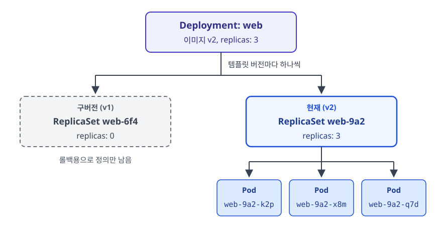
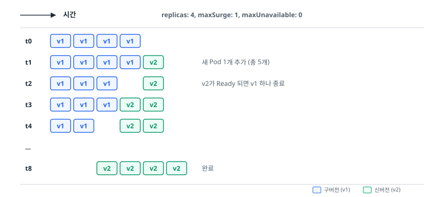
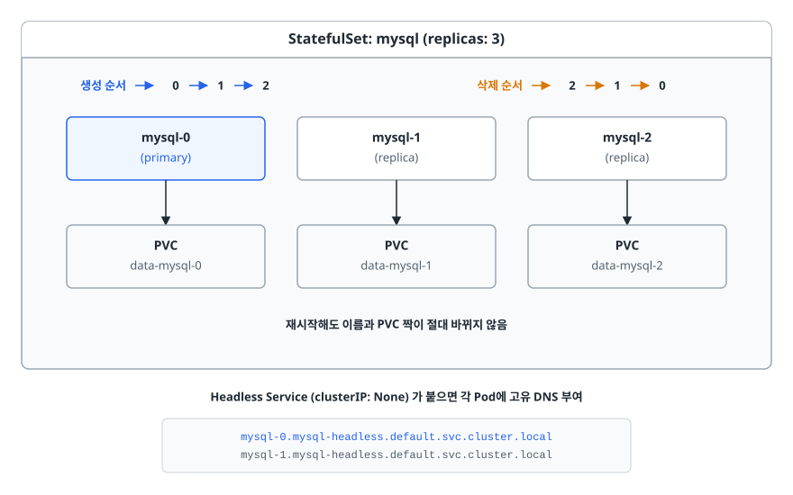
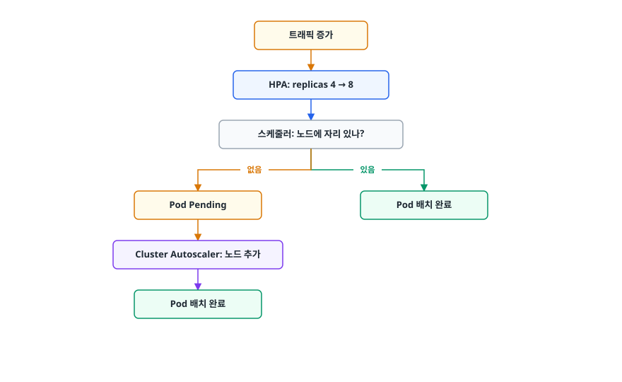

# 워크로드 리소스와 배포 관리 (Workload Resources)

> Deployment가 Pod를 바로 만든다고 생각하기 쉽지만, 실제로는 계층을 나눠 관리합니다. 이 문서는 그 계층 구조와 무중단 배포·롤백이 어떤 순서로 일어나는지, 상태가 있는 앱에 StatefulSet이 왜 필요한지를 가려냅니다.

## 학습 목표

- [ ] Deployment → ReplicaSet → Pod 3계층이 왜 필요한지 설명할 수 있다
- [ ] 롤링 업데이트의 진행 방식과 롤백이 가능한 이유를 이해한다
- [ ] StatefulSet이 보장하는 세 가지(안정적 ID, 순서, 전용 스토리지)를 말할 수 있다
- [ ] DaemonSet / Job / CronJob을 언제 쓰는지 구분한다
- [ ] requests와 limits의 차이, QoS 클래스가 축출 순서를 어떻게 정하는지 설명할 수 있다
- [ ] HPA가 복제본 수를 계산하는 방식과 전제 조건을 안다

## 선행 지식

- [01-architecture-concepts.md](./01-architecture-concepts.md) - 선언적 API와 조정 루프

---

## 1. 왜 필요한가: Pod를 직접 만들면 벌어지는 일

Pod를 YAML로 직접 정의해 배포할 수는 있습니다. 하지만 배포한 뒤 상황을 상상해 보겠습니다.

- Pod가 들어 있던 노드가 죽으면 **그대로 사라집니다.** 다시 만들어 주는 주체가 없습니다.
- 복제본 5개를 원하면 YAML을 5번 쓰거나 이름만 바꿔 5번 apply해야 합니다.
- 새 버전을 올리려면 기존 Pod를 지우고 새 Pod를 만들어야 하는데, 그 사이는 다운타임입니다.
- 새 버전에 문제가 있어 되돌리려면 이전 이미지 태그를 기억해 다시 써야 합니다.

[01번 문서](./01-architecture-concepts.md)에서 본 조정 루프는 **감시하는 컨트롤러가 있어야** 작동합니다. Pod를 직접 만들면 그 Pod의 spec을 감시하는 컨트롤러가 없습니다. 그래서 쿠버네티스는 Pod 위에 목적별 워크로드 리소스를 얹습니다.

| 워크로드 | 해결하는 문제 | 대표 사용처 |
|---|---|---|
| Deployment | 상태 없는 앱의 복제본 유지 + 무중단 배포 | 웹 서버, REST API |
| StatefulSet | 각 복제본이 고유한 정체성과 데이터를 가져야 함 | DB 클러스터, Kafka, ZooKeeper |
| DaemonSet | 모든 노드에 정확히 하나씩 필요 | 로그 수집기, 노드 모니터링, CNI 에이전트 |
| Job | 끝나는 작업을 성공할 때까지 실행 | 마이그레이션, 배치 집계 |
| CronJob | 그 작업을 정해진 시각에 반복 | 야간 정산, 백업, 리포트 생성 |

선택 기준은 두 질문으로 갈립니다. **"이 워크로드는 끝나는가, 계속 도는가?"** 와 **"복제본끼리 구별되어야 하는가?"** 입니다.

---

## 2. Deployment → ReplicaSet → Pod

### 왜 3계층인가

가장 흔한 질문이 "ReplicaSet은 왜 있나, Deployment가 바로 Pod를 만들면 안 되나"입니다. 답은 **롤백** 때문입니다.

ReplicaSet은 "이 템플릿의 Pod를 N개 유지하라"만 담당합니다. 버전 개념이 없습니다. 그래서 Deployment는 **템플릿이 바뀔 때마다 새 ReplicaSet을 만듭니다.** 이전 ReplicaSet은 복제본 0개인 상태로 남겨 둡니다.

<!-- diagram:cloud-deployment-management-1 -->


<!-- 위 그림이 대체한 원본 ASCII.
     내용을 고칠 때는 그림도 함께 갱신할 것.
```
             ┌──────────────────────────────┐
             │        Deployment: web       │
             │  이미지 v2, replicas: 3      │
             └──────────────┬───────────────┘
                            │ 템플릿 버전마다 하나씩
        ┌───────────────────┼────────────────────┐
        ▼                                        ▼
┌────────────────────┐                 ┌────────────────────┐
│ ReplicaSet web-6f4 │  (구버전 v1)    │ ReplicaSet web-9a2 │ (현재 v2)
│   replicas: 0      │                 │   replicas: 3      │
└────────────────────┘                 └─────────┬──────────┘
   롤백용으로 정의만 남음                         │
                                    ┌────────────┼────────────┐
                                    ▼            ▼            ▼
                                ┌───────┐    ┌───────┐    ┌───────┐
                                │ Pod   │    │ Pod   │    │ Pod   │
                                │web-9a2│    │web-9a2│    │web-9a2│
                                │ -k2p  │    │ -x8m  │    │ -q7d  │
                                └───────┘    └───────┘    └───────┘
```
-->

롤백은 이 구조 덕분에 단순한 연산이 됩니다. **"현재 ReplicaSet의 replicas를 0으로 내리고, 이전 ReplicaSet을 3으로 올린다."** 이미지 태그를 기억할 필요도, 예전 YAML을 찾을 필요도 없습니다.

```bash
kubectl rollout history deployment/web         # 리비전 목록
kubectl rollout undo deployment/web            # 바로 직전으로
kubectl rollout undo deployment/web --to-revision=2
kubectl get rs -l app=web                      # 남아 있는 ReplicaSet 확인
```

보관할 이전 ReplicaSet 개수는 `spec.revisionHistoryLimit`으로 정합니다(기본 10). 0으로 두면 롤백이 불가능해지므로 주의합니다.

### 롤링 업데이트가 진행되는 순서

`spec.strategy.type`은 기본이 `RollingUpdate`이고, `Recreate`도 있습니다.

```
RollingUpdate (기본): 새 Pod를 조금씩 늘리며 옛 Pod를 줄인다 → 무중단
Recreate           : 옛 Pod를 전부 지운 뒤 새 Pod를 만든다  → 다운타임 발생
```

Recreate는 구버전과 신버전이 동시에 떠 있으면 안 되는 경우(예: 호환되지 않는 DB 스키마를 쓰는 경우)에만 씁니다. 롤링 업데이트의 속도는 두 값이 결정합니다.

- `maxSurge` — 목표 복제본 수를 **초과해서** 더 만들 수 있는 개수(또는 비율)
- `maxUnavailable` — 동시에 **사용 불가 상태여도 되는** 개수(또는 비율)

```yaml
spec:
  replicas: 4
  strategy:
    type: RollingUpdate
    rollingUpdate:
      maxSurge: 1          # 최대 5개까지 동시에 존재 가능
      maxUnavailable: 0    # 항상 4개는 Ready 유지
```

`maxUnavailable: 0`으로 두면 용량이 절대 줄지 않지만, 노드 여유가 없으면 새 Pod가 Pending에 걸려 배포가 멈춥니다. 반대로 `maxSurge: 0`으로 두면 추가 자원이 필요 없지만 배포 중 처리 용량이 줄어듭니다. 둘을 동시에 0으로 둘 수는 없습니다. 그러면 Pod를 만들 여유도 없애 버릴 여유도 없어 배포가 진행될 수 없으니 검증 단계에서 거부됩니다. 트래픽이 빠듯한 서비스라면 `maxSurge`를 열어 두는 편이 안전합니다.

<!-- diagram:cloud-deployment-management-2 -->


<!-- 위 그림이 대체한 원본 ASCII.
     내용을 고칠 때는 그림도 함께 갱신할 것.
```
시간 →

replicas: 4, maxSurge: 1, maxUnavailable: 0

t0  [v1][v1][v1][v1]
t1  [v1][v1][v1][v1][v2]        새 Pod 1개 추가 (총 5개)
t2  [v1][v1][v1]    [v2]        v2가 Ready 되면 v1 하나 종료
t3  [v1][v1][v1][v2][v2]
t4  [v1][v1]    [v2][v2]
...
t8          [v2][v2][v2][v2]    완료
```
-->

**"새 Pod가 Ready가 되어야 다음 단계로 넘어간다"** 가 핵심입니다. 그래서 readiness probe가 없으면 롤링 업데이트가 안전장치를 잃습니다. 컨테이너가 뜨자마자 Ready로 간주되어, 실제로는 아직 초기화 중인 Pod에 트래픽이 들어갑니다. Probe 이야기는 [05-troubleshooting.md](./05-troubleshooting.md)에서 더 다룹니다.

```bash
kubectl set image deployment/web web=myapp:2.0
kubectl rollout status deployment/web     # 진행률 추적, 완료까지 블로킹
kubectl rollout pause deployment/web      # 카나리처럼 중간에 멈춰 관찰
kubectl rollout resume deployment/web
```

`progressDeadlineSeconds` 안에 진전이 없으면 Deployment는 `Progressing=False`로 표시됩니다. **자동으로 롤백되지는 않습니다.** CI 파이프라인에서 `rollout status`의 종료 코드를 보고 실패 시 `rollout undo`를 실행하도록 엮어 두는 것이 실무 패턴입니다.

---

## 3. StatefulSet: 복제본을 구별해야 할 때

### 왜 Deployment로는 안 되나

Deployment의 Pod는 이름이 `web-9a2-k2p`처럼 무작위이고, 죽으면 완전히 다른 이름으로 다시 태어납니다. 모두 동등하기 때문에 로드밸런서가 아무 Pod에나 요청을 보내도 상관없습니다. 이 성질이 **상태가 있는 앱에서는 정확히 반대로 문제가 됩니다.**

MySQL 복제 구성을 생각해 보겠습니다. `mysql-0`이 프라이머리이고 `mysql-1`, `mysql-2`가 레플리카입니다. 여기서 필요한 것은 세 가지입니다.

1. **각 Pod가 자기 데이터에 계속 붙어야 합니다.** `mysql-1`이 재시작했는데 `mysql-2`의 디스크를 잡으면 데이터가 뒤섞입니다.
2. **각 Pod를 이름으로 지목할 수 있어야 합니다.** 레플리카는 "프라이머리 주소"를 알아야 복제를 시작합니다. 그 주소가 재시작마다 바뀌면 안 됩니다.
3. **순서가 보장되어야 합니다.** 프라이머리가 먼저 떠 있어야 레플리카가 붙을 수 있습니다.

StatefulSet은 이 세 가지를 보장합니다.

### 무엇이 달라지는가

<!-- diagram:cloud-deployment-management-3 -->


<!-- 위 그림이 대체한 원본 ASCII.
     내용을 고칠 때는 그림도 함께 갱신할 것.
```
┌──────────────── StatefulSet: mysql (replicas: 3) ────────────────┐
│                                                                  │
│   생성 순서 →  0 → 1 → 2         삭제 순서 →  2 → 1 → 0          │
│                                                                  │
│  ┌──────────────┐   ┌──────────────┐   ┌──────────────┐          │
│  │  mysql-0     │   │  mysql-1     │   │  mysql-2     │          │
│  │  (primary)   │   │  (replica)   │   │  (replica)   │          │
│  └──────┬───────┘   └──────┬───────┘   └──────┬───────┘          │
│         │                  │                  │                  │
│  ┌──────▼───────┐   ┌──────▼───────┐   ┌──────▼───────┐          │
│  │ PVC          │   │ PVC          │   │ PVC          │          │
│  │ data-mysql-0 │   │ data-mysql-1 │   │ data-mysql-2 │          │
│  └──────────────┘   └──────────────┘   └──────────────┘          │
│     재시작해도 이름과 PVC 짝이 절대 바뀌지 않음                   │
└──────────────────────────────────────────────────────────────────┘

  Headless Service (clusterIP: None) 가 붙으면 각 Pod에 고유 DNS 부여
      mysql-0.mysql-headless.default.svc.cluster.local
      mysql-1.mysql-headless.default.svc.cluster.local
```
-->

**안정적 네트워크 ID.** StatefulSet은 `serviceName`으로 지정한 헤드리스 Service와 짝을 이뤄, Pod마다 고정된 DNS 이름을 만듭니다. 애플리케이션 설정에 `mysql-0.mysql-headless`라고 적어 두면 Pod가 몇 번을 재시작해도 그 이름은 그대로입니다.

**순서 보장.** 기본값(`podManagementPolicy: OrderedReady`)에서는 `mysql-0`이 Ready가 되어야 `mysql-1`을 만들고, 축소할 때는 큰 번호부터 지웁니다. 순서가 필요 없고 빠른 기동이 중요하면 `Parallel`로 바꿀 수 있습니다.

**PVC 템플릿.** `volumeClaimTemplates`에 적어 두면 Pod마다 PVC가 하나씩 자동 생성되고 이름이 `<템플릿명>-<Pod명>`으로 고정됩니다. Pod가 죽었다 살아나면 같은 PVC에 다시 붙습니다.

```yaml
apiVersion: apps/v1
kind: StatefulSet
metadata:
  name: mysql
spec:
  serviceName: mysql-headless     # 헤드리스 Service 이름 (필수)
  replicas: 3
  selector:
    matchLabels:
      app: mysql
  template:
    metadata:
      labels:
        app: mysql
    spec:
      containers:
      - name: mysql
        image: mysql:8.0
        ports:
        - name: mysql
          containerPort: 3306
        volumeMounts:
        - name: data
          mountPath: /var/lib/mysql
  volumeClaimTemplates:
  - metadata:
      name: data
    spec:
      accessModes: ["ReadWriteOnce"]
      storageClassName: gp3
      resources:
        requests:
          storage: 20Gi
```

### 조심할 점

**StatefulSet을 지워도 PVC는 남습니다.** 이건 버그가 아니라 안전장치입니다. 실수로 지운 DB의 데이터까지 함께 날아가면 복구가 불가능하기 때문입니다. 정말 정리하려면 PVC를 직접 삭제해야 합니다. 최신 버전에는 이 동작을 제어하는 `persistentVolumeClaimRetentionPolicy` 필드가 있으니 클러스터 버전 문서를 확인하고 씁니다.

**StatefulSet이 있다고 클러스터링이 되는 건 아닙니다.** StatefulSet은 이름과 순서와 디스크만 보장합니다. "누가 프라이머리인지" 정하고 페일오버하는 로직은 애플리케이션이나 오퍼레이터의 몫입니다. 그래서 실무에서는 StatefulSet을 직접 쓰기보다 해당 DB의 전용 오퍼레이터를 도입하거나, 아예 관리형 DB(RDS 등)를 쓰는 판단을 자주 합니다.

---

## 4. DaemonSet, Job, CronJob

### DaemonSet — 노드마다 하나씩

"모든 노드에서 돌아야 하는 에이전트"를 위한 리소스입니다. 복제본 수를 지정하지 않습니다. **노드가 추가되면 자동으로 하나 늘고, 노드가 빠지면 함께 사라집니다.**

전형적인 용도는 로그 수집기(Fluent Bit), 노드 메트릭 수집기(node-exporter), 스토리지·네트워크 플러그인 에이전트입니다. kube-proxy 자체도 대개 DaemonSet으로 돌아갑니다.

컨트롤 플레인 노드에도 배치하려면 해당 노드의 taint를 감당할 `tolerations`가 필요합니다. 특정 노드에만 두고 싶으면 `nodeSelector`로 좁힙니다.

### Job — 끝나는 작업

Deployment의 Pod는 끝나면 안 되지만, 배치 작업은 끝나야 정상입니다. Job은 **정해진 횟수만큼 성공적으로 완료될 때까지** Pod를 실행합니다.

```yaml
apiVersion: batch/v1
kind: Job
metadata:
  name: db-migration
spec:
  completions: 1        # 성공해야 하는 Pod 수
  parallelism: 1        # 동시에 돌릴 Pod 수
  backoffLimit: 3       # 실패 재시도 한도
  ttlSecondsAfterFinished: 3600   # 완료 1시간 뒤 자동 정리
  template:
    spec:
      restartPolicy: Never        # Job에서는 Never 또는 OnFailure만 가능
      containers:
      - name: migrate
        image: myapp-migrator:1.4
```

`restartPolicy: Always`는 Job에서 쓸 수 없습니다. 끝나야 하는 작업을 계속 되살리는 것은 모순이기 때문입니다. `ttlSecondsAfterFinished`를 빼먹으면 완료된 Job과 Pod가 계속 쌓여 `kubectl get pods` 출력이 지저분해집니다.

### CronJob — 정해진 시각에 Job 생성

```yaml
apiVersion: batch/v1
kind: CronJob
metadata:
  name: nightly-report
spec:
  schedule: "0 3 * * *"           # 매일 03:00
  concurrencyPolicy: Forbid       # 이전 실행이 안 끝났으면 새로 만들지 않음
  successfulJobsHistoryLimit: 3
  failedJobsHistoryLimit: 3
  jobTemplate:
    spec:
      template:
        spec:
          restartPolicy: OnFailure
          containers:
          - name: report
            image: myapp-report:1.2
```

`concurrencyPolicy`가 운영상 중요합니다. 기본값 `Allow`는 이전 작업이 안 끝났어도 새 작업을 만듭니다. 3시간 걸리는 배치를 1시간마다 돌리면 작업이 겹쳐 쌓이고 DB에 락 경합이 생깁니다. 중복 실행이 위험한 작업은 `Forbid`, 항상 최신 것만 필요하면 `Replace`를 씁니다.

시간대도 함정입니다. 기본적으로 컨트롤 플레인의 시간대를 따르므로, UTC 기준 클러스터에서 `"0 3 * * *"`은 한국 시간 정오입니다. 최신 버전에는 `timeZone` 필드가 있으니 지원 여부를 확인하고, 없다면 크론 표현식을 UTC로 환산해 적어야 합니다.

---

## 5. requests와 limits, 그리고 QoS

### 두 값의 의미가 완전히 다르다

```
requests : 스케줄러가 자리를 잡을 때 쓰는 "예약값"
limits   : 런타임이 강제하는 "상한선"
```

`requests`는 **주로 스케줄링에** 쓰입니다. `requests.cpu: 500m`인 Pod는 남은 CPU가 500m 이상인 노드에만 배치됩니다. 실제로 그만큼 쓰는지는 무관합니다.

`limits`는 컨테이너가 뜬 뒤 cgroup으로 강제됩니다. 그런데 CPU와 메모리의 처리 방식이 다릅니다.

| 자원 | limit 초과 시 | 결과 |
|---|---|---|
| CPU | 스로틀링(throttling) | 죽지 않고 느려집니다. 응답 지연으로 나타남 |
| 메모리 | OOMKill | 컨테이너가 즉시 종료되고 재시작된다 (Exit Code 137) |

CPU는 나눠 쓸 수 있는 자원이라 잘라 쓰면 되지만, 메모리는 이미 할당한 것을 뺏을 수 없기 때문입니다. 이 차이 때문에 **메모리 limit은 CPU limit보다 훨씬 신중하게 잡아야 합니다.**

```yaml
resources:
  requests:
    cpu: "250m"       # 0.25 코어
    memory: "256Mi"
  limits:
    cpu: "500m"
    memory: "512Mi"
```

### QoS 클래스가 축출 순서를 정한다

노드 메모리가 부족해지면 kubelet은 Pod를 골라 축출(evict)합니다. 이때 기준이 QoS 클래스이고, 이 클래스는 사용자가 지정하는 게 아니라 **requests/limits 설정에서 자동으로 결정됩니다.**

| QoS 클래스 | 조건 | 축출 우선순위 |
|---|---|---|
| Guaranteed | 모든 컨테이너가 CPU·메모리 모두 requests == limits | 가장 마지막 (제일 안전) |
| Burstable | requests는 있으나 Guaranteed 조건은 아님 | 중간 |
| BestEffort | requests와 limits를 아무것도 지정하지 않음 | 가장 먼저 (제일 위험) |

그래서 **결제 API처럼 절대 죽으면 안 되는 워크로드는 Guaranteed로, 배치 작업처럼 밀려도 되는 것은 Burstable이나 BestEffort로** 두는 것이 기본 전략입니다.

```bash
kubectl get pod <pod-name> -o jsonpath='{.status.qosClass}'
kubectl describe node <node-name>     # Allocated resources 섹션으로 예약 현황 확인
```

### 흔한 오해

"limits를 안 걸면 자원을 마음껏 써서 성능이 좋다"고 생각하기 쉽습니다. 실제로는 정반대의 위험이 있습니다. limits 없는 Pod 하나가 노드 메모리를 다 먹으면 **같은 노드의 다른 Pod들이 함께 죽습니다.** 반대로 지나치게 낮은 limits는 조용한 스로틀링을 만들어 원인 모를 지연으로 나타납니다. 부하 테스트로 실제 사용량을 측정한 뒤 여유를 얹는 것이 정석입니다.

JVM 앱이라면 하나 더 주의할 것이 있습니다. 컨테이너 메모리 limit과 힙 크기를 함께 봐야 합니다. 힙 외에도 메타스페이스, 스레드 스택, 네이티브 버퍼가 메모리를 쓰기 때문에, 힙 최대치를 limit과 같게 잡으면 거의 확실히 OOMKilled를 만납니다.

---

## 6. HPA: 복제본 수 자동 조절

### 동작 방식

HorizontalPodAutoscaler는 메트릭을 주기적으로 읽어 목표치와 비교하고 복제본 수를 계산합니다. 계산식의 골자는 단순합니다.

```
원하는 복제본 수 = ceil( 현재 복제본 수 × (현재 메트릭 / 목표 메트릭) )

예) 현재 4개, 평균 CPU 사용률 80%, 목표 50%
    → ceil(4 × 80/50) = ceil(6.4) = 7개
```

```yaml
apiVersion: autoscaling/v2
kind: HorizontalPodAutoscaler
metadata:
  name: web
spec:
  scaleTargetRef:
    apiVersion: apps/v1
    kind: Deployment
    name: web
  minReplicas: 2
  maxReplicas: 10
  metrics:
  - type: Resource
    resource:
      name: cpu
      target:
        type: Utilization
        averageUtilization: 50
```

### 전제 조건과 함정

**metrics-server가 설치되어 있어야 합니다.** 없으면 `kubectl top`도 안 되고 HPA는 메트릭을 못 읽어 `<unknown>` 상태에 머뭅니다.

**CPU 사용률은 requests 대비 비율입니다.** `averageUtilization: 50`은 "노드 CPU의 50%"가 아니라 "requests.cpu의 50%"입니다. 그래서 **requests가 설정되어 있지 않으면 사용률 기반 HPA는 아예 동작하지 않습니다.** 이것이 requests를 반드시 잡아야 하는 또 하나의 이유입니다.

**축소는 확대보다 훨씬 보수적으로 일어납니다.** 트래픽이 잠깐 출렁일 때마다 Pod를 줄였다 늘렸다 하면(플래핑) 서비스가 불안정해지기 때문에, 축소 판단에는 안정화 대기 시간이 적용됩니다. `behavior` 필드로 확대·축소 속도와 대기 시간을 따로 조절할 수 있습니다.

**HPA로 늘려도 노드가 없으면 소용없습니다.** 새 Pod가 Pending에 걸립니다. 노드 자체를 늘리는 것은 Cluster Autoscaler(또는 Karpenter 같은 도구)의 역할입니다. **Pod 오토스케일링과 노드 오토스케일링은 다른 층위**라는 점을 면접에서 자주 확인합니다.

<!-- diagram:cloud-deployment-management-4 -->


<!-- 위 그림이 대체한 원본 ASCII.
     내용을 고칠 때는 그림도 함께 갱신할 것.
```
트래픽 증가
    ↓
HPA: replicas 4 → 8
    ↓
스케줄러: 노드에 자리 있나?
    ├─ 있음  → Pod 배치 완료
    └─ 없음  → Pod Pending
                  ↓
            Cluster Autoscaler: 노드 추가
                  ↓
            Pod 배치 완료
```
-->

CPU 말고 다른 축이 필요할 때도 있습니다. 큐 대기 길이나 초당 요청 수처럼 애플리케이션 지표로 스케일하려면 커스텀/외부 메트릭 어댑터를 붙이거나 KEDA 같은 프로젝트를 씁니다. Pod 개수가 아니라 컨테이너의 requests/limits 자체를 조정하는 VerticalPodAutoscaler도 있는데, HPA와 같은 자원을 동시에 건드리면 충돌하므로 함께 쓸 때는 대상 지표를 분리해야 합니다.

---

## 7. 실무에서는

**배포 전략은 Deployment 하나로 끝나지 않습니다.** 롤링 업데이트만으로는 "새 버전에 10% 트래픽만 흘려 보고 판단"하는 카나리 배포가 어렵습니다. 실무에서는 Argo Rollouts나 Flagger 같은 도구를 얹거나, 서비스 메시의 트래픽 분할 기능을 씁니다. 관련 흐름은 [qna-cicd.md](../devops-cicd/qna-cicd.md)에 이어집니다.

**PodDisruptionBudget을 함께 겁니다.** 노드 업그레이드나 `kubectl drain`처럼 운영자가 일으키는 중단에서 "최소 몇 개는 살아 있어야 한다"를 선언해 두는 리소스입니다. 이게 없으면 노드 교체 작업 한 번에 서비스가 전부 내려앉을 수 있습니다.

**리소스 설정은 관측 없이 정할 수 없습니다.** 처음에는 넉넉하게 잡고, Prometheus로 실제 사용량 분포를 본 뒤 조정하는 것이 순서입니다. 관련 내용은 [qna-monitoring.md](../monitoring-observability/qna-monitoring.md)를 참고합니다.

**네임스페이스에 ResourceQuota와 LimitRange를 겁니다.** 팀별로 쓸 수 있는 총량(ResourceQuota)과 개별 컨테이너의 기본값·상한(LimitRange)을 정해 두면, requests를 안 적은 Pod가 클러스터 자원을 독차지하는 사고를 막을 수 있습니다.

---

## 8. 면접 포인트

> 면접에서 이 주제가 나오면 이렇게 답한다

**Q. Deployment와 ReplicaSet은 왜 따로 있나요?**

A. 롤백을 위해서입니다. ReplicaSet은 "이 템플릿의 Pod를 N개 유지"만 담당하고 버전 개념이 없습니다. Deployment는 템플릿이 바뀔 때마다 새 ReplicaSet을 만들고 이전 것을 복제본 0으로 남겨 둡니다. 그래서 롤백이 "현재 ReplicaSet을 0으로, 이전 것을 원래 개수로" 되돌리는 단순한 연산이 됩니다. 이전 이미지 태그나 예전 YAML을 찾을 필요가 없습니다.

- 꼬리 질문: "그럼 이전 ReplicaSet은 계속 쌓이나요?" → `revisionHistoryLimit`(기본 10)만큼만 남습니다. 0으로 두면 롤백이 불가능해집니다.

**Q. StatefulSet은 어떤 문제를 해결하나요?**

A. 복제본끼리 구별되어야 하는 워크로드를 위한 리소스입니다. 세 가지를 보장합니다. 첫째, Pod 이름이 0부터 순서대로 고정되고 재시작해도 유지됩니다. 둘째, volumeClaimTemplates로 Pod마다 전용 PVC가 생기고 재시작 시 같은 볼륨에 다시 붙습니다. 셋째, 생성은 오름차순, 삭제는 내림차순으로 순서가 보장됩니다. 헤드리스 Service와 함께 쓰면 Pod마다 고유 DNS도 생깁니다. 다만 StatefulSet이 프라이머리 선출이나 페일오버까지 해주지는 않습니다. 그건 애플리케이션이나 오퍼레이터의 몫입니다.

- 꼬리 질문: "StatefulSet을 지우면 데이터는요?" → PVC는 기본적으로 남습니다. 실수 삭제로부터 데이터를 보호하기 위한 의도된 동작입니다.

**Q. requests와 limits의 차이는 무엇인가요?**

A. requests는 스케줄러가 배치를 결정할 때 쓰는 예약값이고, limits는 런타임이 강제하는 상한선입니다. 중요한 건 CPU와 메모리의 처리 방식이 다르다는 점입니다. CPU는 limit을 넘으면 스로틀링되어 느려질 뿐이지만, 메모리는 넘는 순간 OOMKilled로 컨테이너가 종료됩니다. 메모리는 이미 할당한 것을 회수할 수 없기 때문입니다. 그래서 메모리 limit은 실측 기반으로 여유를 두고 잡아야 합니다.

- 꼬리 질문: "requests를 아예 안 적으면 어떻게 되나요?" → limits도 없다면 QoS가 BestEffort가 되어 노드 압박 시 가장 먼저 축출됩니다. 또 사용률 기반 HPA도 동작하지 않습니다.

**Q. HPA로 Pod를 늘렸는데 Pending이면 무엇을 봐야 하나요?**

A. HPA는 Pod 개수만 늘릴 뿐 노드를 늘리지 않으므로, 클러스터에 남은 자원이 없으면 새 Pod가 Pending에 걸립니다. `kubectl describe pod`의 FailedScheduling 이벤트로 어떤 자원이 부족한지 확인하고, 노드 자체를 늘리려면 Cluster Autoscaler 같은 노드 오토스케일러가 필요합니다. Pod 스케일링과 노드 스케일링은 서로 다른 층위입니다.

- 꼬리 질문: "노드는 있는데도 Pending이면?" → taint/toleration 불일치, nodeSelector·affinity 조건, 바인딩되지 않은 PVC를 확인합니다.

---

## 자주 하는 실수

| 실수 | 왜 틀렸나 | 올바른 이해 |
|---|---|---|
| readiness probe 없이 롤링 업데이트 | 초기화 중인 Pod에 트래픽이 들어감 | Ready 판정 기준을 명시해야 무중단이 성립 |
| `maxUnavailable: 0`만 설정하고 노드 여유 미확인 | 새 Pod가 Pending에 걸려 배포가 멈춤 | maxSurge와 노드 여유를 함께 계산 |
| 상태 있는 앱을 Deployment로 배포 | 모든 복제본이 같은 PVC를 참조해 데이터가 섞임 | 전용 스토리지가 필요하면 StatefulSet |
| StatefulSet만 쓰면 DB 클러스터가 된다고 생각 | 이름·순서·볼륨만 보장, 복제 로직은 별개 | 오퍼레이터나 관리형 DB를 검토 |
| limits를 일부러 비워 성능 확보 | 한 Pod가 노드 자원을 독차지해 이웃 Pod까지 죽임 | 실측 후 여유를 얹어 설정 |
| JVM 힙 최대치를 메모리 limit과 동일하게 설정 | 힙 밖 영역(메타스페이스, 스택 등)이 limit을 넘김 | 힙은 limit보다 작게 잡는다 |
| CronJob을 기본 concurrencyPolicy로 방치 | 이전 작업이 안 끝났는데 겹쳐 실행됨 | 중복이 위험하면 `Forbid`, 최신만 필요하면 `Replace` |

---

## 한 줄 정리

Deployment는 "동등한 복제본을 무중단으로 교체"하는 데 최적화되어 있고, 복제본이 서로 구별되어야 하거나(StatefulSet) 노드마다 하나씩 필요하거나(DaemonSet) 끝나야 하는(Job/CronJob) 워크로드는 각각 다른 리소스를 써야 하며, 이 모든 것의 안정성은 결국 requests/limits를 얼마나 성실히 잡았는지에 달려 있습니다.

---

## 연관 개념

- [01-architecture-concepts.md](./01-architecture-concepts.md) - 이 리소스들을 움직이는 조정 루프의 원리
- [03-networking-service.md](./03-networking-service.md) - StatefulSet이 필요로 하는 헤드리스 Service
- [04-config-storage.md](./04-config-storage.md) - volumeClaimTemplates가 만드는 PVC와 StorageClass
- [05-troubleshooting.md](./05-troubleshooting.md) - Pending, OOMKilled, Probe 오설정 진단
- [qna-kubernetes.md](./qna-kubernetes.md) - Deployment/StatefulSet 관련 면접 질문
- [qna-cicd.md](../devops-cicd/qna-cicd.md) - 배포 파이프라인과 카나리 전략
- [qna-monitoring.md](../monitoring-observability/qna-monitoring.md) - 리소스 사용량 측정과 알림
