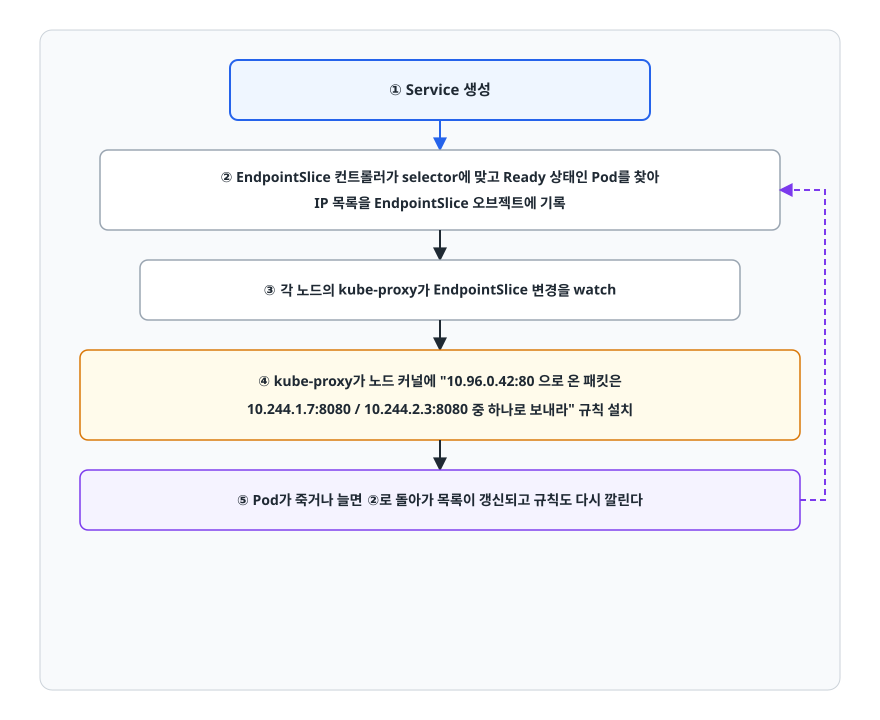
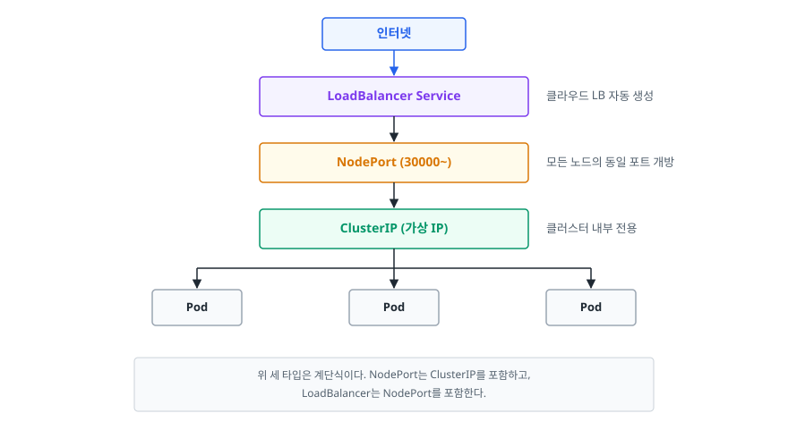
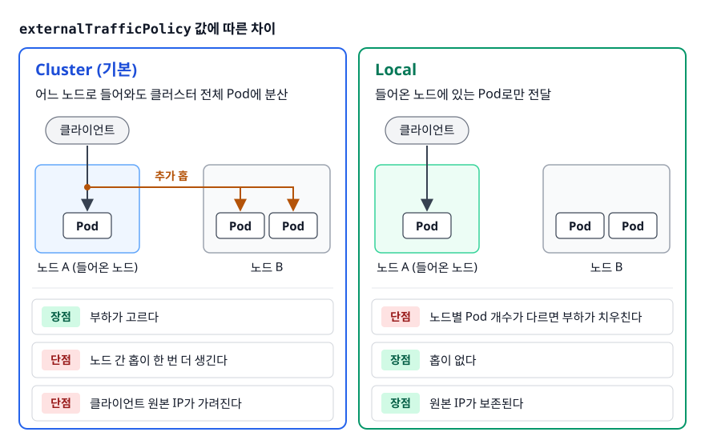
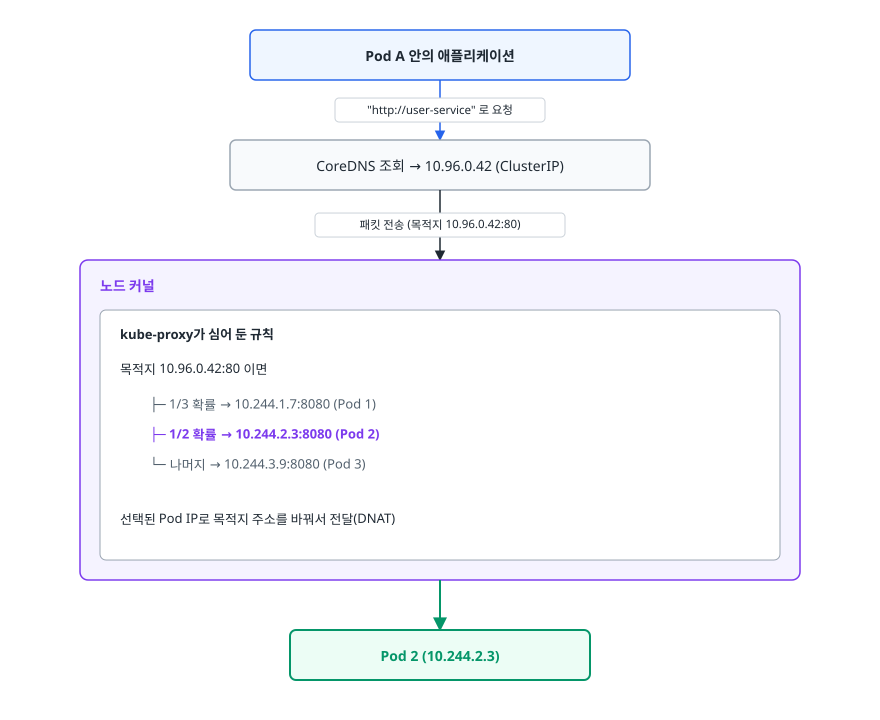
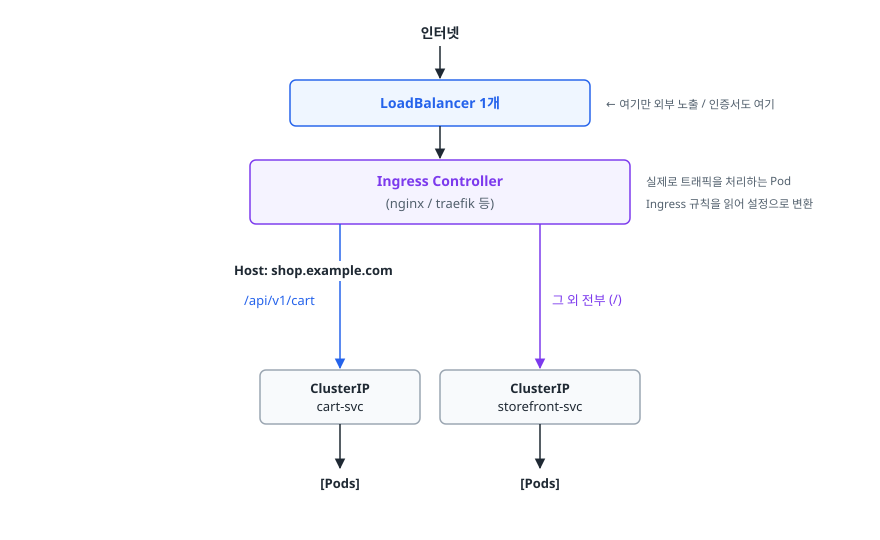

# 서비스와 네트워킹 (Service & Networking)

> Pod IP는 계속 바뀝니다. 그런데도 서비스가 멀쩡히 돌아가는 이유와 Service 타입을 고르는 기준, 그리고 Ingress가 왜 비용 문제에서 출발한 기능인지를 이 문서에서 설명합니다.

## 학습 목표

- [ ] Service가 Label Selector로 Pod를 추적하는 과정을 EndpointSlice까지 설명할 수 있다
- [ ] ClusterIP / NodePort / LoadBalancer / ExternalName을 상황에 맞게 고를 수 있다
- [ ] kube-proxy가 iptables와 IPVS로 트래픽을 넘기는 방식의 차이를 안다
- [ ] 클러스터 DNS 이름 규칙과 서비스 디스커버리 동작을 이해한다
- [ ] Ingress와 Ingress Controller의 관계, L7 라우팅이 해결하는 문제를 설명할 수 있다
- [ ] NetworkPolicy가 없을 때 클러스터 내부 통신이 어떤 상태인지 안다

## 선행 지식

- [01-architecture-concepts.md](./01-architecture-concepts.md) - Pod와 kube-proxy의 위치
- [02-deployment-management.md](./02-deployment-management.md) - 복제본이 늘고 주는 상황

---

## 1. 왜 필요한가: Pod IP는 약속할 수 없는 값이다

Pod는 뜰 때 클러스터 네트워크에서 IP를 하나 받습니다. 문제는 그 IP가 **아무것도 보장하지 않는다**는 데 있습니다.

- Pod가 죽고 다시 뜨면 이름도 IP도 다른 값이 됩니다
- 롤링 업데이트를 하면 IP 3개가 통째로 다른 3개로 교체됩니다
- HPA가 스케일아웃하면 IP가 늘어나고, 축소하면 줄어듭니다
- 노드가 죽으면 그 노드의 Pod IP가 한꺼번에 사라집니다

이 상태에서 주문 서비스가 사용자 서비스를 호출해야 한다고 해 보겠습니다. 주문 서비스는 사용자 서비스 Pod의 IP를 어떻게 알까요? 설정 파일에 적어 두면 다음 배포에 무너집니다. 시작할 때 조회한다고 해도 그 뒤에 바뀝니다. 직접 감시하는 코드를 넣으면 모든 서비스가 같은 코드를 중복으로 갖게 됩니다.

**Service는 이 문제를 "고정된 이름과 고정된 가상 IP"로 바꿔 줍니다.** 클라이언트는 `user-service`라는 이름만 알면 되고, 그 뒤에 Pod가 몇 개이고 IP가 무엇인지는 신경 쓰지 않습니다.

> **비유하자면 회사 대표번호입니다.** 상담원(Pod)은 교대하고 퇴사하고 신입이 들어오지만 대표번호는 그대로입니다. 전화를 걸면 교환기가 지금 근무 중인 사람에게 연결합니다.
>
> **비유의 한계**: 대표번호에는 실체가 있는 전화선이 붙어 있습니다. 하지만 ClusterIP는 **어떤 네트워크 인터페이스에도 붙어 있지 않은 가상 주소**입니다. 그 IP로 핑을 보내도 응답하지 않는 경우가 많습니다. 실제로는 각 노드의 커널에 설치된 규칙이 패킷의 목적지를 Pod IP로 바꿔치기할 뿐입니다. 이 사실을 모르면 "Service IP에 핑이 안 가는데 왜 통신은 되지?"에서 막힙니다.

---

## 2. Service는 어떻게 Pod를 찾는가

Service는 IP 목록을 들고 있지 않습니다. **라벨(Label)로 조건을 걸어 둡니다.**

```yaml
# Deployment가 만드는 Pod에 붙는 라벨
template:
  metadata:
    labels:
      app: user
---
apiVersion: v1
kind: Service
metadata:
  name: user-service
spec:
  selector:
    app: user          # 이 라벨을 가진 Pod 전부
  ports:
  - port: 80           # Service가 노출하는 포트
    targetPort: 8080   # Pod의 컨테이너 포트
```

이후 흐름은 컨트롤 플레인이 처리합니다.

<!-- diagram:cloud-networking-service-1 -->


<!-- 위 그림이 대체한 원본 ASCII.
     내용을 고칠 때는 그림도 함께 갱신할 것.
```
① Service 생성
        ↓
② EndpointSlice 컨트롤러가 selector에 맞고 Ready 상태인 Pod를 찾아
   IP 목록을 EndpointSlice 오브젝트에 기록
        ↓
③ 각 노드의 kube-proxy가 EndpointSlice 변경을 watch
        ↓
④ kube-proxy가 노드 커널에 "10.96.0.42:80 으로 온 패킷은
   10.244.1.7:8080 / 10.244.2.3:8080 중 하나로 보내라" 규칙 설치
        ↓
⑤ Pod가 죽거나 늘면 ②로 돌아가 목록이 갱신되고 규칙도 다시 깔린다
```
-->

여기서 기억할 것은 **"Ready 상태인 Pod만 엔드포인트에 들어간다"** 는 사실입니다. readiness probe가 실패하는 Pod는 자동으로 목록에서 빠집니다. 이게 무중단 배포가 성립하는 근거입니다. 반대로 readiness probe를 잘못 설정하면 멀쩡한 Pod가 전부 목록에서 빠지고, 서비스가 통째로 죽는 사고로 이어집니다.

```bash
kubectl get svc user-service
kubectl get endpointslices -l kubernetes.io/service-name=user-service
kubectl describe svc user-service          # Endpoints 항목이 비어 있으면 selector 불일치 의심
kubectl get pods -l app=user -o wide       # 라벨이 실제로 붙었는지 확인
```

**Endpoints가 비어 있다**는 것은 실무에서 가장 흔한 연결 장애의 신호입니다. 원인은 대개 둘 중 하나입니다. selector와 Pod 라벨의 오타, 그리고 모든 Pod가 Ready가 아닌 상태.

---

## 3. Service 타입 네 가지

<!-- diagram:cloud-networking-service-2 -->


<!-- 위 그림이 대체한 원본 ASCII.
     내용을 고칠 때는 그림도 함께 갱신할 것.
```
                       인터넷
                          │
              ┌───────────▼────────────┐
              │  LoadBalancer Service  │  클라우드 LB 자동 생성
              └───────────┬────────────┘
                          │
              ┌───────────▼────────────┐
              │   NodePort (30000~)    │  모든 노드의 동일 포트 개방
              └───────────┬────────────┘
                          │
              ┌───────────▼────────────┐
              │   ClusterIP (가상 IP)  │  클러스터 내부 전용
              └───────────┬────────────┘
                          │
        ┌─────────────────┼─────────────────┐
        ▼                 ▼                 ▼
    ┌───────┐         ┌───────┐         ┌───────┐
    │ Pod   │         │ Pod   │         │ Pod   │
    └───────┘         └───────┘         └───────┘

  위 세 타입은 계단식이다. NodePort는 ClusterIP를 포함하고,
  LoadBalancer는 NodePort를 포함한다.
```
-->

| 타입 | 접근 범위 | 동작 | 언제 쓰나 |
|---|---|---|---|
| ClusterIP (기본) | 클러스터 내부만 | 가상 IP + DNS 이름 부여 | 내부 API, DB, 캐시 — 대부분의 Service |
| NodePort | 노드 IP:포트로 외부 | 모든 노드의 30000~32767 중 한 포트 개방 | 로컬 테스트, 온프레미스 임시 노출 |
| LoadBalancer | 외부 | 클라우드 LB를 프로비저닝해 노드로 분산 | 프로덕션 외부 노출(단, 보통 Ingress와 조합) |
| ExternalName | 해당 없음 | DNS CNAME만 반환, 프록시하지 않음 | 외부 관리형 서비스를 내부 이름으로 부르고 싶을 때 |

**선택 기준 한 줄**: 외부에 열 필요가 없으면 무조건 ClusterIP, HTTP 트래픽을 외부에 열어야 하면 LoadBalancer 하나 + Ingress, HTTP가 아닌 프로토콜을 외부에 열어야 하면 그때 LoadBalancer를 개별로 만듭니다.

### ClusterIP

기본값입니다. 클러스터 안에서만 유효한 가상 IP와 DNS 이름을 얻습니다. DB, 캐시, 내부 마이크로서비스는 예외 없이 이걸 씁니다. MariaDB에 LoadBalancer를 붙이면 인터넷에서 DB 포트가 열리는 셈이니 절대 하면 안 됩니다.

`clusterIP: None`으로 지정하면 **헤드리스(Headless) Service**가 됩니다. 가상 IP를 만들지 않고, DNS 조회에 **Pod IP 목록을 그대로** 돌려줍니다. 로드밸런싱이 아니라 "각 Pod를 개별로 지목"해야 하는 StatefulSet에서 반드시 필요합니다.

```yaml
apiVersion: v1
kind: Service
metadata:
  name: mysql-headless
spec:
  clusterIP: None
  selector:
    app: mysql
  ports:
  - port: 3306
```

### NodePort

모든 노드가 같은 포트를 엽니다. 어느 노드로 들어와도 Service로 전달됩니다. 단, 제약이 몇 가지 있습니다. 포트 범위가 좁고(기본 30000~32767), 노드 IP를 외부에 노출해야 합니다. 노드가 늘고 줄 때 클라이언트가 알 방법도 없습니다. 그래서 프로덕션 직접 노출용으로는 잘 쓰지 않습니다. 다만 LoadBalancer 타입 내부에서 NodePort가 실제로 쓰이므로 개념 자체는 알아야 합니다.

### LoadBalancer

클라우드 컨트롤러가 실제 로드밸런서를 프로비저닝하고, 그 뒤를 노드의 NodePort로 연결합니다. 온프레미스에는 프로비저닝해 줄 주체가 없어서 `EXTERNAL-IP`가 `<pending>`에 머뭅니다. 이 경우 MetalLB 같은 구현체를 따로 설치합니다.

여기서 실무의 핵심 문제가 나옵니다. **Service마다 LoadBalancer를 만들면 클라우드 LB가 서비스 개수만큼 생깁니다.** 클라우드 LB는 대체로 "존재하는 시간 + 처리한 트래픽"으로 과금되는 구조이므로, 마이크로서비스가 20개면 LB도 20개 몫의 고정 비용이 계속 발생합니다. 도메인과 인증서도 각각 관리해야 합니다. 이 문제를 풀려고 나온 것이 뒤에서 볼 Ingress입니다.

세부 동작 중 하나 알아 둘 만한 것이 `externalTrafficPolicy`입니다.

<!-- diagram:cloud-networking-service-3 -->


<!-- 위 그림이 대체한 원본 ASCII.
     내용을 고칠 때는 그림도 함께 갱신할 것.
```
Cluster (기본) : 어느 노드로 들어와도 클러스터 전체 Pod에 분산
                 → 부하는 고르지만 노드 간 홉이 한 번 더 생기고
                   클라이언트 원본 IP가 가려진다

Local          : 들어온 노드에 있는 Pod로만 전달
                 → 원본 IP가 보존되고 홉이 없지만,
                   노드별 Pod 개수가 다르면 부하가 치우친다
```
-->

접속자 IP로 로그를 남기거나 IP 기반 제한을 걸어야 한다면 `Local`이 필요합니다. 대신 Pod가 노드에 고르게 퍼져 있는지 확인해야 합니다.

### ExternalName

프록시를 하지 않고 DNS CNAME만 반환합니다. 예를 들어 DB를 클러스터 밖 관리형 서비스로 옮겼을 때, 애플리케이션 설정을 고치지 않고 `mysql-service`라는 이름을 외부 호스트명으로 넘길 수 있습니다.

```yaml
apiVersion: v1
kind: Service
metadata:
  name: mysql-service
spec:
  type: ExternalName
  externalName: prod-db.abcdefg.ap-northeast-2.rds.amazonaws.com
```

selector도 포트도 없습니다. 순수한 DNS 별칭이라 TLS 인증서 검증이나 HTTP Host 헤더가 원본 호스트명 기준으로 동작한다는 점만 유의합니다.

---

## 4. kube-proxy: iptables와 IPVS

ClusterIP는 실체 없는 주소라고 했습니다. 그럼 실제로 패킷은 어떻게 Pod까지 갈까요? 각 노드의 kube-proxy가 커널에 규칙을 심어 두고, 패킷이 나갈 때 목적지 주소를 바꿔치기(DNAT)합니다.

<!-- diagram:cloud-networking-service-4 -->


<!-- 위 그림이 대체한 원본 ASCII.
     내용을 고칠 때는 그림도 함께 갱신할 것.
```
Pod A 안의 애플리케이션
   │ "http://user-service" 로 요청
   ▼
CoreDNS 조회 → 10.96.0.42 (ClusterIP)
   │
   ▼ 패킷 전송 (목적지 10.96.0.42:80)
┌──────────────────── 노드 커널 ────────────────────┐
│  kube-proxy가 심어 둔 규칙                        │
│                                                   │
│  목적지 10.96.0.42:80 이면                        │
│     ├─ 1/3 확률 → 10.244.1.7:8080  (Pod 1)        │
│     ├─ 1/2 확률 → 10.244.2.3:8080  (Pod 2)        │
│     └─ 나머지   → 10.244.3.9:8080  (Pod 3)        │
│                                                   │
│  선택된 Pod IP로 목적지 주소를 바꿔서 전달(DNAT)   │
└───────────────────────┬───────────────────────────┘
                        ▼
                  Pod 2 (10.244.2.3)
```
-->

두 가지 모드를 이해해 두면 좋습니다.

| 항목 | iptables 모드 | IPVS 모드 |
|---|---|---|
| 규칙 구조 | 선형 체인을 순차 평가 | 해시 테이블 조회 |
| 서비스 수가 많아질 때 | 규칙 수에 비례해 처리·갱신 비용 증가 | 규모가 커져도 조회 비용이 거의 일정 |
| 분산 알고리즘 | 확률 기반 무작위 선택 하나뿐 | 라운드로빈, 최소 연결, 해시 등 선택 가능 |
| 요구 사항 | 추가 준비 불필요 | 커널 IPVS 모듈 필요 |

**언제 뭘 쓰나**: 서비스와 엔드포인트가 수백 개 수준까지는 iptables로 충분합니다. 서비스가 수천 개 규모로 늘어 규칙 갱신 지연이 눈에 보이기 시작하면 nftables 모드(v1.33 GA)를 검토합니다. IPVS 모드는 v1.35부터 폐기 예정(deprecated)입니다.

여기서 중요한 성질이 하나 나옵니다. kube-proxy의 분산은 **L4(TCP 연결) 단위**입니다. HTTP 요청 하나하나를 나누지 않습니다. 그래서 클라이언트가 keep-alive로 연결을 오래 유지하거나 gRPC처럼 하나의 연결에 여러 요청을 실어 보내면, **Pod를 늘려도 트래픽이 기존 연결에 묶여 고르게 퍼지지 않습니다.** 이 문제는 클라이언트 측 로드밸런싱이나 L7 프록시(Ingress, 서비스 메시)로 풉니다. 면접에서 "gRPC 서비스를 스케일아웃했는데 부하가 안 나뉜다"는 시나리오가 나온다면 답은 이 지점에 있습니다.

---

## 5. DNS와 서비스 디스커버리

클러스터 안에는 CoreDNS가 돌고 있고, 모든 Pod의 `/etc/resolv.conf`는 이 DNS를 가리킵니다. Service를 만들면 자동으로 DNS 레코드가 생깁니다.

```
<service-name>.<namespace>.svc.cluster.local

예) default 네임스페이스의 user-service
    → user-service.default.svc.cluster.local
```

같은 네임스페이스에서는 짧은 이름으로도 찾아집니다. `resolv.conf`의 search 도메인 덕분입니다.

```
같은 네임스페이스     : http://user-service
다른 네임스페이스     : http://user-service.payment
완전한 이름(FQDN)     : http://user-service.payment.svc.cluster.local
```

헤드리스 Service를 쓰는 StatefulSet은 Pod 단위 이름도 생깁니다.

```
<pod-name>.<headless-service>.<namespace>.svc.cluster.local
   → mysql-0.mysql-headless.default.svc.cluster.local
```

### 실무에서 걸리는 지점

**DNS 캐시와 재조회.** 애플리케이션이나 런타임이 DNS 결과를 오래 캐싱하면, Service의 ClusterIP가 바뀌었을 때(Service를 지웠다 다시 만든 경우 등) 옛 주소로 계속 붙습니다. ClusterIP는 웬만해선 바뀌지 않으니 큰 문제는 아니지만, 헤드리스 Service를 쓸 때는 Pod IP를 직접 캐싱하게 되므로 영향이 큽니다.

**외부 도메인 조회가 느려지는 현상.** `resolv.conf`의 `ndots` 설정 때문에, 점이 적게 포함된 도메인은 클러스터 내부 search 도메인을 먼저 다 시도한 뒤에야 외부로 나갑니다. 외부 API 호출이 잦은 서비스에서 지연으로 나타날 수 있습니다. 완전한 FQDN(끝에 점 포함)을 쓰거나 Pod의 `dnsConfig`로 조정합니다.

```bash
# 클러스터 안에서 DNS 확인
kubectl run -it --rm dnstest --image=busybox:1.36 --restart=Never -- \
  nslookup user-service.default.svc.cluster.local

kubectl -n kube-system get pods -l k8s-app=kube-dns   # CoreDNS 상태
kubectl exec -it <pod> -- cat /etc/resolv.conf
```

---

## 6. Ingress: 하나의 진입점에서 L7 라우팅

### 왜 필요한가

앞서 본 대로 서비스마다 LoadBalancer를 만들면 LB 개수가 서비스 개수만큼 늘고, 고정 비용도 그만큼 붙습니다. 게다가 도메인, TLS 인증서, 접근 로그, 인증 처리를 서비스마다 따로 구성해야 합니다.

대부분의 웹 트래픽은 **경로나 호스트만 보고 어느 서비스로 보낼지 정할 수 있습니다.** `shop.example.com/api/v1/cart`로 온 요청은 장바구니 서비스로, 나머지 경로는 화면을 그리는 스토어프론트로 보내면 그만입니다. 그렇다면 LB 하나를 앞에 두고 그 뒤에서 HTTP 헤더를 읽어 분기하면 됩니다. 이게 Ingress입니다.

<!-- diagram:cloud-networking-service-5 -->


<!-- 위 그림이 대체한 원본 ASCII.
     내용을 고칠 때는 그림도 함께 갱신할 것.
```
                    인터넷
                       │
          ┌────────────▼─────────────┐
          │  LoadBalancer 1개        │  ← 여기만 외부 노출 / 인증서도 여기
          └────────────┬─────────────┘
                       │
          ┌────────────▼─────────────┐
          │   Ingress Controller     │  실제로 트래픽을 처리하는 Pod
          │   (nginx / traefik 등)   │  Ingress 규칙을 읽어 설정으로 변환
          └────┬──────────┬──────────┘
               │          │
      Host: shop.example.com
  /api/v1/cart │          │ 그 외 전부 (/)
               ▼          ▼
        ┌───────────┐  ┌────────────────┐
        │ClusterIP  │  │   ClusterIP    │
        │ cart-svc  │  │ storefront-svc │
        └─────┬─────┘  └───────┬────────┘
              ▼                ▼
           [Pods]           [Pods]
```
-->

### Ingress와 Ingress Controller는 다르다

가장 흔한 함정입니다. **Ingress 리소스만 만들면 아무 일도 일어나지 않습니다.** Ingress는 "이런 규칙으로 라우팅해 달라"는 선언일 뿐이고, 그 선언을 읽어 실제로 트래픽을 처리하는 프로그램이 Ingress Controller입니다. 컨트롤러를 설치하지 않은 클러스터에서 Ingress를 만들면 `ADDRESS`가 영영 비어 있습니다.

대표적인 컨트롤러로 ingress-nginx(2026년 3월 유지보수 종료), Traefik, HAProxy Ingress가 있고, 클라우드에서는 AWS Load Balancer Controller처럼 클라우드 LB 자체를 L7로 구성해 주는 것도 씁니다. 어떤 컨트롤러를 쓸지는 `ingressClassName`으로 지정합니다.

```yaml
apiVersion: networking.k8s.io/v1
kind: Ingress
metadata:
  name: shop-ingress
  namespace: shop
spec:
  ingressClassName: nginx
  tls:
  - hosts:
    - shop.example.com
    secretName: shop-tls       # TLS 인증서를 담은 Secret (같은 네임스페이스여야 한다)
  rules:
  - host: shop.example.com
    http:
      paths:
      - path: /api/v1/cart     # 가장 길게 일치하는 경로가 우선한다(YAML 순서와 무관)
        pathType: Prefix
        backend:
          service:
            name: cart-svc
            port:
              number: 8080
      - path: /                # 나머지 전부
        pathType: Prefix
        backend:
          service:
            name: storefront-svc
            port:
              number: 80
```

`pathType`은 `networking.k8s.io/v1`에서 생략할 수 없는 필수 필드입니다. 값은 셋인데, 실무에서는 `Prefix`(경로 세그먼트 단위 접두사 일치)와 `Exact`(완전 일치)를 주로 씁니다. 나머지 하나인 `ImplementationSpecific`은 해석을 컨트롤러에 통째로 맡기는 값이라, 컨트롤러를 교체하면 같은 규칙이 다르게 동작할 수 있습니다.

Ingress가 얻어 주는 것은 라우팅만이 아닙니다. **TLS 종료를 한 곳에서** 처리하므로 인증서 관리 지점이 하나로 줄고, cert-manager와 엮으면 발급·갱신까지 자동화됩니다. 접근 로그, 속도 제한, 헤더 조작 같은 공통 관심사도 여기서 처리할 수 있습니다.

Ingress 표준 스펙이 다루는 것은 사실상 HTTP/HTTPS뿐이라는 한계도 있습니다. 그 이상의 기능(가중치 기반 트래픽 분할, 헤더 기반 분기 등)은 컨트롤러별 어노테이션에 의존합니다. 그래서 컨트롤러를 바꾸면 설정을 다시 써야 하는 이식성 문제가 생깁니다. 이를 표준화하려는 후속 규격이 **Gateway API**이며, 새 클러스터를 설계한다면 검토해 볼 만합니다.

---

## 7. NetworkPolicy: 기본값은 전부 열려 있다

여기서 놀라는 사람이 많습니다. **쿠버네티스의 기본 동작은 "모든 Pod가 모든 Pod에 접근 가능"입니다.** 네임스페이스가 달라도 막히지 않습니다. 프론트엔드 Pod에서 DB Pod로 직접 붙을 수 있고, 침해된 Pod 하나가 클러스터 전체를 훑을 수 있다는 뜻입니다.

NetworkPolicy는 이 흐름을 제한합니다. 방화벽 규칙을 Pod 라벨 기준으로 선언한다고 보면 됩니다.

```yaml
# 1단계: 이 네임스페이스의 모든 인그레스를 기본 차단
apiVersion: networking.k8s.io/v1
kind: NetworkPolicy
metadata:
  name: default-deny-ingress
  namespace: payment
spec:
  podSelector: {}          # 네임스페이스의 모든 Pod
  policyTypes:
  - Ingress
---
# 2단계: 필요한 경로만 다시 연다
apiVersion: networking.k8s.io/v1
kind: NetworkPolicy
metadata:
  name: allow-api-to-db
  namespace: payment
spec:
  podSelector:
    matchLabels:
      app: postgres
  policyTypes:
  - Ingress
  ingress:
  - from:
    - podSelector:
        matchLabels:
          app: payment-api
    ports:
    - protocol: TCP
      port: 5432
```

동작 규칙에서 헷갈리기 쉬운 부분이 있습니다.

- Pod에 적용되는 정책이 **하나도 없으면** 그 Pod는 전부 허용 상태입니다.
- 정책이 **하나라도 붙는 순간** 그 Pod는 "명시적으로 허용된 것만" 받습니다. 화이트리스트 방식입니다.
- 여러 정책이 붙으면 **합집합(OR)** 으로 허용됩니다. 뒤에 붙은 정책이 앞의 허용을 취소하지 않습니다.
- Ingress(들어오는)와 Egress(나가는)는 별개입니다. 들어오는 것만 막았다면 나가는 트래픽은 여전히 자유롭습니다.

**가장 중요한 전제**: NetworkPolicy는 CNI 플러그인이 구현해 줘야 동작합니다. Calico, Cilium 등은 지원합니다. 지원하지 않는 CNI에서는 정책을 만들어도 **오류 없이 조용히 무시됩니다.** "정책을 걸었는데 여전히 통신이 된다"는 상황의 1순위 원인이 이것입니다. 클러스터를 받았다면 CNI가 무엇인지부터 확인해야 합니다.

---

## 8. 실무에서는

**외부 노출은 LB 하나 + Ingress가 기본형입니다.** 서비스가 늘어도 LB는 그대로고, 인증서와 접근 제어를 한 곳에서 관리합니다. HTTP가 아닌 프로토콜(예: 게임 서버의 UDP)만 별도 LoadBalancer Service로 뺍니다.

**서비스 메시는 Service가 못 하는 일을 채웁니다.** Istio나 Linkerd는 사이드카 프록시로 L7 단위 로드밸런싱, 재시도·타임아웃, 서비스 간 mTLS, 세밀한 트래픽 분할(카나리)을 제공합니다. 앞서 본 gRPC 부하 편중 문제도 여기서 풀립니다. 다만 사이드카가 모든 Pod에 붙으므로 자원과 운영 복잡도가 늘어납니다. 서비스 수가 적다면 과한 선택입니다.

**네트워크 트러블슈팅은 계층을 좁혀 갑니다.** "서비스에 접속이 안 된다"는 신고가 오면 아래 순서로 좁힙니다.

```
① Pod가 살아 있고 Ready인가          kubectl get pods -o wide
② Service의 Endpoints가 비어 있지 않은가  kubectl describe svc <svc>
③ Pod에서 Pod IP로 직접 붙는가        kubectl exec -it <pod> -- curl <podIP>:8080
④ Pod에서 Service 이름으로 붙는가     kubectl exec -it <pod> -- curl <svc>:80
⑤ DNS가 응답하는가                    nslookup <svc>.<ns>.svc.cluster.local
⑥ NetworkPolicy가 막고 있지 않은가    kubectl get netpol -A
⑦ Ingress Controller까지 도달하는가   컨트롤러 Pod 로그 확인
```

③은 되는데 ④가 안 되면 Service 설정(selector/targetPort)이나 kube-proxy 문제이고, ④는 되는데 외부에서만 안 되면 Ingress나 LB 쪽입니다. 더 넓은 진단 절차는 [05-troubleshooting.md](./05-troubleshooting.md)와 [qna-troubleshooting.md](../practical-scenarios/qna-troubleshooting.md)를 참고합니다.

---

## 9. 면접 포인트

> 면접에서 이 주제가 나오면 이렇게 답한다

**Q. Service는 Pod IP가 바뀌는 것을 어떻게 따라가나요?**

A. Service는 IP 목록이 아니라 Label Selector를 들고 있습니다. EndpointSlice 컨트롤러가 selector에 맞고 Ready 상태인 Pod의 IP를 모아 EndpointSlice에 기록합니다. 각 노드의 kube-proxy는 그 변경을 watch하면서 커널 라우팅 규칙을 갱신합니다. 그래서 Pod가 죽고 새로 떠도 같은 라벨만 달려 있으면 자동으로 목록에 들어옵니다. 중요한 건 Ready인 Pod만 포함된다는 점이고, 이 성질이 무중단 배포의 근거가 됩니다.

- 꼬리 질문: "Endpoints가 비었으면 무엇을 의심하나요?" → selector와 Pod 라벨 불일치, readiness probe 실패로 Ready인 Pod가 없는 경우.

**Q. Service 타입은 어떤 기준으로 고르나요?**

A. 먼저 외부 노출이 필요한지 봅니다. 필요 없으면 ClusterIP입니다. DB나 캐시를 LoadBalancer로 노출하면 인터넷에서 직접 접근 가능해지므로 반드시 ClusterIP로 막습니다. 외부 노출이 필요하고 HTTP 트래픽이면 LoadBalancer 하나에 Ingress를 얹어 호스트·경로 기반으로 여러 서비스를 태웁니다. 서비스마다 LoadBalancer를 만들면 클라우드 LB가 서비스 수만큼 생겨 고정 비용과 인증서 관리 지점이 함께 늘기 때문입니다. HTTP가 아닌 프로토콜이면 그때 개별 LoadBalancer를 씁니다.

- 꼬리 질문: "NodePort는 언제 쓰나요?" → 로컬 테스트나 온프레미스 임시 노출. 포트 범위 제약과 노드 IP 노출 때문에 프로덕션 직접 노출에는 부적합합니다.

**Q. gRPC 서비스를 스케일아웃했는데 특정 Pod에만 부하가 몰립니다. 왜 그럴까요?**

A. kube-proxy의 분산은 TCP 연결 단위이기 때문입니다. gRPC는 하나의 HTTP/2 연결에 여러 요청을 다중화해서 보내는데, 연결이 한 번 맺어지면 그 뒤 요청은 계속 같은 Pod로 갑니다. Pod를 늘려도 기존 연결은 재분배되지 않습니다. 해결책은 L7에서 요청 단위로 분산하는 것입니다. 헤드리스 Service와 클라이언트 측 로드밸런싱을 쓰거나, 서비스 메시나 gRPC를 이해하는 프록시를 앞에 두면 됩니다.

- 꼬리 질문: "HTTP keep-alive에서도 같은 문제가 있나요?" → 원리는 같습니다. 연결을 오래 유지할수록 분산이 치우칩니다.

**Q. Ingress를 만들었는데 접속이 안 됩니다.**

A. 가장 먼저 Ingress Controller가 설치되어 있는지 확인합니다. Ingress 리소스는 선언일 뿐이고 실제로 트래픽을 처리하는 것은 컨트롤러 Pod입니다. 컨트롤러가 없으면 Ingress의 ADDRESS가 비어 있습니다. 그다음으로는 ingressClassName이 설치된 컨트롤러와 맞는지, 백엔드 Service의 Endpoints가 채워져 있는지, DNS가 LB 주소를 가리키는지, TLS Secret이 같은 네임스페이스에 있는지 순서로 확인합니다.

---

## 자주 하는 실수

| 실수 | 왜 틀렸나 | 올바른 이해 |
|---|---|---|
| DB Service를 LoadBalancer로 노출 | 인터넷에서 DB 포트에 직접 접근 가능해짐 | 내부 통신은 예외 없이 ClusterIP |
| Ingress만 만들고 접속을 기대 | Ingress는 선언, 처리 주체는 컨트롤러 | Ingress Controller 설치가 선행 |
| `port`와 `targetPort`를 혼동 | port는 Service가 여는 포트, targetPort는 컨테이너 포트 | 둘을 분리해서 설계 |
| ClusterIP에 핑이 안 간다고 장애로 판단 | 실체 없는 가상 주소이며 규칙으로만 존재 | 연결 테스트는 실제 포트로 `curl` |
| NetworkPolicy를 걸었는데 통신이 계속됨 | CNI가 NetworkPolicy를 지원하지 않으면 무시됨 | 클러스터 CNI 종류를 먼저 확인 |
| 정책 하나 만들고 보안이 끝났다고 생각 | 정책이 없는 Pod는 여전히 전부 허용 | default-deny를 깔고 필요한 것만 연다 |
| 서비스마다 LoadBalancer 생성 | LB 개수만큼 고정 비용과 관리 지점이 늘어남 | Ingress로 하나의 진입점에 모은다 |

---

## 한 줄 정리

Service는 사라지는 Pod IP를 라벨 기반의 안정적인 이름과 가상 IP로 바꿔 주는 L4 추상화입니다. 호스트·경로처럼 HTTP를 봐야 하는 라우팅과 TLS 종료는 그 위의 Ingress가 맡습니다. 기본값으로 전부 열려 있는 내부 통신은 NetworkPolicy로 따로 좁혀야 합니다.

---

## 연관 개념

- [01-architecture-concepts.md](./01-architecture-concepts.md) - kube-proxy와 EndpointSlice 컨트롤러의 위치
- [02-deployment-management.md](./02-deployment-management.md) - readiness probe와 롤링 업데이트의 관계
- [04-config-storage.md](./04-config-storage.md) - TLS 인증서를 담는 Secret 다루기
- [05-troubleshooting.md](./05-troubleshooting.md) - 연결 장애 진단 절차
- [qna-kubernetes.md](./qna-kubernetes.md) - Service 타입과 Ingress 면접 질문
- [qna-linux-networking.md](../linux-networking/qna-linux-networking.md) - iptables, DNS 등 기반 네트워크 지식
- [qna-troubleshooting.md](../practical-scenarios/qna-troubleshooting.md) - 실전 장애 대응 시나리오
