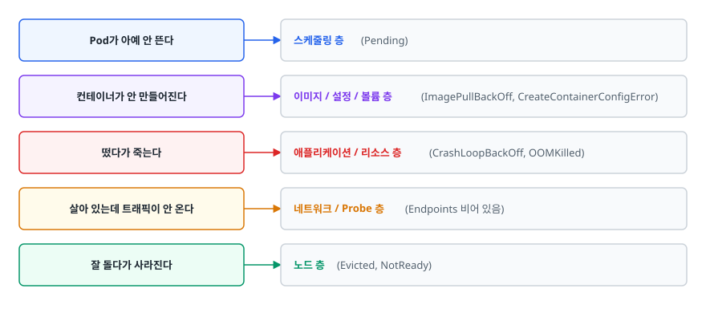
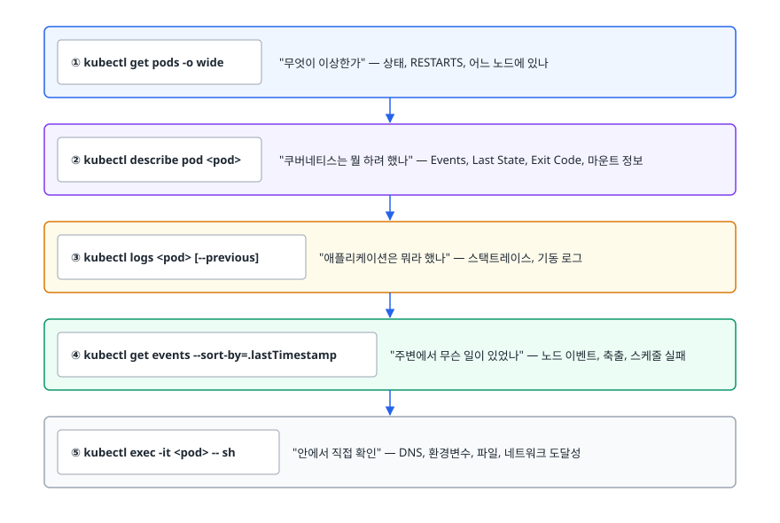
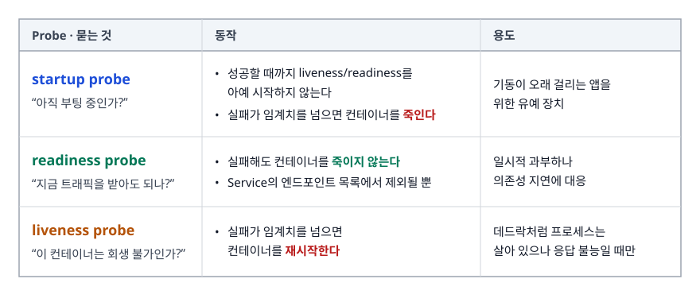
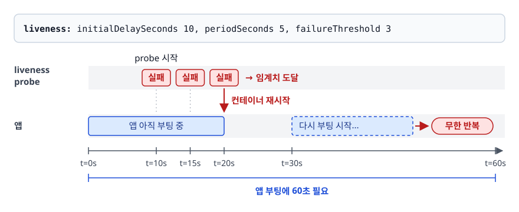
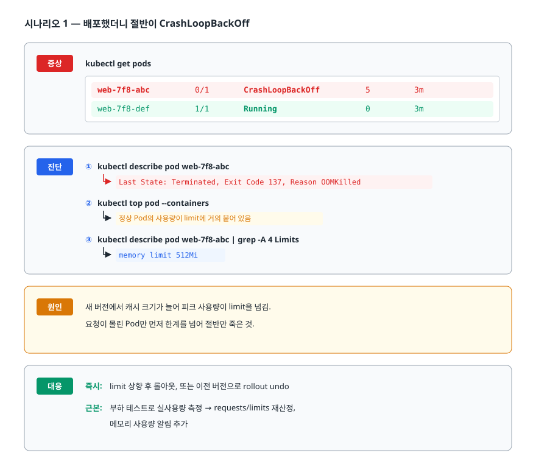
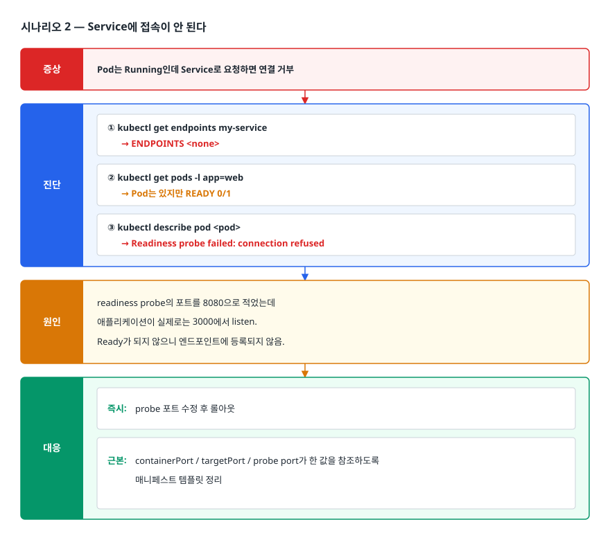
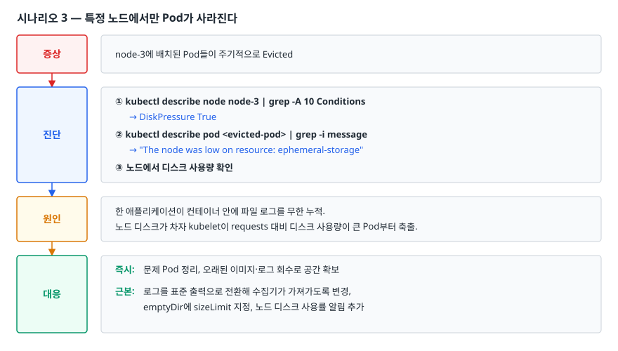

# 실전 트러블슈팅 (Kubernetes Troubleshooting)

> Pod 상태 이름으로 원인을 넘겨짚는 법은 다루지 않습니다. 어떤 명령을 어떤 순서로 실행해 증상에서 원인까지 좁혀 가는지를 몸에 익히는 문서입니다.

## 학습 목표

- [ ] get → describe → logs → events → exec 순서로 진단하는 이유를 안다
- [ ] Pending / ImagePullBackOff / CrashLoopBackOff / OOMKilled / Evicted의 원인을 구분한다
- [ ] 종료 코드(Exit Code)로 컨테이너가 왜 죽었는지 읽을 수 있다
- [ ] 노드 상태(Condition)와 리소스 압박을 진단할 수 있다
- [ ] Probe 세 종류의 역할 차이와 오설정이 만드는 장애를 설명할 수 있다

## 선행 지식

- [01-architecture-concepts.md](./01-architecture-concepts.md) - 스케줄러와 kubelet의 역할 분담
- [02-deployment-management.md](./02-deployment-management.md) - requests/limits와 QoS
- [04-config-storage.md](./04-config-storage.md) - ConfigMap/Secret 주입, PVC

---

## 1. 왜 필요한가: 상태 이름은 원인이 아니라 증상이다

`kubectl get pods`를 쳤을 때 나오는 `CrashLoopBackOff`는 원인이 아닙니다. **"컨테이너가 반복해서 죽고 있으며, 쿠버네티스가 재시작 간격을 늘려 가며 기다리는 중"** 이라는 상태 서술일 뿐입니다. 실제 원인은 DB 연결 실패일 수도, 환경변수 누락일 수도, 메모리 부족일 수도, liveness probe 오설정일 수도 있습니다.

> **병원에 비유하면 "열이 난다"에 해당합니다.** 열은 증상이지 병명이 아닙니다. 감기일 수도 있고 폐렴일 수도 있어서, 문진하고 검사해서 좁혀 갑니다.
>
> 비유에는 한계도 있습니다. 환자는 증상을 말해 주지만 Pod는 말이 없습니다. 대신 쿠버네티스는 **모든 판단 과정을 이벤트로 기록해 둡니다.** 그래서 진단의 절반은 "물어보는" 게 아니라 "이미 기록된 것을 읽는" 일입니다. `describe`와 `events`를 먼저 보는 습관이 중요한 이유입니다.

또 하나 알아 둘 것은 **원인이 어느 층에 있는지 층위가 정해져 있다**는 점입니다.

<!-- diagram:cloud-troubleshooting-1 -->


<!-- 위 그림이 대체한 원본 ASCII.
     내용을 고칠 때는 그림도 함께 갱신할 것.
```
Pod가 아예 안 뜬다        → 스케줄링 층 (Pending)
컨테이너가 안 만들어진다  → 이미지 / 설정 / 볼륨 층 (ImagePullBackOff, CreateContainerConfigError)
떴다가 죽는다             → 애플리케이션 / 리소스 층 (CrashLoopBackOff, OOMKilled)
살아 있는데 트래픽이 안 온다 → 네트워크 / Probe 층 (Endpoints 비어 있음)
잘 돌다가 사라진다        → 노드 층 (Evicted, NotReady)
```
-->

증상을 보고 어느 층인지 먼저 정하면 확인할 명령이 절반 이하로 줄어듭니다.

---

## 2. 진단의 기본 순서

무슨 장애든 이 순서를 벗어나지 않습니다.

<!-- diagram:cloud-troubleshooting-2 -->


<!-- 위 그림이 대체한 원본 ASCII.
     내용을 고칠 때는 그림도 함께 갱신할 것.
```
① kubectl get pods -o wide
      "무엇이 이상한가" — 상태, RESTARTS, 어느 노드에 있나
                 ↓
② kubectl describe pod <pod>
      "쿠버네티스는 뭘 하려 했나" — Events, Last State, Exit Code, 마운트 정보
                 ↓
③ kubectl logs <pod> [--previous]
      "애플리케이션은 뭐라 했나" — 스택트레이스, 기동 로그
                 ↓
④ kubectl get events --sort-by=.lastTimestamp
      "주변에서 무슨 일이 있었나" — 노드 이벤트, 축출, 스케줄 실패
                 ↓
⑤ kubectl exec -it <pod> -- sh
      "안에서 직접 확인" — DNS, 환경변수, 파일, 네트워크 도달성
```
-->

②를 건너뛰고 ③으로 가는 실수를 특히 조심합니다. **컨테이너가 아직 만들어지지도 않은 상태라면 로그는 애초에 존재하지 않습니다.** `ImagePullBackOff`나 `CreateContainerConfigError`에서 `kubectl logs`를 아무리 쳐도 아무것도 나오지 않습니다. 그런데 그 이유가 `describe`에는 한 줄로 적혀 있습니다.

자주 쓰는 변형도 같이 익혀 둡니다.

```bash
kubectl get pods -o wide --sort-by='.status.containerStatuses[0].restartCount'
kubectl logs <pod> --previous              # 죽기 직전 컨테이너의 로그 (핵심)
kubectl logs <pod> -c <container>          # 멀티 컨테이너 Pod에서 특정 컨테이너
kubectl logs -l app=web --all-containers --tail=50   # 라벨로 여러 Pod 한 번에
kubectl describe pod <pod> | sed -n '/Events/,$p'    # 이벤트만 잘라 보기
kubectl get events --field-selector involvedObject.name=<pod>
```

`--previous`가 특히 중요합니다. CrashLoopBackOff 상태에서 `kubectl logs`가 보여 주는 것은 **방금 재시작한 컨테이너의 로그**이고, 아직 실패하기 전이라 비어 있는 경우가 많습니다. 실패 원인은 죽은 이전 컨테이너에 남아 있습니다.

---

## 3. Pending: 스케줄되지 못하고 있다

Pod가 만들어지긴 했는데 노드에 배정되지 않은 상태입니다. 스케줄러의 필터링을 통과한 노드가 없다는 뜻입니다.

```bash
kubectl describe pod <pod> | grep -A 10 Events
# Warning  FailedScheduling  0/5 nodes are available:
#   3 Insufficient cpu, 2 node(s) had untolerated taint {dedicated: gpu}
```

메시지가 곧 답입니다. 그래도 자주 나오는 원인은 정해져 있습니다.

| 이벤트 메시지 조각 | 원인 | 대응 |
|---|---|---|
| `Insufficient cpu` / `Insufficient memory` | 요청한 requests를 감당할 노드가 없음 | requests 재검토 또는 노드 추가 |
| `had untolerated taint` | 노드에 taint가 있는데 toleration 없음 | toleration 추가 또는 다른 노드 대상 |
| `didn't match Pod's node affinity/selector` | nodeSelector/affinity 조건에 맞는 노드 없음 | 라벨 확인 또는 조건 완화 |
| `pod has unbound immediate PersistentVolumeClaims` | PVC가 바인딩되지 않음 | `describe pvc`로 StorageClass 확인 |
| `exceeded quota` | 네임스페이스 ResourceQuota 초과. Pending이 아니라 Pod 생성 자체가 거부되어 ReplicaSet 등 컨트롤러의 `FailedCreate` 이벤트로 나타남 | 쿼터 조정 또는 불필요 워크로드 정리 |
| `node(s) didn't have free ports` | hostPort 충돌 | hostPort 사용을 재검토 |

```bash
kubectl describe node <node> | grep -A 8 "Allocated resources"
kubectl describe node <node> | grep -i taint
kubectl get pvc                     # Pending PVC가 있는지
kubectl get resourcequota -n <ns>
```

여기서 오해가 잦은 지점이 **"노드에 여유가 있는데 왜 Insufficient cpu냐"** 입니다. 스케줄러가 보는 것은 **실제 사용량이 아니라 requests의 합**입니다. 노드 CPU 실사용률이 20%여도, 그 노드의 Pod들이 requests로 이미 전부 예약해 뒀다면 더 못 넣습니다. `kubectl top node`(실사용)와 `describe node`의 Allocated resources(예약)를 함께 봐야 하는 이유가 이것입니다.

---

## 4. ImagePullBackOff / ErrImagePull

이미지를 가져오지 못한 상태입니다. `ErrImagePull`이 먼저 뜨고 재시도가 반복되면 `ImagePullBackOff`가 됩니다.

```bash
kubectl describe pod <pod> | grep -A 5 Events
# Failed to pull image "myapp:1.0": ... manifest unknown
# Failed to pull image "reg.example.com/myapp:1.0": ... unauthorized
```

원인은 대개 넷 중 하나입니다.

1. **이미지 이름이나 태그 오타.** 가장 흔합니다. 존재하지 않는 태그를 적었거나 레지스트리 주소가 틀렸습니다.
2. **프라이빗 레지스트리 인증 누락.** `imagePullSecrets`가 없거나 잘못된 네임스페이스에 있습니다. Secret은 네임스페이스 범위라, 다른 네임스페이스에 만들어 둔 것은 쓸 수 없습니다.
3. **레지스트리 pull 제한이나 네트워크 차단.** 사설 네트워크에서 아웃바운드가 막혀 있거나, 공개 레지스트리의 요청 한도에 걸렸습니다.
4. **아키텍처 불일치.** ARM 노드에 amd64 전용 이미지를 올리는 경우. `exec format error`로도 나타납니다.

```bash
# 인증 Secret이 올바른 네임스페이스에 있는지
kubectl get secret -n <ns> | grep dockerconfig
kubectl get pod <pod> -o jsonpath='{.spec.imagePullSecrets}'
```

`imagePullPolicy`도 함께 봅니다. 태그를 `latest`로 두고 이미지를 갱신했는데 반영이 안 된다면 노드에 캐시된 이미지를 쓰고 있을 수 있습니다. 운영에서는 태그를 불변으로(버전이나 커밋 해시) 관리하는 것이 근본 대책입니다.

---

## 5. CrashLoopBackOff: 떴다가 계속 죽는다

컨테이너가 시작은 되는데 곧 종료됩니다. 쿠버네티스는 재시작 간격을 지수적으로 늘려 가며(대략 10초에서 시작해 최대 5분까지) 기다립니다.

### 종료 코드부터 읽는다

```bash
kubectl describe pod <pod> | grep -A 12 "Last State"
# Last State:     Terminated
#   Reason:       OOMKilled
#   Exit Code:    137
```

| Exit Code | 의미 | 다음에 볼 것 |
|---|---|---|
| 0 | 정상 종료했는데 재시작됨 | 데몬이 아니라 한 번 실행하고 끝나는 프로세스는 아닌지. Job이어야 할 워크로드일 수 있다 |
| 1 | 애플리케이션 예외 종료 | `logs --previous`의 스택트레이스 |
| 126 / 127 | 실행 권한 없음 / 명령을 찾을 수 없음 | command·entrypoint 경로, 실행 비트 |
| 137 | SIGKILL로 강제 종료 | 대부분 OOMKilled. Reason 필드 확인 |
| 139 | 세그멘테이션 폴트 | 네이티브 라이브러리, 아키텍처 불일치 |
| 143 | SIGTERM으로 정상 종료 요청받음 | 축출, 롤아웃, drain 등 외부 요인 |

### 원인별 대응

**설정 누락.** DB 호스트나 필수 환경변수가 없어 기동 직후 죽는 경우가 가장 흔합니다. `logs --previous`에 대개 명확한 메시지가 있습니다. ConfigMap/Secret 키 이름 오타, 다른 네임스페이스의 리소스를 참조한 경우를 확인합니다. 참고로 참조 대상 자체가 없으면 컨테이너가 아예 생성되지 않고 `CreateContainerConfigError`로 나타납니다.

**의존 서비스 미기동.** DB가 아직 안 떴는데 앱이 먼저 떠서 연결 실패로 죽는 경우입니다. 근본 대책은 애플리케이션에 재시도와 백오프를 넣는 것입니다. 순서를 강제해야 한다면 init container로 의존 서비스가 뜰 때까지 대기시킵니다. 다만 재시도 없는 앱은 운영 중 DB가 잠깐 끊겨도 똑같이 죽으므로 순서 강제는 임시방편입니다.

**liveness probe 오설정.** 앱은 멀쩡한데 probe가 실패해 계속 죽이는 경우. 아래 8절에서 따로 다룹니다.

**파일 권한.** non-root로 실행하는데 마운트된 볼륨이 root 소유라 쓰기에 실패하는 경우. `securityContext.fsGroup`을 지정하면 볼륨 소유 그룹이 맞춰집니다.

---

## 6. OOMKilled: 메모리 상한을 넘었다

```bash
kubectl describe pod <pod> | grep -B 2 -A 6 "Last State"
#   Reason: OOMKilled
#   Exit Code: 137
```

컨테이너가 `resources.limits.memory`를 넘어서는 순간 커널이 프로세스를 죽입니다. 경고도 유예도 없습니다. CPU가 limit을 넘으면 스로틀링으로 느려지기만 하는 것과 대조적인데, 메모리는 이미 준 것을 회수할 수 없기 때문입니다.

진단할 때 세 가지를 구분합니다.

**① limit이 실제 필요량보다 작은가.** 부하가 걸렸을 때 실제 사용량이 얼마나 되는지 봐야 합니다.

```bash
kubectl top pod <pod> --containers
```

**② 애플리케이션에 메모리 누수가 있는가.** 사용량이 톱니 모양으로 오르내리지 않고 단조 증가한다면 누수를 의심합니다. 재시작 주기가 점점 짧아지는 패턴도 신호입니다.

**③ 런타임 설정이 컨테이너 limit을 모르는가.** JVM 앱에서 특히 자주 발생합니다. 힙 외에도 메타스페이스, 스레드 스택, 네이티브 버퍼가 메모리를 쓰기 때문에, **힙 최대치를 컨테이너 limit과 같게 잡으면 거의 확실히 OOMKilled가 납니다.** 힙은 limit보다 충분히 낮게 잡거나, 컨테이너 인식 옵션으로 비율 기반 설정을 씁니다. Node.js의 힙 상한, Go의 메모리 한도 설정도 같은 맥락에서 점검합니다.

대응 순서는 이렇습니다. 먼저 실측으로 limit이 타당한지 확인하고, 타당하다면 애플리케이션 쪽 문제이므로 프로파일링으로 넘어갑니다. 아무 근거 없이 limit만 계속 올리면 노드 전체가 위험해집니다.

---

## 7. Evicted와 노드 문제

Pod가 잘 돌다가 갑자기 `Evicted` 상태로 바뀌어 있다면 **노드가 자원 압박을 받아 kubelet이 Pod를 쫓아낸 것**입니다.

```bash
kubectl get pods -A --field-selector status.phase=Failed
kubectl describe pod <pod> | grep -i "message\|reason"
# The node was low on resource: ephemeral-storage.
```

kubelet은 노드 상태를 Condition으로 표시합니다.

```bash
kubectl describe node <node> | grep -A 10 Conditions
```

| Condition | 의미 | 흔한 원인 |
|---|---|---|
| `MemoryPressure` | 노드 메모리 부족 | limit 없는 Pod의 폭주, 과밀 배치 |
| `DiskPressure` | 디스크 또는 inode 부족 | 로그 누적, 사용하지 않는 이미지, emptyDir 폭증 |
| `PIDPressure` | 프로세스 ID 고갈 | 프로세스를 정리하지 않는 애플리케이션 |
| `Ready=False` / `Unknown` | 노드 비정상(False) 또는 kubelet 응답 없음(Unknown) | kubelet/런타임 장애, 네트워크 단절, 노드 재부팅 |

축출 순서는 QoS 클래스를 따릅니다. **BestEffort → Burstable → Guaranteed** 순으로 희생됩니다. 그래서 requests를 적어 두지 않은 Pod가 제일 먼저 사라집니다. 중요한 워크로드에 requests/limits를 성실히 적는 것이 곧 생존 전략입니다.

`DiskPressure`는 원인이 노드 바깥에 있는 경우가 많습니다. 애플리케이션이 파일 로그를 무한정 쌓거나, 오래된 이미지가 정리되지 않아 노드 디스크를 채웁니다. 로그를 표준 출력으로 내보내고 수집기가 가져가게 하는 구성이 기본입니다.

노드 자체가 `NotReady`라면 절차는 이렇습니다.

```bash
kubectl get nodes                       # 어느 노드가 문제인지
kubectl describe node <node>            # Conditions, 마지막 하트비트 시각
kubectl get pods -A -o wide --field-selector spec.nodeName=<node>
kubectl cordon <node>                   # 새 Pod 배치 중단
kubectl drain <node> --ignore-daemonsets --delete-emptydir-data   # 기존 Pod 대피
```

`drain`을 실행하기 전에 PodDisruptionBudget이 걸려 있는지 확인합니다. 없으면 한 서비스의 Pod가 전부 동시에 빠져 순간적인 다운타임이 생길 수 있습니다.

---

## 8. Probe 세 종류와 오설정이 만드는 장애

Probe는 실무 장애의 단골 원인이면서, 동시에 잘 설정하면 대부분의 장애를 자동으로 흡수해 주는 장치입니다. 세 개의 역할이 완전히 다릅니다.

<!-- diagram:cloud-troubleshooting-3 -->


<!-- 위 그림이 대체한 원본 ASCII.
     내용을 고칠 때는 그림도 함께 갱신할 것.
```
┌──────────────────────────────────────────────────────────────┐
│ startup probe   "아직 부팅 중인가?"                          │
│   성공할 때까지 liveness/readiness를 아예 시작하지 않는다     │
│   실패가 임계치를 넘으면 컨테이너를 죽인다                    │
│   → 기동이 오래 걸리는 앱을 위한 유예 장치                    │
├──────────────────────────────────────────────────────────────┤
│ readiness probe "지금 트래픽을 받아도 되나?"                 │
│   실패해도 컨테이너를 죽이지 않는다                           │
│   Service의 엔드포인트 목록에서 제외될 뿐                     │
│   → 일시적 과부하나 의존성 지연에 대응                        │
├──────────────────────────────────────────────────────────────┤
│ liveness probe  "이 컨테이너는 회생 불가인가?"               │
│   실패가 임계치를 넘으면 컨테이너를 재시작한다                │
│   → 데드락처럼 프로세스는 살아 있으나 응답 불능일 때만        │
└──────────────────────────────────────────────────────────────┘
```
-->

### 오설정이 만드는 두 가지 대표 장애

**장애 A: 기동이 느린 앱에 liveness만 걸었다**

<!-- diagram:cloud-troubleshooting-4 -->


<!-- 위 그림이 대체한 원본 ASCII.
     내용을 고칠 때는 그림도 함께 갱신할 것.
```
앱 부팅에 60초 필요
liveness: initialDelaySeconds 10, periodSeconds 5, failureThreshold 3

t=10s  probe 시작 → 앱 아직 부팅 중 → 실패
t=15s  실패
t=20s  실패 → 임계치 도달 → 컨테이너 재시작
t=30s  다시 부팅 시작... 무한 반복
```
-->

증상은 `CrashLoopBackOff`인데 로그에는 애플리케이션 오류가 전혀 없습니다. 정상 기동 로그만 반복해서 찍힙니다. **이럴 때는 앱을 의심하기 전에 probe 설정을 봅니다.** 해결은 startup probe를 두어 부팅 구간을 보호하는 것입니다.

```yaml
startupProbe:
  httpGet:
    path: /healthz
    port: 8080
  periodSeconds: 5
  failureThreshold: 30        # 최대 5 × 30 = 150초까지 기동 대기
livenessProbe:
  httpGet:
    path: /healthz
    port: 8080
  periodSeconds: 10
  failureThreshold: 3
readinessProbe:
  httpGet:
    path: /readyz
    port: 8080
  periodSeconds: 5
  failureThreshold: 3
```

**장애 B: readiness probe가 의존 서비스까지 확인한다**

`/readyz`가 DB 연결까지 검사하도록 만들어 두면, DB가 잠깐 느려지는 순간 **모든 Pod가 동시에 Not Ready가 되어 Service 엔드포인트가 비고, 서비스가 통째로 죽습니다.** DB는 곧 회복되는데 그 사이 전체 장애가 되는 것입니다. 게다가 이 상황에서 liveness까지 같은 엔드포인트를 보고 있으면 전체 Pod가 동시에 재시작되면서 복구가 더 늦어집니다.

원칙은 이렇습니다. **liveness는 프로세스 자신만 검사합니다. readiness는 자신이 요청을 처리할 준비가 되었는지만 봅니다. 외부 의존성 검사는 최소화하거나, 실패해도 부분 기능은 제공하도록 설계합니다.**

```bash
kubectl describe pod <pod> | grep -i "liveness\|readiness\|startup"
kubectl get endpoints <service>          # 비어 있으면 readiness 실패 의심
```

---

## 9. 장애 시나리오 세 편: 진단에서 대응까지

### 시나리오 1 — 배포했더니 절반이 CrashLoopBackOff

<!-- diagram:cloud-troubleshooting-5 -->


<!-- 위 그림이 대체한 원본 ASCII.
     내용을 고칠 때는 그림도 함께 갱신할 것.
```
증상   kubectl get pods
       web-7f8-abc  0/1  CrashLoopBackOff  5  3m
       web-7f8-def  1/1  Running           0  3m

진단   ① kubectl describe pod web-7f8-abc
          → Last State: Terminated, Exit Code 137, Reason OOMKilled
       ② kubectl top pod --containers
          → 정상 Pod의 사용량이 limit에 거의 붙어 있음
       ③ kubectl describe pod web-7f8-abc | grep -A 4 Limits
          → memory limit 512Mi

원인   새 버전에서 캐시 크기가 늘어 피크 사용량이 limit을 넘김.
       요청이 몰린 Pod만 먼저 한계를 넘어 절반만 죽은 것.

대응   즉시: limit 상향 후 롤아웃, 또는 이전 버전으로 rollout undo
       근본: 부하 테스트로 실사용량 측정 → requests/limits 재산정,
             메모리 사용량 알림 추가
```
-->

### 시나리오 2 — Service에 접속이 안 된다

<!-- diagram:cloud-troubleshooting-6 -->


<!-- 위 그림이 대체한 원본 ASCII.
     내용을 고칠 때는 그림도 함께 갱신할 것.
```
증상   Pod는 Running인데 Service로 요청하면 연결 거부

진단   ① kubectl get endpoints my-service
          → ENDPOINTS <none>
       ② kubectl get pods -l app=web
          → Pod는 있지만 READY 0/1
       ③ kubectl describe pod <pod>
          → Readiness probe failed: connection refused

원인   readiness probe의 포트를 8080으로 적었는데
       애플리케이션이 실제로는 3000에서 listen.
       Ready가 되지 않으니 엔드포인트에 등록되지 않음.

대응   즉시: probe 포트 수정 후 롤아웃
       근본: containerPort / targetPort / probe port가 한 값을 참조하도록
             매니페스트 템플릿 정리
```
-->

### 시나리오 3 — 특정 노드에서만 Pod가 사라진다

<!-- diagram:cloud-troubleshooting-7 -->


<!-- 위 그림이 대체한 원본 ASCII.
     내용을 고칠 때는 그림도 함께 갱신할 것.
```
증상   node-3에 배치된 Pod들이 주기적으로 Evicted

진단   ① kubectl describe node node-3 | grep -A 10 Conditions
          → DiskPressure True
       ② kubectl describe pod <evicted-pod> | grep -i message
          → "The node was low on resource: ephemeral-storage"
       ③ 노드에서 디스크 사용량 확인

원인   한 애플리케이션이 컨테이너 안에 파일 로그를 무한 누적.
       노드 디스크가 차자 kubelet이 requests 대비 디스크 사용량이 큰 Pod부터 축출.

대응   즉시: 문제 Pod 정리, 오래된 이미지·로그 회수로 공간 확보
       근본: 로그를 표준 출력으로 전환해 수집기가 가져가도록 변경,
             emptyDir에 sizeLimit 지정, 노드 디스크 사용률 알림 추가
```
-->

---

## 10. 그 외 자주 만나는 상태

| 상태 | 의미 | 먼저 볼 것 |
|---|---|---|
| `ContainerCreating`에서 멈춤 | 컨테이너 생성 단계에서 대기 | 볼륨 마운트 실패, 이미지 pull 지연, CNI 문제. `describe`의 Events |
| `CreateContainerConfigError` | 참조하는 ConfigMap/Secret이 없음 | 이름·네임스페이스·키 이름 확인 |
| `Init:Error` / `Init:CrashLoopBackOff` | init container 실패 | `kubectl logs <pod> -c <init-container>` |
| `Terminating`에서 안 사라짐 | 종료 절차가 끝나지 않음 | finalizer, 볼륨 detach 대기, 긴 preStop 훅 |
| `Completed`인데 재시작 반복 | 종료되는 프로세스를 Deployment로 실행 | Job으로 바꿔야 하는 워크로드인지 검토 |
| `Unknown` | kubelet과 통신 불가 | 노드 상태 확인 |

로그가 나오지 않는 이미지(distroless 등)를 조사할 때는 임시 디버그 컨테이너를 붙일 수 있습니다.

```bash
kubectl debug -it <pod> --image=busybox:1.36 --target=<container>
```

기존 Pod를 건드리지 않고 같은 네임스페이스를 공유하는 컨테이너를 하나 더 띄우는 방식이라, 셸이 없는 이미지에서도 네트워크와 프로세스를 확인할 수 있습니다.

---

## 11. 실무에서는

**로그는 Pod 밖으로 나가 있어야 합니다.** Pod가 사라지면 `kubectl logs`도 함께 사라집니다. 정작 원인 규명이 필요한 순간에 로그가 없는 상황이 자주 생기므로, 로그 수집 파이프라인(Fluent Bit + Loki/Elasticsearch 등)을 먼저 갖춥니다.

**메트릭 없이는 리소스 판단이 불가능합니다.** `kubectl top`은 metrics-server가 있어야 동작하고, 과거 시점의 사용량은 보여 주지 않습니다. OOMKilled의 원인을 사후에 밝히려면 Prometheus처럼 시계열을 남기는 도구가 필요합니다. 관련 내용은 [qna-monitoring.md](../monitoring-observability/qna-monitoring.md)에 있습니다.

**같은 장애를 두 번 겪지 않도록 만듭니다.** 원인을 찾았다면 그 원인이 다시 발생했을 때 자동으로 감지되게 해 둡니다. 리소스 사용률 알림, Pod 재시작 횟수 알림, 엔드포인트 개수 알림이 대표적입니다.

**진단 절차를 문서로 남깁니다.** 온콜 담당자가 새벽에 보는 것은 남이 정리해 둔 순서입니다. 증상별로 "무슨 명령을 어떤 순서로"를 적어 두면 대응 시간이 크게 줄어듭니다. 더 넓은 장애 대응 사례는 [qna-troubleshooting.md](../practical-scenarios/qna-troubleshooting.md)를 참고합니다.

---

## 12. 면접 포인트

> 면접에서 이 주제가 나오면 이렇게 답한다

**Q. Pod가 CrashLoopBackOff입니다. 어떻게 접근하나요?**

A. 먼저 `kubectl describe pod`으로 Last State의 Reason과 Exit Code를 봅니다. 137이면 대개 OOMKilled고, 1이면 애플리케이션 예외입니다. 그다음 `kubectl logs --previous`로 죽기 직전 컨테이너의 로그를 확인합니다. 현재 컨테이너 로그는 아직 실패 전이라 비어 있는 경우가 많기 때문입니다. 로그에 애플리케이션 오류가 전혀 없고 정상 기동 로그만 반복된다면 liveness probe 오설정을 의심합니다. 기동에 60초 걸리는 앱을 probe가 20초 만에 죽이고 있는 상황이 흔합니다.

- 꼬리 질문: "재발 방지는 어떻게 하나요?" → 기동 시간을 보호하는 startup probe 도입, 필수 환경변수 검증을 init container로 앞당기기, 재시작 횟수 알림 추가.

**Q. Pod가 Pending입니다. 어디부터 보나요?**

A. `kubectl describe pod`의 FailedScheduling 이벤트가 이유를 그대로 알려 줍니다. Insufficient cpu/memory면 requests 합계가 노드 여유를 넘은 것이고, untolerated taint면 toleration이 없는 것이고, unbound PVC면 스토리지 문제입니다. 다만 스케줄러는 실사용량이 아니라 requests 합을 봅니다. `kubectl top node`로 실사용률이 낮은데도 배치가 안 되는 경우가 있고, 그건 다른 Pod들이 이미 requests로 예약해 뒀기 때문입니다.

- 꼬리 질문: "노드를 늘려야 하나요?" → 먼저 requests가 과대 설정된 건 아닌지 봅니다. 실사용 대비 과도한 requests는 클러스터 전체의 배치 효율을 떨어뜨립니다.

**Q. liveness probe와 readiness probe의 차이는 무엇인가요?**

A. liveness는 실패하면 컨테이너를 재시작하고, readiness는 실패해도 죽이지 않고 Service 엔드포인트에서만 제외합니다. 그래서 liveness는 데드락처럼 회생 불가능한 상태에만 반응해야 하고, 일시적인 과부하나 의존성 지연에는 readiness가 대응해야 합니다. 흔한 사고가 readiness에서 DB 연결까지 검사하는 것입니다. DB가 잠깐 느려지면 모든 Pod가 동시에 Not Ready가 되어 엔드포인트가 비고 서비스 전체가 죽습니다. 여기에 기동이 오래 걸리는 앱이면 startup probe로 부팅 구간을 따로 보호합니다.

- 꼬리 질문: "probe를 아예 안 걸면 어떻게 되나요?" → 컨테이너가 뜨자마자 Ready로 간주되어, 초기화 중인 Pod에 트래픽이 들어가고 롤링 업데이트의 안전장치도 사라집니다.

**Q. 노드가 NotReady가 되면 Pod는 어떻게 되나요?**

A. 컨테이너 자체는 런타임이 붙들고 있어 즉시 죽지는 않습니다. 다만 kubelet의 상태 보고가 끊기므로 일정 시간 뒤 Node 컨트롤러가 노드를 문제 상태로 표시하고, 해당 노드의 Pod를 축출해 다른 노드에 재스케줄합니다. 대응은 먼저 `cordon`으로 새 배치를 막고 `drain`으로 기존 Pod를 대피시킨 뒤 노드를 조사하는 순서입니다. drain 전에는 PodDisruptionBudget이 걸려 있는지 확인해서 한 서비스의 Pod가 동시에 전부 빠지지 않도록 합니다.

---

## 자주 하는 실수

| 실수 | 왜 틀렸나 | 올바른 이해 |
|---|---|---|
| `describe`를 건너뛰고 `logs`부터 실행 | 컨테이너가 없으면 로그도 없음 | 상태와 이벤트를 먼저 읽는다 |
| `--previous` 없이 CrashLoop 로그 확인 | 현재 컨테이너는 아직 실패 전 | 죽은 컨테이너의 로그를 봐야 원인이 보임 |
| CrashLoopBackOff를 애플리케이션 버그로 단정 | probe 오설정, 설정 누락, OOM 모두 같은 증상 | Exit Code와 Reason으로 층위를 먼저 가른다 |
| OOMKilled에 limit만 계속 올림 | 누수나 런타임 설정 문제면 재발 | 실측 → 누수 여부 → 런타임 힙 설정 순으로 확인 |
| liveness와 readiness를 같은 엔드포인트로 사용 | 일시적 문제에 재시작으로 대응하게 됨 | liveness는 자기 자신만, readiness는 처리 준비 여부만 |
| readiness에서 외부 의존성까지 검사 | 의존성 흔들림이 전체 서비스 다운으로 증폭 | 외부 검사는 최소화, 부분 기능 유지 설계 |
| `top node` 사용률이 낮으니 배치 가능하다고 판단 | 스케줄러는 requests 합계를 본다 | `describe node`의 Allocated resources를 함께 확인 |
| PDB 없이 `drain` 실행 | 한 서비스 Pod가 동시에 전부 빠질 수 있음 | 사전에 PodDisruptionBudget 설정 |

---

## 한 줄 정리

Pod 상태 이름은 증상일 뿐이므로, 어느 층(스케줄링·이미지·애플리케이션·네트워크·노드)의 문제인지부터 가르고 describe → logs --previous → events 순으로 기록된 사실을 읽어 내려가는 것이 트러블슈팅의 전부입니다.

---

## 연관 개념

- [01-architecture-concepts.md](./01-architecture-concepts.md) - 스케줄러·kubelet의 역할을 알아야 Pending과 NotReady가 구분됩니다
- [02-deployment-management.md](./02-deployment-management.md) - requests/limits와 QoS가 OOMKilled·Evicted를 결정합니다
- [03-networking-service.md](./03-networking-service.md) - 엔드포인트가 비는 연결 장애의 진단
- [04-config-storage.md](./04-config-storage.md) - 설정 누락과 PVC Pending의 원인
- [qna-kubernetes.md](./qna-kubernetes.md) - 트러블슈팅 면접 질문
- [qna-troubleshooting.md](../practical-scenarios/qna-troubleshooting.md) - 클라우드 전반의 장애 대응 사례
- [qna-monitoring.md](../monitoring-observability/qna-monitoring.md) - 사후 분석을 가능하게 하는 메트릭과 로그 수집
