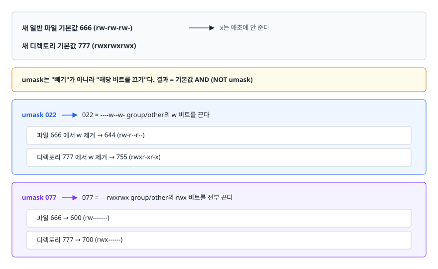
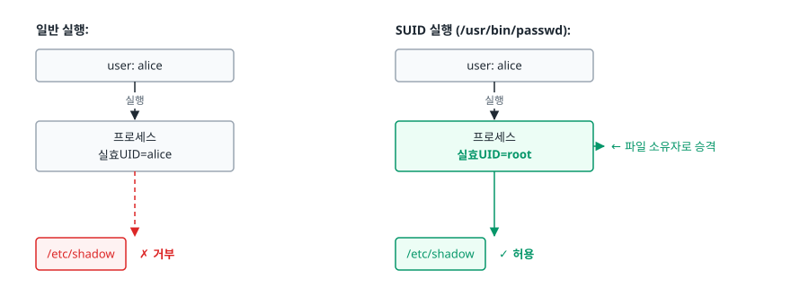
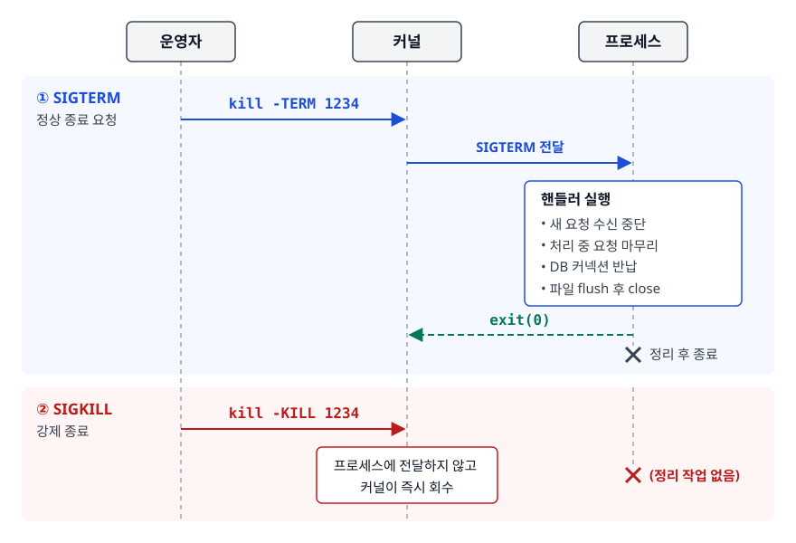
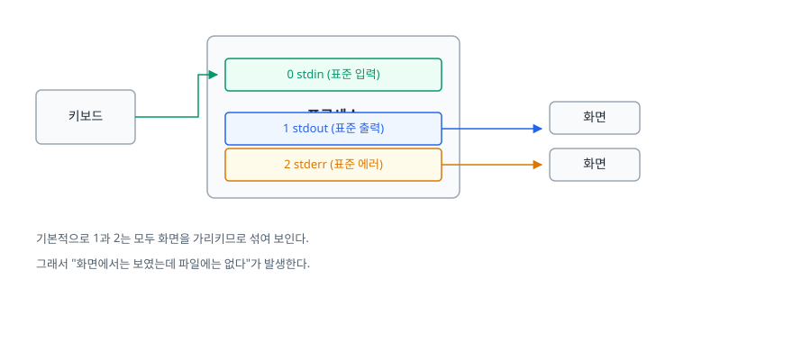

# 리눅스 기본기 (Linux Essentials)

> SSH로 서버에 들어가면 명령어를 많이 아는 쪽이 유리하다고 생각하기 쉽습니다. 실제로 먼저 필요한 건 좌표입니다. 어디에 무엇이 있고, 누가 무엇을 할 수 있으며, 지금 무엇이 돌고 있는지를 스스로 파악하는 방법을 이 문서에서 다룹니다.

## 학습 목표

- [ ] 주요 디렉터리가 어떤 용도인지 알고, 로그·설정·데이터를 어디서 찾을지 판단할 수 있다
- [ ] `rwx`와 8진수 권한을 상호 변환하고, `chmod`/`chown`/`umask`를 목적에 맞게 쓸 수 있다
- [ ] SUID/SGID/Sticky Bit가 왜 존재하는지, 왜 위험한지 설명할 수 있다
- [ ] 프로세스 상태와 시그널을 이해하고 SIGTERM과 SIGKILL을 구분해서 쓸 수 있다
- [ ] 표준 스트림·리다이렉션·파이프를 조합해 명령 출력을 원하는 곳으로 보낼 수 있다

## 선행 지식

- 없음 — 이 문서부터 시작해도 됩니다
- 프로세스·스레드 개념을 더 깊게 보려면 [프로세스와 스레드](../../01-computer-science-fundamentals/operating-system/01-process-thread.md)

---

## 1. 왜 필요한가

클라우드에서 우리가 만지는 것의 대부분은 결국 리눅스 서버입니다. EC2 인스턴스도, 쿠버네티스 노드도, 컨테이너 안쪽도 리눅스입니다. GUI가 없기 때문에 화면을 보고 감으로 찾아갈 수 없고, 오직 "이 파일은 원래 여기 있다", "이 프로세스는 이 사용자로 돈다" 같은 **약속된 규칙**을 알고 있어야 움직일 수 있습니다.

신입이 서버에서 막히는 지점은 거의 정해져 있습니다.

- 로그를 보라는데 로그가 어디 있는지 모릅니다
- 스크립트를 실행했더니 `Permission denied`가 뜹니다
- 애플리케이션을 껐는데 포트가 계속 잡혀 있습니다
- 명령 결과를 파일로 남겼는데 정작 에러 메시지는 안 남았습니다

네 가지 모두 이 문서에서 다루는 **디렉터리 구조 / 권한 / 프로세스 / 스트림**의 문제입니다. 이 넷은 리눅스 트러블슈팅의 좌표계라서, 여기가 흔들리면 그 위의 모든 진단이 추측이 됩니다.

---

## 2. 파일 시스템 계층 (Filesystem Hierarchy Standard)

### 정의

리눅스는 모든 것을 하나의 트리로 표현합니다. 윈도우처럼 `C:`, `D:` 같은 드라이브 문자가 없고, 디스크를 추가하면 트리의 어느 지점(`/data` 같은)에 **마운트(mount)** 해서 붙입니다. 이 트리의 어느 디렉터리에 무엇을 두는지를 정한 규약이 FHS입니다.

```
/
├── bin/     기본 실행 파일 (ls, cp, cat) — 요즘 배포판은 /usr/bin 심볼릭 링크
├── sbin/    관리자용 실행 파일 (ip, iptables)
├── etc/     설정 파일. 텍스트. 백업 1순위
│   ├── ssh/sshd_config
│   ├── fstab           부팅 시 마운트할 파일시스템 목록
│   └── systemd/system/ 서비스 유닛 정의
├── var/     "가변" 데이터. 실행 중 계속 커지는 것들
│   ├── log/            로그 ← 장애 대응의 출발점
│   ├── lib/            서비스별 상태 데이터 (docker, mysql)
│   └── spool/          큐 (cron, mail)
├── home/    일반 사용자 홈. /home/ubuntu, /home/deploy
├── root/    root 계정의 홈 (/ 가 아니다)
├── tmp/     임시 파일. 재부팅 시 삭제되는 경우가 많음
├── opt/     배포판 패키지가 아닌 자체/상용 소프트웨어
├── usr/     읽기 전용 프로그램과 라이브러리 (원래 user 홈이 있던 자리에서 유래)
├── proc/    가짜 파일시스템. 커널·프로세스 정보가 파일처럼 보임
├── sys/     가짜 파일시스템. 커널이 노출한 장치·드라이버 설정
├── dev/     장치 파일 (/dev/null, /dev/sda1)
└── boot/    커널 이미지와 부트로더
```

### 실무에서 자주 가는 곳

| 하고 싶은 일 | 가는 곳 |
|-------------|--------|
| 서비스 로그 확인 | `/var/log/` (`nginx/`, `messages`, `syslog`) |
| 서비스 설정 변경 | `/etc/<서비스명>/` |
| 디스크가 찼을 때 범인 찾기 | `/var/log/`, `/var/lib/docker/`, `/tmp/` |
| 실행 중인 프로세스의 실제 정보 | `/proc/<PID>/` |
| 배포한 애플리케이션 | `/opt/`, `/srv/`, 또는 팀 규칙에 따라 `/app/` |

`/proc`은 특히 유용합니다. 디스크에 실제로 존재하는 파일이 아니라 커널이 만들어주는 뷰입니다.

```bash
cat /proc/<PID>/environ | tr '\0' '\n'   # 그 프로세스가 실제로 받은 환경 변수
cat /proc/<PID>/limits                   # 열 수 있는 파일 개수 등 리소스 한계
ls -l /proc/<PID>/cwd                    # 프로세스의 현재 작업 디렉토리
ls /proc/<PID>/fd | wc -l                # 열려 있는 파일 디스크립터 개수
```

"로컬에서는 되는데 서버에서 안 된다"의 상당수가 `/proc/<PID>/environ` 한 줄로 끝납니다. 내가 export했다고 믿는 환경 변수를 그 프로세스가 실제로 받았는지는 여기서만 확실히 알 수 있습니다.

### 흔한 오해

"`/tmp`는 아무나 써도 되는 공간"까지는 맞지만, **재부팅 시 지워질 수 있다**는 점이 자주 잊힙니다. 지워지면 안 되는 중간 산출물을 `/tmp`에 두는 배치 스크립트는 언젠가 한 번 크게 터집니다.

---

## 3. 권한 모델 (Permission Model)

### 왜 이렇게 생겼나

리눅스는 태생이 다중 사용자 시스템입니다. 한 대의 서버에 여러 사람이 붙어 쓰는 상황에서 "내 파일을 남이 못 보게" 하려면 파일마다 주인과 규칙이 필요했습니다. 그래서 모든 파일은 **소유자(user) / 그룹(group) / 나머지(others)** 세 부류에 대해 각각 읽기·쓰기·실행 권한을 갖습니다.

```
$ ls -l
-rwxr-xr--  1 deploy  webapp  4096 Jan 15 10:30 run.sh
│└┬┘└┬┘└┬┘    │       │
│ │  │  │     │       └── 그룹 (webapp)
│ │  │  │     └────────── 소유자 (deploy)
│ │  │  └──────────────── others: r--  읽기만
│ │  └─────────────────── group:  r-x  읽기 + 실행
│ └────────────────────── user:   rwx  전부
└──────────────────────── 파일 종류
                          - 일반파일  d 디렉토리  l 심볼릭 링크
                          c 문자장치  b 블록장치  s 소켓  p 파이프
```

> **비유**: 권한은 건물 출입증입니다. `r`은 층별 안내판을 볼 권한, `w`는 안내판을 고쳐 쓸 권한, `x`는 그 문을 지나갈 권한입니다.
>
> **비유의 한계**: 출입증은 사람에게 발급되는데, 리눅스 권한은 누구를 볼까요? 답은 **프로세스의 UID**입니다. 내가 로그인했더라도 `sudo`로 띄운 프로세스는 다른 신분으로 판정됩니다.

### 8진수 변환

`r=4`, `w=2`, `x=1`을 더합니다. 세 부류라 세 자리입니다.

| 8진수 | 기호 | 의미 | 쓰는 곳 |
|-------|------|------|--------|
| 755 | rwxr-xr-x | 소유자 전부, 나머지는 읽기·실행 | 실행 스크립트, 디렉터리 |
| 644 | rw-r--r-- | 소유자 읽고 쓰기, 나머지는 읽기 | 일반 설정/HTML 파일 |
| 700 | rwx------ | 소유자만 | `~/.ssh` 디렉터리 |
| 600 | rw------- | 소유자만 읽고 쓰기 | SSH 개인키, 비밀번호 담긴 설정 |
| 777 | rwxrwxrwx | 전부 허용 | **쓰지 말 것** |

`777`은 "권한 문제 같으니 일단 다 열자"의 결과물입니다. 그 순간 누구나 그 파일을 덮어쓸 수 있습니다. 웹 서버가 쓰기 가능한 디렉터리에 777을 주면 업로드된 스크립트가 실행 파일이 되는 경로가 열립니다. 권한 에러가 나면 **막힌 쪽을 정확히 찾아서 최소한만 여는 것**이 정답입니다.

### 디렉터리에서는 의미가 달라진다

디렉터리는 "이름 → inode" 매핑 테이블입니다. 그래서 권한도 그 테이블 기준으로 해석됩니다.

| 권한 | 파일에서 | 디렉터리에서 |
|------|---------|-------------|
| r | 내용 읽기 | 안에 무슨 이름이 있는지 목록 조회(`ls`) |
| w | 내용 수정 | 파일 생성·삭제·이름 변경 (파일 자체 권한과 무관!) |
| x | 실행 | 그 디렉터리를 경로로 통과(`cd`, 하위 파일 접근) |

두 가지가 중요합니다.

1. **`x` 없이 `r`만 있으면** `ls`로 이름은 보이는데 `cat`은 실패합니다. 이름표는 읽었지만 문을 통과할 권한이 없기 때문입니다.
2. **파일 삭제 권한은 파일이 아니라 그 파일이 든 디렉터리의 `w`가 결정합니다.** 읽기 전용(444) 파일도 디렉터리에 쓰기 권한이 있으면 지워집니다. 이걸 막으려고 나온 것이 뒤에 나올 Sticky Bit입니다.

### chmod / chown

```bash
# 8진수 방식 — 전체를 통째로 지정
chmod 640 /etc/myapp/secret.conf
chmod -R 755 /var/www/html          # 재귀. 파일에도 x가 붙는 부작용 주의

# 기호 방식 — 있는 권한을 유지하고 일부만 조정
chmod u+x deploy.sh                 # 소유자에 실행 추가
chmod go-w shared.conf              # 그룹/기타의 쓰기 제거
chmod a+r README.md                 # 모두에게 읽기

# 대문자 X: "이미 어딘가에 x가 있거나 디렉토리인 경우에만" x를 붙인다
chmod -R u+rwX,go+rX /var/www/html  # 디렉토리는 통과 가능, 일반 파일은 실행 금지

# 소유권 변경 (root 권한 필요)
chown deploy:webapp /opt/app/app.jar
chown -R nginx:nginx /var/www/html
chgrp webapp shared.log             # 그룹만 변경
```

`chmod -R 755`가 위험한 이유가 여기 있습니다. 디렉터리에 `x`를 주려고 재귀로 돌리면 그 안의 `.jar`, `.conf`, `.jpg` 전부가 실행 파일이 됩니다. 이럴 때 대문자 `X`를 씁니다.

### umask — 새로 만들어지는 파일의 기본 권한

파일을 만들 때마다 chmod를 칠 수는 없으니, 셸은 기본 권한에서 일정 비트를 **깎아냅니다**. 그 깎을 비트가 umask입니다.

<!-- diagram:cloud-linux-essentials-1 -->


<!-- 위 그림이 대체한 원본 ASCII.
     내용을 고칠 때는 그림도 함께 갱신할 것.
```
새 일반 파일 기본값 666  (rw-rw-rw-)   ← x는 애초에 안 준다
새 디렉토리   기본값 777  (rwxrwxrwx)

umask는 "빼기"가 아니라 "해당 비트를 끄기"다.  결과 = 기본값 AND (NOT umask)

umask 022  →  022 = ----w--w-   group/other의 w 비트를 끈다
  파일    666 에서 w 제거 → 644  (rw-r--r--)
  디렉토리 777 에서 w 제거 → 755  (rwxr-xr-x)

umask 077  →  077 = ---rwxrwx   group/other의 rwx 비트를 전부 끈다
  파일    666 → 600  (rw-------)
  디렉토리 777 → 700  (rwx------)
```
-->

022나 077처럼 기본값과 겹치지 않는 값에서는 뺄셈처럼 보여서 그렇게 외우는 사람이 많은데, 실제 연산은 비트 클리어입니다. `umask 027`을 넣어보면 차이가 드러납니다. 파일은 `666`에서 group의 `w`, other의 `rwx`를 꺼서 `640`이 되지, 뺄셈 결과인 `639`(존재하지도 않는 값)가 되지 않습니다.

```bash
umask          # 현재 값 (예: 0022)
umask -S       # 기호로 (u=rwx,g=rx,o=rx)
umask 077      # 이 셸에서 만드는 파일은 소유자만 접근
```

새 파일의 기본값이 777이 아니라 666인 이유는 **다운로드하거나 복사한 파일이 자동으로 실행 가능해지면 안 되기 때문**입니다. 실행 권한은 사람이 의도적으로 붙이도록 설계돼 있습니다.

---

## 4. 특수 권한 (SUID / SGID / Sticky Bit)

### 왜 필요한가

`passwd` 명령을 생각해 보겠습니다. 비밀번호는 `/etc/shadow`에 저장되는데, 이 파일은 root만 읽고 쓸 수 있습니다(600). 그런데 일반 사용자도 자기 비밀번호는 바꿀 수 있어야 합니다. 일반 사용자에게 `/etc/shadow` 쓰기 권한을 줄 수는 없습니다. 그래서 나온 해법이 **"이 프로그램을 실행하는 동안에만 소유자의 권한으로 동작하게 한다"** 는 SUID입니다.

<!-- diagram:cloud-linux-essentials-2 -->


<!-- 위 그림이 대체한 원본 ASCII.
     내용을 고칠 때는 그림도 함께 갱신할 것.
```
일반 실행:                        SUID 실행 (/usr/bin/passwd):
┌──────────────┐                 ┌──────────────┐
│ user: alice  │                 │ user: alice  │
└──────┬───────┘                 └──────┬───────┘
       │ 실행                            │ 실행
┌──────┴───────┐                 ┌──────┴───────┐
│ 프로세스      │                 │ 프로세스      │
│ 실효UID=alice│                 │ 실효UID=root │ ← 파일 소유자로 승격
└──────┬───────┘                 └──────┬───────┘
       │                                │
   /etc/shadow  ✗ 거부              /etc/shadow  ✓ 허용
```
-->

### 세 가지 비트

| 비트 | 8진수 | 파일에서 | 디렉터리에서 | ls 표시 위치 |
|------|-------|---------|-------------|-------------|
| SUID | 4000 | 실행 시 파일 소유자 권한으로 동작 | 의미 없음 | user의 x 자리 `s` |
| SGID | 2000 | 실행 시 파일 그룹 권한으로 동작 | 새로 만든 파일이 디렉터리 그룹을 상속 | group의 x 자리 `s` |
| Sticky | 1000 | (현대 리눅스에서 의미 없음) | 파일 소유자·디렉터리 소유자·root만 삭제 가능 | others의 x 자리 `t` |

```bash
$ ls -l /usr/bin/passwd
-rwsr-xr-x 1 root root ... /usr/bin/passwd     # s = SUID

$ ls -ld /tmp
drwxrwxrwt 14 root root ... /tmp               # t = Sticky Bit

chmod 4755 /path/to/prog     # SUID + 755
chmod 2775 /shared/team      # SGID 디렉토리 — 팀 공유 폴더의 정석
chmod 1777 /shared/scratch   # Sticky — 아무나 만들되 남의 것은 못 지움

# 기호 방식도 있다 (대상을 반드시 명시할 것)
chmod u+s /path/to/prog
chmod g+s /shared/team
chmod +t  /shared/scratch
```

`x` 권한이 없는데 SUID/SGID가 붙으면 소문자 `s`가 아니라 **대문자 `S`** 로 표시됩니다. 대문자가 보인다면 십중팔구 설정 실수입니다.

### SGID 디렉터리가 해결하는 문제

여러 사람이 `/shared/team`에 파일을 만들면 보통 각자의 기본 그룹이 붙습니다. 그러면 alice가 만든 파일을 bob이 못 고칩니다. SGID를 디렉터리에 걸면 **그 안에서 생성되는 파일은 무조건 디렉터리의 그룹을 물려받습니다**. 협업 디렉터리에서 사실상 필수입니다.

### 왜 위험한가

SUID 바이너리는 "일반 사용자가 root 권한으로 코드를 돌리는 합법적 통로"입니다. 그 바이너리에 버그가 있으면 그대로 권한 상승 취약점이 됩니다. 그래서 보안 점검의 단골 항목입니다.

```bash
find / -perm -4000 -type f 2>/dev/null    # 시스템의 모든 SUID 파일 감사
find / -perm -2000 -type f 2>/dev/null    # SGID
```

직접 만든 스크립트에는 SUID를 붙이면 안 됩니다. 애초에 리눅스는 경쟁 조건 때문에 셸 스크립트의 SUID를 무시하는 경우가 많습니다. 필요한 권한은 `sudo` 규칙으로 좁게 주는 것이 정석입니다. 자세한 것은 [보안 기초](./05-security-basics.md)에서 다룹니다.

---

## 5. 프로세스와 시그널

### 상태부터 읽는다

```bash
ps aux                       # 모든 프로세스, BSD 스타일 (가장 많이 씀)
ps -ef                       # UNIX 스타일. 부모 PID(PPID)가 보인다
ps aux --sort=-%cpu | head   # CPU 많이 쓰는 순
ps aux --sort=-%mem | head   # 메모리 많이 쓰는 순
ps -eo pid,ppid,stat,etime,rss,comm --sort=-rss | head
pstree -p                    # 부모-자식 트리
```

`STAT` 컬럼이 핵심입니다.

| STAT | 의미 | 해석 |
|------|------|------|
| R | 실행 중 또는 실행 대기 | 정상. 많으면 CPU 경합 |
| S | 인터럽트 가능한 대기 | 정상. 대부분의 유휴 프로세스 |
| D | 인터럽트 불가능한 대기 | 디스크·NFS I/O 대기. `kill -9`도 안 먹는다 |
| Z | 좀비 | 종료했는데 부모가 회수 안 함 |
| T | 정지됨 | Ctrl+Z 또는 SIGSTOP |

`D` 상태가 여러 개 쌓여 있다면 프로세스 문제가 아니라 **스토리지 문제**입니다. `kill -9`를 아무리 보내도 안 죽는 이유는 커널이 I/O 완료를 기다리는 중이라 시그널을 전달할 수 없기 때문입니다. 이 구분을 알면 "안 죽는 프로세스" 앞에서 시간을 낭비하지 않습니다.

### 시그널 — 프로세스에 보내는 알림

`kill`은 이름과 달리 "죽이는" 명령이 아니라 **시그널을 보내는** 명령입니다. 기본으로 보내는 시그널이 SIGTERM이라 죽는 것처럼 보일 뿐입니다.

<!-- diagram:cloud-linux-essentials-3 -->


<!-- 위 그림이 대체한 원본 ASCII.
     내용을 고칠 때는 그림도 함께 갱신할 것.
```
운영자                커널               프로세스
  │                    │                    │
  │ kill -TERM 1234    │                    │
  ├───────────────────►│                    │
  │                    │  SIGTERM 전달       │
  │                    ├───────────────────►│
  │                    │                    │ 핸들러 실행:
  │                    │                    │  - 새 요청 수신 중단
  │                    │                    │  - 처리 중 요청 마무리
  │                    │                    │  - DB 커넥션 반납
  │                    │                    │  - 파일 flush 후 close
  │                    │◄───────────────────┤ exit(0)
  │                    │                    ✗
  │
  │ kill -KILL 1234    │
  ├───────────────────►│
  │                    │ 프로세스에 전달하지 않고
  │                    │ 커널이 즉시 회수
  │                    │                    ✗ (정리 작업 없음)
```
-->

자주 쓰는 시그널.

| 번호 | 이름 | 기본 동작 | 언제 |
|------|------|----------|------|
| 1 | SIGHUP | 종료 | 터미널 연결 끊김. 데몬은 "설정 재읽기"로 재해석해 쓴다 |
| 2 | SIGINT | 종료 | Ctrl+C |
| 9 | SIGKILL | 강제 종료 | 잡거나 무시할 수 없음. 최후 수단 |
| 15 | SIGTERM | 종료 | `kill`의 기본값. 정상 종료 요청 |
| 18/19 | SIGCONT/SIGSTOP | 재개/정지 | SIGSTOP도 잡을 수 없음 |

```bash
kill -l                  # 시그널 목록
kill 1234                # = kill -15, SIGTERM
kill -TERM 1234          # 이름으로 쓰는 편이 읽기 좋다
kill -9 1234             # SIGKILL
pkill -f "app-1.0.jar"   # 명령줄 패턴으로 찾아서
killall nginx            # 이름이 정확히 일치하는 전부
pgrep -af java           # 죽이기 전에 뭐가 잡히는지 먼저 확인
```

### SIGTERM 먼저, SIGKILL 나중

**SIGKILL을 습관적으로 쓰면 안 되는 이유**는 프로세스가 정리할 기회를 잃기 때문입니다. 진행 중인 DB 트랜잭션이 롤백되고, 버퍼에만 있던 로그가 사라지고, 락 파일이 남아 다음 기동이 실패합니다. 컨테이너·쿠버네티스가 종료할 때 SIGTERM을 보내고 유예 시간을 준 뒤에야 SIGKILL을 보내는 것도 같은 이유입니다.

```bash
kill -TERM "$PID"
for i in $(seq 1 10); do
  kill -0 "$PID" 2>/dev/null || break   # kill -0: 시그널 없이 생존 확인
  sleep 1
done
kill -0 "$PID" 2>/dev/null && kill -KILL "$PID"
```

`kill -0`은 시그널을 보내지 않고 "보낼 수 있는지"만 검사합니다. 생존 확인 관용구입니다.

### 좀비와 고아

- **좀비(Zombie, Z)**: 자식이 종료했는데 부모가 `wait()`으로 종료 코드를 회수하지 않은 상태. 프로세스 테이블 항목만 남아 있고 메모리는 이미 반환됐습니다. 그래서 **좀비는 kill로 죽일 수 없습니다.** 부모를 고쳐야 하고, 급하면 부모를 재시작합니다. 몇 개는 무해하지만 수천 개면 PID 고갈로 이어집니다.
- **고아(Orphan)**: 부모가 먼저 죽은 프로세스. `init`/`systemd`(PID 1)가 입양해 정상적으로 회수해줍니다. 문제 상황이 아닙니다.

컨테이너에서 좀비가 쌓이는 고전적 원인은 애플리케이션이 PID 1로 뜨면서 자식 회수를 안 하기 때문입니다. `docker run --init`처럼 최소 init을 두는 것이 해법입니다.

### 백그라운드 실행

```bash
./batch.sh &                                 # 백그라운드. 터미널 닫으면 SIGHUP으로 죽을 수 있음
nohup ./batch.sh > /var/log/batch.log 2>&1 & # SIGHUP 무시 + 출력 파일로
jobs; fg %1; bg %1; disown %1
```

다만 운영 환경에서 `nohup`은 임시방편입니다. 재부팅 후 자동 기동, 죽었을 때 재시작, 로그 수집이 전부 빠져 있기 때문입니다. 오래 도는 프로세스는 systemd 서비스로 등록하는 것이 정석입니다.

---

## 6. 표준 스트림과 리다이렉션

### 왜 스트림인가

유닉스의 설계 철학은 "작은 도구를 만들고 조합한다"입니다. 조합하려면 도구끼리 데이터를 주고받는 **공용 배관**이 필요했습니다. 그래서 모든 프로세스는 시작할 때 세 개의 파일 디스크립터를 기본으로 갖습니다.

<!-- diagram:cloud-linux-essentials-4 -->


<!-- 위 그림이 대체한 원본 ASCII.
     내용을 고칠 때는 그림도 함께 갱신할 것.
```
              ┌─────────────────────┐
   키보드 ───►│ 0  stdin  (표준 입력) │
              │                     │
              │        프로세스       │──► 1  stdout (표준 출력) ──► 화면
              │                     │──► 2  stderr (표준 에러) ──► 화면
              └─────────────────────┘

기본적으로 1과 2는 모두 화면을 가리키므로 섞여 보인다.
그래서 "화면에서는 보였는데 파일에는 없다"가 발생한다.
```
-->

정상 결과와 에러는 서로 다른 통로로 나뉘어 있습니다. 파이프로 결과를 넘길 때 에러 메시지가 데이터에 섞여 들어가면 안 되기 때문입니다.

### 리다이렉션

```bash
cmd > out.log          # stdout을 파일로 (덮어쓰기)
cmd >> out.log         # stdout을 파일로 (이어쓰기)
cmd 2> err.log         # stderr만 파일로
cmd > out.log 2>&1     # stdout을 파일로, stderr를 "stdout이 가는 곳"으로
cmd &> out.log         # 위와 같음 (bash 확장 표기)
cmd > /dev/null 2>&1   # 전부 버림
cmd < input.txt        # 파일을 stdin으로
```

**순서가 결과를 바꿉니다.** `2>&1`은 "2번을 1번이 *현재* 가리키는 곳으로 복제"라는 뜻입니다.

```bash
cmd > out.log 2>&1     # 1을 파일로 옮긴 뒤 2를 복제 → 둘 다 파일   (의도대로)
cmd 2>&1 > out.log     # 2를 화면(당시의 1)로 복제한 뒤 1만 파일로  → 에러는 화면
```

배포 스크립트에서 로그가 비어 있는 사고의 절반은 이 순서 때문입니다.

### 파이프

```bash
ps aux | grep java | grep -v grep
journalctl -u nginx --since "1 hour ago" | grep -c 502
cat access.log | awk '{print $1}' | sort | uniq -c | sort -rn | head
```

파이프는 **왼쪽의 stdout만** 오른쪽의 stdin으로 연결합니다. stderr는 그대로 화면으로 샙니다. 에러까지 넘기려면 명시해야 합니다.

```bash
build.sh 2>&1 | tee build.log     # 화면에도 보이고 파일에도 남긴다
make |& less                      # bash 축약형
```

`tee`는 "T자 배관"이라는 이름 그대로 스트림을 두 갈래로 나눕니다. 오래 도는 빌드/배포에서 화면 확인과 로그 보존을 동시에 하려면 필수입니다.

파이프라인의 종료 코드는 기본적으로 **마지막 명령의 것**입니다. 앞 단계가 실패해도 마지막이 성공하면 0이 나옵니다. 이 함정과 `set -o pipefail`은 [셸 스크립팅](./04-shell-scripting.md)에서 다룹니다.

---

## 7. 실무에서는

**배포 스크립트의 로그 처리.** `java -jar app.jar >> /var/log/app/app.log 2>&1` 형태로 두 스트림을 한 파일에 모으는 것이 관행입니다. 다만 컨테이너 환경에서는 반대입니다. 애플리케이션이 stdout/stderr로만 뱉게 하고 파일에는 쓰지 않습니다. Docker와 쿠버네티스가 stdout을 수집해 로그 드라이버로 넘기기 때문에, 컨테이너 안에 로그 파일을 만들면 수집 대상에서 빠지고 디스크만 먹습니다.

**SSH 키 권한.** `~/.ssh`는 700, 개인키는 600이 아니면 OpenSSH가 접속을 거부합니다. 남이 읽을 수 있는 개인키는 이미 유출된 것으로 간주하는 정책입니다. 배포 파이프라인에서 키를 복사한 뒤 `chmod 600`을 빠뜨려 실패하는 일이 잦습니다.

**그레이스풀 셧다운.** 쿠버네티스는 파드를 종료할 때 컨테이너에 SIGTERM을 보내고 `terminationGracePeriodSeconds` 동안 기다린 뒤 SIGKILL을 보냅니다. 애플리케이션이 SIGTERM을 처리하지 않으면 처리 중이던 요청이 그대로 끊깁니다. 스프링 부트의 graceful shutdown 설정이 하는 일이 정확히 이 SIGTERM 핸들링입니다.

**컨테이너의 사용자.** 컨테이너를 root로 돌리면 호스트 볼륨에 root 소유 파일이 생겨 호스트 쪽에서 지우지도 못하는 상황이 생깁니다. `USER` 지시어로 비루트 사용자를 쓰고, 볼륨 디렉터리의 소유권을 맞춰주는 것이 기본입니다.

---

## 8. 면접 포인트

> 면접에서 이 주제가 나오면 이렇게 답한다

**Q. `kill -9`를 쓰면 안 되는 이유가 뭔가요?**

A. SIGKILL은 커널이 프로세스를 즉시 회수하기 때문에 프로세스가 종료 핸들러를 실행할 기회가 없습니다. 진행 중인 트랜잭션 롤백, 버퍼에 있는 로그 flush, 커넥션 반납, 락 파일 정리가 모두 건너뛰어져 데이터 유실이나 다음 기동 실패로 이어질 수 있습니다. 원칙은 SIGTERM을 먼저 보내고 일정 시간 기다린 뒤에도 살아 있으면 SIGKILL을 쓰는 것입니다. 참고로 `D` 상태(uninterruptible sleep) 프로세스는 SIGKILL로도 죽지 않는데, 이건 프로세스가 아니라 I/O 계층 문제라는 신호입니다.

- 꼬리 질문: "쿠버네티스는 어떻게 하나요?" → 파드 종료 시 SIGTERM 후 `terminationGracePeriodSeconds` 대기, 그래도 남으면 SIGKILL. 애플리케이션이 SIGTERM을 처리해야 무중단 배포가 성립한다는 점으로 연결.

**Q. 디렉터리에 읽기 권한만 있고 실행 권한이 없으면 어떻게 되나요?**

A. `ls`로 파일 이름 목록은 볼 수 있지만 그 안의 파일에는 접근할 수 없습니다. 디렉터리의 `x`는 "이 디렉터리를 경로의 일부로 통과할 권한"이기 때문에, `x`가 없으면 `cd`도 `cat dir/file`도 실패합니다. 반대로 `x`만 있고 `r`이 없으면 목록은 못 보지만 정확한 파일 이름을 알고 있으면 접근은 됩니다.

- 꼬리 질문: "읽기 전용 파일을 지울 수 있나요?" → 삭제는 파일이 아니라 그 파일이 든 디렉터리의 쓰기 권한으로 결정되므로 지울 수 있습니다. 이를 막으려고 `/tmp`처럼 공유 디렉터리에 Sticky Bit를 겁니다.

**Q. SUID가 무엇이고 왜 보안 점검 대상인가요?**

A. SUID는 실행 파일에 붙이는 비트로, 실행하는 동안 프로세스의 실효 UID가 파일 소유자로 바뀝니다. `passwd`가 일반 사용자로 실행돼도 root 소유인 `/etc/shadow`를 수정할 수 있는 이유입니다. 문제는 이게 곧 "일반 사용자가 root 권한 코드를 실행하는 합법적 통로"라는 점이라, 해당 바이너리에 취약점이 있으면 바로 권한 상승으로 이어집니다. 그래서 `find / -perm -4000 -type f`로 주기적으로 목록을 확인하고, 필요 없는 것은 제거하거나 sudo 규칙으로 대체합니다.

**Q. `cmd > out.log 2>&1`과 `cmd 2>&1 > out.log`의 차이는?**

A. 앞의 것은 stdout과 stderr가 모두 파일로 갑니다. 뒤의 것은 stderr만 화면에 남고 stdout만 파일로 갑니다. `2>&1`은 "2번을 1번이 현재 가리키는 대상으로 복제"이므로, 1번을 파일로 바꾸기 전에 복제하면 그 시점의 대상인 터미널로 복제되기 때문입니다.

- 꼬리 질문: "파이프에서는요?" → 파이프는 stdout만 넘깁니다. 에러까지 넘기려면 `2>&1 |`을 써야 하고, 화면 확인과 파일 보존을 같이 하려면 `tee`를 붙입니다.

---

## 자주 하는 실수

| 실수 | 왜 틀렸나 | 올바른 이해 |
|------|----------|-----------|
| 권한 에러가 나면 `chmod 777` | 누구나 쓰고 실행할 수 있게 되어 취약점이 된다 | 막힌 주체(소유자/그룹/기타)를 특정해 최소한만 연다 |
| `chmod -R 755`로 웹 루트 일괄 적용 | 모든 데이터 파일이 실행 파일이 된다 | `chmod -R u+rwX,go+rX` — 대문자 X는 디렉터리와 기존 실행 파일에만 적용 |
| `kill -9`를 기본으로 사용 | 정리 작업 없이 죽어 데이터 유실 | SIGTERM → 대기 → 그래도 살아 있으면 SIGKILL |
| 좀비 프로세스를 `kill -9`로 정리 시도 | 이미 죽은 프로세스라 시그널 대상이 아니다 | 부모가 회수해야 사라집니다. 부모 코드 수정 또는 재시작 |
| `cmd 2>&1 > log` 로 전체 로그 저장 | stderr는 화면에 남는다 | `cmd > log 2>&1` 또는 `cmd &> log` |
| 직접 만든 셸 스크립트에 SUID 부여 | 리눅스는 스크립트의 SUID를 무시하는 데다, 통했다면 그게 더 위험하다 | 필요한 명령만 `sudo` 규칙으로 좁게 허용 |
| umask를 뺄셈으로 암기 | 실제 연산은 비트 클리어라 `umask 027`에서 어긋난다 | 기본값에서 umask 비트를 끈다고 이해 |
| `ps aux \| grep java` 결과에 grep 자신이 나옴 | grep 프로세스도 프로세스다 | `pgrep -af java` 또는 `grep -v grep` |

---

## 한 줄 정리

리눅스 서버 운영의 기본기는 **어디에 무엇이 있는지(FHS), 누가 무엇을 할 수 있는지(권한), 지금 무엇이 어떤 상태로 돌고 있는지(프로세스·시그널), 그 출력이 어디로 흐르는지(스트림)** 이 네 좌표를 읽는 능력입니다.

---

## 연관 개념

- [네트워크 진단 명령어](./02-networking-commands.md) - 프로세스가 잡은 포트를 확인하고 연결 문제를 계층별로 좁히는 법
- [장애 트러블슈팅](./03-troubleshooting.md) - 여기서 배운 ps/top을 실제 병목 분석에 쓰는 절차
- [셸 스크립팅](./04-shell-scripting.md) - 리다이렉션·종료 코드를 안전한 자동화로 확장
- [보안 기초](./05-security-basics.md) - 권한 모델을 SSH·sudo·방화벽으로 확장
- [qna-linux-networking.md](./qna-linux-networking.md) - 이 주제 면접 질문 모음
- [프로세스와 스레드](../../01-computer-science-fundamentals/operating-system/01-process-thread.md) - 프로세스 개념의 OS 이론 배경
