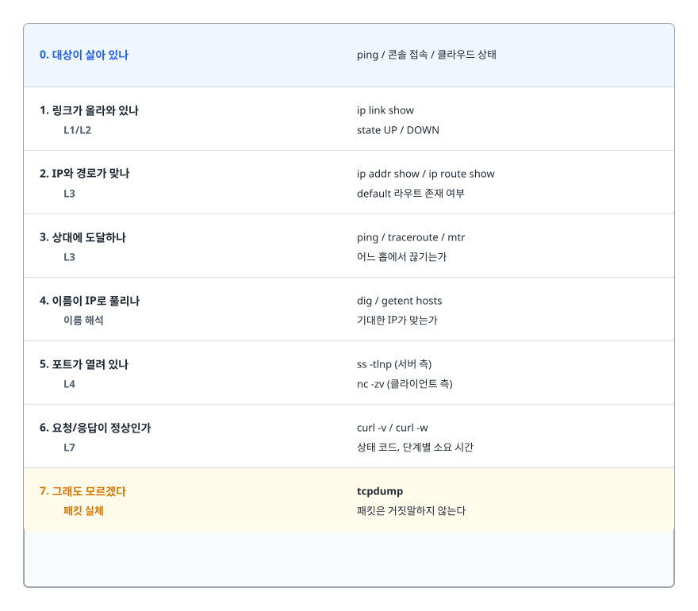
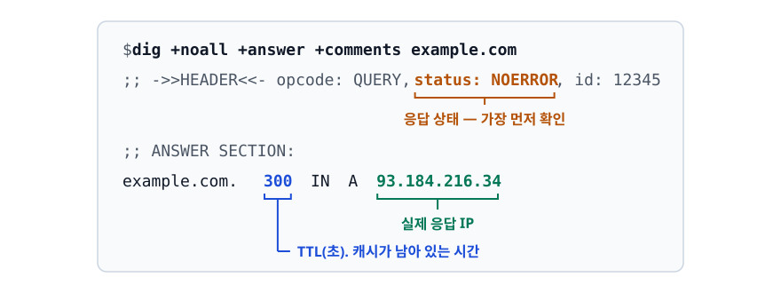
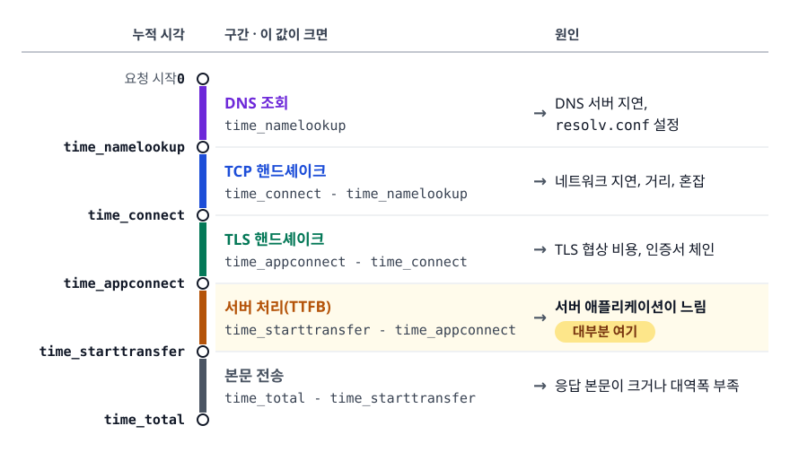
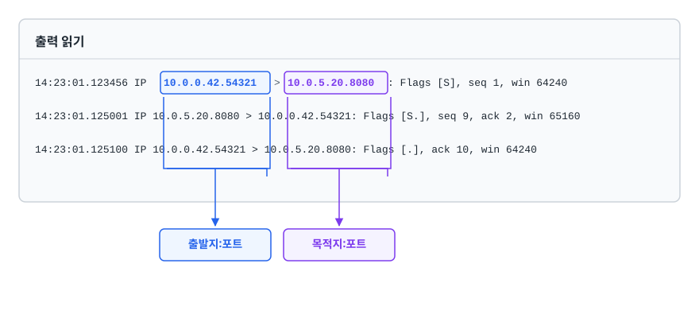

# 네트워크 진단 명령어 (Networking Commands)

> 감으로 찍기를 그만두고 순서를 지키면, 명령을 몇 개 더 치는 대신 헤매는 시간이 줄어듭니다. "연결이 안 된다"는 신고를 아래 계층부터 하나씩 잘라 **어디까지 되고 어디부터 안 되는지**를 명령어로 증명하는 순서를 다룹니다.

## 학습 목표

- [ ] 연결 장애를 계층별로 좁혀가는 고정된 진단 순서를 설명할 수 있다
- [ ] `ip` / `ss` / `ping` / `traceroute` / `dig` / `curl` / `tcpdump`가 각각 어느 계층을 검증하는지 구분할 수 있다
- [ ] 포트를 누가 점유하고 있는지 찾고, TCP 상태값으로 문제 유형을 판별할 수 있다
- [ ] `curl -v`와 `-w`로 HTTP 요청의 단계별 소요 시간을 분해할 수 있다
- [ ] tcpdump 필터를 조합해 필요한 패킷만 잡을 수 있다

## 선행 지식

- [리눅스 기본기](./01-linux-essentials.md) - 프로세스와 PID 개념
- TCP/IP 계층 개념 (없어도 읽을 수 있게 필요한 부분은 본문에서 설명합니다)

---

## 1. 왜 필요한가

운영 중 가장 자주 받는 신고는 "서버에 연결이 안 돼요"입니다. 그런데 이 한 문장 안에는 서로 완전히 다른 원인이 최소 여섯 가지 섞여 있습니다.

- 서버 인스턴스 자체가 죽었습니다
- 인스턴스는 살아 있는데 애플리케이션이 포트를 안 잡고 있습니다
- 애플리케이션은 떠 있는데 `127.0.0.1`에만 바인딩돼서 외부에서 못 붙습니다
- 방화벽/보안 그룹이 막고 있습니다
- DNS가 옛날 IP를 돌려주고 있습니다
- TCP는 붙는데 HTTP 응답이 502입니다

이걸 감으로 찍으면 매번 다른 순서로 헤매게 됩니다. **정해진 순서로 아래 계층부터 하나씩 배제**하면 대부분 3~4개 명령 안에 범위가 절반 이하로 줄어듭니다. 이 문서의 목적은 그 순서를 몸에 붙이는 것입니다.

> **비유**: 전화가 안 걸릴 때 확인 순서와 같습니다. 전화선이 꽂혀 있나(L1/L2) → 우리 집 번호가 있나(L3) → 전화번호부에서 상대 번호를 찾을 수 있나(DNS) → 신호가 가나(L4) → 받았는데 말이 통하나(L7).
>
> **비유의 한계**: 실제 네트워크의 계층은 깔끔하게 독립적이지 않습니다. MTU 불일치처럼 L3 설정 때문에 L7의 큰 응답만 깨지는 문제도 있습니다. 그래서 계층 순서는 "탐색 전략"일 뿐 "인과의 순서"가 아닙니다.

---

## 2. 진단 순서 — 아래에서 위로

<!-- diagram:cloud-networking-commands-1 -->


<!-- 위 그림이 대체한 원본 ASCII.
     내용을 고칠 때는 그림도 함께 갱신할 것.
```
┌──────────────────────────────────────────────────────────────┐
│ 0. 대상이 살아 있나          ping / 콘솔 접속 / 클라우드 상태  │
├──────────────────────────────────────────────────────────────┤
│ 1. 링크가 올라와 있나         ip link show                    │
│    L1/L2                     state UP / DOWN                 │
├──────────────────────────────────────────────────────────────┤
│ 2. IP와 경로가 맞나           ip addr show / ip route show    │
│    L3                        default 라우트 존재 여부          │
├──────────────────────────────────────────────────────────────┤
│ 3. 상대에 도달하나            ping / traceroute / mtr          │
│    L3                        어느 홉에서 끊기는가              │
├──────────────────────────────────────────────────────────────┤
│ 4. 이름이 IP로 풀리나         dig / getent hosts               │
│    이름 해석                  기대한 IP가 맞는가                │
├──────────────────────────────────────────────────────────────┤
│ 5. 포트가 열려 있나           ss -tlnp (서버 측)               │
│    L4                        nc -zv (클라이언트 측)            │
├──────────────────────────────────────────────────────────────┤
│ 6. 요청/응답이 정상인가        curl -v / curl -w               │
│    L7                        상태 코드, 단계별 소요 시간        │
├──────────────────────────────────────────────────────────────┤
│ 7. 그래도 모르겠다            tcpdump                          │
│    패킷 실체                  패킷은 거짓말하지 않는다           │
└──────────────────────────────────────────────────────────────┘
```
-->

핵심 원칙 하나. **서버 쪽과 클라이언트 쪽 양쪽에서 봐야 합니다.** 클라이언트에서 SYN을 보냈는데 서버 tcpdump에 SYN이 안 보이면 중간(보안 그룹, 방화벽, 라우팅)이 범인입니다. SYN은 도착했는데 SYN-ACK가 안 나가면 서버 자체의 문제입니다. 이 한 가지 구분만으로 책임 범위가 갈립니다.

---

## 3. 도구별 담당 계층

| 도구 | 보는 계층 | 답해주는 질문 | 실패했을 때의 의미 |
|------|----------|-------------|-----------------|
| `ip link` | L1/L2 | 네트워크 인터페이스가 살아 있나 | 인터페이스 다운, 케이블/드라이버 문제 |
| `ip addr` / `ip route` | L3 | 내 IP와 나가는 길이 설정돼 있나 | IP 미할당, 기본 게이트웨이 누락 |
| `ping` | L3 (ICMP) | 상대 호스트까지 패킷이 왕복하나 | 도달 불가 **또는 ICMP 차단** |
| `traceroute` / `mtr` | L3 | 어느 구간에서 끊기나 | 특정 홉 이후 차단/유실 |
| `dig` / `getent hosts` | 이름 해석 | 도메인이 어떤 IP로 풀리나 | DNS 미등록, 캐시된 옛 IP, resolver 장애 |
| `ss` / `netstat` | L4 | 이 서버가 포트를 잡고 있나, 연결 상태는 | 앱 미기동, 잘못된 바인드 주소 |
| `nc -zv` | L4 | 저 포트로 TCP 연결이 맺어지나 | 방화벽/보안 그룹 차단, LISTEN 없음 |
| `curl -v` | L7 | HTTP 요청/응답이 정상인가 | 인증서, 라우팅 규칙, 백엔드 오류 |
| `tcpdump` | 패킷 원본 | 실제로 무엇이 오갔나 | (실패하지 않음. 최종 근거) |

**그래서 언제 뭘 쓰나**: 위에서부터 순서대로 쓰되, "어디까지 정상인지"가 확인되면 그 아래는 다시 안 봅니다. 반대로 위 계층에서 이상하면 아래 계층으로 되돌아가지 말고 그 계층 안에서 원인을 좁힙니다.

---

## 4. L2~L3 — 인터페이스와 경로

`ifconfig`, `route`, `netstat`은 오래된 net-tools 계열이고, 현재 표준은 iproute2의 `ip`와 `ss`입니다. 최소 설치 이미지나 컨테이너에는 아예 `ifconfig`가 없는 경우가 많으므로 `ip` 계열을 손에 익히는 편이 낫습니다.

```bash
ip link show               # 인터페이스 목록과 UP/DOWN
ip -br addr                # 간략 형식. IP 할당 상태 한눈에
ip route show              # 라우팅 테이블
ip route get 10.0.5.20     # "이 목적지로는 어느 인터페이스/게이트웨이로 나가나"
ip neigh show              # ARP 테이블 (같은 서브넷 상대의 MAC)
ip -s link show eth0       # 인터페이스 통계 (errors, dropped)
```

```
$ ip route show
default via 10.0.0.1 dev eth0 proto dhcp   ← 이 줄이 없으면 외부로 못 나간다
10.0.0.0/24 dev eth0 proto kernel scope link src 10.0.0.42
```

`default` 라우트가 없으면 같은 서브넷 안은 통신되는데 인터넷만 안 됩니다. 프라이빗 서브넷에 NAT 게이트웨이를 안 붙였을 때도 증상은 같지만, 그때 빠진 것은 VPC 라우팅 테이블의 `0.0.0.0/0` 경로라서 인스턴스의 `ip route`에는 default가 정상으로 보입니다.

`ip -s link`의 `errors`, `dropped` 카운터가 계속 증가한다면 애플리케이션이 아니라 물리/가상 NIC 레벨 문제를 의심합니다.

---

## 5. ping과 traceroute — 도달성

```bash
ping -c 4 10.0.5.20             # 4번만 (무한 실행 방지)
ping -c 4 -W 1 10.0.5.20        # 응답 대기 1초
ping -M do -s 1472 10.0.5.20    # 조각화 금지 + 1472바이트 → MTU 1500 검증
```

`ping`은 ICMP Echo를 씁니다. 여기서 가장 중요한 사실은 **ping 실패가 곧 연결 불가가 아니라는 것**입니다. 많은 방화벽과 클라우드 보안 그룹이 ICMP를 기본 차단합니다. 실제로 AWS 보안 그룹에서 ICMP를 열지 않으면 TCP 80은 멀쩡히 붙는데 ping만 안 됩니다. 그러니 ping은 "되면 좋고, 안 돼도 TCP로 다시 확인"하는 도구입니다.

반대로 MTU 검증에는 강력합니다. `-M do`(조각화 금지)로 크기를 키워가며 보내다가 특정 크기부터 실패하면 경로상의 MTU가 그보다 작다는 뜻입니다. VPN이나 오버레이 네트워크에서 "작은 요청은 되는데 큰 응답만 멈춘다"는 증상의 원인이 대개 이것입니다.

```bash
traceroute 10.0.5.20        # 기본은 UDP. 방화벽에 자주 막힌다
traceroute -I 10.0.5.20     # ICMP 방식
traceroute -T -p 443 example.com   # TCP SYN 방식. 실제 서비스 포트로 추적 (root 필요)
mtr -r -c 20 example.com    # traceroute + ping 반복. 홉별 손실률까지
```

traceroute는 TTL을 1부터 올려가며 패킷을 보내고, TTL이 0이 된 지점의 라우터가 돌려주는 ICMP Time Exceeded로 경로를 그립니다. 중간에 `* * *`가 나오면 그 라우터가 ICMP 응답을 안 하도록 설정된 경우가 많습니다. **`*`가 곧 장애는 아닙니다.** 그 이후 홉이 정상적으로 나오면 그냥 조용한 라우터일 뿐입니다. 반대로 특정 홉 이후 끝까지 `*`라면 그 지점부터 막힌 것입니다.

경로 문제를 판단할 때는 `mtr`이 더 낫습니다. 한 번의 스냅샷이 아니라 반복 측정으로 홉별 손실률과 지연을 같이 보여주기 때문에, 순간적인 튐과 지속적인 손실을 구분할 수 있습니다.

---

## 6. DNS — dig와 getent의 결정적 차이

```bash
dig example.com                    # 전체 응답
dig +short example.com             # IP만
dig @1.1.1.1 example.com           # 특정 DNS 서버에 직접 질의
dig example.com NS                 # 네임서버 조회
dig -x 93.184.216.34               # 역방향 조회
dig +trace example.com             # 루트부터 위임 경로 추적
```

<!-- diagram:cloud-networking-commands-4 -->


<!-- 위 그림이 대체한 원본 ASCII.
     내용을 고칠 때는 그림도 함께 갱신할 것.
```
$ dig +noall +answer +comments example.com
;; ->>HEADER<<- opcode: QUERY, status: NOERROR, id: 12345
;; ANSWER SECTION:
example.com.   300  IN  A  93.184.216.34
               └┬┘         └─────┬─────┘
                │                └── 실제 응답 IP
                └── TTL(초). 캐시가 남아 있는 시간
```
-->

`status`를 먼저 봅니다.

- `NOERROR` + ANSWER 있음: 정상
- `NXDOMAIN`: 그런 도메인이 없습니다. 오타 또는 미등록
- `SERVFAIL`: 네임서버가 응답을 못 만들었습니다. DNS 쪽 장애
- `NOERROR`인데 ANSWER 비어 있음: 도메인은 있는데 그 레코드 타입이 없습니다

**여기서 초심자가 가장 많이 속는 지점이 있습니다. `dig`는 `/etc/hosts`를 보지 않습니다.** dig는 DNS 프로토콜로 직접 질의하는 도구이고, 애플리케이션은 `/etc/nsswitch.conf` 순서에 따라 `/etc/hosts`를 먼저 본 다음 DNS로 갑니다. 그래서 "dig는 잘 되는데 애플리케이션만 엉뚱한 IP로 붙는" 상황이 생깁니다. 애플리케이션과 같은 경로로 확인하려면 이걸 씁니다.

```bash
getent hosts example.com     # 애플리케이션과 동일한 해석 경로 (hosts + DNS)
cat /etc/resolv.conf         # 이 서버가 쓰는 DNS 서버
resolvectl status            # systemd-resolved 사용 시 실제 적용 상태
```

DNS 레코드를 바꿨는데 반영이 안 된다면 십중팔구 **TTL 동안 캐시가 살아 있는 것**입니다. `dig`의 ANSWER에 찍힌 TTL 값이 남은 캐시 시간입니다. 그래서 IP 변경 작업 전에는 TTL을 미리 낮춰두는 것이 정석입니다.

---

## 7. ss — 소켓 상태와 포트 점유

`ss`는 커널의 소켓 정보를 직접 읽어서 `netstat`보다 훨씬 빠릅니다. 연결이 수만 개인 서버에서 차이가 크게 납니다.

```bash
ss -tlnp                 # TCP + LISTEN + 숫자 + 프로세스  ← 가장 많이 씀
ss -tunlp                # TCP/UDP 둘 다
ss -ant                  # 모든 TCP 연결과 상태
ss -tnp state established # 확립된 연결만
ss -s                    # 전체 소켓 요약
ss -ti                   # RTT, 재전송 등 TCP 상세 정보
```

플래그: `t`=TCP, `u`=UDP, `l`=LISTEN만, `a`=전체, `n`=이름 해석 생략(빠름), `p`=프로세스.

### 포트를 누가 잡고 있나

`Address already in use`로 애플리케이션이 안 뜰 때의 표준 절차입니다.

```bash
ss -tlnp | grep :8080
# LISTEN 0  4096  *:8080  *:*  users:(("java",pid=2431,fd=42))

lsof -i :8080            # 같은 정보를 다른 도구로
fuser -v 8080/tcp        # 어떤 프로세스가 쓰는지
```

바인드 주소도 같이 확인해야 합니다.

```
127.0.0.1:8080  → 이 서버 안에서만 접속 가능. 외부에서는 절대 안 붙는다
0.0.0.0:8080    → IPv4 전체 인터페이스. 외부 접속 가능
[::]:8080       → IPv6 전체 인터페이스 (ss 버전에 따라 *:8080으로 표기되기도 한다)
```

`[::]`로 떠 있는데 IPv4로 붙는 경우가 있습니다. 커널의 `net.ipv6.bindv6only`가 꺼져 있으면 IPv6 소켓 하나가 IPv4 매핑 주소까지 함께 받기 때문입니다. 그래서 `0.0.0.0` 줄이 없다고 곧바로 "IPv4는 안 열렸다"고 단정하면 안 됩니다.

"로컬에서 curl은 되는데 밖에서 안 된다"의 1순위 원인이 `127.0.0.1` 바인딩입니다. 스프링 부트라면 `server.address`, 도커라면 `-p 8080:8080` 대신 `-p 127.0.0.1:8080:8080`을 쓴 경우입니다.

### TCP 상태로 문제 유형 판별

| 상태 | 의미 | 많으면 |
|------|------|-------|
| LISTEN | 연결 대기 중 | 정상 |
| ESTABLISHED | 통신 중 | 정상. 급증하면 트래픽 폭증 또는 커넥션 누수 |
| SYN-SENT | 연결 요청을 보냈으나 응답 없음 | 상대가 죽었거나 방화벽 차단 |
| SYN-RECV | SYN 받고 ACK 대기 | SYN Flood 의심 |
| TIME-WAIT | 먼저 close한 쪽에 남는 잔여 (약 60초) | 짧은 연결을 대량 생성 중 |
| CLOSE-WAIT | 상대가 끊었는데 우리가 `close()`를 안 함 | **애플리케이션 버그** |

```bash
ss -ant | awk 'NR>1{print $1}' | sort | uniq -c | sort -rn   # 상태별 개수 집계
```

**CLOSE-WAIT 누적은 거의 항상 코드 문제입니다.** 상대가 FIN을 보냈으면 우리 애플리케이션이 소켓을 닫아야 하는데 그러지 않았다는 뜻이라, 커넥션 풀에 반납이 안 되거나 예외 경로에서 `close()`를 빠뜨린 것입니다. 서버를 재시작하면 잠깐 사라졌다가 반드시 다시 쌓입니다.

**TIME-WAIT는 대부분 정상입니다.** 먼저 연결을 끊는 쪽에 남는 정상적인 상태이고, 늦게 도착한 패킷이 다음 연결에 섞이지 않도록 보호하는 장치입니다. 수만 개라면 커넥션을 재사용하지 않고 매 요청마다 새로 맺고 있다는 뜻이므로, 커널 파라미터를 만지기 전에 **HTTP Keep-Alive와 커넥션 풀 도입**을 먼저 검토합니다. 인터넷에 흔히 돌아다니는 `tcp_tw_recycle` 튜닝은 따라 하지 않는 편이 낫습니다. NAT 뒤의 클라이언트들이 무작위로 연결에 실패하는 부작용이 있어서 리눅스 4.12에서 아예 제거된 옵션입니다.

### Recv-Q / Send-Q 읽는 법

이 두 컬럼은 소켓 상태에 따라 뜻이 다릅니다.

- **LISTEN 소켓**: Recv-Q = accept 대기 중인 연결 수, Send-Q = backlog 최대치. Recv-Q가 Send-Q에 근접하면 애플리케이션이 `accept()`를 못 따라가고 있다는 뜻이고, 그 이후 연결은 버려집니다.
- **ESTABLISHED 소켓**: Recv-Q = 애플리케이션이 아직 안 읽은 바이트, Send-Q = 상대가 아직 ACK 안 한 바이트. Recv-Q가 계속 크면 애플리케이션 스레드가 블로킹돼 있다는 신호입니다.

---

## 8. 포트 연결 테스트 (클라이언트 측)

```bash
nc -zv 10.0.5.20 8080                       # -z: 데이터 안 보내고 연결만, -v: 결과 출력
nc -zv -w 3 10.0.5.20 8080                  # 3초 타임아웃
timeout 3 bash -c '</dev/tcp/10.0.5.20/8080' && echo OPEN || echo CLOSED
```

마지막 줄은 `nc`가 없는 최소 이미지에서 유용합니다. bash 내장 기능으로 TCP 연결을 시도합니다.

결과 해석이 중요합니다.

| 결과 | 의미 | 다음 조치 |
|------|------|----------|
| 즉시 성공 | L4까지 정상 | L7(curl)로 올라간다 |
| 즉시 `Connection refused` | 패킷은 도달했고 그 포트에 LISTEN이 없다 (RST 응답) | 서버에서 `ss -tlnp` 확인 |
| 응답 없이 타임아웃 | 패킷이 중간에서 버려졌다 (DROP) | 보안 그룹/방화벽/라우팅 확인 |

**refused와 timeout의 구분이 진단의 분기점입니다.** refused는 "집에 도착했는데 문이 없다", timeout은 "집까지 가지도 못했다"에 해당합니다. 전자는 서버 안쪽, 후자는 네트워크 경로를 봅니다.

---

## 9. curl — HTTP 계층 디버깅

### -v 로 협상 과정 보기

```bash
curl -v https://api.example.com/health
```

```
*   Trying 93.184.216.34:443...              ← 어떤 IP로 붙었나 (DNS 결과 확인 가능)
* Connected to api.example.com (93.184...)   ← TCP 연결 성공
* TLS handshake, Certificate ...             ← TLS 단계
> GET /health HTTP/1.1                       ← 우리가 보낸 요청 (> 는 송신)
> Host: api.example.com
< HTTP/1.1 502 Bad Gateway                   ← 받은 응답 (< 는 수신)
< server: nginx
```

`*`는 curl의 진단 메시지, `>`는 보낸 것, `<`는 받은 것입니다. 어느 줄까지 나왔는지만 봐도 어디서 끊겼는지 알 수 있습니다. `Trying`에서 멈추면 네트워크, `Connected` 후 멈추면 TLS나 서버 응답 문제, `< HTTP/1.1 5xx`가 나오면 이미 L7 영역입니다.

자주 쓰는 옵션.

```bash
curl -I https://example.com                       # HEAD 요청. 헤더만
curl -L https://example.com                       # 리다이렉트 따라가기
curl -k https://self-signed.internal              # 인증서 검증 생략 (원인 확인용, 운영 코드에는 쓰지 말 것)
curl --connect-timeout 3 --max-time 10 URL        # 무한 대기 방지
curl -H "Authorization: Bearer $TOKEN" URL
curl -X POST -H "Content-Type: application/json" -d '{"id":1}' URL
curl --resolve api.example.com:443:10.0.5.20 https://api.example.com/health
```

마지막 `--resolve`가 특히 유용합니다. **DNS는 그대로 두고 특정 서버로만 붙여서** 테스트할 수 있습니다. 로드밸런서 뒤의 특정 인스턴스만 이상할 때, Host 헤더와 TLS SNI는 원래 도메인 그대로 유지하면서 대상 IP만 바꿔 검증하는 방법입니다.

### -w 로 시간 분해하기

"느리다"는 신고를 받았을 때 어느 구간이 느린지 숫자로 쪼갭니다.

```bash
curl -o /dev/null -s -w \
'dns:      %{time_namelookup}s
connect:  %{time_connect}s
tls:      %{time_appconnect}s
ttfb:     %{time_starttransfer}s
total:    %{time_total}s
code:     %{http_code}
ip:       %{remote_ip}\n' https://api.example.com/health
```

각 값은 **요청 시작부터의 누적 시간**입니다. 그래서 구간별 소요는 뺄셈으로 구합니다.

<!-- diagram:cloud-networking-commands-2 -->


<!-- 위 그림이 대체한 원본 ASCII.
     내용을 고칠 때는 그림도 함께 갱신할 것.
```
0 ────► time_namelookup ────► time_connect ────► time_appconnect ────► time_starttransfer ────► time_total
   DNS 조회        TCP 핸드셰이크       TLS 핸드셰이크        서버 처리(TTFB)          본문 전송

해석:
  time_namelookup 이 크다                    → DNS 서버 지연, resolv.conf 설정
  time_connect - time_namelookup 이 크다      → 네트워크 지연, 거리, 혼잡
  time_appconnect - time_connect 가 크다      → TLS 협상 비용, 인증서 체인
  time_starttransfer - time_appconnect 가 크다 → 서버 애플리케이션이 느림 ← 대부분 여기
  time_total - time_starttransfer 가 크다     → 응답 본문이 크거나 대역폭 부족
```
-->

이 한 줄이면 "우리 서버가 느린 건지 네트워크가 느린 건지"를 논쟁 없이 가릅니다. 배포 전후 비교, 리전 간 비교에도 그대로 쓸 수 있습니다.

---

## 10. tcpdump — 마지막 근거

모든 도구가 애매한 답을 줄 때 패킷을 직접 봅니다. 패킷은 해석의 여지가 없습니다.

```bash
tcpdump -i eth0 -nn port 8080                    # 인터페이스 지정, 이름 해석 안 함
tcpdump -i any -nn host 10.0.5.20 and port 8080  # 모든 인터페이스, 호스트+포트 조합
tcpdump -i eth0 -nn -c 100 'tcp[tcpflags] & tcp-syn != 0'   # SYN 플래그가 선 패킷(SYN-ACK 포함) 100개
tcpdump -i eth0 -nn -w /tmp/cap.pcap port 443    # 파일로 저장 후 Wireshark에서 분석
tcpdump -i eth0 -nn -ttt host 10.0.5.20          # 패킷 간 시간 간격 표시
tcpdump -i eth0 -A -nn port 80                   # 페이로드를 ASCII로 (평문 노출 주의)
```

필터 문법은 조합식입니다.

```
방향:  src / dst / (생략 시 양방향)
대상:  host <IP> / net <CIDR> / port <번호> / portrange 8000-8100
프로토콜: tcp / udp / icmp / arp
결합:  and / or / not

예) tcpdump -nn 'tcp and dst port 443 and not host 10.0.0.1'
```

### 출력 읽기

<!-- diagram:cloud-networking-commands-3 -->


<!-- 위 그림이 대체한 원본 ASCII.
     내용을 고칠 때는 그림도 함께 갱신할 것.
```
14:23:01.123456 IP 10.0.0.42.54321 > 10.0.5.20.8080: Flags [S], seq 1, win 64240
14:23:01.125001 IP 10.0.5.20.8080 > 10.0.0.42.54321: Flags [S.], seq 9, ack 2, win 65160
14:23:01.125100 IP 10.0.0.42.54321 > 10.0.5.20.8080: Flags [.], ack 10, win 64240
                └────┬────┘             └────┬────┘
                  출발지:포트              목적지:포트
```
-->

플래그 표기: `[S]` SYN, `[S.]` SYN+ACK, `[.]` ACK, `[P.]` PSH+ACK(데이터), `[F.]` FIN+ACK, `[R]` RST.

### 장애 시나리오 → 판정

| tcpdump에서 보이는 것 | 원인 |
|---------------------|------|
| 서버에 아무 패킷도 안 옴 | 보안 그룹/방화벽/라우팅. 서버는 무죄 |
| SYN은 오는데 SYN-ACK 안 나감 | 서버 방화벽이 응답 차단 |
| SYN에 RST로 즉답 | 포트가 닫혀 있음 (`Connection refused`의 실체) |
| SYN-ACK는 나갔는데 ACK 안 옴 | 비대칭 라우팅, 중간 장비, 클라이언트 측 문제 |
| 같은 seq의 패킷 반복 | 재전송. 경로상 패킷 유실 |
| 데이터 주고받다 갑자기 RST | 한쪽이 강제 종료. 타임아웃 설정 불일치 흔함 |

### 운영에서 지킬 것

1. **반드시 필터를 걸고 `-c`로 개수를 제한합니다.** 무필터 캡처는 그 자체로 부하이고 디스크를 채웁니다.
2. **`-A`는 신중히.** 평문 트래픽이면 토큰과 비밀번호가 화면과 로그에 그대로 남습니다.
3. **`-w`로 저장하고 분석은 Wireshark에서.** 터미널에서 읽는 것보다 훨씬 빠릅니다.
4. root 또는 `CAP_NET_RAW` 권한이 필요합니다.
5. 캡처 파일 자체가 민감 정보입니다. 분석 후 삭제합니다.

---

## 11. 실무에서는

**컨테이너 안에는 도구가 없습니다.** 슬림 이미지에는 `ip`, `ss`, `curl`이 아예 없습니다. 그래서 진단 도구를 모아둔 이미지를 사이드카나 임시 디버그 컨테이너로 붙여서 같은 네트워크 네임스페이스에서 명령을 실행하는 방식을 씁니다. 쿠버네티스의 `kubectl debug`가 이 목적으로 나온 기능입니다. 핵심은 **파드의 네트워크 네임스페이스를 공유해야 의미가 있다**는 데 있습니다. 다른 네임스페이스에서 `ss`를 쳐봐야 그 파드의 소켓은 안 보입니다.

**클라우드에서는 방화벽이 두 겹입니다.** 보안 그룹(인스턴스 단위)과 네트워크 ACL(서브넷 단위)이 그 두 겹이고, 여기에 OS 내부의 iptables/ufw까지 더해집니다. 어느 한 곳만 막혀도 `nc`는 타임아웃이 납니다. 그래서 서버 안에서 `curl localhost:8080`은 되는데 밖에서 안 되면, 바인드 주소 → OS 방화벽 → 보안 그룹 → 네트워크 ACL 순으로 확인합니다. 자세한 방화벽 구조는 [보안 기초](./05-security-basics.md)에서 다룹니다.

**로드밸런서 헬스체크 실패.** ALB가 타겟을 unhealthy로 표시할 때는 헬스체크 경로를 그대로 흉내 내봅니다. `curl -v http://<인스턴스IP>:8080/health`처럼 LB가 보내는 것과 동일한 요청을 인스턴스에 직접 쏴서, 애플리케이션이 200을 주는지 확인하는 것이 첫 단계입니다.

**DNS 캐시.** JVM은 과거에 DNS 결과를 무기한 캐시하는 설정이 기본인 시절이 있었습니다. 그래서 RDS 페일오버로 엔드포인트가 새 IP를 가리켜도 애플리케이션이 옛 IP로 계속 붙는 사고가 유명합니다. 애플리케이션 레벨 DNS 캐시 정책은 클라우드에서 반드시 확인해야 할 항목입니다.

---

## 12. 면접 포인트

> 면접에서 이 주제가 나오면 이렇게 답한다

**Q. "서버에 연결이 안 된다"는 신고를 받으면 어떤 순서로 확인하나요?**

A. 아래 계층부터 위로 올라가면서 배제합니다. 먼저 서버 쪽에서 `ss -tlnp`로 애플리케이션이 포트를 잡고 있는지와 바인드 주소가 `127.0.0.1`이 아닌지 확인합니다. 그다음 클라이언트에서 `nc -zv`로 TCP 연결을 시도해 `Connection refused`인지 타임아웃인지 구분합니다. refused면 패킷은 도달했으므로 서버 내부, 타임아웃이면 방화벽이나 보안 그룹을 봅니다. 여기까지 정상이면 `curl -v`로 올라가 HTTP 상태 코드와 응답을 확인하고, 그래도 애매하면 서버에서 `tcpdump`로 SYN이 실제로 도착하는지 봅니다.

- 꼬리 질문: "`ping`이 안 되는데 웹은 되는 경우가 있나요?" → 있습니다. ICMP는 대부분의 방화벽과 보안 그룹에서 기본 차단되므로 ping 실패만으로 도달 불가를 단정할 수 없습니다.

**Q. CLOSE_WAIT가 계속 쌓이는 서버, 어떻게 진단하나요?**

A. CLOSE_WAIT는 상대가 FIN을 보냈는데 우리 애플리케이션이 `close()`를 호출하지 않은 상태라, 커널이 아니라 애플리케이션 코드 문제라고 봅니다. `ss -tnp state close-wait`로 어느 프로세스가 얼마나 잡고 있는지 확인하고, 그 프로세스가 어떤 원격지와 연결돼 있었는지 봅니다. 보통 HTTP 클라이언트나 DB 커넥션 풀에서 예외 경로에 반납 로직이 빠져 있는 경우입니다. 재시작하면 일시적으로 사라지지만 반드시 다시 쌓이므로, 근본 해결은 try-with-resources나 풀 반납 보장입니다.

- 꼬리 질문: "TIME_WAIT가 많은 것도 문제인가요?" → 대부분 정상입니다. 먼저 close한 쪽에 남는 보호 장치이며, 많다면 커넥션을 재사용하지 않는다는 뜻이므로 Keep-Alive와 커넥션 풀을 먼저 봅니다. `tcp_tw_recycle` 같은 커널 옵션은 NAT 환경에서 문제를 일으키므로 쓰지 않습니다.

**Q. API 응답이 느린데, 네트워크 문제인지 서버 문제인지 어떻게 구분하나요?**

A. `curl -w`로 단계별 누적 시간을 찍어봅니다. `time_namelookup`이 크면 DNS, `time_connect`까지의 증가분이 크면 네트워크 왕복 지연, `time_appconnect`가 크면 TLS 협상, `time_starttransfer`에서 크게 벌어지면 서버가 첫 바이트를 보내기까지 걸린 시간이므로 애플리케이션 처리 지연입니다. 마지막으로 `time_total`과의 차이가 크면 응답 본문 전송 문제입니다. 실무에서는 대부분 TTFB 구간이 원인으로 나옵니다.

- 꼬리 질문: "로드밸런서 뒤에 인스턴스가 여러 대인데 일부만 느립니다" → `curl --resolve`로 도메인과 TLS SNI는 그대로 둔 채 대상 IP만 바꿔가며 인스턴스별로 같은 요청을 보내 비교합니다. 특정 인스턴스에서만 TTFB가 튄다면 LB가 아니라 그 인스턴스를 봅니다.

**Q. tcpdump로 무엇을 확인하나요?**

A. 다른 도구의 답이 서로 엇갈릴 때 사실 확인용으로 씁니다. 대표적으로 서버 쪽에서 `tcpdump -nn -i eth0 host <클라이언트IP> and port <포트>`를 걸어놓고 클라이언트에서 접속을 시도합니다. 패킷이 아예 안 보이면 중간 경로(보안 그룹, 방화벽)의 문제로 서버는 무죄이고, SYN은 오는데 SYN-ACK가 안 나가면 LISTEN이 없거나 서버 방화벽이 응답을 막는 것입니다. 프로덕션에서는 반드시 필터와 `-c`로 범위를 좁히고, 페이로드 출력은 민감 정보 노출 위험이 있어 피합니다.

- 꼬리 질문: "컨테이너 안에는 tcpdump가 없는데요?" → 파드나 컨테이너의 네트워크 네임스페이스를 공유하는 임시 디버그 컨테이너를 붙여서 캡처합니다. 네임스페이스를 공유하지 않으면 다른 곳의 트래픽을 보는 셈이라 의미가 없습니다.

---

## 자주 하는 실수

| 실수 | 왜 틀렸나 | 올바른 이해 |
|------|----------|-----------|
| ping이 안 되니 서버가 죽었다고 판단 | ICMP는 기본 차단되는 경우가 많다 | TCP 포트로 `nc -zv` 재확인 |
| `dig`로 확인했으니 앱도 같은 IP를 쓸 것이다 | dig는 `/etc/hosts`를 보지 않는다 | `getent hosts`로 앱과 동일한 경로 확인 |
| `Connection refused`와 타임아웃을 같게 취급 | refused는 도달함(RST), 타임아웃은 도달 못 함(DROP) | 전자는 서버 내부, 후자는 경로/방화벽 |
| 서버에서 `curl localhost`가 되니 외부도 될 것이다 | 루프백은 바인드 주소·방화벽을 우회한다 | 바인드 주소와 외부 접속을 따로 확인 |
| traceroute의 `*`를 곧 장애로 해석 | ICMP 응답을 안 하는 라우터가 흔하다 | 이후 홉이 나오면 정상. 끝까지 `*`일 때만 의심 |
| 프로덕션에서 필터 없이 tcpdump | 자체 부하 + 디스크 소진 + 민감 정보 노출 | 호스트/포트 필터 + `-c` 제한 + `-w` 저장 |
| TIME_WAIT를 없애려고 커널 파라미터부터 수정 | 정상 상태이고, 원인은 대개 커넥션 미재사용 | Keep-Alive/커넥션 풀을 먼저 검토 |

---

## 한 줄 정리

네트워크 진단은 도구 암기가 아니라 **아래 계층부터 하나씩 배제해 "어디까지 정상인지"를 증명하는 절차**이며, 각 도구는 그 절차의 특정 계층을 담당하는 검증기입니다.

---

## 연관 개념

- [리눅스 기본기](./01-linux-essentials.md) - 프로세스와 포트를 연결 짓는 기본 개념
- [장애 트러블슈팅](./03-troubleshooting.md) - 네트워크가 아닌 자원 병목일 때의 진단 절차
- [보안 기초](./05-security-basics.md) - 방화벽 규칙이 어떻게 패킷을 막는지
- [qna-linux-networking.md](./qna-linux-networking.md) - 이 주제 면접 질문 모음
- [qna-network.md](../../01-computer-science-fundamentals/network/qna-network.md) - TCP/IP, HTTP 이론 질문
- [qna-troubleshooting.md](../practical-scenarios/qna-troubleshooting.md) - 실전 장애 시나리오
