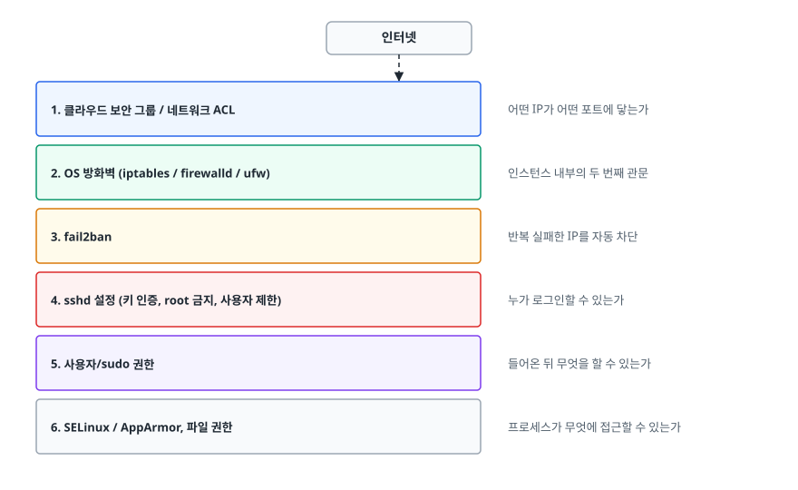
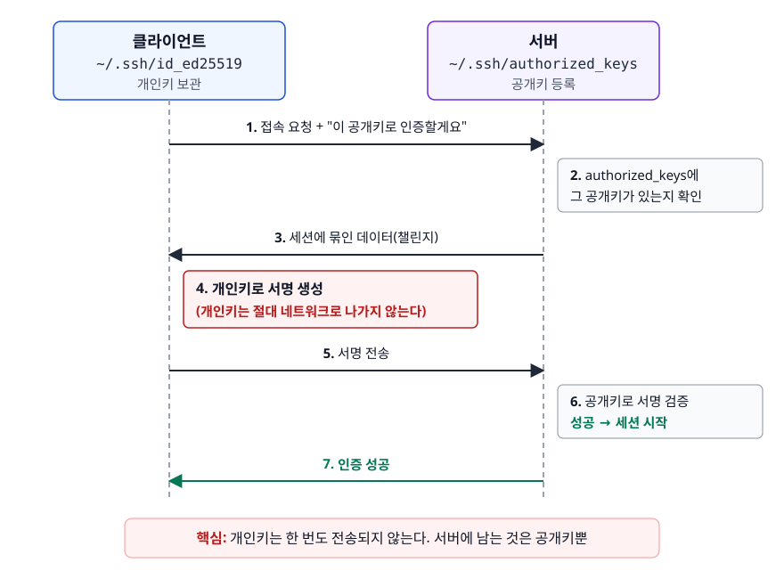
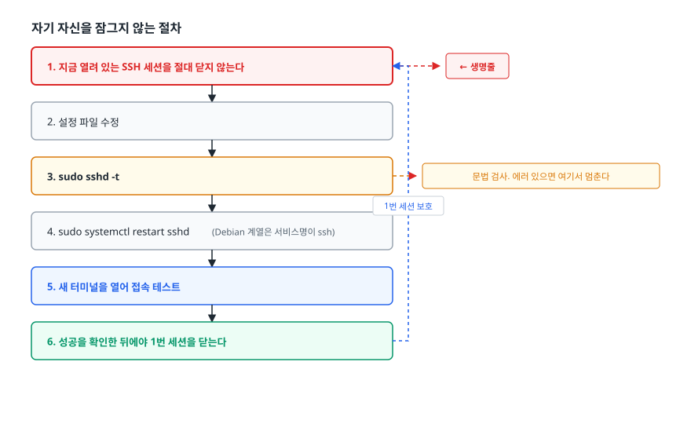
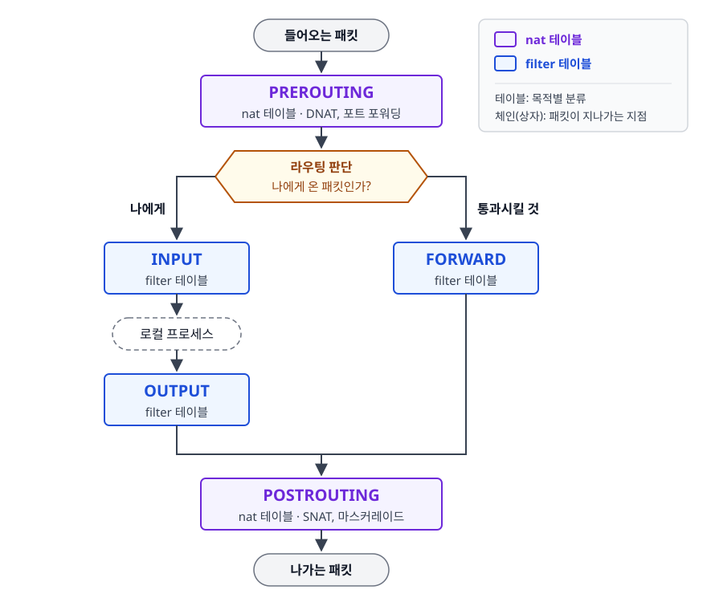
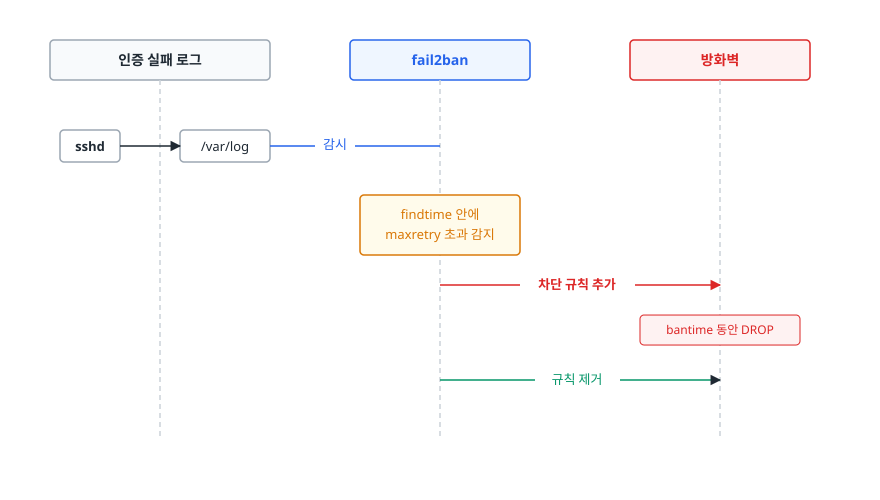

# 서버 보안 기초 (Security Basics)

> 공개 인터넷에 놓인 리눅스 서버를 **어떻게 들어오는가(SSH), 무엇을 통과시키는가(방화벽), 들어온 뒤 무엇을 할 수 있는가(권한)** 세 축으로 잠글 수 있게 됩니다.

## 학습 목표

- [ ] SSH 키 인증이 비밀번호 인증보다 안전한 이유를 프로토콜 수준에서 설명할 수 있다
- [ ] 키를 생성·배포하고 권한 문제로 접속이 거부되는 상황을 해결할 수 있다
- [ ] sshd 하드닝 항목을 이해하고 **접속이 끊기지 않게** 적용할 수 있다
- [ ] iptables의 테이블/체인 구조를 설명하고 firewalld/ufw와 관계를 정리할 수 있다
- [ ] 최소 권한 원칙에 따라 sudo 규칙을 설계할 수 있다
- [ ] 패키지 업데이트·서비스 최소화·fail2ban으로 공격 표면을 줄일 수 있다

## 선행 지식

- [리눅스 기본기](./01-linux-essentials.md) - 파일 권한과 소유권
- [네트워크 진단 명령어](./02-networking-commands.md) - 포트와 LISTEN 상태

---

## 1. 왜 필요한가

퍼블릭 IP를 가진 서버를 띄우면, 아무에게도 알리지 않아도 **몇 분 안에 SSH 로그인 시도가 들어옵니다.** 인터넷 전체를 훑는 자동 스캐너가 상시 돌고 있기 때문입니다. `journalctl -u sshd | grep 'Failed password'`를 쳐보면 `root`, `admin`, `test`, `ubuntu` 같은 계정으로 수천 건이 쌓여 있는 것을 볼 수 있습니다.

그래서 서버 보안의 출발점은 거창한 것이 아니라 **가장 많이 두드리는 문을 잠그는 일**입니다. 실제로 침해 사고의 상당수는 정교한 공격이 아니라 아래 셋 중 하나입니다.

- 추측 가능한 비밀번호로 SSH 로그인 성공
- 불필요하게 열린 포트에 붙은 관리 도구
- 패치되지 않은 알려진 취약점

이 문서는 이 셋을 막는 최소한의 조치를 다룹니다. 순서는 **다층 방어(Defense in Depth)** 로 잡습니다. 한 겹이 뚫려도 다음 겹이 남아 있게 만드는 것입니다.

<!-- diagram:cloud-security-basics-1 -->


<!-- 위 그림이 대체한 원본 ASCII.
     내용을 고칠 때는 그림도 함께 갱신할 것.
```
   인터넷
     │
┌────┴──────────────────────────────────────────┐
│ 1. 클라우드 보안 그룹 / 네트워크 ACL             │  어떤 IP가 어떤 포트에 닿는가
├───────────────────────────────────────────────┤
│ 2. OS 방화벽 (iptables / firewalld / ufw)      │  인스턴스 내부의 두 번째 관문
├───────────────────────────────────────────────┤
│ 3. fail2ban                                    │  반복 실패한 IP를 자동 차단
├───────────────────────────────────────────────┤
│ 4. sshd 설정 (키 인증, root 금지, 사용자 제한)   │  누가 로그인할 수 있는가
├───────────────────────────────────────────────┤
│ 5. 사용자/sudo 권한                             │  들어온 뒤 무엇을 할 수 있는가
├───────────────────────────────────────────────┤
│ 6. SELinux / AppArmor, 파일 권한                │  프로세스가 무엇에 접근할 수 있는가
└───────────────────────────────────────────────┘
```
-->

**비유**: 아파트 보안과 같습니다. 단지 출입구(보안 그룹) → 동 현관(OS 방화벽) → 집 현관(SSH) → 방마다 잠금(권한). 하나가 열려 있어도 나머지가 버팁니다.
**비유의 한계**: 아파트는 물리적으로 순서대로 통과해야 하지만, 서버는 애플리케이션 취약점처럼 **바깥 겹을 건너뛰고 안쪽에 바로 도달하는 경로**가 존재합니다. 계층 방어는 확률을 낮추는 장치이지 완전한 순차 관문이 아닙니다.

---

## 2. SSH 키 인증

### 비밀번호가 왜 위험한가

비밀번호 인증은 두 가지 구조적 약점이 있습니다.

1. **무한히 시도할 수 있습니다.** 공격자는 초당 수십 번씩 사전 공격을 돌릴 수 있고, 사람이 외울 만한 비밀번호는 결국 뚫립니다.
2. **비밀 자체가 서버로 전달됩니다.** 전송 구간은 암호화되지만, 서버가 침해됐거나 중간자에 속으면 비밀번호 원문이 노출됩니다. 게다가 사람들은 같은 비밀번호를 여러 서버에 재사용합니다.

키 인증은 이 둘을 모두 없앱니다.

### 어떻게 동작하나

키 쌍은 수학적으로 짝인 **개인키(private key)** 와 **공개키(public key)** 로 이루어집니다. 공개키로 검증할 수 있는 서명은 개인키로만 만들 수 있다는 성질을 이용합니다.

<!-- diagram:cloud-security-basics-2 -->


<!-- 위 그림이 대체한 원본 ASCII.
     내용을 고칠 때는 그림도 함께 갱신할 것.
```
클라이언트                                        서버
(~/.ssh/id_ed25519)                    (~/.ssh/authorized_keys)
     │                                             │
     │  1. 접속 요청 + "이 공개키로 인증할게요"        │
     ├────────────────────────────────────────────►│
     │                                             │ 2. authorized_keys에
     │                                             │    그 공개키가 있는지 확인
     │  3. 세션에 묶인 데이터(챌린지)                  │
     │◄────────────────────────────────────────────┤
     │                                             │
     │ 4. 개인키로 서명 생성                          │
     │    (개인키는 절대 네트워크로 나가지 않는다)      │
     │                                             │
     │  5. 서명 전송                                 │
     ├────────────────────────────────────────────►│
     │                                             │ 6. 공개키로 서명 검증
     │  7. 인증 성공                                 │    성공 → 세션 시작
     │◄────────────────────────────────────────────┤
```
-->

핵심은 **개인키가 한 번도 전송되지 않는다**는 점입니다. 서버가 나중에 털려도 거기 있는 것은 공개키뿐이라 다른 서버에 재사용할 수 없습니다. 그리고 키의 엔트로피가 사람이 만드는 비밀번호와 비교가 안 되게 크기 때문에, 무차별 대입은 현실적으로 불가능합니다.

| 항목 | 비밀번호 인증 | 키 인증 |
|------|-------------|--------|
| 무차별 대입 | 현실적 위협 | 사실상 불가능 |
| 비밀 전송 여부 | 서버로 전달됨 | 개인키는 전송되지 않음 |
| 서버 침해 시 파급 | 다른 서버로 재사용 위험 | 공개키만 유출, 재사용 불가 |
| 유출 시 폐기 | 전 서버에서 변경 필요 | 해당 공개키 한 줄 삭제 |
| 자동화 | 비밀번호를 스크립트에 넣어야 함 | 에이전트로 안전하게 |
| 관리 부담 | 낮음 | 키 배포·회수 체계 필요 |

**그래서 언제 뭘 쓰나**: 운영 서버는 예외 없이 키 인증만 허용합니다. 키 관리 부담은 `authorized_keys` 배포를 자동화하거나 인증서 기반 SSH로 해결하는 것이지, 비밀번호로 되돌아갈 이유가 되지 않습니다.

### 설정 절차

```bash
# 1) 클라이언트에서 키 생성
ssh-keygen -t ed25519 -C "hyeonjin@laptop"
# 구형 시스템 호환이 필요하면
ssh-keygen -t rsa -b 4096 -C "hyeonjin@laptop"
```

`ed25519`가 현재 권장 알고리즘입니다. RSA 4096보다 키가 짧고 빠르며 안전성도 충분합니다. 생성 시 묻는 **패스프레이즈는 반드시 설정합니다.** 개인키 파일 자체를 암호화하는 것이라, 노트북을 분실해도 파일만으로는 쓸 수 없습니다.

```bash
# 2) 서버에 공개키 등록
ssh-copy-id -i ~/.ssh/id_ed25519.pub deploy@server

# 수동으로 한다면
cat ~/.ssh/id_ed25519.pub | ssh deploy@server \
  'mkdir -p ~/.ssh && chmod 700 ~/.ssh && cat >> ~/.ssh/authorized_keys && chmod 600 ~/.ssh/authorized_keys'
```

```bash
# 3) 권한 확인 — 여기서 대부분 막힌다
chmod 700 ~/.ssh
chmod 600 ~/.ssh/id_ed25519
chmod 644 ~/.ssh/id_ed25519.pub
chmod 600 ~/.ssh/authorized_keys
```

**OpenSSH는 개인키가 다른 사용자에게 읽힐 수 있으면 접속을 거부합니다.** 남이 읽을 수 있는 개인키는 이미 유출된 것으로 간주하는 정책입니다. 서버 쪽도 마찬가지라, `~/.ssh`가 700이 아니거나 홈 디렉터리가 그룹 쓰기 가능하면 키 인증이 조용히 실패합니다. CI에서 키 파일을 내려받은 뒤 `chmod 600`을 빠뜨려 실패하는 일이 드물지 않게 벌어집니다.

```bash
# 4) 접속 안 될 때 원인 찾기
ssh -vvv deploy@server              # 클라이언트 측 상세 로그
sudo journalctl -u sshd -n 50       # 서버 측 로그 (Debian 계열은 -u ssh)
```

### ssh-agent와 config

```bash
eval "$(ssh-agent -s)"
ssh-add ~/.ssh/id_ed25519      # 패스프레이즈를 한 번만 입력
```

에이전트는 잠금 해제된 키를 메모리에 들고 있다가 대신 서명해줍니다. 패스프레이즈를 매번 치지 않아도 되면서 개인키 파일은 암호화 상태로 유지됩니다.

```
# ~/.ssh/config
Host bastion
    HostName 203.0.113.10
    User deploy
    IdentityFile ~/.ssh/id_ed25519

Host prod-*
    User deploy
    IdentityFile ~/.ssh/id_ed25519
    ProxyJump bastion          # 배스천을 거쳐 프라이빗 서브넷으로

Host *
    ServerAliveInterval 60
    ServerAliveCountMax 3
```

`ProxyJump`는 프라이빗 서브넷 접근의 표준 패턴입니다. 애플리케이션 서버에는 공인 IP를 주지 않고, 배스천 한 대만 노출한 뒤 그 한 대만 집중적으로 방어합니다. 노출 면적을 줄이는 가장 효과적인 구조 중 하나입니다.

---

## 3. sshd 하드닝

설정 파일은 `/etc/ssh/sshd_config`다. 최근 배포판은 `/etc/ssh/sshd_config.d/*.conf`로 조각 파일을 두는 방식을 권장하므로, 원본을 통째로 고치기보다 조각 파일을 추가하는 편이 업그레이드에 안전합니다.

| 설정 | 값 | 왜 |
|------|-----|-----|
| `PermitRootLogin` | `no` | root는 이름이 고정돼 있어 공격의 기본 표적. 개인 계정 + sudo가 감사에도 유리 |
| `PasswordAuthentication` | `no` | 무차별 대입 경로를 원천 차단. 키 인증 확인 후에 끈다 |
| `PubkeyAuthentication` | `yes` | 키 인증 활성화 |
| `PermitEmptyPasswords` | `no` | 빈 비밀번호 계정 방지 |
| `KbdInteractiveAuthentication` | `no` | 비밀번호가 대화형 경로로 우회 입력되는 것을 막음 |
| `AllowUsers` 또는 `AllowGroups` | 필요한 계정만 | 화이트리스트. 나머지는 인증 시도조차 못 함 |
| `MaxAuthTries` | `3` 정도 | 한 연결에서의 시도 횟수 제한 |
| `LoginGraceTime` | `30` 정도 | 인증 안 된 연결이 오래 머무는 것을 방지 |
| `Port` | 기본 22 외 | 자동 스캐너 소음을 줄임. **보안 효과는 제한적** |
| `X11Forwarding` | `no` | 서버에서 쓸 일이 없다 |

포트 변경은 보안 대책이라기보다 **로그 노이즈 감소책**으로 봐야 합니다. 포트 스캔 한 번이면 드러나므로 그 자체로 방어가 되지 않습니다. 진짜 효과는 `PasswordAuthentication no`와 접근 소스 제한에서 나옵니다.

### 자기 자신을 잠그지 않는 절차

sshd 설정을 잘못 고치고 재시작해서 서버에 못 들어가는 사고는 초심자가 가장 흔하게 겪는 사고입니다. 순서를 지키면 막을 수 있습니다.

<!-- diagram:cloud-security-basics-3 -->


<!-- 위 그림이 대체한 원본 ASCII.
     내용을 고칠 때는 그림도 함께 갱신할 것.
```
1. 지금 열려 있는 SSH 세션을 절대 닫지 않는다        ← 생명줄
2. 설정 파일 수정
3. sudo sshd -t              문법 검사. 에러 있으면 여기서 멈춘다
4. sudo systemctl restart sshd  (Debian 계열은 서비스명이 ssh)
5. 새 터미널을 열어 접속 테스트
6. 성공을 확인한 뒤에야 1번 세션을 닫는다
```
-->

`sshd -t`는 문법만 검사합니다. 문법은 맞는데 논리가 틀린 경우(예: 자기 계정을 `AllowUsers`에서 빠뜨림)는 잡아주지 않으므로 5번의 실접속 테스트가 반드시 필요합니다.

추가로 주의할 것 둘.

- **포트를 바꿨다면** OS 방화벽과 클라우드 보안 그룹에서 새 포트를 먼저 열어야 합니다. SELinux를 쓰는 배포판에서는 포트 컨텍스트도 등록해야 sshd가 바인딩할 수 있습니다.
- 배포판에 따라 sshd가 systemd 소켓 액티베이션(`ssh.socket`)으로 뜨는 경우가 있습니다. 이때는 `sshd_config`의 `Port`가 무시되므로 소켓 유닛 쪽을 함께 고쳐야 합니다.

---

## 4. 방화벽

### iptables의 구조

리눅스 커널의 패킷 필터링은 **테이블(table)** 과 **체인(chain)** 으로 구성됩니다. 테이블은 목적별 분류이고, 체인은 패킷이 지나가는 지점입니다.

<!-- diagram:cloud-security-basics-4 -->


<!-- 위 그림이 대체한 원본 ASCII.
     내용을 고칠 때는 그림도 함께 갱신할 것.
```
                    ┌──────────────┐
   들어오는 패킷 ───►│  PREROUTING  │ (nat: DNAT, 포트 포워딩)
                    └──────┬───────┘
                           │
                    라우팅 판단: 나에게 온 패킷인가?
                     ┌─────┴─────┐
              나에게 │           │ 통과시킬 것
                    ▼           ▼
              ┌──────────┐  ┌──────────┐
              │  INPUT   │  │ FORWARD  │  (filter)
              └────┬─────┘  └────┬─────┘
                   │             │
              로컬 프로세스        │
                   │             │
              ┌────▼─────┐       │
              │  OUTPUT  │       │  (filter)
              └────┬─────┘       │
                   └──────┬──────┘
                          ▼
                   ┌──────────────┐
                   │ POSTROUTING  │ (nat: SNAT, 마스커레이드)
                   └──────┬───────┘
                          ▼
                    나가는 패킷
```
-->

일반 서버에서 손댈 일이 있는 것은 대부분 `filter` 테이블의 **INPUT** 체인입니다. FORWARD는 라우터나 도커 호스트에서, nat 테이블은 포트 포워딩이나 NAT를 할 때 씁니다.

규칙 평가에는 두 가지 원칙이 있습니다.

1. **위에서 아래로, 첫 번째 일치에서 결정됩니다.** 그래서 순서가 결과를 바꿉니다.
2. **어떤 규칙에도 걸리지 않으면 체인의 기본 정책(policy)이 적용됩니다.**

```bash
iptables -L INPUT -n -v --line-numbers    # 규칙 확인 (번호와 히트 수 포함)
```

```bash
# 실무 기본 골격 (순서가 핵심이다)
iptables -A INPUT -i lo -j ACCEPT                                    # 루프백 먼저
iptables -A INPUT -m conntrack --ctstate ESTABLISHED,RELATED -j ACCEPT # 기존 연결 응답
iptables -A INPUT -p tcp --dport 22 -s 203.0.113.0/24 -j ACCEPT      # SSH는 사내 대역만
iptables -A INPUT -p tcp --dport 80  -j ACCEPT
iptables -A INPUT -p tcp --dport 443 -j ACCEPT
iptables -P INPUT DROP                                               # 기본 정책은 마지막에
```

두 번째 줄이 특히 중요합니다. **conntrack 규칙이 없으면 우리가 밖으로 보낸 요청의 응답도 막힙니다.** 패키지 설치도, DNS 조회도 안 되는 상태가 되어 서버가 사실상 고립됩니다.

첫 줄과 마지막 줄의 순서도 중요합니다. 원격에서 작업하면서 `iptables -P INPUT DROP`을 먼저 실행하면 그 순간 자기 세션이 끊깁니다. **허용 규칙을 모두 넣은 다음에 기본 정책을 바꿉니다.**

`DROP`과 `REJECT`의 차이도 알아두면 좋습니다. `DROP`은 아무 응답 없이 버려서 클라이언트가 타임아웃까지 기다리고, `REJECT`는 거부 응답을 보내 즉시 실패시킵니다. 외부에 노출된 면에는 정보를 덜 주는 `DROP`, 내부 네트워크에는 디버깅이 쉬운 `REJECT`를 쓰는 편입니다.

**iptables 규칙은 메모리에만 있어서 재부팅하면 사라집니다.** 저장을 별도로 해야 합니다.

```bash
iptables-save > /etc/iptables/rules.v4      # 파일로 저장
# 배포판별 영속화 패키지(netfilter-persistent 등)를 함께 사용
```

최신 배포판은 내부적으로 nftables로 대체되고 있고 `iptables` 명령이 호환 계층으로 동작하는 경우가 많습니다. `nft list ruleset`으로 실제 규칙을 확인할 수 있습니다.

### firewalld와 ufw

iptables를 직접 쓰면 순서와 영속화를 사람이 관리해야 해서 실수가 잦습니다. 그래서 상위 관리 도구가 나왔습니다.

| 도구 | 주 배포판 | 개념 | 특징 |
|------|----------|------|------|
| iptables/nft | 공통 | 체인과 규칙 | 가장 세밀하나 순서·영속화를 직접 관리 |
| firewalld | RHEL/CentOS/Rocky | 존(zone) 기반 | 인터페이스마다 신뢰 수준 지정, 런타임/영구 분리 |
| ufw | Ubuntu/Debian | 단순 규칙 | 명령이 짧고 직관적, 개인·소규모에 적합 |

```bash
# firewalld
firewall-cmd --state
firewall-cmd --list-all
firewall-cmd --add-service=https --permanent
firewall-cmd --add-port=8080/tcp --permanent
firewall-cmd --reload                      # --permanent 변경은 reload해야 적용
```

```bash
# ufw
ufw status verbose
ufw default deny incoming
ufw default allow outgoing
ufw allow OpenSSH            # 활성화 전에 반드시 SSH부터
ufw allow 443/tcp
ufw enable
```

**ufw를 켜기 전에 SSH를 먼저 허용하지 않으면 그 자리에서 접속이 끊깁니다.** `ufw enable`은 확인 메시지를 띄우지만, 스크립트에서 자동으로 실행하면 그대로 잠깁니다.

세 도구를 동시에 쓰면 규칙이 충돌해 원인을 알 수 없는 차단이 생깁니다. **배포판에 맞는 하나만 씁니다.**

### 클라우드 보안 그룹과의 관계

클라우드에서는 인스턴스 밖에 보안 그룹이라는 또 하나의 방화벽이 있습니다. 둘의 성격이 다릅니다.

- **보안 그룹**: 인스턴스에 도달하기 전 단계에서 걸러집니다. 허용 규칙만 쓸 수 있고 상태 추적(stateful)이라 응답 트래픽은 자동 허용됩니다. 다른 보안 그룹을 소스로 지정할 수 있어 "앱 서버에서 온 것만 DB 허용" 같은 규칙을 IP 없이 표현할 수 있습니다.
- **OS 방화벽**: 인스턴스 안에서 동작합니다. 보안 그룹 설정이 잘못돼도 마지막으로 막아주는 겹입니다.

둘 중 하나만 쓰면 안 되냐는 질문이 자주 나오는데, 클라우드 콘솔에서 실수로 보안 그룹을 열어버리는 사고가 실제로 흔하다는 점을 생각하면 답이 나옵니다. 다만 규칙을 두 군데 관리하는 부담이 있으니, **경계는 보안 그룹으로 관리하고 OS 방화벽은 최소한의 안전망으로 단순하게 유지**하는 절충이 일반적입니다.

디버깅 시에는 **어느 겹에서 막혔는지 구분**하는 것이 관건입니다. `nc -zv`가 타임아웃이면 보안 그룹이나 OS 방화벽에서 DROP된 것이고, `Connection refused`면 패킷은 도달했으므로 방화벽은 통과했고 LISTEN이 없는 것입니다. 이 구분법은 [네트워크 진단 명령어](./02-networking-commands.md)에서 자세히 다룹니다.

---

## 5. 최소 권한과 sudo

### 원칙

**최소 권한(Principle of Least Privilege)** 은 각 주체에게 업무에 필요한 최소한의 권한만 준다는 원칙입니다. 목적은 사고를 막는 것보다 **사고의 영향 범위를 좁히는 것**에 가깝습니다. 계정 하나가 털렸을 때 그 계정이 서버 전체를 만질 수 있는지, 로그 디렉터리만 볼 수 있는지가 사고의 크기를 결정합니다.

실무 원칙 세 가지.

1. **root로 상시 작업하지 않습니다.** 개인 계정으로 로그인하고 필요할 때만 `sudo`를 씁니다.
2. **계정을 공유하지 않습니다.** 공유 계정은 감사 로그에서 "누가 했는지"를 영원히 알 수 없게 만듭니다. 사람마다 계정을 만들고, 퇴사 시 해당 계정과 키만 제거합니다.
3. **애플리케이션은 전용 계정으로 돌립니다.** 웹 서버가 root로 돌면 애플리케이션 취약점이 곧바로 시스템 장악으로 이어집니다.

### sudo 설정

```bash
sudo visudo                       # 반드시 visudo로 편집
sudo visudo -f /etc/sudoers.d/deploy   # 조각 파일이 관리에 유리
```

`visudo`는 저장 시 문법을 검사합니다. `/etc/sudoers`를 일반 편집기로 고치다 문법이 깨지면 **sudo 자체가 동작하지 않아 복구가 매우 곤란해집니다.** 예외 없이 `visudo`를 씁니다.

```
# 그룹 단위로 부여 (배포판에 따라 wheel 또는 sudo)
%wheel  ALL=(ALL:ALL) ALL

# 특정 사용자에게 특정 명령만
deploy  ALL=(root) /bin/systemctl restart myapp, /bin/systemctl status myapp

# 비밀번호 없이 (자동화용, 범위를 최대한 좁힐 것)
deploy  ALL=(root) NOPASSWD: /bin/systemctl reload nginx
```

```bash
sudo -l          # 내가 쓸 수 있는 sudo 명령 확인
```

`NOPASSWD`를 `ALL`에 주는 것은 사실상 root 계정을 하나 더 만드는 것과 같습니다. 배포 자동화 때문에 필요하다면 **그 자동화가 실제로 실행하는 명령만** 나열합니다. 명령 경로에 와일드카드를 쓰면 우회 여지가 생기므로 절대 경로로 정확히 적습니다.

sudo 사용 기록은 인증 로그에 남는다(배포판에 따라 `/var/log/auth.log` 또는 `/var/log/secure`, 또는 `journalctl`). 사고 조사 시 가장 먼저 보는 로그이므로, 로그가 서버 밖으로 수집되고 있는지도 확인해둡니다. 서버가 털리면 서버 안의 로그는 신뢰할 수 없기 때문입니다.

---

## 6. 공격 표면 줄이기

### 패키지 업데이트

침해 사고의 큰 축이 **이미 패치가 나와 있는 취약점**입니다. 알려진 취약점은 공개 코드가 돌아다니기 때문에 공격 난이도가 매우 낮습니다.

```bash
# Debian/Ubuntu
sudo apt update && sudo apt upgrade
sudo apt list --upgradable

# RHEL 계열
sudo dnf check-update
sudo dnf upgrade
```

보안 업데이트만 자동 적용하는 장치도 있습니다. Debian/Ubuntu의 `unattended-upgrades`, RHEL 계열의 `dnf-automatic`이 그것입니다. 운영 서버에 자동 업데이트를 거는 것은 논쟁적인데, 판단 기준은 이렇습니다. **재기동 없이 적용되는 보안 패치는 자동으로, 커널처럼 재부팅이 필요한 것은 점검 창에서 계획적으로.** 커널 업데이트는 재부팅 전까지 적용되지 않는다는 점을 잊기 쉽습니다.

컨테이너 환경이라면 접근이 달라집니다. 실행 중인 컨테이너에는 직접 패치하지 않고 **베이스 이미지를 갱신해 다시 빌드·배포**합니다. 이미지 취약점 스캔을 CI에 넣어두는 것이 기본입니다.

### 서비스 최소화

설치돼 있지만 쓰지 않는 서비스는 전부 공격 표면입니다.

```bash
ss -tlnp                                        # 지금 열려 있는 포트와 프로세스
systemctl list-units --type=service --state=running
systemctl disable --now <불필요한서비스>
```

`ss -tlnp` 결과를 한 줄씩 보면서 "이게 왜 외부로 열려 있지?"를 자문하는 것이 좋은 점검입니다. 자주 나오는 것들: 개발용으로 켠 관리 콘솔, 바인드 주소를 `0.0.0.0`으로 둔 DB, 디버그 포트, 모니터링 익스포터. 꼭 필요하다면 최소한 `127.0.0.1`로 바인딩하거나 방화벽에서 소스를 제한합니다.

### fail2ban

인증을 키 방식으로 바꿔도 로그인 시도 자체는 계속 들어옵니다. fail2ban은 **로그를 감시하다가 실패가 반복되는 IP를 방화벽 규칙으로 일정 시간 차단**합니다.

<!-- diagram:cloud-security-basics-5 -->


<!-- 위 그림이 대체한 원본 ASCII.
     내용을 고칠 때는 그림도 함께 갱신할 것.
```
   인증 실패 로그          fail2ban              방화벽
        │                    │                    │
   sshd ─┴─► /var/log ──감시──┤                    │
                             │ findtime 안에      │
                             │ maxretry 초과 감지  │
                             ├───── 차단 규칙 추가 ──►│
                             │                    │ bantime 동안 DROP
                             ├───── 규칙 제거 ─────►│
```
-->

```bash
sudo apt install fail2ban          # 또는 dnf install fail2ban
```

```ini
# /etc/fail2ban/jail.local  (jail.conf를 직접 고치지 않는다)
[DEFAULT]
bantime  = 1h
findtime = 10m
maxretry = 5
ignoreip = 127.0.0.1/8 203.0.113.0/24    # 사내 대역은 제외

[sshd]
enabled = true
```

```bash
sudo systemctl enable --now fail2ban
sudo fail2ban-client status sshd     # 현재 차단된 IP 확인
sudo fail2ban-client set sshd unbanip 203.0.113.55
```

`ignoreip`에 사무실이나 배스천 대역을 넣어두지 않으면 **오타로 자기 자신이 차단되는** 일이 생깁니다. 실제로 자주 일어나므로 설정 시 반드시 챙깁니다.

fail2ban은 만능이 아닙니다. 분산된 IP에서 오는 공격에는 효과가 제한적이고, 어디까지나 소음 감소와 단순 공격 차단 수단입니다. 근본 방어는 여전히 키 인증과 접근 제한입니다.

### SELinux / AppArmor

파일 권한(DAC)은 "파일 소유자가 정한 규칙"이라, 프로세스가 그 사용자 권한만 얻으면 통과합니다. SELinux와 AppArmor는 그 위에 **커널이 강제하는 규칙(MAC)** 을 얹어서, 예를 들어 "웹 서버 프로세스는 웹 콘텐츠 라벨이 붙은 파일만 읽을 수 있다"는 제약을 겁니다. 웹 서버가 뚫려도 시스템 파일에는 못 닿게 하는 장치입니다.

```bash
getenforce                 # Enforcing / Permissive / Disabled
sestatus
ls -Z /var/www/html        # 파일의 보안 컨텍스트
sudo ausearch -m avc -ts recent    # 차단 기록 확인
```

애플리케이션이 이유 없이 파일을 못 읽거나 포트를 못 열 때 SELinux가 원인인 경우가 있습니다. 이때 흔한 대응이 `setenforce 0`으로 꺼버리는 것인데, 이건 보호막을 통째로 벗기는 것이라 권장되지 않습니다. 올바른 순서는 **차단 기록(AVC)을 확인해 무엇이 막혔는지 파악한 뒤, 컨텍스트를 복원하거나 해당 불리언만 켜는 것**입니다. Ubuntu 계열은 SELinux 대신 AppArmor를 쓰며 프로파일 단위로 같은 역할을 합니다.

---

## 7. 실무에서는

**자격 증명을 서버에 두지 않습니다.** DB 비밀번호나 API 키를 설정 파일에 평문으로 두면 서버 한 대의 침해가 전체 시스템의 침해가 됩니다. 클라우드에서는 시크릿 관리 서비스에 저장하고 애플리케이션이 실행 시점에 가져오게 합니다. 더 나은 방법은 아예 정적 자격 증명을 없애는 것입니다. AWS의 IAM 역할처럼 인스턴스나 파드에 신원을 부여하면, 임시 자격 증명이 자동 발급·갱신되어 유출될 장기 비밀 자체가 사라집니다.

**서버에 직접 들어가지 않는 방향으로 갑니다.** SSH 접속 자체가 감사와 관리의 부담입니다. 그래서 최근 운영은 서버를 불변(immutable) 자원으로 다루고, 변경이 필요하면 새 이미지를 배포합니다. 진단이 필요하면 세션 관리 서비스나 관측 도구를 통해 접근해 명령 기록을 남깁니다. 그럼에도 SSH를 완전히 없애기는 어려우므로 배스천 한 곳으로 좁혀 관리하는 것이 현실적인 절충입니다.

**감사 로그는 밖으로 보냅니다.** 침해가 발생하면 공격자가 가장 먼저 하는 일 중 하나가 로그 삭제입니다. 인증 로그와 감사 로그를 별도 저장소로 실시간 전송해두어야 사후 조사가 가능합니다.

**키 회수 절차를 미리 정합니다.** 퇴사자나 유출된 키를 어떻게 제거할지 정해두지 않으면, 서버가 수십 대일 때 `authorized_keys`를 사람이 뒤지게 됩니다. 구성 관리 도구로 `authorized_keys`를 배포하거나 SSH 인증서 기반으로 전환해 만료 시간을 두는 방식이 있습니다.

---

## 8. 면접 포인트

> 면접에서 이 주제가 나오면 이렇게 답한다

**Q. SSH 키 인증이 비밀번호 인증보다 안전한 이유는?**

A. 두 가지입니다. 첫째, 인증 과정에서 개인키가 서버로 전송되지 않습니다. 서버가 보낸 챌린지에 개인키로 서명하고 서버는 등록된 공개키로 검증하기 때문에, 서버가 침해돼도 거기 있는 것은 공개키뿐이라 다른 서버에 재사용할 수 없습니다. 둘째, 키의 엔트로피가 사람이 만든 비밀번호와 비교가 안 되게 커서 무차별 대입이 현실적으로 불가능합니다. 다만 개인키 파일 자체가 유출되면 끝이므로 패스프레이즈를 걸고 ssh-agent를 쓰며, 키가 담긴 디렉터리 권한을 700/600으로 관리해야 합니다.

- 꼬리 질문: "키 인증인데도 접속이 안 되면 뭘 보나요?" → 권한(`~/.ssh` 700, 개인키·authorized_keys 600, 홈 디렉터리가 그룹 쓰기 가능하지 않은지)을 먼저 보고, `ssh -vvv`와 서버의 sshd 로그로 어느 단계에서 거부됐는지 확인합니다.

**Q. 새 서버를 받았을 때 어떤 보안 설정부터 하시겠습니까?**

A. 먼저 개인 계정을 만들고 공개키를 등록한 뒤 **그 계정으로 실제 접속과 sudo가 되는지 확인**합니다. 확인이 끝난 다음에야 `PasswordAuthentication no`와 `PermitRootLogin no`를 적용하고, `sshd -t`로 검증한 뒤 기존 세션은 열어둔 채 새 세션으로 접속 테스트를 합니다. 그다음 방화벽에서 기본 차단 정책을 세우되 루프백과 기존 연결(conntrack) 허용, SSH는 가능하면 소스 IP 대역 제한을 걸고 나머지 필요한 포트만 엽니다. 마지막으로 `ss -tlnp`로 불필요하게 열린 포트를 정리하고, 보안 업데이트를 적용한 뒤 fail2ban을 올립니다.

- 꼬리 질문: "순서를 왜 그렇게 잡나요?" → 접근 경로를 확보한 뒤에 잠가야 자기 자신을 잠그지 않기 때문입니다. 모든 하드닝 작업의 공통 원칙입니다.

**Q. 클라우드 보안 그룹이 있는데 OS 방화벽도 필요한가요?**

A. 다층 방어 관점에서 필요합니다. 보안 그룹은 인스턴스 밖에서 걸러주지만, 콘솔 조작 실수나 잘못된 IaC 변경으로 규칙이 넓게 열리는 사고가 실제로 흔합니다. OS 방화벽은 그때 마지막으로 막아주는 겹입니다. 다만 규칙을 두 곳에서 관리하는 운영 부담이 있어서, 실무에서는 세밀한 경계 제어는 보안 그룹으로 하고 OS 방화벽은 기본 차단과 최소 허용만 두는 단순한 형태로 유지하는 절충을 많이 씁니다.

- 꼬리 질문: "차단됐을 때 어느 쪽인지 어떻게 구분하나요?" → `nc -zv`가 타임아웃이면 어딘가에서 DROP된 것이고, `Connection refused`면 패킷은 도달했으므로 방화벽은 통과했고 LISTEN이 없는 것입니다. 서버에서 tcpdump로 SYN 도착 여부를 보면 확정할 수 있습니다.

**Q. iptables에서 규칙 순서가 왜 중요한가요?**

A. 체인의 규칙은 위에서 아래로 평가되고 첫 번째로 일치하는 규칙에서 처리가 결정되기 때문입니다. 그래서 앞쪽에 광범위한 DROP을 두면 뒤에 아무리 ACCEPT를 추가해도 도달하지 못합니다. 또한 원격 작업 시 기본 정책을 DROP으로 먼저 바꾸면 그 순간 자기 세션이 끊기므로, 루프백 허용과 ESTABLISHED,RELATED 허용을 포함한 필요한 ACCEPT를 모두 넣은 다음에 기본 정책을 바꿉니다. 특히 conntrack 규칙이 없으면 우리가 보낸 요청의 응답까지 막혀서 서버가 고립됩니다. 그리고 iptables 규칙은 메모리에만 있으므로 별도로 저장하지 않으면 재부팅 시 사라집니다.

---

## 자주 하는 실수

| 실수 | 왜 틀렸나 | 올바른 이해 |
|------|----------|-----------|
| 키 등록 확인 전에 `PasswordAuthentication no` 적용 | 키가 안 되면 들어갈 방법이 없어진다 | 키 접속 성공 확인 후 변경, 기존 세션 유지 |
| sshd 재시작 후 바로 세션 종료 | 설정 오류를 발견할 기회를 잃는다 | 새 터미널로 접속 성공까지 확인하고 닫는다 |
| SSH 포트만 바꾸고 안전하다고 판단 | 포트 스캔으로 금방 드러난다 | 키 인증 + 소스 제한이 실제 방어 |
| `iptables -P INPUT DROP`을 먼저 실행 | 그 즉시 자기 세션이 끊긴다 | 허용 규칙을 다 넣은 뒤 정책 변경 |
| conntrack(ESTABLISHED,RELATED) 규칙 누락 | 나간 요청의 응답까지 막혀 서버가 고립된다 | 기본 골격에 반드시 포함 |
| iptables 규칙 저장 생략 | 재부팅 시 전부 사라진다 | `iptables-save` 또는 영속화 패키지 사용 |
| ufw 활성화 전에 SSH 미허용 | 즉시 잠긴다 | `ufw allow OpenSSH` 후 `ufw enable` |
| `/etc/sudoers`를 일반 편집기로 수정 | 문법이 깨지면 sudo 자체가 못 쓰게 된다 | 항상 `visudo` |
| 자동화 편의로 `NOPASSWD: ALL` 부여 | 사실상 root 계정을 하나 더 만드는 것 | 실제 필요한 명령만 절대 경로로 나열 |
| 문제가 생기면 SELinux를 끈다 | 방어 계층을 통째로 제거하는 것 | AVC 로그로 원인 확인 후 컨텍스트/불리언 조정 |
| fail2ban `ignoreip`에 사내 대역 미등록 | 오타 몇 번으로 자기가 차단된다 | 사무실·배스천 대역을 예외로 등록 |

---

## 한 줄 정리

서버 보안의 기본은 **들어오는 문을 키 인증 하나로 좁히고(SSH), 통과시킬 포트를 최소로 줄이며(방화벽), 들어온 뒤 할 수 있는 일을 업무 범위로 제한하는(최소 권한)** 세 가지를 겹으로 쌓는 것입니다.

---

## 연관 개념

- [리눅스 기본기](./01-linux-essentials.md) - 파일 권한과 SUID가 보안에서 갖는 의미
- [네트워크 진단 명령어](./02-networking-commands.md) - 방화벽 차단 여부를 판별하는 방법
- [셸 스크립팅](./04-shell-scripting.md) - 자동화 스크립트에 자격 증명을 넣지 않기
- [qna-linux-networking.md](./qna-linux-networking.md) - 이 주제 면접 질문 모음
- [qna-security.md](../../08-security/qna-security.md) - 애플리케이션 보안 전반
- [qna-aws.md](../aws/qna-aws.md) - 보안 그룹, IAM 등 클라우드 보안 모델
