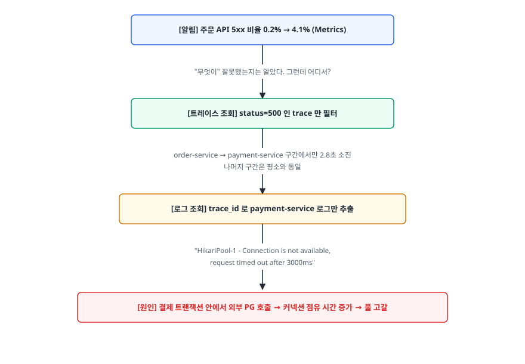
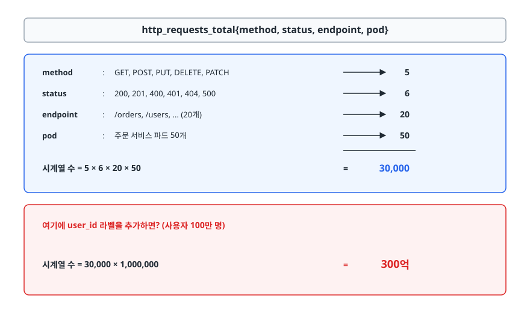
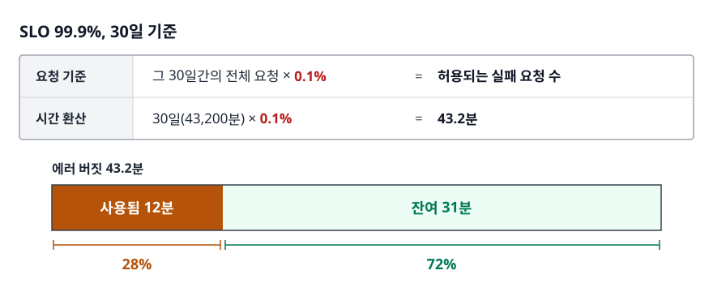

# 관측성 개념 (Observability Concepts)

> 로그·메트릭·트레이스가 각각 어떤 질문에 답하는 데이터인지, 그리고 SLO와 에러 버짓이 "고칠까 말까"를 어떻게 데이터로 바꿔주는지 설명할 수 있게 됩니다.

난이도: ⭐

## 학습 목표

- [ ] 모니터링과 관측성의 차이를 "알려진 문제 vs 모르는 문제"로 설명할 수 있다
- [ ] Logs / Metrics / Traces가 각각 답하는 질문이 무엇인지 구분할 수 있다
- [ ] 카디널리티가 왜 관측성 비용의 핵심 변수인지 설명할 수 있다
- [ ] USE와 RED 방법론을 상황에 맞게 골라 쓸 수 있다
- [ ] SLI/SLO/SLA와 에러 버짓이 조직의 의사결정을 어떻게 바꾸는지 설명할 수 있다

## 선행 지식

- 없음 — 이 문서부터 시작해도 됩니다. HTTP 상태 코드와 "서버가 여러 대로 돌아간다"는 감각만 있으면 충분합니다.

---

## 1. 왜 필요한가

서버가 한 대이던 시절의 디버깅은 단순했습니다. 사용자가 "느려요"라고 하면 그 서버에 SSH로 들어가서
`top`으로 CPU를 보고, `tail -f`로 로그를 흘려보고, 재현되면 그 자리에서 고쳤습니다. 시스템 전체가
한 사람 머릿속에 들어왔기 때문에 가능한 일이었습니다.

이 방식이 무너지는 지점은 대체로 세 가지입니다.

**첫째, 서버가 사라진다.** 컨테이너와 오토스케일링 환경에서는 문제를 일으킨 인스턴스가 이미
교체되어 없습니다. SSH로 들어갈 대상 자체가 사라진 뒤에 제보가 도착합니다.

**둘째, 요청 하나가 여러 서비스를 지난다.** 주문 API 하나가 인증 → 재고 → 가격 → 결제 →
알림으로 흘러간다면, "주문이 느리다"는 말은 다섯 개 서비스 중 어디가 느리다는 뜻인지 알려주지
않습니다. 각 서비스 담당자가 자기 대시보드를 보고 "우리는 정상인데요"라고 말하는 상황이 반복됩니다.

**셋째, 문제가 조건부로 발생한다.** "전체 에러율 0.3%"는 평온해 보이지만, 실제로는 특정 결제
수단을 쓰는 특정 앱 버전 사용자만 100% 실패하고 있을 수 있습니다. 평균은 이런 국소적 재앙을 지웁니다.

관측성(Observability)은 이 세 문제에 대한 답입니다. **시스템이 이미 뱉어놓은 데이터만으로,
새 코드를 배포하지 않고도 처음 던져보는 질문에 답할 수 있는 능력**을 말합니다.

### 알려진 문제와 모르는 문제

두 용어를 가르는 가장 정확한 기준은 도구가 아니라 **질문의 성격**입니다.

| 구분 | 모니터링(Monitoring) | 관측성(Observability) |
|------|---------------------|----------------------|
| 다루는 문제 | 알려진 미지(known unknowns) | 알려지지 않은 미지(unknown unknowns) |
| 질문 형태 | "디스크가 80%를 넘었나?" | "왜 이 사용자군만 느린가?" |
| 준비 시점 | 사전에 지표와 임계치를 정의 | 사후에 임의 조건으로 파고듦 |
| 데이터 구조 | 미리 집계된 소수의 지표 | 컨텍스트가 풍부한 원시 이벤트 |
| 실패 모드 | 예상 못 한 장애를 못 잡음 | 데이터 양과 비용이 폭증함 |

정리하면 **모니터링은 관측성의 부분집합**입니다. "디스크 사용률 알림"은 우리가 디스크가 찰 수
있다는 걸 이미 알기 때문에 걸 수 있습니다. 반면 "지난 화요일 14시에 안드로이드 12 사용자만
결제 3단계에서 타임아웃이 났다"는 조건은 미리 대시보드로 만들어둘 수 없습니다. 이런 질문에
답하려면 데이터가 충분히 세밀하게, 충분한 컨텍스트를 달고 남아 있어야 합니다.

> **비유** — 모니터링은 자동차 계기판이고, 관측성은 정비소의 진단 장비입니다. 계기판은 속도·연료·엔진
> 경고등처럼 제조사가 미리 고른 몇 개만 보여줍니다. 진단 장비는 ECU에 남은 원시 기록을 뒤져서
> "어떤 조건에서 몇 번 이상이 있었나"를 임의로 질의합니다.
>
> **비유의 한계** — 진단 장비는 차를 세워놓고 쓰지만, 관측성은 서비스가 돌아가는 중에 써야 합니다.
> 그래서 "사후에 얼마나 파고들 수 있느냐"가 아니라 **"장애 시점에 무엇을 미리 남겨뒀느냐"**가
> 실제 승부처입니다. 남기지 않은 데이터는 사후에 복구할 수 없습니다.

---

## 2. 세 가지 축이 각각 답하는 질문

Logs, Metrics, Traces를 흔히 "3대 축(Three Pillars)"이라 부릅니다. 중요한 건 이름 외우기가 아니라
**각각이 다른 질문에 답한다**는 사실입니다.

| 축 | 답하는 질문 | 데이터 형태 | 비용이 커지는 원인 | 주 용도 |
|----|-----------|-----------|-----------------|--------|
| Metrics | **얼마나 심각한가** | 시간 + 숫자 (시계열) | 시계열 개수(카디널리티) | 알림, SLO 측정, 추세 |
| Traces | **어디서 느려졌나** | 부모-자식 관계의 구간 | 요청 수 × 서비스 수 | 병목 위치, 의존성 파악 |
| Logs | **정확히 무슨 일이 있었나** | 이벤트별 텍스트/JSON | 이벤트 수 × 줄 길이 | 원인 규명, 감사 추적 |

**Metrics(메트릭)** 는 이미 집계된 숫자입니다. `http_requests_total{status="500"} 1423`처럼 한 시점에
값 하나만 남깁니다. 저장 효율이 압도적으로 좋아서 몇 달치를 보관하고 초 단위로 알림을 걸 수 있습니다.
대신 개별 요청의 사연이 없습니다. "5xx가 늘었다"는 알 수 있어도 "어떤 요청이 왜 실패했는지"는 모릅니다.

**Traces(트레이스)** 는 요청 하나가 시스템을 통과한 경로입니다. 각 구간을 Span이라 부르고, Span들이
부모-자식으로 묶여 하나의 Trace를 이룹니다. 서비스 경계를 넘는 지연을 눈으로 보여주는 유일한
데이터입니다. 대신 모든 서비스가 같은 규약으로 ID를 전파해야 하고, 전량 수집하면 비용이 감당되지
않아 샘플링이 거의 필수입니다.

**Logs(로그)** 는 특정 시점의 사건 기록입니다. 스택 트레이스, 요청 파라미터, 외부 API 응답 본문처럼
가장 풍부한 컨텍스트를 담습니다. 대신 양이 가장 많고, 검색·저장 비용이 세 축 중 가장 비쌉니다.

### 실제 장애에서 셋이 이어지는 방식

<!-- diagram:cloud-observability-concepts-1 -->


<!-- 위 그림이 대체한 원본 ASCII.
     내용을 고칠 때는 그림도 함께 갱신할 것.
```
 [알림]  주문 API 5xx 비율 0.2% → 4.1% (Metrics)
    │
    │  "무엇이" 잘못됐는지는 알았다. 그런데 어디서?
    ▼
 [트레이스 조회]  status=500 인 trace 만 필터
    │
    │  order-service → payment-service 구간에서만 2.8초 소진
    │  나머지 구간은 평소와 동일
    ▼
 [로그 조회]  trace_id 로 payment-service 로그만 추출
    │
    │  "HikariPool-1 - Connection is not available,
    │   request timed out after 3000ms"
    ▼
 [원인]  결제 트랜잭션 안에서 외부 PG 호출 → 커넥션 점유 시간 증가 → 풀 고갈
```
-->

세 축은 대체재가 아니라 **좁혀 들어가는 순서**다. 메트릭은 무엇이(what), 트레이스는 어디서(where),
로그는 왜(why)에 답합니다. 이 세 데이터가 `trace_id` 같은 공통 키로 연결되어 있지 않으면 각 단계
사이에서 사람이 손으로 시간대를 맞춰야 하고, 그 순간 대응 시간이 몇 배로 늘어납니다.

---

## 3. 카디널리티 — 관측성 비용의 실제 변수

관측성 비용이 예산을 넘는 사고는 대부분 "데이터를 너무 오래 보관해서"가 아니라
**카디널리티(cardinality)를 잘못 설계해서** 발생합니다.

카디널리티는 **한 메트릭 이름 아래 존재하는 서로 다른 라벨 조합의 개수**, 즉 시계열의 개수입니다.
핵심은 이것이 덧셈이 아니라 **곱셈**이라는 점입니다.

<!-- diagram:cloud-observability-concepts-2 -->


<!-- 위 그림이 대체한 원본 ASCII.
     내용을 고칠 때는 그림도 함께 갱신할 것.
```
http_requests_total{method, status, endpoint, pod}

  method   :  GET, POST, PUT, DELETE, PATCH        →   5
  status   :  200, 201, 400, 401, 404, 500         →   6
  endpoint :  /orders, /users, ... (20개)          →  20
  pod      :  주문 서비스 파드 50개                 →  50
                                                    ─────────
  시계열 수 = 5 × 6 × 20 × 50                      =  30,000

  여기에 user_id 라벨을 추가하면? (사용자 100만 명)
  시계열 수 = 30,000 × 1,000,000                   =  300억
```
-->

Prometheus 같은 시계열 DB는 **각 시계열마다 별도의 메모리 인덱스와 청크를 유지**합니다. 비용은
데이터 포인트의 개수가 아니라 시계열의 개수에 비례합니다. 30,000개는 노트북에서도 돌지만
300억개는 어떤 하드웨어로도 감당되지 않습니다. 실제 사고는 대개 이렇게 시작합니다.

- URL 경로를 그대로 라벨로 넣었더니 `/orders/9f2a-...`처럼 ID가 박힌 경로가 전부 별개 시계열이 됨
- 에러 메시지 전문을 라벨에 넣었더니 메시지에 포함된 타임스탬프 때문에 무한히 증식함
- 디버깅용으로 잠깐 넣은 `session_id` 라벨을 롤백하는 걸 잊음

### 설계 원칙

**라벨에는 값의 종류가 유한하고 예측 가능한 것만 넣는다.** 판단 기준은 간단합니다.
"이 라벨이 가질 수 있는 값이 몇 개인지 지금 말할 수 있는가?" 말할 수 없다면 라벨이 아닙니다.

| 데이터 | 어디에 넣나 | 이유 |
|--------|-----------|------|
| HTTP 메서드, 상태 코드, 서비스명, 환경 | 메트릭 라벨 | 값의 집합이 작고 고정적 |
| 라우트 템플릿(`/orders/{id}`) | 메트릭 라벨 | ID를 치환하면 유한해짐 |
| user_id, session_id, order_id | 로그 필드 / 트레이스 속성 | 고유값 — 라벨로 쓰면 폭발 |
| 스택 트레이스, 요청 본문 | 로그 본문 | 집계 대상이 아님 |

즉 **고유 식별자는 메트릭이 아니라 로그와 트레이스가 담당한다.** 이것이 3대 축을 나누는 실용적인
이유이기도 합니다. 메트릭은 "몇 건인가"를 싸게 답하고, 로그와 트레이스가 "그중 이 건은 무엇인가"를
답합니다. 각 축에 맞지 않는 데이터를 밀어 넣으면 비용과 성능이 동시에 무너집니다.

---

## 4. USE와 RED — 무엇을 측정할지 정하는 방법론

메트릭을 수집할 수 있게 되면 곧바로 다음 문제가 옵니다. **무엇을 재야 하는가.** 수집 가능한 지표는
수천 개인데, 대시보드에 다 올리면 아무도 보지 않습니다. 여기서 쓰는 게 두 가지 체크리스트입니다.

**USE 방법(Brendan Gregg)** — *리소스*를 볼 때 씁니다. 모든 리소스에 대해 세 가지를 봅니다.

- **Utilization(사용률)**: 리소스가 일하고 있는 시간의 비율. CPU 사용률, 디스크 대역폭 사용률
- **Saturation(포화도)**: 처리하지 못하고 **대기 중인 일의 양**. 런 큐 길이, 커넥션 풀 대기 수
- **Errors(에러)**: 해당 리소스에서 발생한 오류 수. 디스크 I/O 에러, 네트워크 재전송

**RED 방법(Tom Wilkie)** — *요청을 처리하는 서비스*를 볼 때 씁니다.

- **Rate(처리율)**: 초당 요청 수
- **Errors(에러율)**: 실패한 요청의 비율
- **Duration(지연 분포)**: 응답 시간 분포(p50 / p95 / p99)

구글 SRE 책의 **네 가지 황금 신호(Four Golden Signals)** 는 이 둘의 절충입니다.
Latency, Traffic, Errors, Saturation — RED에 포화도를 더한 형태로 이해하면 됩니다.

| 방법론 | 대상 | 구성 | 언제 쓰나 |
|--------|------|------|----------|
| USE | 리소스(CPU, 디스크, 큐, 커넥션 풀) | Utilization / Saturation / Errors | 원인을 좁힐 때 |
| RED | 요청 기반 서비스(API, gRPC) | Rate / Errors / Duration | 증상을 감지할 때 |
| 황금 신호 | 사용자 대면 서비스 전반 | Latency / Traffic / Errors / Saturation | SLO 대시보드 기본 구성 |

**실무에서는 RED로 감지하고 USE로 좁힌다.** RED는 사용자가 느끼는 증상이므로 알림에 적합하고,
USE는 그 증상의 원인이 되는 자원을 짚어줍니다.

이 중 가장 자주 빠뜨리는 게 **Saturation**입니다. 사용률은 100%가 상한이라 "90%"면 아직 여유가
있어 보이지만, 포화도는 상한이 없습니다. 커넥션 풀 사용률이 100%로 고정된 상태에서 대기 스레드가
2개인 것과 200개인 것은 완전히 다른 상황인데, 사용률만 보면 둘이 똑같아 보입니다. **사용률이
상한에 붙었을 때 실제 심각도를 알려주는 건 포화도뿐이다.**

---

## 5. SLI / SLO / SLA와 에러 버짓

### 세 용어의 층위

- **SLI(Service Level Indicator)** — 실제로 측정되는 값. "지난 5분간 성공 응답 비율 99.94%"
- **SLO(Service Level Objective)** — 우리가 지키기로 한 내부 목표. "30일간 성공 응답 비율 99.9% 이상"
- **SLA(Service Level Agreement)** — 고객과 맺은 계약. 위반 시 환불·크레딧 같은 대가가 따른다

SLI를 정의할 때 실무 표준은 **비율(ratio) 형태**다.

```
SLI = 좋은 이벤트 수 / 유효한 이벤트 수

  가용성 SLI  =  (전체 요청 - 5xx 응답) / 전체 요청
  지연 SLI    =  200ms 이내 응답한 요청 수 / 전체 요청 수
```

지연을 "p99 = 180ms"처럼 값으로 잡지 않고 "200ms 이내인 요청의 비율"로 잡는 게 중요합니다.
비율로 정의해야 여러 시간 구간·여러 인스턴스에 걸쳐 **합산할 수 있고**, 에러 버짓 계산으로
바로 이어집니다. 백분위수는 평균낼 수 없다는 통계적 제약이 여기서 실무 결정으로 이어집니다.

세 층위는 **SLA < SLO < 실제 성능** 순으로 마진을 둡니다. SLA가 99.5%라면 SLO는 99.9%로 잡습니다.
SLO가 깨지기 시작하는 시점이 SLA 위반보다 앞서 오게 만드는 것, 즉 **SLO를 SLA의 조기 경보로
쓰는 것**이 목적입니다.

### 에러 버짓 — SLO가 숫자에서 정책으로 바뀌는 지점

SLO를 99.9%로 잡았다는 말은 곧 **0.1%까지는 실패해도 된다고 합의했다**는 뜻입니다. 이 0.1%가
에러 버짓(Error Budget)입니다.

<!-- diagram:cloud-observability-concepts-3 -->


<!-- 위 그림이 대체한 원본 ASCII.
     내용을 고칠 때는 그림도 함께 갱신할 것.
```
SLO 99.9%, 30일 기준

  요청 기준   그 30일간의 전체 요청 × 0.1%   = 허용되는 실패 요청 수
  시간 환산   30일(43,200분) × 0.1%          = 43.2분

┌──────────────────────────────────────────────────┐
│ 사용됨 12분 ██████░░░░░░░░░░░░░░░░░░░░░░  잔여 31분 │
└──────────────────────────────────────────────────┘
   28%                                          72%
```
-->

앞에서 SLI를 비율로 정의했으므로 **버짓의 원래 단위도 요청 수**다. "43분"이라는 시간 환산은
감을 잡기에 편해서 널리 쓰이지만 **트래픽이 하루 종일 균일하다는 가정**이 깔려 있습니다. 실제로는
피크 시간대의 10분 장애가 새벽의 30분 장애보다 버짓을 훨씬 많이 태웁니다. 잔여 버짓을 정책의
근거로 쓸 거라면 시간이 아니라 요청 수로 계산해야 판단이 어긋나지 않습니다.

에러 버짓이 바꾸는 건 계산이 아니라 **대화의 성격**입니다. 에러 버짓이 없으면 개발팀은
"기능을 빨리 내보내자", 운영팀은 "안정성이 우선이다"라고 주장하고, 결론은 목소리 큰 쪽이
가져갑니다. 에러 버짓이 있으면 논쟁이 이렇게 바뀝니다.

| 잔여 버짓 | 정책 |
|----------|------|
| 충분히 남음 | 배포 속도를 올립니다. 위험한 실험도 허용한다 |
| 절반 이하 | 위험한 변경은 카나리로만. 배포 전 검증 강화 |
| 소진 | 신규 기능 동결. 안정화 작업만 진행 |

핵심 통찰은 **"버짓이 남았는데 안 쓰는 것도 낭비"** 라는 점입니다. 가용성 99.99%를 달성하고
있는데 SLO가 99.9%라면, 그건 잘하고 있는 게 아니라 **과도하게 보수적으로 운영해서 기능 출시
속도를 손해 보고 있다**는 신호일 수 있습니다. SLO는 상한이 아니라 목표선입니다.

### 소진 속도 기반 알림

"에러 버짓이 다 떨어졌습니다"라는 알림은 이미 늦습니다. 그래서 실무에서는 **소진 속도(burn rate)**
로 알림을 겁니다.

소진 속도 1은 "지금 속도가 유지되면 SLO 기간이 끝나는 시점에 버짓을 정확히 다 쓴다"는 뜻입니다.
소진 속도 14.4는 그 14.4배 속도로 태우고 있다는 뜻이고, 30일 SLO 기준으로 1시간만 지속되어도
전체 버짓의 2%가 사라집니다.

구글 SRE Workbook이 제시하는 방식은 **짧은 창과 긴 창을 동시에 보는 것**입니다. 짧은 창(예: 5분)
하나만 보면 순간적인 튐에 오탐이 나고, 긴 창(예: 6시간)만 보면 급성 장애를 늦게 잡습니다. 그래서
"긴 창과 짧은 창이 **동시에** 임계치를 넘을 때만" 알립니다. 이 구조가 빠른 장애는 빠르게,
느린 출혈은 느리게 잡아내면서 오탐을 줄입니다.

---

## 6. 실무에서는

**오픈소스 조합**이 가장 흔합니다. 메트릭은 Prometheus, 시각화와 알림은 Grafana, 로그는 Loki나
Elasticsearch, 트레이스는 Jaeger나 Grafana Tempo를 씁니다. 계측 라이브러리는 OpenTelemetry로
통일하는 흐름이 뚜렷합니다. OpenTelemetry는 CNCF 프로젝트로, 코드에서 세 축을 모두 같은 SDK로
내보내고 백엔드는 나중에 갈아끼울 수 있게 해줍니다.

**SaaS**로는 Datadog, New Relic, Grafana Cloud, Splunk 등이 있습니다. 운영 부담이 없다는 게 최대
장점이고, 데이터 양이 늘수록 비용이 가파르게 오른다는 게 최대 단점입니다.

**AWS 환경**에서는 CloudWatch(로그·메트릭), X-Ray(트레이스), Amazon Managed Service for
Prometheus, Amazon Managed Grafana를 조합합니다. 여기서 반드시 이해해야 할 건 **과금 모델**입니다.

- CloudWatch Logs: **수집한 데이터 양**, **보관 중인 데이터 양**, **쿼리가 스캔한 데이터 양**이
  각각 별도로 과금됩니다. "로그를 많이 남기면 비싸다"가 아니라 "많이 남기고, 오래 두고, 자주
  검색하면 세 번 비싸진다"고 이해해야 합니다.
- CloudWatch 커스텀 메트릭: **고유 메트릭 개수** 기준으로 과금됩니다. 앞서 본 카디널리티 문제가
  그대로 청구서에 반영됩니다. 라벨 하나 잘못 추가하면 메트릭 개수가 수백 배가 됩니다.
- X-Ray: **기록된 트레이스 수**와 **조회·스캔한 트레이스 수** 기준입니다. 샘플링 비율이 곧 비용입니다.

구체적 단가는 리전과 시점에 따라 달라지므로 항상 공식 요금 페이지에서 확인해야 하지만,
**"양 × 보관 기간 × 조회 빈도"라는 세 축의 곱으로 비용이 결정된다**는 구조는 어느 벤더나 같습니다.
설계 단계에서 이 구조를 알고 있으면 "일단 다 남기고 나중에 줄이자"는 결정을 하지 않게 됩니다.

---

## 7. 면접 포인트

> 면접에서 이 주제가 나오면 이렇게 답한다

**Q. 모니터링과 관측성의 차이가 뭔가요?**

A. 다루는 질문의 성격이 다릅니다. 모니터링은 우리가 이미 알고 있는 실패 모드를 감시하는 것이라
미리 지표와 임계치를 정의할 수 있습니다. 관측성은 예상하지 못한 문제까지 사후에 파고들 수 있는
능력이라, 새로운 질문을 던졌을 때 코드를 다시 배포하지 않고도 답할 수 있어야 합니다. 그래서
관측성은 도구 이름이 아니라 시스템이 남기는 데이터의 세밀함과 컨텍스트 문제입니다.

- 꼬리 질문: "그럼 Prometheus를 쓰면 관측성이 확보된 건가요?" → 아니라고 답합니다. Prometheus는
  집계된 메트릭이라 카디널리티 제약상 임의 조건 탐색이 어렵습니다. 로그·트레이스와 공통 ID로
  연결되어야 비로소 사후 탐색이 가능해진다는 방향으로 답합니다.

**Q. Logs, Metrics, Traces 중 하나만 도입할 수 있다면 무엇을 고르겠습니까?**

A. 상황에 따라 다르지만, 아직 아무것도 없는 팀이라면 메트릭부터 시작하겠습니다. 저장 비용이
가장 싸서 장기 보관과 알림이 가능하고, SLO 측정의 기반이 되기 때문입니다. 다만 메트릭만으로는
원인을 알 수 없으므로, 구조화 로그에 trace_id를 함께 남겨두는 준비는 처음부터 해두는 게
좋습니다. 나중에 트레이싱을 붙일 때 비용이 크게 줄어듭니다.

- 꼬리 질문: "MSA라면 순서가 달라지나요?" → 서비스가 여러 개면 트레이싱의 가치가 급격히
  올라갑니다. 메트릭만으로는 서비스 경계 간 지연을 분해할 수 없기 때문에 우선순위가 올라간다고 답합니다.

**Q. 메트릭에 user_id를 라벨로 넣으면 어떻게 되나요?**

A. 시계열 개수가 사용자 수만큼 곱해져서 폭발합니다. 시계열 DB는 라벨 조합마다 별도의 인덱스와
저장 청크를 유지하므로, 비용과 메모리가 데이터 포인트 수가 아니라 시계열 수에 비례합니다.
고유 식별자는 메트릭 라벨이 아니라 로그 필드나 트레이스 속성으로 남기고, 메트릭은 "몇 건인가"만
집계하도록 역할을 나누는 게 원칙입니다.

- 꼬리 질문: "이미 넣어버렸다면 어떻게 수습하나요?" → 계측 코드에서 라벨을 제거하고 배포한 뒤,
  기존 시계열은 보관 기간이 지나면서 자연히 정리됩니다. 배포를 기다릴 수 없으면 수집 측에서
  `metric_relabel_configs`로 그 메트릭을 저장 직전에 버리도록 걸어 즉시 차단할 수 있다고 답합니다.

**Q. SLO는 어떻게 정하나요?**

A. 시스템 지표가 아니라 사용자가 체감하는 지표에서 출발합니다. CPU 사용률이 아니라 "요청이
200ms 안에 성공했는가"처럼 사용자 경험에 직결되는 이벤트를 좋은 이벤트로 정의하고, 그 비율로
SLI를 만듭니다. 목표치는 현재 실측값에서 시작해 조금 엄격하게 잡고, SLA가 있다면 그보다는
확실히 높게 둡니다. 그리고 SLO를 못 지켰을 때 무엇을 할지, 즉 에러 버짓 정책까지 함께 정의하지
않으면 SLO는 그냥 벽에 붙은 숫자가 됩니다.

- 꼬리 질문: "99.99%로 잡으면 안 되나요?" → 신뢰성 한 자릿수를 더 올리는 비용은 선형이 아니라
  지수적으로 증가하고, 대개 배포 속도와 기능 출시를 희생합니다. 사용자가 그 차이를 체감하지
  못하는 수준이면 과잉 투자라고 답합니다.

---

## 자주 하는 실수

| 실수 | 왜 틀렸나 | 올바른 이해 |
|------|----------|-----------|
| "도구를 깔면 관측성이 생긴다" | Grafana 대시보드가 있어도 임의 질문에 답할 수 없으면 관측성이 아니다 | 관측성은 도구가 아니라 남긴 데이터의 컨텍스트와 연결성 문제 |
| 3대 축을 서로 대체재로 봄 | 메트릭으로 원인을 찾거나 로그로 SLO를 계산하려다 비용·시간이 폭발한다 | 무엇(메트릭) → 어디서(트레이스) → 왜(로그)로 좁혀 들어가는 순서 |
| 평균 응답 시간을 SLI로 사용 | 평균은 꼬리 지연을 희석해 소수 사용자의 재앙을 숨긴다 | "임계 시간 내 응답한 요청의 비율"처럼 백분위 기반 비율로 정의 |
| 사용률만 보고 포화도를 안 봄 | 사용률은 100%에서 멈추지만 대기 큐는 계속 자란다 | 사용률이 상한에 붙었을 때 심각도를 알려주는 건 포화도뿐 |
| SLO를 지표 대시보드로만 운영 | 미달성 시 행동이 정의되지 않으면 아무 의사결정도 바뀌지 않는다 | 에러 버짓 소진 시 배포 정책이 실제로 바뀌어야 SLO가 작동한다 |
| 원인 지표에 알림을 검 | "CPU 80%"는 사용자 영향이 없을 수도 있어 오탐이 쌓인다 | 알림은 증상(에러율·지연)에 걸고, 원인 지표는 진단용 대시보드에 둔다 |

---

## 한 줄 정리

관측성은 도구 목록이 아니라 **"새로 떠오른 질문에 코드 배포 없이 답할 수 있는가"** 라는 능력이고,
그 능력은 메트릭·트레이스·로그를 공통 ID로 엮고 카디널리티 예산 안에서 설계했을 때만 생깁니다.

---

## 연관 개념

- [02-prometheus-grafana.md](./02-prometheus-grafana.md) - 메트릭을 실제로 수집하고 질의하는 방법
- [03-logging-stack.md](./03-logging-stack.md) - 로그를 구조화하고 저장 비용을 통제하는 방법
- [04-distributed-tracing.md](./04-distributed-tracing.md) - 서비스 경계를 넘는 요청을 추적하는 방법
- [05-alerting-oncall.md](./05-alerting-oncall.md) - SLO를 실제 알림과 대응 절차로 옮기는 방법
- [qna-monitoring.md](./qna-monitoring.md) - 이 주제 면접 질문 모음
- [../../09-system-design/performance/qna-performance.md](../../09-system-design/performance/qna-performance.md) - p99와 꼬리 지연 관련 질문
- [../practical-scenarios/qna-troubleshooting.md](../practical-scenarios/qna-troubleshooting.md) - 장애 진단 시나리오 문제
