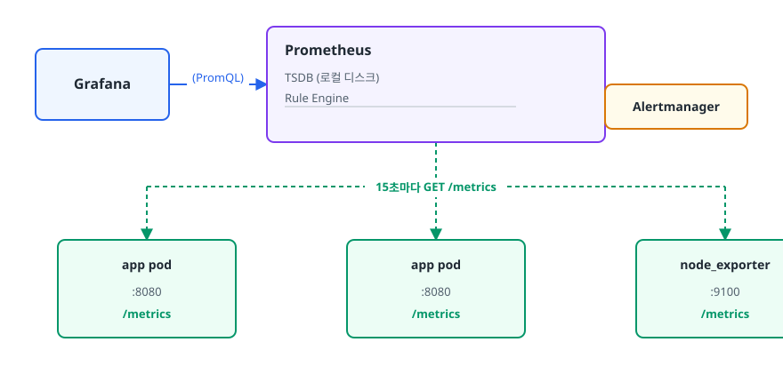
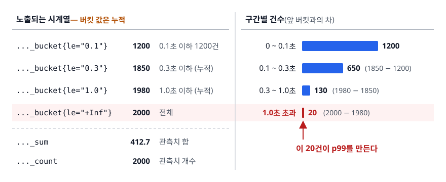

# Prometheus와 Grafana (Metrics Collection & Visualization)

> 메트릭은 타입을 잘못 고르면 거짓말을 합니다. Pull 방식이 왜 표준이 되었는지, 어떤 숫자가 어떻게 어긋나는지, PromQL 한 줄로 에러율과 p99를 뽑아내는 방법을 이 문서에서 설명합니다.

난이도: ⭐⭐

## 학습 목표

- [ ] Pull 방식 수집의 장점과 한계를 설명하고 Pushgateway가 필요한 경우를 판단할 수 있다
- [ ] Counter / Gauge / Histogram / Summary를 상황에 맞게 선택할 수 있다
- [ ] `rate`, `sum by`, `histogram_quantile`을 조합해 에러율과 백분위 지연을 계산할 수 있다
- [ ] Exporter와 서비스 디스커버리로 동적 환경의 타겟을 자동 등록할 수 있다
- [ ] 사람이 실제로 보는 대시보드를 설계할 수 있다

## 선행 지식

- [01-observability-concepts.md](./01-observability-concepts.md) - 메트릭이 어떤 질문에 답하는 데이터인지, 카디널리티가 왜 문제인지

---

## 1. 왜 필요한가

로그만 있는 상태에서 "지난 1시간 동안 주문 API의 에러율"을 구해 보겠습니다. 검색 엔진이 1시간치 로그를
전부 훑고 상태 코드를 파싱해서 세어야 합니다. 수억 줄이면 몇 분이 걸립니다. 이 계산을 15초마다
반복해서 알림을 걸어야 한다면 검색 엔진이 먼저 죽습니다.

메트릭은 이 계산을 **애플리케이션이 미리 해두는 것**입니다. 요청이 실패할 때마다 카운터를 1 올려두면
나중에 "1시간 동안 몇 번 올랐나"만 보면 됩니다. 원본 이벤트를 버리는 대신 집계된 숫자만 남기므로
저장 비용이 수백 분의 일로 줄어듭니다. 초 단위 질의도 가능해집니다.

Prometheus는 이 아이디어를 구현한 시계열 데이터베이스이자 수집기이고, Kubernetes에 이어 두 번째로
CNCF를 졸업한 프로젝트입니다. Grafana는 여러 데이터 소스를 한 화면에서 질의하고 그리는 시각화 도구입니다.
둘은 별개 제품이지만 실무에서는 거의 항상 함께 씁니다.

---

## 2. Pull 방식 수집

### 동작 원리

Prometheus는 **자기가 직접 각 대상에 HTTP 요청을 보내 메트릭을 긁어옵니다(scrape).** 애플리케이션 쪽은
간단합니다. `/metrics` 경로에 현재 값을 텍스트로 노출해두기만 하면 됩니다.

<!-- diagram:cloud-prometheus-grafana-1 -->


<!-- 위 그림이 대체한 원본 ASCII.
     내용을 고칠 때는 그림도 함께 갱신할 것.
```
                    ┌──────────────────────────────┐
    Grafana ───────▶│  Prometheus                  │
    (PromQL)        │   TSDB (로컬 디스크)          │
                    │   Rule Engine ───────────────┼──▶ Alertmanager
                    └──────────────┬───────────────┘
                                   │ 15초마다 GET /metrics
             ┌─────────────────────┼─────────────────────┐
             ▼                     ▼                     ▼
      ┌─────────────┐       ┌─────────────┐       ┌─────────────┐
      │  app pod    │       │  app pod    │       │node_exporter│
      │ :8080       │       │ :8080       │       │ :9100       │
      │ /metrics    │       │ /metrics    │       │ /metrics    │
      └─────────────┘       └─────────────┘       └─────────────┘
```
-->

노출 형식은 사람이 읽을 수 있는 텍스트입니다(OpenMetrics로 표준화되었습니다).

```
# TYPE http_requests_total counter
http_requests_total{method="GET",status="200",handler="/orders"} 48213
http_requests_total{method="POST",status="500",handler="/orders"} 17
```

### Pull이 주는 것

- **타겟 헬스 체크가 공짜입니다.** 스크랩에 실패하면 Prometheus가 `up{job="api"} 0`을 자동 생성합니다.
  Push 방식에서는 "데이터가 안 오는 것"이 인스턴스가 죽은 건지, 네트워크 문제인지, 원래 트래픽이
  없는 건지 구분되지 않습니다.
- **부하를 수집 측이 통제합니다.** 앱이 폭주해서 메트릭을 밀어 넣어 모니터링을 무너뜨리는 일이
  구조적으로 불가능합니다.
- **디버깅이 쉽습니다.** `curl http://localhost:8080/metrics` 한 줄로 지금 이 인스턴스가 무슨 값을
  내보내는지 확인됩니다.

### Pull의 한계와 대응

| 한계 | 왜 문제인가 | 대응 |
|------|-----------|------|
| 단명 작업(배치 잡) | 잡이 끝나면 스크랩할 엔드포인트가 없다 | Pushgateway에 push 후 Prometheus가 그걸 pull |
| 방화벽 뒤 타겟 | Prometheus가 들어갈 수 없는 망 | 해당 망 안에 Prometheus를 두고 remote_write로 중앙 전송 |
| 타겟 목록 관리 | 파드가 수시로 뜨고 죽는다 | 서비스 디스커버리 (5장) |
| 스크랩 주기보다 짧은 사건 | 15초 사이에 발생하고 사라진 스파이크는 안 보임 | Counter/Histogram으로 누적해 사건을 놓치지 않게 설계 |

**Pushgateway는 배치 잡 전용이라고 생각하는 게 안전합니다.** 일반 서비스에 붙이면 앱이 죽어도
값이 남아 헬스 체크 의미가 사라지고, Pushgateway 자체가 단일 장애점이 됩니다.

---

## 3. 메트릭 타입 네 가지

타입 선택은 문법 문제가 아니라 **그 숫자가 나중에 의미 있게 집계될 수 있는가**의 문제입니다.

### Counter — 누적만 증가

요청 수, 에러 수, 처리한 메시지 수처럼 **단조 증가하는 값**을 담습니다. 프로세스가 재시작하면 0으로
리셋되는데, 이는 버그가 아니라 정상 동작이고 `rate()`와 `increase()`가 알아서 보정합니다.
그래서 **절대값은 거의 의미가 없습니다.** 인스턴스마다 재시작 시점이 달라 비교할 수 없으므로
항상 `rate()`로 변화량을 봅니다.

### Gauge — 오르내리는 현재 상태

현재 메모리 사용량, 큐 길이, 활성 커넥션 수, 대기 중인 스레드 수가 여기에 들어갑니다. 모두 **지금 이 순간의 값**입니다.
에러 수를 Gauge로 만들어 "최근 값"을 넣어두면 스크랩 사이에 발생한 에러가 통째로 사라집니다.
**"놓치면 안 되는 사건은 Counter, 현재 상태는 Gauge"** 가 판단 기준입니다.

### Histogram — 분포를 버킷으로

응답 시간처럼 **분포를 알아야 하는 값**에 씁니다. 미리 정한 경계값(bucket)마다 "그 이하인 관측치가 몇
개였나"를 누적 카운터로 셉니다.

<!-- diagram:cloud-prometheus-grafana-2 -->


<!-- 위 그림이 대체한 원본 ASCII.
     내용을 고칠 때는 그림도 함께 갱신할 것.
```
 ..._bucket{le="0.1"}   1200   ← 0.1초 이하 1200건       0 ─ 0.1초 ████████████ 1200
 ..._bucket{le="0.3"}   1850   ← 0.3초 이하 (누적)     0.1 ─ 0.3초 ██████        650
 ..._bucket{le="1.0"}   1980                          0.3 ─ 1.0초 ██            130
 ..._bucket{le="+Inf"}  2000   ← 전체                   1.0초 초과 ▌              20
 ..._sum               412.7   ← 관측치 합                          ▲
 ..._count              2000   ← 관측치 개수              이 20건이 p99를 만든다
```
-->

버킷이 **누적(cumulative)** 이라는 점이 핵심입니다. `le="0.3"`은 "0.1~0.3 사이"가 아니라 "0.3 이하
전부"입니다. 이 구조 덕분에 여러 인스턴스의 버킷을 그냥 더할 수 있고, 그래서 **여러 파드를 합친
전체 p99를 서버에서 계산할 수 있습니다.** 대신 버킷 경계는 직접 정해야 합니다. SLO가 200ms인데 경계가
`0.1, 0.5`뿐이면 p95를 보간으로 추정할 뿐이라 정확도가 크게 떨어집니다.

### Summary — 클라이언트가 계산한 분위수

애플리케이션 안에서 직접 분위수를 계산해 `http_request_duration_seconds{quantile="0.99"} 1.42`
형태로 노출합니다.

**치명적 한계는 합산이 불가능하다는 것입니다.** 파드 A의 p99가 1.4초, 파드 B가 0.9초일 때 전체
p99는 알 수 없습니다. 백분위수는 평균 낼 수 없기 때문입니다. 파드가 여러 개인 환경에서 Summary를
쓰면 "전체 서비스의 p99"를 영원히 구할 수 없게 됩니다.

### 선택 기준

| 타입 | 쓰는 경우 | 잘못 고르면 | 여러 인스턴스 합산 |
|------|---------|-----------|-----------------|
| Counter | 요청 수, 에러 수, 이벤트 발생 횟수 | Gauge로 쓰면 스크랩 사이 사건 유실 | 가능 (`sum(rate(...))`) |
| Gauge | 큐 길이, 메모리, 커넥션 수 | Counter로 쓰면 rate가 무의미 | 가능 (`sum`, `avg`) |
| Histogram | 응답 시간, 요청 크기 분포 | 버킷 경계를 SLO와 안 맞추면 정밀도 손실 | **가능** (핵심 장점) |
| Summary | 단일 인스턴스, 정확한 분위수가 필요 | 파드 여러 개면 전체 p99 계산 불가 | **불가능** |

**분산 환경이면 Summary 대신 Histogram이 기본값입니다.** Summary는 인스턴스가 하나이거나
버킷 경계를 미리 정할 수 없는 특수한 경우에만 고려합니다.

### 계측 코드 예시 (Java / Micrometer)

```java
Counter.builder("orders_created_total")
       .tag("channel", channel)        // web, app, api → 값이 유한한 것만 태그로
       .register(registry).increment();

Gauge.builder("order_queue_size", queue, Queue::size).register(registry);

Timer timer = Timer.builder("order_process_duration_seconds")
                   .publishPercentileHistogram()   // _bucket 시리즈 생성
                   .register(registry);
timer.record(() -> orderService.process(order));
```

`tag("userId", userId)` 같은 코드가 리뷰에서 걸러지지 않으면 카디널리티가 그대로 폭발합니다.
태그 값이 유한한지 코드 리뷰 체크리스트에 넣어두는 게 실무에서 통하는 방어책입니다.

---

## 4. PromQL

### 기본 문법 세 가지

**`rate()` — Counter의 초당 증가율.** 대괄호 안은 되돌아볼 시간 범위입니다.

```promql
rate(http_requests_total[5m])
```

"최근 5분 구간에서 초당 평균 몇 건 증가했나"를 계산합니다. 구간 안에 최소 두 개의 샘플이 있어야
하므로 **범위는 스크랩 주기의 4배 이상**으로 잡는 게 안전합니다. 스크랩이 15초면 여유 있게 `[5m]`을
씁니다. 인스턴스 하나가 잠깐 스크랩에 실패해도 값이 비지 않습니다.

**`sum by ()` — 필요한 차원만 남기고 합산.**

```promql
sum by (handler) (rate(http_requests_total[5m]))
```

파드별로 흩어진 시계열을 handler 기준으로 합칩니다. `by`는 남길 라벨을, `without`은 버릴 라벨을
지정합니다. 파드 라벨을 지워야 오토스케일링으로 파드가 바뀌어도 그래프가 끊기지 않습니다.

**`histogram_quantile()` — 버킷에서 백분위 계산.**

```promql
histogram_quantile(0.99,
  sum by (le, handler) (rate(http_request_duration_seconds_bucket[5m])))
```

`by (le, ...)`에서 `le`를 반드시 남겨야 합니다. `le`는 버킷 경계를 나타내는 라벨이라 지우면
분포 정보가 사라져 계산 자체가 불가능해집니다. PromQL 입문자가 가장 자주 겪는 함정입니다.

### 실전 쿼리

```promql
# 1. 서비스별 5xx 에러율 (0~1 비율)
sum by (service) (rate(http_requests_total{status=~"5.."}[5m]))
  /
sum by (service) (rate(http_requests_total[5m]))

# 2. SLO 관점의 지연 준수율 — 300ms 이내 응답 비율
sum(rate(http_request_duration_seconds_bucket{le="0.3"}[5m]))
  /
sum(rate(http_request_duration_seconds_count[5m]))

# 3. 응답 시간이 급증한 상위 엔드포인트 찾기
topk(5,
  histogram_quantile(0.99,
    sum by (le, handler) (rate(http_request_duration_seconds_bucket[5m]))
  )
)

up == 0    # 4. 스크랩이 안 되는 타겟 (인스턴스 다운)
```

### Recording Rule — 무거운 쿼리 미리 계산

대시보드에서 매번 무거운 쿼리를 돌리면 Prometheus가 느려집니다. 자주 쓰는 표현식은 미리 계산해
새 메트릭으로 저장합니다.

```yaml
groups:
  - name: api-recording
    interval: 30s
    rules:
      - record: service:http_errors:ratio5m
        expr: |
          sum by (service) (rate(http_requests_total{status=~"5.."}[5m]))
            /
          sum by (service) (rate(http_requests_total[5m]))

  - name: api-alert
    rules:
      - alert: ApiHighErrorRate
        expr: service:http_errors:ratio5m{service="order-api"} > 0.01
        for: 10m                     # 10분 연속 참이어야 발화 (순간 스파이크 차단)
        labels:
          severity: critical
          team: order
        annotations:
          summary: "order-api 5xx 비율 {{ $value | humanizePercentage }}"
          runbook_url: "https://wiki.example.com/runbook/order-api-5xx"
```

이름 규칙은 `수준:메트릭:연산` 형태를 관례로 씁니다. 대시보드와 알림 규칙이 모두
`service:http_errors:ratio5m` 하나만 참조하면 되므로 쿼리 중복이 사라집니다. 정의를 고칠 때도
한 군데만 고치면 됩니다. `for` 절 없이 알림을 만들면 순간 스파이크 하나에 새벽 3시 호출이 울립니다.

---

## 5. Exporter와 서비스 디스커버리

### Exporter — 메트릭을 못 내보내는 대상 감싸기

PostgreSQL, Redis, Nginx는 Prometheus 형식으로 메트릭을 내보내지 않습니다. Exporter는 그 대상의
네이티브 인터페이스로 상태를 물어본 뒤 Prometheus 형식으로 번역하는 작은 프로세스입니다.

| Exporter | 대상 | 대표 지표 |
|----------|------|----------|
| node_exporter | 리눅스 호스트 | CPU, 메모리, 디스크, 네트워크 |
| cAdvisor | 컨테이너 | 컨테이너별 CPU/메모리 사용량 |
| kube-state-metrics | Kubernetes 오브젝트 | Deployment 원하는/실제 레플리카 수, Pod 상태 |
| blackbox_exporter | 외부 엔드포인트 | HTTP 응답 코드, TLS 인증서 만료일, 지연 |
| postgres_exporter | PostgreSQL | 커넥션 수, 락 대기, 복제 지연 |

**cAdvisor와 kube-state-metrics는 역할이 다릅니다.** cAdvisor는 "이 컨테이너가 실제로 CPU를 얼마나
쓰나"(실측)를, kube-state-metrics는 "레플리카 3개를 원하는데 2개만 Ready다"(선언 상태와 실제
상태의 차이)를 알려줍니다. 둘 다 필요합니다.

### 서비스 디스커버리 — 사라지는 타겟 따라가기

파드가 수시로 생성·삭제되는 환경에서 타겟 IP를 설정 파일에 적어둘 수는 없습니다. Prometheus는
Kubernetes API, EC2 API, Consul 등에 물어봐서 타겟 목록을 갱신합니다.

```yaml
scrape_configs:
  - job_name: 'kubernetes-pods'
    kubernetes_sd_configs:
      - role: pod
    relabel_configs:
      # 어노테이션이 붙은 파드만 스크랩
      - source_labels: [__meta_kubernetes_pod_annotation_prometheus_io_scrape]
        action: keep
        regex: "true"
      # 네임스페이스를 라벨로 승격
      - source_labels: [__meta_kubernetes_namespace]
        action: replace
        target_label: namespace
```

`relabel_configs`는 **스크랩하기 전에** 타겟 목록을 가공하는 단계로, `keep`/`drop`으로 대상을
거르고 `replace`로 라벨을 붙입니다. 카디널리티가 터졌을 때 계측 코드 배포 없이 즉시 막을 수 있는
곳도 여기입니다. `metric_relabel_configs`의 `drop`으로 특정 메트릭을 저장 직전에 버리면 됩니다.

---

## 6. Grafana 대시보드 설계 원칙

Grafana를 처음 쓰면 패널을 40개쯤 만들게 되고, 그 대시보드는 장애 때 아무도 보지 않습니다. **하나의 대시보드는 하나의 질문에 답합니다.** "서비스가 건강한가?"와 "왜 느린가?"는 다른
대시보드입니다. 앞의 것은 RED 지표만으로 한 화면에 끝나야 하고, 뒤의 것은 GC·커넥션 풀·캐시
히트율 같은 원인 지표를 잔뜩 담아도 됩니다.

**위에서 아래로 증상 → 원인 순서.** 맨 위는 사용자가 느끼는 것(에러율, p99, 처리량), 그 아래는
의존성(DB·외부 API 지연), 맨 아래가 인프라(CPU, 메모리)입니다.

**템플릿 변수로 대시보드를 재사용합니다.** 서비스마다 복사하면 개선이 한쪽에만 반영됩니다.
쿼리에서 `{service="$service"}`처럼 변수를 참조하면 하나로 전 서비스를 커버할 수 있습니다.

**패널마다 "그래서 뭘 해야 하나"가 있어야 합니다.** 해석 방법을 모르는 패널은 지웁니다. 설명란에
"이 값이 X를 넘으면 Y를 확인"을 적어두면 새벽에 호출받은 사람이 살아납니다. 단위 지정도 기본입니다.
단위 없는 `0.234`는 234ms인지 234초인지 알 수 없습니다.

---

## 7. 장애 시나리오로 보는 실전 흐름

> **상황** — 새벽 2시, `ApiHighErrorRate` 알림. 주문 API의 5xx가 0.1%에서 3%로 올랐습니다.

**1) 영향 범위와 에러의 성격 판별**

```promql
sum by (handler) (rate(http_requests_total{service="order-api",status=~"5.."}[5m]))
histogram_quantile(0.99,
  sum by (le) (rate(http_request_duration_seconds_bucket{handler="/orders/checkout"}[5m])))
```

결과를 보면 `/orders/checkout` 하나만 튀고 나머지 핸들러는 정상입니다. 전면 장애가 아니라 특정 경로 문제라는 뜻입니다.
그 경로의 p99는 180ms에서 3.0s로 올랐습니다. **에러와 지연이 함께 올랐다면 타임아웃 계열**입니다. 지연 변화 없이
에러만 늘었다면 로직 오류나 검증 실패 쪽을 먼저 의심합니다.

**2) 포화 지표와 원인 후보 확인**

```promql
hikaricp_connections_active / hikaricp_connections_max   # 커넥션 풀 사용률
hikaricp_connections_pending                             # 대기 스레드 = 포화도
changes(process_start_time_seconds{service="order-api"}[30m])   # 재시작 여부
histogram_quantile(0.99, sum by (le) (rate(db_query_duration_seconds_bucket[5m])))
```

결과를 보면 사용률은 1.0에 고정이고 대기 스레드는 40, DB 쿼리 p99는 정상입니다. 사용률만 봤다면 "100%니까 바쁘네"에서
멈췄겠지만, 대기 수 40이 심각도를 알려 줍니다. **DB는 멀쩡한데 풀만 고갈이면 커넥션을 잡은 채
외부 호출을 하고 있을 가능성**이 높습니다.

**3) 대응 순서**

복구가 원인 규명보다 먼저입니다. 직전 배포가 있었다면 롤백, 없었다면 문제 경로 차단으로 우선
지혈합니다. 원인 분석은 서비스가 정상으로 돌아온 뒤에 합니다. 이때 쓴 PromQL을 그대로 Runbook에
적어두면 다음 사람이 같은 길을 다시 헤매지 않습니다.

---

## 8. 실무에서는

**장기 보관** — 로컬 TSDB는 수 주 단위 보관을 전제로 설계되어 있습니다. 더 길게 보려면 `remote_write`
또는 완성된 블록을 업로드하는 방식으로 Thanos, Grafana Mimir, VictoriaMetrics 같은 장기 저장소에
넘깁니다. 이 계층은 오브젝트 스토리지를 쓰기 때문에 저장 단가가 크게 낮아집니다.

**고가용성** — Prometheus는 클러스터링을 지원하지 않습니다. 동일 설정의 인스턴스를 두 대 띄워
같은 타겟을 각자 스크랩하게 하는 게 표준 패턴이고, 중복 알림은 Alertmanager가 묶어줍니다.

**Alertmanager** — 발화한 알림을 받아 그룹핑·억제·라우팅·무음 처리를 담당합니다. **알림 규칙은
Prometheus에, 전달 정책은 Alertmanager에** 있다는 역할 분리를 기억해야 합니다. 자세한 설계는
[05-alerting-oncall.md](./05-alerting-oncall.md)에서 다룹니다.

**관리형 서비스** — AWS에서는 Amazon Managed Service for Prometheus와 Amazon Managed Grafana를
쓸 수 있습니다. 과금은 **수집한 샘플 수, 저장 중인 데이터 양, 질의가 처리한 샘플 수** 축으로
구성됩니다. 여기서도 카디널리티가 청구서를 결정합니다. 라벨 하나 잘못 넣으면 세 항목이 동시에 오릅니다.

**Prometheus를 쓰면 안 되는 곳** — 청구나 정산처럼 **한 건도 놓치면 안 되는 데이터**에는 쓰지
않습니다. 스크랩 기반이라 구조적으로 100% 정확성을 보장하지 않습니다. 그런 데이터는 이벤트 로그나
트랜잭션 DB로 다뤄야 합니다.

---

## 9. 면접 포인트

> 면접에서 이 주제가 나오면 이렇게 답한다

**Q. Prometheus가 Pull 방식을 쓰는 이유는 무엇인가요?**

A. 가장 큰 이유는 타겟의 생사 판단이 수집 메커니즘에 내장된다는 점입니다. 스크랩에 실패하면
`up` 메트릭이 0이 되므로 별도 헬스 체크 없이 다운을 감지할 수 있습니다. 또 수집 측이 주기를
통제하므로 애플리케이션 폭주가 모니터링 시스템을 무너뜨리지 못하고, `/metrics`를 curl로 직접
확인할 수 있어 디버깅이 쉽습니다. 대신 배치 잡처럼 수명이 짧은 작업은 스크랩할 대상이 남지
않아 Pushgateway 같은 보조 장치가 필요합니다.

- 꼬리 질문: "Pushgateway를 모든 서비스에 쓰면 안 되나요?" → Pushgateway는 값을 계속 보관하므로
  앱이 죽어도 메트릭이 남아 헬스 체크 의미가 사라지고, 단일 장애점이 된다고 답합니다.

**Q. Histogram과 Summary 중 무엇을 쓰겠습니까?**

A. 인스턴스가 여러 개인 환경이면 Histogram입니다. Summary는 각 인스턴스가 자체적으로 분위수를
계산해 노출하는데, 백분위수는 여러 인스턴스에 걸쳐 합산할 수 없어서 서비스 전체의 p99를 구할
방법이 없습니다. Histogram은 버킷이 누적 카운터라 그냥 더한 뒤 `histogram_quantile`로 전체
분위수를 계산할 수 있습니다. 대신 버킷 경계를 SLO 임계값 근처에 맞춰 미리 정해야 정확도가 나옵니다.

- 꼬리 질문: "버킷을 촘촘히 많이 두면 되지 않나요?" → 버킷 하나가 시계열 하나이므로 버킷 수가
  곧 카디널리티입니다. SLO 임계값 주변만 촘촘히 두는 게 현실적인 절충이라고 답합니다.

**Q. `rate(x[5m])`에서 5분은 어떤 기준으로 정하나요?**

A. 스크랩 주기의 최소 4배 정도를 잡습니다. 구간 안에 샘플이 최소 두 개는 있어야 증가율을 계산할
수 있는데, 스크랩이 한두 번 실패해도 값이 비지 않으려면 여유가 필요하기 때문입니다. 반대로
너무 길게 잡으면 급격한 변화가 평탄화되어 반응이 늦어집니다. 스크랩 15초 기준으로 알림에는
`[5m]`, 세밀한 조사에는 `[1m]` 정도를 쓰는 게 일반적입니다.

- 꼬리 질문: "`irate`는 언제 쓰나요?" → `irate`는 마지막 두 샘플만 보므로 변화에 민감합니다.
  그래프에서 순간 변화를 볼 때는 유용하지만 노이즈가 커서 알림에는 부적합하다고 답합니다.

---

## 자주 하는 실수

| 실수 | 왜 틀렸나 | 올바른 이해 |
|------|----------|-----------|
| Counter 값을 그대로 그래프에 그림 | 프로세스 시작 이후 누적이라 재시작마다 0으로 떨어진다 | `rate()`/`increase()`로 변화량을 본다 |
| `histogram_quantile`에서 `le`를 집계로 지움 | 버킷 경계 정보가 사라져 분위수 계산 자체가 불가능 | `sum by (le, ...)`로 `le`를 반드시 남긴다 |
| 여러 파드의 p99를 평균냄 | 백분위수는 산술 평균이 성립하지 않는다 | 버킷을 먼저 합산한 뒤 분위수를 계산한다 |
| 에러 수를 Gauge로 기록 | 스크랩 사이에 발생하고 리셋된 에러가 통째로 사라진다 | 누락되면 안 되는 사건은 Counter |
| `for` 절 없이 알림 규칙 작성 | 순간 스파이크마다 호출이 울려 알림 피로가 쌓인다 | 지속 시간을 두어 일시적 튐을 걸러낸다 |
| 라벨에 요청 URL을 원본 그대로 사용 | 경로에 박힌 ID가 전부 별개 시계열이 된다 | 라우트 템플릿(`/orders/{id}`)으로 정규화 |
| 대시보드를 서비스마다 복사 | 개선이 한쪽에만 반영되어 금세 어긋난다 | 템플릿 변수로 하나의 대시보드를 재사용 |

---

## 한 줄 정리

Prometheus는 **Pull로 긁어와 라벨로 나눈 시계열**을 쌓는 도구이고, 그 위에서 유용한 답을 얻는
능력은 **메트릭 타입을 옳게 고르고 `rate`·`sum by`·`histogram_quantile`을 조합하는 문법**에서 나옵니다.

---

## 연관 개념

- [01-observability-concepts.md](./01-observability-concepts.md) - 카디널리티와 USE/RED 방법론
- [03-logging-stack.md](./03-logging-stack.md) - 메트릭으로 좁힌 뒤 원인을 확인하는 로그 계층
- [04-distributed-tracing.md](./04-distributed-tracing.md) - 서비스 경계 간 지연을 분해하는 방법
- [05-alerting-oncall.md](./05-alerting-oncall.md) - Alertmanager 라우팅과 알림 설계
- [qna-monitoring.md](./qna-monitoring.md) - 이 주제 면접 질문 모음
- [../kubernetes/qna-kubernetes.md](../kubernetes/qna-kubernetes.md) - kube-state-metrics가 노출하는 오브젝트 상태의 배경
- [../practical-scenarios/qna-troubleshooting.md](../practical-scenarios/qna-troubleshooting.md) - 커넥션 풀 고갈 등 장애 진단 시나리오
