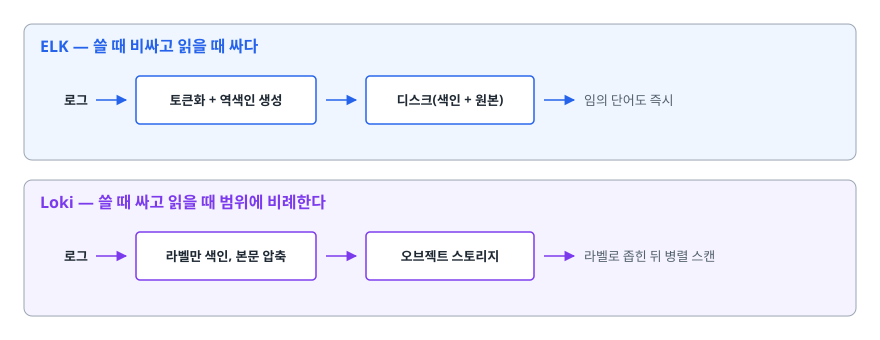
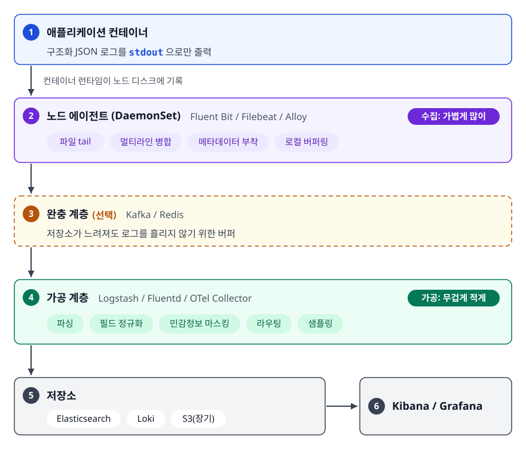
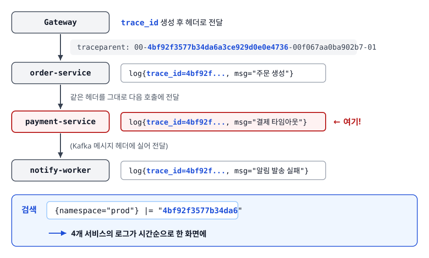

# 로깅 스택 (Logging Stack)

> 이 문서는 로그 스택의 설계를 다룹니다. 왜 로그를 JSON으로 찍는지, 전문 색인과 라벨 색인의 설계 차이가 비용을 어떻게 가르는지, 요청 하나의 로그를 여러 서비스에서 한 번에 모으는 방법을 설명합니다. 메트릭과 트레이스는 다른 문서 몫입니다.

난이도: ⭐⭐

## 학습 목표

- [ ] 비정형 로그의 한계를 설명하고 구조화 로깅으로 전환할 수 있다
- [ ] 로그 레벨을 일관된 기준으로 나눌 수 있다
- [ ] ELK/EFK와 Loki의 색인 설계 차이가 비용과 검색 성능에 미치는 영향을 설명할 수 있다
- [ ] 수집 파이프라인의 각 단계에서 무엇이 실패할 수 있는지 안다
- [ ] 보관 정책과 민감정보 마스킹을 설계할 수 있다
- [ ] 상관관계 ID를 서비스와 스레드 경계 너머로 전파할 수 있다

## 선행 지식

- [01-observability-concepts.md](./01-observability-concepts.md) - 로그가 3대 축에서 맡는 역할

---

## 1. 왜 필요한가

로그는 개발자가 가장 먼저 배우는 관측 수단입니다. `System.out.println`부터 시작해서, 서버가 한 대일 때는 `tail -f`와 `grep`만으로 충분히 돌아갑니다.

이 방식이 무너지는 지점은 세 가지입니다.

**컨테이너는 로그를 보관하지 않습니다.** 파드가 재시작되면 그 안의 로그 파일은 사라집니다. OOM으로 죽은 파드의 마지막 순간을 봐야 하는데 바로 그 파드가 없습니다.

**로그가 30대에 흩어집니다.** "결제 실패했다"는 제보를 받아도 어느 서버가 그 요청을 처리했는지 알 방법이 없어 30대를 각각 뒤져야 합니다.

**grep으로 답할 수 없는 질문이 생깁니다.** "지난 1시간 동안 결제 실패를 겪은 사용자 수는?" 텍스트 문자열에는 이런 질문에 답할 구조가 없습니다.

로깅 스택은 이 세 문제에 답합니다. 로그를 **중앙에 모으고(수집), 질의 가능한 형태로 만들고(구조화), 비용을 감당 가능한 수준으로 통제합니다(보관 정책).**

---

## 2. 비정형 로그의 한계와 구조화 로깅

### 문자열 로그가 만드는 문제

```
2026-03-14 10:23:15.412 ERROR [order-service] Failed to charge user john for order 8821: timeout after 3000ms
```

사람이 읽기엔 완벽합니다. 하지만 기계에게는 그냥 한 줄의 문자열입니다. "특정 사용자의 실패만" 찾으려면 정규식을 짜야 하고, 그 정규식은 로그 문구를 한 번만 바꿔도 조용히 깨집니다. 누군가 `Failed to charge`를 `Payment failed`로 리팩터링하는 순간 대시보드가 0을 표시하는데, 그게 코드 변경 때문인지 진짜로 에러가 사라진 건지 아무도 모릅니다. 수집 단계에서 **grok 패턴**으로 파싱하는 전통적 해법은 **로그를 쓰는 쪽과 읽는 쪽 사이에 문서화되지 않은 계약**을 만들 뿐입니다.

### 구조화 로깅

애플리케이션이 처음부터 기계가 읽을 수 있는 형태로 찍습니다.

```json
{
  "timestamp": "2026-03-14T10:23:15.412Z", "level": "ERROR",
  "service": "order-service",
  "message": "payment charge failed",
  "event": "payment.charge.failed",
  "order_id": "8821", "user_id": "u_1902", "merchant_id": "m_44",
  "error_type": "TimeoutException", "duration_ms": 3000,
  "trace_id": "4bf92f3577b34da6a3ce929d0e0e4736"
}
```

이제 `error_type: TimeoutException AND merchant_id: m_44`처럼 필드 기준으로 질의할 수 있고, 메시지 문구를 바꿔도 `event` 필드가 그대로면 아무것도 깨지지 않습니다. **핵심은 JSON 포맷 자체가 아니라 "안정적인 필드 이름"이라는 계약입니다.** 사람을 위한 `message`와 기계를 위한 `event`를 분리해야 로그 문구를 자유롭게 개선하면서도 검색과 알림이 안 깨집니다.

```java
// Logback + logstash-logback-encoder
log.error("payment charge failed",
    kv("event", "payment.charge.failed"),
    kv("order_id", orderId),
    kv("merchant_id", merchantId),
    kv("error_type", e.getClass().getSimpleName()),
    kv("duration_ms", elapsed),
    e);   // 예외는 마지막 인자로 → 스택 트레이스가 별도 필드로 들어간다
```

### 구조화 로깅의 함정

**필드 이름을 자유롭게 만들면 색인이 폭발합니다.** Elasticsearch는 새 필드가 보이면 자동으로 매핑을 만드는데, 서비스마다 `userId` / `user_id` / `uid`를 제각각 쓰면 필드가 수천 개로 늘어납니다. 인덱스당 필드 수에는 상한이 있고 넘으면 색인 자체가 거부됩니다. 그래서 실무에서는 **공통 필드 스키마를 문서로 고정합니다.** OpenTelemetry의 의미 규약(Semantic Conventions)이나 Elastic Common Schema(ECS) 같은 기존 표준을 채택하면 이 논쟁을 건너뛸 수 있습니다.

---

## 3. 로그 레벨 기준

로그 레벨이 팀마다 제각각이면 "ERROR만 알림 보내기" 같은 정책이 성립하지 않습니다. 판단 기준은 심각도가 아니라 **"누가 이걸 보고 무엇을 하는가"** 여야 합니다.

| 레벨 | 의미 | 판단 기준 | 예시 |
|------|------|----------|------|
| ERROR | 사람이 개입해야 하는 실패 | 이 로그가 쌓이면 누군가 조사해야 하는가? | DB 연결 실패, 데이터 정합성 위반, 처리 불가 메시지 |
| WARN | 지금은 버텼지만 이상한 상황 | 지금 괜찮지만 반복되면 위험한가? | 재시도 후 성공, 폴백 동작, 설정 기본값 사용 |
| INFO | 시스템의 주요 상태 변화 | 나중에 타임라인을 재구성할 때 필요한가? | 애플리케이션 기동, 배포된 버전, 스케줄 잡 시작·완료 |
| DEBUG | 개발자가 흐름을 추적할 때 | 운영에서 항상 켜두면 비용이 감당되는가? | 분기 조건, 중간 계산 결과 |
| TRACE | 극단적으로 상세한 추적 | 특정 문제 재현 중에만 켤 것인가? | 루프 내부, 바이트 단위 처리 |

두 가지 원칙이 실무 품질을 가릅니다.

**첫째, 사용자 입력 오류는 ERROR가 아닙니다.** 잘못된 요청 형식으로 400을 반환한 건 시스템이 설계대로 동작한 것입니다. 이걸 ERROR로 찍으면 진짜 ERROR가 노이즈에 묻힙니다. 400대는 INFO나 DEBUG, 500대만 ERROR가 기본 원칙입니다.

**둘째, 운영 기본 레벨은 INFO이되 런타임에 바꿀 수 있어야 합니다.** 문제가 터졌을 때 DEBUG를 켜려고 재배포해야 한다면 이미 늦습니다.

```bash
# Spring Boot Actuator — 특정 패키지만 런타임에 DEBUG로 전환
curl -X POST http://localhost:8080/actuator/loggers/com.example.payment \
     -H 'Content-Type: application/json' -d '{"configuredLevel":"DEBUG"}'
```

---

## 4. 전문 색인 vs 라벨 색인 — ELK와 Loki의 설계 차이

두 스택은 기능 목록으로 갈리지 않습니다. **"무엇을 미리 색인해둘 것인가"** 라는 한 가지 결정에서 나머지 차이가 전부 나옵니다.

### ELK / EFK — 로그 본문 전체를 색인한다

Elasticsearch는 로그를 받으면 본문을 토큰으로 쪼개고 **역색인(inverted index)** 을 만듭니다. "timeout"이라는 단어가 어느 문서에 있는지 미리 표로 만들어두는 것입니다. 덕분에 수 TB 안에서 임의의 단어를 밀리초 단위로 찾습니다.

대가는 쓰기 시점에 지불됩니다. 색인 구조가 원본 로그보다 커지는 경우도 흔하고, 색인 작업 자체가 CPU와 메모리를 많이 씁니다. **로그가 늘어나면 저장 비용과 색인 비용이 함께 오릅니다.**

### Loki — 라벨만 색인하고 본문은 압축해 던져둔다

Loki는 정반대 선택을 했습니다. 색인하는 건 `{app="order-service", namespace="prod", level="error"}` 같은 **라벨 몇 개뿐**이고, 로그 본문은 압축해서 오브젝트 스토리지(S3 등)에 청크로 저장합니다.

검색은 두 단계입니다. 먼저 라벨로 후보 청크를 좁히고, 그 청크들을 **병렬로 압축 해제하며 훑습니다**. 사실상 분산 grep입니다. 색인이 없으니 저장 비용이 낮습니다. 대신 **라벨로 좁히지 못하면 느립니다.**

<!-- diagram:cloud-logging-stack-1 -->


<!-- 위 그림이 대체한 원본 ASCII.
     내용을 고칠 때는 그림도 함께 갱신할 것.
```
ELK — 쓸 때 비싸고 읽을 때 싸다
  로그 ──▶ [토큰화 + 역색인 생성] ──▶ 디스크(색인 + 원본)  →  임의 단어도 즉시

Loki — 쓸 때 싸고 읽을 때 범위에 비례한다
  로그 ──▶ [라벨만 색인, 본문 압축] ──▶ 오브젝트 스토리지  →  라벨로 좁힌 뒤 병렬 스캔
```
-->

### 비교

| 항목 | ELK / EFK | Loki |
|------|-----------|------|
| 색인 대상 | 로그 본문 전체 | 스트림 라벨만 |
| 저장 비용 | 높음 (색인이 원본만큼 커질 수 있음) | 낮음 (압축 + 오브젝트 스토리지) |
| 임의 단어 검색 | 매우 빠름 | 스캔 범위에 비례 |
| 라벨 기반 검색 | 빠름 | 매우 빠름 |
| 운영 난이도 | 높음 (샤드, 힙, ILM 튜닝) | 낮음 |
| 강점 | 복잡한 집계, 전문 검색, 보안 분석 | 대량 로그의 저비용 보관, Grafana 통합 |
| 카디널리티 위험 | 필드 수 폭발(매핑 폭발) | 스트림 수 폭발 |

**"이미 어디서 찾을지 아는 로그"가 대부분이면 Loki, "어디 있는지 모르는 것을 찾아야 하면" ELK입니다.** Kubernetes처럼 네임스페이스·앱 라벨이 자연스럽게 붙는 곳에서는 Loki의 라벨 색인이 잘 맞고, 보안 감사나 포렌식처럼 임의 조건으로 훑어야 하는 용도에는 Elasticsearch가 여전히 강합니다.

**주의할 점은 Loki에도 카디널리티 문제가 그대로 있다는 것입니다.** 라벨 조합 하나가 스트림 하나이므로 `trace_id`나 `pod_ip`를 라벨로 붙이면 스트림이 수백만 개가 되어 Loki가 무너집니다. `trace_id`는 로그 본문 안에 두고 `|= "4bf92f..."` 같은 라인 필터로 검색합니다.

---

## 5. 수집 파이프라인

<!-- diagram:cloud-logging-stack-2 -->


<!-- 위 그림이 대체한 원본 ASCII.
     내용을 고칠 때는 그림도 함께 갱신할 것.
```
┌──────────────────────────────────────────────────────────────┐
│ 애플리케이션 컨테이너                                          │
│   구조화 JSON 로그를 stdout 으로만 출력                        │
└───────────────────────┬──────────────────────────────────────┘
                        │ 컨테이너 런타임이 노드 디스크에 기록
                        ▼
┌──────────────────────────────────────────────────────────────┐
│ 노드 에이전트 (DaemonSet)  Fluent Bit / Filebeat / Promtail   │
│   파일 tail · 멀티라인 병합 · 메타데이터 부착 · 로컬 버퍼링    │
└───────────────────────┬──────────────────────────────────────┘
                        ▼  (선택) 완충 계층
┌──────────────────────────────────────────────────────────────┐
│ Kafka / Redis — 저장소가 느려져도 로그를 흘리지 않기 위한 버퍼 │
└───────────────────────┬──────────────────────────────────────┘
                        ▼
┌──────────────────────────────────────────────────────────────┐
│ 가공 계층  Logstash / Fluentd / OTel Collector                │
│   파싱 · 필드 정규화 · 민감정보 마스킹 · 라우팅 · 샘플링       │
└───────────────────────┬──────────────────────────────────────┘
                        ▼
   저장소 Elasticsearch / Loki / S3(장기)  ──▶  Kibana / Grafana
```
-->

### 각 단계의 설계 포인트

**애플리케이션은 stdout에만 씁니다.** 파일에 직접 쓰면 로테이션, 디스크 풀, 권한 문제를 앱이 떠안습니다. 컨테이너 환경에서 stdout은 런타임이 관리하고, 에이전트가 그걸 읽어갑니다.

**멀티라인 병합은 에이전트의 일입니다.** Java 스택 트레이스는 한 사건인데 수십 줄로 출력됩니다. "타임스탬프로 시작하지 않는 줄은 이전 줄에 이어 붙인다" 같은 규칙이 없으면 한 예외가 40개의 별개 로그로 저장됩니다. JSON으로 찍으면 스택 트레이스가 한 필드에 들어가 이 문제가 사라집니다.

**버퍼링 지점을 명확히 합니다.** 저장소가 느려질 때 어디에 쌓일지 정해두지 않으면 에이전트 메모리가 차거나 로그가 조용히 버려집니다. 에이전트의 로컬 파일 버퍼를 켜고, 트래픽이 크면 Kafka 같은 완충 계층을 둡니다.

**Logstash와 Fluent Bit의 역할은 다릅니다.** Fluent Bit(또는 Filebeat)은 C/Go로 작성된 경량 수집기라 모든 노드에 DaemonSet으로 띄우기 적합하고, Logstash·Fluentd는 무겁지만 변환 기능이 풍부해 중앙에 소수만 둡니다. **"수집은 가볍게 많이, 가공은 무겁게 적게"** 가 표준 구성입니다.

---

## 6. 보관 정책과 민감정보

### 보관 정책 — 비용은 세 곱이다

로그 비용은 **수집량 × 보관 기간 × 검색 빈도**로 결정됩니다. 이 셋을 각각 따로 설계해야 합니다.

| 계층 | 보관 기간 예시 | 저장 형태 | 용도 |
|------|--------------|----------|------|
| Hot | 최근 며칠 | 빠른 디스크, 색인 있음 | 장애 대응, 실시간 검색 |
| Warm | 몇 주 | 느린 디스크, 색인 유지 | 최근 이슈 추적 |
| Cold / Archive | 몇 달~수 년 | 오브젝트 스토리지, 압축 | 감사, 규제 대응 |
| Delete | 이후 | — | 자동 삭제 |

Elasticsearch는 ILM(Index Lifecycle Management)으로 이 전환을 자동화하고, Loki는 오브젝트 스토리지의 라이프사이클 정책과 자체 보관 설정으로 처리합니다. 어느 쪽이든 **"기본값은 짧게, 필요한 것만 길게"** 가 원칙입니다. 규제 때문에 1년을 보관해야 하는 건 대개 접근 감사 로그이지 디버그 로그가 아닙니다. 이 둘을 다른 인덱스/스트림으로 분리해야 정책을 따로 걸 수 있습니다.

AWS CloudWatch Logs도 같은 구조입니다. **수집한 데이터 양, 보관 중인 데이터 양, 쿼리가 스캔한 데이터 양**이 각각 과금됩니다. 로그 그룹에 보관 기간을 명시하지 않으면 기본이 무기한이라 비용이 계속 누적되므로, 생성 시 보관 기간을 함께 설정하도록 IaC 템플릿에 강제해두는 게 실무적입니다.

### 민감정보 마스킹

**원칙은 "찍지 않는 것"입니다.** 파이프라인에서 지우는 건 차선책입니다. 이미 로그에 들어간 주민번호는 에이전트 메모리, 노드 디스크, 버퍼, 백업본 어딘가에 남을 수 있습니다.

```java
// 나쁜 예 — 요청 객체를 통째로 찍으면 그 안의 모든 필드가 노출된다
log.info("payment request: {}", request);

// 좋은 예 — 필요한 필드만, 식별자는 마스킹해서
log.info("payment requested",
    kv("event", "payment.requested"),
    kv("order_id", request.getOrderId()),
    kv("card_last4", mask(request.getCardNumber())),   // 뒤 4자리만
    kv("amount", request.getAmount()));
```

이중 방어로 파이프라인에도 마스킹 규칙을 둡니다. 카드번호·주민번호처럼 형태가 정해진 값은 정규식으로 잡아낼 수 있지만, 형식이 조금만 달라도 뚫리므로 **최후의 안전망일 뿐 1차 방어선이 아닙니다.** 접근 통제도 함께 설계합니다. 로그 검색 도구는 사실상 모든 데이터에 대한 조회 권한이라, 결제·개인정보가 포함될 수 있는 로그는 별도 인덱스와 별도 권한으로 격리합니다.

---

## 7. 상관관계 ID — 흩어진 로그를 하나로 묶기

요청 하나가 5개 서비스를 지나면 로그도 5곳에 흩어집니다. 시간대만으로 맞추려면 같은 초에 발생한 수천 건 중에서 어느 것이 내 요청인지 골라야 하는데, 사실상 불가능합니다. 해법은 요청 진입점에서
**고유 ID를 발급하고, 모든 하위 호출과 모든 로그에 그 ID를 붙이는 것**입니다.

<!-- diagram:cloud-logging-stack-3 -->


<!-- 위 그림이 대체한 원본 ASCII.
     내용을 고칠 때는 그림도 함께 갱신할 것.
```
[Gateway]  trace_id 생성 후 헤더로 전달
     │     traceparent: 00-4bf92f3577b34da6a3ce929d0e0e4736-00f067aa0ba902b7-01
     ▼
[order-service]    log{trace_id=4bf92f..., msg="주문 생성"}
     │             같은 헤더를 그대로 다음 호출에 전달
     ▼
[payment-service]  log{trace_id=4bf92f..., msg="결제 타임아웃"}   ← 여기!
     ▼  (Kafka 메시지 헤더에 실어 전달)
[notify-worker]    log{trace_id=4bf92f..., msg="알림 발송 실패"}

검색:  {namespace="prod"} |= "4bf92f3577b34da6"
       → 4개 서비스의 로그가 시간순으로 한 화면에
```
-->

**ID는 새로 만들지 말고 트레이싱 표준을 재사용하는 게 좋습니다.** W3C Trace Context의 `traceparent` 헤더에 이미 trace ID가 들어 있으므로 이걸 로그 필드로 꺼내 쓰면 로그와 트레이스가 자동으로 연결됩니다. Grafana에서 스팬을 클릭해 그 구간의 로그로 넘어가는 기능도 이 연결에 의존합니다.

### 구현 — MDC와 비동기의 함정

Java에서는 SLF4J의 MDC(Mapped Diagnostic Context)에 넣어두면 모든 로그에 자동으로 붙습니다.

```java
// 필터에서 요청 시작 시 주입
MDC.put("trace_id", traceId);
MDC.put("user_id", userId);
try {
    chain.doFilter(req, res);
} finally {
    MDC.clear();   // 스레드 풀 재사용 때문에 반드시 정리해야 한다
}
```

**MDC는 ThreadLocal입니다.** 여기서 두 가지 사고가 납니다. 첫째, `MDC.clear()`를 빼먹으면 스레드가 재사용될 때 **이전 요청의 사용자 ID가 다음 요청 로그에 찍힙니다.** 로그가 거짓말을 하는 최악의 상황이라 장애 조사가 완전히 엉뚱한 방향으로 갑니다. 둘째, `@Async`나 `CompletableFuture`로 다른 스레드에 넘어가면 MDC가 따라가지 않아 그 순간부터 trace_id가 사라집니다. Spring이라면 `TaskDecorator`로 MDC 맵을 복사해 전달하도록 설정해야 합니다.

OpenTelemetry Java 에이전트를 쓰면 활성 스팬의 trace/span ID를 MDC에 자동 주입해주므로 위 작업 상당 부분을 대신해줍니다. 다만 **비즈니스 식별자(user_id, tenant_id)는 직접 넣어야 합니다.**

---

## 8. 장애 시나리오

> **상황** — 결제 실패 제보. Grafana에서 에러율은 정상 범위인데 특정 가맹점만 실패한다는 CS 리포트.

**1) 범위 확인과 실패 패턴 파악** (LogQL)

```logql
{namespace="prod", app="payment-service"} | json | level="ERROR" | merchant_id="m_44"
{app="payment-service"} | json | merchant_id="m_44"
  | line_format "{{.error_type}} {{.duration_ms}}"
```

메트릭에서 안 보인 이유가 드러납니다. 전체 요청의 0.02%라 에러율 그래프에서 평탄화된 것입니다.
**국소적 재앙은 집계 지표에 잘 안 나타납니다.** 그리고 실패가 전부 `TimeoutException`이고 `duration_ms`가 3000 근처이니, 우리 타임아웃 설정에 걸렸다는 뜻입니다.

**2) 요청 하나를 끝까지 추적**

```logql
{namespace="prod"} |= "4bf92f3577b34da6"
```

payment-service가 외부 PG에 요청을 보내고 응답을 못 받은 채 3초 뒤 타임아웃된 흐름이 전 서비스에 걸쳐 시간순으로 보입니다.

**3) 원인과 대응**

특정 가맹점만 PG 측 응답이 느린 상황입니다. 즉시 할 일은 타임아웃을 늘리는 게 아니라 **서킷 브레이커로 격리해 스레드 점유를 막는 것**입니다. 타임아웃을 늘리면 느린 요청이 자원을 더 오래 점유해서 다른 가맹점 결제까지 영향을 받습니다.

**4) 후속 조치**

이번 문제가 메트릭에서 안 보였다는 사실이 진짜 교훈입니다. `merchant_id`는 카디널리티가 높아 메트릭 라벨로 쓸 수 없으니, 대신 **"가맹점별 실패율 상위 N"을 주기적으로 계산하는 로그 기반 알림**을 추가합니다. 이게 메트릭과 로그가 역할을 나누는 지점입니다.

---

## 9. 실무에서는

**Kubernetes 표준 구성**은 Fluent Bit DaemonSet으로 노드 로그를 수집해 Loki나 Elasticsearch로 보내고 Grafana·Kibana에서 조회하는 형태입니다. Grafana 진영은 Promtail을 써왔고, 현재는 후속 에이전트인 Grafana Alloy로 통합되는 방향입니다. **OpenTelemetry Collector**를 파이프라인 중앙에 두는 구성도 늘고 있습니다. 로그·메트릭·트레이스를 같은 규칙으로 가공해 각기 다른 백엔드로 내보낼 수 있어서 벤더를 바꿀 때 애플리케이션을 건드리지 않아도 됩니다.

**AWS 환경**에서는 CloudWatch Logs가 기본입니다. Lambda는 함수가 출력한 로그가 자동으로 로그 그룹에 쌓이고, Fargate는 노드에 에이전트를 DaemonSet으로 띄울 수 없는 대신 태스크·파드 정의에 로그 드라이버나 플랫폼이 제공하는 로그 라우터를 지정해 목적지를 정합니다. 조회는 Logs Insights로 합니다. **수집·보관·질의 스캔량**이 각각 과금되므로, Insights 쿼리를 대시보드에 걸어 자동 새로고침하도록 두면 스캔 비용이 조용히 누적됩니다. 반복적으로 보는 지표는
**메트릭 필터로 뽑아 메트릭화하는 게 맞습니다.** "특정 패턴이 몇 번 나왔나"를 로그 검색으로 매번 세지 말고 수집 단계에서 카운터로 변환해두면 검색 비용 없이 알림을 걸 수 있습니다.

---

## 10. 면접 포인트

> 면접에서 이 주제가 나오면 이렇게 답한다

**Q. 구조화 로깅이 왜 필요한가요?**

A. 문자열 로그는 검색과 집계를 정규식에 의존하게 만드는데, 이 정규식은 로그 문구를 바꾸는 순간 조용히 깨집니다. JSON으로 필드를 나눠 찍으면 `message`는 사람을 위한 설명으로 자유롭게 바꾸고 `event`와 나머지 필드는 안정적인 계약으로 유지할 수 있습니다. 그러면 대시보드와 알림이 리팩터링에 안 깨지고, 필드 기반 집계도 가능해집니다.

- 꼬리 질문: "JSON이면 무조건 좋은가요?" → 필드 이름을 자유롭게 만들면 Elasticsearch 매핑이 폭발합니다. ECS나 OTel 의미 규약 같은 공통 스키마를 정해야 한다고 답합니다.

**Q. ELK와 Loki 중 무엇을 선택하겠습니까?**

A. 검색 패턴에 따라 다릅니다. Loki는 라벨만 색인하고 본문은 압축 저장하므로 저장 비용이 훨씬 낮지만, 라벨로 좁히지 못하는 검색은 스캔 범위만큼 느려집니다. Elasticsearch는 본문 전체를 역색인해서 임의 단어 검색이 빠른 대신 색인 비용과 운영 난이도가 높습니다. 그래서 네임스페이스와 앱 라벨로 자연스럽게 좁혀지는 쿠버네티스 로그는 Loki, 임의 조건으로 광범위하게 뒤져야 하는 보안 감사 로그는 Elasticsearch가 맞습니다.

- 꼬리 질문: "Loki는 카디널리티 걱정이 없나요?" → 라벨 조합 하나가 스트림 하나라서 똑같이 터집니다. trace_id는 라벨이 아니라 본문에 두고 필터로 찾아야 한다고 답합니다.

**Q. 여러 서비스에 흩어진 로그를 어떻게 하나의 요청으로 묶나요?**

A. 진입점에서 상관관계 ID를 발급해 모든 하위 호출의 헤더로 전파하고, 각 서비스가 그 ID를 모든 로그에 필드로 남깁니다. 새 ID 체계를 만들기보다 W3C Trace Context의 traceparent에 담긴 trace ID를 그대로 쓰면 로그와 분산 트레이스가 자동으로 연결됩니다. Java에서는 MDC에 넣어두면 로거가 자동으로 붙여주는데, ThreadLocal이라 비동기 실행에서 끊기는 점과 스레드 풀 재사용 시 정리하지 않으면 이전 요청 값이 남는 점을 주의해야 합니다.

- 꼬리 질문: "Kafka 같은 비동기 경계는요?" → 메시지 헤더에 ID를 실어 보내고 컨슈머가 꺼내 다시 MDC에 넣어야 한다고 답합니다.

**Q. 로그 비용이 예산을 넘었습니다. 무엇부터 하겠습니까?**

A. 대개 소수의 서비스나 몇 개의 로그 라인이 전체의 대부분을 차지하므로 먼저 출처를 찾습니다. 그다음 운영에서 DEBUG가 켜져 있지 않은지 확인하고, 보관 기간을 종류별로 나눠 감사 로그만 길게 둡니다. 반복 검색하는 패턴은 메트릭으로 전환해 스캔 비용을 없애고, 마지막으로 정상 경로의 접근 로그는 샘플링을 검토하되 에러 로그는 절대 샘플링하지 않습니다.

---

## 자주 하는 실수

| 실수 | 왜 틀렸나 | 올바른 이해 |
|------|----------|-----------|
| 애플리케이션이 로그 파일을 직접 관리 | 로테이션·디스크 풀·권한 문제를 앱이 떠안는다 | 컨테이너에서는 stdout으로만 출력하고 에이전트에 맡긴다 |
| 400대 응답을 ERROR로 기록 | 정상 동작인데 ERROR가 노이즈로 가득 차 진짜 에러가 묻힌다 | 클라이언트 오류는 INFO/DEBUG, 5xx만 ERROR |
| 요청 객체를 통째로 로깅 | 그 안의 모든 민감 필드가 함께 노출된다 | 필요한 필드만 명시하고 식별자는 마스킹 |
| trace_id를 Loki 라벨로 지정 | 스트림 수가 요청 수만큼 늘어 Loki가 무너진다 | 본문에 두고 라인 필터로 검색 |
| `MDC.clear()` 누락 | 스레드 재사용 시 이전 요청 값이 남아 로그가 거짓말을 한다 | `finally`에서 반드시 정리 |
| 파이프라인 마스킹만 믿음 | 정규식은 형식이 조금만 달라도 뚫린다 | 애초에 찍지 않는 게 1차 방어선 |
| 로그 그룹 보관 기간을 설정하지 않음 | 기본이 무기한이면 비용이 무한히 누적된다 | 생성 시점에 보관 기간을 함께 지정 |

---

## 한 줄 정리

로그는 **"기계가 읽을 수 있는 필드로 찍고, 상관관계 ID로 묶고, 보관 정책으로 비용을 통제할 때"** 비로소 디버깅 자산이 됩니다. ELK와 Loki의 선택도 같은 이야기입니다. 결국 "무엇을 미리 색인할 것인가"라는 한 문제로 갈립니다.

---

## 연관 개념

- [01-observability-concepts.md](./01-observability-concepts.md) - 로그가 3대 축에서 맡는 역할과 카디널리티
- [02-prometheus-grafana.md](./02-prometheus-grafana.md) - 로그로 가기 전에 증상을 감지하는 메트릭 계층
- [04-distributed-tracing.md](./04-distributed-tracing.md) - trace_id의 출처인 W3C Trace Context
- [05-alerting-oncall.md](./05-alerting-oncall.md) - 로그 기반 알림 설계
- [qna-monitoring.md](./qna-monitoring.md) - 이 주제 면접 질문 모음
- [../../08-security/qna-security.md](../../08-security/qna-security.md) - 민감정보 처리와 접근 통제
- [../kubernetes/qna-kubernetes.md](../kubernetes/qna-kubernetes.md) - DaemonSet으로 노드 로그를 수집하는 배경
