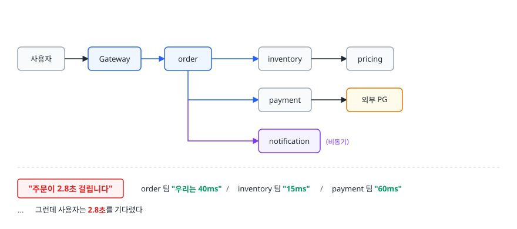
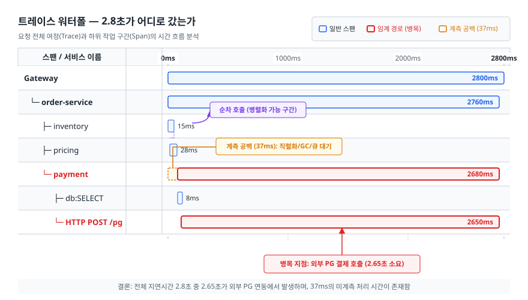
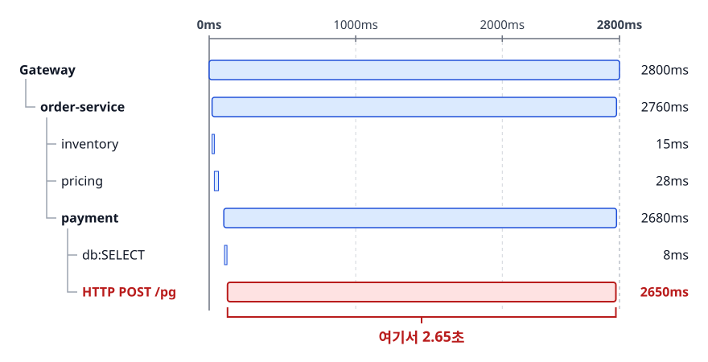
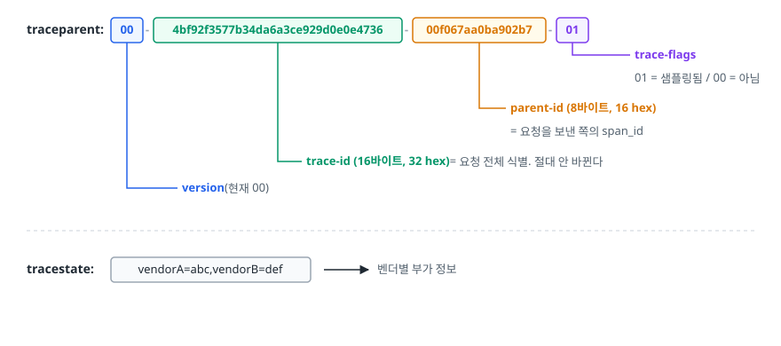
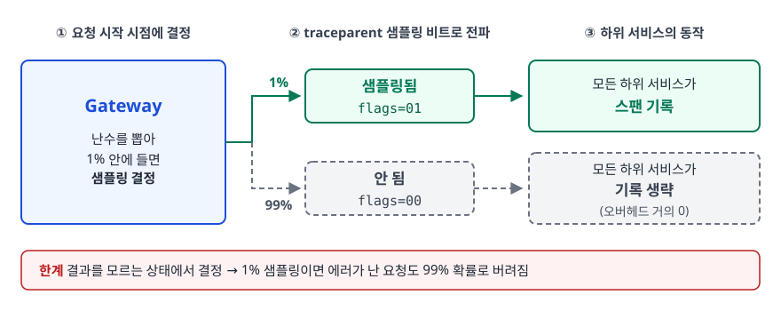
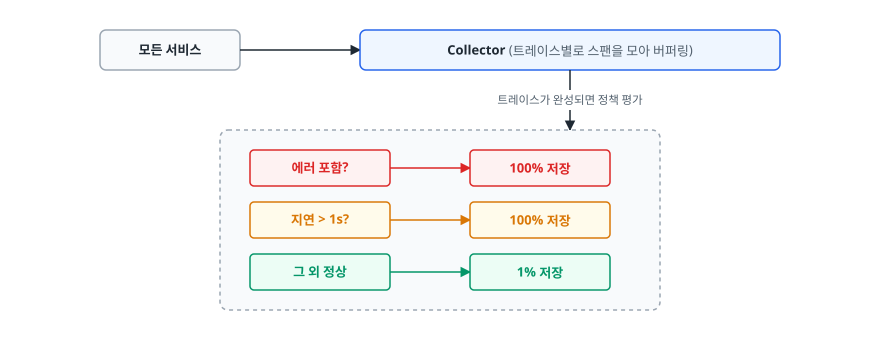
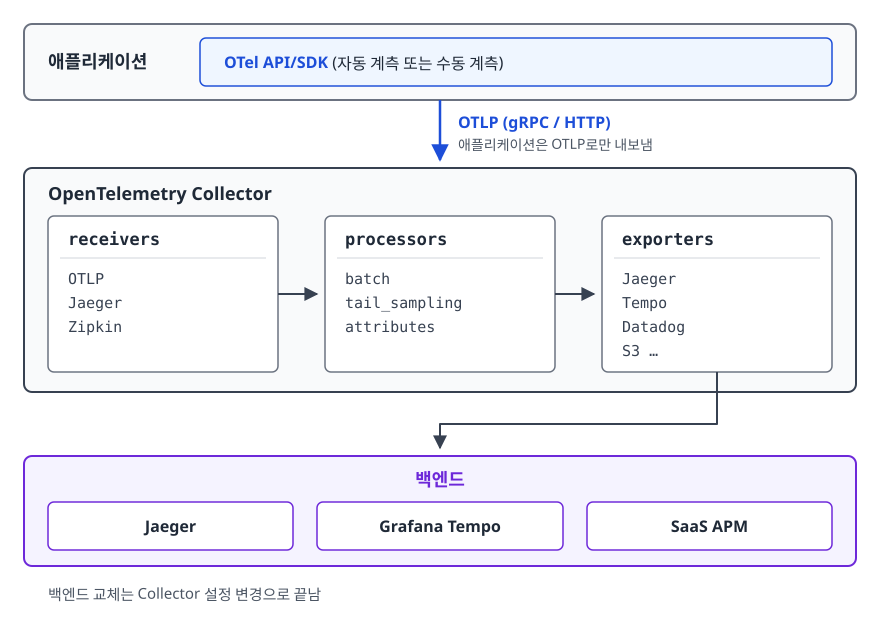

# 분산 트레이싱 (Distributed Tracing)

> 요청 하나가 여러 서비스를 지날 때 어디서 시간이 사라지는지 찾는 방법과, 그 데이터를 감당 가능한 비용으로 모으는 샘플링 전략을 설명할 수 있게 됩니다.

난이도: ⭐⭐

## 학습 목표

- [ ] MSA에서 요청 단위 추적이 왜 불가능해지는지 설명할 수 있다
- [ ] Trace / Span / Context Propagation의 관계를 설명할 수 있다
- [ ] W3C Trace Context 헤더의 구조와 전파 규칙을 안다
- [ ] Head 샘플링과 Tail 샘플링의 트레이드오프를 판단할 수 있다
- [ ] 트레이스 워터폴을 읽고 병목을 찾아내는 절차를 수행할 수 있다

## 선행 지식

- [01-observability-concepts.md](./01-observability-concepts.md) - 3대 축에서 트레이스의 역할
- [03-logging-stack.md](./03-logging-stack.md) - 상관관계 ID 개념 (겹치는 부분이 있으나 여기서는 트레이스 자체를 다룬다)

---

## 1. 왜 필요한가

모놀리스에서 "주문 API가 느리다"는 문제는 프로파일러 하나로 해결됩니다. 모든 코드가 한 프로세스
안에 있으니 어느 메서드가 시간을 먹는지 바로 보입니다.

서비스를 쪼개는 순간 이 능력이 사라집니다.

<!-- diagram:cloud-distributed-tracing-1 -->


<!-- 위 그림이 대체한 원본 ASCII.
     내용을 고칠 때는 그림도 함께 갱신할 것.
```
사용자 ──▶ Gateway ──▶ order ──▶ inventory ──▶ pricing
                          ├──▶ payment ──▶ 외부 PG
                          └──▶ notification (비동기)

  "주문이 2.8초 걸립니다"
     order 팀 "우리는 40ms"  /  inventory 팀 "15ms"  /  payment 팀 "60ms"
     ...  그런데 사용자는 2.8초를 기다렸다
```
-->

각 팀의 말이 다 사실이어도 사용자 경험은 2.8초입니다. 어떤 호출은 순차로 쌓였고, 어떤 구간은 큐에서
대기했고, 어떤 재시도는 로그에 안 남았습니다. **각 서비스의 평균 지연을 모아도 요청 하나의 지연은
복원되지 않는다.**

분산 트레이싱은 **요청 하나에 ID를 붙여 시스템 전체를 통과하는 동안 각 구간이 언제 시작해
언제 끝났는지 기록**합니다. 그 결과 "이 요청의 2.8초는 어디서 왔는가"에 정확히 답할 수 있습니다.

> **비유** — 국제 택배 추적과 같습니다. 송장 번호 하나로 "인천 물류센터 도착 → 통관 대기 12시간 →
> 항공 운송 → 현지 배송"처럼 각 단계의 시각이 기록되니, 늦어진 지점이 통관이었다는 걸 알 수 있습니다.
>
> **비유의 한계** — 택배는 한 번에 한 곳에만 있지만, 요청은 여러 하위 호출로 갈라져 동시에
> 진행됩니다. 그래서 트레이스는 선형 목록이 아니라 **트리**이고, "총 소요 시간 = 각 단계의 합"이
> 성립하지 않습니다. 병렬 구간에서는 가장 느린 가지가 전체를 결정합니다.

---

## 2. Trace, Span, Context Propagation

<!-- diagram:cloud-distributed-tracing -->


### 세 가지 구성 요소

**Trace(트레이스)** 는 요청 하나의 전체 여정입니다. 하나의 `trace_id`로 식별됩니다.

**Span(스팬)** 은 그 여정 안의 한 작업 구간입니다. 각 스팬은 다음을 갖습니다.

- `span_id` — 이 구간의 고유 ID
- `parent_span_id` — 나를 호출한 구간 (없으면 루트 스팬)
- 이름, 시작 시각, 종료 시각
- 속성(attributes) — `http.method`, `db.statement`, `merchant_id` 같은 키-값
- 이벤트(events) — 구간 안에서 일어난 시점 사건 (예: 예외 발생)
- 상태(status) — 성공/실패
- 종류(kind) — SERVER, CLIENT, PRODUCER, CONSUMER, INTERNAL

**Context Propagation(컨텍스트 전파)** 은 `trace_id`와 현재 `span_id`를 다음 서비스로 넘기는
행위입니다. 이게 트레이싱의 전부라고 해도 과장이 아닙니다. **전파가 한 군데라도 끊기면 그 지점부터
새 트레이스가 시작되어, 앞뒤가 영원히 이어지지 않는다.**

### 워터폴로 읽기

<!-- diagram:cloud-distributed-tracing-2 -->


<!-- 위 그림이 대체한 원본 ASCII.
     내용을 고칠 때는 그림도 함께 갱신할 것.
```
0ms                        1000ms                      2000ms        2800ms
│                            │                            │             │
├─ Gateway ══════════════════════════════════════════════════════════ 2800ms
│    └─ order-service ═══════════════════════════════════════════════ 2760ms
│         ├─ inventory      ══                                          15ms
│         ├─ pricing          ═══                                       28ms
│         └─ payment            ═══════════════════════════════════════ 2680ms
│              ├─ db:SELECT      ═                                       8ms
│              └─ HTTP POST /pg    ════════════════════════════════════ 2650ms
│                                                                   ▲
│                                                        여기서 2.65초
```
-->

이 그림에서 읽어야 할 것은 세 가지입니다.

**첫째, 병목은 payment → 외부 PG 호출이다.** inventory와 pricing은 합쳐도 43ms로 무의미합니다.
가장 긴 스팬 하나가 전체를 결정하는 게 일반적인 패턴입니다.

**둘째, 부모와 자식의 시간 차이도 정보다.** order-service는 2760ms인데 자식들의 합은 2723ms다.
차이 37ms가 자신의 처리 시간이고, 이 차이가 크면 **스팬으로 잡히지 않은 구간**(직렬화, GC 정지,
스레드 풀 대기)이 있다는 신호입니다.

**셋째, 스팬이 겹치는지가 순차/병렬을 알려준다.** inventory와 pricing이 겹치지 않으면 순차
호출이고, 병렬로 바꾸면 곧바로 개선되는 여지가 보입니다.

### 실무에서 자주 보이는 패턴

| 워터폴 모양 | 의미 | 대응 |
|-----------|------|------|
| 같은 이름의 DB 스팬이 수백 개 | ORM의 N+1 쿼리 | Fetch Join, 배치 조회 |
| 자식 스팬들이 계단처럼 순차 | 병렬화 가능한 호출이 직렬로 | 비동기 병렬 호출로 전환 |
| 부모가 길고 자식 합은 짧음 | 계측 안 된 구간, GC, 큐 대기 | 해당 구간에 수동 스팬 추가 |
| 짧은 스팬이 같은 대상에 3회 반복 | 재시도가 조용히 돌고 있음 | 백오프 설정 확인, 재시도 계측 |
| 요청 맨 앞에 긴 공백 | 스레드 풀/커넥션 풀 대기 | 풀 포화도 지표 확인 |

---

## 3. W3C Trace Context와 헤더 전파

### traceparent 헤더

과거에는 Zipkin의 B3, 각 APM 벤더의 독자 헤더가 난립했습니다. 서비스마다 다른 라이브러리를 쓰면
트레이스가 경계에서 끊겼습니다. W3C가 이를 표준화한 것이 Trace Context다.

<!-- diagram:cloud-distributed-tracing-3 -->


<!-- 위 그림이 대체한 원본 ASCII.
     내용을 고칠 때는 그림도 함께 갱신할 것.
```
traceparent: 00-4bf92f3577b34da6a3ce929d0e0e4736-00f067aa0ba902b7-01
             │  │                                │                │
             │  │                                │                └─ trace-flags
             │  │                                │       01 = 샘플링됨 / 00 = 아님
             │  │                                └─ parent-id (8바이트, 16 hex)
             │  │                                   = 요청을 보낸 쪽의 span_id
             │  └─ trace-id (16바이트, 32 hex) = 요청 전체 식별. 절대 안 바뀐다
             └─ version (현재 00)

tracestate: vendorA=abc,vendorB=def     ← 벤더별 부가 정보
```
-->

전파 규칙은 단순합니다. **요청을 받으면 `traceparent`를 파싱해서 `trace_id`는 그대로 유지하고,
자기 스팬을 만들 때 그 `parent-id`를 부모로 삼습니다. 다음 서비스로 나갈 때는 `parent-id`를
자기 `span_id`로 바꿔서 보낸다.** `trace_id`만 끝까지 같고 `parent-id`는 홉마다 바뀝니다.

`trace-flags`의 샘플링 비트가 중요합니다. 진입점에서 "이 트레이스를 수집한다"고 정하면 그 결정이
헤더를 타고 전파되어, **모든 서비스가 같은 판단을 내린다.** 이게 없으면 어떤 서비스는 기록하고
어떤 서비스는 안 해서 구멍 뚫린 트레이스가 나옵니다.

### Baggage — 비즈니스 컨텍스트 전파

`trace_id` 외에 "이 요청은 프리미엄 등급 사용자다" 같은 정보를 전 서비스에 전파하고 싶을 때
W3C Baggage 헤더를 씁니다.

```
baggage: user.tier=premium,tenant.id=acme
```

편리하지만 **모든 하위 요청 헤더에 그대로 실려 다니므로** 크기를 최소로 유지해야 하고,
민감정보는 절대 넣으면 안 됩니다. 외부로 나가는 요청에서 baggage를 제거하는 처리도 필요합니다.

### 비동기 경계

HTTP는 헤더가 있으니 쉽지만, Kafka·SQS·RabbitMQ 경계에서는 메시지 헤더/속성에 직접 실어야 합니다.

```java
// Producer — 현재 컨텍스트를 메시지 헤더로 주입
W3CTraceContextPropagator.getInstance().inject(
    Context.current(), record.headers(),
    (headers, key, value) -> headers.add(key, value.getBytes(UTF_8)));

// Consumer — 헤더에서 컨텍스트를 복원해 부모로 연결
Context parent = W3CTraceContextPropagator.getInstance()
                   .extract(Context.current(), record.headers(), getter);
Span span = tracer.spanBuilder("process-order")
                  .setParent(parent).setSpanKind(SpanKind.CONSUMER).startSpan();
```

**비동기 구간을 부모-자식으로 이을지, 별도 트레이스로 두고 Link로 연결할지는 설계 판단이다.**
메시지가 몇 초 뒤 처리된다면 부모 스팬은 이미 끝나 있어서, 억지로 자식으로 만들면 "3초짜리
요청"처럼 보입니다. 배치 컨슈머처럼 여러 메시지를 한꺼번에 처리하는 경우에는 Span Link로 여러
원본 트레이스를 참조하는 게 더 정확합니다.

---

## 4. 샘플링 전략

### 왜 필요한가

초당 5,000 요청을 처리하는 서비스에서 요청당 스팬이 20개라면 초당 10만 스팬입니다. 전량 저장하면
저장 비용, 네트워크 대역폭, 백엔드 처리 능력이 모두 무너집니다. 그런데 대부분의 트레이스는
**정상적이고 서로 똑같아서 볼 가치가 거의 없다.** 그래서 샘플링은 "무엇을 버릴 것인가"가 아니라
**"무엇을 반드시 남길 것인가"** 의 문제입니다.

### Head 샘플링

**요청이 시작되는 시점에** 수집 여부를 결정합니다. 결정 결과는 `traceparent`의 샘플링 비트로
전파되어 모든 서비스가 따릅니다.

<!-- diagram:cloud-distributed-tracing-4 -->


<!-- 위 그림이 대체한 원본 ASCII.
     내용을 고칠 때는 그림도 함께 갱신할 것.
```
Gateway: 난수를 뽑아 1% 안에 들면 샘플링 결정
   ├─ 샘플링됨(flags=01) → 모든 하위 서비스가 스팬 기록
   └─ 안 됨(flags=00)    → 모든 하위 서비스가 기록 생략 (오버헤드 거의 0)
```
-->

장점은 구조가 단순하고, 샘플링 안 된 요청은 아예 데이터를 만들지 않아 오버헤드가 없다는 것입니다.
치명적 단점은 **결과를 모르는 상태에서 결정한다는 것**입니다. 1% 샘플링이면 에러가 난 요청도
99% 확률로 버려집니다. 정작 보고 싶은 트레이스가 없습니다.

### Tail 샘플링

**요청이 끝난 뒤 결과를 보고** 결정합니다. 에러나 느린 트레이스는 100% 남기고 정상은 일부만 남깁니다.

<!-- diagram:cloud-distributed-tracing-5 -->


<!-- 위 그림이 대체한 원본 ASCII.
     내용을 고칠 때는 그림도 함께 갱신할 것.
```
모든 서비스 ──▶ Collector (트레이스별로 스팬을 모아 버퍼링)
                     │ 트레이스가 완성되면 정책 평가
                     ▼
              ┌────────────────────────────┐
              │ 에러 포함?      → 100% 저장 │
              │ 지연 > 1s?      → 100% 저장 │
              │ 그 외 정상      →   1% 저장 │
              └────────────────────────────┘
```
-->

원하는 데이터를 정확히 남긴다는 점에서 압도적으로 우수합니다. 대신 **인프라가 복잡해진다.**
가장 큰 제약은 **같은 트레이스의 모든 스팬이 같은 Collector 인스턴스에 모여야 한다**는 점입니다.
Collector를 여러 대로 확장하면 트레이스가 쪼개져 판단이 불가능해집니다. 그래서 앞단에 `trace_id`
해시로 라우팅하는 로드밸런싱 계층을 두고 뒷단에서 tail sampling을 적용하는 2단 구성을 씁니다.
또 트레이스가 완성될 때까지 스팬을 메모리에 들고 있어야 해서 메모리 사용량이 큽니다.

### 비교

| 항목 | Head 샘플링 | Tail 샘플링 |
|------|-----------|-----------|
| 결정 시점 | 요청 시작 시 | 트레이스 완료 후 |
| 에러 트레이스 보존 | 확률적 (대부분 유실) | 100% 보존 가능 |
| 애플리케이션 오버헤드 | 매우 낮음 (미샘플 시 생성 안 함) | 항상 전량 생성해서 전송 |
| 네트워크 비용 | 낮음 | 높음 (전량을 Collector까지) |
| 인프라 복잡도 | 낮음 | 높음 (trace_id 라우팅 + 버퍼링) |
| 메모리 요구 | 없음 | Collector에 큼 |

**도입 초기에는 Head 샘플링으로 시작하고, 트레이싱이 실제로 쓰이기 시작하면 Tail로 옮기는
경로가 현실적이다.** 다만 Head를 쓰더라도 최소한의 가시성은 확보해두는 게 좋습니다. 예외가 터진
뒤에 샘플링 비트를 켜는 건 이미 늦으므로(그 시점에는 앞선 스팬들이 기록되지 않았다), 결제처럼
중요한 엔드포인트나 특정 디버그 헤더가 붙은 요청은 **진입점에서 처음부터 100% 샘플링**하도록
규칙을 섞습니다.

---

## 5. OpenTelemetry와 백엔드

### OpenTelemetry가 해결한 문제

과거에는 Jaeger를 쓰면 Jaeger 클라이언트를, Datadog을 쓰면 Datadog 에이전트를 코드에 심어야
했고, 백엔드를 바꾸려면 전 서비스의 계측 코드를 고쳐야 했습니다. OpenTelemetry(OTel)는 **계측 API를
백엔드에서 분리한 표준**이며, CNCF에서 Kubernetes 다음으로 활발한 프로젝트로 꼽힙니다.

<!-- diagram:cloud-distributed-tracing-6 -->


<!-- 위 그림이 대체한 원본 ASCII.
     내용을 고칠 때는 그림도 함께 갱신할 것.
```
┌────────────────────────────────────────────────────────┐
│ 애플리케이션   OTel API/SDK (자동 계측 또는 수동 계측)   │
└──────────────────────┬─────────────────────────────────┘
                       │ OTLP (gRPC / HTTP)
                       ▼
┌────────────────────────────────────────────────────────┐
│ OpenTelemetry Collector                                 │
│  receivers   →   processors        →   exporters        │
│  (OTLP,          (batch,               (Jaeger, Tempo,  │
│   Jaeger,         tail_sampling,        Datadog, S3 …)  │
│   Zipkin)         attributes)                           │
└──────────────────────┬─────────────────────────────────┘
                       ▼   Jaeger / Grafana Tempo / SaaS APM
```
-->

Collector가 중간에 있으면 **애플리케이션은 OTLP로만 내보내고, 백엔드 교체는 Collector 설정
변경으로 끝난다.** 민감정보 제거, 속성 정규화, 샘플링도 여기서 중앙 집중으로 처리합니다.

**자동 계측(auto-instrumentation)** 은 언어별 에이전트가 HTTP 서버/클라이언트, JDBC, gRPC,
Kafka 클라이언트 등을 후킹해 스팬을 자동으로 만들어줍니다. Java라면 JVM 인자 하나로 시작합니다.

```bash
java -javaagent:opentelemetry-javaagent.jar \
     -Dotel.service.name=order-service \
     -Dotel.exporter.otlp.endpoint=http://otel-collector:4317 \
     -jar app.jar
```

여기까지가 무료로 얻는 부분이고, **비즈니스 의미가 있는 구간은 수동 계측이 필요하다.**

```java
Span span = tracer.spanBuilder("order.validate-inventory").startSpan();
try (Scope scope = span.makeCurrent()) {
    span.setAttribute("order.item_count", items.size());
    span.setAttribute("order.channel", channel);   // 값 종류가 유한한 것
    inventoryService.validate(items);
} catch (Exception e) {
    span.recordException(e);
    span.setStatus(StatusCode.ERROR);
    throw e;
} finally {
    span.end();   // 반드시 호출. 빠지면 스팬이 영원히 미완성으로 남는다
}
```

### 백엔드 선택

| 백엔드 | 저장 방식 | 특징 |
|--------|---------|------|
| Jaeger | Cassandra, Elasticsearch 등 | CNCF 졸업 프로젝트, 성숙한 UI, OTLP 수신 지원 |
| Grafana Tempo | 오브젝트 스토리지 | 저장 단가 낮음, TraceQL, Grafana 통합이 매끄러움 |
| Zipkin | 다양 | 오래됐고 가벼움, B3 전파 |
| AWS X-Ray | 관리형 | AWS 서비스 연동이 강점, 기록/스캔한 트레이스 기준 과금 |
| 상용 APM | 관리형 | 코드 수준 프로파일링까지 결합, 데이터 양에 비례해 비용 상승 |

**Tempo가 Loki와 같은 설계 철학을 공유한다는 점은 기억해둘 만하다.** 색인을 최소화하고 오브젝트
스토리지에 던져 저장 비용을 낮추는 대신 "임의 속성으로 트레이스 찾기"에 제약이 있습니다.

### 세 축을 잇기

- **메트릭 → 트레이스**: Prometheus의 exemplar로 히스토그램 버킷에 대표 `trace_id`를 붙이면,
  그래프의 튄 지점을 클릭해 바로 그 트레이스로 이동할 수 있습니다.
- **트레이스 → 로그**: 스팬의 `trace_id`로 로그를 필터링합니다.
  [03-logging-stack.md](./03-logging-stack.md)에서 다룬 MDC 주입이 전제 조건입니다.
- **로그 → 트레이스**: 에러 로그에 담긴 `trace_id`로 전체 요청 경로를 복원합니다.

---

## 6. 트레이스로 병목을 찾는 절차

> **상황** — 주문 API p99가 400ms에서 2.8초로 올랐습니다. 에러율은 정상.

**1) 메트릭에서 트레이스로 진입**

`histogram_quantile`로 p99가 튄 시간대와 엔드포인트를 특정합니다. exemplar가 설정되어 있으면
그래프의 해당 지점에서 대표 트레이스로 바로 넘어가고, 없으면 트레이싱 UI에서 시간 범위와
`duration > 1s` 조건으로 검색합니다.

**2) 한 건이 아니라 여러 건을 보고, 정상 트레이스와 비교한다**

느린 트레이스 하나만 보면 우연을 원인으로 착각합니다. 최소 10건 이상 열어 **공통으로 긴 스팬이
무엇인지** 확인한 뒤, 같은 엔드포인트의 빠른 트레이스를 나란히 열어봅니다. 구조가 다르면(없던
호출이 생겼으면) 코드 경로가 바뀐 것이고, 구조가 같은데 특정 스팬만 길면 그 의존성이 느려진 것입니다.

**3) 병목 스팬의 성격을 판별한다**

| 관찰 | 해석 | 다음 확인 |
|------|------|----------|
| 외부 HTTP 스팬 하나가 대부분 차지 | 외부 의존성 지연 | 상대 서비스 상태, 타임아웃/서킷 브레이커 설정 |
| 동일 DB 스팬이 수백 개 | N+1 쿼리 | ORM 페치 전략, 쿼리 카운트 테스트 |
| 부모는 긴데 자식 합이 짧음 | 계측 안 된 구간 | GC 로그, 스레드 풀 대기, 커넥션 풀 포화도 |
| 스팬 시작 전 공백 | 큐/풀 대기 | 풀 포화도 지표(대기 스레드 수) |
| 특정 인스턴스의 트레이스만 느림 | 노드 문제 | 해당 노드의 CPU steal, 디스크 I/O |

**4) 로그로 확정하고, 고친 뒤 같은 방법으로 검증한다**

병목 스팬의 `trace_id`로 그 서비스 로그를 필터링해 그 순간 무엇이 찍혔는지 봅니다. 재시도, 폴백,
예외 스택이 여기서 드러납니다. 수정 후에는 같은 조건으로 트레이스를 다시 뽑아 워터폴 모양이
바뀌었는지 확인합니다. p99 그래프만 보면 트래픽 변화 덕인지 수정 덕인지 구분되지 않습니다.

---

## 7. 실무에서는

**도입은 한 경로부터 한다.** 전 서비스에 동시에 적용하려다 흐지부지되는 게 가장 흔한 실패
패턴입니다. 매출과 직결되는 핵심 트랜잭션 경로 하나를 골라 끝에서 끝까지 이어보면, 그 자체로
"여기가 병목이었네" 같은 성과가 나오고 다른 팀이 따라오게 됩니다.

**전파가 끊기는 지점을 먼저 찾는다.** 자동 계측이 지원하지 않는 커스텀 RPC, 오래된 HTTP
클라이언트, 스레드 풀을 직접 쓰는 코드에서 컨텍스트가 사라집니다. 트레이스가 짧게 끊겨 있으면
그 경계를 의심합니다.

**속성 카디널리티는 메트릭만큼 조심하지 않아도 되지만 무한하지도 않다.** 트레이스는 개별
이벤트라서 `user_id` 같은 고유값을 속성으로 넣어도 메트릭처럼 폭발하지는 않습니다. 다만 그
속성으로 검색하려면 백엔드가 색인을 만들어야 하므로, **검색 조건으로 쓸 속성만 색인 대상으로
지정**하는 게 실무 기준입니다.

**오버헤드는 대개 문제가 되지 않는다.** 자동 계측의 CPU 오버헤드는 보통 한 자릿수 퍼센트
수준으로 보고됩니다. 문제가 되는 건 계측 자체가 아니라 스팬을 동기 전송하도록 설정한 경우입니다.
배치 스팬 프로세서(BatchSpanProcessor)로 비동기 전송하는지 반드시 확인합니다.

**보관 기간은 짧게 잡는다.** 트레이스는 장애 조사용이라 며칠이면 충분하고, 장기 추세는 메트릭이
담당합니다. 이 역할 분담을 지키지 않으면 저장 비용이 감당되지 않습니다.

---

## 8. 면접 포인트

> 면접에서 이 주제가 나오면 이렇게 답한다

**Q. 분산 트레이싱이 없으면 어떤 문제가 생기나요?**

A. 각 서비스의 메트릭은 정상인데 사용자 응답은 느린 상황을 설명할 수 없습니다. 서비스별 평균
지연을 아무리 모아도 요청 하나가 어떤 순서로 어디를 거쳤는지, 어느 구간이 순차였고 어느 구간이
대기였는지는 복원되지 않기 때문입니다. 트레이싱은 요청 단위로 시간의 행방을 기록해서 이
질문에 답합니다.

- 꼬리 질문: "로그에 요청 ID만 남겨도 되지 않나요?" → 상관관계 ID로 로그를 모으는 것까지는
  되지만, 각 구간의 시작·종료 시각과 부모-자식 관계가 없어서 병렬/순차 구조와 구간별 소요
  시간을 알 수 없다고 답합니다.

**Q. Head 샘플링과 Tail 샘플링 중 무엇을 쓰겠습니까?**

A. 가치 있는 트레이스를 확실히 남기려면 Tail 샘플링입니다. 요청이 끝난 뒤 에러 여부와 지연을
보고 결정하므로 에러 트레이스를 100% 보존할 수 있습니다. 다만 같은 트레이스의 모든 스팬이 같은
Collector에 모여야 판단이 가능해서, trace_id 기반 라우팅 계층과 버퍼링 메모리가 필요합니다.
그래서 도입 초기에는 Head 샘플링으로 시작하고, 트레이싱이 실제 운영에 쓰이기 시작한 뒤 Tail로
넘어가는 순서를 택하겠습니다.

- 꼬리 질문: "Head 샘플링에서 에러 트레이스를 남길 방법은 없나요?" → 결정이 요청 시작 시점에
  나므로 근본적으로 어렵습니다. 특정 엔드포인트나 조건을 100% 샘플링하도록 규칙을 섞는 정도가
  현실적인 절충이라고 답합니다.

**Q. Context Propagation이 끊기면 어떻게 되나요?**

A. 그 지점부터 새 trace_id로 별개 트레이스가 시작되어, 앞부분과 뒷부분이 영원히 연결되지
않습니다. 워터폴에서는 요청이 중간에 끝난 것처럼 보이고, 실제 병목이 끊긴 뒤쪽에 있으면 아예
보이지 않습니다. 자주 끊기는 곳은 자동 계측이 지원하지 않는 커스텀 클라이언트, 스레드 풀에
직접 작업을 던지는 코드, 그리고 메시지 큐 경계입니다.

- 꼬리 질문: "메시지 큐에서는 어떻게 전파하나요?" → 메시지 헤더에 traceparent를 주입하고
  컨슈머가 추출해 부모로 연결합니다. 처리 시점이 많이 떨어져 있으면 부모-자식 대신 Span Link로
  연결하는 게 더 정확하다고 답합니다.

**Q. OpenTelemetry를 쓰는 이유는 무엇인가요?**

A. 계측 코드를 백엔드에서 분리해주기 때문입니다. 예전에는 Jaeger용, Datadog용 클라이언트를
코드에 직접 심어야 해서 백엔드를 바꾸면 전 서비스를 수정해야 했습니다. OTel은 표준 API로
계측하고 OTLP로 내보내므로, 백엔드 교체가 Collector 설정 변경으로 끝납니다. 또 로그·메트릭·
트레이스를 같은 SDK와 같은 의미 규약으로 다룰 수 있어서 세 축을 연결하기가 쉬워집니다.

---

## 자주 하는 실수

| 실수 | 왜 틀렸나 | 올바른 이해 |
|------|----------|-----------|
| 트레이스 한 건만 보고 원인 단정 | 우연히 느린 한 건일 수 있다 | 여러 건의 공통 패턴과 정상 트레이스 비교로 확인 |
| 스팬 소요 시간을 단순 합산 | 병렬 구간이 있으면 합이 전체와 다르다 | 워터폴에서 겹침 여부를 보고 임계 경로를 읽는다 |
| `span.end()` 누락 | 스팬이 미완성으로 남아 트레이스가 깨진다 | `finally` 블록에서 반드시 종료 |
| 자동 계측만 켜고 끝냄 | 비즈니스 구간이 안 보여 "어느 로직이 느린지" 알 수 없다 | 핵심 도메인 로직에는 수동 스팬 추가 |
| 1% Head 샘플링만 걸어두고 에러 조사 시도 | 정작 보고 싶은 에러 트레이스가 99% 확률로 없다 | Tail 샘플링 또는 조건부 강제 샘플링 병행 |
| Baggage에 정보를 잔뜩 실음 | 모든 하위 요청 헤더에 실려 다니며 크기와 유출 위험을 키운다 | 최소한만, 민감정보는 절대 금지 |
| 트레이스를 장기 보관 | 저장 비용이 급격히 커진다 | 장기 추세는 메트릭, 트레이스는 며칠 |

---

## 한 줄 정리

분산 트레이싱의 본질은 **`trace_id`를 끊기지 않게 전파하는 것**이고, 그 데이터를 감당 가능하게
만드는 건 **"에러와 느린 요청은 반드시 남긴다"는 샘플링 정책**입니다.

---

## 연관 개념

- [01-observability-concepts.md](./01-observability-concepts.md) - 3대 축에서 트레이스의 위치
- [02-prometheus-grafana.md](./02-prometheus-grafana.md) - exemplar로 메트릭에서 트레이스로 이동하기
- [03-logging-stack.md](./03-logging-stack.md) - trace_id를 로그에 주입하는 MDC 처리
- [05-alerting-oncall.md](./05-alerting-oncall.md) - 트레이스를 Runbook에 연결하는 방법
- [qna-monitoring.md](./qna-monitoring.md) - 이 주제 면접 질문 모음
- [../../09-system-design/performance/qna-performance.md](../../09-system-design/performance/qna-performance.md) - 병목 진단과 p99
- [../../02-backend-engineering/database/qna-database.md](../../02-backend-engineering/database/qna-database.md) - 트레이스에 드러나는 N+1 쿼리 문제
