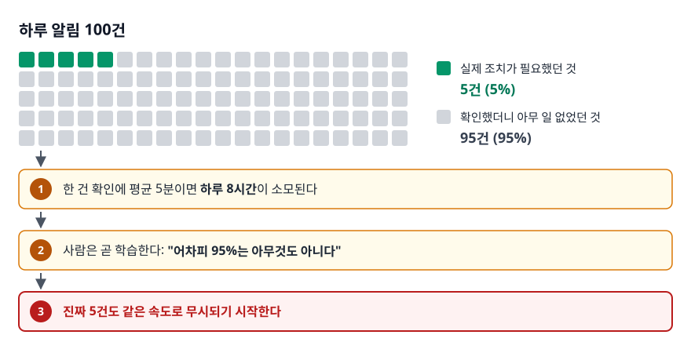
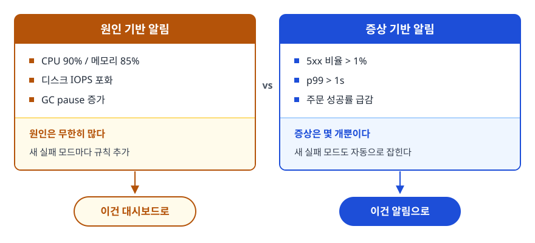
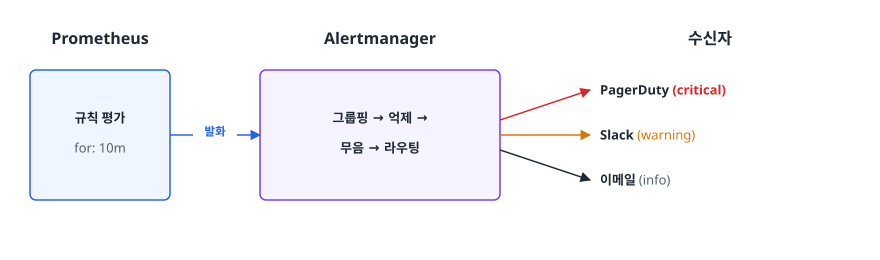
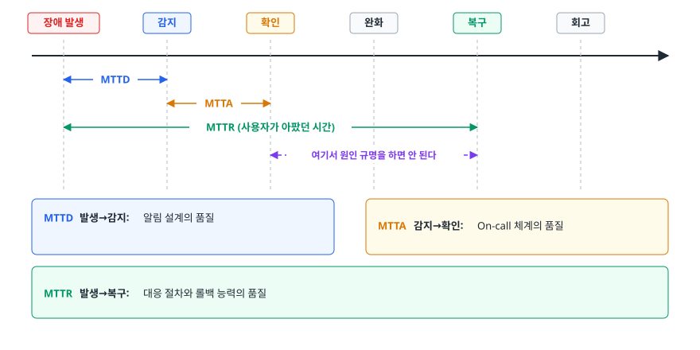
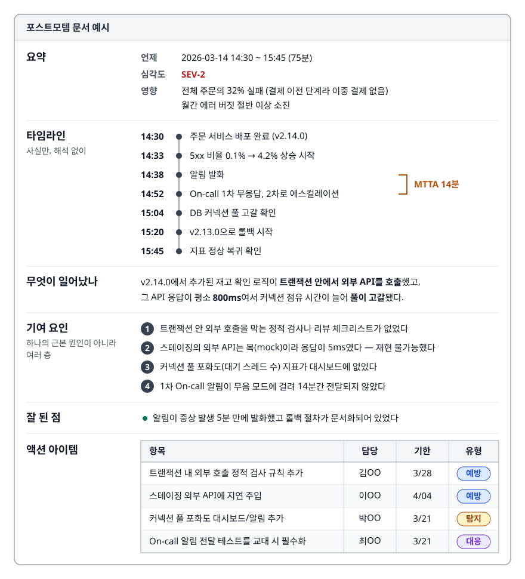

# 알림 설계와 On-call (Alerting & On-call)

> 한밤중에 휴대폰이 울리면 누군가는 일어나 노트북을 열어야 합니다. 그 호출이 값어치를 하려면 어떤 알림이어야 하는지, 알림 피로가 왜 조직을 무너뜨리는지, 장애가 났을 때 무엇을 먼저 해야 하는지를 다룹니다.

난이도: ⭐⭐

## 학습 목표

- [ ] 좋은 알림의 조건을 "조치 가능성"과 "증상 기반"으로 설명할 수 있다
- [ ] 알림 피로가 발생하는 구조와 그 대가를 설명할 수 있다
- [ ] 알림을 호출(page) / 티켓 / 정보로 나눠 라우팅하는 기준을 세울 수 있다
- [ ] On-call 로테이션과 에스컬레이션을 설계할 수 있다
- [ ] 비난 없는 포스트모템을 작성할 수 있다

## 선행 지식

- [01-observability-concepts.md](./01-observability-concepts.md) - SLO와 에러 버짓
- [02-prometheus-grafana.md](./02-prometheus-grafana.md) - 알림 규칙을 표현하는 PromQL

---

## 1. 왜 필요한가

대시보드는 아무도 24시간 보지 않습니다. 새벽 3시에 결제가 멈추면 누군가는 그 사실을 알아야 하고,
그 사람을 깨우는 유일한 수단이 알림입니다. 문제는 이 수단이 **한 번에 소진되는 신뢰**로 움직인다는
데 있습니다. 알림이 울려서 확인했더니 아무 일도 없었던 경험이 몇 번 반복되면, 사람은 다음 알림을
진지하게 받아들이지 않습니다. 개인의 게으름이 아니라 예측 가능한 반응입니다. 그래서 **알림 설계는
신뢰 관리 문제**이지, **기술 문제**가 아닙니다.

> **비유** — 화재경보기와 같습니다. 요리할 때마다 울리는 경보기는 몇 주 안에 배터리가 뽑히고,
> 진짜 불이 났을 때 아무도 대피하지 않습니다.
>
> **비유의 한계** — 화재경보기는 켜거나 끄는 둘 중 하나뿐입니다. 알림은 **긴급도별로 다른 경로로
> 보낼 수 있습니다.** 알리되 깨우지는 않는 중간 단계(티켓, 대시보드)를 설계할 수 있다는 점이 이 비유에서 빠진 부분입니다.

---

## 2. 좋은 알림의 조건

### 조치 가능성이 유일한 기준

알림 하나를 만들 때 던져야 하는 질문은 하나입니다. **"이 알림을 받은 사람이 지금 무엇을 해야 하는가?"**
답이 없으면 그건 알림이 아니라 정보이고, 대시보드나 주간 리포트로 가야 합니다. 이 기준을
통과하려면 네 가지가 필요합니다.

**첫째, 사용자 영향이 있거나 곧 생깁니다.** "디스크 사용률 80%"는 지금 아무도 아프지 않지만
"디스크가 4시간 안에 가득 찬다"는 조치가 필요합니다. 같은 지표라도 **임박한 결과로 표현하면**
알림이 될 수 있습니다.

**둘째, 사람만 할 수 있는 일입니다.** 대응이 "파드를 재시작한다"뿐이라면 자동화 대상이지 사람을
깨울 일이 아닙니다. 자동 복구를 만들고, 자동 복구가 반복되는 것만 알립니다.

**셋째, 지금 해야 합니다.** 내일 아침에 해도 되는 일이면 호출이 아니라 티켓입니다.

**넷째, 무엇을 봐야 할지가 알림 안에 있습니다.** 영향 범위, 대시보드·Runbook 링크가 없으면 받은
사람이 맨땅에서 시작합니다.

```yaml
# Prometheus 알림 규칙 — 조치에 필요한 정보를 함께 싣는다
- alert: OrderApiHighErrorRate
  expr: service:http_errors:ratio5m{service="order-api"} > 0.01
  for: 10m
  labels: { severity: critical, team: order }
  annotations:
    summary: "order-api 5xx {{ $value | humanizePercentage }} (10분 지속)"
    impact: "주문 생성 실패. 결제 이전 단계라 이중 결제 위험은 없음"
    dashboard: "https://grafana.example.com/d/order-api"
    runbook_url: "https://wiki.example.com/runbook/order-api-5xx"
```

`impact` 필드가 특히 효과적입니다. 받은 사람이 **심각도를 스스로 판단하지 않아도 되게** 만듭니다.

### 알림 계층

| 계층 | 전달 경로 | 기준 | 예시 |
|------|---------|------|------|
| Page (호출) | 전화, 푸시, PagerDuty | 지금 사람이 개입하지 않으면 사용자 피해가 계속된다 | 결제 전면 실패, 데이터 유실 진행 중 |
| Ticket (티켓) | Jira, Slack 채널 | 며칠 안에 처리해야 하지만 지금은 아니다 | 인증서 만료 2주 전, 디스크 증가 추세 |
| Dashboard (정보) | 대시보드, 주간 리포트 | 관찰 대상이지 대응 대상이 아니다 | 배포 완료, 스케일링 이벤트 |

**"이 알림이 새벽 3시에 울려도 정당한가?"** 가 계층을 나누는 가장 실용적인 기준입니다.

---

## 3. 알림 피로와 그 대가

### 오탐이 쌓이는 구조

알림 피로(Alert Fatigue)는 알림이 많아서가 아니라 **의미 없는 알림의 비율이 높아서** 생깁니다.

<!-- diagram:cloud-alerting-oncall-1 -->


<!-- 위 그림이 대체한 원본 ASCII.
     내용을 고칠 때는 그림도 함께 갱신할 것.
```
 하루 알림 100건
   ├─ 실제 조치가 필요했던 것        5건   (5%)
   └─ 확인했더니 아무 일 없었던 것   95건  (95%)
 → 한 건 확인에 평균 5분이면 하루 8시간이 소모된다
 → 사람은 곧 학습한다: "어차피 95%는 아무것도 아니다"
 → 진짜 5건도 같은 속도로 무시되기 시작한다
```
-->

무서운 건 **이 상태가 겉으로는 정상으로 보인다**는 데 있습니다. 알림은 계속 울리고 모니터링 시스템도
잘 돌아갑니다. 오직 사람의 반응 속도만 조용히 나빠지다가, 진짜 장애 때 "알림은 30분 전에 울렸는데
아무도 안 봤다"는 포스트모템이 나옵니다. 그 대가는 세 가지로 청구됩니다.

- **탐지 지연** — 알림은 울렸으나 반응이 없어 장애 시간이 몇 배로 늘어납니다
- **번아웃과 이탈** — 새벽 호출이 반복되면 사람이 떠나고, 그 머릿속의 시스템 지식도 함께 사라집니다
- **알림 무력화** — 시끄러운 알림은 조용히 삭제됩니다. 그중 하나가 실제로 중요했다는 사실은 다음 장애 때 압니다

### 줄이는 방법

- **지속 시간을 줍니다.** `for: 10m`처럼 조건이 일정 시간 유지되어야 발화하게 합니다. 순간
  스파이크는 대부분 저절로 회복됩니다.
- **그룹으로 묶고 연쇄 알림을 억제합니다.** 파드 50개가 동시에 죽으면 알림은 1건이어야 합니다.
  DB가 죽었을 때 필요한 것도 "DB 다운" 한 건이지 하위 서비스 알림 30건이 아닙니다.
- **임계치를 절대값이 아니라 SLO 기준으로 잡습니다.** "에러 5건"은 트래픽이 늘면 매일 울리지만
  "에러 버짓 소진 속도"는 트래픽과 무관하게 의미가 유지됩니다.
- **정기적으로 리뷰합니다.** 지난 한 달간 발화한 알림을 놓고 "조치로 이어졌는가"를 따져 아니었던
  알림은 계층을 낮추거나 삭제합니다. 이 리뷰를 안 하면 알림은 단조 증가만 합니다.

---

## 4. 증상 기반 알림 vs 원인 기반 알림

가장 흔한 설계 실수는 **원인 지표에 알림을 거는 것**입니다. "CPU 90%", "메모리 85%" 같은 내부 상태는
두 방향 모두에서 틀립니다. **오탐** — CPU 90%여도 배치 작업 중이라면 응답 시간은 멀쩡합니다.
**미탐** — CPU가 20%여도 데드락이나 외부 의존성 대기라면 서비스는 죽어 있습니다.

**증상 기반 알림**은 사용자가 느끼는 것을 감시합니다. 에러율, 응답 시간, 처리량 급감, 큐 적체.
사용자 영향이 실제로 있을 때만 울리므로 오탐이 적고, 원인이 무엇이든 잡아냅니다.

<!-- diagram:cloud-alerting-oncall-2 -->


<!-- 위 그림이 대체한 원본 ASCII.
     내용을 고칠 때는 그림도 함께 갱신할 것.
```
        원인 기반 알림                    증상 기반 알림
   ┌──────────────────────┐        ┌──────────────────────┐
   │ CPU 90% / 메모리 85% │        │ 5xx 비율 > 1%        │
   │ 디스크 IOPS 포화     │        │ p99 > 1s             │
   │ GC pause 증가        │        │ 주문 성공률 급감      │
   └──────────────────────┘        └──────────────────────┘
     원인은 무한히 많다               증상은 몇 개뿐이다
     새 실패 모드마다 규칙 추가        새 실패 모드도 자동으로 잡힌다
        ↓ 이건 대시보드로                 ↓ 이건 알림으로
```
-->

**원칙: 알림은 증상에, 대시보드는 원인에.** 증상 알림이 울리면 원인 대시보드를 열어 범위를 좁혀
들어갑니다. 원인 지표를 안 보는 게 아니라 **사람을 깨우는 트리거로 쓰지 않는 것**입니다. 예외는
**예측 가능한 고갈**뿐입니다. 디스크는 가득 차면 반드시 장애가 나는데, 차기 전에 막을 수 있습니다.
이때도 "사용률 80%" 대신 **"현재 증가 속도로 4시간 내 가득 참"** 처럼 임박한 결과로 표현합니다.

### 에러 버짓 소진 속도 알림

SLO를 정했다면 임계치를 직접 고를 필요가 없습니다. 버짓을 얼마나 빨리 태우고 있는지로 알림을 겁니다.

```yaml
- alert: ErrorBudgetFastBurn        # 빠른 소진 → 즉시 호출
  expr: |
    service:http_errors:ratio1h{service="order-api"} > 14.4 * 0.001
    and service:http_errors:ratio5m{service="order-api"} > 14.4 * 0.001
  for: 2m
  labels: { severity: critical }

- alert: ErrorBudgetSlowBurn        # 느린 소진 → 티켓으로
  expr: |
    service:http_errors:ratio6h{service="order-api"} > 6 * 0.001
    and service:http_errors:ratio30m{service="order-api"} > 6 * 0.001
  for: 15m
  labels: { severity: warning }
```

여기서 `0.001`은 SLO 99.9%의 허용 실패율이고, 배수는 소진 속도입니다. **긴 창과 짧은 창을 동시에
보는 이유**는 서로의 약점을 메우기 위해서입니다. 짧은 창만 보면 순간 스파이크에 오탐이 나고,
긴 창만 보면 이미 회복된 문제에도 알림이 남습니다. 둘이 동시에 참일 때만 울리게 하면 "지금도 진행
중이고 충분히 오래 지속됐다"는 두 조건을 모두 확인한 셈입니다.

---

## 5. Alertmanager로 소음 줄이기

Prometheus는 규칙을 평가해 알림을 발화하고, **전달 정책은 전부 Alertmanager가 담당합니다.**
이 역할 분리를 알아야 설정을 어디에 넣을지 헷갈리지 않습니다.

<!-- diagram:cloud-alerting-oncall-3 -->


<!-- 위 그림이 대체한 원본 ASCII.
     내용을 고칠 때는 그림도 함께 갱신할 것.
```
Prometheus                Alertmanager                 수신자
┌──────────┐  발화       ┌────────────────────┐
│ 규칙 평가 │ ──────────▶│ 그룹핑 → 억제 →     │──▶ PagerDuty (critical)
│ for: 10m │             │ 무음 → 라우팅       │──▶ Slack     (warning)
└──────────┘             └────────────────────┘──▶ 이메일    (info)
```
-->

```yaml
route:
  group_by: ['alertname', 'service']
  group_wait: 30s        # 첫 통지 전 대기 — 같은 그룹의 알림을 모을 시간
  group_interval: 5m     # 그룹에 새 알림이 추가됐을 때 다음 통지까지 간격
  repeat_interval: 4h    # 해결되지 않은 알림을 다시 알리는 주기
  receiver: 'slack-default'
  routes:
    - matchers: [ severity = "critical" ]
      receiver: 'pagerduty'
    - matchers: [ severity = "warning" ]
      receiver: 'slack-team'

inhibit_rules:                              # critical이 떠 있으면 warning은 숨긴다
  - source_matchers: [ severity = "critical" ]
    target_matchers: [ severity = "warning" ]
    equal: ['service']
```

**`group_wait`가 있는 이유**를 이해하면 나머지가 쉬워집니다. 노드 하나가 죽으면 그 위의 파드
알림이 몇 초에 걸쳐 차례로 발화합니다. 30초를 기다렸다가 한 번에 보내면 알림 20건이 1건이 됩니다.

**억제(inhibition)** 는 인과 관계를 알림 시스템에 알려 주는 장치입니다. "DB가 죽었다"는 알림이 있을 때
"주문 API 에러율 증가"는 파생 증상이므로 숨깁니다. 다만 과하게 걸면 **진짜 독립적인 문제까지
숨겨지므로** 원인이 확실한 관계에만 적용합니다.

**무음(silence)** 은 배포나 마이그레이션처럼 계획된 작업 중에 쓰되 만료 시간을 짧게 겁니다.
무기한 무음은 알림 삭제와 같고, 아무도 기억하지 못합니다.

### 알림 시스템 자체를 감시하기

가장 무서운 실패는 **알림이 안 오는 것**입니다. Prometheus가 죽었거나 Alertmanager가 통지에
실패하면 화면상으로는 모든 게 평화롭습니다. 표준 해법은 **항상 발화하는 알림**을 하나 두고,
**외부 시스템이 그 신호가 끊기면 호출하게** 만드는 것입니다. 있는 것이 아니라 없는 것이
트리거이므로 모니터링 스택 전체가 죽어도 감지됩니다.

```yaml
- alert: Watchdog
  expr: vector(1)                 # 항상 참
  labels: { severity: none }
  annotations:
    summary: "알림 파이프라인 생존 신호. 끊기면 모니터링이 죽은 것이다"
```

---

## 6. On-call 설계

### 로테이션

**주 단위 교대가 가장 흔합니다.** 하루 교대는 인수인계가 너무 잦고, 한 달은 부담이 지나칩니다.
핵심은 교대 시점에 **진행 중인 이슈를 명시적으로 넘기는 것**입니다. "A 서비스에서 간헐적 타임아웃을
관찰 중이고 B 티켓으로 추적 중"이라는 인수인계가 없으면 다음 사람이 같은 조사를 다시 합니다.

**1차와 2차를 둡니다.** 1차가 15분 안에 응답하지 못하면 2차로 자동 에스컬레이션됩니다. 2차 없는
On-call은 단일 장애점입니다.

**On-call 부하에 상한을 둡니다.** 구글 SRE에서 널리 인용되는 기준은 **한 교대에 처리하는 사건이 평균
두 건을 넘지 않아야 한다**는 것입니다. 넘으면 사람을 더 넣을 게 아니라 **알림과 시스템을 고쳐야 합니다.**

**보상과 회복 시간을 제도화합니다.** 새벽에 대응한 사람에게 다음 날 늦게 출근할 권리를 주기만 해도
지속 가능성이 달라집니다. 신규 입사자를 2차에 붙이는 섀도잉은 가장 빠른 학습 경로입니다.

### Runbook

Runbook은 "이 알림이 오면 무엇을 확인하고 무엇을 하는가"를 적은 문서입니다. 쓸모 있으려면
**알림 하나당 하나**로 만들어서 알림 메시지에서 링크로 바로 연결해야 합니다. **복사해 붙여넣을 수 있는
실제 PromQL과 명령**을 넣고, **판단 분기와 에스컬레이션 조건**("A면 롤백, B면 스케일 아웃",
"30분 내 미해결 시 DB 팀 호출")도 명시합니다. 낡은 Runbook은 없는 것보다 나쁘므로 대응할 때마다 갱신합니다.

---

## 7. 장애 대응 절차

### 전체 흐름과 시간 지표

<!-- diagram:cloud-alerting-oncall-4 -->


<!-- 위 그림이 대체한 원본 ASCII.
     내용을 고칠 때는 그림도 함께 갱신할 것.
```
 장애 발생        감지        확인        완화        복구        회고
 ───┼─────────────┼───────────┼───────────┼───────────┼───────────┼──▶
    │◀─  MTTD   ─▶│           │           │           │
    │             │◀─ MTTA  ─▶│           │           │
    │◀────────────  MTTR (사용자가 아팠던 시간)  ────▶│
                              │◀ 여기서 원인 규명을 하면 안 된다 ▶

 MTTD 발생→감지: 알림 설계의 품질   |   MTTA 감지→확인: On-call 체계의 품질
 MTTR 발생→복구: 대응 절차와 롤백 능력의 품질
```
-->

**세 지표를 나눠 보는 게 중요합니다.** MTTR이 길 때 "감지가 늦어서"인지, "아무도 전화를 안 받아서"인지,
"고치는 데 오래 걸려서"인지에 따라 개선 대상이 완전히 달라집니다.

### 단계별로 할 일

**1) 감지와 선언.** 사용자 영향이 확인되면 **장애임을 명시적으로 선언합니다.** "애매해서 일단 좀
더 보자"가 대응을 가장 많이 지연시킵니다. 아니었으면 5분 뒤 종료하면 됩니다.

**2) 역할 분담.** 사람이 셋 이상 모이면 역할을 나눕니다.

| 역할 | 하는 일 | 하지 않는 일 |
|------|--------|------------|
| Incident Commander | 상황 파악, 의사결정, 작업 배분 | 직접 터미널을 잡고 고치는 일 |
| Communications | 상태 페이지, 내부 공지, 경영진 보고 | 기술적 판단 |
| Operations | 실제 조사와 조치 수행 | 외부 소통 |
| Scribe | 타임라인 기록 (누가 언제 무엇을) | 조사·조치 |

IC가 직접 손을 대면 전체 상황을 보는 사람이 사라집니다. 대응이 산으로 가는 가장 흔한 원인입니다.

**3) 완화 우선.** 여기가 핵심입니다. **원인을 이해하는 것보다 사용자를 살리는 게 먼저입니다.** 직전
배포가 의심되면 원인을 몰라도 롤백하고, 특정 기능이 문제면 피처 플래그로 끕니다. "원인을 알아야
제대로 고친다"는 생각이 장애 시간을 늘립니다. 원인 분석은 복구 후에 하는 게 더 정확하기까지 합니다.

**4) 복구 확인과 회고.** 지표가 정상 범위로 돌아왔는지, 밀렸던 큐가 소진됐는지, 실패한 작업의
재처리가 필요한지 확인합니다. **에러가 멈춘 것과 데이터가 정상인 것은 다릅니다.**

---

## 8. 비난 없는 포스트모템

포스트모템에서 사람을 지목하면 결과는 딱 하나입니다. **다음부터 사람들이 사실을 숨깁니다.**
"제가 프로덕션에서 그 명령을 실행했습니다"라는 진술이 징계로 이어지는 조직에서는 아무도 그
말을 하지 않고, 그러면 진짜 원인도 영원히 드러나지 않습니다. 비난 없는 포스트모템의 목표는
면죄부가 아닙니다. **"숙련된 사람이 그 순간 가진 정보로는 그 판단이 합리적이었다"는 전제에서
출발하자**는 방법론입니다. 그러면 질문이 "왜 그런 실수를 했나?"가 아니라 **"왜 그 실수가 가능했고
시스템이 왜 막지 못했나?"** 로 바뀝니다.

| 비난하는 문장 | 시스템을 보는 문장 |
|-------------|-----------------|
| "김OO이 스테이징 대신 프로덕션에 배포했다" | "두 환경의 배포 명령이 거의 같아 구분이 어려웠다" |
| "인덱스 추가하는 걸 잊었다" | "인덱스 없는 쿼리가 코드 리뷰와 CI에서 걸러지지 않았다" |
| "확인을 안 했다" | "확인할 수 있는 지표가 대시보드에 없었다" |
| "설정을 잘못 넣었다" | "잘못된 설정값이 검증 없이 적용되고 즉시 전파됐다" |

오른쪽 문장에서만 **다음에 실행 가능한 개선안**이 나옵니다. 아래는 실제로 쓸모 있는 구성입니다.

<!-- diagram:cloud-alerting-oncall-5 -->


<!-- 위 그림이 대체한 원본 ASCII.
     내용을 고칠 때는 그림도 함께 갱신할 것.
```markdown
## 요약
- 언제: 2026-03-14 14:30 ~ 15:45 (75분) / 심각도: SEV-2
- 영향: 전체 주문의 32% 실패 (결제 이전 단계라 이중 결제 없음) / 월간 에러 버짓 절반 이상 소진

## 타임라인 (사실만, 해석 없이)
14:30  주문 서비스 배포 완료 (v2.14.0)
14:33  5xx 비율 0.1% → 4.2% 상승 시작 / 14:38  알림 발화
14:52  On-call 1차 무응답, 2차로 에스컬레이션      ← MTTA 14분
15:04  DB 커넥션 풀 고갈 확인
15:20  v2.13.0으로 롤백 시작 / 15:45  지표 정상 복귀 확인

## 무엇이 일어났나
v2.14.0에서 추가된 재고 확인 로직이 트랜잭션 안에서 외부 API를 호출했고, 그 API 응답이
평소 800ms여서 커넥션 점유 시간이 늘어 풀이 고갈됐다.

## 기여 요인 (하나의 근본 원인이 아니라 여러 층)
1. 트랜잭션 안 외부 호출을 막는 정적 검사나 리뷰 체크리스트가 없었다
2. 스테이징의 외부 API는 목(mock)이라 응답이 5ms였다 — 재현 불가능했다
3. 커넥션 풀 포화도(대기 스레드 수) 지표가 대시보드에 없었다
4. 1차 On-call 알림이 무음 모드에 걸려 14분간 전달되지 않았다

## 잘 된 점
- 알림이 증상 발생 5분 만에 발화했고 롤백 절차가 문서화되어 있었다

## 액션 아이템
| 항목 | 담당 | 기한 | 유형 |
|------|------|------|------|
| 트랜잭션 내 외부 호출 정적 검사 규칙 추가 | 김OO | 3/28 | 예방 |
| 스테이징 외부 API에 지연 주입 | 이OO | 4/04 | 예방 |
| 커넥션 풀 포화도 대시보드/알림 추가 | 박OO | 3/21 | 탐지 |
| On-call 알림 전달 테스트를 교대 시 필수화 | 최OO | 3/21 | 대응 |
```
-->

**액션 아이템에는 반드시 담당자와 기한이 있어야 합니다.** "모니터링을 강화한다" 같은 문장은
아무도 하지 않습니다. **예방 / 탐지 / 대응**으로 유형을 나누면 개선이 한쪽에 쏠리는 것도 막습니다.
대부분의 조직이 예방에만 몰아넣는데, 예방은 완벽할 수 없으므로 탐지·대응 개선의 효과가 더 큽니다.

**5 Whys를 기계적으로 적용하지 않는 게 좋습니다.** "왜"를 다섯 번 반복하면 선형 원인 사슬
하나가 나오는데 실제 장애는 여러 요인이 겹쳐서 발생하므로, 위 예시처럼 **기여 요인을 여러 개
나열하는 방식**이 현실에 더 가깝습니다. 공개 범위는 넓을수록 좋습니다. 다른 팀이 읽고 "우리도 저 패턴이
있는데"라고 깨닫는 순간이 포스트모템의 가장 큰 가치입니다.

---

## 9. 실무에서는

**도구 구성**은 대개 세 계층입니다. Alertmanager나 Grafana Alerting이 규칙을 평가·가공하고,
PagerDuty·Opsgenie·Grafana OnCall이 로테이션·에스컬레이션·호출을 맡고, Slack이 협업 채널 역할을
합니다. 장애를 선언하면 전용 채널을 자동으로 만들고 타임라인을 기록해 주는 인시던트 관리 도구를
붙이면 Scribe의 부담이 크게 줄어듭니다.

**외부 커뮤니케이션은 상태 페이지로 분리합니다.** CS 문의가 폭주할 때 담당자가 개별 응대를 하면
대응 인력이 그만큼 빠지는데, "알려진 문제, 영향 범위, 다음 업데이트 시각"만 공지해도 문의량이 크게 줍니다.

**AWS 환경**에서는 CloudWatch Alarm이 SNS로 알림을 보내고 SNS가 PagerDuty나 Lambda로 이어지는
구성이 기본입니다. 알람 상태 변화를 EventBridge로 받아 자동 조치를 거는 것도 흔합니다. 과금은
**알람 개수와 통지 건수** 기준이라, 알람을 무분별하게 늘리는 건 비용 측면에서도 손해입니다.

**정기 훈련이 대응 품질을 만듭니다.** 게임 데이가 부담스럽더라도 최소한 **알림이 실제로 담당자
휴대폰까지 도달하는지**는 교대마다 확인해야 합니다. 위 포스트모템에서 14분을 잃은 원인이 이것입니다.

---

## 10. 면접 포인트

> 면접에서 이 주제가 나오면 이렇게 답한다

**Q. 좋은 알림의 조건은 무엇인가요?**

A. 가장 중요한 건 조치 가능성입니다. 받은 사람이 지금 무엇을 해야 하는지 명확해야 하고, 그
대응이 사람만 할 수 있는 일이어야 합니다. 자동 복구로 해결되는 일이면 자동화 대상이지 호출
대상이 아닙니다. 조치가 필요 없는 정보성 알림은 삭제하는 대신 티켓이나 대시보드로 계층을 낮춰
관찰만 유지합니다.

**Q. 증상 기반 알림과 원인 기반 알림 중 무엇에 알림을 걸어야 하나요?**

A. 증상입니다. CPU나 메모리 같은 원인 지표는 오탐과 미탐이 모두 발생합니다. CPU가 높아도
사용자는 멀쩡할 수 있고, CPU가 낮아도 데드락으로 서비스가 죽어 있을 수 있습니다. 에러율과 응답
시간 같은 증상 지표는 항상 사용자 영향과 연결되고 원인이 무엇이든 잡아냅니다. 원인 지표는
진단용 대시보드에 둡니다. 다만 디스크 고갈이나 인증서 만료처럼 결과가 확정적이고 미리 막을 수
있는 건 예외로 알림을 겁니다.

- 꼬리 질문: "임계치는 어떻게 정하나요?" → 절대값보다 SLO 기반 에러 버짓 소진 속도가 낫습니다.
  트래픽이 변해도 의미가 유지되기 때문이라고 답합니다.

**Q. 장애가 발생하면 가장 먼저 무엇을 하나요?**

A. 원인 분석이 아니라 완화입니다. 직전 배포가 의심되면 원인을 모르더라도 롤백하고, 특정 기능이
문제면 피처 플래그로 끕니다. 사용자가 아픈 시간을 줄이는 게 최우선이고, 근본 원인은 서비스가
정상으로 돌아온 뒤에 분석하는 게 오히려 더 정확합니다. 그리고 사람이 여럿 모이면 Incident
Commander를 지정해서 지휘와 실행을 분리해야 대응이 산으로 가지 않습니다.

- 꼬리 질문: "롤백이 불가능한 상황이라면요?" → DB 마이그레이션 같은 비가역 변경이 섞였을 때입니다.
  스키마 변경은 하위 호환을 유지하며 여러 단계로 나눠 배포해 롤백 가능성을 확보해둬야 한다고 답합니다.

**Q. 비난 없는 포스트모템이 왜 중요한가요?**

A. 사람을 지목하면 다음부터 사실이 숨겨지고, 그러면 진짜 원인을 알 수 없게 되기 때문입니다.
"왜 실수했나"가 아니라 "왜 그 실수가 가능했고 시스템이 왜 막지 못했나"로 질문을 바꾸면 실행
가능한 개선안이 나옵니다. 액션 아이템은 담당자와 기한을 붙이고 예방·탐지·대응으로 나눠 관리합니다.

---

## 자주 하는 실수

| 실수 | 왜 틀렸나 | 올바른 이해 |
|------|----------|-----------|
| CPU/메모리 사용률에 호출 알림을 검 | 사용자 영향과 무관해 오탐이 쌓이고 신뢰가 깎인다 | 알림은 증상에, 원인 지표는 대시보드에 |
| 모든 알림을 critical로 설정 | 계층이 없으면 모든 알림이 똑같이 무시된다 | 호출 / 티켓 / 정보로 나눈다 |
| `for` 없이 즉시 발화 | 순간 스파이크마다 새벽 호출이 울린다 | 지속 시간 조건으로 일시적 튐을 거른다 |
| 억제 규칙을 광범위하게 적용하거나 무기한 무음 | 진짜 독립적인 문제까지 숨겨지고 아무도 기억하지 못한다 | 인과가 확실한 관계에만, 무음은 만료 시간과 이유를 기록 |
| 알림 파이프라인 자체를 감시하지 않음 | 모니터링이 죽으면 화면상 모든 게 평화롭다 | 항상 발화하는 Watchdog + 외부 확인 |
| 장애 중에 원인 분석부터 시작 | 사용자가 아픈 시간이 그만큼 늘어난다 | 완화(롤백/차단) 먼저, 분석은 복구 후 |
| 포스트모템에서 담당자를 지목 | 다음부터 사실이 숨겨져 원인 규명이 불가능해진다 | 왜 그 실수가 가능했는지 시스템을 본다 |
| 액션 아이템에 담당자·기한 없음 | 아무도 하지 않고 같은 장애가 반복된다 | 담당자·기한 필수, 예방/탐지/대응으로 분류 |

---

## 한 줄 정리

알림의 목적은 **문제를 알리는 것이 아니라 사람이 행동하게 만드는 것**이고, 그 능력은 증상 기반과
조치 가능성이라는 두 원칙으로 소음을 걷어냈을 때만 유지됩니다.

---

## 연관 개념

- [01-observability-concepts.md](./01-observability-concepts.md) - SLO와 에러 버짓, 소진 속도의 근거
- [02-prometheus-grafana.md](./02-prometheus-grafana.md) - 알림 규칙을 표현하는 PromQL과 Alertmanager 연동
- [03-logging-stack.md](./03-logging-stack.md) - 로그 기반 알림과 상관관계 ID
- [04-distributed-tracing.md](./04-distributed-tracing.md) - 알림 이후 병목을 찾는 트레이스 분석
- [qna-monitoring.md](./qna-monitoring.md) - 이 주제 면접 질문 모음
- [../devops-cicd/qna-cicd.md](../devops-cicd/qna-cicd.md) - 롤백과 배포 전략
- [../practical-scenarios/qna-troubleshooting.md](../practical-scenarios/qna-troubleshooting.md) - 장애 대응 시나리오 문제
- [../practical-scenarios/qna-behavioral.md](../practical-scenarios/qna-behavioral.md) - 장애 경험을 면접에서 설명하는 방법
