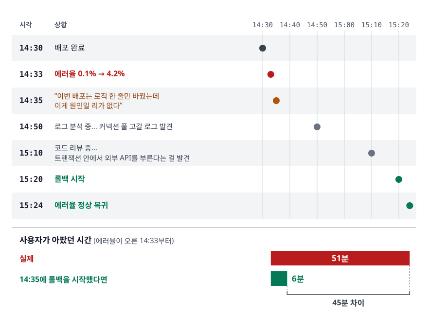
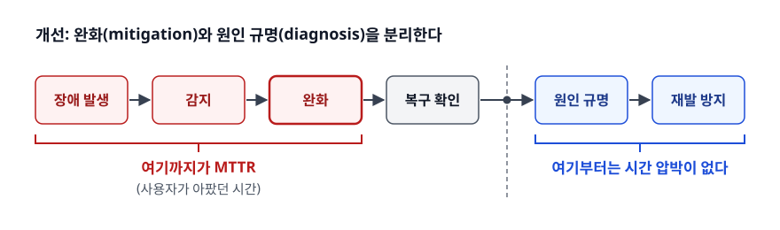
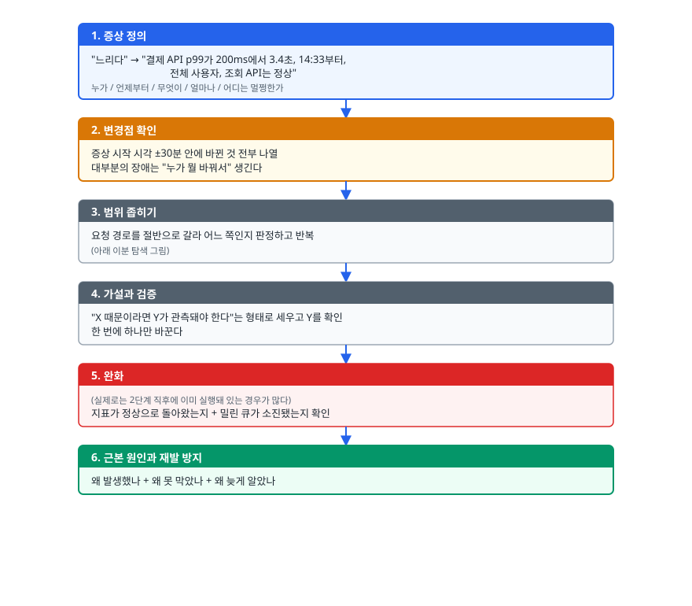
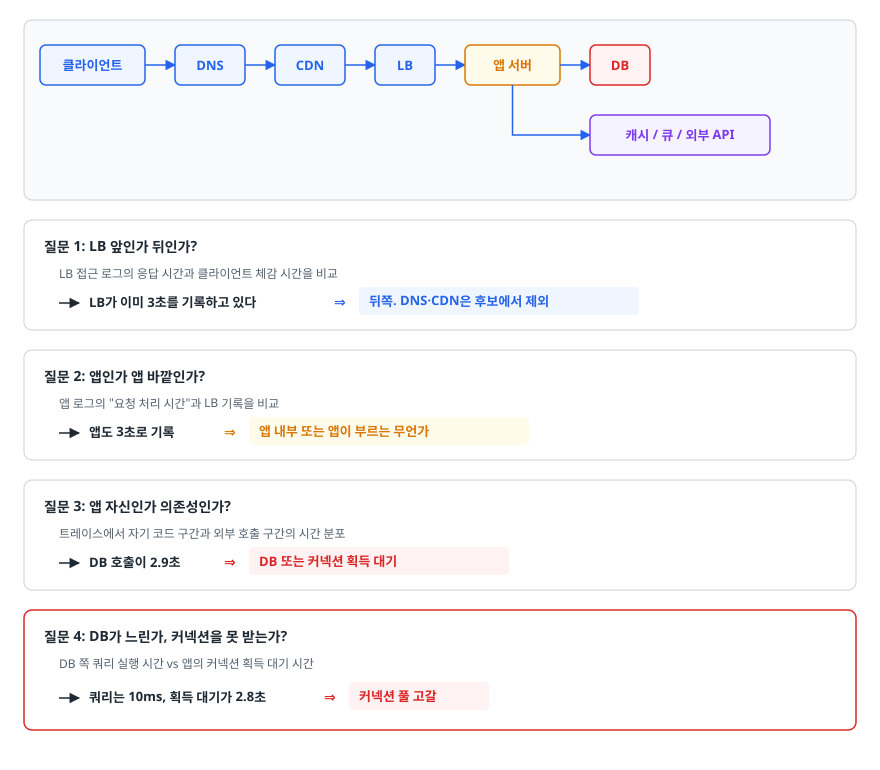
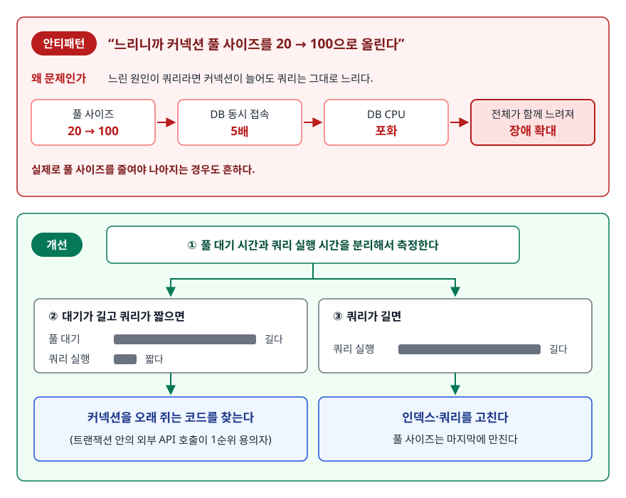
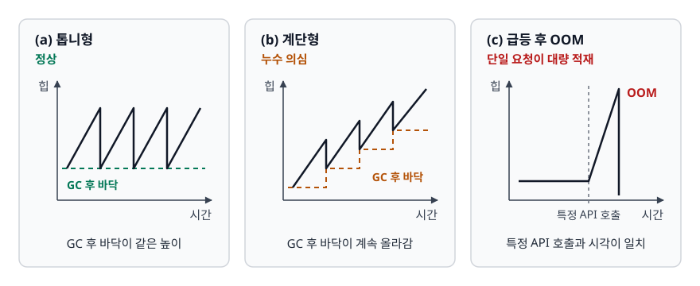
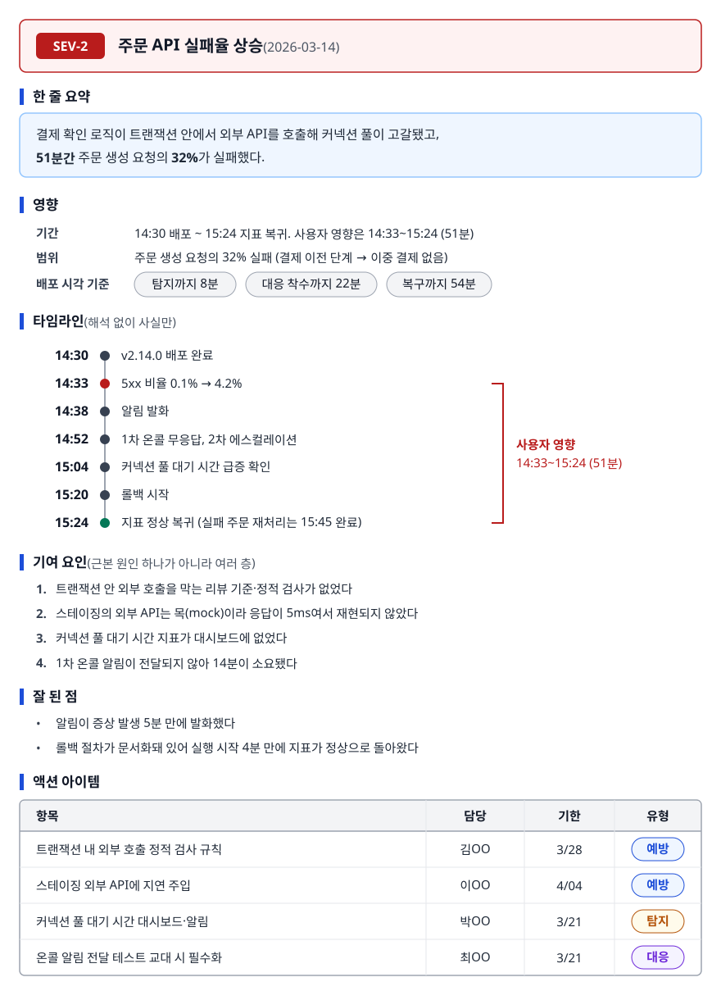

# 장애 대응 방법론 (Troubleshooting Method)

> 장애가 났을 때 무엇부터 해야 하는지, 후보를 어떻게 절반씩 줄여 나가는지, 그 경험을 면접에서 어떻게 이야기로 만드는지. 이 세 가지를 설명할 수 있게 됩니다.

## 학습 목표

- [ ] "원인 규명보다 서비스 복구가 먼저"인 이유를 지표로 설명할 수 있다
- [ ] 증상 정의부터 근본 원인까지 6단계 진단 절차를 순서대로 말할 수 있다
- [ ] 계층별 점검 체크리스트로 범위를 좁혀나갈 수 있다
- [ ] 응답 지연, 5xx 급증, 메모리 증가, 디스크 풀, 커넥션 고갈의 전형적 원인을 구분할 수 있다
- [ ] 비난 없는 포스트모템을 실제로 쓸 수 있다
- [ ] 트러블슈팅 경험을 STAR 포맷으로 2분 안에 말할 수 있다

## 선행 지식

- [../linux-networking/03-troubleshooting.md](../linux-networking/03-troubleshooting.md) - 서버 자원을 실제로 들여다보는 리눅스 명령어
- [../monitoring-observability/01-observability-concepts.md](../monitoring-observability/01-observability-concepts.md) - 메트릭·로그·트레이스의 역할 구분 (위 두 문서를 안 읽었어도 절차 자체는 이해할 수 있습니다)

---

## 1. 왜 방법론이 필요한가

### 장애 중에는 아는 게 많은 사람이 이기지 않는다

같은 팀에서 실력이 갈리는 지점은 아는 명령어 개수가 아닙니다. **후보를 줄이는 순서**입니다.

장애 알림이 울린 순간, 원인 후보는 대략 이렇습니다. 방금 나간 배포, 어제 바뀐 설정값, 갑자기 늘어난 트래픽, 만료된 인증서, 죽은 노드, 느려진 외부 API, 커지기만 하는 테이블, 어제부터 도는 배치, 캐시 만료 타이밍, 그리고 아직 아무도 생각 못 한 무언가. 수십 개입니다.

여기서 로그부터 여는 사람은 후보를 하나도 지우지 못한 채 몇만 줄을 읽기 시작합니다. 반면 "전체 API가 다 느린가, 특정 엔드포인트만인가"를 먼저 물으면 그 질문 하나로 후보의 절반이 사라집니다. 방법론이란 결국 **매 단계마다 후보를 절반씩 지우는 질문의 순서**입니다.

### 비유: 정전이 났을 때

집이 어두워지면 전구부터 갈아 끼우는 사람은 없습니다. 창밖을 봅니다. 동네 전체가 어두우면 한전 문제고, 우리 집만 어두우면 두꺼비집이고, 방 하나만 어두우면 그 방 회로입니다. 세 번의 확인으로 범위가 동네 → 집 → 회로 → 전구로 좁혀집니다.

> **비유의 한계**: 전기 회로는 상태가 없어서 원인이 사라지면 증상도 즉시 사라집니다. 소프트웨어는 캐시, 큐, 커넥션 풀, 스레드 풀처럼 상태를 들고 있어서 **원인이 이미 끝난 뒤에도 증상이 계속됩니다.** 외부 API가 잠깐 느렸다가 회복돼도, 그 사이 고갈된 커넥션 풀 때문에 장애가 한참 더 이어지는 일이 흔합니다. 그래서 "지금 이상한 것"이 아니라 "**가장 먼저 이상해진 것**"을 시간축에서 찾아야 합니다.

---

## 2. 첫 번째 원칙: 복구가 원인 규명보다 먼저다

### 안티패턴: 원인을 알 때까지 롤백하지 않는다

<!-- diagram:cloud-troubleshooting-method-1 -->


<!-- 위 그림이 대체한 원본 ASCII.
     내용을 고칠 때는 그림도 함께 갱신할 것.
```
14:30  배포 완료
14:33  에러율 0.1% → 4.2%
14:35  "이번 배포는 로직 한 줄만 바꿨는데 이게 원인일 리가 없다"
14:50  로그 분석 중... 커넥션 풀 고갈 로그 발견
15:10  코드 리뷰 중... 트랜잭션 안에서 외부 API를 부른다는 걸 발견
15:20  롤백 시작 → 15:24  에러율 정상 복귀
```
-->

**왜 문제인가**: 롤백 실행 자체는 4분이면 끝납니다. 14:35에 시작했다면 사용자가 아팠던 시간은 에러율이 오르기 시작한 14:33부터 6분입니다. 실제로는 51분이었습니다. 그 45분 동안 얻은 것은 "원인을 미리 알았다"는 것뿐인데, **원인 분석은 복구 후에 해도 결과가 똑같습니다.** 오히려 압박이 없는 상태에서 하는 분석이 더 정확합니다.

<!-- diagram:cloud-troubleshooting-method-2 -->


<!-- 위 그림이 대체한 원본 ASCII.
     내용을 고칠 때는 그림도 함께 갱신할 것.
```
개선: 완화(mitigation)와 원인 규명(diagnosis)을 분리한다

 장애 발생 ──▶ 감지 ──▶ 완화 ──▶ 복구 확인 ──┬──▶ 원인 규명 ──▶ 재발 방지
                          ▲                  │
                          │                  └─ 여기부터는 시간 압박이 없다
                   여기까지가 MTTR
                   (사용자가 아팠던 시간)
```
-->

원인 규명이 완화보다 앞에 오면 그 시간이 전부 MTTR에 더해집니다. 이 한 줄이 장애 대응 원칙의 전부라고 해도 과장이 아닙니다.

### 손에 쥐고 있어야 할 완화 카드

완화란 "원인을 몰라도 지금 당장 사용자 영향을 줄이는 조치"입니다. 장애가 나기 전에 미리 준비돼 있어야 쓸 수 있습니다.

| 완화 수단 | 언제 쓰나 | 준비돼 있어야 할 것 |
|-----------|----------|--------------------|
| 롤백 | 직전 배포와 시간이 겹칠 때 (1순위) | 원클릭 롤백 절차, 하위 호환 스키마 |
| 피처 플래그 끄기 | 특정 신규 기능만 문제일 때 | 배포 없이 끌 수 있는 플래그 |
| 스케일 아웃 | 트래픽 급증이 원인일 때 | 오토스케일 상한, 워밍업된 인스턴스 |
| 레이트 리밋 강화 | 비정상 트래픽·봇일 때 | 게이트웨이에서 즉시 조정 가능한 설정 |
| 트래픽 우회 | 특정 리전·존만 문제일 때 | 다중 AZ, 가중치 라우팅 |
| 기능 축소 | 부가 기능이 핵심 흐름을 잠식할 때 | 폴백 응답이 정의된 서킷 브레이커 |

### 완화를 하면 안 되는 예외

**데이터가 손상되고 있는 중이라면 재시작·롤백이 오히려 피해를 키웁니다.** 잘못된 마이그레이션이 돌고 있거나, 중복 결제가 발생 중이거나, 잘못된 값이 DB에 쌓이는 중이라면 첫 조치는 복구가 아니라 **차단**입니다. 해당 기능을 멈추고, 오염 범위를 확정하고, 그다음에 복구를 논합니다. "일단 서버를 재시작해보자"가 가장 위험한 순간이 이때입니다.

침해 사고가 의심될 때도 같습니다. 재시작이나 재배포는 프로세스 메모리와 로컬 로그 같은 증거를 함께 지워 버려서, 무슨 일이 있었는지 영원히 알 수 없게 만듭니다. 이때의 순서는 격리 → 증거 보전(스냅샷·로그 확보) → 자격 증명 교체 → 복구입니다.

---

## 3. 체계적 진단 절차

<!-- diagram:cloud-troubleshooting-method-3 -->


<!-- 위 그림이 대체한 원본 ASCII.
     내용을 고칠 때는 그림도 함께 갱신할 것.
```
┌─ 1. 증상 정의 ───────────────────────────────────────────────┐
│  "느리다" → "결제 API p99가 200ms에서 3.4초, 14:33부터,       │
│              전체 사용자, 조회 API는 정상"                     │
│  누가 / 언제부터 / 무엇이 / 얼마나 / 어디는 멀쩡한가            │
└───────────────────────┬──────────────────────────────────────┘
                        ▼
┌─ 2. 변경점 확인 ─────────────────────────────────────────────┐
│  증상 시작 시각 ±30분 안에 바뀐 것 전부 나열                    │
│  대부분의 장애는 "누가 뭘 바꿔서" 생긴다                        │
└───────────────────────┬──────────────────────────────────────┘
                        ▼
┌─ 3. 범위 좁히기 ─────────────────────────────────────────────┐
│  요청 경로를 절반으로 갈라 어느 쪽인지 판정하고 반복             │
│  (아래 이분 탐색 그림)                                         │
└───────────────────────┬──────────────────────────────────────┘
                        ▼
┌─ 4. 가설과 검증 ─────────────────────────────────────────────┐
│  "X 때문이라면 Y가 관측돼야 한다"는 형태로 세우고 Y를 확인       │
│  한 번에 하나만 바꾼다                                         │
└───────────────────────┬──────────────────────────────────────┘
                        ▼
┌─ 5. 완화 ────────────────────────────────────────────────────┐
│  (실제로는 2단계 직후에 이미 실행돼 있는 경우가 많다)            │
│  지표가 정상으로 돌아왔는지 + 밀린 큐가 소진됐는지 확인          │
└───────────────────────┬──────────────────────────────────────┘
                        ▼
┌─ 6. 근본 원인과 재발 방지 ───────────────────────────────────┐
│  왜 발생했나 + 왜 못 막았나 + 왜 늦게 알았나                    │
└──────────────────────────────────────────────────────────────┘
```
-->

### 1단계. 증상을 숫자로 정의한다

"서비스가 느려요"는 진단의 출발점이 될 수 없습니다. 다섯 가지를 채워야 합니다.

- **누가**: 전체 사용자인가, 특정 리전·디바이스·요금제인가
- **언제부터**: 정확한 시각. 이 시각이 2단계의 검색 키입니다
- **무엇이**: 어떤 엔드포인트, 어떤 화면
- **얼마나**: p50인가 p99인가, 평소 값 대비 몇 배인가
- **어디는 멀쩡한가**: 이게 가장 강력합니다. 정상인 부분이 후보를 지웁니다

마지막 항목을 빠뜨리는 사람이 많습니다. "결제만 느리고 조회는 정상"이면 공용 인프라(LB, DNS, 노드)는 후보에서 즉시 빠집니다. 반대로 "모든 API가 균일하게 느리다"면 개별 쿼리가 아니라 공용 자원을 의심해야 합니다.

### 2단계. 변경점부터 확인한다

경험상 장애의 상당수는 자연 발생이 아니라 **누군가 뭔가를 바꿔서** 생깁니다. 그래서 증상이 시작된 시각을 기준으로 이 목록을 훑는 것이 가장 효율이 높습니다.

| 변경 유형 | 확인 방법 | 자주 놓치는 것 |
|-----------|----------|---------------|
| 애플리케이션 배포 | 배포 히스토리, `kubectl rollout history` | 다른 팀의 배포 |
| 설정 변경 | ConfigMap/환경변수 변경 이력 | 배포 없이 반영되는 설정 |
| 피처 플래그 | 플래그 변경 로그 | 점진 롤아웃이 오늘 50%로 올라간 경우 |
| 인프라 변경 | Terraform 적용 이력, 보안 그룹 | 네트워크 정책, IAM 권한 |
| 데이터·트래픽 | 테이블 행 수, RPS 그래프 | "코드는 그대로인데 데이터가 임계점을 넘음" |
| 시간 기반 | 배치 스케줄, 인증서 만료, 토큰 만료 | 매월 1일, 매주 월요일에만 나는 장애 |
| 외부 의존성 | 서드파티 상태 페이지 | PG사·인증사의 조용한 성능 저하 |

마지막 두 행이 중요합니다. "우리는 아무것도 안 바꿨다"고 확신하는 장애의 상당수가 **시간이 바꾼 것**(인증서 만료, 데이터 누적)이거나 **남이 바꾼 것**(외부 API)입니다.

### 3단계. 이분 탐색으로 범위를 좁힌다

<!-- diagram:cloud-troubleshooting-method-4 -->


<!-- 위 그림이 대체한 원본 ASCII.
     내용을 고칠 때는 그림도 함께 갱신할 것.
```
클라이언트 ─▶ DNS ─▶ CDN ─▶ LB ─▶ 앱 서버 ─▶ DB
                                    │
                                    └─▶ 캐시 / 큐 / 외부 API

질문 1: LB 앞인가 뒤인가?
   LB 접근 로그의 응답 시간과 클라이언트 체감 시간을 비교
   → LB가 이미 3초를 기록하고 있다   ⇒ 뒤쪽. DNS·CDN은 후보에서 제외

질문 2: 앱인가 앱 바깥인가?
   앱 로그의 "요청 처리 시간"과 LB 기록을 비교
   → 앱도 3초로 기록  ⇒ 앱 내부 또는 앱이 부르는 무언가

질문 3: 앱 자신인가 의존성인가?
   트레이스에서 자기 코드 구간과 외부 호출 구간의 시간 분포
   → DB 호출이 2.9초  ⇒ DB 또는 커넥션 획득 대기

질문 4: DB가 느린가, 커넥션을 못 받는가?
   DB 쪽 쿼리 실행 시간 vs 앱의 커넥션 획득 대기 시간
   → 쿼리는 10ms, 획득 대기가 2.8초  ⇒ 커넥션 풀 고갈
```
-->

각 질문은 "구간을 절반으로 가르는 관측 지점이 있는가"에 달려 있습니다. 관측 지점이 없으면 이분 탐색이 불가능해서 추측으로 돌아갑니다. 분산 트레이싱을 붙이는 진짜 이유가 이것입니다.

### 4단계. 반증 가능한 가설을 세운다

좋은 가설은 **틀렸을 때 틀렸다고 판정되는** 형태입니다.

| 나쁜 가설 | 왜 나쁜가 | 좋은 가설 |
|-----------|----------|----------|
| "DB가 문제인 것 같다" | 확인할 대상이 없다 | "인덱스 없는 풀스캔이 원인이라면, 슬로우 쿼리 로그에 해당 쿼리가 있고 `EXPLAIN`에 풀스캔이 나와야 한다" |
| "메모리가 부족한 듯" | 결과일 수도 원인일 수도 | "메모리 누수라면 재시작 후 시간에 비례해 GC 후 힙 사용량(바닥)이 단조 증가해야 한다" |
| "트래픽이 몰려서" | 반증할 수 없다 | "트래픽이 원인이라면 RPS 증가 시점이 지연 증가 시점보다 앞서야 한다" |

세 번째 예시의 **시간 순서 확인**은 인과와 상관을 가르는 가장 값싼 도구입니다. 지연이 먼저 늘고 RPS가 나중에 늘었다면 트래픽은 원인이 아니라 재시도가 만든 결과입니다.

그리고 **한 번에 하나만 바꿉니다.** 풀 사이즈를 늘리면서 인스턴스도 늘리고 캐시 TTL도 바꾸면, 복구는 되지만 무엇이 효과가 있었는지 영원히 모릅니다. 다음 장애 때 같은 상황에서 같은 시간이 다시 걸립니다.

---

## 4. 계층별 점검 체크리스트

각 계층에서 "이 계층이 범인일 때만 나타나는 신호"를 정리한 표입니다. 순서대로 훑는 용도가 아니라, 3단계에서 좁혀진 계층에 대해 확인할 항목을 고르는 용도입니다.

| 계층 | 대표 증상 | 확인할 것 | 이 계층이 범인일 때의 특징 |
|------|----------|----------|--------------------------|
| DNS | 간헐적 전면 실패, 특정 클라이언트만 | 레코드 TTL, 리졸버 응답 | 재시도하면 성공, 지역별로 다름 |
| CDN·엣지 | 정적 자원만 느림/404 | 캐시 히트율, 오리진 요청 수 | 히트율이 급락하며 오리진 부하가 함께 상승 |
| 로드밸런서 | 5xx가 앱 로그에 없음 | 헬스체크 실패 수, 백엔드 정상 수 | **앱 로그에 흔적이 없는 5xx**는 거의 LB/게이트웨이 |
| 앱 인스턴스 | 일부 파드만 느림 | 파드별 지표 분포 | 평균은 멀쩡한데 p99만 나쁘다 |
| 런타임(JVM 등) | 주기적 스파이크 | GC 일시정지 시간·빈도, 힙 추이 | 톱니 모양 힙, 일정 주기의 지연 스파이크 |
| 스레드·커넥션 풀 | 요청이 큐에서 대기 | 활성/대기 스레드 수, 풀 대기 시간 | **자원 사용률은 낮은데 응답만 느림** |
| DB | 특정 쿼리만 느림 | 슬로우 쿼리, 락 대기, 활성 세션 수 | 쓰기만 또는 읽기만 선택적으로 느림 |
| 캐시 | 갑작스러운 DB 부하 | 히트율, eviction 수, 메모리 | 히트율 하락이 DB 부하 상승보다 먼저 |
| 메시지 큐 | 결과가 늦게 반영됨 | 컨슈머 랙, 백로그 크기 | API는 빠른데 후속 처리가 안 됨 |
| 외부 API | 특정 기능만 실패 | 호출 지연 분포, 서킷 상태 | 우리 지표는 다 정상인데 에러율만 상승 |
| 노드·인프라 | 특정 노드의 파드만 | 노드 상태, 디스크, 네트워크 | 파드를 다른 노드로 옮기면 해결됨 |

> 표 요약: **"자원 사용률이 낮은데 느리다"면 거의 항상 풀 대기·락·외부 의존성이고, "자원 사용률이 높아서 느리다"면 CPU·메모리·디스크 중 하나입니다.** 이 한 갈래만 먼저 판정해도 절반이 갈립니다.

---

## 5. 흔한 장애 유형별 전형적 원인

### 응답 지연 증가

전형적 원인을 확률 순으로 두면 대개 이렇습니다. ① 느린 쿼리 또는 N+1, ② 커넥션·스레드 풀 대기, ③ 외부 API 지연 전파, ④ GC 일시정지, ⑤ 캐시 히트율 하락.

판별 순서는 "**전체가 균일하게 느린가, 꼬리만 느린가**"입니다. p50까지 같이 올라갔다면 공용 자원(풀, DB, 외부 의존성)이고, p50은 그대로인데 p99만 튀었다면 GC나 일부 요청의 특수 경로(캐시 미스, 대용량 응답)를 봅니다.

<!-- diagram:cloud-troubleshooting-method-5 -->


<!-- 위 그림이 대체한 원본 ASCII.
     내용을 고칠 때는 그림도 함께 갱신할 것.
```
안티패턴: "느리니까 커넥션 풀 사이즈를 20 → 100으로 올린다"

왜 문제인가:
  느린 원인이 쿼리라면 커넥션이 늘어도 쿼리는 그대로 느리다.
  오히려 DB에 동시 접속이 5배 들어가 DB CPU가 포화되고,
  전체가 함께 느려져 장애가 확대된다.
  실제로 풀 사이즈를 줄여야 나아지는 경우도 흔하다.

개선:
  1) 풀 대기 시간과 쿼리 실행 시간을 분리해서 측정한다
  2) 대기가 길고 쿼리가 짧으면  → 커넥션을 오래 쥐는 코드를 찾는다
     (트랜잭션 안의 외부 API 호출이 1순위 용의자)
  3) 쿼리가 길면 → 인덱스·쿼리를 고친다. 풀 사이즈는 마지막에 만진다
```
-->

### 5xx 급증

앱 로그에 스택 트레이스가 있는가부터 확인합니다.

- **앱 로그에 예외가 있습니다** → 코드·데이터 문제. 직전 배포 확인 후 롤백
- **앱 로그가 조용한데 5xx가 납니다** → 앱에 요청이 도달하지 못한 것입니다. LB 헬스체크 실패, 파드 재시작, 타임아웃으로 인한 게이트웨이 502/504
- **502/504가 섞여 있습니다** → 백엔드가 죽었거나(502) 응답이 제한 시간을 넘겼습니다(504). 후자는 사실 "지연 장애"이므로 위 항목으로 넘어갑니다

### 메모리 사용량이 계속 증가

메모리 증가는 그 자체로 장애가 아니라 **증가 곡선의 모양**이 진단입니다.

<!-- diagram:cloud-troubleshooting-method-7 -->


<!-- 위 그림이 대체한 원본 ASCII.
     내용을 고칠 때는 그림도 함께 갱신할 것.
```
(a) 톱니형 ─ 정상            (b) 계단형 ─ 누수 의심
 힙 │  /|  /|  /|             힙 │      ______/
    │ / | / | / |                │  ___/
    │/  |/  |/  |                │_/
    └──────────── 시간           └──────────── 시간
  GC 후 바닥이 같은 높이         GC 후 바닥이 계속 올라감

(c) 급등 후 OOM ─ 단일 요청이 대량 적재
 힙 │        /|
    │_______/ |
    └──────────── 시간   특정 API 호출과 시각이 일치
```
-->

(b)의 전형적 원인은 무한히 커지는 캐시(`HashMap`에 넣기만 하고 지우지 않음), 해제하지 않은 리스너, `remove()`하지 않은 `ThreadLocal`, 닫히지 않은 커넥션·스트림입니다. (c)는 페이지네이션 없는 전체 조회가 대부분입니다.

### 디스크 풀

`df -h`가 100%인데 큰 파일이 안 보이면 세 가지를 의심합니다.

1. **삭제됐지만 열려 있는 파일** — 로그를 `rm` 했는데 프로세스가 아직 핸들을 쥐고 있으면 용량이 반환되지 않습니다. 프로세스를 재시작하거나 로그 로테이션을 제대로 설정해야 합니다
2. **inode 고갈** — 용량은 남았는데 파일 개수 한도에 걸린 경우입니다. `df -i`로 확인합니다. 세션 파일, 임시 파일이 수백만 개 쌓인 상황
3. **다른 마운트 포인트** — 루트는 여유 있는데 데이터 볼륨만 꽉 찬 경우

디스크가 차면 DB가 쓰기를 거부하고, 로그를 못 남겨 진단도 어려워집니다. **사용률 80% 알림은 성능이 아니라 진단 가능성을 지키기 위한 것**입니다.

### 커넥션 고갈

`Connection is not available` 류의 에러는 원인이 아니라 결과입니다. 세 가지 중 하나입니다.

| 실제 원인 | 구분법 | 대응 |
|-----------|--------|------|
| 커넥션을 오래 점유 | 쿼리는 빠른데 트랜잭션이 길다 | 트랜잭션 안의 외부 호출·대기 제거 |
| 커넥션 반환 누락(누수) | 시간이 갈수록 가용 커넥션이 단조 감소 | `try-with-resources`, 누수 감지 옵션 |
| 진짜 용량 부족 | 모든 커넥션이 짧게 바쁘고 대기가 김 | 풀 사이즈 상향(단, DB 한계 안에서) |

세 번째만 풀 사이즈로 해결되는데, 실무에서 만나는 대부분은 첫 번째입니다. **인스턴스 수 × 풀 사이즈가 DB의 최대 접속 수를 넘지 않는지**도 함께 확인해야 합니다. 오토스케일로 파드가 늘어나는 순간 DB가 먼저 무너지는 사고가 여기서 나옵니다.

---

## 6. 비난 없는 포스트모템

### 목적은 기록이 아니라 학습이다

포스트모템에서 사람을 지목하면 결과는 하나입니다. **다음부터 아무도 사실을 말하지 않습니다.** "제가 그 명령을 실행했습니다"라는 진술이 징계로 이어지는 조직에서는 진짜 원인이 영원히 드러나지 않습니다.

비난 없는 포스트모템은 면죄부가 아니라 방법론입니다. "**그 시점에 그 사람이 가진 정보로는 그 판단이 합리적이었다**"를 전제로 두면, 질문이 "왜 실수했나"에서 "**왜 그 실수가 가능했고 시스템이 왜 못 막았나**"로 바뀝니다. 후자에서만 실행 가능한 개선안이 나옵니다.

### 좋은 문장 vs 나쁜 문장

| 사람을 보는 문장 | 시스템을 보는 문장 |
|-----------------|-------------------|
| "설정을 잘못 입력했다" | "잘못된 설정값이 검증 없이 전체에 즉시 적용됐다" |
| "테스트를 안 했다" | "이 시나리오를 검증하는 테스트가 파이프라인에 없었다" |
| "확인이 늦었다" | "판단에 필요한 지표가 대시보드에 없었다" |
| "경험이 부족했다" | "런북이 없어 대응이 개인 지식에 의존했다" |

### 템플릿

<!-- diagram:cloud-troubleshooting-method-6 -->


<!-- 위 그림이 대체한 원본 ASCII.
     내용을 고칠 때는 그림도 함께 갱신할 것.
```markdown
# [SEV-2] 주문 API 실패율 상승 (2026-03-14)

## 한 줄 요약
결제 확인 로직이 트랜잭션 안에서 외부 API를 호출해 커넥션 풀이 고갈됐고,
51분간 주문 생성 요청의 32%가 실패했다.

## 영향
- 기간: 14:30 배포 ~ 15:24 지표 복귀. 사용자 영향은 14:33~15:24 (51분)
- 범위: 주문 생성 요청의 32% 실패 (결제 이전 단계 → 이중 결제 없음)
- 배포 시각 기준 탐지까지 8분 / 대응 착수까지 22분 / 복구까지 54분

## 타임라인 (해석 없이 사실만)
14:30  v2.14.0 배포 완료
14:33  5xx 비율 0.1% → 4.2%
14:38  알림 발화
14:52  1차 온콜 무응답, 2차 에스컬레이션
15:04  커넥션 풀 대기 시간 급증 확인
15:20  롤백 시작
15:24  지표 정상 복귀 (실패 주문 재처리는 15:45 완료)

## 기여 요인 (근본 원인 하나가 아니라 여러 층)
1. 트랜잭션 안 외부 호출을 막는 리뷰 기준·정적 검사가 없었다
2. 스테이징의 외부 API는 목(mock)이라 응답이 5ms여서 재현되지 않았다
3. 커넥션 풀 대기 시간 지표가 대시보드에 없었다
4. 1차 온콜 알림이 전달되지 않아 14분이 소요됐다

## 잘 된 점
- 알림이 증상 발생 5분 만에 발화했다
- 롤백 절차가 문서화돼 있어 실행 시작 4분 만에 지표가 정상으로 돌아왔다

## 액션 아이템
| 항목 | 담당 | 기한 | 유형 |
|------|------|------|------|
| 트랜잭션 내 외부 호출 정적 검사 규칙 | 김OO | 3/28 | 예방 |
| 스테이징 외부 API에 지연 주입 | 이OO | 4/04 | 예방 |
| 커넥션 풀 대기 시간 대시보드·알림 | 박OO | 3/21 | 탐지 |
| 온콜 알림 전달 테스트 교대 시 필수화 | 최OO | 3/21 | 대응 |
```
-->

액션 아이템에 **담당자와 기한이 없으면 아무도 하지 않습니다.** 그리고 유형을 예방/탐지/대응으로 나누는 이유는, 대부분의 조직이 예방에만 항목을 몰아넣기 때문입니다. 예방은 완벽할 수 없으므로 탐지·대응 개선이 실제로는 더 큰 효과를 냅니다. 포스트모템 작성의 더 자세한 기준과 알림 설계는 [../monitoring-observability/05-alerting-oncall.md](../monitoring-observability/05-alerting-oncall.md)에 있습니다.

---

## 7. 면접에서 트러블슈팅 경험 말하기

### 나쁜 답변과 좋은 답변

**나쁜 답변**

> "서버가 느려진 적이 있었는데, 로그를 보고 원인을 찾아서 코드를 수정했더니 해결됐습니다. 그 이후로 모니터링을 강화했습니다."

무엇이 문제일까요? 증상이 숫자로 나와 있지 않고, 진단 과정에 판단이 보이지 않습니다. "로그를 보고 찾았다"에는 어떻게 좁혔는지가 빠져 있습니다. 결과도 정량화되지 않았고, "모니터링 강화"가 무엇인지 알 수 없습니다. 면접관 입장에서 이 답변으로는 지원자가 실제로 무엇을 했는지 판정할 수 없습니다.

**좋은 답변 (STAR)**

> **[S]** 사내 정산 API를 운영했는데, 월초 배치가 도는 시간대에만 p99 응답 시간이 평소 300ms에서 8초까지 올라가는 문제가 있었습니다. 월 1회만 발생해서 3개월간 원인 미상으로 남아 있었습니다.
>
> **[T]** 저는 이 API의 담당자로서, 재현이 어려운 이 지연의 원인을 규명하고 다음 월초 전까지 조치하는 게 목표였습니다.
>
> **[A]** 먼저 "월초에만"이라는 조건에서 시간 기반 변경점을 의심하고 배치 스케줄을 전부 나열했습니다. 정산 배치가 같은 DB에 대량 쓰기를 하는 시간과 지연 구간이 정확히 겹쳤습니다. 다만 배치 때문이라면 모든 API가 느려야 하는데 조회 API는 정상이었습니다. 그래서 "배치가 특정 테이블에 락을 잡고, 정산 API만 그 테이블을 쓴다"는 가설을 세웠고, 락 대기 지표를 수집해 배치 시각과 일치하는 것을 확인했습니다. 조치는 두 단계로 했습니다. 즉시 조치로 배치를 트래픽이 적은 새벽 시간대로 옮겼고, 근본 조치로 배치를 한 번에 처리하던 것을 1만 건 단위 청크로 나눠 락 점유 시간을 줄였습니다.
>
> **[R]** 다음 월초에 p99가 8초에서 420ms로 떨어졌고, 이후 6개월간 재발하지 않았습니다. 부수적으로 "락 대기 시간" 지표를 대시보드에 추가해서, 이후 다른 팀이 비슷한 문제를 이틀 만에 찾아낸 사례가 있었습니다.

### 무엇이 달라졌나

| 항목 | 나쁜 답변 | 좋은 답변 |
|------|----------|----------|
| 증상 | "느려졌다" | "p99 300ms → 8초, 월초에만" |
| 범위 좁히기 | 없음 | "조회 API는 정상"으로 후보 제거 |
| 가설 | 없음 | 반증 가능한 가설 + 검증 지표 |
| 조치 | "코드 수정" | 즉시 조치와 근본 조치를 분리 |
| 결과 | "해결됐다" | 8초 → 420ms, 6개월 무재발 |
| 확장 | "모니터링 강화" | 추가한 지표가 다른 팀에 재사용됨 |

### 꼬리 질문 대비

트러블슈팅 이야기에는 거의 정해진 꼬리 질문이 따라옵니다. 미리 답을 준비해두면 이야기의 신뢰도가 올라갑니다.

- "다른 가설은 없었나요?" → 세웠다가 기각한 가설과 **기각한 근거**를 말할 수 있어야 합니다
- "왜 3개월이나 걸렸나요?" / "지금 다시 한다면?" → 관측 가능성의 한계를 비난 없이 짚고, "락 대기 지표를 처음부터 봤다면 하루면 끝났다"처럼 구체적으로 답합니다
- "본인이 한 건 어디까지인가요?" → 팀이 한 일과 본인이 한 일을 정확히 구분해서 답합니다

---

## 8. 실무에서는

- **런북(Runbook)이 개인 역량을 팀 역량으로 바꿉니다.** 잘 쓴 런북은 "증상 → 확인할 대시보드 링크 → 판단 기준 → 조치 명령"이 한 페이지에 있어서, 그 시스템을 모르는 사람도 1차 대응을 할 수 있습니다. 포스트모템의 액션 아이템에 런북 갱신이 자주 들어가는 이유입니다.
- **인시던트 채널에 진행 상황을 계속 흘립니다.** 혼자 조용히 고치는 것이 빨라 보이지만, 다른 팀이 같은 시각에 겪는 증상을 공유하면 범위 좁히기가 훨씬 빨라집니다. 기록 자체가 나중에 타임라인이 됩니다.
- **재현 환경이 없으면 진단은 추측이 됩니다.** 스테이징의 외부 API가 목이고, 데이터가 100건이고, 인스턴스가 1대라면 운영에서만 나는 문제는 영원히 재현되지 않습니다. 지연 주입, 데이터 볼륨 모사 같은 투자가 장애 대응 시간을 직접 줄입니다. 반대로 모든 장애에 정식 포스트모템을 요구하면 아무도 제대로 쓰지 않으므로, 심각도(SEV) 등급을 정해 상위 등급만 정식으로 남깁니다.

---

## 9. 면접 포인트

> 면접에서 이 주제가 나오면 이렇게 답한다

**Q. 서비스 장애가 발생하면 가장 먼저 무엇을 하나요?**

A. 증상을 숫자로 정의하고, 완화 수단을 먼저 실행합니다. "느리다"가 아니라 "결제 API p99가 몇 시부터 몇 배가 됐고 어떤 요청은 정상인가"까지 확정해야 후보를 줄일 수 있습니다. 그리고 직전 배포와 시간이 겹치면 원인을 몰라도 롤백합니다. 원인 규명을 완화 앞에 두면 그 시간이 전부 사용자가 아픈 시간에 더해지는데, 원인 분석은 복구 후에 해도 결과가 같기 때문입니다.
- 꼬리 질문: "롤백이 항상 정답인가요?" → 아닙니다. 데이터가 손상되는 중이거나 스키마 변경이 이미 적용된 경우 롤백이 더 위험합니다. 이때는 복구가 아니라 해당 기능 차단이 먼저입니다.

**Q. 원인을 어떻게 좁혀 나가나요?**

A. 요청 경로를 절반씩 가르는 이분 탐색으로 접근합니다. LB 앞인가 뒤인가, 앱 내부인가 의존성인가, DB가 느린가 커넥션을 못 받는가 순으로 각 구간의 관측 지표를 비교해 판정합니다. 그리고 가설은 반드시 "X 때문이라면 Y가 관측돼야 한다" 형태로 세워서 틀렸을 때 바로 버릴 수 있게 합니다. 조치는 한 번에 하나만 바꿔야 무엇이 효과가 있었는지 남습니다.
- 꼬리 질문: "관측 지점이 없는 구간은요?" → 그 구간은 이분 탐색이 불가능하므로 추측으로 돌아갑니다. 그래서 사후 액션 아이템에 그 구간의 지표 추가가 들어갑니다.

**Q. 자원 사용률은 정상인데 응답이 느립니다. 무엇을 의심하나요?**

A. CPU·메모리·디스크가 여유로운데 느리면 대기 계열입니다. 커넥션 풀이나 스레드 풀에서 획득을 기다리는 대기, DB 락 경합, 외부 API 응답 지연 전파가 대표적입니다. 그래서 저는 "쿼리 실행 시간"과 "커넥션 획득 대기 시간"을 항상 분리해서 봅니다. 둘을 합쳐서 보면 풀 사이즈만 늘리는 잘못된 조치로 이어지기 쉽습니다.
- 꼬리 질문: "풀 사이즈를 늘리면 왜 나빠질 수 있나요?" → 병목이 DB면 동시 접속만 늘어 DB가 포화되고, 인스턴스 수 × 풀 사이즈가 DB 최대 접속 수를 넘으면 다른 서비스까지 함께 죽습니다.

**Q. 포스트모템을 왜 비난 없이 써야 하나요?**

A. 사람을 지목하면 다음부터 사실이 보고되지 않고, 그러면 진짜 원인이 드러나지 않기 때문입니다. "그 시점의 정보로는 합리적인 판단이었다"를 전제로 두면 질문이 "왜 실수했나"에서 "왜 그 실수가 가능했고 시스템이 왜 못 막았나"로 바뀌고, 후자에서만 실행 가능한 개선안이 나옵니다. 액션 아이템은 담당자와 기한을 붙이고 예방·탐지·대응으로 유형을 나눠서 한쪽에 쏠리지 않게 합니다.
- 꼬리 질문: "근본 원인은 하나로 정리해야 하지 않나요?" → 실제 장애는 여러 요인이 겹쳐서 납니다. 5 Whys로 선형 사슬 하나를 뽑는 것보다 기여 요인을 여러 개 나열하는 편이 현실에 가깝습니다.

---

## 자주 하는 실수

| 실수 | 왜 틀렸나 | 올바른 이해 |
|------|----------|-----------|
| 원인을 알아야 조치할 수 있다 | 완화는 원인을 몰라도 가능하다 | 완화와 진단은 별개 트랙. 완화가 먼저 |
| 에러 로그부터 전부 읽는다 | 후보를 하나도 지우지 못한 채 시간만 쓴다 | 증상 정의와 변경점 확인으로 범위를 먼저 좁힌다 |
| 지표가 이상한 것 = 원인 | 결과가 원인처럼 보이는 경우가 흔하다 | 시간축에서 **가장 먼저** 이상해진 지표를 찾는다 |
| 여러 조치를 한꺼번에 적용 | 복구는 되지만 무엇이 효과였는지 모른다 | 한 번에 하나. 재발 시 대응 시간이 결정된다 |
| 커넥션 고갈 = 풀 사이즈 부족 | 대부분은 점유 시간이 길거나 반환 누락이다 | 획득 대기 시간과 쿼리 시간을 분리해 측정 |
| "우리는 아무것도 안 바꿨다" | 시간(인증서·데이터 누적)과 남(외부 API)이 바꾼다 | 변경점 목록에 시간 기반·외부 의존성을 포함 |

---

## 한 줄 정리

장애 대응은 원인을 맞히는 시합이 아니라 **사용자가 아픈 시간을 줄이는 일**입니다. 방법은 완화를 먼저 실행한 뒤, 증상 정의 → 변경점 → 이분 탐색 → 반증 가능한 가설의 순서로 후보를 절반씩 지워 나가는 것입니다.

---

## 연관 개념

- [02-system-design-interview.md](./02-system-design-interview.md) - 같은 시스템을 만드는 쪽에서 보는 설계 면접 진행법
- [03-behavioral-star.md](./03-behavioral-star.md) - STAR 포맷과 결과 정량화를 더 깊이 다룹니다
- [qna-troubleshooting.md](./qna-troubleshooting.md) - 장애 유형별 면접 질문과 답변 예시
- [../linux-networking/03-troubleshooting.md](../linux-networking/03-troubleshooting.md) - 서버 자원을 직접 확인하는 명령어와 판독법
- [../kubernetes/05-troubleshooting.md](../kubernetes/05-troubleshooting.md) - 파드·노드 레벨 장애 진단
- [../monitoring-observability/05-alerting-oncall.md](../monitoring-observability/05-alerting-oncall.md) - 알림 설계, 온콜 역할 분담, 포스트모템 상세
- [../monitoring-observability/04-distributed-tracing.md](../monitoring-observability/04-distributed-tracing.md) - 이분 탐색을 가능하게 하는 관측 지점 확보
- [../devops-cicd/03-deployment-strategies.md](../devops-cicd/03-deployment-strategies.md) - 롤백을 빠르게 만드는 배포 전략
- [../../09-system-design/performance/01-performance-optimization.md](../../09-system-design/performance/01-performance-optimization.md) - 지연 장애의 근본 조치
