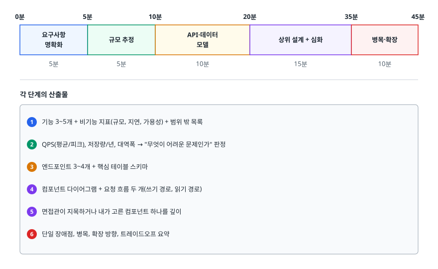
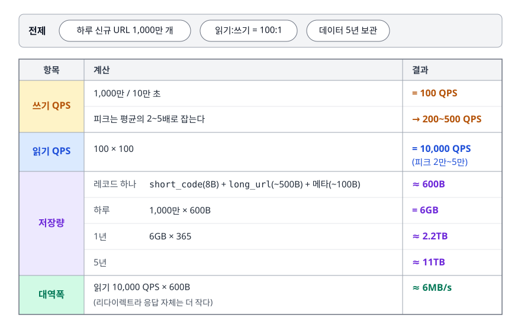
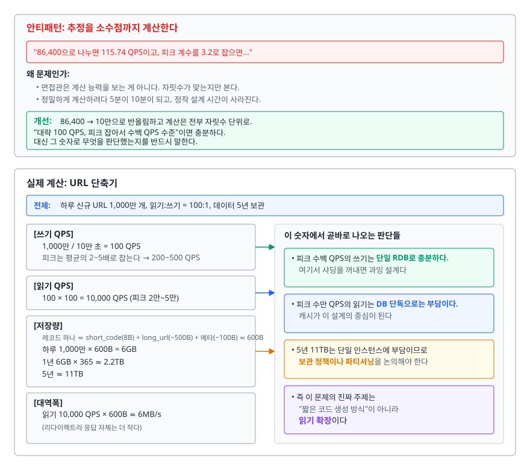
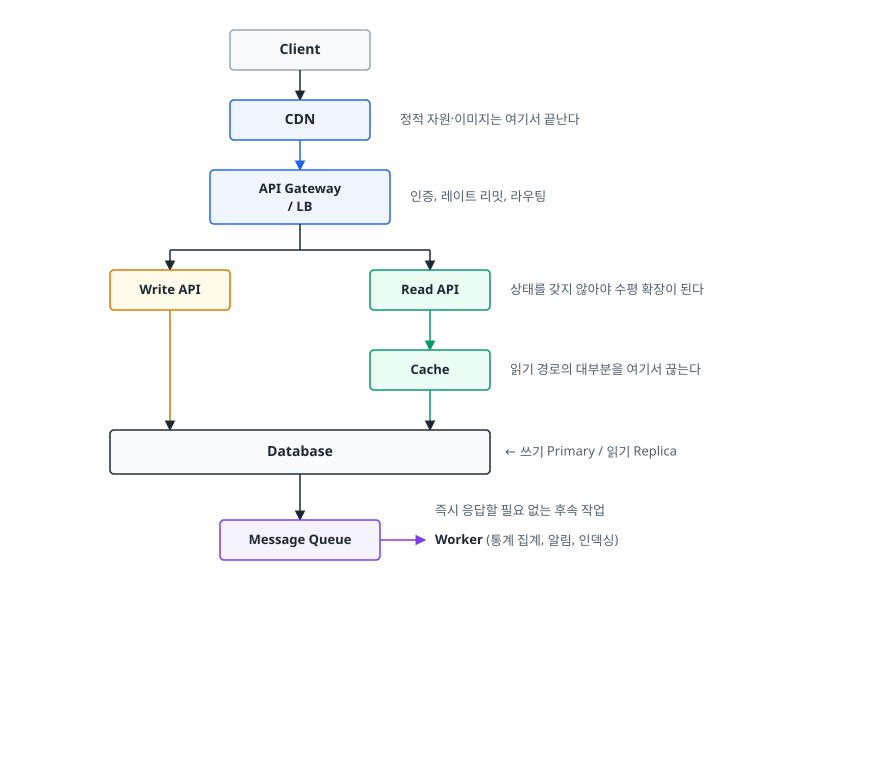
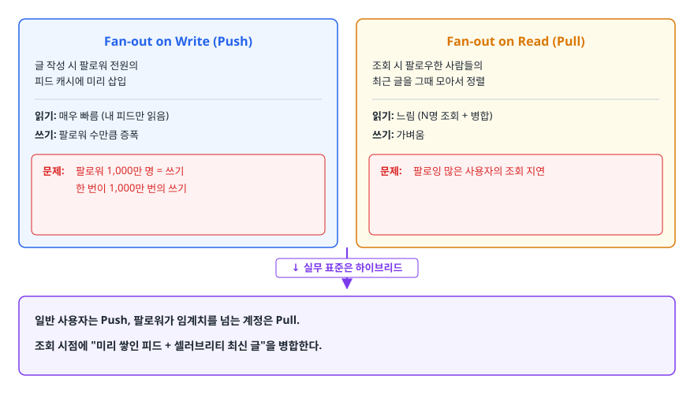

# 시스템 설계 면접 (System Design Interview)

> 45분이라는 시간을 어떤 순서로 쓰는지, 규모 추정이 왜 설계를 바꾸는지, 그리고 면접관이 실제로 채점하는 것이 무엇인지 설명할 수 있게 된다.

## 학습 목표

- [ ] 시스템 설계 면접이 정답이 아니라 무엇을 평가하는지 말할 수 있다
- [ ] 45분을 6단계로 나눠 진행할 수 있다
- [ ] 요구사항을 좁히는 질문과 시간만 쓰는 질문을 구분할 수 있다
- [ ] DAU에서 QPS·저장량·대역폭을 암산으로 뽑아낼 수 있다
- [ ] URL 단축기·뉴스피드·채팅·알림의 핵심 논점을 각각 한 문장으로 말할 수 있다
- [ ] 지원자가 흔히 떨어지는 지점을 피할 수 있다

## 선행 지식

- [../../09-system-design/scalability/02-load-balancing-sharding.md](../../09-system-design/scalability/02-load-balancing-sharding.md) - 수평 확장과 샤딩
- [../../09-system-design/caching/01-caching-strategies.md](../../09-system-design/caching/01-caching-strategies.md) - 캐시 패턴과 무효화
- [../../09-system-design/scalability/01-cap-consistency.md](../../09-system-design/scalability/01-cap-consistency.md) - 일관성 모델과 트레이드오프

---

## 1. 이 면접이 평가하는 것

### 정답이 없는 문제를 내는 이유

"트위터를 설계해보세요"에 정답이 있을 리 없다. 실제 트위터도 십수 년간 구조를 여러 번 바꿨다. 그런데도 이 문제를 내는 이유는, **답이 없는 문제를 다루는 방식이 실무의 대부분**이기 때문이다. 실무에서 주어지는 요구사항은 항상 불완전하고, 선택지는 여러 개이고, 어느 것도 완전히 옳지 않다.

면접관이 채점하는 축은 대략 이렇다.

| 평가 축 | 좋은 신호 | 나쁜 신호 |
|---------|----------|----------|
| 요구사항 명확화 | 범위를 좁히는 질문을 먼저 한다 | 문제를 듣자마자 박스를 그린다 |
| 규모 감각 | 숫자로 "이 정도면 단일 DB로 된다"를 판단 | 규모와 무관하게 항상 샤딩·Kafka를 넣는다 |
| 구조화 | 큰 그림 → 세부 순으로 내려간다 | 처음부터 인덱스 설계를 파고든다 |
| 트레이드오프 | "A를 택하면 B를 잃는다"를 스스로 말한다 | 모든 선택이 장점만 있는 것처럼 말한다 |
| 소통 | 생각을 소리 내어 말하고 반응을 확인 | 5분간 침묵 후 완성된 답을 낸다 |
| 깊이 | 한 컴포넌트는 구현 수준까지 안다 | 모든 것을 이름만 안다 |

> 표 요약: **채점되는 건 최종 그림이 아니라 그 그림에 도달한 과정이다.** 같은 아키텍처를 그려도 "왜 이걸 골랐는지"를 말하지 못하면 점수가 나오지 않는다.

### 비유: 건축 설계 미팅

건축가는 첫 미팅에서 도면부터 그리지 않는다. 몇 명이 사나, 예산은 얼마인가, 땅의 모양은 어떤가, 나중에 증축할 생각이 있나를 묻는다. 그 답에 따라 설계가 완전히 달라지기 때문이다.

> **비유의 한계**: 건축은 몇 달이 걸리고 결과물의 완성도로 평가받지만, 설계 면접은 45분이라 완성도를 평가할 수 없다. 그래서 **"이 정도 규모면 이런 구조가 필요하다"는 판단 근거**를 말로 드러내는 것이 도면보다 중요하다. 도면만 예쁘게 그리고 근거를 말하지 않으면 떨어진다.

---

## 2. 45분 배분

<!-- diagram:cloud-system-design-interview-1 -->


<!-- 위 그림이 대체한 원본 ASCII.
     내용을 고칠 때는 그림도 함께 갱신할 것.
```
0분        5분              10분           20분              35분        45분
├──────────┼───────────────┼──────────────┼─────────────────┼──────────┤
│ 요구사항  │ 규모 추정      │ API·데이터    │ 상위 설계 + 심화 │ 병목·확장 │
│ 명확화    │               │ 모델          │                 │          │
└──────────┴───────────────┴──────────────┴─────────────────┴──────────┘
   5분          5분             10분            15분            10분

각 단계의 산출물
  1) 기능 3~5개 + 비기능 지표(규모, 지연, 가용성) + 범위 밖 목록
  2) QPS(평균/피크), 저장량/년, 대역폭 → "무엇이 어려운 문제인가" 판정
  3) 엔드포인트 3~4개 + 핵심 테이블 스키마
  4) 컴포넌트 다이어그램 + 요청 흐름 두 개(쓰기 경로, 읽기 경로)
  5) 면접관이 지목하거나 내가 고른 컴포넌트 하나를 깊이
  6) 단일 장애점, 병목, 확장 방향, 트레이드오프 요약
```
-->

시간을 지키는 것 자체가 평가 대상이다. 요구사항 확인에 15분을 쓰면 설계를 보여줄 시간이 사라지고, 반대로 30초 만에 넘어가면 잘못된 문제를 푼다. **5분 지점과 10분 지점에서 한 번씩 시계를 보는 습관**이 있으면 대부분의 배분 사고는 막을 수 있다.

---

## 3. 요구사항 명확화

### 좋은 질문과 시간만 쓰는 질문

| 좋은 질문 | 왜 좋은가 | 시간만 쓰는 질문 |
|-----------|----------|-----------------|
| "읽기와 쓰기 비율은 어느 정도로 볼까요?" | 캐시·리드 레플리카 여부가 갈린다 | "UI는 어떻게 생겼나요?" |
| "사용자 수와 하루 요청 수는요?" | 단일 DB로 되는지가 갈린다 | "어떤 언어로 구현할까요?" |
| "몇 초 늦게 보여도 되나요?" | 동기/비동기, 일관성 모델이 갈린다 | "회사 이름은 뭐로 할까요?" |
| "글로벌인가요, 한 리전인가요?" | CDN·멀티 리전 여부가 갈린다 | "예산은 얼마인가요?" (대개 답이 없다) |
| "이번엔 무엇을 범위 밖으로 둘까요?" | 45분 안에 다룰 수 있는 크기로 만든다 | "인증은 어떻게 하나요?" (거의 항상 범위 밖) |

기준은 하나다. **그 질문의 답이 설계를 바꾸는가.** 바꾸지 않는 질문은 하지 않는다.

### 범위 밖을 명시적으로 선언한다

"인증, 결제, 어뷰징 탐지, 관리자 도구는 이번 설계에서 제외하겠습니다. 괜찮을까요?"

이 한마디의 효과가 크다. 다룰 수 있는 크기로 문제를 줄이면서, 동시에 **"이런 것들이 실제로 필요하다는 걸 안다"**는 신호를 준다. 면접관이 "아니요, 어뷰징은 다뤄주세요"라고 하면 그게 그 회사가 보고 싶은 지점이다.

### 비기능 요구사항을 숫자로 받아낸다

기능 요구사항은 대부분 스스로 나열할 수 있지만, 비기능은 물어봐야 한다.

- 규모: DAU 또는 총 사용자 수, 1인당 하루 활동 횟수
- 지연: p99 목표. "빠르게"가 아니라 "200ms 이내"
- 가용성: 99.9%인가 99.99%인가. 이 차이가 멀티 AZ/리전을 가른다
- 일관성: 방금 쓴 걸 즉시 읽어야 하나, 몇 초 늦어도 되나
- 보관 기간: 영구인가 90일인가. 저장량 계산이 여기서 갈린다

면접관이 "적당히 정하세요"라고 하면 직접 정하고 소리 내어 말하면 된다. **가정을 명시하는 것 자체가 점수다.**

---

## 4. 규모 추정 (Back-of-the-Envelope)

### 왜 하나

추정의 목적은 정확한 숫자가 아니라 **"이 문제의 어려운 지점이 어디인가"를 판정하는 것**이다. 저장량이 50GB로 나오면 샤딩 이야기를 꺼낼 필요가 없다. 읽기가 쓰기의 100배로 나오면 그날의 주제는 캐시와 리드 레플리카다. 추정 없이 설계하면 필요 없는 컴포넌트를 잔뜩 붙이게 된다.

### 외워둘 기준 수치

```
[시간]                          [용량 단위 = 2의 제곱]
하루 = 86,400초 ≈ 10만 초        2^10 ≈ 1천    (KB)
한 달 = 259만 초 ≈ 250만 초      2^20 ≈ 100만  (MB)
1년  = 3,154만 초 ≈ 3천만 초     2^30 ≈ 10억   (GB)
                                 2^40 ≈ 1조    (TB)
[지연 시간 감각]
메모리 접근            ~100 나노초 (0.0001밀리초)
SSD 랜덤 읽기          ~0.1 밀리초
같은 데이터센터 왕복    ~0.5 밀리초
디스크(HDD) 탐색       ~10 밀리초
대륙 간 왕복           ~150 밀리초

핵심: 메모리에서 SSD·같은 DC 네트워크로 넘어갈 때 약 1000배,
      거기서 대륙 간 왕복까지 다시 수백 배가 벌어진다.
      SSD와 같은 DC 네트워크는 자릿수가 비슷하다는 점이 의외로 중요하다.
```

왼쪽이 실제 값이고 오른쪽이 계산에 쓰는 반올림 값이다. 면접에서는 오른쪽만 쓴다.

지연 시간 감각이 왜 필요한가. "캐시를 쓰겠습니다"와 "이 조회는 디스크를 타면 10ms인데 캐시로 0.5ms가 되므로, p99 200ms 목표에서 20배의 여유가 생깁니다"는 전혀 다른 답변이다.

### 실제 계산: URL 단축기

<!-- diagram:cloud-system-design-interview-2 -->


<!-- 위 그림이 대체한 원본 ASCII.
     내용을 고칠 때는 그림도 함께 갱신할 것.
```
전제: 하루 신규 URL 1,000만 개, 읽기:쓰기 = 100:1, 데이터 5년 보관

[쓰기 QPS]
  1,000만 / 10만 초 = 100 QPS
  피크는 평균의 2~5배로 잡는다 → 200~500 QPS

[읽기 QPS]
  100 × 100 = 10,000 QPS (피크 2만~5만)

[저장량]
  레코드 하나 ≈ short_code(8B) + long_url(~500B) + 메타(~100B) ≈ 600B
  하루  1,000만 × 600B  = 6GB
  1년   6GB × 365      ≈ 2.2TB
  5년                   ≈ 11TB

[대역폭]
  읽기 10,000 QPS × 600B ≈ 6MB/s  (리다이렉트라 응답 자체는 더 작다)
```
-->

이 숫자에서 곧바로 나오는 판단들이 있다.

- 피크 수백 QPS의 쓰기는 **단일 RDB로 충분하다.** 여기서 샤딩을 꺼내면 과잉 설계다
- 피크 수만 QPS의 읽기는 **DB 단독으로는 부담이다.** 캐시가 이 설계의 중심이 된다
- 5년 11TB는 단일 인스턴스에 부담이므로 **보관 정책이나 파티셔닝**을 논의해야 한다
- 즉 이 문제의 진짜 주제는 "짧은 코드 생성 방식"이 아니라 **읽기 확장**이다

<!-- diagram:cloud-system-design-interview-3 -->


<!-- 위 그림이 대체한 원본 ASCII.
     내용을 고칠 때는 그림도 함께 갱신할 것.
```
안티패턴: 추정을 소수점까지 계산한다

  "86,400으로 나누면 115.74 QPS이고, 피크 계수를 3.2로 잡으면..."

왜 문제인가:
  면접관은 계산 능력을 보는 게 아니다. 자릿수가 맞는지만 본다.
  정밀하게 계산하려다 5분이 10분이 되고, 정작 설계 시간이 사라진다.

개선:
  86,400 → 10만으로 반올림하고 계산은 전부 자릿수 단위로.
  "대략 100 QPS, 피크 잡아서 수백 QPS 수준"이면 충분하다.
  대신 그 숫자로 무엇을 판단했는지를 반드시 말한다.
```
-->

---

## 5. API와 데이터 모델을 먼저 그리는 이유

상위 설계 다이어그램보다 API를 먼저 적으면 좋은 점이 있다. **박스를 그리기 전에 "이 시스템이 무엇을 하는 물건인지"가 확정된다.** 박스부터 그리면 나중에 요구사항과 안 맞는 컴포넌트가 남는다.

```
POST /api/v1/urls
  요청: { "longUrl": "...", "customAlias": null, "expiresAt": null }
  응답: 201 { "shortUrl": "https://sho.rt/aB3xK9z" }

GET /{shortCode}
  응답: 301 또는 302 + Location 헤더
```

여기서 이미 논점이 하나 생긴다. **301(영구)과 302(임시) 중 무엇을 쓰는가.** 301은 브라우저가 응답을 캐싱해도 되는 상태 코드라, 한 번 방문한 클라이언트의 이후 요청이 서버까지 오지 않는다. 부하는 줄지만 그만큼 클릭 집계가 누락되고, 이미 캐싱한 클라이언트는 매핑을 바꿔도 한동안 예전 목적지로 간다. 302는 명시적인 캐시 헤더가 없으면 브라우저가 캐싱하지 않아 매번 서버를 거치므로, 통계는 남고 목적지 변경도 즉시 반영되지만 부하가 그대로다. "통계가 요구사항에 있으니 302를 쓰겠다"고 말하는 순간, 요구사항과 설계를 연결하는 사고를 보여준 것이다.

데이터 모델도 같은 방식이다. 테이블 전체를 그릴 필요 없이 **접근 패턴이 갈리는 지점**만 보이면 된다.

```sql
CREATE TABLE urls (
    id          BIGINT      PRIMARY KEY,   -- 분산 ID(Snowflake 등)
    short_code  VARCHAR(16) NOT NULL,
    long_url    TEXT        NOT NULL,
    user_id     BIGINT,
    created_at  TIMESTAMP   NOT NULL,
    expires_at  TIMESTAMP,
    UNIQUE KEY uk_short_code (short_code)
);
```

`short_code`에 유니크 인덱스가 붙어 있다는 것 자체가 설명이다. 조회는 항상 `short_code`로 들어오므로 이 인덱스가 읽기 경로 전체를 결정하고, 샤딩을 한다면 샤드 키도 `short_code`가 된다.

---

## 6. 상위 설계와 심화

### 거의 모든 문제에 재사용되는 뼈대

<!-- diagram:cloud-system-design-interview-4 -->


<!-- 위 그림이 대체한 원본 ASCII.
     내용을 고칠 때는 그림도 함께 갱신할 것.
```
        ┌──────────┐
        │  Client  │
        └────┬─────┘
             │
        ┌────▼─────┐   정적 자원·이미지는 여기서 끝난다
        │   CDN    │
        └────┬─────┘
             │
        ┌────▼──────────┐   인증, 레이트 리밋, 라우팅
        │  API Gateway  │
        │  / LB         │
        └────┬──────────┘
             │
   ┌─────────┴─────────┐
   │                   │
┌──▼────────┐   ┌──────▼─────┐   상태를 갖지 않아야 수평 확장이 된다
│ Write API │   │  Read API  │
└──┬────────┘   └──┬─────────┘
   │               │
   │            ┌──▼──────┐   읽기 경로의 대부분을 여기서 끊는다
   │            │  Cache  │
   │            └──┬──────┘
   │               │
┌──▼───────────────▼──┐
│      Database       │  ← 쓰기 Primary / 읽기 Replica
└──┬──────────────────┘
   │
┌──▼────────────┐   즉시 응답할 필요 없는 후속 작업
│ Message Queue │──▶ Worker (통계 집계, 알림, 인덱싱)
└───────────────┘
```
-->

이 뼈대를 외워두고, 문제마다 **불필요한 박스를 지우고 필요한 박스를 추가**하는 방식이 안정적이다. 처음부터 백지에 그리면 빠뜨리는 것이 생긴다.

그리고 다이어그램만 그리지 말고 **요청 흐름 두 개를 말로 따라간다.** "URL을 만들면 ① 게이트웨이가 인증하고 ② 쓰기 API가 분산 ID를 받아 Base62로 인코딩하고 ③ DB에 저장하고 ④ 캐시에 미리 넣습니다." 흐름을 따라가는 동안 빠진 컴포넌트가 자연스럽게 드러난다.

### 심화 구간에서 파고들 곳

면접관이 "여기 더 자세히 설명해주세요"라고 지목하지 않으면 직접 고른다. 고를 때 기준은 **규모 추정에서 가장 어렵다고 판정된 지점**이다.

| 심화 주제 | 나올 법한 질문 | 답의 방향 |
|-----------|---------------|----------|
| 캐시 | 캐시가 죽으면? 만료 순간 몰리면? | 폴백 경로, 분산 락 또는 stale-while-revalidate, TTL에 지터 |
| 분산 ID | 중복 없이 어떻게 만드나 | 타임스탬프+노드ID+시퀀스(Snowflake 계열), 시간 역행 처리 |
| 샤딩 | 샤드 키를 뭘로 하나 | 접근 패턴 기준. 핫스팟과 리밸런싱 비용을 함께 언급 |
| 비동기 처리 | 메시지가 중복되면? | 소비자 멱등성, DLQ, 순서가 필요하면 파티션 키 |
| 일관성 | 방금 쓴 게 안 보이면? | 쓰기 후 일정 시간 Primary 라우팅, 또는 UI에서 낙관적 반영 |
| 가용성 | 한 AZ가 죽으면? | 다중 AZ, 헬스체크, 상태를 앱 밖으로 빼두기 |

---

## 7. 자주 나오는 문제 유형의 핵심 논점

각 문제에는 면접관이 확인하고 싶은 **결정적 논점이 하나씩** 있다. 그것을 못 짚으면 나머지를 잘해도 통과하기 어렵다.

| 문제 | 결정적 논점 | 이걸 못 짚으면 |
|------|------------|---------------|
| URL 단축기 | 읽기 확장(캐시) + 충돌 없는 짧은 코드 생성 | 해시 충돌 처리를 얼버무리거나 캐시를 안 넣는다 |
| 뉴스피드 | Fan-out on write vs read, 셀러브리티 문제 | 팔로워 1,000만 명이 글을 쓸 때를 생각 못 한다 |
| 채팅 | 연결 상태 관리 + 메시지 순서·전달 보장 | WebSocket만 언급하고 오프라인 수신을 놓친다 |
| 알림 | 중복 발송 방지 + 채널별 실패 처리 | 재시도만 말하고 멱등성을 놓친다 |
| 파일 저장·공유 | 메타데이터와 파일 본체의 분리 + 분할 업로드 | 10GB 파일을 API 서버로 통과시키는 그림을 그린다 |
| 검색 | 역인덱스와 색인 갱신 지연 + 자동완성 경로 분리 | RDB `LIKE` 검색으로 끝내려 한다 |

### URL 단축기

코드 생성 방식이 첫 갈림길이다. 해시(MD5/SHA 앞자리)는 같은 URL에 같은 코드를 주지만 **충돌 처리 로직이 반드시 필요**하다. 카운터 기반(분산 ID를 Base62로 인코딩)은 충돌이 원천적으로 없지만 **코드가 순차적이라 예측 가능**하다. 예측 가능성이 문제라면 ID를 셔플하거나 난수 구간을 섞는다. 어느 쪽을 고르든 "이 단점은 이렇게 막는다"까지 말해야 한다.

### 뉴스피드

핵심은 **피드를 언제 만드느냐**다.

<!-- diagram:cloud-system-design-interview-5 -->


<!-- 위 그림이 대체한 원본 ASCII.
     내용을 고칠 때는 그림도 함께 갱신할 것.
```
Fan-out on Write (Push)          Fan-out on Read (Pull)
글 작성 시 팔로워 전원의          조회 시 팔로우한 사람들의
피드 캐시에 미리 삽입             최근 글을 그때 모아서 정렬

읽기: 매우 빠름 (내 피드만 읽음)   읽기: 느림 (N명 조회 + 병합)
쓰기: 팔로워 수만큼 증폭          쓰기: 가벼움
문제: 팔로워 1,000만 명 = 쓰기    문제: 팔로잉 많은 사용자의 조회 지연
      한 번이 1,000만 번의 쓰기

    ↓ 실무 표준은 하이브리드
일반 사용자는 Push, 팔로워가 임계치를 넘는 계정은 Pull.
조회 시점에 "미리 쌓인 피드 + 셀러브리티 최신 글"을 병합한다.
```
-->

이 트레이드오프를 스스로 꺼내는지가 이 문제의 통과 기준이라고 봐도 된다.

### 채팅

세 가지를 순서대로 다루면 된다. ① **연결**: 클라이언트가 어느 게이트웨이 서버에 붙어 있는지를 어딘가(예: Redis)에 기록해야 다른 서버가 메시지를 라우팅할 수 있다. ② **순서**: 같은 대화방의 메시지는 같은 파티션으로 보내 부분 순서를 보장하고, 클라이언트는 서버가 부여한 시퀀스로 정렬한다. ③ **오프라인**: 수신자가 접속 중이 아니면 저장해두고, 재접속 시 마지막 수신 지점 이후를 내려준다. 푸시 알림은 별도 경로다.

### 알림

여러 서비스가 알림을 요청하고, 채널(푸시·SMS·이메일)마다 실패 양상이 다르다는 것이 특징이다. 중복 발송은 사용자에게 즉시 보이는 사고이므로 **멱등성 키를 요청에 포함시키고 일정 기간 중복을 차단**하는 설계가 필수다. 재시도는 지수 백오프로 하되, 무한 재시도가 컨슈머를 마비시키지 않도록 횟수를 제한하고 DLQ로 뺀다. 유효하지 않은 토큰처럼 **재시도해도 절대 성공하지 않는 실패**는 즉시 제거해야 한다는 구분도 좋은 신호다.

### 파일 저장·공유와 검색

두 문제는 **"무거운 것을 API 서버로 통과시키지 않는다"**는 원칙을 공유한다. 파일은 메타데이터만 DB에 두고 본체는 오브젝트 스토리지에 직접 올린다. 서버는 업로드용 서명 URL을 발급할 뿐 바이트 스트림을 중계하지 않고, 큰 파일은 조각으로 나눠 병렬 전송해 실패한 조각만 다시 보낸다. 검색은 원본 저장소와 검색 인덱스를 분리하고 변경을 비동기로 색인에 반영하는데, 여기서 **색인 지연**이라는 논점이 생긴다. "방금 등록한 글이 몇 초 뒤에 검색돼도 되는가"는 요구사항 명확화 단계에서 물었어야 할 질문이다. 자동완성은 목표 지연이 검색보다 훨씬 짧아 별도 경로로 빼는 것이 보통이다.

각 문제의 전체 설계와 스키마는 [qna-architecture.md](./qna-architecture.md)에 있다. 이 문서는 "45분을 어떻게 쓰는가"에 집중한다.

---

## 8. 지원자가 흔히 놓치는 지점

```
안티패턴 1: 요구사항을 안 묻고 바로 그린다

  면접관: "채팅 앱을 설계해보세요"
  지원자: (바로) "먼저 로드밸런서를 두고 그 뒤에 WebSocket 서버를..."

왜 문제인가:
  1:1인지 그룹인지, 동시 접속이 1천 명인지 1천만 명인지에 따라
  설계가 완전히 달라진다. 잘못된 문제를 40분간 잘 푸는 셈이다.
  게다가 "요구사항 명확화" 축에서 0점을 받는다.

개선:
  "몇 가지 확인하고 시작하겠습니다"로 시작해 3~5개만 묻는다.
  답이 안 나오면 "그럼 DAU 100만, 그룹 최대 500명으로 가정하겠습니다"라고
  직접 정하고 소리 내어 말한다.
```

```
안티패턴 2: 아는 기술을 전부 넣는다

  "Kafka를 두고, Elasticsearch로 검색하고, Cassandra에 저장하고,
   Redis 클러스터로 캐싱하고, gRPC로 통신하고, 서비스 메시를 얹겠습니다"

왜 문제인가:
  QPS 100짜리 시스템에 이 구성을 넣으면 운영 비용이 기능 가치를 넘는다.
  면접관은 "왜 필요한가"를 묻고, 대답을 못 하면 오히려 감점된다.
  기술 이름을 아는 것과 필요를 판단하는 것은 다른 능력이다.

개선:
  가장 단순한 구조에서 시작해 병목이 나올 때마다 하나씩 추가한다.
  "지금 규모에선 단일 DB로 충분하고, 읽기가 10배가 되면 리플리카를,
   100배가 되면 캐시를 넣겠습니다"처럼 조건과 함께 말한다.
```

```
안티패턴 3: 트레이드오프를 말하지 않는다

  "NoSQL을 쓰겠습니다. 확장이 쉽기 때문입니다." (끝)

왜 문제인가:
  장점만 말하면 그 기술을 깊이 안 써봤다는 신호로 읽힌다.
  실무에서 기술 선택은 항상 무언가를 포기하는 일이다.

개선:
  "게시물은 시간순 조회가 대부분이고 조인이 거의 없어서 NoSQL이 맞습니다.
   대신 여러 테이블을 조인하는 관리자 통계 화면은 어려워지므로,
   그쪽은 별도 분석 저장소로 뺄 생각입니다."
  포기한 것과 그 대응까지 말하면 한 단계 위로 읽힌다.
```

나머지 자주 나오는 실수들.

- **혼자 말한다**: 5분 이상 면접관 반응을 안 보면 방향이 틀려도 알 수 없다. "여기까지 괜찮을까요?"를 중간에 넣는다
- **모르는 걸 아는 척한다**: 꼬리 질문 두 번이면 드러난다. "그 부분은 써본 적이 없는데, 제가 이해하기로는 ~인 것 같습니다"가 훨씬 낫다
- **단일 장애점을 안 짚는다**: 다이어그램에 박스가 하나만 있는 컴포넌트가 있으면 면접관은 반드시 묻는다. 먼저 말하는 게 좋다
- **데이터 흐름을 안 따라간다**: 박스와 화살표만 있고 "요청이 들어오면 무슨 일이 순서대로 일어나는지"를 말하지 않으면 설계가 검증되지 않는다
- **시간 관리 실패**: 15분에 데이터 모델을 붙들고 있으면 확장성 논의를 못 한다. 이 단계는 완벽할 필요가 없다

---

## 9. 실무에서는

- **면접의 단계 구분은 실무의 설계 리뷰와 거의 같다.** 사내 설계 문서(RFC, Design Doc)도 배경과 목표 → 비목표(Non-goals) → 제안 → 대안과 트레이드오프 → 위험 요소 순으로 쓴다. "비목표"를 명시하는 관행이 면접의 "범위 밖 선언"과 정확히 대응한다.
- **추정은 실제로 쓴다.** 신규 기능의 저장량과 QPS를 미리 계산해두면 "리드 레플리카를 지금 붙일 것인가"를 감이 아니라 숫자로 결정할 수 있다. 클라우드 비용 산정도 같은 계산에서 나온다.
- **면접에서 그린 구조를 실무에 그대로 쓰지는 않는다.** 실무에는 기존 시스템, 팀 역량, 마이그레이션 비용이라는 제약이 추가로 붙는다. 면접은 그 제약이 없는 상태에서 판단 근거만 보는 자리다.

---

## 10. 면접 포인트

> 면접에서 이 주제가 나오면 이렇게 답한다

**Q. 설계 문제를 받으면 가장 먼저 무엇을 하나요?**
A. 요구사항을 좁힙니다. 기능은 3~5개로 추리고, 비기능은 규모·지연·가용성·일관성을 숫자로 확인하고, 이번에 다루지 않을 범위를 명시적으로 선언합니다. 그다음 규모를 추정해서 이 문제의 어려운 지점이 읽기인지 쓰기인지 저장량인지 판정하고, 거기에 설계 시간을 집중합니다. 추정 없이 그리면 필요 없는 컴포넌트를 붙이게 됩니다.
- 꼬리 질문: "면접관이 요구사항을 안 알려주면요?" → 직접 가정하고 소리 내어 말한다. 가정을 명시하는 것 자체가 평가 항목이다.

**Q. DAU 1,000만 서비스의 QPS를 어떻게 추정하나요?**
A. 하루를 10만 초로 반올림하고 1인당 하루 활동 횟수를 곱해 나눕니다. 1인당 50회면 5억 요청을 10만 초로 나눠 대략 5,000 QPS이고, 피크는 평균의 2~5배로 잡아 1만~2만 5천 QPS 정도로 봅니다. 자릿수만 맞으면 되고, 중요한 건 이 숫자로 무엇을 판단하느냐입니다. 이 규모의 읽기를 단일 DB로 받기는 어려우니 캐시와 리드 레플리카가 이 설계의 중심이 됩니다.
- 꼬리 질문: "저장량은요?" → 레코드 하나의 크기를 잡고 하루 건수를 곱한 뒤 보관 기간을 곱한다. 2^30이 약 10억이라는 것만 알면 GB/TB 환산은 암산으로 된다.

**Q. 뉴스피드에서 Push와 Pull 중 무엇을 고르겠습니까?**
A. 하이브리드입니다. 일반 사용자는 글을 쓸 때 팔로워의 피드 캐시에 미리 넣는 Push가 읽기가 압도적으로 많은 워크로드에 유리합니다. 다만 팔로워가 수백만인 계정이 글을 쓰면 그 한 번이 수백만 번의 쓰기로 증폭되므로, 임계치를 넘는 계정은 Pull로 두고 조회 시점에 병합합니다. 이렇게 하면 평균 응답은 짧게 유지하면서 fan-out 폭발을 막을 수 있습니다.
- 꼬리 질문: "임계치는 어떻게 정하나요?" → 정답은 없고 팔로워 분포를 보고 실측으로 정한다. 상위 몇 %가 fan-out 비용의 대부분을 차지하는지를 계산해 자른다고 답한다.

**Q. 설계 면접에서 모르는 기술을 물어보면 어떻게 하나요?**
A. 모른다고 말한 뒤 아는 것에서 유추합니다. 예를 들어 특정 제품을 안 써봤다면 "그 제품은 써본 적이 없는데, 같은 역할을 하는 X를 써봤고 이 문제에서는 이런 성질이 필요하다고 생각합니다"라고 답합니다. 아는 척하면 꼬리 질문 두 번에 드러나고, 그 순간부터 다른 답변의 신뢰도까지 떨어집니다.
- 꼬리 질문: "그러면 감점 아닌가요?" → 모르는 것보다 모르는 걸 숨기는 것이 훨씬 큰 감점이다. 실무에서 그런 사람과 일하면 위험하기 때문이다.

---

## 자주 하는 실수

| 실수 | 왜 틀렸나 | 올바른 이해 |
|------|----------|-----------|
| 완성된 아키텍처를 보여줘야 한다 | 45분에 완성될 리 없고 평가 대상도 아니다 | 판단 근거와 트레이드오프가 채점 대상 |
| 추정은 정확해야 한다 | 자릿수만 맞으면 된다 | 반올림해서 빠르게, 대신 그 숫자로 무엇을 판단했는지 말한다 |
| 최신 기술을 많이 넣을수록 좋다 | 규모에 안 맞으면 과잉 설계로 감점 | 단순하게 시작해 병목이 나올 때 하나씩 추가 |
| 마이크로서비스로 쪼개면 확장성이 좋다 | 경계가 잘못되면 분산 트랜잭션만 늘어난다 | 도메인 경계가 명확한 곳만 분리 |
| NoSQL이 RDB보다 확장에 유리하다 | 접근 패턴에 따라 다르다 | 조인·트랜잭션이 필요하면 RDB. 선택 이유를 접근 패턴으로 설명 |
| 캐시를 넣으면 성능 문제가 끝난다 | p99를 결정하는 건 캐시 미스 경로다 | 미스 경로의 지연과 캐시 장애 시 폴백을 함께 설계 |
| 조용히 생각한 뒤 답한다 | 사고 과정이 평가 대상인데 그걸 감춘 것 | 생각을 소리 내어 말하고 중간에 방향을 확인 |

---

## 한 줄 정리

시스템 설계 면접은 아키텍처를 맞히는 시험이 아니라 **불완전한 요구사항을 숫자로 좁히고, 그 숫자에 근거해 선택하고, 포기한 것을 스스로 말할 수 있는지**를 보는 자리다.

---

## 연관 개념

- [01-troubleshooting-method.md](./01-troubleshooting-method.md) - 설계한 시스템이 실제로 무너졌을 때의 대응 절차
- [03-behavioral-star.md](./03-behavioral-star.md) - 설계 경험을 경험 질문으로 풀어낼 때의 포맷
- [qna-architecture.md](./qna-architecture.md) - URL 단축기·채팅·알림·파일 저장·검색의 전체 설계 예시
- [../../09-system-design/scalability/02-load-balancing-sharding.md](../../09-system-design/scalability/02-load-balancing-sharding.md) - 수평 확장과 샤드 키 설계
- [../../09-system-design/caching/01-caching-strategies.md](../../09-system-design/caching/01-caching-strategies.md) - 캐시 패턴, 무효화, 스탬피드 방어
- [../../09-system-design/scalability/01-cap-consistency.md](../../09-system-design/scalability/01-cap-consistency.md) - 일관성 모델 선택의 근거
- [../../09-system-design/performance/01-performance-optimization.md](../../09-system-design/performance/01-performance-optimization.md) - 병목 진단과 최적화 순서
- [../../02-backend-engineering/database/03-n-plus-one-problem.md](../../02-backend-engineering/database/03-n-plus-one-problem.md) - 심화 구간에서 자주 나오는 조회 성능 문제
