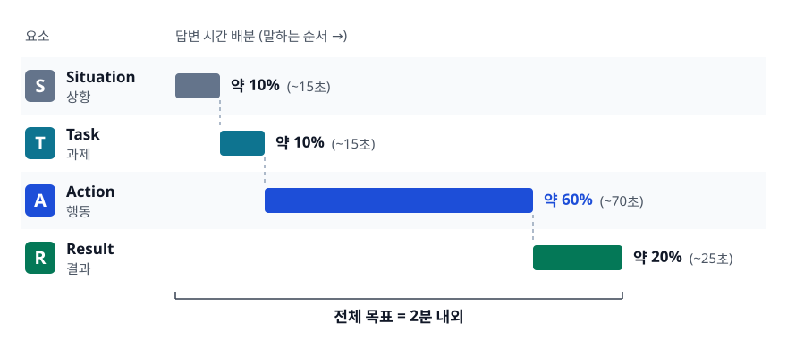
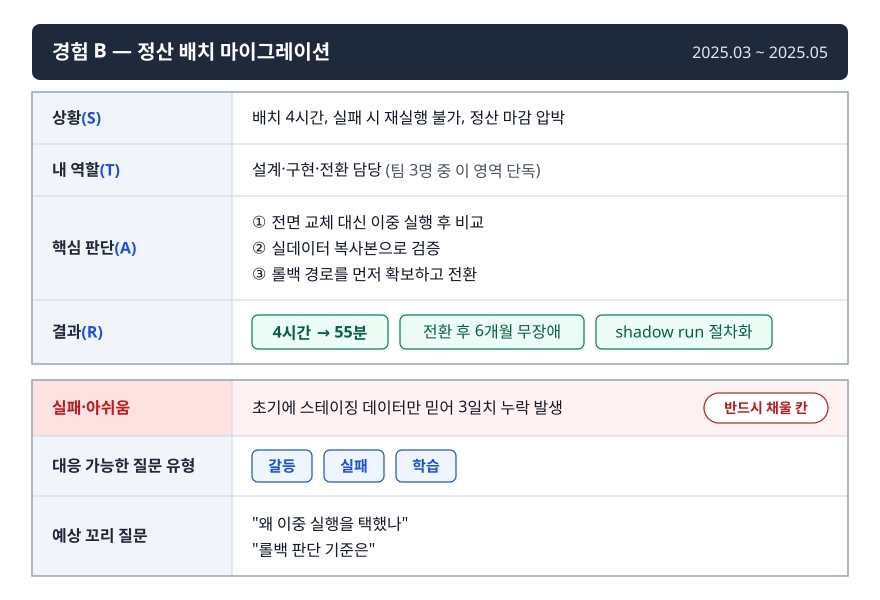
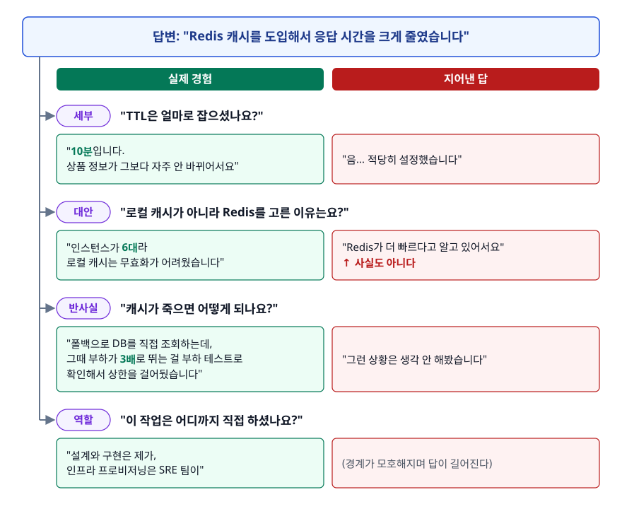

# 행동 면접과 STAR (Behavioral Interview & STAR)

> 회사는 왜 기술 질문 대신 과거 경험을 캐물을까요? STAR의 R을 숫자로 만드는 방법과, 지어낸 이야기가 꼬리 질문에서 어떻게 무너지는지를 이 문서에서 다룹니다.

## 학습 목표

- [ ] 행동 면접이 검증하려는 것이 무엇인지 말할 수 있다
- [ ] STAR 네 요소의 분량 배분과 각각의 실패 유형을 안다
- [ ] 숫자가 없는 경험도 결과를 정량화할 수 있다
- [ ] 같은 답변의 좋은 버전과 나쁜 버전을 구분할 수 있다
- [ ] 경험 6~8개로 스토리 뱅크를 만들어 질문 유형에 재배치할 수 있다
- [ ] 꼬리 질문이 과장을 어떻게 걸러내는지 이해한다

## 선행 지식

- 없음 — 이 문서부터 시작해도 됩니다
- 다만 [01-troubleshooting-method.md](./01-troubleshooting-method.md)의 STAR 예시를 먼저 보면 감이 빠릅니다

---

## 1. 왜 과거 경험을 캐묻는가

### 채용은 예측 문제다

회사가 알고 싶은 건 하나입니다. **"이 사람이 우리 팀에 들어오면 어떻게 행동할까."** 그런데 미래는 볼 수 없으니 대신 과거를 봅니다. 행동 면접은 "과거의 행동이 미래 행동의 가장 좋은 예측 변수"라는 전제에서 출발합니다.

기술 면접은 이걸 못 봅니다. 알고리즘을 잘 푸는 사람이 리뷰 코멘트에 방어적으로 반응하는지, 애매한 요구사항을 받았을 때 물어보는지 혼자 추측해서 만드는지, 자기 실수를 언제 공유하는지는 코딩 테스트로 드러나지 않습니다. 그런데 팀에서 실제로 문제가 되는 건 대부분 후자입니다.

### 회사가 실제로 확인하려는 것

| 확인하려는 것 | 대표 질문 | 답변에서 보는 신호 |
|--------------|----------|-------------------|
| 오너십 | "주도적으로 개선한 경험은?" | 시키지 않은 일을 했나, 끝까지 갔나 |
| 협업·갈등 | "의견이 충돌했을 때는?" | 감정이 아니라 근거로 다뤘나 |
| 실패 대처 | "실패한 경험은?" | 인정하나, 원인을 밖으로 돌리나 |
| 학습 능력 | "모르는 걸 어떻게 익혔나?" | 스스로 학습 경로를 설계하나 |
| 우선순위 판단 | "일정이 촉박했을 때는?" | 범위를 협상했나, 그냥 야근했나 |
| 커뮤니케이션 | 모든 답변 전반 | 비전공자에게 설명 가능한가 |

### 비유: 본인이 하는 레퍼런스 체크

이전 동료에게 전화해서 "이 사람 어땠나요?"를 묻는 게 레퍼런스 체크입니다. 행동 면접은 그 질문을 본인에게 하는 것입니다.

> **비유의 한계**: 레퍼런스 체크에서 답하는 사람은 제3자라 이해관계가 없습니다. 행동 면접에서는 **평가받는 본인이 답합니다.** 그래서 면접관은 답변을 그대로 믿지 않고 검증 도구를 하나 더 씁니다. 그게 꼬리 질문입니다. 7장에서 다룹니다.

---

## 2. STAR의 네 요소

<!-- diagram:cloud-behavioral-star-3 -->


<!-- 위 그림이 대체한 원본 ASCII.
     내용을 고칠 때는 그림도 함께 갱신할 것.
```
S  Situation   상황     ▓▓                          약 10%  (~15초)
T  Task        과제     ▓▓                          약 10%  (~15초)
A  Action      행동     ▓▓▓▓▓▓▓▓▓▓▓▓               약 60%  (~70초)
R  Result      결과     ▓▓▓▓                        약 20%  (~25초)
                                       전체 목표 = 2분 내외
```
-->

| 요소 | 담아야 할 것 | 흔한 실패 |
|------|-------------|----------|
| Situation | 배경 2~3문장. 왜 이게 어려운 상황이었는지 | 회사 소개와 서비스 설명으로 1분을 쓴다 |
| Task | **내가** 책임진 범위와 목표 | "팀의 목표"만 말하고 본인 역할이 없다 |
| Action | 내가 한 판단과 그 근거, 시도한 순서 | "우리는 ~했습니다"로 주어가 사라진다 |
| Result | 숫자로 된 결과 + 배운 것 | "잘 마무리됐습니다"로 끝난다 |

가장 많이 어긋나는 건 **A의 주어**입니다. 팀 프로젝트를 말하다 보면 자연스럽게 "우리가"로 흘러가는데, 면접관 입장에서는 이 사람이 무엇을 했는지 알 수 없게 됩니다. 팀 성과를 자기 것처럼 말하라는 게 아니라 **경계를 정확히 그으라**는 뜻입니다. "팀은 A, B, C를 했고 저는 그중 B를 맡아서 이렇게 했습니다"가 정확합니다.

두 번째로 많이 어긋나는 건 **S가 길어지는 것**입니다. 배경 설명에 1분을 쓰면 정작 판단과 결과를 말할 시간이 없습니다. S는 "이 상황이 왜 쉽지 않았는가"만 전달하면 끝입니다.

---

## 3. R을 정량화하는 법

### 왜 R이 가장 중요한가

Action까지만 있는 답변은 "무엇을 했다"는 진술입니다. Result가 붙어야 "그 판단이 옳았다"는 증거가 됩니다. 그런데 실제 면접에서 가장 많이 생략되는 게 R입니다.

```
안티패턴: "성능이 많이 개선됐습니다"

왜 문제인가:
  '많이'가 2배인지 100배인지 알 수 없습니다.
  더 나쁜 건, 이 표현이 "측정을 안 했다"로 읽힌다는 데 있습니다.
  개선 전후를 측정하지 않았다면 그 개선이 실제로 있었는지도 모릅니다.
  면접관에게는 "결과를 확인하지 않는 사람"으로 보입니다.

개선: "조회 API p99가 2.3초에서 180ms로 줄었고,
      같은 트래픽에서 서버 대수를 8대에서 5대로 줄일 수 있었습니다."
```

### 숫자가 없을 때 쓸 수 있는 것

"제 프로젝트는 지표가 없었는데요"라는 경우가 많습니다. 그럴 때 쓸 수 있는 대체 지표들입니다.

| 유형 | 예시 표현 | 언제 쓰나 |
|------|----------|----------|
| 전후 비교 | "빌드 시간 12분 → 4분" | 무엇이든 시간을 재면 나온다 |
| 상대 비율 | "장애 재발 0건 (이전 6개월간 4건)" | 절대 규모가 작을 때 |
| 빈도 감소 | "주 3회 오던 문의가 월 1회로" | 운영 부담 개선 |
| 범위·채택 | "팀 5명 중 5명이 사용, 이후 옆 팀도 도입" | 도구·문서를 만든 경우 |
| 리드 타임 | "PR 머지까지 평균 3일 → 반나절" | 프로세스 개선 |
| 규모 | "일 40만 건을 처리하는 배치" | 결과가 아니라 난이도를 보여줄 때 |
| 절감 | "인스턴스 다운사이징으로 월 비용 30% 감소" | 인프라 작업 |

**측정하지 않았다면 지금이라도 추정합니다.** "정확히 재지는 않았지만 배포마다 수동으로 하던 30분짜리 작업이 없어졌으니 주 2회 배포 기준으로 월 4시간 정도 절약됐습니다"는 완전히 유효한 R입니다. 추정이라고 밝히면 정직성 감점도 없습니다.

### R에는 배운 것도 들어간다

숫자 뒤에 한 문장을 붙입니다. **"이 경험에서 무엇이 내 기준으로 남았는가."** 이게 있으면 같은 경험이 반복 가능한 역량으로 읽히고, 없으면 운 좋게 해결한 일화로 읽힙니다.

---

## 4. 좋은 답변과 나쁜 답변

### 질문: "실패한 경험이 있나요?"

**나쁜 답변**

> "저는 완벽주의 성향이 있어서 일정에 쫓긴 적이 있습니다. 신규 기능을 만드는데 품질을 너무 신경 쓰다 보니 예정보다 늦어졌습니다. 하지만 결국 품질 좋은 결과물이 나와서 팀에서 좋은 평가를 받았습니다. 이후로는 완급 조절을 하려고 노력하고 있습니다."

이 답변의 문제는 무엇일까요?

- **실패가 아닙니다.** 자랑을 실패로 포장했습니다. 면접관은 이 패턴을 하루에도 여러 번 봅니다
- **원인 분석이 없습니다.** 왜 늦어졌는지, 무엇을 잘못 판단했는지가 없습니다
- **배운 것이 추상적입니다.** "완급 조절"은 다음에 같은 상황이 와도 아무 도움이 안 되는 교훈입니다

**좋은 답변**

> **[S]** 레거시 배치를 새 구조로 옮기는 작업을 맡았습니다. 기존 배치는 하루 한 번 4시간이 걸렸고, 이걸 잘게 쪼개 1시간으로 줄이는 게 목표였습니다.
>
> **[T]** 저는 이 마이그레이션의 설계와 구현을 담당했고, 무중단으로 전환하는 것까지가 제 몫이었습니다.
>
> **[A]** 새 구조를 3주에 걸쳐 만들고, 스테이징에서 정합성 검증을 통과한 뒤 전환했습니다. 그런데 전환 다음 날 정산 데이터가 일부 누락된 걸 발견했습니다. 원인은 제가 스테이징 데이터로만 검증했다는 것이었습니다. 스테이징에는 실서비스에만 존재하는 예외 상태의 레코드가 없었고, 새 배치는 그 상태를 처리하지 못하고 건너뛰고 있었습니다. 발견 즉시 구 배치로 되돌리고, 누락된 3일치를 재처리했습니다. 그다음 실데이터 복사본으로 두 배치의 출력을 건건이 비교하는 검증 스크립트를 만들어 차이가 0이 될 때까지 고친 뒤 다시 전환했습니다.
>
> **[R]** 최종적으로 배치 시간은 4시간에서 55분으로 줄었지만, 그 과정에서 3일치 정산이 하루 늦게 확정되는 피해가 있었습니다. 이 일 이후로 저는 데이터 관련 변경에는 **실데이터 기반 이중 검증**(shadow run)을 기본 절차로 넣습니다. 다음 마이그레이션 때 이 방식으로 실서비스에만 있던 케이스 두 개를 사전에 잡아냈습니다.

### 무엇이 달라졌나

| 항목 | 나쁜 답변 | 좋은 답변 |
|------|----------|----------|
| 실패의 실체 | 자랑의 변형 | 실제 사용자 피해가 있었던 사건 |
| 책임 소재 | "일정이 촉박해서" | "제가 스테이징 데이터로만 검증했다" |
| 원인 분석 | 없음 | 검증 환경과 실환경의 데이터 차이 |
| 대응 | 없음 | 롤백 → 재처리 → 검증 도구 → 재전환 |
| 배운 것 | "완급 조절" | shadow run을 절차로 편입 |
| 재현 | 알 수 없음 | 다음 프로젝트에서 실제로 효과 확인 |

**실패를 인정하는 강도가 답변의 신뢰도를 결정합니다.** 자기 판단 착오를 정확히 짚는 사람은 다음에도 짚을 수 있다고 읽히고, 원인을 환경으로 돌리는 사람은 그렇지 않게 읽힙니다.

### 질문: "팀원과 의견이 충돌했을 때는?"

**나쁜 답변**: "제가 한발 물러섰습니다. 팀 분위기가 더 중요하다고 생각했습니다."

이 답변이 위험한 이유는 **갈등 회피로 읽히기 때문**입니다. 회사는 갈등이 없는 사람이 아니라 갈등을 생산적으로 처리하는 사람을 찾습니다. 매번 물러서는 사람은 나쁜 기술 결정도 막지 못합니다.

**좋은 답변의 뼈대**: ① 무엇에 대한 이견이었나(기술적 사실로) → ② 상대의 우려가 무엇이었는지 내 말로 요약 → ③ 판단을 취향에서 데이터로 옮긴 방법(작은 PoC, 벤치마크, 요구사항 대조표) → ④ 결론과 내 의견 채택 여부 → ⑤ 채택되지 않았다면 그 뒤 어떻게 협조했나.

**내 의견이 기각된 이야기가 더 강한 답변이 되는 경우가 많습니다.** ②와 ⑤가 진짜로 있었는지를 보여주기 때문입니다.

---

## 5. 질문 유형별 준비

| 유형 | 대표 질문 | 실제로 보는 것 | 지뢰 |
|------|----------|---------------|------|
| 갈등 | "의견이 달랐던 경험" | 근거 기반 설득, 상대 이해 | 회피, 상대 비난, "제가 맞았습니다"로 끝 |
| 실패 | "실패한 경험" | 인정, 원인 분석, 절차화 | 위장된 자랑, 남 탓, 사소한 실패 |
| 주도성 | "시키지 않은 일을 한 경험" | 문제 발견, 설득, 완주 | 혼자 결정하고 통보한 이야기 |
| 학습 | "짧은 시간에 익힌 경험" | 학습 경로 설계, 검증 방법 | "인터넷 찾아보며 했습니다" |
| 우선순위 | "일정이 촉박했을 때" | 범위 협상, 리스크 공유 | 야근으로 해결했다는 서사 |
| 기술 부채 | "부채를 어떻게 관리했나" | 비용을 언어로 만드는 능력, 설득 | 몰래 리팩터링한 이야기, "시간이 없어서 못 했다" |
| 리더십 | "후배를 도운 경험" | 위임과 피드백 | 대신 해준 이야기 |

준비할 때 유형마다 하나씩 억지로 만들지 말고, **가진 경험을 유형에 배치**하는 순서로 접근합니다. 그래야 실제 경험이 남습니다.

**주도성** 질문에서 특히 자주 나오는 실수 하나. "문제를 발견해서 혼자 다 고쳤습니다"는 주도성이 아니라 독단으로 읽힐 수 있습니다. 주도성 답변에는 **누구를 어떻게 설득했는지**가 반드시 들어가야 합니다. 혼자 만든 개선은 대체로 팀에 남지 않기 때문입니다.

**기술 부채** 질문은 표면적으로 코드 품질을 묻지만 실제로는 우선순위 판단을 봅니다. "코드가 지저분해서 정리했습니다"가 아니라 그 부채가 만들고 있던 비용을 먼저 말해야 합니다. 장애 발생 빈도, 같은 기능을 붙이는 데 걸리는 시간, 신규 인력의 적응 기간처럼 팀이 실제로 지불하던 값을 제시하고, 그걸 근거로 일정에 자리를 얻어낸 과정이 답변의 핵심입니다. 전면 재작성보다는 기능 개발과 함께 조금씩 갚아 나간 이야기가 대체로 더 설득력 있습니다.

---

## 6. 스토리 뱅크 만들기

### 경험 6~8개면 대부분의 질문을 덮는다

질문 유형별로 답변을 따로 준비하면 20개가 넘어가고 결국 아무것도 못 외웁니다. 반대로 **경험을 먼저 정리하고 질문에 재배치**하면 6~8개로 충분합니다. 하나의 경험이 여러 질문에 대응하기 때문입니다.

| 경험 | 갈등 | 실패 | 주도성 | 학습 | 우선순위 | 기술 부채 | 리더십 |
|------|:---:|:---:|:---:|:---:|:---:|:---:|:---:|
| A. 장애 대응 | | O | O | | O | | |
| B. 정산 배치 마이그레이션 | O | O | | O | | | |
| C. 신규 기능 개발 | O | | O | | O | | |
| D. 온보딩 문서 개선 | | | O | | | | O |
| E. 기술 도입 | O | O | O | O | | O | |
| F. 성능 개선 | | | O | O | | O | |

`O` = 이 각도로 말할 수 있는 경험. 빈 칸을 억지로 채우면 답변이 얇아집니다.
**빈 칸이 몰린 열이 준비의 구멍입니다.** 위 표에서는 리더십을 말할 수 있는 경험이 D 하나뿐이므로, 멘토링이나 리뷰 경험을 하나 더 발굴해야 합니다.

같은 경험도 질문에 따라 **강조점을 바꾸면 다른 이야기가 됩니다.** 경험 B(정산 배치 마이그레이션)를 예로 들면, 갈등 질문에는 "무중단 전환 방식을 두고 시니어와 이견이 있었던 부분"이 A가 되고, 실패 질문에는 "검증 데이터를 잘못 골랐던 부분"이 A가 됩니다. S와 T는 거의 같지만 A와 R이 달라집니다.

### 경험 하나당 정리 항목

<!-- diagram:cloud-behavioral-star-1 -->


<!-- 위 그림이 대체한 원본 ASCII.
     내용을 고칠 때는 그림도 함께 갱신할 것.
```markdown
## 경험 B — 정산 배치 마이그레이션 (2025.03 ~ 2025.05)

- 상황(S): 배치 4시간, 실패 시 재실행 불가, 정산 마감 압박
- 내 역할(T): 설계·구현·전환 담당 (팀 3명 중 이 영역 단독)
- 핵심 판단(A): ① 전면 교체 대신 이중 실행 후 비교
                ② 실데이터 복사본으로 검증
                ③ 롤백 경로를 먼저 확보하고 전환
- 결과(R): 4시간 → 55분 / 전환 후 6개월 무장애 / shadow run 절차화
- 실패·아쉬움: 초기에 스테이징 데이터만 믿어 3일치 누락 발생
- 대응 가능한 질문 유형: 갈등, 실패, 학습
- 예상 꼬리 질문: "왜 이중 실행을 택했나" / "롤백 판단 기준은"
```
-->

**"실패·아쉬움" 칸을 반드시 채웁니다.** 성공 경험에도 아쉬운 지점은 항상 있고, 이걸 미리 정리해두면 "이 프로젝트에서 아쉬웠던 건요?"라는 꼬리 질문에 즉답할 수 있습니다. 이 질문에 막히는 지원자가 매우 많습니다.

### 연습 방법

1. 각 경험을 위 양식으로 글로 씁니다. 말로만 준비하면 A와 R이 늘 뭉개집니다
2. 2분 타이머를 켜고 소리 내어 말합니다. 처음에는 대부분 4분이 넘습니다
3. 넘치는 부분은 거의 항상 S입니다. S를 두 문장으로 줄입니다
4. 예상 꼬리 질문 3개를 스스로 던지고 답해봅니다

---

## 7. 과장과 거짓이 드러나는 이유

### 꼬리 질문은 검증 도구다

면접관이 꼬리 질문을 던지는 건 궁금해서가 아니라 **답변의 해상도를 확인하기 위해서**입니다. 실제로 겪은 일은 파고들수록 세부가 계속 나오고, 지어낸 이야기는 두세 번이면 바닥이 드러납니다.

<!-- diagram:cloud-behavioral-star-2 -->


<!-- 위 그림이 대체한 원본 ASCII.
     내용을 고칠 때는 그림도 함께 갱신할 것.
```
답변: "Redis 캐시를 도입해서 응답 시간을 크게 줄였습니다"

  │
  ├─ [세부] "TTL은 얼마로 잡으셨나요?"
  │     실제 경험 → "10분입니다. 상품 정보가 그보다 자주 안 바뀌어서요"
  │     지어낸 답 → "음... 적당히 설정했습니다"
  │
  ├─ [대안] "로컬 캐시가 아니라 Redis를 고른 이유는요?"
  │     실제 경험 → "인스턴스가 6대라 로컬 캐시는 무효화가 어려웠습니다"
  │     지어낸 답 → "Redis가 더 빠르다고 알고 있어서요"  ← 사실도 아니다
  │
  ├─ [반사실] "캐시가 죽으면 어떻게 되나요?"
  │     실제 경험 → "폴백으로 DB를 직접 조회하는데, 그때 부하가 3배로
  │                 뛰는 걸 부하 테스트로 확인해서 상한을 걸어뒀습니다"
  │     지어낸 답 → "그런 상황은 생각 안 해봤습니다"
  │
  └─ [역할] "이 작업은 어디까지 직접 하셨나요?"
        실제 경험 → "설계와 구현은 제가, 인프라 프로비저닝은 SRE 팀이"
        지어낸 답 → (경계가 모호해지며 답이 길어진다)
```
-->

### 무너지는 지점은 정해져 있다

- **숫자의 일관성**: "10배 개선"이라고 했는데 앞서 말한 전후 값이 3배면 즉시 걸립니다
- **선택의 근거**: 실제로 고른 사람은 **고르지 않은 대안**을 말할 수 있습니다. 이게 가장 강력한 구분점입니다
- **실패한 시도**: 진짜 프로젝트에는 중간에 버린 시도가 있습니다. 처음부터 끝까지 매끄러운 이야기가 오히려 의심스럽습니다
- **역할 경계**: 팀 성과를 자기 것으로 말하면 "그 부분은 어떻게 구현하셨나요"에서 막힙니다
- **시간 감각**: 3주 걸렸다는 작업의 세부가 3일치밖에 안 나오면 어긋납니다

### 과장하지 않고도 잘 말하는 법

과장의 유혹은 대개 "내 경험이 초라해 보인다"는 불안에서 옵니다. 그런데 면접관이 보는 건 규모가 아니라 **그 규모 안에서의 판단 밀도**입니다. 사용자 100명짜리 사내 도구라도 "왜 그렇게 만들었는가"를 정확히 말하면 통과합니다. 반대로 대규모 서비스 경험을 말하면서 판단 근거를 못 대면 떨어집니다.

그리고 모르는 건 그냥 모른다고 하면 됩니다. "그 부분은 제가 맡지 않아서 정확히는 모릅니다. 제가 이해한 범위로는 ~였습니다"는 감점이 아니라 **역할 경계를 정확히 아는 사람**이라는 신호입니다.

---

## 8. 실무에서는

- **회사마다 평가 항목이 문서화돼 있습니다.** 아마존의 Leadership Principles가 대표적으로, 지원자는 각 원칙에 대응하는 경험을 준비하고 면접관은 원칙별로 나눠 질문합니다. 지원 회사가 이런 기준을 공개하고 있다면 스토리 뱅크의 열(column)을 그 항목으로 바꿔 쓰면 됩니다.
- **행동 면접은 기술 면접과 분리되지 않습니다.** 시스템 설계 면접에서 "그 결정은 팀에서 어떻게 합의했나요?"가 나오고, 코드 리뷰 이야기에서 "리뷰어와 이견이 있으면요?"가 나옵니다. 기술적 서사 안에 협업이 섞여 있는 게 자연스럽습니다.
- **면접 전 회고가 스토리 뱅크의 원료입니다.** 스프린트 회고나 포스트모템을 기록해둔 사람은 준비가 훨씬 수월합니다. 반대로 기록이 없으면 1~2년 전 프로젝트의 숫자가 전혀 기억나지 않습니다. 지금 진행 중인 프로젝트의 전후 지표를 남겨두는 것이 가장 값싼 면접 준비입니다.
- **역질문도 평가됩니다.** "팀이 지금 가장 어려워하는 기술 문제는 무엇인가요" 같은 질문은 관심의 방향을 보여줍니다. 복지·평가 제도만 묻는 것과는 인상이 다릅니다.

---

## 9. 면접 포인트

> 면접에서 이 주제가 나오면 이렇게 답한다

**Q. 가장 어려웠던 기술 문제는 무엇이었나요?**

A. STAR로 답하되, 어려웠던 이유를 **기술적으로** 특정해서 시작합니다. "트래픽이 많았다"로는 부족합니다. "재현이 안 되는 간헐적 장애였다"처럼 좁힙니다. Action에서는 시도했다가 기각한 방법과 기각한 근거를 함께 말합니다. 그 부분이 실제로 겪었다는 가장 좋은 증거이기도 합니다. Result는 반드시 전후 숫자로 닫습니다.
- 꼬리 질문: "그 방법을 왜 기각했나요?" → 이 질문을 예상하고 준비해두면 답변 전체의 신뢰도가 올라갑니다.

**Q. 실패 경험을 말할 때 어디까지 솔직해야 하나요?**

A. 사용자나 팀에 실제 영향이 있었던 사건을 고르고, 원인을 자기 판단 착오로 정확히 짚는 게 좋습니다. 다만 거기서 끝나면 안 되고, 그 실패가 이후 어떤 절차나 습관으로 바뀌었는지까지 말해야 합니다. 반대로 "완벽주의라서 늦었다" 같은 위장된 자랑은 면접관이 가장 많이 듣는 패턴이라 오히려 감점됩니다.
- 꼬리 질문: "그 실수를 지금 다시 한다면요?" → "같은 상황이 오면 이 절차 때문에 사전에 걸린다"고 구체적으로 답합니다.

**Q. 정량적 결과가 없는 경험은 어떻게 말하나요?**

A. 전후 비교로 만들 수 있는 것을 찾습니다. 빌드 시간, 배포 횟수, 문의 빈도, PR 머지까지의 리드 타임, 장애 재발 건수처럼 측정하지 않았어도 추정 가능한 지표가 대부분 있습니다. 추정이라면 추정이라고 밝히고 근거를 함께 말합니다. "정확히 재지는 않았지만 배포마다 30분씩 걸리던 수동 작업이 사라져 월 4시간 정도"라고 말하면 됩니다.
- 꼬리 질문: "왜 측정하지 않았나요?" → 변명하지 말고 "그때는 측정의 중요성을 몰랐고, 이후로는 개선 작업 전에 기준값부터 잰다"고 답합니다.

**Q. 팀 성과와 본인 기여를 어떻게 구분해서 말하나요?**

A. 팀이 한 일을 먼저 한 문장으로 말하고, 그중 제가 맡은 부분을 명시합니다. "팀은 A, B, C를 진행했고 저는 B의 설계와 구현을 담당했습니다"라는 식입니다. 그리고 Action부터는 주어를 '저'로 유지합니다. 경계를 흐리면 꼬리 질문에서 반드시 드러나고, 그 순간 앞서 말한 다른 성과의 신뢰도까지 함께 떨어집니다.
- 꼬리 질문: "그 부분은 어떻게 구현했나요?" → 자기가 한 영역이면 세부가 계속 나옵니다. 이 질문이 곧 검증입니다.

---

## 자주 하는 실수

| 실수 | 왜 틀렸나 | 올바른 이해 |
|------|----------|-----------|
| 질문 유형마다 답변을 따로 준비 | 20개가 넘어가 아무것도 못 외운다 | 경험 6~8개를 정리하고 질문에 재배치 |
| 상황(S) 설명에 공을 들인다 | 배경은 평가 대상이 아니다 | S는 두 문장. 시간은 A에 쓴다 |
| "우리 팀은 ~했습니다" | 본인 기여를 알 수 없다 | 팀의 일을 먼저 밝히고 A부터는 '저'로 |
| 실패 질문에 장점을 말한다 | 가장 흔한 패턴이라 즉시 걸린다 | 실제 영향이 있었던 사건 + 절차화된 교훈 |
| 결과를 "잘 됐습니다"로 마무리 | 판단이 옳았다는 증거가 없다 | 전후 숫자, 없으면 추정치라도 |
| 갈등 질문에 "제가 양보했습니다" | 갈등 회피로 읽힌다 | 근거를 데이터로 옮긴 과정을 말한다 |
| 경험을 크게 부풀린다 | 꼬리 질문 두세 번에 무너진다 | 규모가 아니라 판단 밀도가 평가된다 |
| 모르는 부분을 아는 척한다 | 다른 답변의 신뢰도까지 떨어뜨린다 | 역할 경계를 밝히는 게 오히려 신호가 된다 |

---

## 한 줄 정리

행동 면접은 성격을 보는 자리가 아니라 **과거의 판단을 근거로 미래의 행동을 예측하는 자리**입니다. 통과 조건도 화려한 경험이 아니라, 무엇을 왜 골랐고 그 결과가 숫자로 어땠는지를 꼬리 질문 세 번까지 버티며 말할 수 있느냐입니다.

---

## 연관 개념

- [01-troubleshooting-method.md](./01-troubleshooting-method.md) - 트러블슈팅 경험을 STAR로 만드는 구체 예시
- [02-system-design-interview.md](./02-system-design-interview.md) - 기술 면접에서도 요구되는 트레이드오프 서술 방식
- [qna-behavioral.md](./qna-behavioral.md) - 갈등·실패·기술 부채·온보딩 질문의 답변 예시
- [qna-troubleshooting.md](./qna-troubleshooting.md) - 경험 질문의 원료가 되는 장애 시나리오 모음
- [../../98-personality-interview/qna-behavioral.md](../../98-personality-interview/qna-behavioral.md) - 자기소개·지원 동기·강약점 등 인성 면접 질문
- [../../06-software-engineering/01-agile-process.md](../../06-software-engineering/01-agile-process.md) - 회고와 스프린트 운영, 스토리 뱅크의 원료가 되는 기록 문화
- [../monitoring-observability/05-alerting-oncall.md](../monitoring-observability/05-alerting-oncall.md) - 포스트모템 기록이 그대로 경험 자산이 되는 이유
