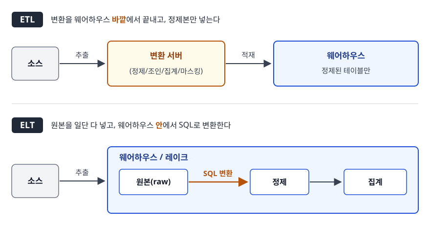
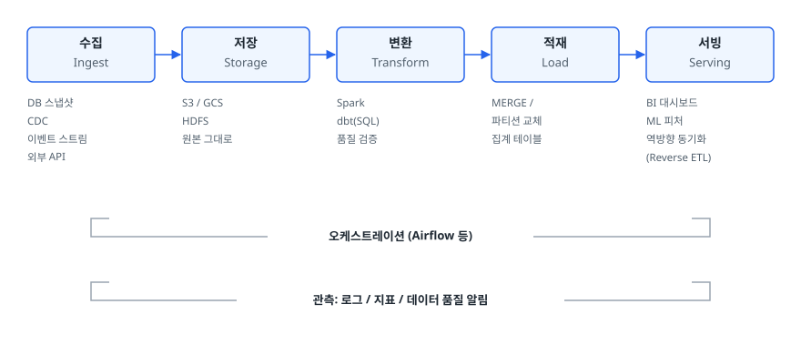
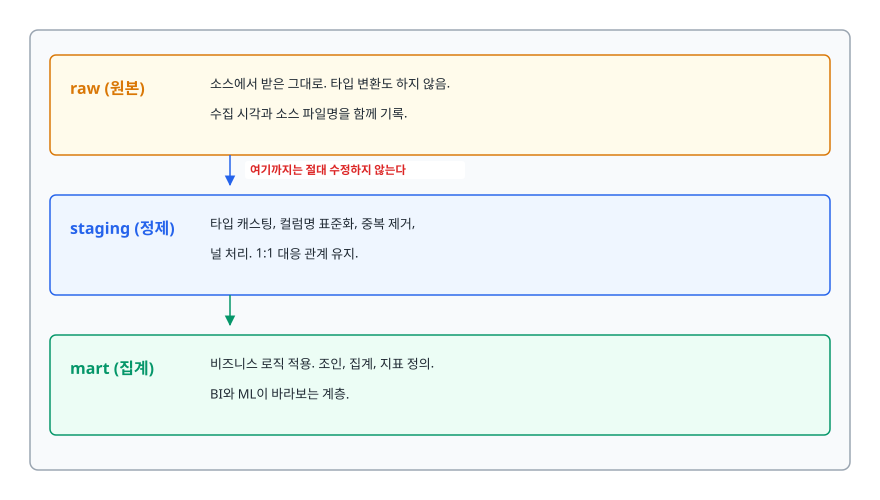

# 데이터 파이프라인과 ETL/ELT (Data Pipeline, ETL & ELT)

> 데이터가 왜 여러 시스템에 흩어지는지, 그것을 한곳에 모으는 파이프라인이 어떤 단계로 구성되는지, 왜 멱등성이 설계의 첫 번째 조건인지, 그리고 레이크·웨어하우스·레이크하우스가 각각 어떤 문제를 풀려고 나왔는지 설명할 수 있게 됩니다.

## 학습 목표

- [ ] 분석 요청 하나가 왜 여러 시스템을 건드리게 되는지 예시로 설명할 수 있다
- [ ] ETL과 ELT의 순서가 왜 바뀌었는지 비용 구조로 설명할 수 있다
- [ ] 파이프라인의 다섯 단계와 각 단계의 대표 기술을 말할 수 있다
- [ ] 멱등하지 않은 적재 로직을 코드에서 지적하고 고칠 수 있다
- [ ] 소스 스키마가 바뀌었을 때 파이프라인이 무너지지 않게 하는 구조를 그릴 수 있다
- [ ] 데이터 레이크, 웨어하우스, 레이크하우스를 상황에 맞게 고를 수 있다

## 선행 지식

- SQL의 `INSERT` / `DELETE` / `MERGE` 정도의 기본 문법
- [트랜잭션과 격리 수준](../02-backend-engineering/database/04-transaction-isolation.md) — 필수는 아니지만 원자성 개념을 알면 4장이 쉽다

---

## 1. 왜 필요한가

### 질문 하나가 시스템 네 개를 건드린다

"지난달 유입 채널별로 신규 가입자의 30일 재구매율이 어떻게 되나요?"

기획자가 던진 이 한 문장을 처리하려면 어디를 봐야 하는지 세어 보자.

- 가입 정보는 **서비스 MySQL**의 `users` 테이블
- 유입 채널은 **광고 플랫폼 API**(구글, 메타)와 웹 로그
- 구매 기록은 **결제 PG사**가 주는 정산 파일
- 앱 내 행동은 **이벤트 로그**(S3에 쌓이는 JSON)

네 곳의 데이터를 사람이 손으로 엑셀에 붙여넣어 답을 만들 수는 있습니다. 문제는 이 질문이 매달 반복되고, 비슷하지만 조금 다른 질문이 매주 새로 들어온다는 것입니다.

### 운영 DB에 직접 쿼리하면 안 되는 이유

가장 먼저 떠오르는 해법은 "서비스 DB에 직접 분석 쿼리를 날리자"다. 이게 왜 곧 막히는지가 데이터 엔지니어링의 출발점입니다.

1. **서비스가 죽는다** — 1년치 주문을 풀스캔하는 집계 쿼리 한 방이 버퍼 풀을 밀어내고, 정작 사용자 요청은 디스크를 읽게 됩니다. 분석은 느려도 되지만 결제는 느리면 안 됩니다.
2. **행 지향 저장이 집계에 불리하다** — OLTP DB는 "주문 하나를 통째로 읽기"에 최적화되어 있습니다. "1억 건의 `amount` 컬럼만 합산하기"에는 컬럼 지향 저장소가 압도적으로 유리합니다.
3. **조인할 상대가 DB 안에 없다** — 광고 플랫폼 데이터와 PG 정산 파일은 애초에 그 DB에 없습니다.
4. **과거가 사라진다** — 서비스 DB는 현재 상태만 유지합니다. `users.grade`를 업데이트하면 어제 등급은 지워집니다. 분석은 "그때 등급이 무엇이었는가"를 물어봅니다.

그래서 **여러 소스의 데이터를 분석 전용 저장소로 옮기고, 분석하기 좋은 모양으로 다듬어 두는 반복 가능한 절차**가 필요해집니다. 이것이 데이터 파이프라인입니다.

### 비유: 정수장

강, 지하수, 저수지에서 물을 끌어와 침전·여과·소독을 거쳐 배수지에 담아 두고, 각 가정이 수도꼭지만 틀면 마시게 하는 시설이 정수장입니다. 데이터 파이프라인이 하는 일이 똑같습니다. 원수를 여러 곳에서 취수(수집)하고, 정제(변환)해서, 배수지(웨어하우스)에 담고, 분석가는 SQL이라는 수도꼭지만 틀면 됩니다.

> **비유의 한계**: 물은 한 번 마시면 사라지지만 데이터는 같은 원본을 수십 번 다르게 가공할 수 있습니다. 그래서 데이터 세계에서는 정수 전 원수를 통째로 보관해 두는 선택(데이터 레이크)이 합리적일 때가 많습니다. 정수장이 강물을 통째로 저장해 두지는 않습니다.

---

## 2. ETL과 ELT — 왜 순서가 바뀌었나

두 방식의 문자 차이는 T(Transform)와 L(Load)의 순서뿐입니다. 하지만 이 순서를 바꾼 것은 취향이 아니라 **비용 구조의 변화**였습니다.

<!-- diagram:de-etl-pipeline-1 -->


<!-- 위 그림이 대체한 원본 ASCII.
     내용을 고칠 때는 그림도 함께 갱신할 것.
```
[ETL]  변환을 웨어하우스 바깥에서 끝내고, 정제본만 넣는다

  소스 ──추출──> ┌──────────────┐ ──적재──> ┌────────────┐
                │  변환 서버    │           │ 웨어하우스  │
                │ (정제/조인/   │           │  정제된     │
                │  집계/마스킹) │           │  테이블만   │
                └──────────────┘           └────────────┘

[ELT]  원본을 일단 다 넣고, 웨어하우스 안에서 SQL로 변환한다

  소스 ──추출──> ┌───────────────────────────────────────┐
                │           웨어하우스 / 레이크          │
                │  원본(raw) ──SQL 변환──> 정제 ──> 집계 │
                └───────────────────────────────────────┘
```
-->

### 옛날 웨어하우스에서는 ETL이 합리적이었다

온프레미스 시절의 데이터 웨어하우스 어플라이언스는 **스토리지와 연산이 한 몸**이었고, 라이선스도 대개 서버·코어 단위였습니다. 이 조건에서는 두 가지가 따라옵니다.

- 저장 공간이 비싸다 → 쓸모없는 원본을 쌓아 둘 여유가 없다
- 연산 자원이 고정되어 있다 → 무거운 변환을 웨어하우스에 시키면 정작 분석 쿼리가 밀린다

그래서 **별도의 ETL 서버에서 변환을 다 끝내고, 최종 결과만 얇게 적재**하는 것이 정답이었습니다.

### 클라우드 웨어하우스가 전제를 뒤집었다

BigQuery, Snowflake, Redshift 같은 클라우드 웨어하우스는 두 가지를 바꿨습니다.

1. **스토리지와 컴퓨트의 분리** — 저장은 객체 스토리지 수준의 단가로 떨어졌고, 연산은 쓸 때만 켜서 쓰는 형태가 됐습니다. 원본을 통째로 쌓아 두는 비용이 감당 가능해졌습니다.
2. **탄력적인 분산 연산** — 웨어하우스 자체가 수십, 수백 노드로 스케일 아웃합니다. 별도 ETL 서버 한 대보다 웨어하우스가 변환을 훨씬 빨리 합니다.

그러니 "변환하려고 데이터를 밖으로 뺐다가 다시 넣는" ETL은 오히려 손해가 됐습니다. 원본을 그대로 넣고 `CREATE TABLE AS SELECT` 한 방으로 변환하는 편이 싸고 빠릅니다. dbt처럼 **SQL만으로 변환 계층을 관리하는 도구**가 표준처럼 자리 잡은 것도 이 흐름 위에 있습니다.

### 그래도 ETL이 맞는 경우가 있다

| 기준 | ETL (변환 후 적재) | ELT (적재 후 변환) |
|------|--------------------|---------------------|
| 변환 실행 위치 | 별도 처리 엔진 (Spark, 전용 ETL 서버) | 웨어하우스/레이크 내부 (SQL 엔진) |
| 원본 보존 | 보통 안 남는다 | 원본 레이어로 남긴다 |
| 새 분석 요구 대응 | 파이프라인을 고쳐 다시 수집 | 이미 있는 원본에 SQL만 새로 작성 |
| 민감정보 처리 | 웨어하우스에 들어가기 전에 마스킹 가능 | 원본에 평문이 들어간 뒤 처리 |
| 비용이 몰리는 곳 | 변환 인프라 운영 | 웨어하우스 연산 요금 |
| 대표 도구 | Spark, Informatica, 자체 배치 스크립트 | dbt + BigQuery/Snowflake, Fivetran + dbt |

> 판단 기준: **개인정보나 규제 대상 데이터가 웨어하우스에 평문으로 들어가면 안 되는 경우, 그리고 소스가 거대한데 실제로 쓰는 비율이 아주 낮은 경우**에는 ETL이 여전히 옳습니다. 그 외의 일반적인 분석 파이프라인은 ELT를 기본값으로 두고 시작하는 것이 요즘의 표준입니다.

---

## 3. 파이프라인의 구성 요소

<!-- diagram:de-etl-pipeline-2 -->


<!-- 위 그림이 대체한 원본 ASCII.
     내용을 고칠 때는 그림도 함께 갱신할 것.
```
┌─────────┐  ┌──────────┐  ┌──────────┐  ┌──────────┐  ┌──────────┐
│  수집    │─>│   저장    │─>│   변환    │─>│   적재    │─>│   서빙    │
│ Ingest  │  │  Storage │  │Transform │  │   Load   │  │  Serving │
└─────────┘  └──────────┘  └──────────┘  └──────────┘  └──────────┘
 DB 스냅샷    S3 / GCS      Spark         MERGE /       BI 대시보드
 CDC          HDFS          dbt(SQL)      파티션 교체    ML 피처
 이벤트 스트림 원본 그대로    품질 검증     집계 테이블    역방향 동기화
 외부 API                                                (Reverse ETL)

        └──────────── 오케스트레이션 (Airflow 등) ────────────┘
        └──────────── 관측: 로그 / 지표 / 데이터 품질 알림 ────┘
```
-->

각 단계에서 실제로 결정해야 하는 것은 다음과 같습니다.

- **수집** — 어떻게 가져올 것인가. 매일 전체를 다시 읽는 **전체 적재(full load)**, 갱신된 행만 읽는 **증분 적재(incremental load)**, DB 트랜잭션 로그를 읽어 변경을 실시간으로 흘리는 **CDC(Change Data Capture)** 중 선택입니다. 증분 적재는 소스에 `updated_at` 같은 신뢰할 수 있는 기준 컬럼이 있어야 하고, 삭제(delete)를 놓친다는 함정이 있습니다. CDC는 삭제까지 잡지만 운영 부담이 큽니다.
- **저장** — 원본을 손대지 않은 채로 남깁니다. 이 레이어가 있어야 변환 로직에 버그가 있어도 소스를 다시 긁지 않고 재계산할 수 있습니다.
- **변환** — 타입 정리, 중복 제거, 조인, 비즈니스 로직 적용. 여기서 "매출"의 정의가 팀 전체에 통일됩니다.
- **적재** — 변환 결과를 조회용 테이블에 씁니다. 이 단계의 원자성이 4장의 주제입니다.
- **서빙** — BI 도구, ML 피처 스토어, 또는 다시 운영 시스템으로 되돌리는 Reverse ETL.

오케스트레이션과 관측은 특정 단계가 아니라 **전 단계를 가로지르는 축**입니다. 어떤 순서로 돌릴지, 실패하면 누가 아는지가 여기서 정해집니다. 오케스트레이션은 [02-airflow.md](./02-airflow.md)에서 자세히 다룹니다.

---

## 4. 멱등성과 재처리 가능성이 왜 1순위인가

### 파이프라인은 반드시 실패한다

배치 파이프라인을 6개월만 운영해 보면 이런 일이 전부 일어납니다. 소스 DB가 점검으로 내려가고, 외부 API가 rate limit을 걸고, 네트워크가 끊기고, 변환 로직에 버그가 있었다는 걸 3일 뒤에 알게 되고, 상류 팀이 예고 없이 컬럼 타입을 바꿉니다.

그래서 진짜 질문은 "실패를 어떻게 없앨까"가 아니라 **"실패한 뒤 그냥 다시 돌려도 안전한가"**다. 이것이 멱등성(Idempotency)입니다. 같은 입력으로 같은 태스크를 몇 번 실행하든 결과 상태가 동일해야 합니다.

### 안티패턴: 그냥 INSERT 한다

```sql
-- 안티패턴: 매일 어제치를 append
INSERT INTO daily_sales (dt, product_id, amount)
SELECT DATE(ordered_at), product_id, SUM(price)
FROM raw_orders
WHERE DATE(ordered_at) = '2026-03-01'
GROUP BY 1, 2;
```

**왜 문제인가**: 이 태스크가 적재 도중 타임아웃으로 실패했다고 하자. 일부 행은 이미 들어갔습니다. 재시도하면 그 행들이 한 번 더 들어갑니다. 매출이 두 배로 보이는 대시보드를 만든 뒤, 어느 행이 중복인지 사람이 찾아내야 합니다. 변환 로직 버그를 고쳐 지난 30일을 다시 돌리는 상황이라면 30일치가 전부 두 배가 됩니다.

### 개선 1: 파티션 단위로 지우고 다시 쓴다

```sql
-- 개선: 해당 구간을 먼저 비우고 채운다 (하나의 트랜잭션 안에서)
BEGIN;

DELETE FROM daily_sales WHERE dt = '2026-03-01';

INSERT INTO daily_sales (dt, product_id, amount)
SELECT DATE(ordered_at), product_id, SUM(price)
FROM raw_orders
WHERE DATE(ordered_at) = '2026-03-01'
GROUP BY 1, 2;

COMMIT;
```

몇 번을 돌리든 `2026-03-01` 파티션의 최종 상태는 같습니다. 이 패턴을 흔히 **덮어쓰기(overwrite by partition)** 라고 부릅니다. 파티션이 파일 시스템 디렉터리로 나뉘는 레이크 환경이라면 "새 디렉터리에 다 쓴 뒤 마지막에 경로만 교체"하는 원자적 교체가 더 안전합니다.

### 개선 2: 키가 있다면 MERGE(UPSERT)

```sql
MERGE INTO daily_sales AS t
USING (
    SELECT DATE(ordered_at) AS dt, product_id, SUM(price) AS amount
    FROM raw_orders
    WHERE DATE(ordered_at) = '2026-03-01'
    GROUP BY 1, 2
) AS s
ON t.dt = s.dt AND t.product_id = s.product_id
WHEN MATCHED THEN UPDATE SET amount = s.amount
WHEN NOT MATCHED THEN INSERT (dt, product_id, amount)
                     VALUES (s.dt, s.product_id, s.amount);
```

`MERGE`는 재실행해도 같은 키를 갱신할 뿐이라 중복이 생기지 않습니다. 다만 **소스에서 사라진 행은 지워 주지 않는다**는 점이 덮어쓰기와의 차입니다. 원본에서 주문이 취소·삭제될 수 있다면 파티션 덮어쓰기가 안전합니다.

### 안티패턴: "지금 시각"을 태스크 안에서 읽는다

```python
# 안티패턴
from datetime import date
target = date.today()          # 실행되는 순간의 날짜
run_etl(target)
```

**왜 문제인가**: 어제 실패한 배치를 오늘 다시 돌리면 `today()`가 오늘로 바뀌어, 채우려던 어제 데이터는 영원히 비어 있고 오늘 데이터만 두 번 계산됩니다. 실행 시각이 결과를 바꾸는 순간 재처리는 불가능해집니다.

```python
# 개선: 처리 대상 구간을 밖에서 파라미터로 주입받는다
def run_etl(interval_start, interval_end):
    ...
```

**처리 대상 구간은 오케스트레이터가 정해서 넘겨주는 값이어야 한다.** 태스크는 "언제 실행되는지"를 몰라야 하고, "어느 구간을 처리하는지"만 알아야 합니다. 이 원칙 하나가 백필과 재시도를 모두 가능하게 만듭니다.

---

## 5. 데이터 품질 검증

### 조용히 틀린 데이터가 가장 비싸다

파이프라인이 에러로 죽으면 알림이 옵니다. 진짜 무서운 것은 **성공했는데 결과가 틀린 경우입니다. 소스 API가 장애 중에 빈 배열을 200 OK로 돌려주면, 파이프라인은 "0건 처리 완료"로 초록불이 켜지고, 대시보드에는 매출 0원이 찍힙니다.

그래서 파이프라인에는 **적재 직후 검증 단계**가 붙습니다. 검증할 항목은 대개 이렇게 나뉩니다.

| 검증 축 | 확인하는 것 | 실패했을 때의 의미 |
|---------|------------|-------------------|
| 볼륨 | 행 수가 최근 평균 대비 급감/급증했는가 | 수집 누락, 소스 장애, 중복 적재 |
| 유일성 | 기본키가 중복되지 않는가 | 멱등성 깨짐, 조인 팬아웃 |
| 널 비율 | 필수 컬럼에 NULL이 늘었는가 | 소스 스키마 변경, 파싱 실패 |
| 참조 무결성 | 주문의 user_id가 users에 존재하는가 | 수집 순서 문제, 지연 도착 |
| 신선도 | 최신 데이터의 타임스탬프가 기대 범위인가 | 스케줄 미실행, 상류 지연 |
| 값 범위 | 금액이 음수이거나 비정상적으로 큰가 | 단위 오류, 테스트 데이터 유입 |

### 실패했을 때 무엇을 할 것인가

검증만 붙이고 정책이 없으면 알림 피로만 쌓입니다. 세 가지 중 하나를 미리 정해 둡니다.

- **중단(fail)** — 하류 태스크를 막습니다. 잘못된 데이터가 대시보드에 흘러가는 것보다 대시보드가 어제 값으로 멈춰 있는 게 낫다면 이쪽입니다. 매출·정산처럼 정확성이 중요한 지표가 해당됩니다.
- **경고(warn)** — 적재는 진행하되 알림만 보냅니다. 탐색용 로그처럼 조금 틀려도 되는 데이터에 씁니다.
- **격리(quarantine)** — 검증에 걸린 행만 별도 테이블로 빼고 나머지는 진행합니다. 소수의 이상 레코드 때문에 전체 파이프라인이 멈추는 것을 막으면서, 빠진 데이터의 흔적을 남깁니다.

> 규칙을 하나만 고른다면 **"기본키 유일성 검사"** 를 넣어라. 멱등성이 깨진 순간을 가장 빨리 알려 주는 지표입니다.

---

## 6. 스키마 변경에 대응하기

상류 팀은 언젠가 컬럼을 추가하고, 이름을 바꾸고, 타입을 바꿉니다. 변경 유형에 따라 파이프라인이 받는 충격이 다릅니다.

| 변경 유형 | 하위 호환 | 파이프라인 영향 | 대응 |
|-----------|----------|----------------|------|
| 컬럼 추가 | 있음 | 없음 (무시하면 그만) | 원본 레이어는 자동 수용, 필요할 때 변환에 편입 |
| 컬럼 삭제 | 없음 | 참조하던 변환이 깨짐 | 소스 계약으로 사전 통보, 유예 기간 |
| 타입 변경 | 조건부 | 파싱 실패 또는 조용한 절삭 | 원본은 문자열로 보존하고 변환에서 캐스팅 |
| 의미 변경 | 없음 | **깨지지 않고 조용히 틀린다** | 가장 위험. 값 범위 검증으로만 잡힌다 |

여기서 가장 무서운 것은 마지막 행입니다. `status` 컬럼의 값이 `"paid"`에서 `"PAID"`로 바뀌면 파이프라인은 아무 에러 없이 돌고, 결제 완료 건수만 0이 됩니다.

### 구조로 방어하기: 레이어를 나눈다

<!-- diagram:de-etl-pipeline-3 -->


<!-- 위 그림이 대체한 원본 ASCII.
     내용을 고칠 때는 그림도 함께 갱신할 것.
```
┌──────────────────────────────────────────────────────────────┐
│ raw (원본)     소스에서 받은 그대로. 타입 변환도 하지 않음.   │
│                수집 시각과 소스 파일명을 함께 기록.           │
│                   ↓  여기까지는 절대 수정하지 않는다          │
│ staging (정제)  타입 캐스팅, 컬럼명 표준화, 중복 제거,        │
│                 널 처리. 1:1 대응 관계 유지.                  │
│                   ↓                                          │
│ mart (집계)     비즈니스 로직 적용. 조인, 집계, 지표 정의.     │
│                 BI와 ML이 바라보는 계층.                      │
└──────────────────────────────────────────────────────────────┘
```
-->

핵심은 **raw 레이어를 불변으로 두는 것**입니다. 변환 로직에 버그가 있었거나 지표 정의가 바뀌어도 소스를 다시 긁을 필요 없이 staging부터 재생성하면 됩니다. 소스 시스템은 과거 데이터를 이미 지웠을 수도 있으므로, 원본을 남겨 두는 것은 되돌릴 수 없는 선택을 되돌릴 수 있게 만드는 보험입니다.

이 3계층 구조를 Bronze / Silver / Gold라고 부르기도 합니다. 이름만 다를 뿐 발상은 같습니다.

---

## 7. 데이터 레이크 vs 웨어하우스 vs 레이크하우스

| 구분 | 데이터 웨어하우스 | 데이터 레이크 | 레이크하우스 |
|------|------------------|--------------|--------------|
| 저장 대상 | 정형, 스키마에 맞춘 데이터 | 정형·반정형·비정형 원본 | 레이크 스토리지 위의 테이블 |
| 스키마 적용 시점 | Schema-on-Write (쓸 때) | Schema-on-Read (읽을 때) | 쓸 때 강제하되 진화 허용 |
| 트랜잭션 | 지원 | 없음 (파일을 덮어쓸 뿐) | 지원 (테이블 포맷이 제공) |
| 주 사용자 | 분석가, BI | 데이터 과학자, ML | 양쪽 모두 |
| 대표 제품 | BigQuery, Snowflake, Redshift | S3, GCS, HDFS | Delta Lake, Apache Iceberg, Apache Hudi |
| 실패 모드 | 유연하지 못해 새 데이터 유형을 못 받음 | 아무도 못 쓰는 **데이터 늪** 이 됨 | 운영 복잡도 증가 |

### 레이크가 늪이 되는 이유

데이터 레이크는 "일단 다 넣어라"는 철학이라 진입 장벽이 낮습니다. 그 대가가 명확합니다. 스키마를 강제하지 않으니 누가 어떤 포맷으로 넣었는지 알 수 없고, 트랜잭션이 없으니 쓰는 도중에 읽으면 반쯤 쓰인 파일을 읽습니다. 파일을 지우고 다시 쓰는 동안 쿼리가 실패합니다. 1년쯤 지나면 아무도 어떤 경로의 데이터가 신뢰할 만한지 모릅니다. 이 상태를 **데이터 늪(data swamp)** 이라고 부릅니다.

### 레이크하우스가 푸는 문제

레이크하우스는 새로운 저장소가 아닙니다. **오브젝트 스토리지에 놓인 Parquet 파일들 위에 메타데이터 계층을 얹은 것**입니다. Delta Lake나 Iceberg는 "이 테이블의 현재 버전은 어떤 파일들의 집합인가"를 트랜잭션 로그로 관리합니다.

이 한 겹으로 다음이 가능해집니다.

- **원자적 커밋** — 새 파일을 다 쓴 뒤 메타데이터의 파일 목록을 한 번에 교체합니다. 읽는 쪽은 항상 완결된 버전만 봅니다. 4장의 "파티션 교체"가 스토리지 차원에서 보장됩니다.
- **타임 트래블** — 과거 버전의 파일 목록이 남아 있으니 "3일 전 상태로 조회"가 됩니다. 잘못된 배치를 되돌리는 최후 수단입니다.
- **스키마 진화** — 컬럼 추가를 메타데이터에 기록해 옛 파일과 새 파일을 함께 읽습니다.
- **레코드 단위 갱신** — GDPR 삭제 요청처럼 특정 사용자 행만 지우는 `DELETE` / `UPDATE`가 지원됩니다. 내부적으로는 영향받은 파일만 다시 쓰고 메타데이터를 교체하는 방식인데, 순수 레이크에서는 이 절차를 직접 짜야 했고 그동안 읽는 쿼리가 깨졌습니다.

> 선택 기준: **정형 데이터 중심에 BI가 주 용도라면 웨어하우스**, **원본 로그·이미지·모델 학습 데이터가 많고 비용이 중요하면 레이크**, **둘 다 필요한데 두 벌로 관리하기 싫으면 레이크하우스입니다. 규모가 작을 때 레이크하우스부터 도입하면 운영 복잡도만 늘어납니다.

---

## 8. 실무에서는

- **수집은 사서 쓰고 변환에 집중하는 흐름이 강하다.** Fivetran, Airbyte 같은 도구가 수백 종의 SaaS 커넥터를 제공하므로, 광고 플랫폼 API를 직접 파싱하는 코드를 매번 짜는 대신 커넥터로 원본을 넣고 dbt로 변환하는 조합을 많이 씁니다. 엔지니어의 시간은 "우리 회사에만 있는 비즈니스 로직"에 쓰는 것이 낫습니다.
- **dbt가 변환 계층의 사실상 표준이 됐다.** SQL 파일에 `ref()`로 모델 간 의존을 표현하면 dbt가 DAG를 만들어 순서대로 실행하고, `unique` / `not_null` 같은 테스트를 같은 저장소에서 관리합니다. 5장의 품질 검증과 6장의 레이어 구조를 코드로 강제하는 도구라고 보면 됩니다.
- **CDC는 Debezium이 사실상 표준 경로다.** MySQL binlog나 PostgreSQL WAL을 읽어 Kafka 토픽으로 흘리고, 하류에서 소비합니다. 삭제까지 잡히고 지연이 짧지만, 스키마 변경 시 파이프라인 전체가 영향을 받으므로 [Kafka](./03-kafka.md) 운영 역량이 전제됩니다.
- **소스 팀과의 "데이터 계약"이 기술보다 중요할 때가 많다.** 6장의 문제 대부분은 상류 팀이 변경 사실을 알려 주지 않아 생깁니다. 스키마 변경을 PR로 리뷰받게 하거나, 소스 스키마를 레지스트리에 등록해 호환성을 자동 검사하는 조직이 늘고 있습니다.

---

## 9. 면접 포인트

> 면접에서 이 주제가 나오면 이렇게 답한다

**Q. ETL과 ELT의 차이, 그리고 ELT가 부상한 이유를 설명해주세요.**
A. 변환을 적재 전에 하느냐 후에 하느냐의 차이입니다. 예전 온프레미스 웨어하우스는 스토리지와 컴퓨트가 묶여 있고 자원이 고정이라 원본을 다 쌓거나 무거운 변환을 시킬 수 없었고, 그래서 별도 서버에서 변환을 끝낸 정제본만 적재하는 ETL이 합리적이었습니다. 클라우드 웨어하우스가 스토리지와 컴퓨트를 분리하고 연산을 탄력적으로 확장할 수 있게 되면서, 원본을 싸게 쌓아 두고 웨어하우스 안에서 SQL로 변환하는 편이 더 빠르고 저렴해졌습니다. 원본이 남으니 새로운 분석 요구가 생겨도 수집을 다시 하지 않고 SQL만 추가하면 된다는 것도 큰 장점입니다.
- 꼬리 질문: "그럼 ETL은 이제 안 쓰나요?" → 개인정보를 웨어하우스에 평문으로 넣으면 안 되는 경우, 소스가 거대한데 실제 사용 비율이 매우 낮은 경우에는 여전히 ETL이 유리하다고 답합니다.

**Q. 데이터 파이프라인을 설계할 때 가장 먼저 고려하는 것은 무엇인가요?**
A. 멱등성과 재처리 가능성입니다. 파이프라인은 소스 장애, 네트워크 문제, 로직 버그로 반드시 실패하는데, 재실행이 안전하지 않으면 매 장애마다 사람이 손으로 데이터를 정리해야 합니다. 그래서 처리 대상 구간을 태스크 밖에서 파라미터로 주입받고, 적재는 append가 아니라 해당 파티션을 지우고 다시 쓰거나 키 기준 MERGE로 구현합니다. 그렇게 해 두면 로직 버그를 고친 뒤 지난 한 달을 그대로 다시 돌리는 백필도 안전해집니다.
- 꼬리 질문: "MERGE와 파티션 덮어쓰기 중 무엇을 쓰나요?" → 소스에서 행이 삭제될 수 있으면 덮어쓰기, 삭제가 없고 갱신만 있으면 MERGE가 효율적이라고 답합니다.

**Q. 상류 시스템이 예고 없이 스키마를 바꿨습니다. 어떻게 대응하나요?**
A. 구조적으로는 원본을 손대지 않고 그대로 저장하는 raw 레이어를 두고, 타입 변환과 컬럼명 표준화는 그다음 staging 레이어에서 합니다. 그러면 스키마가 바뀌어도 수집은 계속되고, 변환 로직만 고쳐 과거 데이터까지 재생성할 수 있습니다. 다만 가장 위험한 것은 스키마가 아니라 값의 의미가 바뀌는 경우인데, 이건 에러가 나지 않고 조용히 틀리기 때문에 행 수·널 비율·값 범위 같은 품질 검증을 파이프라인에 넣어 두어야 잡힙니다.
- 꼬리 질문: "검증에 걸리면 무조건 중단하나요?" → 지표 정확성이 중요한 파이프라인은 중단, 탐색용은 경고, 일부 이상 레코드만 문제면 격리 테이블로 빼고 진행하는 식으로 나눈다고 답합니다.

**Q. 데이터 레이크와 웨어하우스 중 무엇을 먼저 도입하시겠어요?**
A. 분석 요구가 정형 데이터 중심이고 BI 대시보드가 주 목적이면 웨어하우스부터 갑니다. 스키마를 쓸 때 강제하므로 데이터 품질이 유지되고, 분석가가 바로 SQL을 쓸 수 있습니다. 반대로 로그나 이미지 같은 비정형 원본이 많고 ML 활용이 예정되어 있으면 레이크를 함께 둡니다. 다만 레이크는 스키마도 트랜잭션도 없어서 관리하지 않으면 아무도 못 쓰는 데이터 늪이 되기 쉬워서, 요즘은 레이크 스토리지 위에 Iceberg나 Delta Lake로 테이블 계층을 얹는 레이크하우스 형태를 많이 씁니다.
- 꼬리 질문: "레이크하우스가 정확히 뭘 추가해 주나요?" → 파일 목록을 관리하는 트랜잭션 로그를 얹어 원자적 커밋, 타임 트래블, 스키마 진화, 레코드 단위 삭제를 가능하게 한다고 답합니다.

---

## 자주 하는 실수

| 실수 | 왜 틀렸나 | 올바른 이해 |
|------|----------|-----------|
| "ELT가 ETL의 상위 호환이다" | 규제 대상 데이터는 웨어하우스에 들어가기 전 마스킹이 필요하다 | 비용 구조와 규제 요건에 따른 선택입니다. 기본값은 ELT, 예외가 ETL |
| "재시도만 걸어 두면 안정적이다" | 멱등하지 않은 태스크의 재시도는 중복을 만든다 | 재시도는 멱등성이 보장된 뒤에 의미가 있다 |
| "파이프라인이 성공했으면 데이터도 맞다" | 소스가 빈 응답을 200으로 주면 0건 처리로 성공한다 | 성공/실패와 데이터 품질은 별개 축입니다. 볼륨·유일성·신선도를 따로 검증한다 |
| "Schema-on-Read라 스키마 관리가 필요 없다" | 읽는 사람이 매번 스키마를 추측하게 되고 결국 레이크가 늪이 된다 | 강제 시점을 늦춘 것이지 관리를 없앤 게 아니다 |
| "증분 적재는 전체 적재보다 항상 낫다" | `updated_at`이 갱신되지 않는 삭제·하드 딜리트를 놓친다 | 규모가 감당되는 동안은 전체 적재가 훨씬 단순하고 안전하다 |
| "레이크하우스를 쓰면 웨어하우스가 필요 없다" | BI 동시 접속 쿼리 성능이나 세밀한 권한 관리는 여전히 웨어하우스가 강하다 | 워크로드에 따라 병행하는 조직이 많다 |

---

## 한 줄 정리

데이터 파이프라인은 흩어진 소스를 분석 가능한 형태로 옮기는 반복 절차이며, 클라우드 웨어하우스의 연산 능력이 변환 위치를 안쪽으로 끌어당겨 ELT가 표준이 됐고, 그 위에서 가장 먼저 지켜야 할 설계 원칙은 "몇 번을 다시 돌려도 같은 결과"라는 멱등성입니다.

---

## 연관 개념

- [02-airflow.md](./02-airflow.md) - 파이프라인의 실행 순서·재시도·백필을 관리하는 오케스트레이터
- [03-kafka.md](./03-kafka.md) - 수집 단계에서 실시간 이벤트와 CDC를 흘려보내는 이벤트 로그
- [04-spark.md](./04-spark.md) - 단일 머신을 넘는 규모의 변환 단계를 담당하는 분산 처리 엔진
- [05-batch-vs-streaming.md](./05-batch-vs-streaming.md) - 이 파이프라인을 배치로 돌릴지 스트리밍으로 돌릴지의 판단
- [qna-data-engineering.md](./qna-data-engineering.md) - ETL/ELT와 레이크·웨어하우스 면접 질문(Q1, Q6)
- [../02-backend-engineering/database/04-transaction-isolation.md](../02-backend-engineering/database/04-transaction-isolation.md) - 적재 단계의 원자성을 이해하는 배경
- [../12-ai-engineering/rag-pipeline/01-rag-pipeline.md](../12-ai-engineering/rag-pipeline/01-rag-pipeline.md) - 같은 파이프라인 사고방식을 임베딩 인덱싱에 적용한 사례
