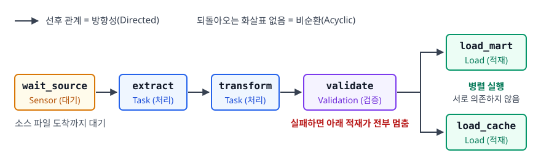
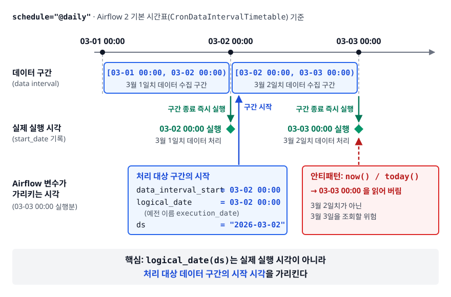
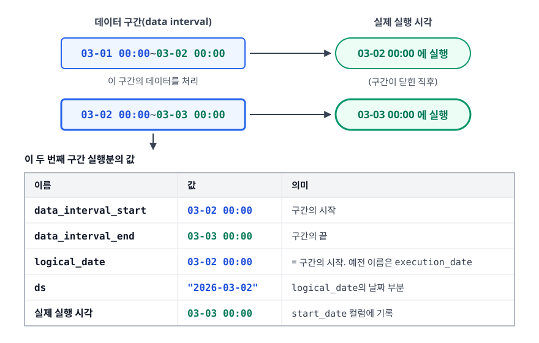

# Airflow와 워크플로우 오케스트레이션 (Apache Airflow)

> cron으로 파이프라인을 돌리면 무엇이 먼저 무너지는지, DAG와 Operator가 그 문제를 어떻게 푸는지, 그리고 초심자가 가장 많이 틀리는 실행 시각과 데이터 구간의 관계를 정확히 설명할 수 있게 됩니다.

## 학습 목표

- [ ] cron 기반 파이프라인의 세 가지 한계를 구체적으로 말할 수 있다
- [ ] DAG / Task / Operator / Sensor의 역할을 구분할 수 있다
- [ ] 매일 자정 DAG가 왜 다음 날에 실행되는지 데이터 구간으로 설명할 수 있다
- [ ] `catchup`과 백필의 관계를 이해하고 안전하게 사용할 수 있다
- [ ] 멱등한 태스크를 코드로 작성할 수 있다
- [ ] XCom을 언제 쓰고 언제 쓰면 안 되는지 판단할 수 있다

## 선행 지식

- [01-etl-pipeline.md](./01-etl-pipeline.md) — 특히 4장의 멱등성 개념
- 파이썬 기본 문법과 cron 표현식

---

## 1. 왜 필요한가

### cron으로 시작한 파이프라인

파이프라인이 하나일 때 cron은 훌륭한 도구입니다.

```bash
# crontab
0 2 * * *  /opt/etl/extract.sh
0 3 * * *  /opt/etl/transform.sh
0 4 * * *  /opt/etl/load.sh
```

여기서 이미 문제가 보입니다. `transform`은 `extract`가 끝났는지 모릅니다. **그냥 3시가 됐기 때문에** 돕니다.

### 한계 1: 의존성을 시간으로 흉내 낸다

`extract`가 소스 DB 지연으로 3시 10분에 끝났다면, `transform`은 3시에 어제 데이터를 가지고 돌아 버립니다. 실패로 잡히지도 않으니 알림도 안 옵니다. 이걸 막으려고 흔히 이렇게 합니다.

```bash
# 안티패턴: 여유 시간으로 의존성을 흉내 내기
0 3 * * *  sleep 1800 && /opt/etl/transform.sh
```

**왜 문제인가**: 소스가 30분 더 밀리면 그대로 깨지고 안 밀리면 30분을 그냥 버립니다. 여유 시간은 항상 부족하거나 항상 낭비인 셈입니다. 파이프라인이 20개가 되면 이 여유 시간들이 겹쳐 전체 배치 창이 몇 시간씩 늘어납니다.

### 한계 2와 3: 재시도도, 가시성도 없다

cron은 명령을 실행할 뿐 결과에 관심이 없습니다. 종료 코드가 1이든 0이든 다음 날 같은 시각에 또 실행하고, 실패한 날의 데이터는 아무도 채워 주지 않습니다. 어제 파이프라인이 몇 시에 끝났는지 알려면 서버에 접속해 로그를 찾아야 하고, 지난 30일 중 며칠이 실패했는지나 어느 태스크가 병목인지는 알 방법이 없습니다. 3월 1일부터 15일까지만 다시 돌리려면 셸 for 루프를 직접 짜야 합니다.

**Airflow는 이 한계들을 풉니다.** 의존성을 그래프로 선언하게 하고 실행 결과를 메타데이터 DB에 기록해 재시도·재실행을 관리하고 그 기록을 UI로 보여 줍니다.

### 비유: 생산 라인 관리자

cron은 정해진 시각에 울리는 알람시계입니다. 알람은 앞 공정이 끝났는지 모릅니다. Airflow는 공정 순서를 알고 있는 관리자에 가깝습니다. 앞 공정이 끝나야 다음 공정에 시작 신호를 주고, 불량이 나면 그 공정만 다시 돌리고, 하루 생산 기록을 남깁니다.

> **비유의 한계**: 관리자와 달리 Airflow는 **일을 직접 하지 않습니다.** Airflow 워커에서 무거운 데이터 처리를 직접 돌리는 것은 대표적인 안티패턴이고 실제 연산은 Spark나 웨어하우스에 맡기고 Airflow는 언제 무엇을 시킬지만 관리하는 것이 정석입니다.

---

## 2. DAG, Task, Operator, Sensor

### DAG — 방향성 비순환 그래프

DAG(Directed Acyclic Graph)는 **작업들과 그 사이의 선후 관계를 표현한 그래프**입니다. 방향성(Directed)은 `extract` 다음에 `transform`이라는 순서를, 비순환(Acyclic)은 되돌아오는 화살표가 없음을 뜻합니다.

비순환이 왜 필수인지는 스케줄러 입장에서 보면 명확합니다. A가 B를 기다리고 B가 A를 기다리면 둘 다 영원히 시작할 수 없습니다. 순환이 있으면 실행 순서를 정하는 것 자체가 불가능합니다.

<!-- diagram:de-airflow-1 -->


<!-- 위 그림이 대체한 원본 ASCII.
     내용을 고칠 때는 그림도 함께 갱신할 것.
```
 ┌─────────────┐  ┌─────────┐  ┌───────────┐  ┌──────────┐  ┌────────────┐
 │ wait_source │─>│ extract │─>│ transform │─>│ validate │─>│ load_mart  │
 └─────────────┘  └─────────┘  └───────────┘  └────┬─────┘  └────────────┘
                                                   │        ┌────────────┐
                                                   └───────>│ load_cache │
                                                            └────────────┘
```
-->

`wait_source`는 소스 파일이 도착할 때까지 기다리는 Sensor입니다. `validate`는 품질 검증이라 여기서 실패하면 아래 적재가 전부 멈춥니다. `load_mart`와 `load_cache`는 서로 의존하지 않으므로 병렬로 실행됩니다.

### 용어 정리

| 개념 | 무엇인가 | 비유 |
|------|---------|------|
| DAG | 워크플로우 전체의 정의(파이썬 파일) | 작업 지시서 |
| DAG Run | 특정 데이터 구간에 대한 DAG의 1회 실행 | 3월 1일자 지시서 실행분 |
| Task | DAG를 구성하는 작업 노드 | 지시서의 한 항목 |
| Task Instance | 특정 DAG Run에서 Task가 1회 실행된 것 | 3월 1일자 `extract` 실행분 |
| Operator | Task를 만드는 템플릿 클래스 | 항목의 종류(SQL 실행/셸 실행) |
| Sensor | 조건이 만족될 때까지 기다리는 특수 Operator | 자재 도착 대기 |
| Scheduler | 시각과 의존성을 보고 태스크를 큐에 넣는 프로세스 | 관리자 |
| Executor | 큐의 태스크를 실제로 실행 (Local, Celery, Kubernetes) | 작업자 배치 방식 |

**DAG와 DAG Run, Task와 Task Instance의 구분**이 중요합니다. DAG를 다시 돌린다는 말은 대개 특정 데이터 구간의 DAG Run을 다시 만든다는 뜻입니다. 표 아래 네 개(Operator부터 Executor까지)는 무엇을, 어떻게, 누가 실행하는가를 나눠 맡는다고 보면 정리됩니다.

### 코드로 보기

```python
from datetime import datetime, timedelta
from airflow import DAG
from airflow.operators.python import PythonOperator
from airflow.providers.common.sql.operators.sql import SQLExecuteQueryOperator

default_args = {"retries": 3, "retry_delay": timedelta(minutes=5)}

with DAG(
    dag_id="daily_sales",
    start_date=datetime(2026, 1, 1),
    schedule="@daily",           # 데이터 구간이 달력 하루와 정확히 일치한다
    catchup=False,
    max_active_runs=1,           # 이전 실행이 안 끝났으면 다음 실행을 시작하지 않는다
    default_args=default_args,
    tags=["sales", "daily"],
) as dag:

    def _extract(data_interval_start, data_interval_end, **_):
        # 처리 구간을 인자로 받는다 — datetime.now()를 쓰지 않는 것이 핵심
        print(f"extract {data_interval_start} ~ {data_interval_end}")

    extract = PythonOperator(task_id="extract", python_callable=_extract)

    transform = SQLExecuteQueryOperator(
        task_id="transform",
        conn_id="warehouse",
        sql=[                      # 문장을 나눠 주면 드라이버의 다중 실행 제약을 피한다
            "DELETE FROM daily_sales WHERE dt = '{{ ds }}'",
            """INSERT INTO daily_sales (dt, product_id, amount)
               SELECT DATE(ordered_at), product_id, SUM(price)
               FROM raw_orders
               WHERE ordered_at >= '{{ data_interval_start }}'
                 AND ordered_at <  '{{ data_interval_end }}'
               GROUP BY 1, 2""",
        ],
    )

    extract >> transform     # 의존성: extract가 성공해야 transform이 시작
```

`{{ ds }}`, `{{ data_interval_start }}` 는 Airflow가 실행 시점에 채워 주는 **Jinja 템플릿 변수**입니다. SQL 안에 날짜를 하드코딩하지 않고 이 변수를 쓰는 것이 백필을 가능하게 하는 첫 번째 조건입니다. 주의할 점이 하나 있습니다. `schedule`을 `0 2 * * *` 같은 cron으로 두면 데이터 구간이 02:00~02:00이 되어 `{{ ds }}`가 가리키는 달력 하루와 어긋납니다. 위처럼 파티션 키와 구간 필터를 함께 쓸 때는 스케줄 경계가 파티션 경계와 맞는지 먼저 확인해야 합니다.

### 최신 스타일: TaskFlow API

```python
from airflow.decorators import dag, task

@dag(dag_id="daily_sales_taskflow", start_date=datetime(2026, 1, 1),
     schedule="@daily", catchup=False)
def daily_sales():

    @task
    def extract(**context) -> str:
        start = context["data_interval_start"]
        return f"s3://raw/orders/{start:%Y-%m-%d}/"   # 데이터가 아니라 "경로"만 반환

    @task
    def transform(path: str):
        print(f"transform data at {path}")

    transform(extract())     # 반환값을 넘기면 의존성이 자동으로 연결된다

daily_sales()
```

함수 반환값을 다음 태스크로 넘기면 의존성이 자동으로 만들어집니다. 내부적으로는 XCom을 쓰므로 6장의 크기 제한이 그대로 적용됩니다.

---

## 3. 실행 시각과 데이터 구간 — 가장 헷갈리는 지점

<!-- diagram:de-airflow-data-interval -->


### 왜 자정 DAG가 다음 날 도는가

`schedule="@daily"`, `start_date=2026-03-01`인 DAG는 **3월 1일 자정이 아니라 3월 2일 자정에 처음 실행됩니다.** 처음 보면 버그처럼 느껴지는데, 배치의 본질을 생각하면 당연합니다.

**3월 1일치 데이터를 집계하려면 3월 1일이 끝나야 합니다.** 3월 1일 00:00에는 아직 그날 데이터가 한 건도 없습니다.

<!-- diagram:de-airflow-2 -->


<!-- 위 그림이 대체한 원본 ASCII.
     내용을 고칠 때는 그림도 함께 갱신할 것.
```
데이터 구간(data interval)          실제 실행 시각
┌──────────────────────────┐
│  03-01 00:00 ~ 03-02 00:00│ ────────> 03-02 00:00 에 실행
└──────────────────────────┘             (구간이 닫힌 직후)
     이 구간의 데이터를 처리

┌──────────────────────────┐
│  03-02 00:00 ~ 03-03 00:00│ ────────> 03-03 00:00 에 실행
└──────────────────────────┘

  data_interval_start = 03-02 00:00
  data_interval_end   = 03-03 00:00
  logical_date        = 03-02 00:00   (= 구간의 시작. 예전 이름은 execution_date)
  ds                  = "2026-03-02"  (logical_date의 날짜 부분)
  실제 실행 시각        = 03-03 00:00   (start_date 컬럼에 기록)
```
-->

### `execution_date`라는 이름이 만든 오해

Airflow 초기에는 이 값의 이름이 `execution_date`였습니다. "실행 날짜"라고 읽히지만 실제로는 **처리 대상 구간의 시작 시각**이라 혼란이 컸습니다. 그래서 이후 `logical_date`로 이름이 바뀌고, 구간을 명시적으로 나타내는 `data_interval_start` / `data_interval_end`가 추가됐습니다. 새로 코드를 쓴다면 후자가 가장 명확합니다. `{{ ds }}`는 날짜 파티션 이름을 만들 때 편해서 여전히 널리 쓰이지만 그 값은 어디까지나 처리 대상일이라는 점을 항상 기억해야 합니다.

### 안티패턴: 태스크 안에서 오늘 날짜를 읽는다

```python
# 안티패턴
from datetime import date

def load():
    today = date.today()
    run_sql(f"DELETE FROM daily_sales WHERE dt = '{today}'")
    run_sql(f"INSERT ... WHERE DATE(ordered_at) = '{today}'")
```

**왜 문제인가**: `today()`를 읽는 순간 처리 구간이 실행 시각에 묶이고 아래가 차례로 깨집니다.

1. 3월 2일 새벽에 도는 배치가 3월 2일(오늘) 데이터를 처리합니다. 실제로 필요한 건 3월 1일치입니다.
2. 3월 1일 배치가 실패해 3월 5일에 다시 돌리면 `today()`가 3월 5일이 되어, 비어 있던 3월 1일은 여전히 비어 있고 3월 5일만 다시 계산됩니다.
3. 백필이 아예 불가능합니다. 과거 구간을 지정할 방법이 없습니다.

```python
# 개선: 구간을 컨텍스트에서 받는다
def load(**context):
    start, end = context["data_interval_start"], context["data_interval_end"]
    run_sql("DELETE FROM daily_sales WHERE dt = %s", [start.date()])
    run_sql("INSERT INTO daily_sales SELECT ... FROM raw_orders "
            "WHERE ordered_at >= %s AND ordered_at < %s", [start, end])
```

이제 이 태스크는 언제 실행되든 상관없이 **주어진 구간만** 처리합니다. 3월 1일 구간을 3개월 뒤에 다시 돌려도 같은 결과가 나옵니다.

---

## 4. catchup과 백필

### catchup — 과거를 자동으로 채운다

`start_date`가 과거이고 `catchup=True`면, Airflow는 `start_date`부터 현재까지 모든 데이터 구간을 훑습니다. **구간마다 DAG Run을 자동으로 만들어 순서대로 실행합니다.** 이 값을 생략했을 때의 기본값은 `catchup_by_default` 설정과 Airflow 버전에 따라 달라지므로, DAG마다 명시하는 편이 안전합니다.

```
start_date = 2026-01-01, schedule = @daily, 오늘 = 2026-03-01
catchup=True  →  01-01 구간부터 02-28 구간까지 59개 DAG Run이 차례로 생성·실행

catchup=False →  가장 최근 구간 하나만 실행하고, 이후 정상 스케줄로 진행
```

### 안티패턴: catchup을 생각 없이 켜 둔다

**왜 문제인가**: `start_date`를 2년 전으로 적어 두고 DAG를 배포하는 순간 700회가 넘는 과거 실행이 줄줄이 돌기 시작합니다. 태스크가 소스 API를 호출한다면 rate limit에 걸려 차단되고, 웨어하우스를 쓴다면 쿼리 비용이 순식간에 치솟습니다. 실제 운영에서 자주 일어나는 사고입니다.

**개선**: DAG를 만들 때 `catchup=False`를 기본으로 두고, 과거를 채워야 할 때만 명시적으로 백필합니다. 과거 구간을 병렬로 돌리면 서로 같은 테이블을 건드리므로 `max_active_runs=1`로 동시 실행 수를 제한하는 것도 함께 걸어 둡니다.

### 백필 — 필요할 때 구간을 지정해서

변환 로직 버그를 고쳤고 지난 2주를 다시 계산해야 한다면, CLI로 구간을 지정합니다.

```bash
# Airflow 2 계열 CLI. 메이저 버전에 따라 하위 명령이 다르므로 --help로 확인한다
airflow dags backfill daily_sales --start-date 2026-02-15 --end-date 2026-02-28
```

**백필이 안전하려면 태스크가 멱등해야 합니다.** 3장에서 본 대로 구간을 파라미터로 받고 5장에서 볼 대로 적재를 덮어쓰기로 구현했다면 백필은 그냥 다시 돌리기일 뿐입니다. 그렇지 않다면 백필은 데이터를 두 배, 세 배로 부풀리는 재앙이 됩니다.

catchup은 자동으로 돌고 백필은 사람이 부르지만 둘 다 과거 구간을 실행한다는 동일한 메커니즘 위에 있습니다.

---

## 5. 멱등한 태스크 작성법

```python
# 안티패턴: append로 적재
def load(**context):
    start = context["data_interval_start"]
    df = compute(start)
    df.to_sql("daily_sales", conn, if_exists="append")
```

**왜 문제인가**: Airflow는 `retries` 설정으로 실패한 태스크를 자동 재시도하는데 적재 도중 커넥션이 끊긴 경우 일부는 이미 들어간 상태입니다. 그 위에 다시 append하면 재시도 한 번이 곧 중복입니다. 재시도가 자동이라는 점이 오히려 문제를 키웁니다.

개선은 3장 마지막의 `load(**context)`와 동일합니다. 구간을 컨텍스트에서 받고, 그 구간을 지운 뒤 삽입하는 두 문장을 하나의 트랜잭션으로 묶습니다. 파일 기반이라면 `s3://mart/daily_sales/dt=2026-03-01/` 처럼 구간별 경로에 `overwrite` 모드로 쓰는 것이 같은 효과를 냅니다.

멱등한 태스크를 만드는 규칙은 세 줄로 압축됩니다.

1. **시각은 밖에서 받는다** — `now()`, `today()` 금지
2. **적재는 append가 아니라 구간 단위 덮어쓰기 또는 키 기준 MERGE**
3. **부작용은 마지막에, 한 번에** — 외부 시스템 호출(알림 발송, 결제 등)은 그 자체로 멱등하지 않으므로 태스크를 분리하고 중복 방지 키를 둔다

---

## 6. XCom과 태스크 간 데이터 전달

### XCom이 하는 일

태스크는 서로 다른 프로세스, 흔히 다른 머신에서 실행됩니다. 그래서 파이썬 변수를 그냥 공유할 수 없습니다. XCom(Cross-Communication)은 **태스크 사이에서 작은 값을 주고받는 통로**입니다. 값은 Airflow 메타데이터 DB를 거쳐 전달됩니다.

```python
@task
def extract(**context):
    path = f"s3://raw/orders/{context['ds']}/"
    upload_to(path)
    return path          # XCom에 저장된다

@task
def transform(path: str):
    df = spark.read.parquet(path)   # 경로만 받아서 데이터는 각자 읽는다
```

### 안티패턴: DataFrame을 XCom으로 넘긴다

```python
# 안티패턴
@task
def extract():
    return pd.read_sql("SELECT * FROM orders", conn)   # 수백만 행

@task
def transform(df):
    return df[df.amount > 0]
```

**왜 문제인가**: 문제가 겹쳐서 옵니다.

1. **메타데이터 DB가 데이터 저장소가 된다** — XCom 값은 스케줄러와 웹서버가 공유하는 메타 DB 테이블에 들어갑니다. 대용량을 넣으면 DB가 비대해져 Airflow 전체가 느려지고, XCom 값 컬럼에는 크기 제한이 있어 큰 값은 아예 실패합니다.
2. **직렬화 비용** — 값은 직렬화되어 저장되고 다시 역직렬화됩니다. 데이터가 클수록 이 왕복이 병목이 됩니다.
3. **재실행이 어려워진다** — `transform`만 다시 돌리려면 XCom에 남은 값에 의존하게 되는데, 그 값의 생명주기를 관리하기가 까다롭습니다.

```python
# 개선: 데이터는 스토리지에, XCom에는 위치만
@task
def extract(**context):
    path = f"s3://staging/orders/{context['ds']}/data.parquet"
    pd.read_sql("SELECT * FROM orders", conn).to_parquet(path)
    return path                      # 문자열 하나

@task
def transform(path: str, **context):
    out = f"s3://staging/orders_clean/{context['ds']}/data.parquet"
    pd.read_parquet(path).query("amount > 0").to_parquet(out)
    return out
```

**XCom으로는 경로, ID, 건수 같은 메타데이터만 넘깁니다.** 실제 데이터는 공유 스토리지에 두고 각 태스크가 읽습니다. 이 원칙 하나로 위 세 문제가 모두 사라지고, 덤으로 각 단계의 중간 결과가 스토리지에 남아 디버깅도 쉬워집니다.

---

## 7. 흔한 안티패턴 모음

### 안티패턴 1: DAG 파일 최상위에서 무거운 작업

```python
# 안티패턴
df = pd.read_sql("SELECT * FROM huge_table", conn)   # 파일 최상위!
threshold = df.amount.mean()

with DAG(...) as dag:
    ...

# 개선: 무거운 작업은 반드시 태스크 함수 안에서
@task
def compute_threshold():
    return float(pd.read_sql("SELECT * FROM huge_table", conn).amount.mean())
```

**왜 문제인가**: 스케줄러는 DAG 폴더의 파이썬 파일을 **주기적으로 반복 파싱**합니다. DAG가 몇 개인지 알기 위해 실행과 무관하게 계속 읽습니다. 최상위에 DB 조회가 있으면 그 쿼리가 몇 분마다 실행되고, DAG가 늘어날수록 스케줄러 전체가 느려집니다. 커넥션 풀이 고갈되어 다른 DAG까지 영향을 받기도 합니다.

### 안티패턴 2: Sensor를 기본 모드로 오래 대기시킨다

```python
wait = S3KeySensor(
    task_id="wait_file",
    bucket_key="s3://raw/orders/{{ ds }}/_SUCCESS",
    poke_interval=300,
    timeout=60 * 60 * 6,      # 최대 6시간 대기
    # mode 를 지정하지 않으면 기본값 "poke" — 안티패턴
    mode="reschedule",        # 개선: 확인 후 슬롯을 반납하고 다음 확인 때 다시 스케줄
)
```

**왜 문제인가**: 기본 `mode="poke"`는 조건을 확인하는 동안 **워커 슬롯을 계속 점유합니다.** 6시간을 기다리는 센서 열 개가 있으면 워커 슬롯 열 개가 아무 일도 하지 않으면서 묶입니다. 심하면 정작 실행해야 할 태스크가 큐에서 대기하고 센서만 자리를 잡고 있습니다. 교착에 가까운 이 상황을 sensor deadlock이라고 부릅니다.

`mode="reschedule"`은 확인 후 태스크를 up_for_reschedule 상태로 두고 슬롯을 반납합니다. 더 나아가 deferrable operator(트리거러 프로세스가 비동기로 대기)를 지원하는 센서라면 그쪽이 자원 효율이 가장 좋습니다. 대기가 길수록 이 선택이 중요해집니다.

### 안티패턴 3: 하나의 거대한 PythonOperator

`추출 + 변환 + 검증 + 적재`를 `PythonOperator` 하나에 넣으면, 적재에서 실패했을 때 추출부터 다시 해야 합니다. 어느 단계가 느린지 UI에서 알 수 없고 재시도 정책을 단계별로 다르게 줄 수도 없습니다(외부 API 호출은 재시도가 유용하지만 적재는 아닐 수 있습니다).

**개선**: 태스크는 **실패했을 때 여기서부터 다시 시작하면 되는 지점** 단위로 쪼갭니다. 반대로 지나치게 잘게 쪼개면 스케줄링 오버헤드와 XCom 왕복만 늘어나므로, 재시작 지점이 기준이라고 생각하면 균형이 잡힙니다.

### 안티패턴 4: Airflow 워커에서 대용량 처리

**왜 문제인가**: 워커에서 수천만 행을 pandas로 처리하면 워커 메모리가 터지고 그 워커에 배정된 다른 DAG의 태스크까지 함께 죽습니다. 연산 엔진이 할 일을 오케스트레이터에 떠넘긴 탓이고 그 대가로 Airflow 전체의 안정성이 데이터 크기에 인질로 잡힙니다.

**개선**: 무거운 연산은 웨어하우스에 SQL로 위임하거나(`SQLExecuteQueryOperator`), Spark 클러스터에 제출하고 Airflow는 완료를 기다리기만 합니다. Airflow가 다루는 데이터는 작업을 시키는 명령과 성공 여부뿐이어야 합니다.

---

## 8. 실무에서는

- **Executor 선택이 운영 성격을 결정합니다.** LocalExecutor는 단일 머신에서 프로세스로 병렬 실행해 소규모에 충분하고, CeleryExecutor는 워커를 여러 대로 늘려 처리량을 확보하며, KubernetesExecutor는 태스크마다 파드를 띄워 자원 격리와 태스크별 이미지 지정이 가능합니다. 태스크마다 필요한 라이브러리가 다르면 Kubernetes 계열로 가는 경우가 많습니다.
- **관리형 서비스가 흔합니다.** Google Cloud Composer, AWS MWAA, Astronomer를 쓰면 스케줄러·웹서버·메타 DB 운영 부담을 덜 수 있습니다. 다만 버전 업그레이드 주기와 커스터마이징 제약은 제품마다 다릅니다.
- **dbt와의 조합이 표준 패턴입니다.** Airflow가 언제 어떤 순서로 돌릴지를 정하고 SQL 변환 로직과 테스트는 dbt가 담당합니다. dbt 명령을 태스크 하나로 실행하거나, dbt 모델별로 태스크를 자동 생성해 실패 지점을 세밀하게 보는 방식이 함께 쓰입니다.
- **대안 도구도 알아 두면 좋습니다.** Dagster는 태스크 대신 생산되는 데이터 자산(asset)을 1급 개념으로 두고 Prefect는 동적 워크플로우가 강점입니다. "Airflow의 단점은?"이라는 질문에는 태스크 구조가 실행 중 바뀌는 워크플로우를 표현하기 불편하다는 점, 태스크 실행에 초점이 맞춰져 데이터 계보 추적이 약하다는 점을 들면 됩니다.

---

## 9. 면접 포인트

> 면접에서 이 주제가 나오면 이렇게 답한다

**Q. cron 대신 Airflow를 쓰는 이유는 무엇인가요?**
A. cron은 시간만 알고 의존성을 모릅니다. 앞 작업이 밀려도 뒤 작업이 그냥 돌면서 옛 데이터로 결과를 만들고, 실패하지 않으니 알림도 안 옵니다. 재시도와 복구 개념도 없어서 실패한 날의 데이터는 사람이 손으로 채워야 합니다. 실행 이력도 남지 않아 어제 몇 시에 끝났는지, 지난달에 며칠 실패했는지 알 수 없습니다. Airflow는 의존성을 DAG로 선언하게 하고 모든 실행을 메타 DB에 기록해 재시도·백필·모니터링을 제공합니다.
- 꼬리 질문: "그럼 cron은 언제 쓰나요?" → 의존성이 없는 단일 스크립트, 예를 들어 로그 로테이션이나 헬스체크 같은 것은 여전히 cron이 적합하다고 답합니다.

**Q. `logical_date`(예전 `execution_date`)가 실제 실행 시각과 다른 이유는 무엇인가요?**
A. 그 값은 실행 시각이 아니라 **처리 대상 데이터 구간의 시작 시각**이기 때문입니다. 3월 1일 하루치를 집계하려면 3월 1일이 끝나야 하므로, 3월 1일 구간의 DAG Run은 3월 2일 자정에 실행됩니다. 이름이 `execution_date`였을 때 오해가 많아서 이후 `logical_date`로 바뀌고 `data_interval_start` / `data_interval_end`가 추가됐습니다. 실무에서는 구간이 명시적으로 드러나는 `data_interval_*`를 쓰는 편이 안전합니다.
- 꼬리 질문: "이 개념이 왜 중요한가요?" → 태스크가 `now()` 대신 이 구간을 파라미터로 받아야 재시도와 백필이 같은 결과를 내기 때문이라고 답합니다.

**Q. Airflow 태스크를 멱등하게 작성한다는 것은 구체적으로 무엇인가요?**
A. 같은 데이터 구간으로 몇 번을 실행하든 결과 상태가 같아야 한다는 뜻입니다. 처리 구간을 컨텍스트에서 받아 `now()`를 쓰지 않고, 적재를 append 대신 해당 파티션을 지우고 다시 쓰거나 키 기준 MERGE로 하고, 알림 발송 같은 외부 부작용은 태스크를 분리해 중복 방지 키를 둡니다. Airflow는 `retries` 설정으로 실패한 태스크를 자동 재시도하기 때문에, 멱등하지 않으면 자동 재시도 자체가 데이터를 망가뜨립니다.
- 꼬리 질문: "백필과의 관계는요?" → 백필은 과거 구간을 다시 실행하는 것뿐이므로, 멱등성이 보장되면 백필은 그냥 재실행이고 아니면 재앙이 된다고 답합니다.

**Q. 태스크 간에 데이터를 어떻게 넘기나요? XCom의 한계는요?**
A. 태스크는 서로 다른 프로세스나 머신에서 돌아 변수를 직접 공유할 수 없으므로 XCom을 씁니다. 다만 XCom 값은 메타데이터 DB에 저장되므로 DataFrame처럼 큰 데이터를 넘기면 DB가 비대해지고 직렬화 비용이 붙으며 값 크기 제한에 걸립니다. 그래서 실제 데이터는 S3 같은 공유 스토리지에 쓰고 XCom으로는 경로나 ID만 넘깁니다. 중간 결과가 스토리지에 남으니 디버깅과 부분 재실행도 쉬워집니다.
- 꼬리 질문: "TaskFlow API에서 반환값을 넘기는 것도 XCom인가요?" → 그렇습니다. 문법만 함수 반환처럼 보일 뿐 내부는 XCom이므로 같은 크기 제약이 적용된다고 답합니다.

---

## 자주 하는 실수

| 실수 | 왜 틀렸나 | 올바른 이해 |
|------|----------|-----------|
| "`execution_date`는 DAG가 실행된 시각이다" | 처리 대상 구간의 시작 시각이다 | 실제 실행 시각은 구간이 닫힌 뒤다. `logical_date` / `data_interval_*`로 이해한다 |
| "DAG 파일 최상위 코드는 실행할 때만 돈다" | 스케줄러가 DAG 파일을 주기적으로 반복 파싱한다 | 최상위에는 DAG 정의만 두고 무거운 작업은 태스크 함수 안으로 |
| "재시도를 늘리면 안정성이 올라간다" | 멱등하지 않은 태스크의 재시도는 중복을 만든다 | 멱등성이 먼저, 재시도는 그다음 |
| "Sensor는 그냥 걸어 두면 된다" | 기본 poke 모드는 대기 중에도 워커 슬롯을 점유한다 | 긴 대기는 `mode="reschedule"` 또는 deferrable |
| "Airflow에서 데이터를 처리한다" | Airflow는 오케스트레이터이지 연산 엔진이 아니다 | 연산은 웨어하우스/Spark에 위임하고 Airflow는 지휘만 |
| "catchup은 켜 두는 게 안전하다" | 과거 `start_date`로 배포하는 순간 수백 회의 과거 실행이 줄줄이 돈다 | 기본은 `catchup=False`, 필요할 때만 명시적으로 백필 |
| "태스크는 잘게 쪼갤수록 좋다" | 스케줄링 오버헤드와 XCom 왕복이 늘어난다 | 실패 시 여기서부터 다시 시작할 지점 단위로 나눈다 |

---

## 한 줄 정리

Airflow는 파이프라인의 의존성·재시도·이력을 코드로 선언하게 만드는 오케스트레이터이며 이 도구를 제대로 쓰는 핵심은 태스크가 언제 실행되는지가 아니라 어느 데이터 구간을 처리하는지만 알게 만들어 언제 다시 돌려도 같은 결과가 나오게 하는 것입니다.

---

## 연관 개념

- [01-etl-pipeline.md](./01-etl-pipeline.md) - Airflow가 지휘하는 파이프라인 단계와 멱등성의 배경
- [03-kafka.md](./03-kafka.md) - 배치 스케줄 대신 이벤트가 오면 바로 처리하는 접근
- [04-spark.md](./04-spark.md) - Airflow가 제출하고 기다리는 실제 연산 엔진
- [05-batch-vs-streaming.md](./05-batch-vs-streaming.md) - 배치 오케스트레이션이 적합한 경우와 아닌 경우
- [qna-data-engineering.md](./qna-data-engineering.md) - DAG와 멱등성·백필 면접 질문(Q2)
