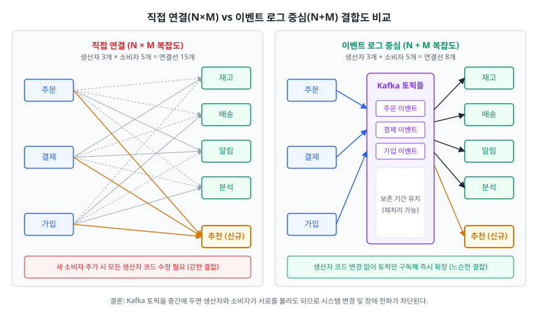
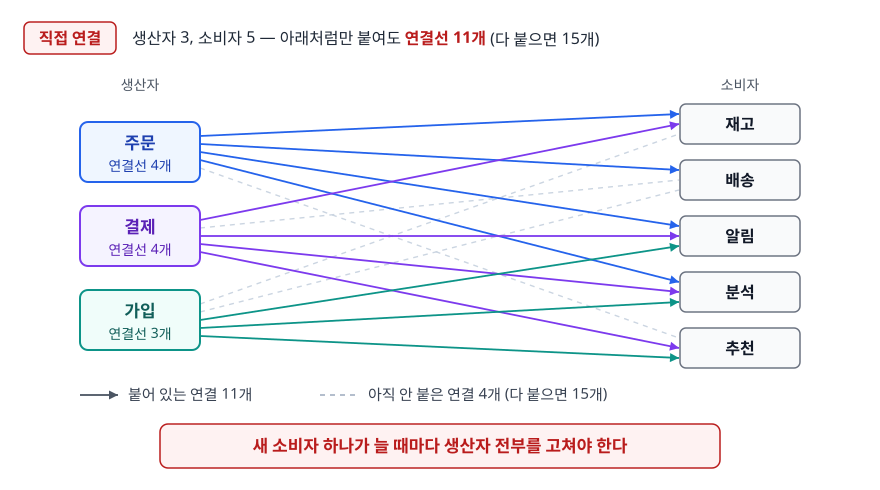
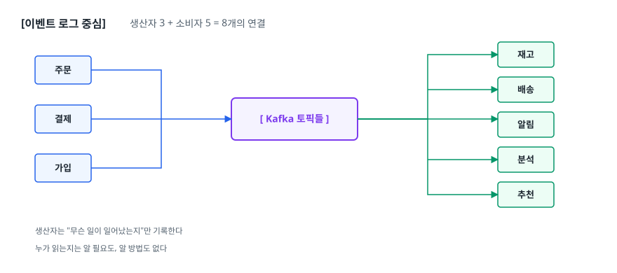
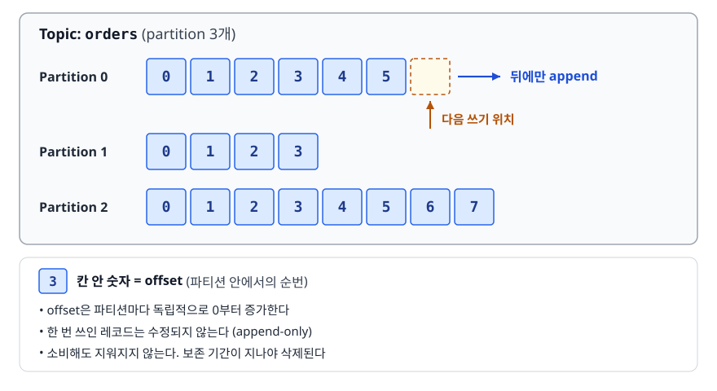
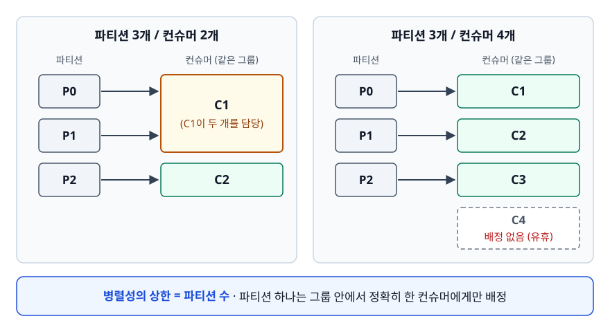
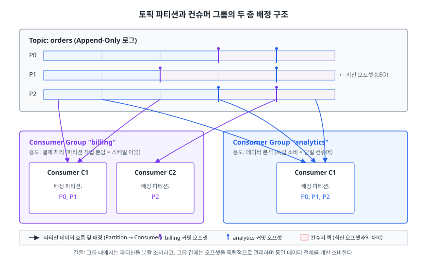
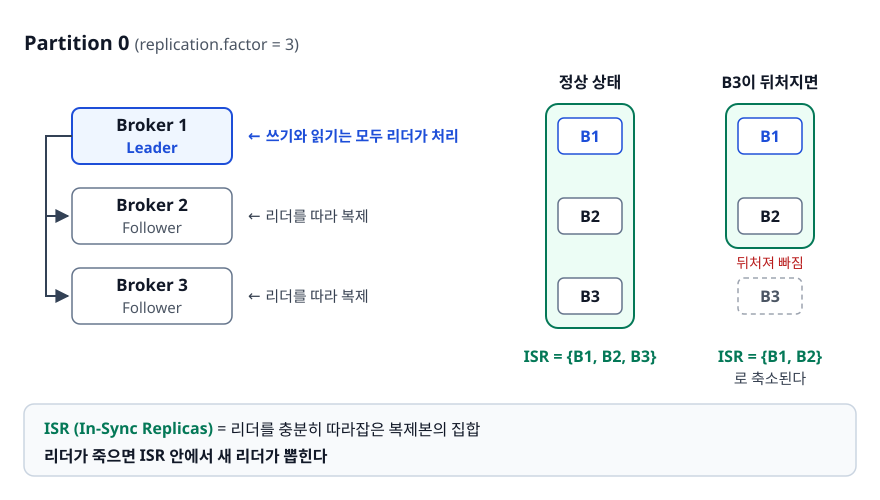
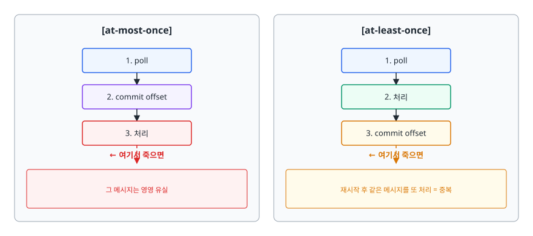

# Kafka와 이벤트 스트리밍 (Apache Kafka)

> 주문 서비스가 재고·배송·알림 시스템을 직접 호출하기 시작하면 통합 비용이 왜 폭발하는지부터 봅니다. Kafka의 토픽·파티션·오프셋 구조가 그 문제를 어떻게 푸는지, "정확히 한 번"이 실무에서 무엇을 뜻하는지까지 설명합니다.

## 학습 목표

- [ ] 시스템 간 직접 연결이 N×M으로 늘어나는 이유를 그림으로 설명할 수 있다
- [ ] 파티션이 왜 병렬성과 순서 보장의 단위인지 말할 수 있다
- [ ] 컨슈머 그룹과 리밸런싱이 언제 일어나고 왜 위험한지 안다
- [ ] `acks`와 `min.insync.replicas`의 관계를 설명할 수 있다
- [ ] at-least-once + 멱등 소비자 패턴을 코드 수준에서 설계할 수 있다
- [ ] Kafka와 RabbitMQ를 상황에 맞게 고를 수 있다

## 선행 지식

- [01-etl-pipeline.md](./01-etl-pipeline.md) - 수집 단계의 위치를 알면 이해가 빠릅니다
- 분산 시스템의 복제와 일관성 감각: [CAP과 일관성](../09-system-design/scalability/01-cap-consistency.md)

---

## 1. 왜 필요한가

<!-- diagram:de-kafka-coupling -->


### 서비스가 늘어날수록 연결선이 제곱으로 는다

주문이 들어오면 다음 일이 일어나야 한다고 해 보겠습니다.

- 재고 시스템이 수량을 줄입니다
- 배송 시스템이 배송 건을 만듭니다
- 알림 시스템이 문자를 보냅니다
- 데이터 팀이 분석 웨어하우스에 적재합니다
- 추천 시스템이 사용자 선호를 갱신합니다

가장 단순하게 짜면 주문 서비스가 다섯 곳을 직접 호출합니다.

<!-- diagram:de-kafka-1 -->


<!-- 위 그림이 대체한 원본 ASCII.
     내용을 고칠 때는 그림도 함께 갱신할 것.
```
[직접 연결]  생산자 3, 소비자 5 — 아래처럼만 붙여도 연결선 11개 (다 붙으면 15개)

  주문 ──┬──> 재고
         ├──> 배송
         ├──> 알림
         └──> 분석
  결제 ──┬──> 재고
         ├──> 알림
         ├──> 분석
         └──> 추천
  가입 ──┬──> 알림
         ├──> 분석
         └──> 추천

  새 소비자 하나가 늘 때마다 생산자 전부를 고쳐야 한다
```
-->

그런데 개수보다 **결합**이 더 큰 문제입니다.

1. **생산자가 소비자를 알아야 합니다** — 추천 시스템을 추가하려면 주문·결제·가입 서비스의 코드를 모두 열어 고쳐야 합니다. 새 기능 하나에 세 팀이 배포합니다.
2. **소비자 장애가 생산자로 번집니다** — 알림 서비스가 느려지면 주문 API의 응답 시간이 같이 늘어납니다. 문자 발송 실패가 주문 실패가 됩니다.
3. **재처리가 불가능합니다** — 분석 시스템에 버그가 있어 지난주 데이터를 다시 받고 싶어도, 이미 지나간 HTTP 호출을 되돌릴 방법이 없습니다.
4. **속도가 안 맞습니다** — 주문은 초당 수천 건인데 추천 모델 갱신은 건당 수백 밀리초가 걸린다면, 동기 호출로는 답이 없습니다.

### 가운데에 로그를 하나 둔다

<!-- diagram:de-kafka-2 -->


<!-- 위 그림이 대체한 원본 ASCII.
     내용을 고칠 때는 그림도 함께 갱신할 것.
```
[이벤트 로그 중심]  생산자 3 + 소비자 5 = 8개의 연결

  주문 ──┐                       ┌──> 재고
  결제 ──┼──> [ Kafka 토픽들 ] ──┼──> 배송
  가입 ──┘                       ├──> 알림
                                 ├──> 분석
                                 └──> 추천

  생산자는 "무슨 일이 일어났는지"만 기록한다
  누가 읽는지는 알 필요도, 알 방법도 없다
```
-->

연결 수가 N×M에서 N+M으로 줄었습니다. 그리고 이제 **생산자와 소비자는 서로를 모릅니다**. 이 변화가 연결 수보다 더 큽니다. 추천 시스템은 기존 코드를 한 줄도 고치지 않고 토픽을 구독하기만 하면 됩니다. 알림 서비스가 30분간 죽어 있어도 주문은 정상 처리되고, 살아나면 밀린 이벤트부터 이어서 읽습니다.

여기까지는 일반적인 메시지 큐도 하는 일입니다. Kafka는 여기서 갈라집니다. **읽었다고 메시지를 지우지 않습니다.** 메시지는 설정된 보존 기간 동안 디스크에 남아 있고, 소비자는 어디까지 읽었는지 그 위치만 관리합니다. 그래서 분석 시스템의 버그를 고친 뒤 오프셋을 3일 전으로 되감아 다시 읽으면 됩니다. 재처리가 가능한 것은 이 한 가지 때문입니다.

### 비유: 신문사와 구독

신문사는 누가 신문을 읽는지 모른 채 발행하고, 구독자는 자기 속도로 읽습니다. 지난 신문은 서고에 남아 있어서 나중에 온 사람도 과거 기사를 찾아 읽습니다. 생산자-소비자 분리와 보존이라는 Kafka의 두 성질이 그대로 대응됩니다.

> **비유의 한계**: 신문에서는 모든 구독자가 같은 지면을 통째로 받습니다. Kafka의 컨슈머 그룹은 다릅니다. 파티션을 나눠 가지기 때문에 **그룹 안의 각 컨슈머는 전체 중 일부만** 읽습니다. 그룹이 다르면 각자 전체를 읽습니다. 이 두 층의 구분이 3장의 주제입니다.

---

## 2. 토픽, 파티션, 오프셋

### 토픽은 파티션으로 쪼개진다

토픽(Topic)은 이벤트의 논리적 분류입니다. `orders`, `payments` 같은 이름을 붙입니다. 그런데 토픽 하나가 통짜 파일이라면 쓰는 쪽도 읽는 쪽도 한 곳에 몰려 확장이 안 됩니다. 그래서 토픽을 **파티션(Partition)** 이라는 여러 개의 로그로 쪼갭니다.

<!-- diagram:de-kafka-3 -->


<!-- 위 그림이 대체한 원본 ASCII.
     내용을 고칠 때는 그림도 함께 갱신할 것.
```
Topic: orders (partition 3개)

Partition 0 : [0][1][2][3][4][5] ──> 뒤에만 append
                                ↑ 다음 쓰기 위치
Partition 1 : [0][1][2][3]
Partition 2 : [0][1][2][3][4][5][6][7]

  대괄호 안 숫자 = offset (파티션 안에서의 순번)
  - offset은 파티션마다 독립적으로 0부터 증가한다
  - 한 번 쓰인 레코드는 수정되지 않는다 (append-only)
  - 소비해도 지워지지 않는다. 보존 기간이 지나야 삭제된다
```
-->

각 파티션은 **끝에만 덧붙이는 로그 파일**입니다. 랜덤 쓰기 없이 순차로만 쓰기 때문에 디스크에서도 매우 빠르고, OS 페이지 캐시와 잘 맞아떨어집니다. Kafka가 디스크 기반인데도 처리량이 높은 이유의 상당 부분이 여기서 나옵니다.

### 파티션이 병렬성의 단위인 이유

파티션 하나는 컨슈머 그룹 안에서 **정확히 한 컨슈머**에게만 배정됩니다. 이 규칙 때문에 두 가지가 따라옵니다.

- 파티션이 많을수록 더 많은 컨슈머가 동시에 읽을 수 있어서 → **병렬성의 상한이 파티션 수**
- 컨슈머를 파티션 수보다 많이 띄우면 남는 컨슈머는 놀게 됩니다

<!-- diagram:de-kafka-6 -->


<!-- 위 그림이 대체한 원본 ASCII.
     내용을 고칠 때는 그림도 함께 갱신할 것.
```
파티션 3개 / 컨슈머 2개              파티션 3개 / 컨슈머 4개
  P0 ──> C1                           P0 ──> C1
  P1 ──> C1                           P1 ──> C2
  P2 ──> C2                           P2 ──> C3
  (C1이 두 개를 담당)                   C4 ──> 배정 없음 (유휴)
```
-->

### 파티션이 순서 보장의 단위인 이유

Kafka는 **파티션 안에서만** 순서를 보장하고, 토픽 전체의 전역 순서는 보장하지 않습니다. 파티션들이 서로 다른 브로커에 있고 각각 따로 쓰이므로, 전역 순서를 보장하려면 파티션이 하나여야 합니다. 그러면 병렬성이 사라집니다.

**병렬성과 전역 순서는 맞바꾸는 관계**입니다. 실무에서는 전역 순서를 포기하고 **필요한 범위의 순서만** 지킵니다. 같은 키는 항상 같은 파티션으로 가도록 파티셔닝하면 충분합니다.

```java
// order_id를 키로 주면 같은 주문의 이벤트는 같은 파티션으로 간다
// → CREATED, PAID, SHIPPED 순서가 보장된다
producer.send(new ProducerRecord<>("orders", order.getId(), payload));

// 키가 null이면 파티션에 분산 배치된다 → 순서 보장 없음, 균등 분산
producer.send(new ProducerRecord<>("orders", payload));
```

기본 파티셔너는 키가 있으면 키의 해시로 파티션을 결정합니다. 그래서 **같은 키 = 같은 파티션 = 순서 보장**이 성립합니다.

### 안티패턴: 순서를 지키려고 파티션을 1개로 둔다

**왜 문제인가**: 처리량 상한이 컨슈머 한 대로 고정됩니다. 트래픽이 늘어도 확장할 방법이 없고, 그 컨슈머가 느려지면 지연(lag)이 무한정 쌓입니다. 나중에 파티션을 늘리면 기존 키의 해시 배정이 바뀌어 같은 키가 다른 파티션으로 흩어지므로, 그 시점의 순서 보장도 깨집니다.

**개선**: 순서가 필요한 진짜 단위를 찾아 그것을 키로 삼습니다. 대부분은 한 주문 안에서 상태가 바뀌는 순서만 지키면 충분합니다. 모든 주문의 순서까지는 필요 없습니다. 그리고 **파티션 수는 처음부터 넉넉하게 잡습니다.** 파티션은 늘릴 수 있지만 줄일 수 없고, 늘리는 순간 키-파티션 매핑이 바뀝니다. 이 점은 미리 기억해 두어야 합니다.

---

## 3. 컨슈머 그룹과 리밸런싱

### 두 층의 구조

<!-- diagram:de-kafka-partition-group -->


<!-- 위 그림이 대체한 원본 ASCII.
     내용을 고칠 때는 그림도 함께 갱신할 것.
```
Topic: orders (P0, P1, P2)
        │
        ├──> Consumer Group "billing"     ← 각 파티션을 나눠 갖는다
        │      C1: P0, P1     C2: P2         (작업 분담 = 스케일 아웃)
        │
        └──> Consumer Group "analytics"   ← 다른 그룹은 독립적으로 전체를 읽는다
               C1: P0, P1, P2                (오프셋도 따로 관리)
```
-->

**같은 그룹 안의 컨슈머들은 파티션을 나눠 갖습니다. 그룹이 다르면 같은 데이터를 각자 전부 읽습니다.** 이 두 층 덕분에 여러 시스템이 같은 이벤트를 각자의 용도로 소비하면서, 한 시스템 안에서는 처리량을 늘리는 병렬화도 함께 가능합니다.

각 그룹은 진행 위치를 오프셋으로 관리합니다. 커밋된 오프셋은 Kafka 내부 토픽에 저장되므로 컨슈머가 재시작해도 이어서 읽습니다.

### 리밸런싱 — 파티션을 다시 나눠 갖는 순간

컨슈머가 추가/제거되거나, 죽었다고 판단되거나, 토픽의 파티션 수가 바뀌면 그룹은 파티션 배정을 다시 계산합니다. 이것이 리밸런싱(Rebalancing)입니다.

전통적인 방식(eager)에서는 리밸런싱이 시작되면 **모든 컨슈머가 파티션을 일단 전부 반납하고 다시 배정받습니다.** 그동안 그룹 전체가 아무것도 처리하지 못합니다. 컨슈머와 파티션이 많을수록 이 정지 시간이 길어집니다.

### 안티패턴: poll 루프 안에서 오래 걸리는 처리를 한다

```java
// 안티패턴
while (true) {
    ConsumerRecords<String, String> records = consumer.poll(Duration.ofMillis(100));
    for (ConsumerRecord<String, String> record : records) {
        callSlowExternalApi(record.value());   // 건당 수 초가 걸린다
    }
}
```

**왜 문제인가**: 하트비트는 별도 스레드가 보내므로 연결 자체는 살아 있어 보입니다. 하지만 Kafka는 `poll()` 호출 간격이 `max.poll.interval.ms`를 넘으면 그 컨슈머가 진행하지 못한다고 보고 **그룹에서 내보내며 리밸런싱을 일으킵니다.** 처리를 끝내고 돌아온 컨슈머는 이미 파티션을 잃었으므로 커밋에 실패하고, 다시 그룹에 참여하면서 또 리밸런싱을 유발합니다. 그룹이 리밸런싱만 반복하며 처리량이 0에 수렴하는 상태에 빠집니다.

**개선 방향은 세 갈래입니다.**

1. `max.poll.records`를 줄여 한 번에 가져오는 레코드 수를 낮춥니다
2. `max.poll.interval.ms`를 실제 처리 시간에 맞게 늘립니다
3. 처리를 별도 스레드 풀로 넘기되, 그러면 오프셋 커밋 시점 관리가 복잡해지므로 신중히 설계합니다

부수적으로 `CooperativeStickyAssignor` 같은 협력적 리밸런싱 전략을 쓰면, 영향받는 파티션만 옮기고 나머지는 계속 처리하므로 정지 시간이 크게 줄어듭니다.

---

## 4. 복제와 ISR, 그리고 acks

### 파티션은 여러 브로커에 복제된다

<!-- diagram:de-kafka-4 -->


<!-- 위 그림이 대체한 원본 ASCII.
     내용을 고칠 때는 그림도 함께 갱신할 것.
```
Partition 0 (replication.factor = 3)

  Broker 1 : [Leader]    ← 쓰기와 읽기는 모두 리더가 처리
  Broker 2 : [Follower]  ← 리더를 따라 복제
  Broker 3 : [Follower]

  ISR (In-Sync Replicas) = 리더를 충분히 따라잡은 복제본의 집합
  - 위 상태에서 ISR = {B1, B2, B3}
  - B3이 뒤처지면 ISR = {B1, B2} 로 축소된다
  - 리더가 죽으면 ISR 안에서 새 리더가 뽑힌다
```
-->

ISR이 중요한 이유는 **새 리더는 ISR 안에서만 뽑히기 때문**입니다. 뒤처진 복제본이 리더가 되면 그 사이의 메시지가 사라집니다.

### acks — 프로듀서가 "성공"으로 치는 기준

| 설정 | 언제 성공으로 보나 | 유실 위험 | 지연 |
|------|-------------------|----------|------|
| `acks=0` | 보내자마자 (응답을 안 기다림) | 높음 | 가장 낮음 |
| `acks=1` | 리더가 자기 로그에 기록하면 | 리더가 복제 전에 죽으면 유실 | 중간 |
| `acks=all` | ISR 전체가 기록하면 | 매우 낮음 | 가장 높음 |

### 안티패턴: `acks=all`만 설정하고 안심한다

```properties
# 안티패턴
acks=all
min.insync.replicas=1     # 토픽/브로커 설정
```

**왜 문제인가**: `acks=all`은 **ISR에 있는 복제본 전부**가 기록해야 성공으로 칩니다. 그런데 팔로워들이 전부 뒤처져 ISR에서 빠지면 ISR에 리더 하나만 남는 일이 생깁니다. 그러면 `acks=all`은 사실상 `acks=1`과 같아집니다. 리더가 그 직후 죽으면 데이터가 사라집니다. 유실이 없다고 믿었는데 유실이 나는, 가장 곤란한 사고입니다.

```properties
# 개선
acks=all
min.insync.replicas=2     # ISR이 2 미만이면 쓰기를 거부한다
replication.factor=3
```

`min.insync.replicas=2`를 걸면 ISR이 2개 미만일 때 프로듀서 쓰기가 실패합니다. 조용히 유실되느니 명시적으로 실패하는 쪽이 낫습니다. `replication.factor=3`과 `min.insync.replicas=2`를 함께 쓰면 브로커 한 대까지는 죽어도 쓰기가 그대로 진행됩니다. 두 대가 죽으면 쓰기는 멈추지만, 대신 데이터는 지킵니다.

> **`acks`는 프로듀서 설정, `min.insync.replicas`는 토픽/브로커 설정입니다.** 둘은 짝으로 설정해야 의미가 있고, 한쪽만 바꾸면 기대한 보장이 성립하지 않습니다.

---

## 5. 전달 보장 세 단계

| 보장 수준 | 의미 | 어떻게 생기나 | 실무 위치 |
|-----------|------|-------------|----------|
| At-most-once | 최대 한 번 (유실 가능, 중복 없음) | 처리 **전에** 오프셋 커밋 | 유실이 허용되는 지표성 로그 |
| At-least-once | 최소 한 번 (중복 가능, 유실 없음) | 처리 **후에** 오프셋 커밋 | 기본값. 대부분의 시스템 |
| Exactly-once | 정확히 한 번 | 처리와 커밋을 하나의 트랜잭션으로 | Kafka 내부 처리에 한정 |

### 커밋 순서가 보장 수준을 결정한다

<!-- diagram:de-kafka-5 -->


<!-- 위 그림이 대체한 원본 ASCII.
     내용을 고칠 때는 그림도 함께 갱신할 것.
```
[at-most-once]              [at-least-once]
  1. poll                     1. poll
  2. commit offset            2. 처리
  3. 처리  ← 여기서 죽으면     3. commit offset ← 여기서 죽으면
     그 메시지는 영영 유실        재시작 후 같은 메시지를 또 처리 = 중복
```
-->

### 안티패턴: 자동 커밋에 맡긴다

```java
// 안티패턴
props.put("enable.auto.commit", "true");   // 주기적으로 알아서 커밋
```

**왜 문제인가**: 자동 커밋은 `poll()`을 호출하는 시점에 `auto.commit.interval.ms`가 지났으면 **직전 poll이 돌려준 레코드까지 오프셋을 커밋합니다.** 실제 처리 여부는 확인하지 않습니다. 배치를 다 처리하지 못한 채 다음 `poll()`에 도달하거나 처리를 별도 스레드로 넘긴 구조라면, 메시지를 아직 처리하지 않았는데 오프셋만 이미 커밋된 상태가 됩니다. 그때 프로세스가 죽으면 그 메시지는 영영 사라집니다. at-least-once를 기대했는데 at-most-once가 나옵니다.

```java
// 개선: 처리 완료 후 명시적 커밋
props.put("enable.auto.commit", "false");

while (true) {
    ConsumerRecords<String, String> records = consumer.poll(Duration.ofMillis(500));
    for (ConsumerRecord<String, String> record : records) {
        handle(record);                  // 처리를 먼저
    }
    consumer.commitSync();               // 처리가 끝난 뒤 커밋
}
```

### Exactly-once가 실무에서 뜻하는 것

Kafka는 프로듀서 멱등성(중복 전송으로 인한 로그 내 중복 제거)과 트랜잭션(여러 파티션 쓰기와 오프셋 커밋을 원자적으로 처리)을 제공합니다. Kafka Streams에서 처리 보장 수준을 exactly-once로 설정하면, Kafka에서 읽어 Kafka에 쓰는 파이프라인은 정확히 한 번 처리를 보장받을 수 있습니다.

**다만 그 보장에는 경계가 있습니다.** 컨슈머가 결제 API를 호출하거나 외부 DB에 쓰는 순간, 그 부작용은 Kafka 트랜잭션 밖입니다. Kafka가 아무리 보장해도 외부 시스템에 요청이 두 번 가는 일이 생깁니다. 그래서 실무는 표준을 이렇게 잡습니다.

> **at-least-once로 전달받고 소비자 쪽에서 멱등하게 처리합니다.**

### 멱등 소비자 만들기

```java
// 이벤트마다 고유한 ID를 부여하고, 처리 이력을 저장한다
@Transactional
public void handle(OrderEvent event) {
    // processed_events(event_id) 에 UNIQUE 제약이 걸려 있다
    int inserted = jdbc.update(
        "INSERT INTO processed_events(event_id, processed_at) VALUES (?, now()) " +
        "ON CONFLICT (event_id) DO NOTHING", event.getEventId());

    if (inserted == 0) {
        return;                      // 이미 처리한 이벤트 → 조용히 종료
    }
    applyBusinessLogic(event);       // 같은 트랜잭션 안에서 실제 처리
}
```

**중복 판별 기록과 실제 처리는 같은 트랜잭션에 묶어야 합니다.** 두 개를 나누면 기록은 했는데 처리 전에 죽는 창이 생겨 유실이 됩니다.

이벤트 ID를 만들 수 없다면 다른 선택지도 있습니다.

- **자연 멱등 연산으로 바꿉니다** — `balance = balance - 100`(비멱등) 대신 `status = 'PAID'`처럼 몇 번을 적용해도 결과가 같은 갱신으로 설계합니다
- **업서트로 바꿉니다** — 같은 키로 들어오는 INSERT를 UPDATE로 흡수합니다
- **버전/시퀀스를 비교합니다** — 이벤트에 담긴 버전이 현재 저장된 버전보다 클 때만 적용합니다

---

## 6. Kafka와 RabbitMQ는 무엇이 다른가

둘 다 메시지를 중개한다는 점은 같습니다. 다만 RabbitMQ는 **작업 큐(task queue)** 에서 출발했고 Kafka는 **분산 커밋 로그**에서 출발했으니, 설계 목표가 처음부터 달랐습니다.

| 기준 | Kafka | RabbitMQ |
|------|-------|----------|
| 핵심 추상화 | 보존되는 로그 | 소비되면 사라지는 큐 |
| 소비 후 메시지 | 남아 있음 (보존 기간까지) | 삭제됨 (ack 시) |
| 진행 상태 | 컨슈머가 오프셋을 관리 | 브로커가 메시지별 상태를 관리 |
| 전달 방식 | 컨슈머가 pull | 브로커가 push (prefetch로 조절) |
| 재처리 | 오프셋을 되감으면 됨 | 원칙적으로 불가 (별도 저장 필요) |
| 라우팅 | 토픽과 키 기반, 단순 | Exchange 타입으로 유연 (direct/fanout/topic/headers) |
| 개별 메시지 제어 | 어려움 (오프셋 단위) | 쉬움 (메시지별 ack/nack, 우선순위, TTL) |
| 순서 | 파티션 내 보장 | 큐 내 보장 (단, 재전송·다중 소비자 시 흔들림) |
| 강점 | 높은 처리량, 이력 보존, 다중 구독 | 복잡한 라우팅, 정교한 개별 메시지 처리 |

> 선택 기준: **이벤트를 여러 시스템이 각자 소비하고 나중에 다시 읽을 수 있어야 하면 Kafka**, **작업을 워커에게 분배하고 개별 작업의 재시도·우선순위·지연 발송을 세밀하게 다뤄야 하면 RabbitMQ**입니다. 이메일 발송 작업 큐라면 RabbitMQ 쪽이 자연스럽습니다. 주문 이벤트를 재고·배송·분석·추천이 각자 소비하는 구조라면 Kafka로 갑니다.

---

## 7. 실무에서는

- **Kafka는 저장소이기도 합니다.** 보존 기간을 넉넉히 두면 최근 N일의 이벤트를 언제든 다시 읽을 수 있습니다. 여기에 더해 로그 압축(log compaction)을 켜면 키별 최신 값만 남기 때문에 토픽 자체가 현재 상태의 스냅샷 역할을 합니다. 캐시 초기 적재나 상태 복구에 쓰입니다.
- **CDC의 목적지가 대개 Kafka입니다.** Debezium 같은 도구가 MySQL binlog나 PostgreSQL WAL을 읽어 Kafka 토픽으로 흘리고, 하류에서 여러 시스템이 각자 소비합니다. [01-etl-pipeline.md](./01-etl-pipeline.md)의 증분 수집 문제를 실시간으로 푸는 표준 경로입니다.
- **Kafka Connect가 수집·적재 코드를 대체합니다.** 소스 커넥터(DB → Kafka)와 싱크 커넥터(Kafka → S3/Elasticsearch/웨어하우스)를 설정으로 붙일 수 있어서, 단순 이동에 컨슈머 코드를 직접 짜지 않아도 되는 경우가 많습니다.
- **스키마 레지스트리를 함께 쓰는 조직이 많습니다.** 이벤트 스키마를 등록하고 호환성 규칙(예: 필드 추가만 허용)을 강제하면, 생산자가 스키마를 바꿨을 때 하류 컨슈머가 전부 깨지는 사고를 배포 전에 막아 줍니다.
- **운영 지표는 컨슈머 랙(consumer lag)이 1순위입니다.** 랙은 파티션의 최신 오프셋에서 커밋된 오프셋을 뺀 값이라, 소비가 생산을 못 따라가면 계속 늘어납니다. 랙이 꾸준히 증가하면 컨슈머 증설(파티션 수 이내), 처리 로직 최적화, 파티션 수 확대 중 하나를 손봐야 합니다.
- **ZooKeeper 의존은 KRaft 모드로 대체됐습니다.** Kafka 4.0부터 ZooKeeper 모드가 제거되어 메타데이터 관리를 자체적으로(KRaft) 처리하므로 별도 ZooKeeper 클러스터 없이 운영합니다. 오래된 자료에는 ZooKeeper가 필수처럼 쓰여 있으니 버전을 확인해야 합니다.

---

## 8. 면접 포인트

> 면접에서 이 주제가 나오면 이렇게 답한다

**Q. Kafka를 도입하면 무엇이 좋아지나요?**

A. 시스템 간 결합이 끊어집니다. 직접 호출 구조에서는 소비자가 늘 때마다 생산자를 전부 고쳐야 하고, 소비자 장애가 생산자 응답 시간으로 번지며, 지나간 호출은 다시 볼 수 없습니다. Kafka를 가운데 두면 생산자는 이벤트를 기록만 하고 누가 읽는지 모르므로 새 소비자를 코드 수정 없이 추가할 수 있고, 소비자가 죽어 있어도 생산은 계속됩니다. 특히 Kafka는 소비해도 메시지를 지우지 않고 보존 기간 동안 남겨 두기 때문에, 로직 버그를 고친 뒤 오프셋을 되감아 재처리할 수 있습니다.
- 꼬리 질문: "일반 메시지 큐와의 결정적 차이는요?" → 소비 후에도 로그가 남고 진행 위치를 컨슈머가 오프셋으로 관리한다는 점, 그래서 다중 구독과 재처리가 자연스럽다는 점이라고 답합니다.

**Q. 파티션이 왜 중요한가요?**

A. 병렬성과 순서 보장이 모두 파티션을 단위로 결정되기 때문입니다. 파티션 하나는 컨슈머 그룹 안에서 정확히 한 컨슈머에게만 배정되므로, 파티션 수가 곧 병렬 소비의 상한입니다. 동시에 순서는 파티션 안에서만 보장되고 토픽 전역으로는 보장되지 않습니다. 그래서 순서가 필요한 단위를 메시지 키로 지정해 같은 키가 같은 파티션으로 가게 하면 두 요구를 동시에 만족시킬 수 있습니다. 예를 들어 주문 ID를 키로 두면 한 주문의 상태 변화 순서는 지켜지면서 서로 다른 주문은 병렬로 처리됩니다.
- 꼬리 질문: "파티션 수는 나중에 바꿀 수 있나요?" → 늘릴 수는 있지만 줄일 수 없고, 늘리는 순간 키-파티션 매핑이 바뀌어 그 시점의 순서 보장이 깨진다고 답합니다.

**Q. Exactly-once가 정말 가능한가요?**

A. Kafka 안에서 완결되는 처리, 즉 Kafka에서 읽어 Kafka에 쓰는 파이프라인은 프로듀서 멱등성과 트랜잭션을 이용해 정확히 한 번을 보장할 수 있습니다. 하지만 컨슈머가 외부 DB에 쓰거나 결제 API를 호출하면 그 부작용은 Kafka 트랜잭션 밖이라 보장 범위를 벗어납니다. 그래서 실무에서는 at-least-once로 받고 소비자를 멱등하게 만드는 방식이 표준입니다. 이벤트마다 고유 ID를 두고 처리 이력 테이블에 유니크 제약을 걸어, 중복 판별과 실제 처리를 같은 트랜잭션 안에서 수행합니다.
- 꼬리 질문: "이벤트 ID를 만들 수 없으면요?" → 연산 자체를 멱등하게 바꾸거나(상태 대입, 업서트), 이벤트 버전을 비교해 더 최신일 때만 적용하는 방법을 쓴다고 답합니다.

**Q. `acks=all`로 설정했는데도 데이터가 유실될 수 있나요?**

A. 가능합니다. `acks=all`은 ISR에 있는 복제본 전부가 기록하면 성공으로 친다는 뜻인데, 팔로워들이 뒤처져 ISR에서 빠지면 ISR에 리더만 남을 수 있습니다. 그 상태에서는 사실상 `acks=1`과 같아지고, 리더가 죽으면 유실됩니다. 그래서 `min.insync.replicas`를 2 이상으로 함께 설정해 ISR이 부족하면 쓰기를 아예 실패시켜야 합니다. 조용히 유실되는 것보다 명시적으로 실패하는 편이 낫다는 판단입니다.
- 꼬리 질문: "그럼 왜 기본값이 그렇게 안 되어 있나요?" → 보장을 강하게 할수록 지연이 늘고 가용성이 떨어지므로, 데이터 성격에 따라 선택하도록 열어 둔 것이라고 답합니다.

---

## 자주 하는 실수

| 실수 | 왜 틀렸나 | 올바른 이해 |
|------|----------|-----------|
| "Kafka는 토픽 전체의 순서를 보장한다" | 순서 보장 단위는 파티션이다 | 순서가 필요한 단위를 키로 지정해 같은 파티션으로 보낸다 |
| "컨슈머를 늘리면 항상 빨라진다" | 파티션 수를 넘는 컨슈머는 유휴 상태가 된다 | 병렬성의 상한은 파티션 수다 |
| "메시지를 읽으면 Kafka에서 사라진다" | 오프셋만 전진할 뿐 로그는 보존 기간까지 남는다 | 그래서 오프셋 되감기로 재처리가 가능하다 |
| "`acks=all`이면 절대 유실이 없다" | ISR이 축소되면 `acks=1`과 다를 바 없어진다 | `min.insync.replicas`와 짝으로 설정해야 의미가 있다 |
| "자동 커밋이 편하고 안전하다" | 처리 완료와 무관하게 주기적으로 커밋되어 유실이 생긴다 | 수동 커밋으로 처리 후에 커밋한다 |
| "exactly-once를 켜면 중복 걱정이 사라진다" | 외부 시스템 부작용은 Kafka 트랜잭션 밖이다 | at-least-once + 멱등 소비자가 실무의 기본형 |
| "Kafka와 RabbitMQ는 사실상 같은 것" | 보존/재처리/다중 구독 vs 라우팅/개별 메시지 제어로 강점이 갈린다 | 용도에 따라 고르고, 한 조직에서 둘 다 쓰기도 한다 |

---

## 한 줄 정리

Kafka는 시스템들 사이에 지워지지 않는 로그를 하나 두어 생산자와 소비자를 떼어 놓습니다. 그 로그를 나눈 파티션이 병렬성과 순서 보장을 동시에 결정하고, 실무의 정확성은 at-least-once 전달에 멱등한 소비자를 얹어 만듭니다.

---

## 연관 개념

- [01-etl-pipeline.md](./01-etl-pipeline.md) - Kafka가 수집 단계에서 맡는 역할과 CDC
- [02-airflow.md](./02-airflow.md) - 스케줄 기반 배치와 이벤트 기반 처리의 대비
- [04-spark.md](./04-spark.md) - Kafka 토픽을 소스로 읽는 Structured Streaming
- [05-batch-vs-streaming.md](./05-batch-vs-streaming.md) - 이벤트 시간, 윈도우, Kappa 아키텍처
- [qna-data-engineering.md](./qna-data-engineering.md) - Kafka 구조와 전달 보장 면접 질문(Q3)
- [../09-system-design/scalability/01-cap-consistency.md](../09-system-design/scalability/01-cap-consistency.md) - 복제와 일관성 트레이드오프의 일반 이론
