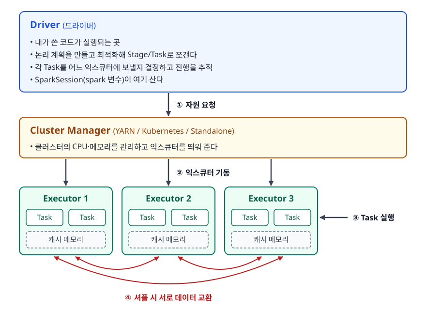
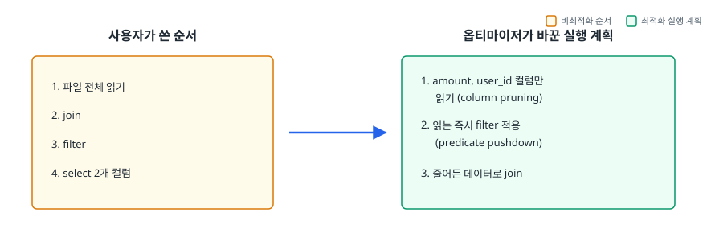
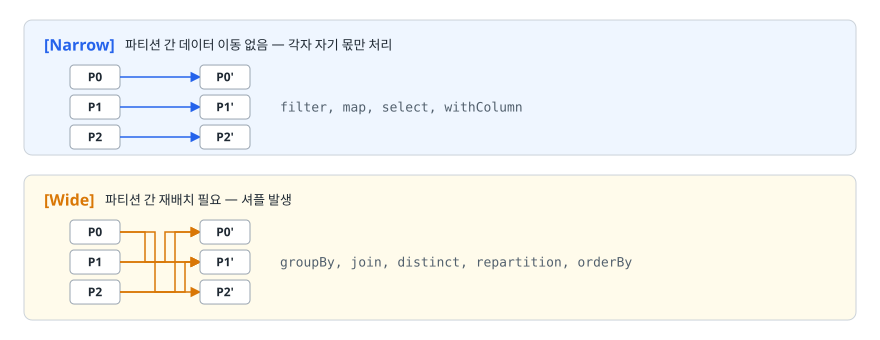
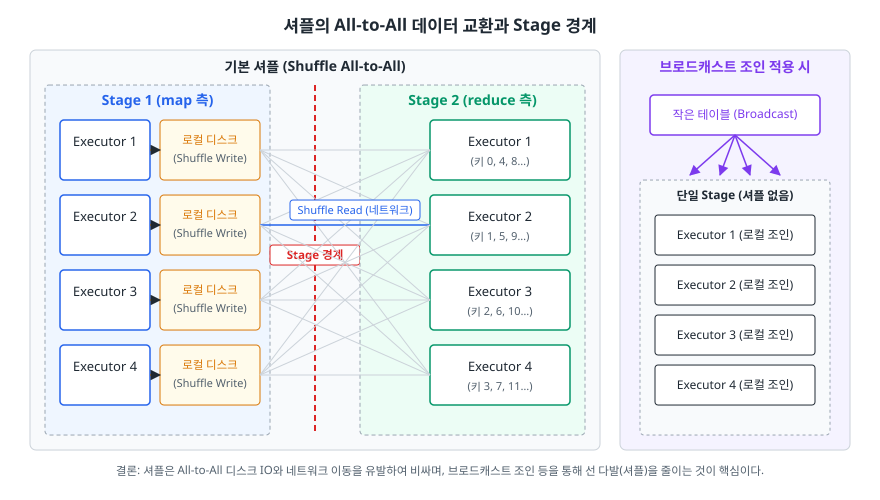

# Spark와 분산 데이터 처리 (Apache Spark)

> 한 대의 메모리를 넘는 데이터를 어떻게 나눠 처리하는지, 드라이버와 익스큐터가 각각 무슨 일을 하는지 설명할 수 있게 됩니다. 왜 RDD 대신 DataFrame을 쓰라고 하는지, 느린 Spark 잡의 원인이 대개 셔플과 스큐인 이유도 마찬가지입니다.

## 학습 목표

- [ ] 단일 머신 처리의 한계와 분산 처리가 떠안는 새 문제를 말할 수 있다
- [ ] 드라이버·익스큐터·클러스터 매니저의 역할을 구분할 수 있다
- [ ] RDD보다 DataFrame이 빠른 이유를 옵티마이저 관점에서 설명할 수 있다
- [ ] Transformation과 Action을 구분하고 지연 실행의 이점을 말할 수 있다
- [ ] 셔플이 비싼 이유와 줄이는 방법을 세 가지 이상 댈 수 있다
- [ ] 데이터 스큐를 증상으로 진단하고 대응할 수 있다

## 선행 지식

- [01-etl-pipeline.md](./01-etl-pipeline.md) — Spark가 파이프라인의 어느 단계에 놓이는지
- SQL의 `GROUP BY`, `JOIN` 개념

---

## 1. 왜 필요한가

### 한 대로 처리하다가 벽에 부딪히는 순간

로그 분석을 pandas로 시작합니다. 하루치 500MB는 노트북에서 잘 돕니다. 서비스가 커져 하루치가 3GB가 되고, 한 달치 90GB를 한 번에 읽으려는 순간 프로세스가 죽습니다.

```python
df = pd.read_csv("s3://logs/2026-03/merged.csv")   # MemoryError
```

첫 번째 대응은 수직 확장입니다. 메모리 512GB짜리 인스턴스를 띄웁니다. 이것도 방법이고 실제로 상당 부분을 커버합니다. 하지만 한계가 명확합니다. 살 수 있는 가장 큰 머신은 정해져 있는데 데이터는 계속 늘어나고, 대형 인스턴스는 같은 자원을 여러 대로 나눠 사는 것보다 단가가 비싸며, 메모리를 늘려도 코어 수가 그만큼 늘지는 않아 CPU가 병목으로 남습니다. 무엇보다 3시간짜리 작업이 2시간 50분에 죽으면 전부 다시 해야 합니다.

### 나누면 새 문제가 생긴다

"여러 대에 나눠서 하자"는 결론은 쉽습니다. 그다음이 어렵습니다.

1. 데이터를 어떻게 나눌 것인가
2. `GROUP BY user_id`처럼 **같은 키가 여러 머신에 흩어져 있는** 연산은 어떻게 하나
3. 머신 한 대가 죽으면 그 몫은 누가 다시 하나
4. 각 머신의 진행 상황은 누가 관리하나

이걸 매번 손으로 짜는 것은 현실적이지 않습니다. Spark는 이 네 가지를 프레임워크가 대신 처리하는 분산 처리 엔진입니다. 개발자에게는 "한 대에서 돌리는 것처럼 보이는 API"를 줍니다.

```python
# 코드는 pandas와 비슷하지만, 실행은 수십 대에 나뉘어 일어난다
df = spark.read.parquet("s3://logs/2026-03/")
df.filter(df.status == 200).groupBy("user_id").count().show()
```

### 비유: 대형 우편물 분류 센터

전국에서 온 우편물 1000만 통을 지역별로 세는 일을 생각해 보자. 혼자 하면 오래 걸리니 100명이 나눠 셉니다. 그런데 각자 손에 든 뭉치에는 모든 지역의 우편물이 섞여 있습니다. 지역별 합계를 내려면 **모두가 서로에게 우편물을 던져 지역별로 재배치하는 과정**이 필요합니다. 이 재배치가 Spark의 셔플(shuffle)이고, 실제로 가장 오래 걸리는 단계입니다.

> **비유의 한계**: 실제 분류 센터에서 우편물을 잃어버리면 끝이지만, Spark는 "이 데이터가 어떤 연산으로 만들어졌는지"를 계보(lineage)로 기억하기 때문에 노드가 죽어도 해당 조각만 다시 계산해 복구합니다.

---

## 2. 드라이버, 익스큐터, 클러스터 매니저

<!-- diagram:de-spark-1 -->


<!-- 위 그림이 대체한 원본 ASCII.
     내용을 고칠 때는 그림도 함께 갱신할 것.
```
┌──────────────────────────────────────────────────────────────┐
│  Driver (드라이버)                                            │
│  - 내가 쓴 코드가 실행되는 곳                                  │
│  - 논리 계획을 만들고 최적화해 Stage/Task로 쪼갠다             │
│  - 각 Task를 어느 익스큐터에 보낼지 결정하고 진행을 추적       │
│  - SparkSession(spark 변수)이 여기 산다                       │
└───────────────┬──────────────────────────────────────────────┘
                │ ① 자원 요청
                ↓
┌──────────────────────────────────────────────────────────────┐
│  Cluster Manager (YARN / Kubernetes / Standalone)             │
│  - 클러스터의 CPU·메모리를 관리하고 익스큐터를 띄워 준다       │
└───────────────┬──────────────────────────────────────────────┘
                │ ② 익스큐터 기동
                ↓
┌─────────────┐ ┌─────────────┐ ┌─────────────┐
│ Executor 1  │ │ Executor 2  │ │ Executor 3  │
│ Task Task   │ │ Task Task   │ │ Task Task   │  ← ③ Task 실행
│[캐시 메모리]│ │[캐시 메모리]│ │[캐시 메모리]│
└─────────────┘ └─────────────┘ └─────────────┘
        └──────── ④ 셔플 시 서로 데이터 교환 ────────┘
```
-->

### 실행 단위의 계층

| 단위 | 무엇인가 | 경계 |
|------|---------|------|
| Job | Action 하나가 만드는 전체 작업 | `count()`, `save()` 호출마다 하나 |
| Stage | 셔플 없이 이어서 처리 가능한 구간 | **셔플이 경계** |
| Task | Stage를 파티션 수만큼 쪼갠 실행 단위 | 파티션 하나당 태스크 하나 |

"파티션 하나 = 태스크 하나"라는 대응이 핵심입니다. 파티션이 200개면 태스크 200개가 만들어지고, 익스큐터의 코어 수만큼 동시에 실행됩니다.

### 안티패턴: 드라이버로 데이터를 다 가져온다

```python
# 안티패턴
rows = df.collect()          # 전체 결과를 드라이버 메모리로 끌어온다
for r in rows:
    process(r)

# 개선 1: 확인용이면 일부만
df.show(20)

# 개선 2: 처리라면 분산 상태로 끝낸다
df.withColumn("processed", F.col("amount") * 0.9).write.parquet("s3://out/")
```

**왜 문제인가**: `collect()`는 분산된 결과를 전부 드라이버 한 대의 메모리에 모읍니다. 데이터가 크면 드라이버가 OOM으로 죽고 그러면 애플리케이션 전체가 함께 죽습니다. 게다가 이후 `for` 루프는 단일 스레드라 분산 처리의 이점이 완전히 사라집니다.

**드라이버에 데이터를 모으는 것은 최종 결과가 확실히 작을 때만** 합니다. 그렇지 않으면 결과도 분산 상태로 스토리지에 씁니다.

---

## 3. RDD에서 DataFrame으로 온 이유

### RDD는 내용을 볼 수 없다

RDD(Resilient Distributed Dataset)는 Spark의 최초 추상화로, 분산된 불변 객체 컬렉션입니다.

```python
# RDD 방식
rdd.map(lambda x: (x[0], int(x[3]))) \
   .filter(lambda kv: kv[1] > 100) \
   .reduceByKey(lambda a, b: a + b)
```

여기서 Spark는 "사용자가 준 함수를 각 요소에 적용하라"까지만 압니다. **람다 안에서 무슨 일이 벌어지는지 엔진은 모릅니다.** 그래서 최적화할 여지가 없습니다. 필터를 먼저 하면 훨씬 빠르다는 것을 엔진이 알아채도 순서를 바꿔 줄 수 없습니다. 필요한 컬럼이 두 개뿐이라는 것도 모르니 파일에서 전부 읽습니다.

### DataFrame은 의도를 선언한다

```python
# DataFrame 방식
df.select("user_id", "amount") \
  .filter(df.amount > 100) \
  .groupBy("user_id").sum("amount")
```

이제 Spark는 **어떤 컬럼이 필요하고 어떤 조건으로 거르는지**를 구조로 압니다. Catalyst 옵티마이저가 여기에 개입해 실행 계획을 다시 씁니다.

<!-- diagram:de-spark-2 -->


<!-- 위 그림이 대체한 원본 ASCII.
     내용을 고칠 때는 그림도 함께 갱신할 것.
```
사용자가 쓴 순서                옵티마이저가 바꾼 실행 계획
┌──────────────────┐            ┌──────────────────────────┐
│ 1. 파일 전체 읽기 │            │ 1. amount, user_id 컬럼만 │
│ 2. join          │   ────>    │    읽기 (column pruning)  │
│ 3. filter        │            │ 2. 읽는 즉시 filter 적용   │
│ 4. select 2개 컬럼│            │    (predicate pushdown)   │
└──────────────────┘            │ 3. 줄어든 데이터로 join    │
                                └──────────────────────────┘
```
-->

- **컬럼 프루닝(column pruning)** — 필요한 컬럼만 읽습니다. Parquet 같은 컬럼 지향 포맷에서 효과가 극적이다
- **조건 푸시다운(predicate pushdown)** — 필터를 데이터 소스 가까이 내려보내 애초에 적게 읽는다
- **연산 순서 재배치** — 조인 전에 필터를 적용해 조인 대상을 줄인다

여기에 Tungsten 실행 엔진이 붙어 JVM 객체 오버헤드를 피하는 바이너리 포맷과 코드 생성으로 CPU 효율을 높입니다. DataFrame이 빠른 이유는 "메모리를 써서"가 아닙니다. "엔진이 무엇을 하려는지 알기 때문"입니다.

### 안티패턴: 파이썬 UDF를 남발한다

```python
# 안티패턴
from pyspark.sql.functions import udf
from pyspark.sql.types import DoubleType

@udf(DoubleType())
def apply_discount(amount):
    return amount * 0.9

df.withColumn("final", apply_discount(df.amount))
```

**왜 문제인가**: 두 가지가 겹칩니다.

1. **직렬화 비용** — PySpark의 파이썬 UDF는 JVM에 있는 데이터를 별도의 파이썬 워커 프로세스로 보내고 결과를 다시 받아 옵니다. 이때 값이 **행 단위로 직렬화·역직렬화되고 함수도 행마다 호출**되므로, 행 수에 비례해 오버헤드가 쌓입니다.
2. **옵티마이저의 블랙박스** — Catalyst는 UDF 안을 볼 수 없어 그 지점 이후의 최적화를 포기합니다. 조건 푸시다운 같은 것이 막힙니다.

```python
# 개선 1: 내장 함수로 표현 가능하면 반드시 내장 함수
from pyspark.sql import functions as F
df.withColumn("final", F.col("amount") * 0.9)

# 개선 2: 복잡한 로직이라 UDF가 불가피하면 Pandas UDF(벡터화)
import pandas as pd
from pyspark.sql.functions import pandas_udf

@pandas_udf(DoubleType())
def apply_discount(amount: pd.Series) -> pd.Series:
    return amount * 0.9      # 행 단위가 아니라 배치 단위로 처리된다
```

Pandas UDF는 Apache Arrow를 통해 데이터를 배치로 주고받으므로 행마다 왕복하는 비용이 크게 줄어듭니다. 그래도 내장 함수로 표현할 수 있으면 내장 함수가 언제나 최선입니다.

---

## 4. 지연 실행과 Transformation / Action

```python
df = spark.read.parquet("s3://logs/")     # 아직 아무것도 안 읽음
a  = df.filter(df.status == 200)          # 계획만 쌓임 (Transformation)
b  = a.groupBy("user_id").count()         # 계획만 쌓임 (Transformation)
b.show()                                  # 이때 전부 실행 (Action)
```

| 구분 | 하는 일 | 예 |
|------|--------|-----|
| Transformation | 새 계획을 만들 뿐 실행하지 않음 | `select`, `filter`, `join`, `groupBy`, `withColumn` |
| Action | 계획을 실제로 실행시키고 결과를 냄 | `show`, `count`, `collect`, `write`, `take` |

지연 실행은 전체 계획을 다 본 뒤에 최적화할 수 있다는 이점이 있습니다. 각 단계를 즉시 실행하면 "이 필터를 먼저 했으면 뒤 조인이 10분의 1이었다"는 사실을 알아도 이미 늦습니다.

### narrow와 wide

Transformation은 데이터 이동 여부에 따라 두 종류로 나뉩니다.

<!-- diagram:de-spark-3 -->


<!-- 위 그림이 대체한 원본 ASCII.
     내용을 고칠 때는 그림도 함께 갱신할 것.
```
[Narrow]  파티션 간 데이터 이동 없음 — 각자 자기 몫만 처리
  P0 ──> P0'
  P1 ──> P1'      filter, map, select, withColumn
  P2 ──> P2'

[Wide]  파티션 간 재배치 필요 — 셔플 발생
  P0 ──┐ ┌──> P0'
  P1 ──┼─┼──> P1'   groupBy, join, distinct, repartition, orderBy
  P2 ──┘ └──> P2'
```
-->

Stage 경계는 정확히 이 wide 변환에서 생깁니다. Spark UI에서 Stage가 여러 개면 그만큼 셔플이 있었습니다.

### 안티패턴: 같은 결과를 여러 번 계산한다

```python
# 안티패턴
filtered = df.filter(df.status == 200)   # 무거운 파싱과 필터가 포함
print(filtered.count())                  # Action 1 → 여기서 전부 계산
filtered.write.parquet("s3://out/")      # Action 2 → 처음부터 또 계산

# 개선: 여러 번 쓸 중간 결과는 캐싱
filtered = df.filter(df.status == 200).cache()
print(filtered.count())                  # 계산하면서 메모리에 보관
filtered.write.parquet("s3://out/")      # 캐시에서 읽음
filtered.unpersist()                     # 다 썼으면 해제
```

**왜 문제인가**: 지연 실행을 뒤집어 말하면 **Action마다 계보를 따라 처음부터 다시 계산합니다**. `filtered`는 계산 방법의 설명서일 뿐, 결과를 들고 있는 변수가 아닙니다.

단, `cache()`는 익스큐터 메모리를 점유하므로 **두 번 이상 쓰는 중간 결과에만** 겁니다. 한 번만 쓰는 데이터에 캐시를 걸면 메모리만 잡아먹고 이득이 없습니다.

---

## 5. 셔플이 비싼 이유와 줄이는 법

<!-- diagram:de-spark -->


### 왜 비싼가

`groupBy("user_id")`를 하려면 같은 `user_id`가 한 곳에 모여야 합니다. 그런데 데이터는 처음에 파일 단위로 나뉘어 있어서 같은 사용자의 행이 모든 파티션에 흩어져 있습니다. 그래서 다음이 일어납니다.

```
    Stage 1 (map 측)  ── 키 해시로 분류 ──>  Stage 2 (reduce 측)
    ┌────────────┐                         ┌────────────┐
    │ Executor 1 │ ──────────────┐  ┌────> │ Executor 1 │  (키 0,2,4…)
    └────────────┘               ├──┤      └────────────┘
    ┌────────────┐               │  │      ┌────────────┐
    │ Executor 2 │ ──────────────┘  └────> │ Executor 2 │  (키 1,3,5…)
    └────────────┘                         └────────────┘
    ① 각자 자기 몫을 키별로 갈라 로컬 디스크에 기록 (shuffle write)
    ② 리듀스 측이 자기 몫의 조각을 네트워크로 끌어옴 (shuffle read)
    ③ 끌어온 조각들을 정렬·병합해 집계
```

메모리 연산이 나노초 단위인 데 비해 디스크와 네트워크는 그보다 몇 자릿수 느립니다. 게다가 셔플은 **모든 익스큐터가 모든 익스큐터와 통신**하는 형태라 노드가 늘수록 연결 수가 급증합니다. Spark 잡이 느리다면 원인은 십중팔구 셔플이거나 다음 절의 스큐입니다.

### 줄이는 방법

**1. 필터와 컬럼 선택을 먼저 한다**

```python
# 개선 전: 다 조인하고 나중에 거른다
df1.join(df2, "user_id").filter(df1.dt == "2026-03-01")

# 개선 후: 거른 뒤 조인한다 — 셔플 대상 자체가 줄어든다
df1.filter(df1.dt == "2026-03-01").join(df2, "user_id")
```

Catalyst가 상당 부분 알아서 밀어 주지만, 명시적으로 쓰는 편이 확실하고 읽기도 좋습니다.

**2. 작은 테이블은 브로드캐스트 조인으로 바꾼다**

한쪽 테이블이 충분히 작으면 셔플 대신 **그 테이블을 모든 익스큐터에 복사**해 로컬 조인을 합니다. 큰 쪽은 움직이지 않으므로 셔플이 아예 사라집니다.

```python
from pyspark.sql.functions import broadcast
orders.join(broadcast(product_dim), "product_id")   # product_dim은 작은 차원 테이블
```

Spark는 통계상 작다고 판단되면 자동으로 브로드캐스트하며, 그 기준은 `spark.sql.autoBroadcastJoinThreshold`로 조정합니다. 통계가 없어 자동 판단이 빗나갈 때 위처럼 명시하면 됩니다. 반대로 **크지 않다고 착각한 테이블을 브로드캐스트하면 드라이버와 익스큐터가 함께 OOM**으로 죽으므로 크기 확인이 전제입니다.

**3. 집계를 먼저, 조인을 나중에**

행 수를 줄이는 연산을 앞으로 당기면 셔플로 오가는 데이터량이 줄어듭니다.

**4. 반복 조인할 키가 정해져 있으면 미리 나눠 저장한다**

같은 키로 매일 조인한다면, 저장 시점에 그 키로 파티셔닝하거나 버킷팅해 두면 조인 때 셔플을 건너뛸 수 있습니다.

**5. 셔플 파티션 수를 데이터 크기에 맞춘다**

셔플 후 파티션 수는 `spark.sql.shuffle.partitions`로 정해지고 기본값은 200입니다. 데이터가 작은데 200개면 태스크마다 처리량이 미미해 스케줄링 오버헤드만 커지고, 데이터가 아주 큰데 200개면 태스크 하나가 감당할 크기를 넘겨 디스크로 흘러넘칩니다. Spark 3.x의 AQE(Adaptive Query Execution)는 실행 중 실제 통계를 보고 파티션 수를 조정해 이 문제를 상당 부분 자동으로 완화합니다.

---

## 6. 파티셔닝과 데이터 스큐

### 증상으로 알아보는 스큐

Spark UI에서 Stage를 보면 이런 모습이 나옵니다.

```
Stage 5 : 200 tasks
  199개 태스크 : 각각 10~20초에 완료
  1개 태스크    : 45분째 실행 중          ← 데이터 스큐
```

전체 Stage는 가장 느린 태스크가 끝나야 완료됩니다. 익스큐터 99%가 놀면서 하나를 기다립니다. 키 분포가 균등하지 않은 탓입니다. `groupBy("user_id")`를 하는데 특정 봇 계정이 전체 로그의 30%를 차지한다거나, `user_id`가 NULL인 행이 수천만 건이라면 그 키를 맡은 파티션만 거대해집니다.

### 대응

**1. 원인 키를 먼저 찾는다**

상위 몇 개 키가 압도적이면 스큐가 맞습니다.

```python
df.groupBy("user_id").count().orderBy("count", ascending=False).show(20)
```

**2. NULL이나 의미 없는 키는 분리한다**

NULL 키끼리는 조인해도 의미가 없는 경우가 많습니다. 미리 걸러 내거나 따로 처리합니다.

**3. 솔팅(salting)으로 큰 키를 쪼갠다**

```python
from pyspark.sql import functions as F

# 큰 쪽: 키에 임의의 접미사를 붙여 여러 파티션으로 분산
salted = big.withColumn("salt", (F.rand() * 10).cast("int")) \
            .withColumn("join_key", F.concat_ws("_", "user_id", "salt"))
# 작은 쪽: 같은 키를 10개 복제해 모든 salt 값과 매칭되게 한다
exploded = small.withColumn("salt", F.explode(F.array([F.lit(i) for i in range(10)]))) \
                .withColumn("join_key", F.concat_ws("_", "user_id", "salt"))
result = salted.join(exploded, "join_key")
```

핫 키 하나가 10개 파티션으로 흩어지므로 부하가 나뉩니다. 작은 쪽을 복제하는 비용이 있어 만능은 아니고, 스큐가 확인된 뒤에 쓰는 처방입니다.

**4. AQE의 스큐 조인 처리에 맡긴다**

Spark 3.x의 AQE는 실행 중 비정상적으로 큰 파티션을 감지해 자동으로 분할합니다. 먼저 AQE가 켜져 있는지 확인하고, 그래도 남는 경우에 솔팅을 고려하는 순서가 합리적입니다.

---

## 7. Spark와 MapReduce

| 구분 | MapReduce | Spark |
|------|-----------|-------|
| 단계 간 데이터 | 매 단계 HDFS에 쓰고 다시 읽음 | 가능하면 메모리에 유지 |
| 반복 연산 | 반복마다 디스크 왕복 | 캐시로 재사용 (ML에 유리) |
| 최적화 | 개발자가 직접 Map/Reduce 설계 | Catalyst가 계획을 재작성 |
| API 수준 | 저수준 (Map, Reduce) | 고수준 (DataFrame, SQL) |
| 처리 유형 | 배치 | 배치 + 스트리밍 + ML + 그래프 |
| 장애 복구 | 태스크 재실행 | 계보 기반 재계산 |

Spark가 빠른 이유를 "메모리를 쓰니까"로만 설명하면 절반입니다. **중간 결과를 매번 디스크에 쓰지 않는다는 점, 그리고 전체 계획을 옵티마이저가 다시 쓴다는 점**이 함께 작용합니다. 셔플할 때는 Spark도 디스크에 씁니다.

> 정리: 오늘 새로 배치 처리를 만든다면 MapReduce를 직접 쓸 일은 거의 없습니다. 다만 "왜 중간 결과 저장이 비싼가"라는 감각은 5장의 셔플 이해로 이어집니다.

---

## 8. 배치를 넘어: Structured Streaming

Spark는 스트리밍도 같은 DataFrame API로 다룹니다.

```python
stream = (spark.readStream.format("kafka")
    .option("kafka.bootstrap.servers", "broker:9092")
    .option("subscribe", "orders").load())

agg = (stream
    .selectExpr("CAST(value AS STRING) AS json")
    .select(F.from_json("json", schema).alias("d")).select("d.*")
    .withWatermark("event_time", "10 minutes")   # 없으면 윈도우 상태가 무한히 쌓인다
    .groupBy(F.window("event_time", "10 minutes"), "product_id").count())

query = (agg.writeStream.outputMode("update").format("console")
    .option("checkpointLocation", "s3://ckpt/orders-agg/").start())
```

스트림을 **끝없이 행이 추가되는 무한 테이블**로 바라봅니다. 배치 쿼리와 같은 문법으로 쓰고, 엔진이 이를 작은 배치들의 연속으로 실행합니다.

`checkpointLocation`은 선택이 아닙니다. 진행 위치와 상태를 저장해 재시작 시 이어서 처리하게 하고, 싱크와 함께 동작해 결과의 정확성을 유지합니다. 체크포인트 없이 프로덕션 스트리밍을 돌리면 재시작이 곧 데이터 사고입니다. 이벤트 시간, 워터마크, 윈도우처럼 스트리밍 고유의 개념은 [05-batch-vs-streaming.md](./05-batch-vs-streaming.md)에서 다룹니다.

---

## 9. 실무에서는

- **Spark를 직접 클러스터로 운영하는 조직은 줄고 있습니다.** Databricks, AWS EMR, Google Dataproc 같은 관리형 환경이 흔합니다. 필요할 때 클러스터를 띄우고 잡이 끝나면 내립니다. Kubernetes 위에서 익스큐터를 파드로 띄우는 방식도 자리를 잡았습니다.
- **파일 포맷 선택이 성능의 절반입니다.** CSV/JSON 대신 Parquet 같은 컬럼 지향 포맷을 쓰면 컬럼 프루닝과 압축이 동작해 읽는 양 자체가 줄어듭니다. 여기에 자주 필터링하는 컬럼(보통 날짜)으로 파티션 디렉터리를 나누면 아예 파일을 건너뜁니다. 반대로 스트리밍이나 잦은 배치가 수만 개의 작은 파일을 만들면 파일 목록 조회와 태스크 생성 오버헤드가 실제 처리보다 커지므로, 주기적으로 병합(compaction)하는 잡을 함께 운영합니다.
- **성능 튜닝은 언제나 Spark UI에서 시작합니다.** 어느 Stage가 오래 걸리는지, 그 Stage의 태스크 시간 분포가 균등한지(스큐), 셔플 읽기/쓰기 양이 얼마인지를 먼저 봅니다. 설정값을 감으로 바꾸기 전에 병목을 확인하는 순서가 중요합니다.
- **Airflow가 Spark 잡을 제출하고 기다리는 조합이 표준입니다.** [02-airflow.md](./02-airflow.md)에서 말한 대로 Airflow 워커에서 직접 처리하지 않고, Spark에 제출한 뒤 완료를 기다리는 태스크로 구성합니다.

---

## 10. 면접 포인트

> 면접에서 이 주제가 나오면 이렇게 답한다

**Q. Spark가 MapReduce보다 빠른 이유는 무엇인가요?**
A. 두 가지입니다. 첫째, MapReduce는 단계마다 중간 결과를 분산 파일 시스템에 쓰고 다시 읽지만 Spark는 가능한 한 메모리에 두고 이어서 처리합니다. 반복 계산이 많은 머신러닝에서 차이가 특히 큽니다. 둘째, DataFrame API를 쓰면 Catalyst 옵티마이저가 사용자가 쓴 순서를 그대로 실행하지 않고 필터를 소스 가까이 내리고 필요한 컬럼만 읽도록 계획을 다시 씁니다. 다만 "메모리를 쓰니까 빠르다"는 설명은 절반만 맞는데, 셔플이 일어날 때는 Spark도 중간 결과를 디스크에 씁니다.
- 꼬리 질문: "그럼 메모리가 부족하면요?" → 디스크로 흘러넘치며(spill) 동작은 계속되지만 속도가 크게 떨어진다고 답합니다.

**Q. Transformation과 Action을 구분하고, 지연 실행의 이점을 설명해주세요.**
A. Transformation은 `filter`나 `groupBy`처럼 새 계획만 만들고 실제로 실행하지 않는 연산이고, Action은 `count`나 `write`처럼 계획을 실행시켜 결과를 내는 연산입니다. 즉시 실행하면 각 단계를 본 그대로 수행할 수밖에 없지만, 미뤄 두면 전체 계획을 다 본 뒤에 순서를 바꾸고 불필요한 읽기를 제거할 수 있습니다. 주의할 점은 Action마다 계보를 따라 처음부터 다시 계산한다는 것이라, 같은 중간 결과를 두 번 이상 쓴다면 `cache()`로 재사용해야 합니다.
- 꼬리 질문: "무조건 cache를 걸면 되나요?" → 익스큐터 메모리를 점유하므로 두 번 이상 쓰는 결과에만 걸고, 다 쓴 뒤 `unpersist()`한다고 답합니다.

**Q. Spark 잡이 느립니다. 어디부터 보시겠어요?**
A. Spark UI에서 어느 Stage가 오래 걸리는지 먼저 봅니다. 그다음 그 Stage의 태스크 실행 시간 분포를 확인하는데, 대부분 빨리 끝났는데 한두 개만 매우 오래 걸린다면 데이터 스큐입니다. 특정 키에 데이터가 몰린 경우라 키 분포를 조회해 원인 키를 찾고, NULL 같은 의미 없는 키면 분리하고 진짜 핫 키면 솔팅으로 쪼갭니다. 전체적으로 고르게 느리다면 셔플이 원인일 가능성이 큰데, 조인 전에 필터를 당기거나 작은 테이블을 브로드캐스트 조인으로 바꿔 셔플 자체를 줄입니다.
- 꼬리 질문: "브로드캐스트 조인의 위험은요?" → 작다고 판단한 테이블이 실제로 크면 모든 익스큐터로 복사되면서 OOM이 나므로 크기 확인이 전제라고 답합니다.

**Q. 셔플이 왜 비싼가요?**
A. 같은 키를 한 노드에 모으기 위해 각 익스큐터가 중간 결과를 로컬 디스크에 쓰고, 다른 익스큐터들이 그 조각을 네트워크로 끌어와 병합하기 때문입니다. 디스크와 네트워크는 메모리보다 몇 자릿수 느리고, 모든 익스큐터가 모든 익스큐터와 통신하는 형태라 노드가 늘수록 부담이 커집니다. `groupBy`, `join`, `distinct`, `orderBy` 같은 wide 변환이 셔플을 일으키고, Spark의 Stage 경계가 정확히 이 지점에 생깁니다.
- 꼬리 질문: "셔플을 아예 없앨 수 있나요?" → 집계와 조인이 필요한 이상 완전히 없앨 수는 없고, 브로드캐스트 조인이나 사전 파티셔닝으로 특정 셔플을 건너뛰거나 셔플 대상 데이터량을 줄이는 것이 목표라고 답합니다.

---

## 자주 하는 실수

| 실수 | 왜 틀렸나 | 올바른 이해 |
|------|----------|-----------|
| "Spark는 모든 데이터를 메모리에 올린다" | 메모리에 안 들어가면 디스크로 흘려 처리하고, 셔플 중간 결과는 원래 디스크에 쓴다 | "가능하면 메모리"이지 "반드시 메모리"가 아니다 |
| "`filter` 다음 줄에서 데이터가 걸러졌다" | Transformation은 계획만 쌓는다 | Action이 호출돼야 실제로 실행된다 |
| "변수에 담아 두면 재계산되지 않는다" | 변수는 결과가 아니라 계산 방법의 설명서다 | Action마다 다시 계산되므로 재사용하려면 `cache()` |
| "`collect()`로 결과를 받아 처리한다" | 드라이버 한 대의 메모리에 전부 모으면 OOM이고 이후는 단일 스레드다 | 결과도 분산 상태로 스토리지에 쓴다 |
| "익스큐터를 늘리면 항상 빨라진다" | 스큐가 있으면 하나의 태스크를 나머지가 기다린다 | 병목을 먼저 진단하고 자원을 늘린다 |
| "UDF는 편하니까 자주 써도 된다" | 파이썬 UDF는 직렬화 왕복이 생기고 옵티마이저가 안을 못 본다 | 내장 함수 우선, 불가피하면 Pandas UDF |
| "RDD가 더 저수준이니 더 빠르다" | 옵티마이저가 개입할 수 없어 오히려 느린 경우가 많다 | 특수한 저수준 제어가 필요할 때만 RDD |

---

## 한 줄 정리

Spark는 데이터를 파티션으로 나눠 익스큐터에 분산 처리시키는 엔진이고 실패한 조각은 계보로 되살립니다. DataFrame이 빠른 것은 옵티마이저가 의도를 알기 때문이며 느린 잡의 원인은 거의 항상 셔플 아니면 스큐입니다.

---

## 연관 개념

- [01-etl-pipeline.md](./01-etl-pipeline.md) - Spark가 담당하는 변환 단계와 레이크하우스 포맷
- [02-airflow.md](./02-airflow.md) - Spark 잡을 제출하고 기다리는 오케스트레이션
- [03-kafka.md](./03-kafka.md) - Structured Streaming이 읽어 오는 소스
- [05-batch-vs-streaming.md](./05-batch-vs-streaming.md) - 이벤트 시간, 윈도우, 워터마크
- [qna-data-engineering.md](./qna-data-engineering.md) - Spark와 지연 실행 면접 질문(Q4)
- [../09-system-design/scalability/02-load-balancing-sharding.md](../09-system-design/scalability/02-load-balancing-sharding.md) - 데이터를 키로 나눌 때 생기는 편중 문제의 일반형
