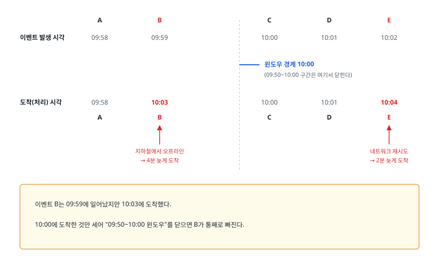
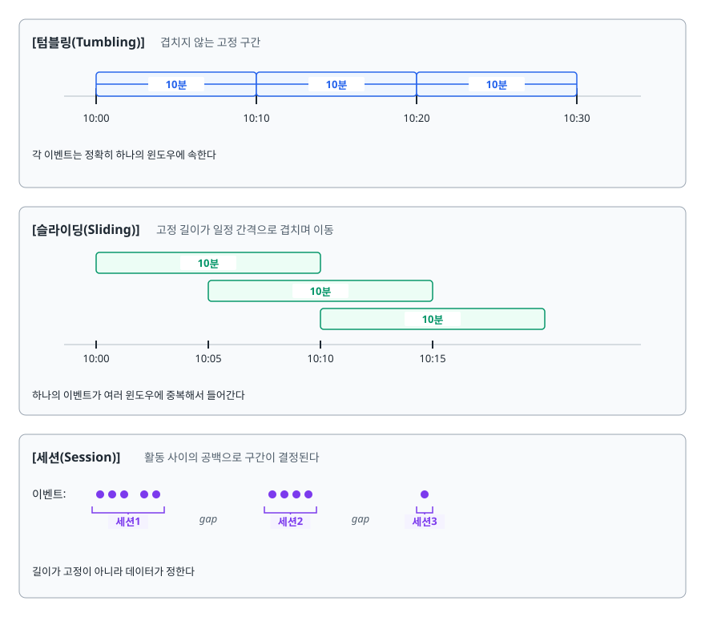
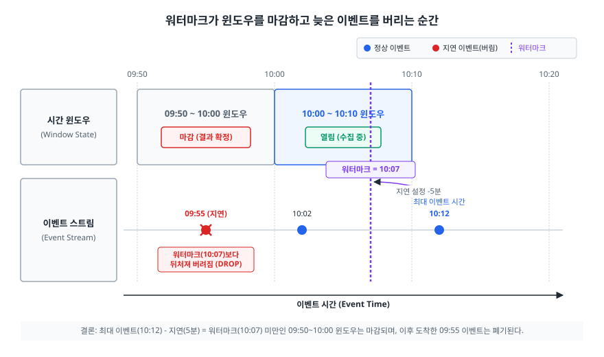
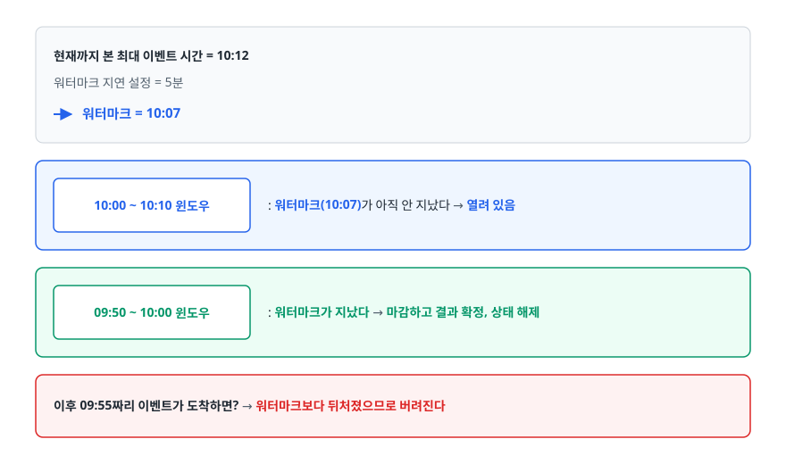
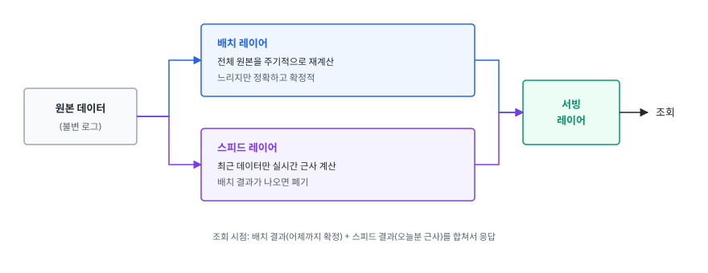
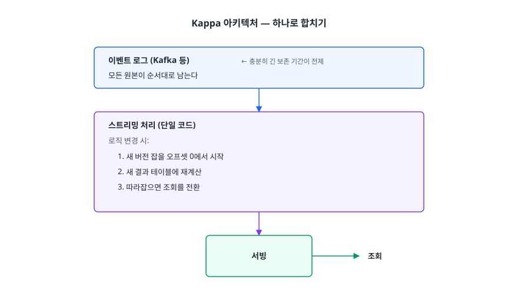
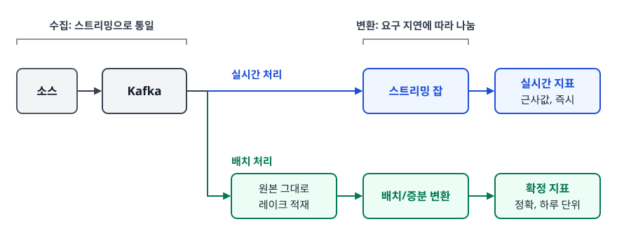

# 배치 처리와 스트리밍 처리 (Batch vs Streaming)

> "실시간으로 해주세요"라는 요구를 어떤 기준으로 해석해야 하는지, 이벤트 시간과 처리 시간이 왜 어긋나는지, 윈도우와 워터마크가 그 어긋남을 어떻게 다루는지, 그리고 Lambda와 Kappa 중 무엇을 기본값으로 둘지 설명할 수 있게 됩니다.

## 학습 목표

- [ ] 배치와 스트리밍의 선택을 네 가지 축으로 판단할 수 있다
- [ ] 이벤트 시간과 처리 시간의 차이가 왜 문제가 되는지 예시로 설명할 수 있다
- [ ] 텀블링·슬라이딩·세션 윈도우를 구분해 쓸 수 있다
- [ ] 워터마크가 무엇을 추정하고 무엇을 맞바꾸는지 말할 수 있다
- [ ] Lambda 아키텍처의 배경과 이중 구현 부담을 설명할 수 있다
- [ ] 새 요구가 들어왔을 때 어느 쪽을 기본값으로 잡을지 근거를 대고 결정할 수 있다

## 선행 지식

- [03-kafka.md](./03-kafka.md) — 스트림의 소스가 어떻게 생겼는지
- [04-spark.md](./04-spark.md) — 8장의 Structured Streaming 부분

---

## 1. "실시간"이라는 말이 가리는 것

기획자가 "실시간 대시보드가 필요합니다"라고 말할 때, 그 말이 실제로 뜻하는 바는 상황마다 전혀 다릅니다.

- 이상 거래를 막아야 한다 → **거래를 승인하기 전에** 판단이 끝나야 한다 (수백 밀리초)
- 배달 기사 위치를 보여준다 → 몇 초 지연은 괜찮다
- 오늘 매출 현황판 → 5~10분이면 충분하다
- 마케팅 팀 주간 리포트 → 어제까지 집계돼 있으면 된다

지연 요구가 밀리초인 경우와 하루인 경우에 같은 아키텍처를 쓸 이유는 없습니다. 그리고 실무에서 훨씬 흔한 실수는 **필요 없는 실시간성을 위해 감당 못 할 복잡도를 떠안는 것**입니다.

### 비유: 월말 정산과 편의점 POS

배치는 회계팀이 월말에 영수증을 모아 한꺼번에 정산하는 방식입니다. 시간은 걸리지만 그달 것이 다 모였으니 결과가 완전합니다. 스트리밍은 POS 단말이 결제될 때마다 즉시 매출을 올리는 방식입니다. 지금 이 순간의 숫자를 볼 수 있지만, 뒤늦게 들어온 취소 전표를 어떻게 반영할지 결정해야 합니다.

> **비유의 한계**: 실제 회계와 달리 데이터 시스템은 배치와 스트리밍을 동시에 돌릴 수 있고, 심지어 같은 소스에서 둘을 함께 돌려 결과를 대조하기도 합니다. 그리고 배치도 "그달 것이 다 모였다"를 보장하지는 않습니다. 지연 도착 문제는 배치에도 있습니다.

---

## 2. 선택 기준 네 가지 축

| 축 | 배치가 유리한 경우 | 스트리밍이 유리한 경우 |
|----|-------------------|---------------------|
| 지연 요구 | 분~일 단위로 충분 | 초 이하가 비즈니스 가치에 직결 |
| 정확성/완결성 | 구간이 닫힌 뒤 계산하므로 결과가 확정적 | 시점마다 결과가 달라지며, 지연 데이터 정책이 필요 |
| 비용 | 필요할 때만 자원을 쓰고 끔 | 클러스터가 24시간 떠 있음 |
| 운영 복잡도 | 실패하면 다시 돌리면 됨 | 상태 관리, 체크포인트, 무중단 배포가 필요 |

### 정확성 축이 가장 자주 간과된다

배치는 "3월 1일 00시~24시"라는 **닫힌 구간**을 처리합니다. 그 구간이 지난 뒤에 계산하므로, 늦게 들어온 데이터까지 포함해 한 번에 확정할 수 있습니다. 다시 돌려도 같은 답이 나옵니다.

스트리밍은 구간이 열려 있는 상태에서 계속 답을 갱신합니다. "지금까지의 3월 1일 매출"은 시간이 지나면서 계속 바뀌고, 언제 "확정"으로 볼지를 **엔지니어가 정책으로 결정해야 한다.** 이것이 4~5장의 윈도우와 워터마크가 존재하는 이유입니다.

### 운영 복잡도 축의 실체

- 배치가 실패하면 → 고치고 그 구간을 다시 돌립니다. [02-airflow.md](./02-airflow.md)의 백필 그대로입니다.
- 스트리밍이 실패하면 → 어디까지 처리했는지(오프셋), 진행 중이던 집계 상태(윈도우별 카운트)를 복구해야 합니다. 체크포인트가 손상되면 복구가 까다롭고, 코드를 바꿔 배포할 때 기존 상태와 호환되는지도 따져야 합니다.

> 판단 기준 한 줄: **"지연을 1분에서 1초로 줄여서 실제로 달라지는 의사결정이 있는가?"** 이 질문에 구체적인 답이 없다면 배치로 시작하는 것이 옳습니다.

---

## 3. 이벤트 시간 vs 처리 시간

### 두 시각은 반드시 어긋난다

- **이벤트 시간(event time)** — 사건이 실제로 일어난 시각. 사용자가 결제 버튼을 누른 순간
- **처리 시간(processing time)** — 우리 시스템이 그 이벤트를 처리한 시각

<!-- diagram:de-batch-vs-streaming-1 -->


<!-- 위 그림이 대체한 원본 ASCII.
     내용을 고칠 때는 그림도 함께 갱신할 것.
```
                    A       B     │   C       D       E
이벤트 발생 시각  09:58   09:59   │ 10:00   10:01   10:02
                                  │
                                  ├─ 윈도우 경계 10:00
                                  │  (09:50~10:00 구간은 여기서 닫힌다)
                                  │
도착(처리) 시각   09:58   10:03   │ 10:00   10:01   10:04
                    A       B     │   C       D       E
                            ▲                         ▲
                   지하철에서 오프라인          네트워크 재시도
                   → 4분 늦게 도착              → 2분 늦게 도착

  이벤트 B는 09:59에 일어났지만 10:03에 도착했다.
  10:00에 도착한 것만 세어 "09:50~10:00 윈도우"를 닫으면 B가 통째로 빠진다.
```
-->

지연이 생기는 이유는 흔합니다. 모바일 앱이 오프라인 상태에서 이벤트를 버퍼링했다가 네트워크가 붙을 때 한꺼번에 보내고, 네트워크가 불안정해 재시도가 일어나고, 브로커 파티션 하나가 밀리고, 배치 수집 잡이 30분 늦게 돕니다.

### 안티패턴: 처리 시간으로 집계한다

```python
# 안티패턴: 지금 도착한 것을 지금 시각의 버킷에 넣는다
df.withColumn("ingest_time", F.current_timestamp()) \
  .groupBy(F.window("ingest_time", "10 minutes")).count()
```

**왜 문제인가**: 세 가지가 무너집니다.

1. **결과가 재현되지 않는다** — 같은 원본을 내일 다시 처리하면 도착 시각이 달라져 전혀 다른 숫자가 나옵니다. [01-etl-pipeline.md](./01-etl-pipeline.md)의 멱등성이 원천적으로 깨집니다.
2. **장애가 데이터를 왜곡한다** — 컨슈머가 30분 멈췄다가 재개하면, 그 30분치가 재개 시점의 버킷에 전부 몰려 가짜 스파이크가 만들어집니다.
3. **비즈니스 질문에 답하지 못한다** — "점심시간 주문량"은 사용자가 주문한 시각의 이야기지 우리 서버가 처리한 시각의 이야기가 아닙니다.

```python
# 개선: 이벤트에 담긴 시각으로 집계한다
df.groupBy(F.window("event_time", "10 minutes")).count()
```

**집계 기준은 거의 항상 이벤트 시간이어야 한다.** 처리 시간 기준이 맞는 경우는 "시스템 처리량 모니터링"처럼 우리 시스템 자체가 관심사일 때뿐입니다.

이벤트 시간을 쓰려면 전제가 하나 붙습니다. **이벤트를 만드는 쪽이 시각을 함께 실어 보내야 하고, 그 시계를 어느 정도 믿을 수 있어야 한다.** 클라이언트 시계는 조작되거나 틀어질 수 있으므로, 서버 수신 시각을 함께 기록해 두고 비정상적으로 벗어난 값은 걸러 내는 방어가 필요합니다.

---

## 4. 윈도우 — 무한한 스트림을 자르기

스트림에는 끝이 없으므로 `COUNT(*)`가 성립하지 않습니다. "언제까지의 카운트인가"를 정해야 하고, 그 구간을 나누는 방식이 윈도우입니다.

<!-- diagram:de-batch-vs-streaming-2 -->


<!-- 위 그림이 대체한 원본 ASCII.
     내용을 고칠 때는 그림도 함께 갱신할 것.
```
[텀블링(Tumbling)] 겹치지 않는 고정 구간
 |----10분----|----10분----|----10분----|
 10:00       10:10        10:20        10:30
 각 이벤트는 정확히 하나의 윈도우에 속한다

[슬라이딩(Sliding)] 고정 길이가 일정 간격으로 겹치며 이동
 |------10분------|
       |------10분------|
             |------10분------|
 10:00  10:05  10:10  10:15
 하나의 이벤트가 여러 윈도우에 중복해서 들어간다

[세션(Session)] 활동 사이의 공백으로 구간이 결정된다
 이벤트: ●●● ●●        ●●●●        ●
         └세션1┘  gap   └세션2┘ gap └세션3┘
 길이가 고정이 아니라 데이터가 정한다
```
-->

| 윈도우 | 언제 쓰나 | 예 |
|--------|----------|-----|
| 텀블링 | 구간별로 딱 한 번씩 집계하고 싶을 때 | 시간당 주문 수, 일별 매출 |
| 슬라이딩 | 추세를 부드럽게 보거나 임계 감지를 촘촘히 하고 싶을 때 | 최근 5분 오류율을 1분마다 갱신 |
| 세션 | 사용자의 자연스러운 활동 단위를 묶고 싶을 때 | 한 번의 방문 동안 본 상품 수 |

> 선택 기준: **집계 결과를 겹치지 않게 저장할 거면 텀블링, 알림처럼 상시 감시가 목적이면 슬라이딩, 사용자 행동 분석이면 세션.** 슬라이딩은 이벤트가 여러 윈도우에 중복 계상되므로 상태 크기와 연산량이 텀블링보다 크다는 점을 감안해야 합니다.

---

## 5. 워터마크 — 언제 마감할 것인가

<!-- diagram:de-batch-vs-streaming -->


### 풀어야 할 질문

10:00~10:10 윈도우의 카운트를 언제 확정해 내보낼 것인가? 10:10이 되는 순간에 마감하면 늦게 도착한 이벤트를 놓칩니다. 영원히 열어 두면 상태가 무한히 쌓여 메모리가 터지고 결과는 영영 나오지 않습니다.

**워터마크(Watermark)는 "이벤트 시간 T 이전의 데이터는 이제 거의 다 도착했다고 보겠다"는 시스템의 추정치입니다.

<!-- diagram:de-batch-vs-streaming-3 -->


<!-- 위 그림이 대체한 원본 ASCII.
     내용을 고칠 때는 그림도 함께 갱신할 것.
```
현재까지 본 최대 이벤트 시간 = 10:12
워터마크 지연 설정 = 5분
→ 워터마크 = 10:07

  10:00 ~ 10:10 윈도우 : 워터마크(10:07)가 아직 안 지났다 → 열려 있음
  09:50 ~ 10:00 윈도우 : 워터마크가 지났다 → 마감하고 결과 확정, 상태 해제

  이후 09:55짜리 이벤트가 도착하면? → 워터마크보다 뒤처졌으므로 버려진다
```
-->

```python
# Structured Streaming 예시
(stream
    .withWatermark("event_time", "10 minutes")     # 10분까지의 지연은 기다린다
    .groupBy(F.window("event_time", "5 minutes"), "product_id")
    .count())
```

### 워터마크는 지연과 정확성을 맞바꾸는 손잡이

| 워터마크 지연 | 결과가 나오는 속도 | 놓치는 데이터 | 상태 크기 |
|--------------|------------------|-------------|----------|
| 짧게 (예: 1분) | 빠름 | 늘어남 | 작음 |
| 길게 (예: 1시간) | 느림 | 줄어듦 | 큼 |

**"정확하면서 동시에 빠른" 설정은 없다.** 실제 지연 분포를 관측해서 정하는 것이 정석입니다. 이벤트 시간과 도착 시간의 차이를 히스토그램으로 그려 보고, 대다수 이벤트가 들어오는 지점을 기준으로 잡되 비용이 감당되는 선에서 여유를 줍니다.

### 늦은 데이터를 어떻게 할 것인가

- **버린다** — 가장 단순합니다. 버려지는 비율을 지표로 관측하는 것이 조건입니다. 소리 없이 사라지면 나중에 숫자가 안 맞는 원인을 찾을 수 없습니다.
- **별도 경로로 보낸다** — 늦은 이벤트만 따로 모아 두고 배치로 나중에 보정합니다.
- **결과를 갱신한다** — 이미 내보낸 결과를 업데이트합니다. 하류 저장소가 업서트를 지원해야 하고, 하류가 이미 그 값을 읽어 파생 계산을 했다면 그것도 다시 계산해야 합니다.

> 실무에서 자주 쓰는 절충: **스트리밍으로 대략적인 실시간 값을 내보내되, 배치로 하루 뒤에 같은 구간을 재계산해 확정 값으로 덮어쓴다.** 실시간성은 스트리밍이, 정확성은 배치가 책임집니다. 이 발상이 다음 장의 Lambda 아키텍처입니다.

---

## 6. Lambda 아키텍처 — 왜 나왔고 왜 부담스러운가

### 배경

초기 스트리밍 엔진은 정확성 보장이 약했습니다. 장애 시 유실이나 중복이 생기기 쉽고, 과거 데이터를 다시 처리하는 수단도 마땅치 않았습니다. 그렇다고 배치만 쓰자니 결과가 하루 늦습니다.

그래서 나온 절충안이 **두 경로를 함께 두는 것**입니다.

<!-- diagram:de-batch-vs-streaming-4 -->


<!-- 위 그림이 대체한 원본 ASCII.
     내용을 고칠 때는 그림도 함께 갱신할 것.
```
                    ┌──────────────────────────────┐
                    │ 배치 레이어                   │
                ┌──>│ 전체 원본을 주기적으로 재계산 │──┐
                │   │ 느리지만 정확하고 확정적      │  │
┌───────────┐   │   └──────────────────────────────┘  │  ┌──────────┐
│ 원본 데이터│───┤                                     ├─>│ 서빙     │──> 조회
│ (불변 로그)│   │   ┌──────────────────────────────┐  │  │ 레이어   │
└───────────┘   │   │ 스피드 레이어                 │  │  └──────────┘
                └──>│ 최근 데이터만 실시간 근사 계산│──┘
                    │ 배치 결과가 나오면 폐기       │
                    └──────────────────────────────┘

  조회 시점: 배치 결과(어제까지 확정) + 스피드 결과(오늘분 근사)를 합쳐서 응답
```
-->

### 이중 구현 부담

Lambda의 문제는 구조가 아니라 **같은 비즈니스 로직을 두 벌 유지해야 한다**는 데 있습니다.

- "활성 사용자"의 정의가 바뀌면 배치 코드와 스트리밍 코드를 둘 다 고쳐야 한다
- 두 구현이 미묘하게 다르면 배치 결과와 스피드 결과가 어긋나고, 사용자는 대시보드 숫자가 어느 순간 갑자기 바뀌는 것을 본다
- 테스트도 두 벌, 배포도 두 벌, 장애 대응도 두 벌이다
- 두 엔진이 서로 다른 프레임워크라면(예: 배치는 Spark, 스트리밍은 Flink) 인력의 학습 부담도 두 배가 된다

실제 운영에서 가장 자주 겪는 상황은 "배치와 스트리밍 숫자가 다른데 어느 쪽이 맞는지 모르겠다"입니다.

---

## 7. Kappa 아키텍처 — 하나로 합치기

<!-- diagram:de-batch-vs-streaming-5 -->


<!-- 위 그림이 대체한 원본 ASCII.
     내용을 고칠 때는 그림도 함께 갱신할 것.
```
┌────────────────────────────────────┐
│ 이벤트 로그 (Kafka 등)             │  ← 충분히 긴 보존 기간이 전제
│ 모든 원본이 순서대로 남는다        │
└─────────────────┬──────────────────┘
                  │
                  ↓
┌────────────────────────────────────┐
│ 스트리밍 처리 (단일 코드)          │
│ 로직 변경 시:                      │
│  1. 새 버전 잡을 오프셋 0에서 시작 │
│  2. 새 결과 테이블에 재계산        │
│  3. 따라잡으면 조회를 전환         │
└─────────────────┬──────────────────┘
                  ↓
             ┌─────────┐
             │ 서빙    │──> 조회
             └─────────┘
```
-->

핵심 발상은 **"재처리는 별도 배치가 아니라 스트림을 처음부터 다시 재생하는 것"** 입니다. 로직을 바꿔야 하면 새 버전의 스트리밍 잡을 오프셋 처음부터 돌려 새 결과 테이블을 만들고, 다 따라잡으면 조회 대상을 바꿉니다. 로직이 한 벌이므로 Lambda의 불일치 문제가 사라집니다.

### Kappa가 성립하려면

1. **로그 보존 기간이 재처리 범위를 덮어야 한다** — 3년치를 재계산해야 하는데 Kafka 보존이 7일이면 불가능합니다. 그래서 원본을 오브젝트 스토리지에도 함께 적재하는 조합이 흔합니다.
2. **재생 처리량이 충분해야 한다** — 1년치를 며칠 안에 다 읽어 낼 수 있어야 실용적입니다.
3. **스트리밍 엔진이 정확성을 보장해야 한다** — 이 조건은 최근 엔진들이 상당 부분 충족합니다. 상태 관리와 체크포인트, 이벤트 시간 처리가 성숙해진 것이 Kappa 논의를 가능하게 만든 배경입니다.

| 기준 | Lambda | Kappa |
|------|--------|-------|
| 코드베이스 | 배치 + 스트리밍 두 벌 | 스트리밍 한 벌 |
| 결과 불일치 | 발생 가능 | 구조적으로 없음 |
| 재처리 | 배치 레이어가 담당 | 스트림을 처음부터 재생 |
| 전제 조건 | 특별한 전제 없음 | 긴 로그 보존, 높은 재생 처리량 |
| 대량 과거 재계산 | 배치가 유리 | 재생 비용이 클 수 있음 |

> 선택 기준: **로직 변경이 잦고 두 코드베이스의 불일치가 실제로 문제가 되고 있으면 Kappa로 수렴할 가치가 있다.** 반대로 재처리 범위가 수년 단위이고 그 재계산이 드물다면, 배치로 대량 재계산하는 경로를 남겨 두는 편이 현실적입니다.

---

## 8. 실무에서는 — 무엇을 기본값으로 둘까

### 배치를 기본값으로

새 요구가 들어왔을 때 배치부터 시작하는 것을 권합니다. 이유는 세 가지입니다.

1. **되돌리기 쉽다** — 배치는 실패하면 다시 돌리면 됩니다. 스트리밍은 상태와 오프셋을 복구해야 합니다.
2. **정확성이 기본으로 온다** — 닫힌 구간을 처리하므로 지연 도착 정책을 따로 세우지 않아도 됩니다.
3. **비용이 사용량에 비례한다** — 스트리밍 클러스터는 트래픽이 없는 새벽에도 떠 있습니다.

그리고 실제로 필요한 지연 요구가 "5분 이내"인 경우가 많은데, 이 정도는 **스트리밍이 아니라 짧은 주기의 마이크로배치로 충분히 만족된다.** 5분마다 도는 증분 배치는 스트리밍의 운영 복잡도 없이 5분 지연을 줍니다.

### 스트리밍으로 가는 조건

다음 중 하나에 해당하면 스트리밍이 정당화됩니다.

- 지연 자체가 비즈니스 가치다 — 이상 거래 차단, 실시간 재고 확인, 광고 입찰
- 사용자에게 즉각적인 반응을 보여야 한다 — 알림, 실시간 위치
- 배치 주기를 줄일수록 오버헤드가 지배적이 된다 — 1분마다 전체 스캔을 반복하느니 증분 스트림이 싸다

### 오늘의 현실적인 모습

실제 조직에서 가장 흔한 구성은 순수한 Lambda도 Kappa도 아닙니다.

<!-- diagram:de-batch-vs-streaming-6 -->


<!-- 위 그림이 대체한 원본 ASCII.
     내용을 고칠 때는 그림도 함께 갱신할 것.
```
소스 ──> Kafka ──┬──> 스트리밍 잡 ──> 실시간 지표 (근사값, 즉시)
                 │
                 └──> 원본 그대로 레이크 적재
                            │
                            └──> 배치/증분 변환 ──> 확정 지표 (정확, 하루 단위)
```
-->

**수집은 스트리밍으로 통일하고, 변환은 요구 지연에 따라 나눈다.** 대부분의 지표는 배치로 만들고, 정말 실시간이 필요한 소수의 지표만 스트리밍 잡으로 따로 뺍니다. 이렇게 하면 유지해야 할 스트리밍 코드가 적어 Lambda의 이중 구현 부담도 감당 가능한 수준으로 줄어듭니다.

또 하나 기억할 점은 **스트리밍 결과와 배치 결과가 어긋날 때 어느 쪽이 정답인지 미리 정해 두는 것**입니다. 보통 배치를 정답으로 두고 스트리밍은 "잠정치"라고 명시합니다. 대시보드에 "실시간(잠정)" 표기를 넣는 사소한 조치가 수많은 문의를 줄입니다.

---

## 9. 면접 포인트

> 면접에서 이 주제가 나오면 이렇게 답한다

**Q. 배치와 스트리밍 중 무엇을 선택할지 어떻게 판단하나요?**
A. 지연 요구, 정확성, 비용, 운영 복잡도 네 축으로 봅니다. 저는 기본값을 배치로 두는데, 배치는 닫힌 구간을 처리하므로 결과가 확정적이고 실패하면 그 구간만 다시 돌리면 되기 때문입니다. 스트리밍은 상태와 체크포인트를 복구해야 하고 클러스터가 24시간 떠 있어야 합니다. 그래서 "지연을 1분에서 1초로 줄여서 실제로 달라지는 의사결정이 있는가"를 먼저 묻고, 답이 명확할 때만 스트리밍으로 갑니다. 5분 정도의 지연이면 짧은 주기의 증분 배치로 충분한 경우가 많습니다.
- 꼬리 질문: "스트리밍이 확실히 필요한 예는요?" → 이상 거래 차단처럼 거래 승인 전에 판단이 끝나야 하는 경우, 즉 지연 자체가 비즈니스 가치인 경우라고 답합니다.

**Q. 이벤트 시간과 처리 시간의 차이가 왜 중요한가요?**
A. 모바일 오프라인 버퍼링, 네트워크 재시도, 파티션 지연 때문에 이벤트가 발생 순서대로 도착하지 않기 때문입니다. 처리 시간으로 집계하면 세 가지가 깨집니다. 같은 원본을 다시 처리해도 결과가 달라져 멱등성이 무너지고, 컨슈머가 30분 멈췄다 재개하면 그 30분치가 재개 시점에 몰려 가짜 스파이크가 생기고, "점심시간 주문량" 같은 질문에 답할 수 없습니다. 그래서 집계 기준은 거의 항상 이벤트에 담긴 시각이어야 하고, 처리 시간 기준이 맞는 경우는 시스템 처리량 모니터링 정도입니다.
- 꼬리 질문: "클라이언트 시계를 믿을 수 있나요?" → 조작되거나 틀어질 수 있으므로 서버 수신 시각도 함께 기록하고 비정상적으로 벗어난 값은 걸러 낸다고 답합니다.

**Q. 워터마크가 무엇인가요?**
A. "이 이벤트 시간 이전의 데이터는 이제 거의 다 도착했다"고 보는 시스템의 추정치입니다. 윈도우를 언제 마감할지 결정하는 기준인데, 마감이 없으면 늦게 올지 모르는 데이터를 기다리느라 상태가 무한히 쌓이고 결과도 나오지 않습니다. 워터마크 지연을 짧게 잡으면 결과가 빨리 나오지만 늦은 데이터를 더 많이 버리게 되고, 길게 잡으면 정확해지지만 결과가 늦고 유지할 상태가 커집니다. 그래서 실제 지연 분포를 관측해서 정하고, 버려지는 데이터 비율을 반드시 지표로 봐야 합니다.
- 꼬리 질문: "늦게 온 데이터를 버리기 싫으면요?" → 별도 경로로 모아 배치로 보정하거나 결과를 업서트로 갱신하는 방법이 있는데, 후자는 하류 파생 계산까지 다시 해야 한다고 답합니다.

**Q. Lambda 아키텍처의 단점과 Kappa가 그것을 어떻게 해결하나요?**
A. Lambda는 정확한 배치 레이어와 빠른 스피드 레이어를 함께 두는 구조인데, 같은 비즈니스 로직을 두 벌 유지해야 한다는 부담이 있습니다. 지표 정의가 바뀌면 양쪽을 다 고쳐야 하고, 두 구현이 미묘하게 다르면 배치 결과와 실시간 결과가 어긋나 어느 쪽이 맞는지 모르는 상황이 생깁니다. Kappa는 재처리를 별도 배치가 아니라 이벤트 로그를 처음부터 재생하는 것으로 정의해 스트리밍 코드 한 벌만 유지합니다. 다만 로그 보존 기간이 재처리 범위를 덮어야 하고 재생 처리량이 충분해야 한다는 전제가 붙습니다.
- 꼬리 질문: "실무에서는 어느 쪽인가요?" → 수집은 스트림으로 통일하고 대부분의 지표는 배치로, 정말 필요한 소수만 스트리밍으로 두는 절충 구성이 가장 흔하다고 답합니다.

---

## 자주 하는 실수

| 실수 | 왜 틀렸나 | 올바른 이해 |
|------|----------|-----------|
| "실시간이 무조건 더 좋다" | 운영 복잡도와 상시 비용을 지불하고 사는 것이다 | 지연 단축으로 달라지는 의사결정이 있을 때만 값어치가 있다 |
| "스트리밍이면 배치보다 정확하다" | 스트리밍은 열린 구간을 다루므로 지연 데이터 정책이 필요하다 | 확정성은 배치가 유리하고, 스트리밍은 잠정치를 빨리 주는 쪽이다 |
| "도착한 시각으로 집계하면 된다" | 재현 불가, 장애 시 가짜 스파이크, 질문과 불일치 | 집계 기준은 이벤트 시간 |
| "워터마크를 길게 잡으면 안전하다" | 결과가 늦어지고 유지할 상태가 커진다 | 지연과 정확성의 손잡이이며 관측된 분포로 정한다 |
| "늦은 데이터는 자동으로 처리된다" | 워터마크를 지난 데이터는 기본적으로 버려진다 | 버려지는 비율을 지표로 보고 정책을 명시적으로 정한다 |
| "Kappa가 Lambda의 상위 호환이다" | 긴 보존 기간과 재생 처리량이라는 전제가 필요하다 | 수년치 재계산이 필요한 조직은 배치 경로를 남겨 둔다 |
| "마이크로배치는 스트리밍이 아니다" | 명칭 논쟁일 뿐 실무적으로는 지연 요구를 만족하느냐가 기준이다 | 5분 지연이면 증분 배치로 충분한 경우가 많다 |

---

## 한 줄 정리

배치와 스트리밍의 진짜 차이는 속도가 아니라 "구간을 닫고 계산하느냐, 열어 둔 채 계속 갱신하느냐"이며, 열어 두기로 한 순간 이벤트 시간·윈도우·워터마크로 "언제 마감할 것인가"를 직접 결정해야 하므로, 그 복잡도를 지불할 이유가 분명할 때만 스트리밍으로 갑니다.

---

## 연관 개념

- [01-etl-pipeline.md](./01-etl-pipeline.md) - 두 방식 모두에 적용되는 멱등성과 재처리 원칙
- [02-airflow.md](./02-airflow.md) - 배치 경로의 스케줄링과 백필
- [03-kafka.md](./03-kafka.md) - 스트림의 소스이자 Kappa 아키텍처의 재생 기반
- [04-spark.md](./04-spark.md) - 같은 API로 배치와 스트리밍을 다루는 Structured Streaming
- [qna-data-engineering.md](./qna-data-engineering.md) - 배치/스트리밍과 Lambda/Kappa 면접 질문(Q5)
- [../09-system-design/caching/01-caching-strategies.md](../09-system-design/caching/01-caching-strategies.md) - 신선도와 비용을 맞바꾸는 같은 종류의 판단
