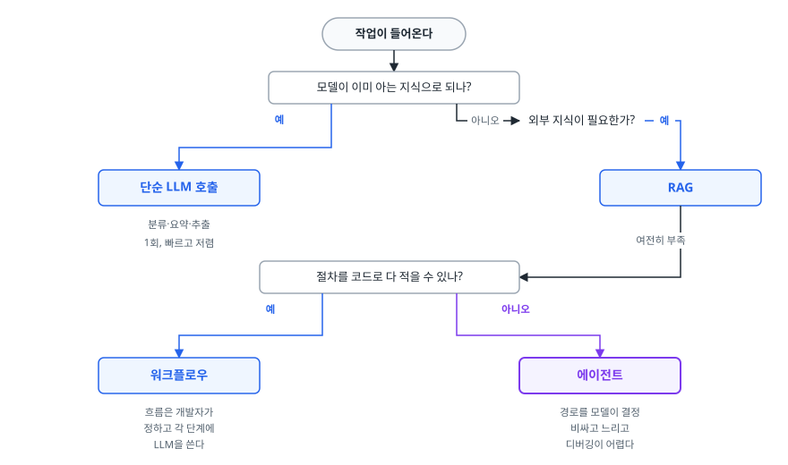
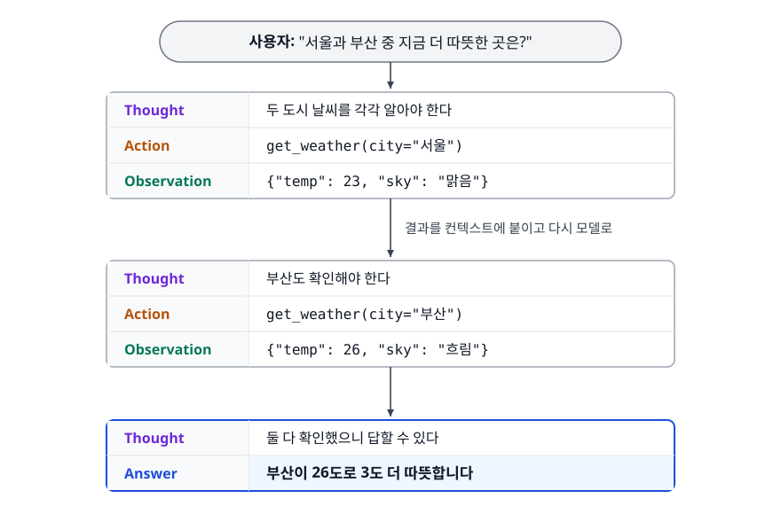
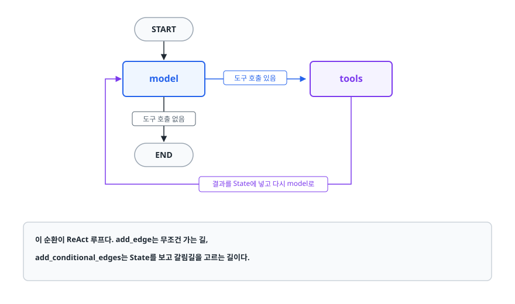
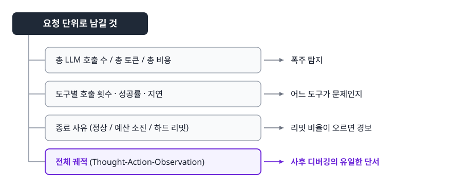

# AI 에이전트와 LangGraph (AI Agent & LangGraph)

> 질문 하나를 풀려면 도구를 여러 번 부르고, 앞선 결과를 보고 다음 행동을 정해야 할 때가 있습니다. 단발 LLM 호출로는 안 되는 이런 작업을 루프로 푸는 에이전트가 어떻게 동작하는지, 그 루프가 폭주하지 않게 막는 장치가 무엇인지를 설명합니다.

## 학습 목표

- [ ] 단순 호출 / RAG / 워크플로우 / 에이전트를 판단 기준으로 구분해 선택할 수 있다
- [ ] ReAct 루프의 세 단계와 도구 호출이 실제로 어떻게 이루어지는지 설명할 수 있다
- [ ] LangGraph의 State, Node, Edge와 리듀서의 역할을 구분할 수 있다
- [ ] 무한 루프를 막는 장치를 여러 겹으로 설계할 수 있다
- [ ] 에이전트가 실패하는 전형적인 지점을 알고 무엇을 관측해야 하는지 안다

## 선행 지식

- [../llm-integration/01-llm-basics-prompting.md](../llm-integration/01-llm-basics-prompting.md) — 다음 토큰 예측, 컨텍스트 윈도우, 구조화 출력
- [../rag-pipeline/01-rag-pipeline.md](../rag-pipeline/01-rag-pipeline.md) — 에이전트가 쓰는 대표적인 도구가 검색입니다

---

## 1. 왜 필요한가

"이번 달 매출이 지난달보다 떨어진 이유를 정리해줘"라는 요청을 생각해봅시다. 이 한 문장을 처리하려면 이런 일들이 필요합니다.

```
1. 이번 달과 지난달 매출을 DB에서 조회한다
2. 차이가 실제로 있는지 확인한다 (없으면 여기서 끝)
3. 있다면 카테고리별로 쪼개 어디서 빠졌는지 본다
4. 그 카테고리의 이벤트·재고·환불 데이터를 추가로 본다
5. 확인한 것들을 종합해 정리한다
```

**3번 이후는 2번의 결과에 따라 달라집니다.** 전체 매출은 그대로인데 특정 카테고리만 빠졌다면 볼 곳이 다르고, 전 카테고리가 고르게 빠졌다면 또 다릅니다. 미리 순서를 다 적어둘 수가 없습니다.

여기서 두 가지가 필요해집니다. **모델이 외부 데이터를 가져올 수 있어야 하고(도구), 가져온 결과를 보고 다음 행동을 스스로 정할 수 있어야 합니다(루프).** 이 둘을 갖춘 것이 에이전트입니다.

---

## 2. 언제 에이전트를 쓰나

에이전트는 강력한 만큼 비싸고 느리고 예측하기 어렵습니다. **가장 단순한 방식부터 올라가는 것**이 원칙입니다.

<!-- diagram:ai-agent-langgraph-1 -->


<!-- 위 그림이 대체한 원본 ASCII.
     내용을 고칠 때는 그림도 함께 갱신할 것.
```
                작업이 들어온다
                      │
        모델이 이미 아는 지식으로 되나?
              │ 예              │ 아니오
              ↓                 ↓
      ┌───────────────┐   외부 지식이 필요한가?
      │ 단순 LLM 호출  │         │ 예
      └───────────────┘         ↓
        분류·요약·추출     ┌───────────────┐
        1회, 빠르고 저렴    │      RAG      │
                          └───────┬───────┘
                                  │ 여전히 부족
                                  ↓
                    절차를 코드로 다 적을 수 있나?
                      │ 예              │ 아니오
                      ↓                 ↓
              ┌───────────────┐  ┌───────────────┐
              │   워크플로우   │  │   에이전트     │
              └───────────────┘  └───────────────┘
               흐름은 개발자가     경로를 모델이 결정
               정하고 각 단계에    비싸고 느리고
               LLM을 쓴다         디버깅이 어렵다
```
-->

| 방식 | 경로를 정하는 주체 | 호출 횟수 | 적합한 작업 |
|------|-----------------|----------|-----------|
| 단순 호출 | 없음 | 1회 | 분류, 요약, 번역, 추출 |
| RAG | 없음 (고정 파이프라인) | 1~2회 | 문서 기반 질의응답 |
| 워크플로우 | **개발자** (코드) | 정해진 만큼 | 단계와 분기가 미리 알려진 다단계 작업 |
| 에이전트 | **모델** (런타임) | 예측 불가 | 조사, 디버깅처럼 경로를 미리 알 수 없는 작업 |

> 표 요약: **워크플로우와 에이전트의 경계는 "경로를 누가 정하는가"입니다.** 순서를 개발자가 코드로 적을 수 있다면 워크플로우가 낫습니다. 훨씬 싸고 빠른 데다 디버깅까지 됩니다. 에이전트는 그게 불가능할 때만 씁니다.

도입 전에 확인할 네 가지를 덧붙입니다.

1. **복잡성** — 정말 절차를 미리 정의할 수 없는가
2. **가치** — 비용과 지연이 몇 배로 늘어도 남는 이득이 있는가
3. **실현성** — 모델이 이 도구들로 실제 이 작업을 해낼 수 있는가
4. **오류 비용** — 틀렸을 때 검출하고 되돌릴 수 있는가

특히 4번이 관문입니다. 되돌릴 수 없는 행동(결제, 삭제, 메일 발송)을 자율적으로 맡기려면 승인 게이트가 반드시 함께 와야 합니다.

---

## 3. ReAct 루프와 도구

### 세 단계

에이전트의 기본 패턴은 ReAct(Reasoning + Acting)입니다. **생각하고, 행동하고, 결과를 봅니다.** 이 셋을 목표 달성까지 반복합니다.

<!-- diagram:ai-agent-langgraph-2 -->


<!-- 위 그림이 대체한 원본 ASCII.
     내용을 고칠 때는 그림도 함께 갱신할 것.
```
사용자: "서울과 부산 중 지금 더 따뜻한 곳은?"

  ┌─────────────────────────────────────────┐
  │ Thought  두 도시 날씨를 각각 알아야 한다   │
  │ Action   get_weather(city="서울")        │
  │ Observation  {"temp": 23, "sky": "맑음"} │
  └──────────────────┬──────────────────────┘
                     ↓ 결과를 컨텍스트에 붙이고 다시 모델로
  ┌─────────────────────────────────────────┐
  │ Thought  부산도 확인해야 한다             │
  │ Action   get_weather(city="부산")        │
  │ Observation  {"temp": 26, "sky": "흐림"} │
  └──────────────────┬──────────────────────┘
                     ↓
  ┌─────────────────────────────────────────┐
  │ Thought  둘 다 확인했으니 답할 수 있다     │
  │ Answer   부산이 26도로 3도 더 따뜻합니다   │
  └─────────────────────────────────────────┘
```
-->

흔히 여기서 오해가 생깁니다. **모델이 도구를 실행하는 게 아닙니다.** 모델은 "이 도구를 이런 인자로 부르고 싶다"는 구조화된 출력을 낼 뿐이고, 실제 실행은 우리 코드가 합니다. 그리고 그 결과를 다시 컨텍스트에 넣어 모델을 또 호출합니다. 이 실행과 주입을 담당하는 코드 골격을 **하네스(harness)라고** 부릅니다.

### 도구 설명이 곧 프롬프트다

도구는 이름, 설명, 파라미터 스키마로 정의합니다. 이 설명 전체가 매 호출마다 모델 컨텍스트에 들어가므로, **도구 설명은 그대로 프롬프트입니다.**

```python
# 안티패턴
{
    "name": "search",
    "description": "검색한다",
    "parameters": {"type": "object", "properties": {"q": {"type": "string"}}},
}
```

**왜 문제인가**: 무엇을 검색하는 도구인지(사내 문서? 웹? 상품?), 언제 써야 하는지, `q`에 무엇을 넣어야 하는지가 하나도 없습니다. 모델은 추측할 수밖에 없고, 그래서 엉뚱한 타이밍에 부르거나 잘못된 인자를 넣습니다. **에이전트가 도구를 잘못 쓰는 원인의 대부분은 모델이 아니라 도구 설명에 있습니다.**

```python
# 개선
{
    "name": "search_internal_docs",
    "description": (
        "사내 위키와 정책 문서를 검색한다. 회사 규정, 내부 절차, 팀 담당자처럼 "
        "공개 정보로는 알 수 없는 내용을 물었을 때 사용한다. "
        "일반 상식이나 공개된 기술 문서에는 사용하지 않는다."
    ),
    "parameters": {
        "type": "object",
        "properties": {
            "query": {
                "type": "string",
                "description": "검색할 자연어 질문. 지시대명사 없이 그 자체로 이해되게 쓴다.",
            },
            "top_k": {"type": "integer", "description": "결과 개수, 기본 5", "default": 5},
        },
        "required": ["query"],
    },
}
```

도구 설계에서 함께 지킬 것 세 가지.

- **도구 개수를 줄입니다.** 비슷한 도구가 여러 개면 모델이 헷갈립니다. 20개짜리 도구 목록보다 잘 정리된 6개가 낫습니다
- **결과를 짧게 돌려줍니다.** 도구 결과는 그대로 컨텍스트에 쌓입니다. DB 조회 결과 500행을 그대로 넣으면 컨텍스트가 몇 턴 만에 터집니다. 요약하거나 상한을 둡니다
- **에러도 모델이 읽을 수 있게 돌려줍니다.** 예외를 던져 루프를 끊는 대신 `{"error": "날짜 형식이 잘못됨. YYYY-MM-DD로 다시 시도"}`를 반환하면 모델이 스스로 고쳐 재시도합니다

---

## 4. LangGraph: 루프를 그래프로 표현하기

### 왜 그래프인가

에이전트 루프를 `while`문으로 직접 짜면 처음엔 간단합니다. 그런데 분기가 생기고, 중간에 사람 승인이 들어가고, 실패 시 재시도가 붙으면 금세 읽을 수 없는 코드가 됩니다. 무엇보다 **중간에 멈췄다가 나중에 재개하는 것**이 거의 불가능해집니다.

LangGraph는 이 흐름을 **상태(State)를 들고 노드 사이를 이동하는 그래프**로 표현합니다. 일반적인 체인이 DAG(순환 없는 그래프)라면, LangGraph는 **순환을 허용합니다.** 에이전트 루프가 곧 순환이기 때문입니다.

### 세 가지 구성 요소

| 개념 | 무엇인가 | 비유 |
|------|---------|------|
| State | 그래프 전체가 공유하는 데이터. 노드가 읽고 갱신한다 | 여러 사람이 돌려 쓰는 작업 파일 |
| Node | 실제 일을 하는 함수. State를 받아 갱신할 부분을 반환한다 | 파일을 받아 자기 몫을 채우는 담당자 |
| Edge | 다음에 어느 노드로 갈지 | 다음 담당자에게 넘기는 규칙 |

> **비유의 한계**: 실제 담당자는 파일 전체를 마음대로 고칠 수 있습니다. 노드는 다릅니다. **갱신할 키만 담은 부분 딕셔너리**를 반환할 뿐이고, 병합은 리듀서가 정한 규칙대로 진행됩니다.

### 리듀서가 핵심이다

State를 그냥 TypedDict로 정의하면 노드가 반환한 값이 **기존 값을 덮어씁니다.** 메시지 이력처럼 쌓여야 하는 데이터에는 이게 치명적입니다.

```python
from typing import Annotated, TypedDict
from langgraph.graph import StateGraph, START, END
from langgraph.graph.message import add_messages

class State(TypedDict):
    messages: Annotated[list, add_messages]   # 누적된다 (리듀서 지정)
    step_count: int                           # 덮어쓴다 (리듀서 없음)
```

`Annotated[list, add_messages]`의 두 번째 인자가 리듀서입니다. 노드가 `{"messages": [새 메시지]}`를 반환하면 기존 리스트에 **덧붙습니다.** 이걸 빼먹으면 매 노드마다 대화 이력이 통째로 날아갑니다. 에이전트는 방금 한 일을 기억하지 못하고, 같은 도구를 무한히 반복하는 증상이 나옵니다.

### 그래프 구성

```python
from langgraph.prebuilt import ToolNode

def call_model(state: State):
    response = llm_with_tools.invoke(state["messages"])
    return {"messages": [response], "step_count": state["step_count"] + 1}

def should_continue(state: State) -> str:
    last = state["messages"][-1]
    # 모델이 도구 호출을 요청했으면 도구 노드로, 아니면 종료
    if getattr(last, "tool_calls", None):
        return "tools"
    return END

builder = StateGraph(State)
builder.add_node("model", call_model)
builder.add_node("tools", ToolNode(tools))     # 도구 실행을 대신해주는 내장 노드

builder.add_edge(START, "model")
builder.add_conditional_edges("model", should_continue, {"tools": "tools", END: END})
builder.add_edge("tools", "model")             # 도구 실행 후 다시 모델로 = 순환

app = builder.compile()
```

<!-- diagram:ai-agent-langgraph-3 -->


<!-- 위 그림이 대체한 원본 ASCII.
     내용을 고칠 때는 그림도 함께 갱신할 것.
```
     START
       │
       ▼
   ┌───────┐   도구 호출 있음   ┌───────┐
   │ model │ ─────────────────▶ │ tools │
   └───┬───┘                    └───┬───┘
       │  도구 호출 없음             │
       ▼                            │
      END                           │
       ▲                            │
       └────────────────────────────┘
              결과를 State에 넣고 다시 model로

  이 순환이 ReAct 루프다. add_edge는 무조건 가는 길,
  add_conditional_edges는 State를 보고 갈림길을 고르는 길이다.
```
-->

---

## 5. 무한 루프를 막는 네 겹

순환을 허용한 순간 폭주 가능성이 생깁니다. 실제로 이런 식으로 터집니다.

- 도구가 계속 에러를 반환하는데 모델이 같은 인자로 재시도만 반복합니다
- 검색 결과가 만족스럽지 않다며 조금씩 다른 쿼리로 영원히 검색합니다
- 라우팅 함수의 조건이 잘못돼 `END`로 가는 경로가 실제로는 닿지 않습니다

**이게 조용히 돕니다.** 에러도 안 나고, 로그도 정상으로 보이는데 청구서만 올라갑니다. 그래서 여러 겹으로 막습니다.

### 1겹: recursion_limit (하드 리밋)

```python
from langgraph.errors import GraphRecursionError

try:
    result = app.invoke(inputs, {"recursion_limit": 15})
except GraphRecursionError:
    result = {"messages": ["요청을 완료하지 못했습니다. 질문을 좁혀 다시 시도해주세요."]}
```

노드 전이 횟수의 절대 상한입니다. **최후의 안전망이지 정상 종료 수단이 아닙니다.** 여기에 걸렸다면 설계에 문제가 있다는 신호이므로 알림을 걸어두는 편이 좋습니다. ReAct 루프는 한 사이클에 노드를 2개 지나므로, 도구 호출 7회를 허용하려면 대략 그 두 배 이상을 잡아야 합니다.

### 2겹: 상태 기반 예산

```python
MAX_TOOL_CALLS = 7

def should_continue(state: State) -> str:
    if state["step_count"] >= MAX_TOOL_CALLS:
        return "finalize"        # 예외가 아니라 정상 경로로 마무리시킨다
    last = state["messages"][-1]
    return "tools" if getattr(last, "tool_calls", None) else END
```

`recursion_limit`이 예외를 던지는 것과 달리, 여기서는 **정상 경로로 빠집니다.** `finalize` 노드에서 "지금까지 알아낸 것만으로 답하라"고 시키면, 사용자는 최소한 부분적인 답이라도 받습니다. 이때 `finalize`를 노드로 등록하고 `add_conditional_edges`의 경로 맵에도 `{"tools": "tools", "finalize": "finalize", END: END}`처럼 함께 넣어야 합니다. 라우팅 함수가 경로 맵에 없는 이름을 반환하면 그 자리에서 에러가 납니다.

### 3겹: 같은 실패 반복 감지

```python
def call_tools(state: State):
    call = state["messages"][-1].tool_calls[0]
    signature = (call["name"], json.dumps(call["args"], sort_keys=True))

    if signature in state["seen_calls"]:
        # 완전히 같은 호출을 또 하려 한다 = 진전이 없다
        return {"messages": [ToolMessage(
            content="이미 같은 인자로 호출해 실패했다. 다른 접근을 시도하거나 "
                    "지금까지 정보로 답하라.",
            tool_call_id=call["id"],
        )]}
    ...
```

무한 루프의 상당수가 **똑같은 도구를 똑같은 인자로 반복**하는 형태입니다. 호출 서명을 기록해두고 중복이면 결과 대신 안내를 돌려주면, 모델이 경로를 바꿉니다.

### 4겹: 프롬프트에 종료 조건 명시

```
아래 조건 중 하나를 만족하면 도구를 더 부르지 말고 최종 답변을 작성한다.
- 질문에 답할 정보를 모두 확보했다
- 같은 도구를 두 번 호출했는데 새 정보가 나오지 않았다
- 도구로 얻을 수 없는 정보라고 판단된다 (이 경우 "확인할 수 없음"이라고 답한다)
```

가장 싸고 가장 자주 빠지는 층입니다. **모델에게 "언제 멈춰야 하는지"를 아무도 안 알려준 채 멈추지 않는다고 탓하는 경우가 많습니다.**

---

## 6. Human-in-the-Loop

되돌리기 어려운 행동 앞에는 사람이 서야 합니다. LangGraph는 **체크포인터**로 상태를 저장해두고 실행 중간에 멈췄다가 재개할 수 있습니다.

```python
from langgraph.checkpoint.memory import MemorySaver
from langgraph.types import interrupt, Command

def approve_action(state: State):
    # 여기서 실행이 멈추고 제어권이 호출자에게 돌아간다
    decision = interrupt({"action": state["pending_action"]})
    return {"approved": decision == "approve"}

app = builder.compile(checkpointer=MemorySaver())

config = {"configurable": {"thread_id": "conv-42"}}
app.invoke(inputs, config)                       # interrupt 지점에서 정지
# ... 사람이 화면에서 검토 ...
app.invoke(Command(resume="approve"), config)    # 같은 thread_id로 재개
```

- `thread_id`가 어떤 실행을 재개할지 식별하는 키입니다. 이게 없으면 재개할 대상을 찾을 수 없습니다
- `MemorySaver`는 프로세스 메모리에 저장하므로 **재시작하면 사라집니다.** 실제 서비스에서는 DB 기반 체크포인터를 씁니다
- 승인 게이트를 너무 많이 두면 사람이 습관적으로 전부 승인하게 됩니다. **정말 되돌릴 수 없는 지점에만** 둡니다

---

## 7. 에이전트가 실패하는 지점

| 실패 | 증상 | 대응 |
|------|------|------|
| 컨텍스트 폭발 | 몇 턴 만에 토큰 한도 초과, 비용 급증 | 도구 결과를 요약·절단, 오래된 메시지 압축 |
| 도구 오용 | 엉뚱한 타이밍에 부르거나 인자가 틀림 | 도구 설명 개선, 개수 축소, 스키마에 제약 명시 |
| 무한 반복 | 같은 호출을 계속, 조용히 비용만 증가 | 5장의 네 겹 |
| 에러 전파 | 도구 예외로 루프 자체가 죽음 | 예외 대신 에러 메시지를 결과로 반환해 모델이 복구하게 |
| 상태 오염 | 리듀서를 안 걸어 이력이 날아감 | State 정의 시 누적/덮어쓰기를 명시적으로 결정 |
| 비결정성 | 같은 입력에 매번 다른 경로 | 경로가 아니라 최종 결과 기준으로 평가, temperature 낮추기 |

### 무엇을 관측해야 하나

단발 호출과는 사정이 다릅니다. **한 요청이 여러 번의 LLM 호출과 도구 실행으로 이루어지므로, 요청 단위로 묶어서 봐야 합니다.**

<!-- diagram:ai-agent-langgraph-4 -->


<!-- 위 그림이 대체한 원본 ASCII.
     내용을 고칠 때는 그림도 함께 갱신할 것.
```
요청 단위로 남길 것
├─ 총 LLM 호출 수 / 총 토큰 / 총 비용      ← 폭주 탐지
├─ 도구별 호출 횟수 · 성공률 · 지연         ← 어느 도구가 문제인지
├─ 종료 사유 (정상 / 예산 소진 / 하드 리밋) ← 리밋 비율이 오르면 경보
└─ 전체 궤적 (Thought-Action-Observation)  ← 사후 디버깅의 유일한 단서
```
-->

궤적 로그가 특히 중요합니다. 에이전트가 이상한 답을 냈을 때, **어느 단계에서 어긋났는지는 궤적을 보지 않으면 알 수 없습니다.**

평가도 두 층으로 나눕니다.

- **결과 평가**: 최종 답변이 맞았는가. 사용자가 체감하는 품질입니다
- **궤적 평가**: 필요한 도구를 불렀는가, 불필요한 호출이 없었는가, 몇 번 만에 끝냈는가

결과만 보면 "운 좋게 맞은 경우"와 "제대로 푼 경우"가 구별되지 않습니다. 반대로 궤적만 보면 사람이 예상하지 못한 더 나은 경로를 벌점 처리하게 됩니다. **둘을 같이 봐야 합니다.**

---

## 8. 실무에서는

- **에이전트로 시작하지 않습니다.** 워크플로우로 만들어 돌려보고, 코드로 못 적는 분기가 계속 나올 때 그 부분만 에이전트로 바꿉니다. 전체를 자율에 맡기는 것보다 "대부분은 고정 흐름, 특정 구간만 자율"이 훨씬 안정적입니다.
- **도구 권한을 최소화합니다.** 에이전트가 SQL을 실행할 수 있다면 읽기 전용 계정을 줍니다. 프롬프트 방어는 뚫릴 수 있고, 권한은 뚫리지 않습니다.
- **비용 상한을 요청 단위로 겁니다.** 사용자당 일일 요청 수, 요청당 최대 LLM 호출 수, 요청당 최대 토큰을 모두 정합니다. 에이전트는 호출 횟수가 미리 정해지지 않으므로 단발 호출보다 상한이 더 중요합니다.
- **체크포인터를 영속 저장소로 둡니다.** 메모리 기반은 데모용입니다. 사람 승인이 몇 시간 뒤에 올 수도 있는데 그 사이 배포가 일어나면 작업이 통째로 사라집니다.

---

## 9. 면접 포인트

> 면접에서 이 주제가 나오면 이렇게 답한다

**Q. 에이전트와 워크플로우의 차이는 무엇인가요?**
A. 경로를 누가 정하느냐입니다. 워크플로우는 단계와 분기를 개발자가 코드로 정해두고 각 단계에서 LLM을 쓰는 것이고, 에이전트는 다음에 무엇을 할지를 모델이 런타임에 결정합니다. 그래서 순서를 코드로 적을 수 있다면 워크플로우가 낫습니다. 훨씬 싸고 빠르고, 무엇보다 어디서 잘못됐는지 추적이 가능합니다. 에이전트는 조사나 디버깅처럼 순서를 미리 적을 수 없을 때만 씁니다. 이전 단계 결과에 따라 다음에 볼 것이 달라지는 작업입니다.
- 꼬리 질문: "그럼 에이전트를 도입할지 어떻게 판단하나요?" → 절차를 정말 미리 정의할 수 없는지, 비용과 지연이 몇 배 늘어도 남는 이득이 있는지, 모델이 이 도구로 실제 해낼 수 있는지, 그리고 틀렸을 때 검출하고 되돌릴 수 있는지 네 가지를 봅니다. 특히 마지막이 안 되면 도입하지 않습니다.

**Q. ReAct 루프를 설명해주세요.**
A. 생각(Thought), 행동(Action), 관찰(Observation)을 목표 달성까지 반복하는 패턴입니다. 모델이 지금 무엇이 필요한지 판단하고 도구 호출을 요청하면, 하네스가 실제로 그 도구를 실행해 결과를 컨텍스트에 붙여 모델을 다시 호출합니다. 모델은 구조화된 호출 요청을 출력할 뿐이고, 실행과 결과 주입은 우리 코드가 맡습니다. 그래서 도구 설명이 곧 프롬프트이고, 에이전트가 도구를 잘못 쓰는 원인도 대개 부실한 설명에 있습니다.
- 꼬리 질문: "도구 실행이 실패하면 어떻게 하나요?" → 예외를 던져 루프를 끊기보다 에러 내용을 결과 형태로 돌려주는 편이 낫습니다. 모델이 인자를 고쳐 재시도하거나 다른 도구로 우회할 수 있다고 답합니다.

**Q. LangGraph에서 State에 리듀서를 지정하는 이유는 무엇인가요?**
A. 리듀서가 없으면 노드가 반환한 값이 기존 값을 덮어쓰기 때문입니다. 메시지 이력처럼 누적되어야 하는 데이터에 리듀서를 안 걸면, 노드를 지날 때마다 이전 대화가 사라져 에이전트가 방금 한 일을 기억하지 못합니다. 그러면 같은 도구를 계속 호출하는 무한 루프로 이어집니다. 그래서 State를 정의할 때 각 필드가 누적인지 덮어쓰기인지 명시적으로 결정해야 하고, 메시지에는 add_messages 같은 리듀서를 붙입니다.
- 꼬리 질문: "그럼 모든 필드를 누적으로 하면 되나요?" → 아닙니다. 현재 단계 수나 최신 판단 결과처럼 마지막 값만 의미 있는 필드는 덮어쓰기가 맞습니다. 누적하면 컨텍스트만 불어납니다.

**Q. 에이전트가 무한 루프에 빠지는 것을 어떻게 막나요?**
A. 한 겹으로는 부족해서 여러 겹을 둡니다. 프롬프트에 언제 멈춰야 하는지 종료 조건을 명시하는 것이 가장 싸고 먼저 할 일이고, State에 호출 횟수 예산을 두고 초과하면 예외가 아니라 마무리 노드로 정상 종료시킵니다. 그래도 안 되면 같은 도구를 같은 인자로 반복하는지 서명을 기록해 감지하고, 마지막으로 recursion_limit을 하드 리밋으로 겁니다. recursion_limit까지 갔다면 앞의 세 겹이 다 실패한 셈이라 알림을 걸어둡니다.
- 꼬리 질문: "무한 루프가 왜 위험한가요?" → 에러가 나지 않고 조용히 돌기 때문입니다. 로그는 정상으로 보이는데 LLM 호출과 비용만 계속 쌓여서, 청구서를 보고 나서야 알게 되는 경우가 많습니다.

---

## 자주 하는 실수

| 실수 | 왜 틀렸나 | 올바른 이해 |
|------|----------|-----------|
| "에이전트가 도구를 직접 실행한다" | 모델은 호출 요청을 출력할 뿐이다 | 실행과 결과 주입은 하네스(우리 코드)의 몫이다 |
| 도구 설명을 대충 쓴다 | 설명이 매 호출 컨텍스트에 들어가는 프롬프트다 | 언제 쓰고 언제 쓰지 말아야 하는지까지 적는다 |
| State에 리듀서를 안 건다 | 노드마다 이력이 덮어써져 기억이 사라진다 | 누적 필드에는 리듀서를 명시한다 |
| `recursion_limit`만으로 루프를 막는다 | 최후 안전망이라 도달하면 이미 비용을 다 쓴 뒤다 | 프롬프트 종료 조건, 예산, 반복 감지를 앞에 둔다 |
| 도구 결과를 그대로 컨텍스트에 넣는다 | 조회 결과 수백 행이 몇 턴 만에 윈도우를 채운다 | 요약하거나 상한을 두고 넣는다 |
| 최종 답변만 보고 평가한다 | 운 좋게 맞은 것과 제대로 푼 것이 구별되지 않는다 | 궤적 평가(도구 사용의 적절성)를 함께 본다 |
| 모든 행동에 사람 승인을 건다 | 승인 피로로 결국 전부 통과시키게 된다 | 되돌릴 수 없는 지점에만 게이트를 둔다 |

---

## 한 줄 정리

에이전트는 도구와 루프를 얻는 대신 예측 가능성을 내주는 거래입니다. 잘 만들려면 **가능한 한 워크플로우로 밀어두고, 남은 자율 구간에는 종료 조건과 예산과 궤적 로그를 촘촘히 채워둬야 합니다**.

---

## 연관 개념

- [qna-ai-agent.md](./qna-ai-agent.md) - AI Agent / LangGraph 면접 질문 모음(Q1~Q9)
- [../rag-pipeline/01-rag-pipeline.md](../rag-pipeline/01-rag-pipeline.md) - 에이전트의 대표 도구인 검색 파이프라인
- [../llm-integration/01-llm-basics-prompting.md](../llm-integration/01-llm-basics-prompting.md) - 도구 호출을 지탱하는 구조화 출력과 컨텍스트 윈도우
- [../llm-integration/02-hallucination-integration.md](../llm-integration/02-hallucination-integration.md) - 타임아웃, 재시도, 비용 상한, 평가 파이프라인
- [../vector-database/01-vector-search.md](../vector-database/01-vector-search.md) - 검색 도구가 내부적으로 하는 일
