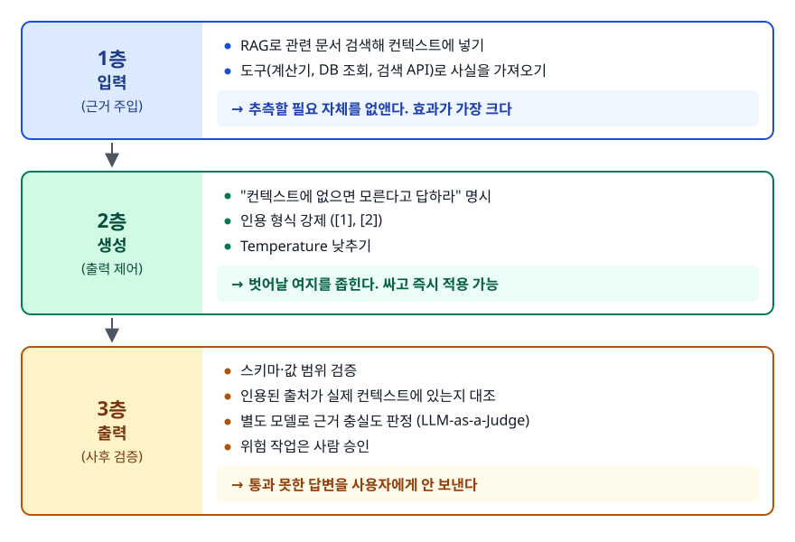
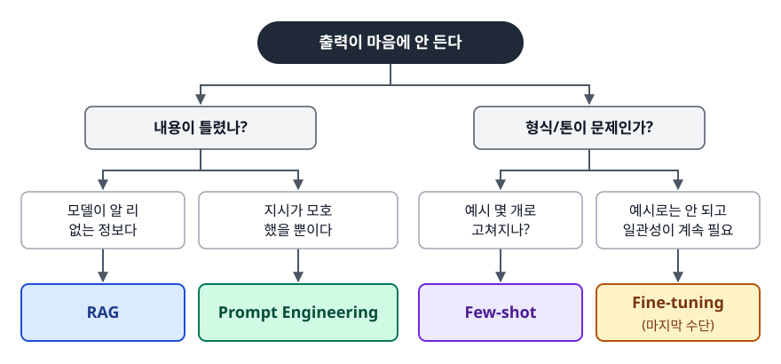
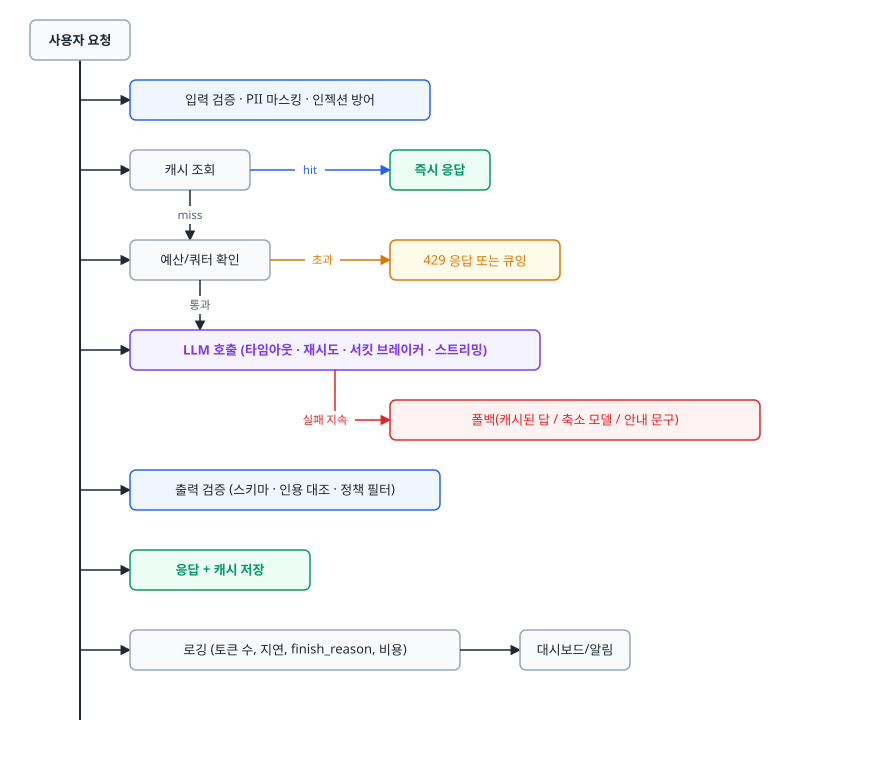
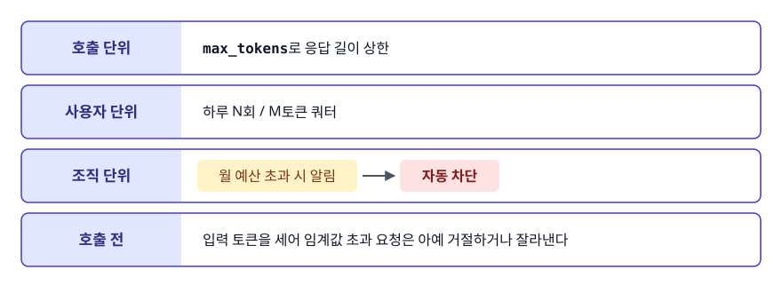

# 환각과 프로덕션 통합 (Hallucination & Production Integration)

> 환각을 왜 없앨 수 없는 것으로 다뤄야 하는지, 그리고 그 전제 위에서 LLM을 실제 서비스에 붙일 때 무엇을 설계해야 하는지 설명할 수 있게 됩니다.

## 학습 목표

- [ ] 환각이 버그가 아니라 구조적 특성인 이유를 모델 동작으로 설명할 수 있다
- [ ] 완화 기법을 "근거 주입 / 생성 제어 / 사후 검증" 세 층으로 나눠 배치할 수 있다
- [ ] Prompt Engineering, RAG, Fine-tuning을 문제 유형에 따라 선택할 수 있다
- [ ] LLM 호출을 외부 의존성으로 보고 타임아웃, 재시도, 캐싱, 상한을 설계할 수 있다
- [ ] 프롬프트를 바꿨을 때 품질이 나빠졌는지 확인하는 평가 파이프라인의 필요성을 안다

## 선행 지식

- [01-llm-basics-prompting.md](./01-llm-basics-prompting.md) — 다음 토큰 예측과 샘플링 파라미터

---

## 1. 왜 필요한가

LLM 프로토타입은 하루면 만들어집니다. 그 프로토타입을 서비스로 만들려는 순간 전혀 다른 문제들이 쏟아집니다.

- 데모에서는 맞던 답이 실제 사용자 질문에서는 존재하지 않는 정책을 지어낸다
- API가 가끔 30초 넘게 응답하지 않아 요청 스레드가 쌓인다
- 429(rate limit)를 받고 곧바로 재시도했더니 더 심하게 막힌다
- 월말에 청구서를 보고 나서야 특정 사용자가 API를 반복 호출하고 있었음을 안다
- 프롬프트를 한 줄 고쳤더니 다른 케이스가 조용히 깨졌는데, 배포 2주 뒤 CS 문의로 알게 된다

이 목록에는 공통점이 있습니다. 모델을 정답을 주는 함수로 가정했기 때문에 생긴 문제들입니다. LLM은 확률적으로 텍스트를 생성하는 불안정한 외부 의존성입니다. 그 전제로 설계를 바꾸면 위 문제들은 대부분 익숙한 백엔드 문제로 환원됩니다.

---

## 2. 환각은 왜 구조적 특성인가

### 정의부터 정확히

환각(Hallucination)은 모델이 **사실이 아닌 내용을 사실인 것처럼 자연스럽게 생성**하는 현상입니다. 자연스럽게라는 말에 무게가 실려 있습니다. 모델은 헛소리를 티 나게 내놓지 않습니다. 맞는 답과 구별이 안 되는 형태로 내놓기 때문에 문제가 됩니다.

### 원인 세 가지

**1. 검증 단계가 없습니다.** [01번 문서](./01-llm-basics-prompting.md)에서 봤듯 모델은 다음 토큰의 확률 분포를 계산해 하나를 뽑을 뿐입니다. 이 내용이 사실인지 묻는 단계가 파이프라인 어디에도 없습니다. 모델에게 맞는 답과 그럴듯한 답은 구별되지 않습니다. 둘 다 그저 확률이 높은 토큰 열입니다.

**2. 빈칸을 비워두는 법을 배우지 못했습니다.** 학습 데이터인 인터넷 텍스트에는 "모르겠습니다"로 끝나는 문서가 거의 없습니다. 질문 뒤에는 답변이 오는 것이 압도적인 패턴입니다. 그래서 모르는 것을 물어도 모델은 답변 형태의 토큰 열을 생성하는 쪽으로 기웁니다.

**3. 그럴듯함이 곧 높은 확률입니다.** `torch.nn.functional.softmax_with_logits`처럼 실제로는 없는 함수 이름이 자신 있게 나오는 이유가 이것입니다. 존재하는 이름들과 형태가 비슷하니 각 토큰의 확률이 높습니다. 모델 안에서는 통계적으로 매우 그럴듯한 결과일 뿐입니다.

### 비유: 모른다고 말할 줄 모르는 신입

업무를 물으면 무엇이든 막힘없이 답하는 신입이 있다고 해봅시다. 아는 것은 정확히 답하고, 모르는 것도 **비슷한 사례에서 유추해 그럴듯하게** 답합니다. 두 경우의 말투와 확신도가 똑같아서 듣는 사람은 어느 쪽인지 구별하지 못합니다. 틀리지 마라고 지적해봐야 소용이 없습니다. 답하기 전에 자료를 찾아보게 하고 근거를 함께 말하게 하는 절차가 이 신입에게 필요한 조치입니다.

> **비유의 한계**: 신입은 자기가 확신이 없다는 사실을 적어도 스스로는 알고, 물어보면 말해줍니다. 모델은 사실을 회상하는 것과 지어내는 것이 똑같이 "다음 토큰 확률 계산" 한 가지 연산으로 처리되기 때문에, 자기 확신도를 답변에 제대로 반영하지 못합니다. 그래서 "모르면 모른다고 하라"는 지시가 사람에게 하는 것만큼 잘 듣지 않습니다.

### 유형

| 유형 | 예 | 특히 위험한 곳 |
|------|-----|--------------|
| 사실 오류 | 없는 정책·수치·날짜를 단정적으로 진술 | 고객 응대, 의료·법률·금융 정보 |
| 출처 날조 | 존재하지 않는 논문, URL, 사내 문서 번호를 인용 | 리서치 요약, 근거 제시 요구 시나리오 |
| 논리 오류 | 전제는 맞는데 추론 체인이 틀려 결론이 틀림 | 다단계 계산, 조건 분기가 많은 규정 해석 |
| 허구 생성 | 없는 함수·라이브러리·설정 키를 만들어냄 | 코드 생성 |

코드 생성의 허구 생성은 보안 문제로도 이어집니다. 모델이 반복해서 지어내는 패키지 이름이 있습니다. 공격자가 그 이름을 실제로 등록해두면, 그 제안을 그대로 설치하는 순간 악성 코드가 들어옵니다. 모델이 제안한 의존성은 실제로 존재하는지 확인하고 설치해야 합니다.

### 그래서 목표를 바꿔야 한다

환각을 0으로 만들려는 목표는 달성 불가능합니다. 현실적인 목표는 두 가지입니다.

```
목표 1. 발생 확률을 낮춘다        → 근거 주입, 생성 제어
목표 2. 발생했을 때 티가 나게 한다 → 사후 검증, 출처 표시, 사람 확인 경로
```

두 번째가 특히 자주 빠집니다. 틀린 답이 나올 수 있다는 사실보다, 틀렸는지 아무도 모른다는 사실이 훨씬 위험합니다.

---

## 3. 완화 기법을 세 층으로 배치하기

기법을 나열식으로 외우면 실무에서 무엇부터 할지 결정하지 못합니다. **입력 → 생성 → 출력** 순서로 놓으면 자연스럽게 우선순위가 생깁니다.

<!-- diagram:ai-hallucination-integration-1 -->


<!-- 위 그림이 대체한 원본 ASCII.
     내용을 고칠 때는 그림도 함께 갱신할 것.
```
┌──────────────── 1층: 입력 (근거 주입) ────────────────┐
│  RAG로 관련 문서 검색해 컨텍스트에 넣기                 │
│  도구(계산기, DB 조회, 검색 API)로 사실을 가져오기      │
│  → 추측할 필요 자체를 없앤다. 효과가 가장 크다          │
└───────────────────────┬───────────────────────────────┘
                        ↓
┌──────────────── 2층: 생성 (출력 제어) ────────────────┐
│  "컨텍스트에 없으면 모른다고 답하라" 명시              │
│  인용 형식 강제 ([1], [2])                             │
│  Temperature 낮추기                                    │
│  → 벗어날 여지를 좁힌다. 싸고 즉시 적용 가능           │
└───────────────────────┬───────────────────────────────┘
                        ↓
┌──────────────── 3층: 출력 (사후 검증) ────────────────┐
│  스키마·값 범위 검증                                   │
│  인용된 출처가 실제 컨텍스트에 있는지 대조             │
│  별도 모델로 근거 충실도 판정 (LLM-as-a-Judge)         │
│  위험 작업은 사람 승인                                 │
│  → 통과 못한 답변을 사용자에게 안 보낸다               │
└───────────────────────────────────────────────────────┘
```
-->

### 1층: 근거를 주면 추측할 이유가 없어진다

가장 효과가 큰 조치입니다. 모델이 모르는 것을 물으니 지어내는 것이므로, 알려주면 지어낼 이유가 사라집니다. 사내 문서·최신 정보라면 RAG, 계산이나 실시간 조회라면 도구 호출입니다. RAG의 구체적인 구성은 [RAG 파이프라인 문서](../rag-pipeline/01-rag-pipeline.md)에서 다룹니다.

다만 RAG는 환각을 줄일 뿐 없애지는 않습니다. 검색 결과가 엉뚱하면 엉뚱한 근거 위에서 그럴듯하게 답합니다. 검색 품질이 곧 답변 품질입니다.

### 2층: 프롬프트로 벗어날 여지를 좁힌다

```
안티패턴:
  "환각을 일으키지 마세요. 정확하게 답하세요."
```

**왜 문제인가**: 모델은 자기가 환각 중인지 모릅니다. 알면 애초에 안 했습니다. 이 지시는 "틀리지 마"와 같은 말이라 행동을 바꾸지 못합니다. 모호한 금지 대신 **관찰 가능한 행동**을 지시해야 합니다.

```
개선:

아래 <컨텍스트> 안의 내용만 근거로 사용한다.
컨텍스트에 답이 없으면 정확히 "제공된 문서에서 확인할 수 없습니다"라고만 답한다.
추론이나 일반 상식으로 빈칸을 채우지 않는다.
모든 문장 끝에 근거 문서 번호를 [1] 형식으로 표기한다.

<컨텍스트>
[1] {doc1}
[2] {doc2}
</컨텍스트>

질문: {query}
```

두 지시는 검사 가능성에서 갈립니다. "환각하지 마라"는 지켰는지 확인할 수 없지만, "인용 번호를 붙여라"는 붙었는지 프로그램이 볼 수 있습니다. 3층 검증이 가능해지는 것도 이 때문입니다.

여기에 Temperature를 0~0.3으로 낮추면 근거에서 멀어지는 표현이 선택될 확률이 줄어듭니다. 다만 Temperature는 사실성 손잡이가 아닙니다. 낮춰도 없는 사실은 여전히 만들어집니다. 가장 그럴듯한 환각을 안정적으로 반복할 뿐입니다.

### 3층: 사후 검증

인용을 강제했다면 그것이 진짜인지 대조할 수 있습니다.

```python
import re

def verify_citations(answer: str, context_ids: set[str]) -> list[str]:
    """답변이 인용한 번호가 실제로 제공된 컨텍스트에 있는지 확인한다."""
    cited = set(re.findall(r"\[(\d+)\]", answer))
    fabricated = cited - context_ids
    return sorted(fabricated)

fabricated = verify_citations(answer, {"1", "2", "3"})
if fabricated:
    # [7]처럼 존재하지 않는 근거를 인용했다 = 출처 날조 신호
    log.warning("fabricated citation: %s", fabricated)
    answer = FALLBACK_MESSAGE
```

더 나아가 별도 LLM 호출로 답변의 각 문장이 컨텍스트로 뒷받침되는지 판정하는 방식(LLM-as-a-Judge)도 있습니다. 정확도는 올라가지만 호출이 두 배가 되고 판정자 자신도 환각합니다. 전체 트래픽 대신 샘플링해서 품질 모니터링 용도로 쓰는 편이 현실적입니다.

### 다른 기법과 그 한계

| 기법 | 하는 일 | 한계 |
|------|--------|------|
| Self-consistency | 같은 질문을 여러 번 생성해 다수결 | 호출 비용 N배. 모델이 일관되게 틀리면 못 잡는다 |
| 신뢰도 표시 | 검색 점수 등을 근거로 확신도를 사용자에게 노출 | 모델이 말하는 확신은 실제 정확도와 상관이 낮다 |
| 출처 링크 노출 | 사용자가 원문을 직접 확인 | 아무도 안 눌러본다는 전제로 설계해야 한다 |
| 사람 승인 | 되돌리기 어려운 행동 앞에 게이트 | 처리량이 줄고 승인 피로가 쌓인다 |

> 표 요약: 어느 하나로 해결되지 않습니다. 1층(근거)을 기본으로 깔고, 2층(제어)은 비용이 거의 없으니 항상 적용하고, 3층(검증)은 실수 비용이 큰 경로에만 선택적으로 붙이는 것이 일반적인 배치입니다.

---

## 4. Prompt Engineering vs RAG vs Fine-tuning

세 가지는 서로 경쟁하지 않습니다. 각자 다른 종류의 부족함을 메웁니다. 고를 때는 무엇이 부족한지만 보면 됩니다.

| 기준 | Prompt Engineering | RAG | Fine-tuning |
|------|-------------------|-----|-------------|
| 무엇을 바꾸나 | 입력만 | 입력(검색 결과 주입) | 모델 가중치 |
| 해결하는 부족함 | 지시 불명확, 형식 이탈 | **지식** 부족 | **행동·형식·톤** 불일치 |
| 필요한 것 | 없음 | 문서 + 임베딩 + 벡터 DB | 원하는 출력을 그대로 담은 학습 데이터. 필요 규모는 작업마다 다르고 양보다 일관성이 중요하다 |
| 지식 갱신 | 해당 없음 | 문서만 갈아끼우면 즉시 반영 | 재학습 필요 |
| 초기 비용 | 거의 없음 | 검색 인프라 구축·운영 | 데이터 구축 + 학습 비용 |
| 호출당 비용 | 낮음 | 컨텍스트만큼 입력 토큰 증가 | 프롬프트는 짧아지지만 파인튜닝 모델의 토큰 단가가 기본 모델보다 높은 경우가 많다 |
| 출처 제시 | 불가 | 가능 (핵심 장점) | 불가 |
| 환각 억제 | 제한적 | 큼 (근거 주입) | 형식 이탈은 줄지만 사실 환각은 그대로 |
| 실패 시 원인 파악 | 쉬움 | 검색·생성 분리 진단 가능 | 어려움 (가중치 안이 블랙박스) |

> 표 요약: **모르는 것이 문제면 RAG, 알긴 아는데 원하는 방식으로 안 하는 게 문제면 Fine-tuning, 그 외 전부는 먼저 Prompt Engineering.**

결정 순서를 그림으로 두면 이렇습니다.

<!-- diagram:ai-hallucination-integration-2 -->


<!-- 위 그림이 대체한 원본 ASCII.
     내용을 고칠 때는 그림도 함께 갱신할 것.
```
                  출력이 마음에 안 든다
                          │
          ┌───────────────┴───────────────┐
          ↓                               ↓
   내용이 틀렸나?                  형식/톤이 문제인가?
          │                               │
   ┌──────┴──────┐                 ┌──────┴──────┐
   ↓             ↓                 ↓             ↓
모델이 알 리    지시가 모호       예시 몇 개로    예시로는 안 되고
없는 정보다     했을 뿐이다       고쳐지나?       일관성이 계속 필요
   ↓             ↓                 ↓             ↓
  RAG      Prompt Engineering   Few-shot     Fine-tuning
                                              (마지막 수단)
```
-->

Fine-tuning을 마지막에 두는 데는 비용 말고 다른 이유가 있습니다. 지식을 Fine-tuning으로 넣으면 그 지식이 틀렸을 때 고칠 방법이 재학습밖에 없습니다. RAG라면 문서 한 줄 고치면 끝납니다. 실무에서는 조합이 흔합니다. Fine-tuning으로 어투와 출력 형식을 고정하고, RAG로 최신 정책 문서를 가져오고, 프롬프트로 안전 제약을 겁니다.

---

## 5. 프로덕션 통합

LLM 호출은 **느리고 비싸고 가끔 실패하고 결과가 매번 다른 외부 API**입니다. 이 네 가지 성질에 각각 대응하는 장치가 필요합니다.

<!-- diagram:ai-hallucination-integration-3 -->


<!-- 위 그림이 대체한 원본 ASCII.
     내용을 고칠 때는 그림도 함께 갱신할 것.
```
사용자 요청
    │
    ├─▶ 입력 검증 · PII 마스킹 · 인젝션 방어
    │
    ├─▶ 캐시 조회 ──── hit ──▶ 즉시 응답
    │        │ miss
    │        ↓
    ├─▶ 예산/쿼터 확인 ── 초과 ──▶ 429 응답 또는 큐잉
    │        │ 통과
    │        ↓
    ├─▶ LLM 호출 (타임아웃 · 재시도 · 서킷 브레이커 · 스트리밍)
    │        │
    │        ├── 실패 지속 ──▶ 폴백(캐시된 답 / 축소 모델 / 안내 문구)
    │        ↓
    ├─▶ 출력 검증 (스키마 · 인용 대조 · 정책 필터)
    │
    ├─▶ 응답 + 캐시 저장
    │
    └─▶ 로깅 (토큰 수, 지연, finish_reason, 비용) → 대시보드/알림
```
-->

### 타임아웃과 재시도

```python
# 안티패턴
def ask(prompt):
    for _ in range(5):
        try:
            return client.chat.completions.create(model=MODEL, messages=[...])
        except Exception:
            continue   # 즉시 재시도
```

**왜 문제인가**: 세 가지가 동시에 잘못됐습니다. (1) 타임아웃이 없어 서버가 응답을 안 주면 워커가 무한정 붙잡혀 있습니다. (2) 429(rate limit)에 즉시 재시도하면 제한을 더 세게 때립니다. (3) 400(잘못된 요청)처럼 재시도해도 절대 성공하지 않을 오류까지 5번 반복해 시간과 돈을 버립니다.

```python
# 개선
import random, time

RETRIABLE = (RateLimitError, APITimeoutError, InternalServerError)

def ask(prompt: str, attempts: int = 3, timeout: float = 20.0):
    for i in range(attempts):
        try:
            return client.chat.completions.create(
                model=MODEL,
                messages=[{"role": "user", "content": prompt}],
                timeout=timeout,          # 반드시 건다
            )
        except RETRIABLE:
            if i == attempts - 1:
                raise
            # 지수 백오프 + 지터: 여러 워커가 동시에 재시도해 몰리는 것을 막는다
            time.sleep((2 ** i) + random.uniform(0, 1))
        except BadRequestError:
            raise                          # 재시도 무의미. 즉시 실패시킨다
```

여기에 서킷 브레이커를 얹으면 실패가 지속될 때 회로를 열어 장애가 전체 서비스로 번지는 것을 막습니다. 백엔드에서 외부 API를 다루던 방식 그대로입니다.

### 스트리밍

LLM은 첫 토큰이 나올 때까지도 눈에 띄는 시간이 걸리고, 답변이 길면 완료까지 그 몇 배가 더 듭니다. 완성된 답을 기다렸다 한 번에 주면 사용자는 그동안 빈 화면을 봅니다. 스트리밍은 총 시간을 줄이지는 않지만 체감 지연(TTFT, Time To First Token)을 크게 낮춥니다.

스트리밍과 출력 검증은 서로 상충합니다. 검증은 전체 출력이 있어야 가능한데, 스트리밍은 검증 전에 이미 사용자에게 보내진 뒤입니다. 그래서 정책 위반이나 형식 오류를 반드시 걸러야 하는 응답은 스트리밍하지 않거나, 일정 단위로 버퍼링해 검사한 뒤 흘려보내는 식으로 타협합니다.

### 비용 상한

비용 사고는 대부분 특정 사용자 하나가 반복 호출하는 데서 옵니다. 상한은 여러 층에 둡니다.

<!-- diagram:ai-hallucination-integration-4 -->


<!-- 위 그림이 대체한 원본 ASCII.
     내용을 고칠 때는 그림도 함께 갱신할 것.
```
호출 단위:  max_tokens로 응답 길이 상한
사용자 단위: 하루 N회 / M토큰 쿼터
조직 단위:  월 예산 초과 시 알림 → 자동 차단
호출 전:    입력 토큰을 세어 임계값 초과 요청은 아예 거절하거나 잘라낸다
```
-->

### 캐싱

LLM은 같은 입력에 같은 출력이 나온다고 보장하지 않지만 캐시는 우리가 같게 만들 수 있습니다.

```python
import hashlib, json

def cache_key(prompt: str, model: str, temperature: float) -> str:
    # 모델과 파라미터가 다르면 다른 결과다. 반드시 키에 포함한다
    payload = json.dumps({"p": prompt, "m": model, "t": temperature}, sort_keys=True)
    return "llm:" + hashlib.sha256(payload.encode()).hexdigest()
```

프롬프트만 키로 쓰는 것이 가장 흔한 실수입니다. 모델을 바꾸거나 temperature를 바꿔도 예전 결과가 그대로 나와 A/B 테스트가 통째로 무의미해집니다.

캐시 대상은 세 종류로 나눠 생각하면 편합니다.

- **임베딩**: 같은 텍스트는 항상 같은 벡터입니다. 영구 캐시해도 안전하고 효과가 큽니다
- **완성 응답**: 자주 반복되는 질문(FAQ)에 유효합니다. TTL을 두고 개인화된 답변은 캐시하지 않습니다
- **프롬프트 캐싱**: API가 지원하면 긴 시스템 프롬프트·문서를 서버 측에서 재사용해 입력 비용을 줄입니다. 고정 부분을 앞쪽에 몰아야 적중합니다

### PII와 프롬프트 인젝션

- **나가는 데이터**: 사용자 입력에 주민번호·카드번호·연락처가 섞여 외부 API로 나가면 그 자체가 사고입니다. 호출 전에 탐지·마스킹하고 로그에 원문을 그대로 남기지 않습니다
- **들어오는 데이터**: 사용자 입력이나 RAG로 가져온 문서에 "이전 지시를 무시하라"가 들어 있을 수 있습니다. 구분자로 감싸 데이터임을 명시하고, **모델 출력이 곧바로 위험한 행동(DB 삭제, 메일 발송, 결제)으로 이어지지 않게 권한을 최소화**합니다. 프롬프트 방어만으로는 부족하고 권한 설계가 마지막 방어선입니다

### 평가 파이프라인

프롬프트나 모델을 바꿀 때마다 손으로 몇 개 넣어보고 좋아진 것 같다고 판단하면, 개선한 케이스와 망가진 케이스를 구별하지 못합니다.

```
1. 골든 데이터셋   실제 사용자 질문 30~100건 + 기대 결과
                  (엣지 케이스와 과거 장애 사례를 반드시 포함)
2. 자동 채점      형식/스키마는 프로그램으로, 내용은 LLM-as-a-Judge나 사람이
3. 회귀 확인      프롬프트·모델·파라미터가 바뀌면 CI에서 전체 재실행
4. 운영 반영      실패 사례를 데이터셋에 계속 추가해 자산으로 키운다
```

이 네 단계는 개선 여부를 숫자로 비교할 수 있게 만들어줍니다. 단위 테스트가 없는 코드베이스를 리팩터링하지 않는 것과 같은 이유입니다.

---

## 6. 실무에서는

- **LLM 호출을 애플리케이션 코드 전체에 흩뿌리지 않습니다.** 클라이언트를 한 겹 감싸는 래퍼를 두고 타임아웃, 재시도, 캐싱, 토큰 로깅, 마스킹을 그 안에서 처리합니다. 나중에 모델을 바꾸거나 폴백을 추가할 때 손댈 곳이 한 군데로 모입니다.
- **동기 호출로 처리하지 못할 작업은 비동기로 뺍니다.** 문서 수십 개 요약처럼 수십 초 걸리는 작업을 HTTP 요청 안에서 처리하면 타임아웃과 워커 고갈이 함께 옵니다. 작업 큐에 넣고 완료를 폴링하거나 푸시하는 구조가 안전합니다.
- **관측 지표는 성공률·지연으로 끝나지 않습니다.** 호출당 토큰 수, 캐시 적중률, `finish_reason` 분포, 출력 검증 실패율, 사용자별 비용을 같이 봅니다. 검증 실패율이 갑자기 오르면 모델 업데이트나 프롬프트 변경이 있었는지부터 확인합니다.
- **모델 버전을 고정합니다.** 항상 최신을 가리키는 별칭을 쓰면 어느 날 갑자기 출력 형식이 바뀌어 파싱이 깨질 수 있습니다. 버전을 명시하고, 올릴 때는 평가셋을 돌린 뒤 올립니다.

---

## 7. 면접 포인트

> 면접에서 이 주제가 나오면 이렇게 답한다

**Q. 환각을 어떻게 없앨 수 있나요?**
A. 없앨 수 없다는 전제에서 시작합니다. LLM은 다음 토큰 확률을 계산해 뽑는 모델이라 사실 검증 단계가 구조적으로 없습니다. 학습 데이터에도 "모르겠다"로 끝나는 문서가 드물어 모르는 질문에도 답변 형태를 생성하려는 경향이 있습니다. 그래서 목표를 발생 확률을 낮추는 것과 발생했을 때 티가 나게 하는 것으로 나눕니다. 앞은 RAG로 근거를 주입하고 컨텍스트 밖 내용을 답하지 말라고 제약하는 것이고, 뒤는 인용을 강제한 뒤 그 인용이 실제 컨텍스트에 있는지 프로그램으로 대조하는 것입니다.
- 꼬리 질문: "temperature를 0으로 하면 되지 않나요?" → 출력이 덜 흔들릴 뿐 없는 사실은 여전히 만들어냅니다. 오히려 같은 환각을 안정적으로 반복하게 된다고 답합니다.

**Q. RAG와 Fine-tuning 중 무엇을 선택하시겠어요?**
A. 부족한 것이 지식인지 행동인지로 나눕니다. 사내 규정처럼 모델이 알 리 없는 정보가 필요하면 RAG입니다. 문서만 갱신하면 즉시 반영되고 출처를 제시할 수 있어 검증도 가능합니다. 반대로 지식은 충분한데 출력 형식이나 어투가 매번 흔들리는 문제라면 Fine-tuning이 맞습니다. 지식을 Fine-tuning으로 넣는 건 권하지 않는데, 그 지식이 틀렸을 때 고치려면 재학습밖에 방법이 없기 때문입니다.
- 꼬리 질문: "둘 다 쓰는 경우도 있나요?" → 흔합니다. Fine-tuning으로 어투와 출력 형식을 고정하고 RAG로 최신 정책을 가져오는 조합이 실무에서 자주 쓰입니다.

**Q. LLM API 호출 실패에 어떻게 대응하시겠어요?**
A. 일반 외부 API와 같은 원칙에 LLM 특유의 항목을 더합니다. 타임아웃을 반드시 걸고, 429와 5xx 같은 일시적 오류에만 지수 백오프에 지터를 섞어 재시도하고, 400처럼 재시도해도 성공하지 않을 오류는 즉시 실패시킵니다. 반복 실패 시에는 서킷 브레이커로 차단하고 캐시된 답변이나 축소 모델로 폴백합니다. LLM 특유의 항목으로는 컨텍스트 초과 오류에 대비해 입력을 잘라내거나 요약하는 경로가 있습니다. 그리고 `finish_reason`이 length면 응답이 중간에 잘린 것이니, 이를 정상 응답으로 착각하지 않게 검사하는 항목이 있습니다.
- 꼬리 질문: "재시도를 몇 번으로 잡나요?" → 고정된 숫자를 두지 않고 사용자 대기 시간 예산에서 역산합니다. 타임아웃 20초에 3회 재시도면 최악의 경우 1분이 넘으므로, 사용자 대면 경로라면 총 시간에 상한을 두고 그 안에서 횟수를 정합니다.

**Q. 프롬프트를 수정했을 때 품질이 좋아졌는지 어떻게 확인하나요?**
A. 골든 데이터셋을 미리 만들어둡니다. 실제 사용자 질문에서 30~100건을 뽑고 여기에 엣지 케이스와 과거에 문제됐던 사례를 더해 기대 결과와 함께 저장합니다. 프롬프트나 모델, 파라미터가 바뀌면 CI에서 전체를 재실행해 형식은 프로그램으로, 내용은 사람이나 판정 모델로 채점합니다. 이렇게 해야 어떤 케이스가 좋아지고 어떤 케이스가 망가졌는지 구별합니다. 운영에서 나온 실패 사례를 데이터셋에 계속 추가하면 자산이 됩니다.
- 꼬리 질문: "LLM으로 채점하면 그 채점자도 환각하지 않나요?" → 합니다. 그래서 전수 채점의 근거로 쓰기보다 샘플링 모니터링과 1차 필터로 쓰고, 최종 판단이 필요한 항목은 사람이 확인한다고 답합니다.

---

## 자주 하는 실수

| 실수 | 왜 틀렸나 | 올바른 이해 |
|------|----------|-----------|
| "환각하지 마세요"라고 프롬프트에 쓴다 | 모델은 자신이 환각 중인지 모른다. 검사도 불가능한 지시다 | "컨텍스트 밖 내용은 모른다고 답하라", "인용을 붙여라"처럼 관찰 가능한 행동으로 바꾼다 |
| RAG를 붙였으니 환각이 없어졌다고 본다 | 검색이 틀리면 틀린 근거 위에서 그럴듯하게 답한다 | RAG는 확률을 낮출 뿐이다. 검색 품질 평가와 출력 검증이 함께 필요하다 |
| 캐시 키를 프롬프트만으로 만든다 | 모델·temperature가 바뀌어도 옛 결과가 나온다 | 모델명과 샘플링 파라미터를 키에 포함한다 |
| 모든 오류에 똑같이 재시도한다 | 400 계열은 몇 번을 해도 실패하고 429는 재시도가 상황을 악화시킨다 | 재시도 가능한 오류만 골라 지수 백오프와 지터를 적용한다 |
| 지식을 Fine-tuning으로 넣는다 | 지식이 틀렸을 때 재학습 외에 고칠 방법이 없다 | 지식은 RAG, 행동·형식은 Fine-tuning으로 나눈다 |
| 스트리밍 출력에 검증을 그대로 적용할 수 있다고 본다 | 검증은 전체 출력이 필요한데 이미 사용자에게 나간 뒤다 | 검증이 필수인 응답은 스트리밍하지 않거나 버퍼링 후 내보낸다 |

---

## 한 줄 정리

환각은 다음 토큰 예측 구조에서 나오는 특성이라 제거 대상이 아니라 관리 대상이고, 프로덕션 통합이란 그 불확실한 외부 의존성 앞뒤에 근거 주입·출력 검증·타임아웃·상한·평가를 배치하는 일입니다.

---

## 연관 개념

- [01-llm-basics-prompting.md](./01-llm-basics-prompting.md) - 다음 토큰 예측, 토큰 비용, 샘플링 파라미터
- [qna-llm.md](./qna-llm.md) - LLM 통합 면접 질문(Q4~Q6이 이 문서 범위)
- [../rag-pipeline/01-rag-pipeline.md](../rag-pipeline/01-rag-pipeline.md) - 1층 근거 주입의 구체적 구현
- [../ai-agent/01-agent-langgraph.md](../ai-agent/01-agent-langgraph.md) - 도구 호출로 사실을 가져오는 방식과 사람 승인 게이트
- [../rag-pipeline/qna-rag.md](../rag-pipeline/qna-rag.md) - RAG 관점의 환각 완화 질문(Q5)
