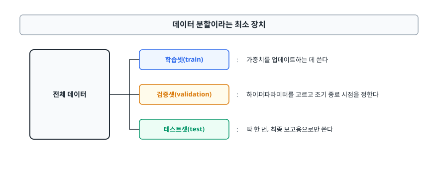
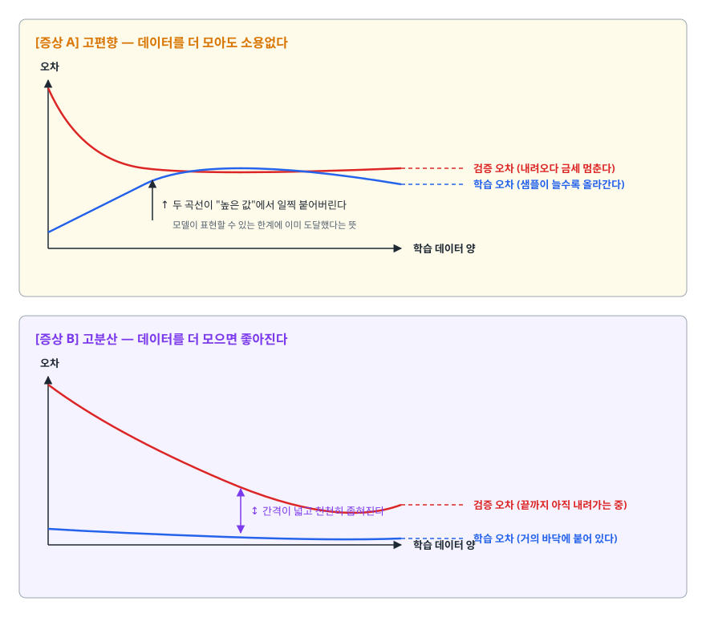
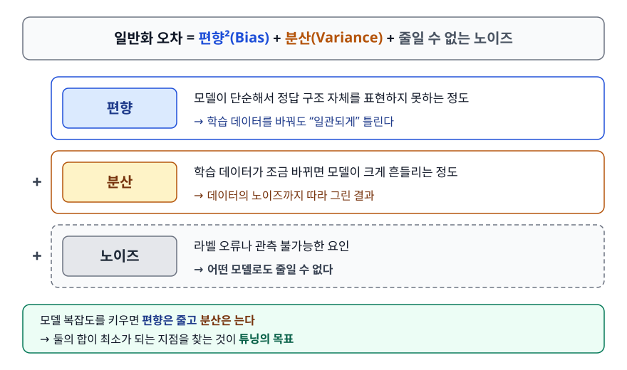
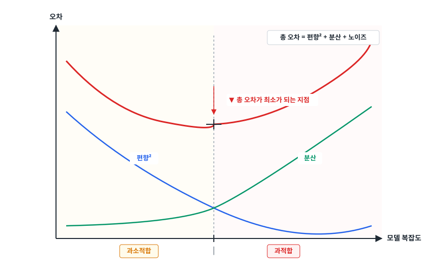
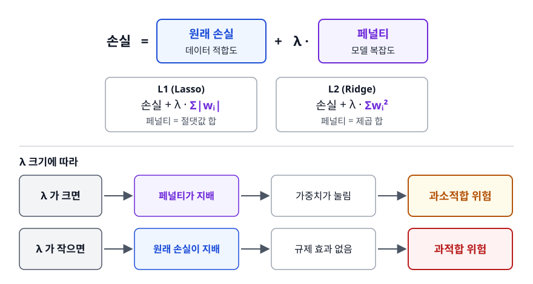
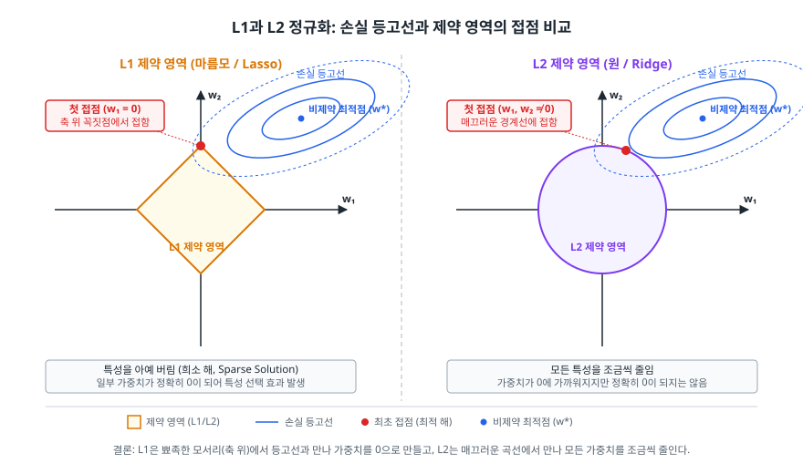
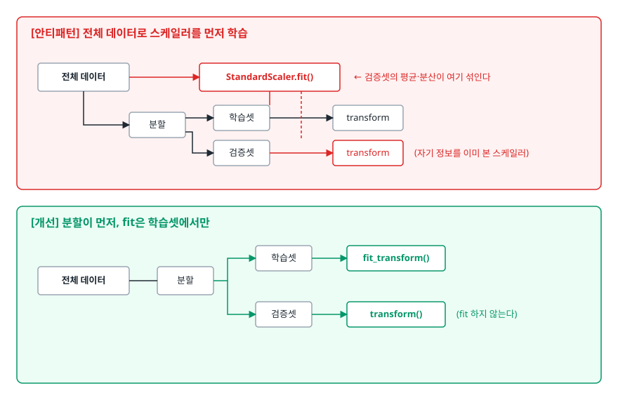

# 과적합과 정규화 (Overfitting & Regularization)

> 학습 점수는 좋은데 실전 성능이 무너지는 이유를 학습 곡선으로 진단하고, 어떤 완화 기법을 왜 그 순서로 적용해야 하는지 설명할 수 있게 됩니다.

## 학습 목표

- [ ] 과적합과 과소적합을 학습/검증 오차 두 숫자만 보고 구분할 수 있다
- [ ] 편향-분산 트레이드오프가 모델 복잡도와 어떻게 연결되는지 그릴 수 있다
- [ ] L1과 L2가 왜 서로 다른 결과를 내는지 기하학적으로 설명할 수 있다
- [ ] Dropout과 배치 정규화가 각각 무엇을 막는 장치인지 구분할 수 있다
- [ ] 데이터 누수가 만든 가짜 성능을 코드 수준에서 찾아낼 수 있다

## 선행 지식

- 없음 — 손실 함수와 가중치라는 단어의 뜻만 알면 이 문서부터 시작해도 된다

---

## 1. 왜 필요한가

### 우리가 진짜 원하는 것은 학습 데이터 성능이 아니다

머신러닝 모델을 학습시키는 과정은 "가진 데이터에서 오차를 최소화하라"는 지시입니다. 그런데 우리가 실제로 원하는 것은 **아직 보지 못한 데이터에서 오차가 작은 것**입니다. 이 둘은 같지 않습니다. 지시와 목표가 어긋나 있다는 사실, 그것이 이 문서 전체의 출발점입니다.

극단적인 예를 보자. 학습 데이터를 통째로 표에 저장해두고, 입력이 들어오면 표에서 찾아 정답을 뱉는 모델이 있다고 하자.

```python
class LookupModel:
    def fit(self, X, y):
        self.table = {tuple(x): label for x, label in zip(X, y)}

    def predict(self, x):
        return self.table.get(tuple(x), 0)   # 못 보던 입력이면 그냥 0
```

이 모델의 학습 정확도는 100%다. 그리고 실전에서는 완전히 쓸모없습니다. 학습 오차를 최소화하라는 지시를 가장 충실히 따른 결과가 최악의 모델이라는 것 — 이것이 과적합의 본질입니다.

### 비유: 족보만 외운 수험생

기출문제 답만 통째로 외운 학생은 기출을 다시 풀면 만점을 받습니다. 그러나 숫자만 바꾼 문제를 주면 무너집니다. 문제를 푸는 **규칙**이 아니라 문제와 답의 **쌍**을 외웠기 때문입니다.

> **비유의 한계**: 학생은 자기가 이해한 게 아니라 외웠다는 걸 스스로 압니다. 모델은 모릅니다. 학습 손실만 보면 규칙을 익힌 모델과 답을 외운 모델이 똑같아 보입니다. 그래서 **학습에 쓰지 않은 데이터로 따로 채점하는 절차**가 반드시 필요합니다.

### 데이터 분할이라는 최소 장치

<!-- diagram:ai-overfitting-regularization-1 -->


<!-- 위 그림이 대체한 원본 ASCII.
     내용을 고칠 때는 그림도 함께 갱신할 것.
```
전체 데이터
  ├── 학습셋(train)      : 가중치를 업데이트하는 데 쓴다
  ├── 검증셋(validation) : 하이퍼파라미터를 고르고 조기 종료 시점을 정한다
  └── 테스트셋(test)     : 딱 한 번, 최종 보고용으로만 쓴다
```
-->

검증셋과 테스트셋을 왜 나누는지가 자주 헷갈립니다. 검증셋을 보면서 학습률을 바꾸고 층 수를 바꾸고 하다 보면, **검증셋에도 사람이 손으로 과적합을 시키게 됩니다**. 검증 점수는 계속 오르는데 실제 성능은 그대로인 상황입니다. 테스트셋은 그 오염을 피하기 위해 마지막까지 봉인해두는 데이터입니다.

---

## 2. 과적합과 과소적합을 숫자로 구분하기

두 개의 숫자, 학습 오차와 검증 오차만 있으면 진단이 끝납니다.

| 증상 | 학습 오차 | 검증 오차 | 두 오차의 간격 | 진단 | 처방 |
|------|----------|----------|--------------|------|------|
| A | 높음 | 높음 | 좁음 | 과소적합(고편향) | 모델을 키우고, 특징을 추가하고, 규제를 줄인다 |
| B | 낮음 | 높음 | 넓음 | 과적합(고분산) | 데이터를 늘리고, 규제를 걸고, 모델을 줄인다 |
| C | 낮음 | 낮음 | 좁음 | 정상 | 그대로 간다 |
| D | 높음 | 낮음 | 역전 | 측정 방식부터 확인 | 규제가 학습 손실만 부풀렸거나, 분할이 잘못됐다 |

> 표에서는 **간격(generalization gap)** 열이 가장 중요합니다. 검증 오차가 높다는 사실만으로는 A와 B를 구분할 수 없습니다. 학습 오차까지 같이 봐야 "덜 배운 것"과 "잘못 배운 것"이 갈립니다.

D는 무조건 버그는 아닙니다. 두 손실을 같은 조건에서 재지 않아서 생기는 경우가 흔합니다. Dropout과 증강은 학습 중에만 켜지므로 학습 손실이 실제보다 부풀려지고, 학습 손실은 에폭 내내 갱신되는 가중치의 평균인 반면 검증 손실은 에폭 끝의 가중치로 한 번에 잽니다. 이 두 가지만으로도 역전이 나올 수 있습니다. 그래도 격차가 크다면 그때는 분할이나 지표 계산 코드를 의심합니다.

### 학습 데이터 양에 따른 곡선으로 읽기

에폭에 따른 곡선보다 진단력이 좋은 것이 **학습 데이터 양을 늘려가며 그리는 곡선**입니다. "데이터를 더 모으면 해결되나?"라는 실무 질문에 직접 답을 주기 때문입니다.

<!-- diagram:ai-overfitting-regularization-2 -->


<!-- 위 그림이 대체한 원본 ASCII.
     내용을 고칠 때는 그림도 함께 갱신할 것.
```
[증상 A] 고편향 — 데이터를 더 모아도 소용없다

오차
 │╲
 │ ╲___
 │     ╲──────────────────────   검증 오차 (내려오다 금세 멈춘다)
 │   ___──────────────────────   학습 오차 (샘플이 늘수록 올라간다)
 │  ╱
 │ ╱   ↑ 두 곡선이 "높은 값"에서 일찍 붙어버린다
 │       모델이 표현할 수 있는 한계에 이미 도달했다는 뜻
 └────────────────────────────── 학습 데이터 양


[증상 B] 고분산 — 데이터를 더 모으면 좋아진다

오차
 │╲
 │ ╲
 │  ╲___
 │      ╲─────────────────────   검증 오차 (끝까지 아직 내려가는 중)
 │        ↕ 간격이 넓고 천천히 좁혀진다
 │  ___───────────────────────   학습 오차 (거의 바닥에 붙어 있다)
 │
 └────────────────────────────── 학습 데이터 양
```
-->

학습 오차가 오른쪽으로 갈수록 **올라가는** 것이 처음에는 이상해 보입니다. 샘플이 열 개일 때는 통째로 외워서 오차를 0으로 만들 수 있지만 만 개가 되면 그럴 수 없기 때문입니다. 그래서 정상적인 학습 곡선은 두 곡선이 서로를 향해 다가가는 모양이 됩니다. 관심사는 **어느 높이에서 만나는가**입니다.

곡선이 끝에서 아직 수렴하지 않고 좁혀지는 중이라면 데이터 수집이 가장 효과적인 투자입니다. 이미 높은 값에서 붙어버렸다면 데이터를 열 배 모아도 성능은 거의 그대로입니다. 데이터 라벨링에 예산을 쓰기 전에 이 곡선을 먼저 그려보는 것이 순서입니다.

### 편향-분산 트레이드오프

일반화 오차는 이렇게 분해됩니다.

<!-- diagram:ai-overfitting-regularization-3 -->


<!-- 위 그림이 대체한 원본 ASCII.
     내용을 고칠 때는 그림도 함께 갱신할 것.
```
일반화 오차 = 편향²(Bias) + 분산(Variance) + 줄일 수 없는 노이즈

편향  : 모델이 단순해서 정답 구조 자체를 표현하지 못하는 정도
        → 학습 데이터를 바꿔도 "일관되게" 틀린다
분산  : 학습 데이터가 조금 바뀌면 모델이 크게 흔들리는 정도
        → 데이터의 노이즈까지 따라 그린 결과
노이즈: 라벨 오류나 관측 불가능한 요인. 어떤 모델로도 줄일 수 없다
```
-->

모델 복잡도를 키우면 편향은 줄고 분산은 습니다. 둘의 합이 최소가 되는 지점을 찾는 것이 튜닝의 목표입니다.

<!-- diagram:ai-overfitting-regularization-4 -->


<!-- 위 그림이 대체한 원본 ASCII.
     내용을 고칠 때는 그림도 함께 갱신할 것.
```
오차
 │ ╲                                  ╱
 │  ╲__                          ___╱     총 오차 = 편향² + 분산 + 노이즈
 │     ╲___                  ___╱
 │         ╲_____   ▼   ____╱             ▼ 총 오차가 최소가 되는 지점
 │                ─┼─
 │ ╲               │              ╱
 │  ╲__  편향²      │        ___╱  분산
 │      ╲___       │    ___╱
 │          ╲______│__╱
 └─────────────────┼──────────────────── 모델 복잡도
          과소적합   │   과적합
```
-->

위 칸이 총 오차, 아래 칸이 그것을 이루는 두 성분입니다. 두 성분 각각은 단조롭게 움직이는데 합만 U자가 된다는 점이 핵심입니다. 참고로 최적점은 두 곡선이 **교차하는 지점이 아닙니다**. 편향²이 줄어드는 속도와 분산이 늘어나는 속도가 같아지는 지점이며, 교차점과 우연히 가까울 뿐입니다.

> 주의: 이 U자 곡선은 고전적인 통계 학습 이론의 그림입니다. 파라미터가 데이터 수보다 훨씬 많은 대형 신경망에서는 U자를 지나 오차가 **다시** 내려가는 현상(double descent)이 보고되어 있어, 이 곡선을 모든 모델에 그대로 적용하면 안 됩니다. 면접에서는 "고전적 관점에서는 U자이고, 과매개변수화된 딥러닝에서는 예외가 관찰된다" 정도로 답하면 충분합니다.

---

## 3. 완화 기법 1 — 데이터와 학습 절차

### 데이터 늘리기가 언제나 1순위

과적합은 "모델이 데이터에 비해 너무 크다"는 상대적인 문제입니다. 모델을 줄이는 것과 데이터를 늘리는 것 둘 다 비율을 맞추지만, 데이터를 늘리는 쪽은 편향을 늘리지 않는다는 점에서 우월합니다. 다만 비쌉니다.

그래서 나온 절충이 **데이터 증강(Data Augmentation)** 입니다. 기존 데이터를 라벨이 바뀌지 않는 범위에서 변형해 학습 샘플을 늘립니다.

```python
from torchvision import transforms

train_tf = transforms.Compose([
    transforms.RandomResizedCrop(224),
    transforms.RandomHorizontalFlip(),
    transforms.ColorJitter(brightness=0.2, contrast=0.2),
    transforms.ToTensor(),
])

# 검증용에는 무작위 변형을 넣지 않는다 — 평가는 매번 같은 조건이어야 한다
val_tf = transforms.Compose([
    transforms.Resize(256),
    transforms.CenterCrop(224),
    transforms.ToTensor(),
])
```

증강에서 결정적인 판단 기준은 **"이 변형을 해도 정답이 그대로인가"** 하나입니다. 고양이 사진을 좌우 반전해도 고양이지만, 숫자 `2`를 좌우 반전하면 더 이상 `2`가 아닙니다. 의료 영상에서 좌우를 뒤집으면 좌심실과 우심실이 바뀝니다. 도메인을 모르는 채로 증강 목록을 복사해 붙여넣는 것이 흔한 사고입니다.

### 조기 종료 (Early Stopping)

검증 오차가 더 이상 좋아지지 않으면 학습을 멈춥니다. 구현은 단순하지만 빠뜨리기 쉬운 부분이 하나 있습니다.

```python
import torch

best_val, patience, wait = float("inf"), 5, 0

for epoch in range(max_epochs):
    train_one_epoch(model, train_loader)
    val_loss = evaluate(model, val_loader)

    if val_loss < best_val:
        best_val, wait = val_loss, 0
        torch.save(model.state_dict(), "best.pt")   # 최고 시점을 저장해둔다
    else:
        wait += 1
        if wait >= patience:
            break

model.load_state_dict(torch.load("best.pt"))   # 마지막이 아니라 최고 시점으로 되돌린다
```

**안티패턴**: 루프만 `break`하고 마지막 줄의 복원을 빼먹는 것.

**왜 문제인가**: 인내(patience)가 5라면 학습은 최고 시점보다 **5 에폭 더 나빠진 상태**에서 멈춥니다. 그 가중치를 그대로 배포하면 조기 종료를 안 한 것보다 나쁠 수도 있습니다.

**개선**: 위 코드처럼 최고 시점 가중치를 파일이나 메모리에 남기고 종료 후 복원합니다. 고수준 프레임워크의 조기 종료 콜백에도 "최고 가중치 복원" 옵션이 따로 있으니 반드시 켭니다.

---

## 4. 완화 기법 2 — 정규화(Regularization)

### 아이디어: 손실 함수에 벌금을 붙인다

정규화는 "오차만 줄이지 말고, 가중치도 작게 유지해라"는 제약을 손실 함수에 직접 써넣는 방법입니다.

<!-- diagram:ai-overfitting-regularization-5 -->


<!-- 위 그림이 대체한 원본 ASCII.
     내용을 고칠 때는 그림도 함께 갱신할 것.
```
손실 = 원래 손실(데이터 적합도) + λ · 페널티(모델 복잡도)

L1(Lasso): 손실 + λ · Σ|wᵢ|
L2(Ridge): 손실 + λ · Σwᵢ²

λ 가 크면  → 페널티가 지배 → 가중치가 눌림 → 과소적합 위험
λ 가 작으면 → 원래 손실이 지배 → 규제 효과 없음 → 과적합 위험
```
-->

가중치가 크다는 것은 입력이 조금만 흔들려도 출력이 크게 튄다는 뜻입니다. 노이즈를 따라 그리려면 가중치가 커져야 하므로, 가중치 크기에 벌금을 매기면 노이즈를 따라 그리는 일 자체가 비싸집니다.

### L1과 L2는 왜 다른 답을 내는가

<!-- diagram:ml-l1-l2-constraint -->


두 페널티의 차이는 **제약 영역의 모양**에서 나옵니다. "페널티가 일정 값 이하"라는 조건을 2차원 가중치 공간에 그려보면 L1은 마름모, L2는 원입니다.

```
        L1 제약 (마름모)                    L2 제약 (원)

           w₂                                 w₂
            │                                  │
           ╱│╲                               ╭─┼─╮
          ╱ │ ╲                            ╱  │  ╲
      ───●──┼──●─── w₁                  ───│───┼───│─── w₁
          ╲ │ ╱                            ╲  │  ╱
           ╲│╱                               ╰─┼─╯
            │                                  │

  꼭짓점이 축 위에 뾰족하게 있다        경계가 매끄러워 모서리가 없다
  손실 등고선이 확장되며 처음 닿는       처음 닿는 곳이 하필 축 위일
  곳이 꼭짓점일 확률이 높다             확률은 사실상 0이다
  → 그 축의 가중치가 정확히 0           → 모든 가중치가 작아지되 0은 아님
```

즉 L1은 **특성을 아예 버리는(희소 해, sparse solution)** 성질이 있고, L2는 **모든 특성을 조금씩 줄이는** 성질이 있습니다. 이 차이가 쓰임새를 가릅니다.

| 구분 | L1 (Lasso) | L2 (Ridge) |
|------|-----------|-----------|
| 페널티 | 절댓값 합 | 제곱 합 |
| 해의 성질 | 일부 가중치가 정확히 0 | 0에 가까워지지만 0은 아님 |
| 부가 효과 | 특성 선택이 자동으로 된다 | 상관된 특성끼리 가중치를 나눠 갖는다 |
| 상관 특성 처리 | 그중 하나만 남기고 나머지를 0으로(선택이 불안정) | 여러 특성에 고르게 분산 |
| 미분 | 0에서 미분 불가(경사하강법에 특수 처리 필요) | 어디서나 미분 가능 |

> 언제 뭘 쓰나: **특성이 수백 개인데 실제로 의미 있는 건 소수일 것 같다면 L1**, 특성들이 서로 상관되어 있고 전부 조금씩 쓸모 있어 보이면 **L2**. 둘 다 필요하면 Elastic Net으로 섞습니다. 딥러닝에서는 기본이 L2(weight decay)이고, L1은 잘 쓰지 않습니다.

### 코드에서의 함정: 강도 파라미터의 방향이 뒤집혀 있다

```python
from sklearn.linear_model import Ridge, Lasso, LogisticRegression

Ridge(alpha=10.0)       # alpha = λ.  클수록 규제가 강하다
Lasso(alpha=0.1)        # 동일

LogisticRegression(C=0.01)   # C = 1/λ.  작을수록 규제가 강하다 (방향이 반대!)
LogisticRegression(penalty="l1", solver="liblinear", C=0.1)
```

`Ridge`/`Lasso`의 `alpha`와 `LogisticRegression`/`SVC`의 `C`는 서로 역수 관계입니다. 같은 라이브러리 안에서도 방향이 반대라 튜닝 범위를 반대로 잡는 실수가 자주 나옵니다. 그리드를 짜기 전에 문서에서 방향을 확인하는 습관이 필요합니다.

딥러닝에서 L2는 옵티마이저의 `weight_decay`로 지정합니다.

```python
optimizer = torch.optim.SGD(model.parameters(), lr=0.01, weight_decay=1e-4)
```

한 가지 주의점이 있습니다. SGD에서 `weight_decay`는 손실에 L2 항을 더한 것과 수학적으로 같지만, Adam처럼 파라미터별로 학습률을 조정하는 옵티마이저에서는 그렇지 않습니다. 이 불일치를 바로잡아 가중치 감쇠를 갱신식에서 분리한 것이 `AdamW`이고, 그래서 트랜스포머 계열 학습에서는 Adam 대신 AdamW를 기본으로 씁니다.

### Dropout — 특정 뉴런에 몰빵하지 못하게 만든다

학습 중 매 스텝마다 뉴런 일부를 무작위로 꺼버립니다. 어떤 뉴런이 꺼질지 모르니, 신경망은 특정 뉴런 하나에 의존하는 대신 여러 경로에 정보를 분산시켜 저장하게 됩니다. 매번 다른 부분 신경망을 학습시켜 평균 내는 앙상블에 가깝다고 이해해도 좋습니다.

```python
import torch
import torch.nn as nn

model = nn.Sequential(
    nn.Linear(784, 256),
    nn.ReLU(),
    nn.Dropout(p=0.5),      # 학습 중에만 동작
    nn.Linear(256, 10),
)

model.train()               # Dropout 활성
# ... 학습 루프 ...

model.eval()                # Dropout 비활성 — 이 줄을 빼먹는 것이 최다 빈출 버그
with torch.no_grad():
    logits = model(x_val)
```

**안티패턴**: 검증/추론 코드에서 `model.eval()`을 호출하지 않는 것.

**왜 문제인가**: 뉴런이 무작위로 꺼진 채 예측하므로 같은 입력에 매번 다른 답이 나옵니다. 검증 점수가 이유 없이 흔들리고, 실제보다 낮게 나옵니다. 배포 후에도 재현되지 않는 예측이 나가게 됩니다.

**개선**: 평가 직전 `model.eval()`, 학습 루프 복귀 시 `model.train()`을 짝으로 호출합니다. `torch.no_grad()`는 메모리와 속도를 위한 별개 장치이므로 둘을 혼동하지 않습니다.

### 배치 정규화 — 정규화 기법이 아니다

이름이 Batch **Normalization** 이라 L1/L2 같은 Regularization으로 오해받지만, 목적이 다릅니다. 배치 정규화가 하는 일 자체는 단순합니다. 미니배치 단위로 층 출력의 평균과 분산을 계산해 정규화한 뒤, 학습 가능한 스케일·시프트 파라미터로 되돌립니다.

목적은 **학습을 빠르고 안정적으로 만드는 것**입니다. 원 논문이 내세운 설명은 층을 통과한 값의 분포가 학습 중에 계속 이동해 뒷 층이 매번 새 분포에 적응해야 한다는 것(internal covariate shift)이었습니다. 다만 이 설명이 실제 작동 기전인지에 대해서는 이후 반론이 나왔고, 손실 표면을 매끄럽게 만들어 큰 학습률을 견디게 해준다는 쪽의 설명도 제시되어 있습니다. 면접에서는 "원 논문의 동기는 분포 이동 완화였고 기전에 대해서는 논쟁이 있다"까지 말하면 충분합니다. 어느 쪽 설명을 택하든 **관측되는 효과는 같습니다.** 더 큰 학습률을 쓸 수 있고 학습이 빨리 안정됩니다.

과적합 완화 효과는 **부수적으로** 따라옵니다. 미니배치마다 평균·분산이 조금씩 달라 일종의 노이즈가 주입되기 때문입니다. 그래서 배치 크기가 아주 작으면 통계가 불안정해져 오히려 해로울 수 있고, 이럴 때는 Layer Normalization 같은 배치에 의존하지 않는 대안을 씁니다.

| 기법 | 진짜 목적 | 과적합에 미치는 영향 | 추론 시 동작 |
|------|----------|-------------------|------------|
| L1/L2 | 가중치 크기 제한 | 직접적 (설계 목적) | 영향 없음(손실 항일 뿐) |
| Dropout | 뉴런 간 공적응 차단 | 직접적 (설계 목적) | 꺼짐 |
| BatchNorm | 층별 입력 분포 안정화 | 부수적 | 학습 중 누적한 이동 평균 사용 |

> 세 가지를 한 문장으로: **L1/L2는 가중치를, Dropout은 뉴런을, BatchNorm은 활성값의 분포를 건드립니다.** 면접에서 "BatchNorm이 정규화 기법인가요"라는 질문이 나오면 이 구분을 답하면 됩니다.

---

## 5. 데이터 누수 — 가장 조용하고 가장 치명적인 실패

데이터 누수(Data Leakage)는 **평가 시점에는 알 수 없는 정보가 학습 과정에 새어 들어가는 것**입니다. 과적합은 검증 오차가 나빠지므로 눈에 띄지만, 누수는 검증 오차까지 같이 좋아집니다. 지표가 전부 훌륭한데 배포하면 무너지는, 진단이 가장 어려운 실패입니다.

### 유형 1 — 전처리를 분할 전에 수행

<!-- diagram:ai-overfitting-regularization-6 -->


<!-- 위 그림이 대체한 원본 ASCII.
     내용을 고칠 때는 그림도 함께 갱신할 것.
```
[안티패턴] 전체 데이터로 스케일러를 먼저 학습

  전체 데이터 ──> StandardScaler.fit()   ← 검증셋의 평균·분산이 여기 섞인다
       │                  │
       └─ 분할 ─> 학습셋 ──┴──> transform
                  검증셋 ─────> transform   (자기 정보를 이미 본 스케일러)

[개선] 분할이 먼저, fit은 학습셋에서만

  전체 데이터 ─ 분할 ─┬─> 학습셋 ──> fit_transform()
                      └─> 검증셋 ──> transform()   (fit 하지 않는다)
```
-->

스케일링뿐 아니라 결측치 대치의 평균값, 인코딩 사전, 특성 선택 기준까지 전부 같은 원칙을 따릅니다. 손으로 관리하면 언젠가 반드시 틀리므로, 파이프라인으로 묶어 교차 검증에 통째로 넘기는 방식이 정석입니다.

```python
from sklearn.pipeline import Pipeline
from sklearn.preprocessing import StandardScaler
from sklearn.impute import SimpleImputer
from sklearn.linear_model import LogisticRegression
from sklearn.model_selection import cross_val_score

pipe = Pipeline([
    ("impute", SimpleImputer(strategy="median")),
    ("scale", StandardScaler()),
    ("clf", LogisticRegression(C=1.0)),
])

# 폴드마다 impute와 scale이 학습 부분에서만 fit 된다 — 누수가 구조적으로 차단된다
scores = cross_val_score(pipe, X, y, cv=5, scoring="f1")
```

### 유형 2 — 미래 정보가 특성에 섞임

이탈 예측 모델에 `해지_사유_코드` 같은 컬럼이 들어가 있는 경우입니다. 이 값은 이탈이 확정된 뒤에야 생기므로, 예측 시점에는 존재하지 않습니다. 모델은 이 컬럼 하나로 거의 완벽한 성능을 내고, 실전에서는 항상 비어 있는 값을 받습니다.

판별 기준은 하나입니다. **"예측을 해야 하는 그 시점에, 이 값이 이미 존재하는가?"** 성능이 비현실적으로 좋게 나왔다면 기뻐하기 전에 특성 중요도 상위 항목부터 이 질문을 던집니다.

### 유형 3 — 같은 개체가 학습셋과 검증셋에 동시에 존재

한 환자에게서 나온 여러 장의 사진, 같은 사용자의 여러 세션, 중복 크롤링된 문서가 무작위 분할로 양쪽에 나뉘어 들어가는 경우입니다. 모델은 개체의 고유한 특징을 외워서 맞히지만, 처음 보는 개체에는 그 능력이 통하지 않습니다. 개체 단위로 분할해야 하며, `GroupKFold` 같은 그룹 인지 분할기를 씁니다.

### 유형 4 — 오버샘플링을 분할 전에 적용

불균형 데이터에서 SMOTE 같은 기법으로 소수 클래스를 늘린 **다음에** 학습/검증을 나누면, 학습셋 샘플로부터 합성된 샘플이 검증셋에 들어갑니다. 사실상 답을 알려주고 시험을 보는 셈입니다. 오버샘플링은 반드시 분할 이후 학습셋에만 적용합니다.

---

## 6. 실무에서는

- **적용 순서가 있습니다.** 규제 하이퍼파라미터를 먼저 뒤지는 팀이 많은데, 효과 대비 비용을 따지면 순서는 대개 이렇습니다. (1) 데이터 누수 점검 (2) 데이터 추가 확보 또는 증강 (3) 조기 종료 (4) weight decay와 dropout 비율 튜닝 (5) 모델 축소. 1번을 건너뛰고 4번부터 만지면 존재하지도 않는 문제를 튜닝하게 됩니다.
- **딥러닝의 사실상 기본 조합**은 `AdamW`의 weight decay + 조기 종료 + 도메인에 맞는 증강입니다. Dropout은 완전연결층이 큰 모델에서 여전히 유효하지만, 배치 정규화가 널리 쓰이는 CNN 계열에서는 예전만큼 필수적으로 쓰이지 않습니다.
- **캐글이나 사내 벤치마크에서 순위가 뒤집히는 이유**의 상당수가 누수입니다. 리더보드 점수와 최종 점수가 크게 벌어졌다면 대개 검증 설계가 실제 예측 상황을 반영하지 못한 것입니다.
- **모니터링까지가 과적합 관리입니다.** 배포 후 입력 분포가 변하면(데이터 드리프트) 학습 시점에 잘 맞던 모델이 서서히 나빠집니다. 검증셋에서 잘 나왔다고 끝이 아니라, 운영 지표를 계속 관측해야 합니다.

---

## 7. 면접 포인트

> 면접에서 이 주제가 나오면 이렇게 답한다

**Q. 과적합인지 과소적합인지 어떻게 판단하나요?**
A. 학습 오차와 검증 오차를 함께 봅니다. 둘 다 높고 간격이 좁으면 과소적합, 학습 오차만 낮고 간격이 크면 과적합입니다. 더 나아가 학습 데이터 양을 늘려가며 두 곡선을 그리면 "데이터를 더 모을 가치가 있는지"까지 판단할 수 있습니다. 두 곡선이 높은 값에서 이미 붙어 있으면 데이터를 늘려도 소용없고 모델 표현력을 키워야 합니다.
- 꼬리 질문: "검증 오차가 학습 오차보다 낮게 나왔습니다" → 곧바로 버그라고 단정하지 말고 두 손실을 같은 조건에서 쟀는지부터 확인합니다. Dropout과 증강은 학습 때만 켜져 학습 손실을 부풀리고, 학습 손실은 에폭 내내 변하는 가중치의 평균인 반면 검증 손실은 에폭 끝의 가중치로 잽니다. 이것만으로 설명되지 않을 만큼 격차가 크면 그때 분할이나 지표 계산 코드를 의심합니다.

**Q. L1과 L2 정규화의 차이를 설명해주세요.**
A. 페널티가 절댓값 합이냐 제곱 합이냐의 차이인데, 결과적으로 해의 성질이 달라집니다. L1의 제약 영역은 축 위에 꼭짓점이 있는 마름모라 최적해가 축에 걸리기 쉽고, 그러면 그 가중치가 정확히 0이 되어 특성 선택 효과가 생깁니다. L2는 제약 영역이 원이라 모서리가 없어서 가중치가 0에 가까워질 뿐 정확히 0이 되지는 않습니다. 특성이 많고 그중 소수만 유효할 것 같으면 L1, 특성들이 서로 상관되어 있고 전반적으로 안정적인 축소를 원하면 L2를 씁니다.
- 꼬리 질문: "딥러닝에서는 왜 주로 L2를 쓰나요?" → 가중치 감쇠 형태로 옵티마이저에 붙이기 쉽고 어디서나 미분 가능해 구현이 단순하기 때문입니다. 신경망에서는 개별 가중치를 0으로 만드는 것보다 전체 크기를 억제하는 편이 효과적이고, 희소성이 필요하면 pruning처럼 별도 기법을 씁니다.

**Q. Dropout은 추론할 때 어떻게 동작하나요?**
A. 추론 시에는 꺼지고 모든 뉴런을 사용합니다. 학습과 추론의 기댓값을 맞추기 위한 보정이 필요한데, 요즘 구현은 학습 중에 살아남은 값을 1/(1-p)로 미리 키워두는 inverted dropout 방식이라 추론 시에는 아무것도 하지 않아도 됩니다. 실무에서 가장 흔한 실수는 평가 코드에서 `model.eval()`을 호출하지 않아 추론에도 dropout이 켜진 채로 돌아가는 것입니다.
- 꼬리 질문: "일부러 추론 때 켜두는 경우도 있나요?" → 있습니다. 여러 번 추론해 예측 분산을 보는 MC Dropout 방식으로 불확실성을 추정할 때 의도적으로 켭니다.

**Q. 데이터 누수가 무엇이고 어떻게 막나요?**
A. 예측 시점에는 알 수 없는 정보가 학습에 들어가는 것입니다. 전처리를 분할 전에 전체 데이터로 수행하거나, 결과가 나온 뒤에야 생기는 컬럼을 특성으로 넣거나, 같은 개체의 데이터가 학습셋과 검증셋에 나뉘어 들어가는 경우가 대표적입니다. 과적합과 달리 검증 점수까지 좋아지기 때문에 지표만 봐서는 발견되지 않는다는 점이 위험합니다. 전처리를 파이프라인으로 묶어 교차 검증에 통째로 넘기고, 개체 단위 분할을 쓰고, 성능이 비현실적으로 좋으면 특성 중요도 상위 항목부터 의심하는 식으로 막습니다.
- 꼬리 질문: "시계열 데이터에서는요?" → 무작위 분할 자체가 누수입니다. 과거로 학습해 미래를 예측하도록 시간 순서를 지키는 분할을 써야 합니다.

---

## 자주 하는 실수

| 실수 | 왜 틀렸나 | 올바른 이해 |
|------|----------|-----------|
| "검증 성능이 잘 나오니 배포해도 된다" | 검증셋을 보며 튜닝을 반복하면 검증셋에도 과적합된다 | 최종 판단은 한 번도 쓰지 않은 테스트셋으로. 검증셋 점수는 모델 선택용일 뿐이다 |
| "규제를 세게 걸수록 일반화가 잘 된다" | λ가 과하면 모델이 데이터를 표현조차 못 해 과소적합으로 넘어간다 | λ는 검증 성능이 최고가 되는 값을 탐색해서 정합니다. 방향이 아니라 지점의 문제다 |
| "BatchNorm은 정규화(Regularization) 기법이다" | 목적은 층 입력 분포 안정화이며 과적합 완화는 부산물 | L1/L2·Dropout과 목적이 다릅니다. BatchNorm을 넣었다고 규제를 뺄 근거는 안 된다 |
| "`LogisticRegression(C=100)`이 규제가 세다" | `C`는 λ의 역수라 클수록 규제가 약하다 | `Ridge`의 `alpha`와 방향이 반대입니다. 튜닝 범위를 잡기 전에 방향부터 확인한다 |
| "데이터 증강은 무조건 많이 넣을수록 좋다" | 라벨을 바꿔버리는 변형은 잘못된 학습 신호가 된다 | "이 변형 후에도 정답이 같은가"를 도메인 기준으로 판단해서 고른다 |
| "조기 종료했으니 마지막 가중치를 쓰면 된다" | 인내 구간만큼 더 나빠진 상태에서 멈춘다 | 최고 검증 성능 시점의 가중치를 저장했다가 복원한다 |
| "SMOTE로 불균형을 먼저 해결하고 분할한다" | 학습 샘플에서 합성된 데이터가 검증셋에 들어가 누수가 된다 | 분할 후 학습셋에만 적용한다 |

---

## 한 줄 정리

과적합은 학습 오차를 줄이라는 지시와 일반화하라는 목표가 어긋나서 생기는 문제이고, 정규화·조기 종료·증강은 그 간격을 좁히는 도구이며, 그 모든 노력을 무의미하게 만드는 것이 검증 지표까지 속이는 데이터 누수입니다.

---

## 연관 개념

- [02-evaluation-metrics.md](./02-evaluation-metrics.md) - 과적합 진단에 쓰는 검증 오차를 무슨 지표로 측정할 것인가
- [03-transfer-learning-xai.md](./03-transfer-learning-xai.md) - 데이터가 부족해 과적합이 불가피할 때 꺼내는 카드
- [qna-ml-fundamentals.md](./qna-ml-fundamentals.md) - 과적합·정규화·편향분산 면접 질문 (Q1, Q2, Q5)
