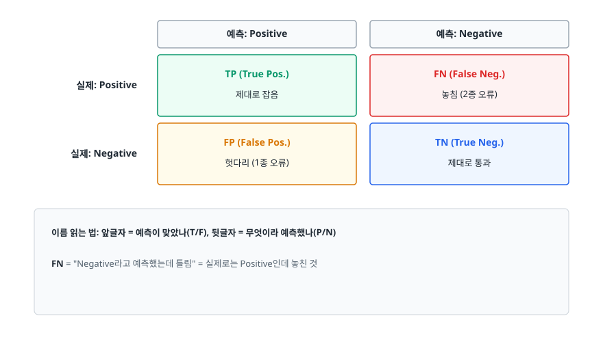
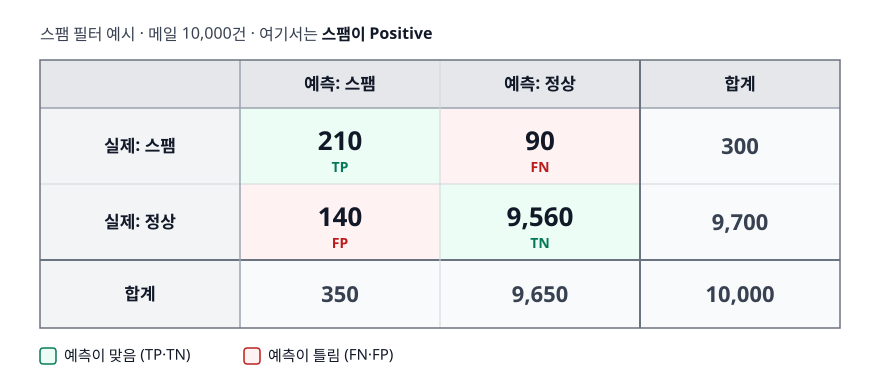
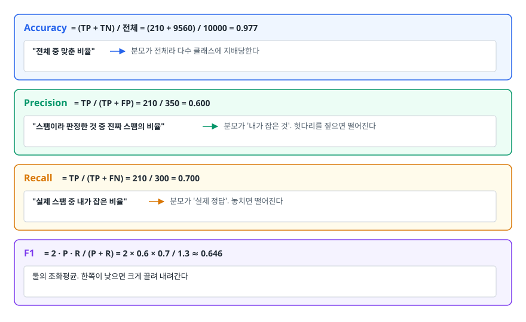
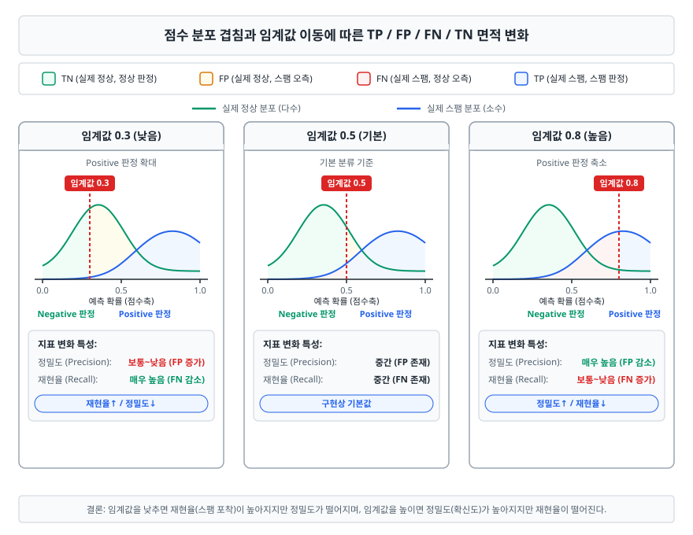
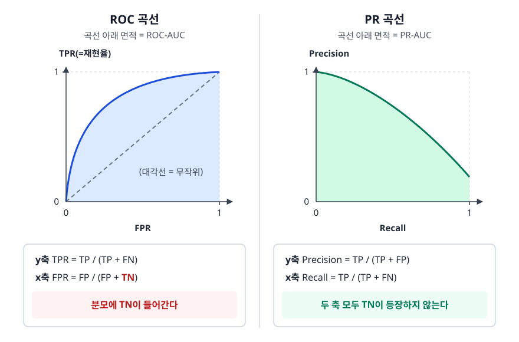
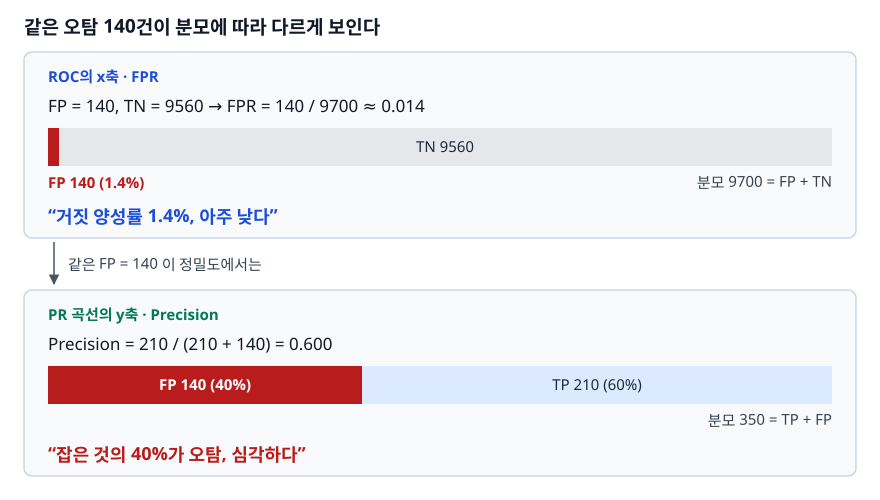
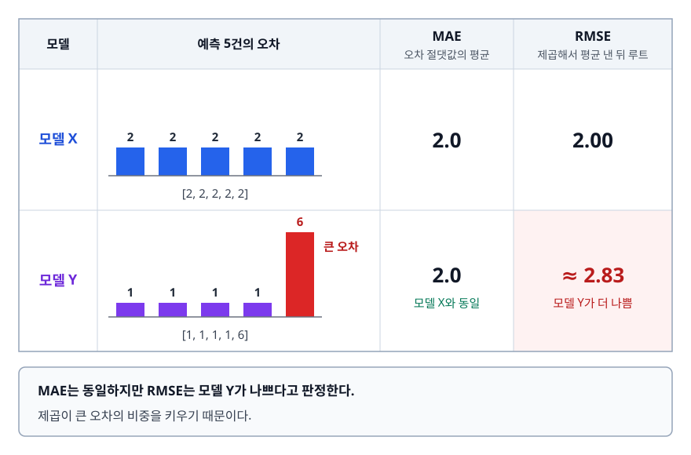
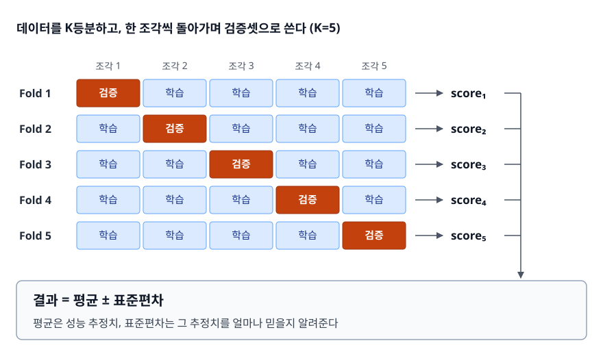
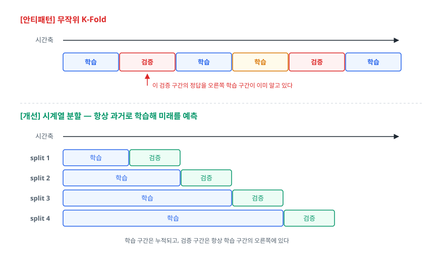

# 평가 지표와 교차 검증 (Evaluation Metrics & Cross Validation)

> 정확도 하나만 믿고 모델을 판단하면 왜 위험한지 설명할 수 있게 됩니다. 혼동 행렬에서 어떤 지표를 뽑아 어느 도메인에 써야 하는지, 그 지표를 믿을 수 있게 재려면 데이터를 어떻게 나눠야 하는지까지 이어서 다룹니다.

## 학습 목표

- [ ] 불균형 데이터에서 정확도가 무너지는 과정을 숫자로 보여줄 수 있다
- [ ] 혼동 행렬에서 정밀도·재현율·F1을 직접 유도할 수 있다
- [ ] 임계값을 움직이면 두 지표가 왜 반대로 움직이는지 설명할 수 있다
- [ ] ROC-AUC와 PR-AUC 중 무엇을 볼지 데이터 상황에 따라 고를 수 있다
- [ ] K-Fold, Stratified, 시계열 분할을 상황에 맞게 선택할 수 있다

## 선행 지식

- [01-overfitting-regularization.md](./01-overfitting-regularization.md) - 학습셋/검증셋을 왜 나누는지

---

## 1. 왜 필요한가

### 정확도 97%짜리 모델이 아무 일도 안 할 수 있다

스팸 필터를 만들었다고 해 보겠습니다. 메일 10,000건 중 스팸이 300건(3%)입니다. 두 모델의 정확도를 비교해 보겠습니다.

```
모델 A: 학습된 분류기         → 정확도 97.7%
모델 B: 무조건 "정상"이라 답함 → 정확도 97.0%
```

모델 B는 코드가 `return "정상"` 한 줄이고 스팸을 단 한 건도 잡지 못합니다. 그런데 정확도는 모델 A와 0.7%포인트밖에 차이가 나지 않습니다. **정확도라는 지표가 "아무것도 하지 않음"과 "일을 함"을 거의 구분하지 못하는 상황**이 벌어졌습니다.

원인은 단순합니다. 정확도는 분모가 전체 데이터라서, 다수 클래스가 압도적으로 많으면 소수 클래스에서 무슨 일이 일어나든 숫자가 거의 움직이지 않습니다. 현실에서 중요한 문제들 — 사기 거래, 장비 고장, 희귀 질환, 이탈 고객 — 은 하나같이 소수 클래스를 찾는 문제입니다.

### 비유: 공항 보안 검색대

검색 기준을 아주 느슨하게 잡으면 승객 대부분이 통과하고 검색 요원은 한가합니다. 통과시킨 사람 대부분이 실제로 안전하니 "판단이 정확했다"고 말할 수도 있습니다. 그런데 정작 위험물은 그대로 통과합니다. 반대로 기준을 극단적으로 조이면 위험물은 다 잡지만 멀쩡한 승객이 줄줄이 붙잡혀 공항이 마비됩니다.

> **비유의 한계**: 검색 요원은 사례마다 기준을 유연하게 바꿉니다. 하지만 모델은 하나의 고정된 임계값을 모든 입력에 똑같이 적용합니다. 그래서 "어디에 기준선을 그을 것인가"가 사람이 명시적으로 내려야 하는 결정이 됩니다.

---

## 2. 혼동 행렬 — 모든 분류 지표의 출발점

예측과 실제를 교차한 2×2 표에서 모든 지표가 유도됩니다.

<!-- diagram:ai-evaluation-metrics-1 -->


<!-- 위 그림이 대체한 원본 ASCII.
     내용을 고칠 때는 그림도 함께 갱신할 것.
```
                     예측: Positive        예측: Negative
                 ┌────────────────────┬────────────────────┐
   실제: Positive │  TP (True Pos.)    │  FN (False Neg.)   │
                 │  제대로 잡음        │  놓침 (2종 오류)    │
                 ├────────────────────┼────────────────────┤
   실제: Negative │  FP (False Pos.)   │  TN (True Neg.)    │
                 │  헛다리 (1종 오류)  │  제대로 통과        │
                 └────────────────────┴────────────────────┘

   이름 읽는 법: 앞글자 = 예측이 맞았나(T/F), 뒷글자 = 무엇이라 예측했나(P/N)
   FN = "Negative라고 예측했는데 틀림" = 실제로는 Positive인데 놓친 것
```
-->

앞의 스팸 필터 예시를 이 표에 채워 넣으면 이렇습니다. 여기서는 스팸이 Positive입니다.

<!-- diagram:ai-evaluation-metrics-8 -->


<!-- 위 그림이 대체한 원본 ASCII.
     내용을 고칠 때는 그림도 함께 갱신할 것.
```
                예측: 스팸    예측: 정상      합계
   실제: 스팸       210          90           300
   실제: 정상       140        9,560        9,700
   합계             350        9,650       10,000
```
-->

### 세 지표 유도하기

<!-- diagram:ai-evaluation-metrics-2 -->


<!-- 위 그림이 대체한 원본 ASCII.
     내용을 고칠 때는 그림도 함께 갱신할 것.
```
Accuracy  = (TP + TN) / 전체 = (210 + 9560) / 10000 = 0.977
            "전체 중 맞춘 비율"  → 분모가 전체라 다수 클래스에 지배당한다

Precision = TP / (TP + FP)   = 210 / 350 = 0.600
            "스팸이라 판정한 것 중 진짜 스팸의 비율"
            → 분모가 '내가 잡은 것'. 헛다리를 짚으면 떨어진다

Recall    = TP / (TP + FN)   = 210 / 300 = 0.700
            "실제 스팸 중 내가 잡은 비율"
            → 분모가 '실제 정답'. 놓치면 떨어진다

F1        = 2 · P · R / (P + R) = 2 × 0.6 × 0.7 / 1.3 ≈ 0.646
            둘의 조화평균. 한쪽이 낮으면 크게 끌려 내려간다
```
-->

정확도 97.7%라는 숫자와 F1 0.646이라는 숫자가 같은 모델을 가리킵니다. 정밀도 60%는 스팸함에 들어간 메일 10개 중 4개가 정상 메일이라는 뜻이고, 재현율 70%는 스팸 10개 중 3개가 받은편지함에 남는다는 뜻입니다. 이제야 모델의 실제 상태가 보입니다.

### F1이 왜 산술평균이 아니라 조화평균인가

정밀도 1.0, 재현율 0.02인 모델을 생각해 보겠습니다. 확신이 아주 높은 한 건만 스팸이라 판정하는 극단적으로 소심한 모델입니다.

```
산술평균 = (1.0 + 0.02) / 2 = 0.51   → 절반은 하는 것처럼 보인다
조화평균 = 2 × 1.0 × 0.02 / 1.02 ≈ 0.039  → 쓸모없다는 사실이 그대로 드러난다
```

조화평균은 작은 쪽에 강하게 끌립니다. **한쪽만 좋은 모델을 걸러내는 것**이 F1의 존재 이유입니다.

한쪽을 더 중시하고 싶으면 F-beta를 씁니다. `beta > 1`이면 재현율에, `beta < 1`이면 정밀도에 무게가 실립니다.

```python
from sklearn.metrics import fbeta_score

fbeta_score(y_true, y_pred, beta=2)    # 재현율을 정밀도보다 중시 (놓치면 안 되는 문제)
fbeta_score(y_true, y_pred, beta=0.5)  # 정밀도를 중시 (헛다리가 비싼 문제)
```

---

## 3. 임계값 — 정밀도와 재현율이 반대로 움직이는 이유

분류 모델은 사실 "스팸이다/아니다"를 직접 내놓지 않습니다. **0~1 사이의 점수**를 내고, 그 점수가 임계값을 넘으면 Positive로 판정합니다. `predict()`가 하는 일은 그 임계값을 0.5로 고정해 적용하는 것뿐입니다.

<!-- diagram:ai-evaluation-metrics -->


<!-- 위 그림이 대체한 원본 ASCII.
     내용을 고칠 때는 그림도 함께 갱신할 것.
```
점수축 (모델이 매긴 스팸 확률)

 0.0                          0.5                          1.0
  ├────────────────────────────┼────────────────────────────┤
  ○○○●○○○○●○○○○○●○○○●○○○ │ ○●○●●○●●○●●●●●●●●●●●●
       실제 정상(○)이 몰린 쪽   │   실제 스팸(●)이 몰린 쪽
                              임계값

  임계값을 왼쪽(↓0.3)으로 옮기면
    → Positive 판정이 늘어난다 → 놓치는 스팸 감소(재현율↑)
    → 동시에 정상 메일도 더 걸린다(정밀도↓)

  임계값을 오른쪽(↑0.8)으로 옮기면
    → 확신 있는 것만 잡는다 → 헛다리 감소(정밀도↑)
    → 애매한 스팸을 놓친다(재현율↓)
```
-->

두 지표가 반대로 움직이는 것은 알고리즘의 결함이 아닙니다. **하나의 점수 분포를 한 지점에서 자르는 행위의 필연적 결과**입니다. 두 분포가 완전히 분리되지 않는 한 어느 지점을 잘라도 손실이 생깁니다.

### 안티패턴: 기본 임계값 0.5를 그대로 쓴다

```python
# 안티패턴
y_pred = model.predict(X_val)          # 내부적으로 임계값 0.5 고정
print(f1_score(y_val, y_pred))         # "F1이 낮네, 모델을 바꿔야겠다"
```

**왜 문제인가**: 0.5는 통계적 근거가 있는 값이 아닙니다. 구현상의 기본값일 뿐입니다. 양성 비율이 3%인 데이터에서 학습한 모델의 점수 분포는 애초에 낮은 쪽에 몰려 있어, 0.5를 넘는 샘플이 거의 없을 수 있습니다. 모델은 멀쩡한데 임계값 때문에 지표가 나쁘게 나온 상황을 모델 문제로 오진하게 됩니다.

```python
# 개선 - 검증셋에서 임계값을 목표에 맞게 고른다
import numpy as np
from sklearn.metrics import precision_recall_curve

proba = model.predict_proba(X_val)[:, 1]
precision, recall, thresholds = precision_recall_curve(y_val, proba)

# 주의: thresholds 길이는 precision/recall보다 1 짧다 (마지막 지점은 임계값 없음)
f1 = 2 * precision[:-1] * recall[:-1] / (precision[:-1] + recall[:-1] + 1e-12)
best_threshold = thresholds[np.argmax(f1)]

y_pred = (model.predict_proba(X_test)[:, 1] >= best_threshold).astype(int)
```

**핵심**: 임계값 탐색은 **검증셋**에서 하고, 고른 임계값을 테스트셋에 적용합니다. 테스트셋에서 최적 임계값을 찾으면 그건 튜닝이지 평가가 아닙니다.

### 도메인별로 무엇을 우선할 것인가

정밀도와 재현율 중 무엇을 택할지는 통계가 아니라 **오류의 비용**이 결정합니다. 표를 읽기 전에 각 행에서 무엇을 Positive로 잡았는지부터 확인해야 합니다. Positive를 뒤집으면 정밀도와 재현율의 역할도 그대로 뒤집히기 때문에, 지표 이름만 외우면 반대로 적용하게 됩니다.

| 도메인 | FP(헛다리)의 비용 | FN(놓침)의 비용 | 우선 지표 | 임계값 방향 |
|--------|-----------------|----------------|----------|-----------|
| 스팸 필터 | 중요 메일이 스팸함으로 사라짐 — 사용자가 알아채기도 어렵다 | 스팸 몇 개가 받은편지함에 남음 — 지우면 그만 | Precision | 높게 |
| 암 선별 검사 | 정밀 검사를 한 번 더 받음 — 비용과 불안 | 환자를 놓쳐 치료 시기를 놓침 | Recall | 낮게 |
| 신용카드 이상거래 차단 | 정상 결제가 막혀 고객이 이탈 | 사기 금액 손실 | 금액 기반 비용 최적화 | 사안별 |
| 채용 서류 1차 선별 (Positive = 면접 후보) | 부적합자가 면접까지 올라옴 — 면접관 시간 소모 | 좋은 지원자를 서류에서 잃음 | Recall (사람이 뒤에 있으므로) | 낮게 |
| 검색 결과 첫 페이지 | 무관한 결과로 신뢰 하락 | 좋은 문서가 2페이지로 밀림 | Precision@k | 높게 |

> 한 줄 결론: **"틀렸을 때 누가 더 크게 손해를 보는가"를 먼저 정하고 지표를 고릅니다.** 뒤에 사람 검토 단계가 있으면 재현율을 올려 후보를 넉넉히 넘기고, 모델 판단이 최종 결정이면 정밀도를 지킵니다. 이 논리를 설명하지 못한 채 "F1을 봤습니다"라고만 답하면 면접에서 감점 요인이 됩니다.

---

## 4. ROC-AUC와 PR-AUC

임계값 하나를 고르는 대신, 임계값을 전 구간에 걸쳐 움직이며 곡선을 그립니다. 그 곡선의 아래 면적으로 모델의 **점수 매기는 능력 자체**를 평가하는 방법도 있습니다.

<!-- diagram:ai-evaluation-metrics-3 -->


<!-- 위 그림이 대체한 원본 ASCII.
     내용을 고칠 때는 그림도 함께 갱신할 것.
```
   ROC 곡선                          PR 곡선
   TPR(=재현율)                      Precision
    1 │      ┌──────                  1 │╲
      │    ╱                            │ ╲___
      │  ╱                              │     ╲___
      │╱   (대각선 = 무작위)             │         ╲___
    0 └──────────── FPR              0 └──────────────── Recall
      0            1                    0                1

   x축: FPR = FP / (FP + TN)         x축: Recall = TP / (TP + FN)
        분모에 TN이 들어간다               두 축 모두 TN이 등장하지 않는다
```
-->

결정적인 차이는 **ROC의 x축(FPR) 분모에는 TN이 들어가고, PR 곡선에는 TN이 어디에도 등장하지 않는다**는 데 있습니다. 불균형 데이터는 TN이 압도적으로 많습니다. 그래서 이 차이가 곧바로 지표의 민감도 차이로 이어집니다.

앞의 스팸 예시로 확인해 보겠습니다.

<!-- diagram:ai-evaluation-metrics-4 -->


<!-- 위 그림이 대체한 원본 ASCII.
     내용을 고칠 때는 그림도 함께 갱신할 것.
```
FP = 140, TN = 9560 → FPR = 140 / 9700 ≈ 0.014
                       "거짓 양성률 1.4%, 아주 낮다"

같은 FP = 140 이 정밀도에서는
Precision = 210 / (210 + 140) = 0.600
                       "잡은 것의 40%가 오탐, 심각하다"
```
-->

**같은 140건의 오탐**이 FPR에서는 1.4%로 보이고 정밀도에서는 40% 오탐으로 보입니다. TN 9,560이라는 거대한 분모가 오탐을 희석시킵니다. 그래서 극단적 불균형에서 ROC-AUC는 실제보다 낙관적인 그림을 그립니다.

| 기준 | ROC-AUC | PR-AUC (Average Precision) |
|------|---------|---------------------------|
| 축 구성 | TPR vs FPR | Precision vs Recall |
| TN 포함 여부 | 포함 (FPR 분모) | 미포함 |
| 무작위 모델의 기준값 | 항상 0.5 | 양성 비율 (3% 데이터면 0.03) |
| 클래스 비율 변화 | 거의 영향 없음 | 비율이 바뀌면 값도 바뀐다 |
| 강점 | 클래스 비율이 달라져도 비교 가능 | 소수 클래스 성능 변화에 민감 |
| 약점 | 극단적 불균형에서 낙관적 | 데이터셋 간 절대 비교가 어렵다 |

> 언제 뭘 쓰나: **양성이 희귀하고 그 양성을 찾는 것이 목적이면 PR-AUC**를 씁니다. 두 클래스가 대등하거나 서로 다른 비율의 데이터셋 간 비교가 필요하면 ROC-AUC입니다. 실무에서는 둘 다 보고하되 의사결정은 PR 계열로 하는 경우가 많습니다. PR-AUC를 볼 때는 반드시 **양성 비율(기준선)을 함께 적습니다.** 0.4라는 값은 기준선이 0.03이면 훌륭하고 0.5면 무작위보다 나쁩니다.

```python
from sklearn.metrics import roc_auc_score, average_precision_score, classification_report

proba = model.predict_proba(X_test)[:, 1]
print("ROC-AUC:", roc_auc_score(y_test, proba))
print("PR-AUC :", average_precision_score(y_test, proba))
print("기준선  :", y_test.mean())          # PR-AUC는 이 값과 비교해야 의미가 있다
print(classification_report(y_test, y_pred, digits=3))
```

### 다중 분류에서의 평균 방식

`classification_report`의 마지막 세 줄이 헷갈리기 쉽습니다.

| 평균 방식 | 계산 | 성질 |
|----------|------|------|
| micro | 모든 클래스의 TP/FP/FN을 합산해 한 번 계산 | 샘플이 많은 클래스가 지배. 단일 레이블 분류에서는 정확도와 같아진다 |
| macro | 클래스별 지표를 구한 뒤 단순 평균 | 소수 클래스에도 동등한 가중치. 불균형에서 이 값을 본다 |
| weighted | 클래스별 지표를 샘플 수로 가중 평균 | 다수 클래스 쪽으로 다시 기운다 |

소수 클래스 성능이 중요하면 macro를 봅니다. weighted는 이름과 달리 불균형 문제를 해결해주지 않습니다.

---

## 5. 회귀 지표

분류와 달리 회귀는 "얼마나 벗어났는가"를 잽니다. 지표 선택의 핵심은 **큰 오차를 얼마나 무겁게 다룰 것인가**입니다.

```
MAE  = (1/n) Σ |yᵢ - ŷᵢ|          오차 절댓값의 평균. 단위가 원래 값과 같다
RMSE = √( (1/n) Σ (yᵢ - ŷᵢ)² )   제곱해서 평균 낸 뒤 루트. 단위는 같지만 큰 오차에 민감
R²   = 1 - SS_res / SS_tot        평균으로 예측하는 모델 대비 얼마나 나은지의 비율
```

두 지표의 차이를 숫자로 보겠습니다. 예측 5건의 오차가 각각 다음과 같다고 해 보겠습니다.

<!-- diagram:ai-evaluation-metrics-5 -->


<!-- 위 그림이 대체한 원본 ASCII.
     내용을 고칠 때는 그림도 함께 갱신할 것.
```
모델 X 오차: [2, 2, 2, 2, 2]   →  MAE = 2.0,  RMSE = 2.00
모델 Y 오차: [1, 1, 1, 1, 6]   →  MAE = 2.0,  RMSE ≈ 2.83

MAE는 동일하지만 RMSE는 모델 Y가 나쁘다고 판정한다.
제곱이 큰 오차의 비중을 키우기 때문이다.
```
-->

어느 쪽이 맞는 평가일까요? 배달 도착 시간 예측이라면, 대부분 1분 오차인데 가끔 6분 틀리는 모델(Y)이 항상 2분 틀리는 모델(X)보다 나을 수도 있고 나쁠 수도 있습니다. **큰 실수 한 번이 작은 실수 여러 번보다 치명적인 도메인이면 RMSE, 오차 크기에 비례해 손해가 커지는 도메인이면 MAE**를 봅니다.

R²는 편리하지만 오해가 많습니다.

- **음수가 될 수 있습니다.** 절편이 있는 최소제곱 선형회귀를 학습한 그 데이터에서 재면 0~1을 벗어나지 않지만, 그건 특수한 경우입니다. 테스트셋이거나 다른 종류의 모델이면 "평균으로 예측하는 것보다 못하다"는 뜻으로 음수가 나올 수 있습니다. 버그가 아닙니다.
- **서로 다른 데이터셋의 R²를 비교하면 안 됩니다.** 분모 SS_tot이 그 데이터셋의 분산이라, 원래 변동이 큰 데이터에서는 R²가 쉽게 높게 나옵니다. 같은 데이터셋 안에서 모델을 비교할 때만 의미가 있습니다.
- **특성을 추가하면 학습 R²는 결코 줄어들지 않습니다.** 쓸모없는 특성을 넣어도 오르므로, 특성 수를 벌하는 조정된 R²(adjusted R²)를 함께 봅니다.

```python
import numpy as np
from sklearn.metrics import mean_absolute_error, mean_squared_error, r2_score

mae = mean_absolute_error(y_test, pred)
rmse = np.sqrt(mean_squared_error(y_test, pred))   # 버전 차이 없이 항상 동작하는 방식
r2 = r2_score(y_test, pred)
```

---

## 6. 교차 검증 — 지표를 신뢰할 수 있게 만드는 절차

단일 학습/검증 분할의 문제는 **점수가 분할 운에 좌우된다**는 데 있습니다. 어쩌다 쉬운 샘플이 검증셋에 몰리면 점수가 부풀고, 다음에 다시 나누면 값이 크게 달라집니다. 교차 검증은 분할을 여러 번 바꿔 가며 평균과 표준편차를 구해서 이 불안정성을 줄입니다.

### K-Fold

<!-- diagram:ai-evaluation-metrics-6 -->


<!-- 위 그림이 대체한 원본 ASCII.
     내용을 고칠 때는 그림도 함께 갱신할 것.
```
데이터를 K등분하고, 한 조각씩 돌아가며 검증셋으로 쓴다 (K=5)

  Fold 1  [ 검증 ][ 학습 ][ 학습 ][ 학습 ][ 학습 ]  → score₁
  Fold 2  [ 학습 ][ 검증 ][ 학습 ][ 학습 ][ 학습 ]  → score₂
  Fold 3  [ 학습 ][ 학습 ][ 검증 ][ 학습 ][ 학습 ]  → score₃
  Fold 4  [ 학습 ][ 학습 ][ 학습 ][ 검증 ][ 학습 ]  → score₄
  Fold 5  [ 학습 ][ 학습 ][ 학습 ][ 학습 ][ 검증 ]  → score₅

  결과 = 평균 ± 표준편차
         평균은 성능 추정치, 표준편차는 그 추정치를 얼마나 믿을지 알려준다
```
-->

표준편차를 함께 보는 습관이 중요합니다. `0.82 ± 0.01`과 `0.82 ± 0.09`는 완전히 다른 상황입니다. 후자는 분할에 따라 성능이 크게 흔들린다는 뜻이므로, 평균값 하나로 모델을 비교하면 안 됩니다.

### Stratified K-Fold — 분류에서는 사실상 기본값

무작위로 K등분하면 폴드마다 클래스 비율이 달라집니다. 양성이 3%인 데이터를 5등분하면 어떤 폴드에는 양성이 거의 없을 수 있고, 그 폴드의 점수는 의미를 잃습니다. Stratified 분할은 **각 폴드의 클래스 비율을 전체와 같게 유지**합니다.

```python
from sklearn.model_selection import StratifiedKFold, cross_val_score

cv = StratifiedKFold(n_splits=5, shuffle=True, random_state=42)
scores = cross_val_score(pipe, X, y, cv=cv, scoring="average_precision")
print(f"{scores.mean():.3f} ± {scores.std():.3f}")
```

`shuffle=True`를 붙이는 이유를 정확히 알아둘 필요가 있습니다. Stratified 분할은 순서와 무관하게 클래스 비율을 맞춰주므로, 파일이 클래스별로 정렬돼 있어도 비율 자체는 깨지지 않습니다. 문제는 **클래스 안의 순서**입니다. 셔플하지 않으면 각 클래스의 샘플이 원래 순서대로 폴드에 배정되어, 수집 시기나 수집 장비처럼 순서에 묻어 있는 잠재 구조가 특정 폴드에 몰릴 수 있습니다.

반면 평범한 `KFold`는 클래스 비율조차 보장하지 않으므로, 클래스별로 정렬된 데이터에 셔플 없이 쓰면 한 폴드가 통째로 한 클래스가 되는 사태가 실제로 벌어집니다. `random_state`는 재현성을 위해 고정하는데, sklearn에서는 `shuffle=False`인 채로 `random_state`를 주면 효과가 없다는 이유로 오류가 납니다. 둘은 항상 짝으로 씁니다.

### 시계열 분할 — 무작위 분할이 곧 누수인 경우

시간 순서가 있는 데이터에 K-Fold를 쓰면 **미래 데이터로 학습해 과거를 예측하는** 상황이 만들어집니다. 실전에서는 불가능한 조건이므로 검증 점수가 부풀려집니다.

<!-- diagram:ai-evaluation-metrics-7 -->


<!-- 위 그림이 대체한 원본 ASCII.
     내용을 고칠 때는 그림도 함께 갱신할 것.
```
[안티패턴] 무작위 K-Fold
  시간축  ─────────────────────────────────────────>
          [학습][검증][학습][학습][검증][학습]
                  ↑ 이 검증 구간의 정답을 오른쪽 학습 구간이 이미 알고 있다

[개선] 시계열 분할 — 항상 과거로 학습해 미래를 예측
  시간축  ─────────────────────────────────────────>
  split 1 [ 학습 ][검증]
  split 2 [ 학습        ][검증]
  split 3 [ 학습               ][검증]
  split 4 [ 학습                      ][검증]
          학습 구간은 누적되고, 검증 구간은 항상 학습 구간의 오른쪽에 있다
```
-->

```python
from sklearn.model_selection import TimeSeriesSplit

cv = TimeSeriesSplit(n_splits=5)
scores = cross_val_score(pipe, X, y, cv=cv, scoring="neg_mean_absolute_error")
```

실무에서는 여기에 한 가지를 더 고려합니다. 예측 시점과 정답이 확정되는 시점 사이에 시차가 있다면(예: 30일 후 이탈 여부), 학습 구간과 검증 구간 사이에 그만큼의 **공백(gap)** 을 두어야 합니다. 그렇지 않으면 경계 부근에서 미래 정보가 새어 듭니다.

### 그룹 분할

같은 환자, 같은 사용자, 같은 문서에서 파생된 여러 샘플은 반드시 한 폴드 안에 함께 있어야 합니다. 양쪽에 흩어지면 모델이 개체를 외워서 맞히게 됩니다.

```python
from sklearn.model_selection import GroupKFold

cv = GroupKFold(n_splits=5)
scores = cross_val_score(pipe, X, y, groups=patient_ids, cv=cv)
```

### 분할 방식 선택표

| 데이터 특성 | 분할 방식 | 이유 |
|-----------|----------|------|
| 일반 분류, 클래스 균형 | KFold(shuffle=True) | 기본 |
| 분류, 클래스 불균형 | StratifiedKFold | 폴드마다 양성이 없는 사태를 막는다 |
| 시간 순서가 있음 | TimeSeriesSplit | 무작위 분할 자체가 미래 정보 누수 |
| 한 개체에서 여러 샘플 | GroupKFold | 개체를 외워 맞히는 것을 막는다 |
| 데이터가 매우 적음 | 반복 K-Fold, 또는 LeaveOneOut | LOO는 **학습**에 쓸 샘플을 최대로 남기고, 반복 K-Fold는 분할 운의 영향을 평균으로 지운다 |
| 데이터가 매우 많음 | 단일 홀드아웃 | 교차 검증 비용 대비 이득이 작다 |

> 판단 순서: **시간 순서 → 그룹 구조 → 클래스 불균형** 순으로 확인하고, 해당하는 제약이 있으면 그에 맞는 분할기를 씁니다. 아무 제약도 없을 때만 평범한 K-Fold입니다.

데이터가 적을 때 K를 키우는 이유는 검증 샘플을 늘리려는 게 아니라 그 반대입니다. K=5면 매 폴드가 데이터의 80%로만 학습하지만 K=n(LeaveOneOut)이면 한 건만 빼고 전부 학습에 씁니다. 덕분에 학습량 부족으로 성능이 과소평가되는 일이 줄어듭니다. 대신 n번 학습해야 해서 비싸고, 폴드별 점수가 0 아니면 1이라 표준편차를 신뢰 지표로 읽기 어렵습니다. 그래서 실무에서는 **분할 시드를 바꿔가며 K-Fold를 여러 번 반복하는 쪽**을 더 자주 씁니다.

---

## 7. 실무에서는

- **지표는 반드시 두 개 이상 함께 봅니다.** 하나만 보고 최적화하면 그 지표만 오르고 실제 서비스 품질은 떨어지는 일이 반복됩니다. 분류라면 정밀도·재현율·PR-AUC를, 회귀라면 MAE와 RMSE를 같이 놓고 봅니다.
- **오프라인 지표와 온라인 지표는 다릅니다.** 오프라인에서 F1이 올라도 실제 클릭률이나 매출은 그대로일 수 있습니다. 최종 검증은 A/B 테스트로 하고, 오프라인 지표는 후보를 좁히는 용도로 씁니다.
- **임계값은 모델과 함께 버전 관리합니다.** 임계값을 코드에 하드코딩한 채 모델만 교체하면 점수 분포가 달라져 성능이 조용히 무너집니다. 모델 아티팩트와 임계값을 한 묶음으로 배포합니다.
- **혼동 행렬 원본을 꼭 남깁니다.** 요약 지표만 로깅하면 나중에 "정밀도가 왜 떨어졌는지"를 되짚을 수 없습니다. TP/FP/FN/TN 네 숫자를 기록해두면 사후 분석이 훨씬 쉽습니다.

---

## 8. 면접 포인트

> 면접에서 이 주제가 나오면 이렇게 답한다

**Q. 정확도만으로 모델을 평가하면 안 되는 이유는?**

A. 정확도는 분모가 전체 데이터라 다수 클래스에 지배당하기 때문입니다. 양성이 3%인 데이터에서 전부 음성이라고 답하는 모델도 정확도 97%가 나오는데, 이 모델은 양성을 하나도 잡지 못합니다. 정작 우리가 풀고 싶은 문제 — 사기 탐지, 이상 감지, 희귀 질환 — 는 대부분 소수 클래스를 찾는 문제라 정확도가 가장 쓸모없는 상황에서 가장 높게 나옵니다. 그래서 혼동 행렬을 놓고 정밀도, 재현율, PR-AUC를 함께 봅니다.
- 꼬리 질문: "그럼 정확도는 언제 쓰나요?" → 클래스가 대체로 균형 잡혀 있고 두 종류의 오류 비용이 비슷할 때는 여전히 직관적이고 유효한 지표입니다.

**Q. 정밀도와 재현율 중 무엇이 더 중요한가요?**

A. 도메인의 오류 비용이 결정합니다. 스팸 필터는 정상 메일이 스팸함으로 사라지는 손해가 크므로 정밀도를 우선하고, 암 선별 검사는 환자를 놓치는 비용이 압도적이므로 재현율을 우선합니다. 판단 기준은 "FP와 FN 중 어느 쪽이 더 비싼가"이고, 실무에서는 모델 뒤에 사람 검토 단계가 있는지도 함께 봅니다. 사람이 뒤에서 걸러준다면 재현율을 올려 후보를 넉넉히 넘기는 편이 낫습니다.
- 꼬리 질문: "둘 다 올릴 수는 없나요?" → 임계값 조정만으로는 불가능합니다. 트레이드오프 곡선 자체를 위로 밀어 올리려면 더 나은 특성, 더 많은 데이터, 더 좋은 모델이 필요합니다.

**Q. ROC-AUC와 PR-AUC 중 언제 무엇을 쓰나요?**

A. 극단적 불균형에서는 PR-AUC입니다. ROC의 x축인 FPR은 분모에 TN이 들어가는데, 음성이 압도적으로 많으면 오탐이 수백 건 늘어도 FPR은 거의 움직이지 않아 모델이 실제보다 좋아 보입니다. PR 곡선에는 TN이 등장하지 않아 소수 클래스 성능 변화가 그대로 드러납니다. 다만 PR-AUC는 양성 비율에 따라 기준선이 달라지므로, 값을 보고할 때 양성 비율을 함께 적어야 해석이 가능합니다.
- 꼬리 질문: "ROC-AUC의 장점은 없나요?" → 무작위 기준선이 항상 0.5로 고정되고 클래스 비율 변화에 둔감해서, 비율이 다른 데이터셋 간 비교나 시간이 지나며 비율이 변하는 상황의 추적에 유리합니다.

**Q. 시계열 데이터에 K-Fold를 쓰면 무엇이 문제인가요?**

A. 미래 데이터로 학습해 과거를 예측하게 되므로, 실전에서는 절대 얻을 수 없는 정보를 쓴 셈이 됩니다. 검증 점수는 부풀려지고 배포 후 성능은 훨씬 나쁩니다. 학습 구간이 항상 검증 구간보다 과거에 있도록 시간 순 분할을 써야 하고, 정답이 확정되기까지 시차가 있다면 학습과 검증 사이에 그만큼 공백을 둬야 합니다.
- 꼬리 질문: "시계열 분할은 폴드마다 학습 데이터 양이 다른데 괜찮나요?" → 초반 폴드는 학습 데이터가 적어 점수가 낮게 나오는 게 정상입니다. 평균만 보지 말고 폴드별 추이를 함께 보고, 필요하면 학습 구간 길이를 고정하는 방식을 씁니다.

---

## 자주 하는 실수

| 실수 | 왜 틀렸나 | 올바른 이해 |
|------|----------|-----------|
| "정확도 95%면 좋은 모델이다" | 클래스 비율을 모르면 해석 불가능한 숫자다 | 양성 비율과 함께 봐야 합니다. 비율이 95%면 아무것도 안 한 것과 같습니다 |
| "F1이 높으니 실무에 바로 쓸 수 있다" | F1은 정밀도와 재현율을 동등하게 취급하는데, 실제 비용은 대개 비대칭이다 | 오류 비용이 다르면 F-beta나 비용 기반 지표를 쓴다 |
| "`predict()` 결과로 지표를 보면 된다" | 임계값 0.5가 고정 적용됩니다. 근거 없는 기본값입니다 | `predict_proba`로 점수를 받아 검증셋에서 임계값을 고른다 |
| "PR-AUC 0.4는 낮은 값이다" | 기준선이 양성 비율이라 절대 해석이 불가능하다 | 양성 비율이 3%면 0.4는 매우 좋은 값입니다. 항상 기준선과 함께 봅니다 |
| "테스트셋에서 최적 임계값을 찾았다" | 테스트셋으로 튜닝한 것이므로 더는 평가용이 아니다 | 임계값 탐색은 검증셋에서, 적용과 보고는 테스트셋에서 |
| "R²가 음수로 나왔으니 코드가 틀렸다" | 테스트셋에서는 평균 예측보다 나쁘면 음수가 정상이다 | 값 자체가 아니라 "평균 대비 나은가"를 나타내는 지표다 |
| "교차 검증 평균 점수만 비교하면 된다" | 표준편차가 크면 그 평균은 신뢰 구간이 넓다는 뜻이다 | 평균 ± 표준편차를 함께 보고, 차이가 편차 안이면 동률로 취급한다 |
| "weighted average를 보면 불균형이 보정된다" | 샘플 수로 가중하므로 다수 클래스 쪽으로 다시 기운다 | 소수 클래스를 동등하게 보려면 macro average를 본다 |

---

## 한 줄 정리

평가 지표를 고르는 일은 통계 문제가 아니라 **어떤 종류의 오류를 감수할 것인가**를 정하는 의사결정입니다. 그 지표를 믿으려면 데이터의 시간·그룹·클래스 구조를 반영한 분할이 먼저 갖춰져야 합니다.

---

## 연관 개념

- [01-overfitting-regularization.md](./01-overfitting-regularization.md) - 검증 오차로 과적합을 진단하는 방법과 데이터 누수
- [03-transfer-learning-xai.md](./03-transfer-learning-xai.md) - 지표가 나빠졌을 때 모델이 무엇을 보고 있었는지 파헤치는 법
- [qna-ml-fundamentals.md](./qna-ml-fundamentals.md) - 평가 지표·교차 검증 면접 질문 (Q4, Q5)
- [../rag-pipeline/01-rag-pipeline.md](../rag-pipeline/01-rag-pipeline.md) - 검색 단계 평가에서 정밀도·재현율이 그대로 쓰이는 사례
