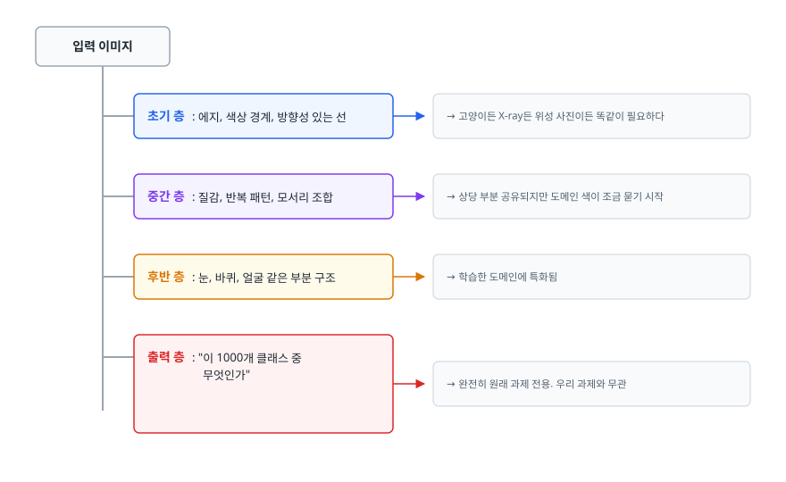
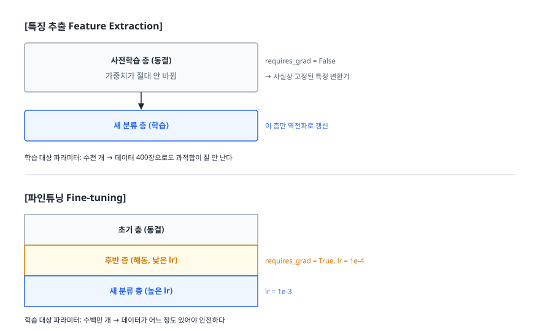
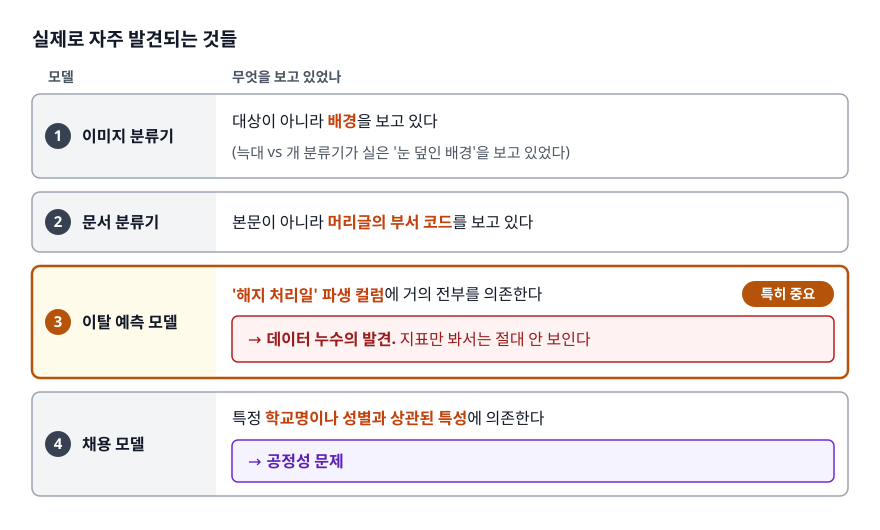
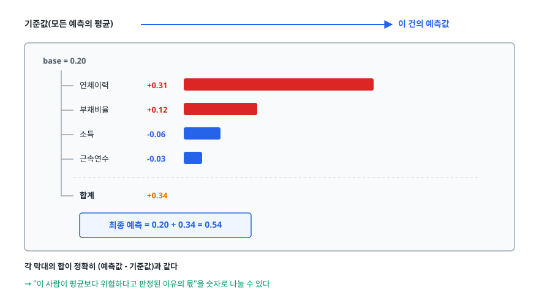
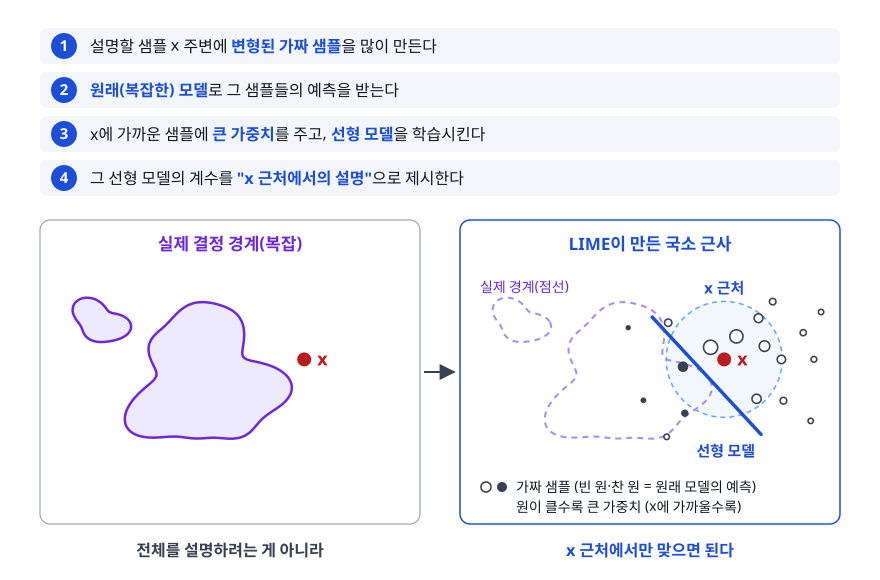
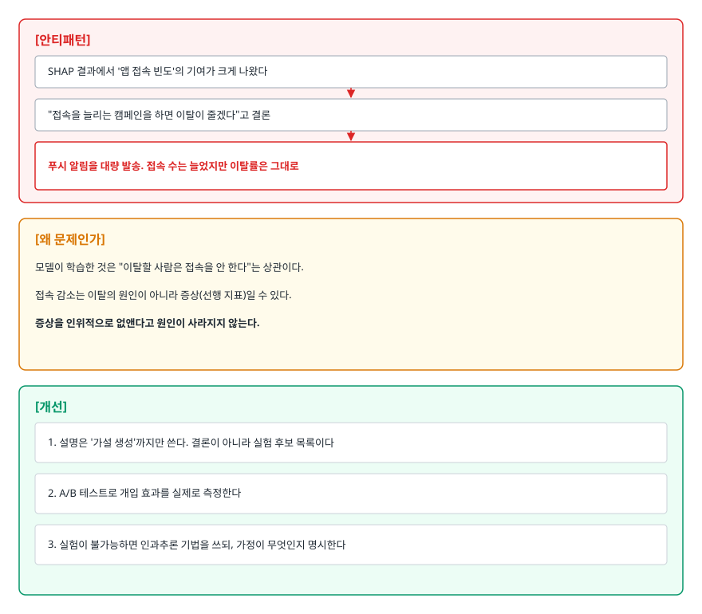

# 전이학습과 설명 가능한 AI (Transfer Learning & XAI)

> 데이터가 몇백 장뿐인 프로젝트를 맡았다고 해 봅시다. 남의 모델을 빌려 쓰는 방법, 그렇게 만든 모델이 왜 그런 답을 냈는지 설명하는 방법, 그리고 그 설명을 어디까지 믿어도 되는지를 다룹니다.

## 학습 목표

- [ ] 사전학습 모델이 적은 데이터에서 왜 유리한지 층별 특징 관점에서 설명할 수 있다
- [ ] 특징 추출과 파인튜닝을 데이터 양·도메인 유사도로 나눠 선택할 수 있다
- [ ] 파인튜닝에서 학습률을 왜 낮게 잡아야 하는지 설명할 수 있다
- [ ] 전역 설명과 지역 설명의 차이를 구분하고 상황에 맞게 고를 수 있다
- [ ] 특성 중요도를 인과로 읽으면 안 되는 이유를 사례로 설명할 수 있다

## 선행 지식

- [01-overfitting-regularization.md](./01-overfitting-regularization.md) - 데이터가 적을 때 왜 과적합이 불가피한지
- [02-evaluation-metrics.md](./02-evaluation-metrics.md) - 설명이 필요해지는 순간은 대개 지표가 이상할 때입니다

---

## 1. 왜 필요한가

현장의 ML 프로젝트는 두 개의 벽에 부딪힙니다. 첫 번째 벽은 **데이터**입니다. 논문에 나오는 모델들은 수백만 장으로 학습했는데, 우리 회사에 있는 불량품 사진은 400장입니다. 파라미터가 수천만 개인 모델을 400장으로 처음부터 학습시키면 과적합을 피할 방법이 없습니다.

두 번째 벽은 **설명**입니다. 어떻게든 성능을 냈는데, 심사역이 "왜 이 대출은 거절인가요"라고 묻습니다. "모델이 그렇게 판단했습니다"는 답이 되지 않습니다. 규제 기관에도, 사용자에게도, 심지어 다음 달의 나 자신에게도 통하지 않습니다.

이 문서는 벽마다 답을 하나씩 다룹니다. 전이학습은 첫 번째 벽을, XAI는 두 번째 벽을 넘는 방법입니다. 둘은 별개 주제 같지만 실제 프로젝트에서는 붙어 다닙니다. 남의 모델을 가져와 쓸수록 그 모델이 무엇을 보고 판단하는지 내가 모르기 때문입니다.

---

## 2. 전이학습이 통하는 이유

### 신경망은 특징을 계층으로 쌓는다

이미지 분류 CNN을 학습시키면, 층마다 서로 다른 추상화 수준의 특징이 자리 잡습니다.

<!-- diagram:ai-transfer-learning-xai-1 -->


<!-- 위 그림이 대체한 원본 ASCII.
     내용을 고칠 때는 그림도 함께 갱신할 것.
```
입력 이미지
   │
   ├─ 초기 층   : 에지, 색상 경계, 방향성 있는 선
   │              → 고양이든 X-ray든 위성 사진이든 똑같이 필요하다
   │
   ├─ 중간 층   : 질감, 반복 패턴, 모서리 조합
   │              → 상당 부분 공유되지만 도메인 색이 조금 묻기 시작
   │
   ├─ 후반 층   : 눈, 바퀴, 얼굴 같은 부분 구조
   │              → 학습한 도메인에 특화됨
   │
   └─ 출력 층   : "이 1000개 클래스 중 무엇인가"
                  → 완전히 원래 과제 전용. 우리 과제와 무관
```
-->

**아래쪽 층이 배운 것이 과제에 거의 무관하다**는 데 핵심이 있습니다. 에지를 검출하는 능력을 우리가 400장으로 다시 배울 이유가 없습니다. 이미 100만 장으로 잘 배워둔 것을 가져오면 그만입니다.

전이학습은 이 구조를 그대로 이용합니다. **공용 부품(아래층)은 재사용하고, 과제 전용 부품(출력층)만 새로 만듭니다.**

### 비유: 다른 언어를 배워본 사람

일본어를 배운 사람이 중국어를 배우면, 아무 외국어도 안 해본 사람보다 빠릅니다. 한자를 알고, 외국어 학습 자체에 익숙하기 때문입니다. 반면 발음 체계나 문법은 새로 배워야 합니다.

> **비유의 한계**: 사람은 새 언어를 배워도 원래 언어를 잊지 않습니다. 신경망은 다릅니다. 새 과제에 맞춰 가중치를 크게 흔들면 원래 배웠던 것을 실제로 잃어버립니다(catastrophic forgetting). 이 차이가 뒤에 나올 "학습률을 낮게 잡아라"의 근거입니다.

---

## 3. 특징 추출 vs 파인튜닝

### 두 방식의 차이는 "어디까지 다시 배울 것인가"

<!-- diagram:ai-transfer-learning-xai-2 -->


<!-- 위 그림이 대체한 원본 ASCII.
     내용을 고칠 때는 그림도 함께 갱신할 것.
```
[특징 추출 Feature Extraction]

  ┌───────────────────────┐
  │  사전학습 층 (동결)     │  requires_grad = False
  │  가중치가 절대 안 바뀜  │  → 사실상 고정된 특징 변환기
  └───────────┬───────────┘
              ↓
  ┌───────────────────────┐
  │  새 분류 층 (학습)      │  이 층만 역전파로 갱신
  └───────────────────────┘

  학습 대상 파라미터: 수천 개 → 데이터 400장으로도 과적합이 잘 안 난다


[파인튜닝 Fine-tuning]

  ┌───────────────────────┐
  │  초기 층 (동결)         │
  ├───────────────────────┤
  │  후반 층 (해동, 낮은 lr)│  requires_grad = True, lr = 1e-4
  ├───────────────────────┤
  │  새 분류 층 (높은 lr)   │  lr = 1e-3
  └───────────────────────┘

  학습 대상 파라미터: 수백만 개 → 데이터가 어느 정도 있어야 안전하다
```
-->

### 무엇을 고를 것인가 — 두 축으로 결정한다

선택은 **데이터 양**과 **도메인 유사도** 두 축의 조합으로 정해집니다.

| | 도메인이 비슷함 (일상 사진 등) | 도메인이 많이 다름 (X-ray, 위성, 스펙트로그램) |
|---|---|---|
| **데이터 적음** (수백 장) | 특징 추출. 마지막 분류층만 학습 | 가장 어려운 칸. 초기~중간 층의 출력을 특징으로 뽑아 쓰고, 데이터 확보를 우선한다 |
| **데이터 많음** (수만 장 이상) | 파인튜닝. 후반 층부터 낮은 학습률로 해동 | 전체 파인튜닝, 또는 처음부터 학습도 검토할 만하다 |

> 판단 순서: **데이터가 적으면 학습할 파라미터 수를 줄이고, 도메인이 다르면 재사용할 층 수를 줄입니다.** 둘 다 나쁜 왼쪽 아래 칸이 실무에서 가장 자주 만나는 상황이고, 이때는 모델 튜닝보다 데이터 수집·증강·라벨링 품질 개선이 훨씬 효과가 큽니다.

### 코드로 보기

```python
import torch
import torch.nn as nn
from torchvision import models

# 가중치 객체를 함께 받아두면 그 모델이 학습에 쓴 전처리를 그대로 재현할 수 있다
weights = models.ResNet18_Weights.IMAGENET1K_V1
model = models.resnet18(weights=weights)
preprocess = weights.transforms()      # 학습 때와 동일한 리사이즈·정규화

# 1단계: 전부 동결
for p in model.parameters():
    p.requires_grad = False

# 2단계: 분류층을 우리 과제 클래스 수로 교체 (새로 만든 층은 기본이 학습 가능)
model.fc = nn.Linear(model.fc.in_features, num_classes)

# 3단계: 후반 블록만 추가로 해동 (파인튜닝을 할 경우)
for p in model.layer4.parameters():
    p.requires_grad = True

# 4단계: 층마다 다른 학습률 — 오래된 층일수록 조심스럽게
optimizer = torch.optim.AdamW([
    {"params": model.layer4.parameters(), "lr": 1e-4},
    {"params": model.fc.parameters(),     "lr": 1e-3},
], weight_decay=1e-4)
```

`model.fc.in_features`를 직접 읽어 쓰는 부분이 중요합니다. 숫자를 하드코딩하면 백본을 바꾸는 순간 차원이 안 맞아 터집니다.

> 예제가 ResNet인 이유: 전이학습의 백본은 "깊게 쌓아도 학습이 되는 구조"여야 합니다. ResNet은 층의 출력에 입력을 그대로 더하는 **잔차 연결(Residual/Skip Connection)** 을 둬서, 역전파 때 기울기가 층을 우회해 흐를 경로를 만들어줍니다. 덕분에 깊이를 늘려도 기울기 소실로 학습이 멈추지 않습니다. 이 구조가 사전학습 백본의 사실상 표준이 된 배경이고, `layer1`~`layer4`라는 블록 단위 이름이 "어디까지 해동할까"를 블록 단위로 정하기 편하게 만들어줍니다.

---

## 4. 파인튜닝에서 어긋나기 쉬운 것들

### 안티패턴 1 — 처음부터 학습할 때의 학습률을 그대로 쓴다

```python
# 안티패턴
optimizer = torch.optim.Adam(model.parameters(), lr=1e-3)   # Adam 기본값. scratch 학습에는 무난하지만 파인튜닝 기준으로는 10~100배 크다
```

**왜 문제인가**: 사전학습 가중치는 이미 좋은 지점에 있습니다. 큰 학습률로 첫 스텝을 밟는 순간 그 지점에서 멀리 튕겨 나가 원래 배운 표현이 망가집니다. 게다가 새로 붙인 분류층은 무작위 초기화라 초기 손실이 크고, 그 큰 기울기가 백본까지 그대로 흘러 들어갑니다. 성능이 사전학습 없이 학습한 것보다 나빠지는 일이 실제로 벌어집니다.

**개선 방향은 두 가지입니다.**

```python
# 개선 A - 2단계 학습: 먼저 분류층만 안정화한 뒤 백본을 연다
#   1단계: 백본 전체 동결, fc만 몇 에폭 학습 → 무작위 층이 어느 정도 자리를 잡는다
#   2단계: layer4를 해동하고 아주 낮은 학습률로 함께 학습

# 개선 B - 층별 학습률(discriminative learning rate)
#   입력에 가까운 층일수록 작은 lr, 출력에 가까울수록 큰 lr
for block in (model.layer3, model.layer4):     # 옵티마이저에 넣을 층은 먼저 해동해야 한다
    for p in block.parameters():               # requires_grad=False인 채로 넣으면
        p.requires_grad = True                 # 그룹만 만들어지고 갱신은 일어나지 않는다

optimizer = torch.optim.AdamW([
    {"params": model.layer3.parameters(), "lr": 1e-5},
    {"params": model.layer4.parameters(), "lr": 1e-4},
    {"params": model.fc.parameters(),     "lr": 1e-3},
])
```

여기에 학습률 워밍업(초반 몇 스텝 동안 학습률을 0에서 서서히 올리는 것)을 더하면 초기 충격이 더 줄어듭니다.

### 안티패턴 2 — 전처리를 원래 학습 조건과 다르게 한다

**왜 문제인가**: 사전학습 모델은 특정 입력 크기와 특정 정규화 통계(채널별 평균·표준편차)에 맞춰 학습됐습니다. 정규화 값을 0.5로 대충 넣거나 입력 크기를 마음대로 바꾸면, 모델 입장에서는 한 번도 본 적 없는 분포의 입력이 들어옵니다. 가중치는 그대로인데 성능만 이상하게 낮은, 원인 찾기 힘든 상황이 됩니다.

**개선**: 위 코드처럼 `weights.transforms()`를 그대로 쓰거나, 모델 카드에 적힌 정규화 값을 그대로 옮겨 적습니다. 학습과 추론의 전처리가 같은지도 반드시 확인합니다.

### 안티패턴 3 — 배치 정규화 층을 신경 쓰지 않는다

**왜 문제인가**: BatchNorm 층은 학습 모드에서 미니배치 통계를 계산하고 내부 이동 평균을 갱신합니다. `requires_grad = False`로 동결해도 이 통계 갱신은 막히지 않습니다. 특징 추출을 한다고 생각했는데, 실제로는 백본의 정규화 통계가 우리 소량 데이터에 맞춰 흔들립니다. 배치가 작으면 이 흔들림이 더 커집니다.

```python
# 개선 - 동결한 구간의 BatchNorm만 평가 모드로 되돌린다
def freeze_bn(module):
    """넘겨받은 서브트리 안의 BatchNorm을 eval 모드로 고정한다."""
    for m in module.modules():
        if isinstance(m, nn.BatchNorm2d):
            m.eval()

# 해동한 layer4는 목록에 넣지 않는다 — 그 구간은 통계도 같이 갱신되는 편이 맞다
frozen_parts = [model.conv1, model.bn1, model.layer1, model.layer2, model.layer3]

for epoch in range(num_epochs):
    model.train()               # 이 호출로 전체가 다시 학습 모드가 되므로
    for part in frozen_parts:   # 매 에폭 동결 구간만 골라 되돌린다 (순서가 중요하다)
        freeze_bn(part)
    ...
```

`freeze_bn(model)`처럼 모델 전체에 걸면 해동한 층의 BatchNorm까지 얼어붙습니다. 동결 범위와 BatchNorm 고정 범위는 항상 일치시켜야 합니다. 그리고 `model.train()`은 매 에폭 호출되는 것이 보통이므로, `freeze_bn`도 그때마다 다시 불러야 합니다.

### 안티패턴 4 — 데이터가 400장인데 전체 파인튜닝을 한다

**왜 문제인가**: 학습 가능한 파라미터가 수백만 개인데 샘플이 수백 개면, 모델이 데이터를 외우는 것 외에 할 일이 없습니다. 학습 손실은 순식간에 0에 수렴하고 검증 성능은 오히려 특징 추출보다 나쁘게 나옵니다.

**개선**: 데이터 양에 따라 학습 가능한 파라미터 수를 맞춥니다. 위의 2×2 표가 그 지침입니다. 데이터가 적으면 동결 범위를 넓히고, 그래도 부족하면 증강과 데이터 확보로 돌아갑니다.

---

## 5. 도메인 차이가 클 때의 한계

전이학습은 만능이 아닙니다. 다음 상황에서는 이득이 급격히 줄어듭니다.

- **입력 통계 자체가 다릅니다.** 일상 사진은 3채널 RGB에 색과 질감 정보가 풍부하지만, 의료 영상은 단채널 그레이스케일이고 진단 신호가 미세한 밝기 차이에 있습니다. 색 대비에 최적화된 초기 필터가 별 도움이 안 됩니다.
- **판단 근거의 스케일이 다릅니다.** 일반 물체 인식은 이미지 전체 형태를 봅니다. 반면 결함 검출은 전체 대비 아주 작은 영역을 봅니다. 큰 수용 영역(receptive field)에 맞춰진 후반 층이 오히려 방해가 됩니다.
- **모달리티가 다릅니다.** 오디오를 스펙트로그램 이미지로 바꿔 이미지 모델에 넣는 방식은 널리 쓰이지만, 시간축과 주파수축은 성질이 다른 축이라 이미지의 공간적 등방성 가정이 깨집니다. 되긴 되지만 같은 도메인 사전학습만큼은 아닙니다.

이럴 때의 현실적인 대응은 이렇습니다. **초기 층만 재사용하고 후반은 버립니다.** 후반 층일수록 원래 도메인에 특화되어 있으므로, 도메인이 멀수록 재사용 범위를 아래로 좁힙니다. 가능하다면 같은 모달리티로 사전학습된 모델을 찾는 편이 백본을 어떻게 튜닝하는지보다 훨씬 큰 차이를 만듭니다.

나아가 **전이학습이 오히려 해가 되는 경우(negative transfer)도 있습니다.** 소스 과제의 편향이 함께 딸려 오기 때문입니다. 도메인 차이가 크다고 판단되면 "처음부터 학습한 작은 모델"을 베이스라인으로 반드시 함께 돌려 비교해야 합니다. 이 비교를 생략한 채 전이학습만 쓰는 팀이 의외로 많습니다.

---

## 6. 모델을 설명해야 하는 이유

### 규제와 신뢰

금융 신용 평가, 채용, 의료처럼 개인에게 중대한 영향을 주는 자동 의사결정에는 근거 제시 의무가 따르는 경우가 있습니다. "모델 출력입니다"로는 대응이 안 되므로 개별 결정에 대한 설명을 생성할 수 있어야 합니다.

법적 의무가 없는 영역도 사정은 비슷합니다. 의사가 진단 보조 모델을 쓰려면 판단 근거를 볼 수 있어야 하고, 근거를 못 보면 맞아도 못 믿고 틀려도 왜 틀렸는지 모릅니다. 설명은 사용자가 **모델을 언제 믿고 언제 무시할지** 판단하는 재료입니다.

### 디버깅 — 실무에서 가장 자주 쓰는 용도

이것이 XAI의 가장 현실적인 가치입니다. 성능이 이상하게 좋거나 이상하게 나쁠 때, 모델이 무엇을 보고 있는지 열어보면 원인이 드러납니다.

<!-- diagram:ai-transfer-learning-xai-3 -->


<!-- 위 그림이 대체한 원본 ASCII.
     내용을 고칠 때는 그림도 함께 갱신할 것.
```
[실제로 자주 발견되는 것들]

- 이미지 분류기가 대상이 아니라 배경을 보고 있다
  (늑대 vs 개 분류기가 실은 '눈 덮인 배경'을 보고 있었다)

- 문서 분류기가 본문이 아니라 머리글의 부서 코드를 보고 있다

- 이탈 예측 모델이 '해지 처리일' 파생 컬럼에 거의 전부를 의존한다
  → 데이터 누수의 발견. 지표만 봐서는 절대 안 보인다

- 채용 모델이 특정 학교명이나 성별과 상관된 특성에 의존한다
  → 공정성 문제
```
-->

세 번째 항목이 특히 중요합니다. 데이터 누수는 검증 지표까지 좋아지기 때문에 성능 숫자로는 잡히지 않습니다. **특성 중요도 상위 항목을 눈으로 확인하는 것이 가장 값싼 누수 탐지 수단**입니다.

---

## 7. 전역 설명과 지역 설명

| 구분 | 전역 설명 (Global) | 지역 설명 (Local) |
|------|------------------|------------------|
| 답하는 질문 | "이 모델은 전반적으로 무엇을 중요하게 보나" | "이 한 건은 왜 이렇게 판정됐나" |
| 대상 | 모델 전체의 평균적 동작 | 개별 예측 하나 |
| 예 | 트리 모델의 feature importance, SHAP summary plot | LIME, 개별 SHAP 값, Grad-CAM |
| 쓰는 상황 | 모델 검수, 특성 선택, 누수 탐지 | 고객 문의 응대, 개별 심사 근거, 오분류 사례 분석 |
| 함정 | 평균이 개별 사례를 대변하지 못한다 | 한 사례의 설명을 일반 규칙으로 착각한다 |

> 언제 뭘 쓰나: **모델을 개발·검수하는 단계에서는 전역 설명, 배포 후 개별 건을 해명해야 할 때는 지역 설명.** 규제 대응은 거의 항상 지역 설명을 요구합니다. "우리 모델은 소득을 중요하게 봅니다"가 아니라 "이 신청자는 소득 대비 부채 비율이 X여서 거절됐습니다"가 필요하기 때문입니다.

---

## 8. SHAP과 LIME — 아이디어와 한계

### SHAP: 기여도를 공정하게 나눈다

협력 게임 이론의 Shapley value에서 왔습니다. 여러 사람이 함께 일해 성과를 냈을 때 각자의 기여를 어떻게 공정하게 나눌 것인가 — 이 질문의 답을 특성에 적용했습니다.

아이디어는 **"이 특성이 있을 때와 없을 때 예측이 얼마나 달라지는가"를 가능한 모든 조합에 대해 평균 내는 것**입니다. 특성 조합 순서에 따라 기여가 달라지므로, 모든 순서를 고려해 평균을 내면 순서 의존성이 사라집니다. 이 방식의 가장 좋은 성질은 **가산성(additivity)** 입니다.

<!-- diagram:ai-transfer-learning-xai-4 -->


<!-- 위 그림이 대체한 원본 ASCII.
     내용을 고칠 때는 그림도 함께 갱신할 것.
```
기준값(모든 예측의 평균)  ─────────────────────────────>  이 건의 예측값

  base = 0.20
   │
   ├─ 연체이력      +0.31  ████████████
   ├─ 부채비율      +0.12  ████
   ├─ 소득          -0.06  ██
   ├─ 근속연수      -0.03  █
   │
   └─ 합계          +0.34
      최종 예측 = 0.20 + 0.34 = 0.54

  각 막대의 합이 정확히 (예측값 - 기준값)과 같다
  → "이 사람이 평균보다 위험하다고 판정된 이유의 몫"을 숫자로 나눌 수 있다
```
-->

이 가산 구조 덕분에 개별 건 해명(지역 설명)과 전체 경향 파악(전역 설명, 절댓값 평균)을 같은 값으로 처리할 수 있습니다.

**한계**:
- 모든 특성 조합을 다 따지면 특성 수에 지수적으로 비용이 듭니다. 실제 구현은 근사를 쓰며, 트리 모델처럼 구조를 이용할 수 있는 경우가 아니면 여전히 느립니다.
- 특성끼리 상관되어 있으면 "이 특성을 뺀다"는 가정이 현실에 없는 조합을 만들어냅니다. 키와 몸무게가 강하게 상관된 데이터에서 "키만 빼고 몸무게는 그대로"인 사람은 존재하지 않는데, 계산은 그런 가상 입력에서 모델을 평가합니다. 이때 기여도 분배는 불안정해집니다.

### LIME: 그 지점 근처만 단순한 모델로 흉내 낸다

전체를 설명하는 대신, 설명하려는 한 건의 **주변**에서만 모델을 근사합니다.

<!-- diagram:ai-transfer-learning-xai-5 -->


<!-- 위 그림이 대체한 원본 ASCII.
     내용을 고칠 때는 그림도 함께 갱신할 것.
```
1. 설명할 샘플 x 주변에 변형된 가짜 샘플을 많이 만든다
2. 원래(복잡한) 모델로 그 샘플들의 예측을 받는다
3. x에 가까운 샘플에 큰 가중치를 주고, 선형 모델을 학습시킨다
4. 그 선형 모델의 계수를 "x 근처에서의 설명"으로 제시한다

  실제 결정 경계(복잡)          LIME이 만든 국소 근사
       ╭──╮                          ╲
      ╱    ╲   ● x                    ╲   ● x
     │  ╭─╮ ╲                          ╲
     ╰──╯ ╰──╯                          ╲
   전체를 설명하려는 게 아니라       x 근처에서만 맞으면 된다
```
-->

**한계**:
- "근처"를 어떻게 정의하느냐(커널 폭)에 따라 설명이 달라집니다. 이 값에 대한 객관적 정답이 없습니다.
- 가짜 샘플을 무작위로 만들기 때문에 **같은 샘플을 두 번 설명하면 다른 결과가 나올 수 있습니다**. 설명의 불안정성은 LIME의 알려진 약점입니다.
- 국소 선형 근사이므로, 결정 경계가 그 지점에서 급격히 휘어 있으면 근사 자체가 부정확합니다.

### 그래서 어느 쪽을 쓰나

| | SHAP | LIME |
|---|------|------|
| 이론적 근거 | 게임 이론 공리에서 유도 | 국소 근사라는 휴리스틱 |
| 일관성 | 같은 입력에 같은 값 (근사 오차 제외) | 샘플링 때문에 실행마다 달라질 수 있다 |
| 전역 설명 | 지역 값을 모아 자연스럽게 확장 | 어렵다 (지역 전용) |
| 계산 비용 | 일반적으로 비싸다 (트리 모델은 예외적으로 빠르다) | 상대적으로 가볍다 |
| 공통 한계 | 특성 상관을 제대로 다루지 못한다 | 좌동 |

> 실무 기본값은 **트리 계열 모델이면 SHAP**입니다. 구조를 이용한 효율적 계산이 가능하고 값이 일관적이기 때문입니다. 딥러닝 이미지 모델은 Grad-CAM처럼 모델 구조를 이용한 시각화가 더 직관적이고 빠릅니다. LIME은 어떤 모델에도 붙일 수 있다는 범용성이 장점이지만, 결과를 하나만 보고 결론 내지 말고 여러 번 돌려 안정성을 확인해야 합니다.

---

## 9. 특성 중요도를 인과로 읽으면 안 되는 이유

XAI에서 가장 위험한 오해입니다. **설명 기법이 알려주는 것은 "모델이 무엇에 의존하는가"이지 "세상에서 무엇이 원인인가"가 아닙니다.**

### 실제 사례: 천식 환자의 폐렴 사망률

폐렴 환자의 사망 위험을 예측하는 모델을 만들었더니, "천식 병력이 있으면 위험이 **낮다**"는 패턴이 나왔습니다. 상식과 정반대입니다.

원인은 데이터 생성 과정에 있었습니다. 천식 병력이 있는 폐렴 환자는 고위험군으로 분류되어 곧바로 집중 치료를 받습니다. 그 결과 실제 사망률이 낮게 기록됐습니다. 모델은 데이터에 있는 상관을 정확히 학습했지만, 그 상관은 "천식이 폐렴을 덜 위험하게 만든다"가 아니라 "천식 환자는 더 좋은 치료를 받았다"를 반영한 것입니다.

이 모델의 예측을 근거로 천식 환자를 저위험군으로 분류해 귀가시킨다면 결과는 명백합니다. **모델은 옳았고 설명도 정확했지만, 그 설명을 인과로 읽는 순간 위험한 결정이 됩니다.**

### 세 가지 함정 정리

```
함정 1. 상관 ≠ 인과
   모델은 상관을 학습합니다. 설명은 그 상관을 보여줄 뿐입니다.
   개입(intervention)의 결과를 알려면 실험이나 인과추론 방법이 필요합니다.

함정 2. 중요도 낮음 ≠ 무관함
   상관된 특성끼리는 기여가 나뉘어 각자 작게 보입니다.
   A와 B가 거의 같은 정보를 담고 있으면 둘 다 "덜 중요"하게 나옵니다.

함정 3. 중요도 높음 ≠ 좋은 특성
   누수 컬럼은 항상 중요도 1위에 옵니다.
   중요도가 압도적으로 높은 특성이 있으면 기뻐하지 말고 누수부터 의심합니다.
```

### 안티패턴 → 개선

<!-- diagram:ai-transfer-learning-xai-6 -->


<!-- 위 그림이 대체한 원본 ASCII.
     내용을 고칠 때는 그림도 함께 갱신할 것.
```
[안티패턴]
  SHAP 결과에서 '앱 접속 빈도'의 기여가 크게 나왔다
  → "접속을 늘리는 캠페인을 하면 이탈이 줄겠다"고 결론
  → 푸시 알림을 대량 발송. 접속 수는 늘었지만 이탈률은 그대로

[왜 문제인가]
  모델이 학습한 것은 "이탈할 사람은 접속을 안 한다"는 상관이다.
  접속 감소는 이탈의 원인이 아니라 증상(선행 지표)일 수 있다.
  증상을 인위적으로 없앤다고 원인이 사라지지 않는다.

[개선]
  1. 설명은 '가설 생성'까지만 쓴다. 결론이 아니라 실험 후보 목록이다
  2. A/B 테스트로 개입 효과를 실제로 측정한다
  3. 실험이 불가능하면 인과추론 기법을 쓰되, 가정이 무엇인지 명시한다
```
-->

---

## 10. 실무에서는

- **전이학습은 사실상 기본 전략입니다.** 이미지는 대규모 데이터로 사전학습된 백본에서, 텍스트는 사전학습 언어 모델에서 출발하는 것이 표준입니다. "처음부터 학습"은 도메인이 극단적으로 특수하거나 데이터가 충분히 많을 때만 검토합니다.
- **베이스라인을 반드시 함께 돌립니다.** 특징 추출 결과와 파인튜닝 결과, 그리고 가능하면 scratch 학습 결과까지 나란히 놓고 비교합니다. 전이학습이 항상 이기는 것은 아니라는 사실을 확인하는 과정이 곧 도메인 차이를 재는 실험이 됩니다.
- **XAI는 배포 전 체크리스트에 넣습니다.** 모델을 내보내기 전에 전역 특성 중요도를 한 번 출력해보고, 상위 항목 중 예측 시점에 존재하지 않는 정보가 있는지, 민감 속성과 상관된 특성이 있는지 확인합니다. 이 절차 하나로 잡히는 사고가 많습니다.
- **설명은 사용자 언어로 번역하고, 설명 자체도 검증 대상으로 둡니다.** SHAP 값을 그대로 보여주는 것은 개발자용입니다. 최종 사용자에게는 "부채 비율이 기준보다 높은 것이 주된 요인입니다" 같은 문장으로 바꿔 전달합니다. 그리고 설명이 그럴듯하다고 옳은 것은 아닙니다. 같은 사례를 여러 기법으로 설명해 결과가 서로 어긋나면, 그 설명들을 근거로 결정을 내리면 안 된다는 신호로 읽습니다.

---

## 11. 면접 포인트

> 면접에서 이 주제가 나오면 이렇게 답한다

**Q. 전이학습이 적은 데이터에서 효과적인 이유는?**

A. 신경망은 아래층에서 에지나 질감처럼 과제에 거의 무관한 일반적 특징을 배우고, 위층으로 갈수록 과제 특화된 표현을 배웁니다. 대규모 데이터로 학습된 모델의 아래층은 이미 그 일반 특징을 잘 갖고 있으므로, 우리는 그것을 재사용하고 마지막 분류층만 새로 학습하면 됩니다. 학습해야 할 파라미터 수가 수백만에서 수천으로 줄어들기 때문에, 데이터가 수백 장이어도 과적합 없이 학습이 가능해집니다.
- 꼬리 질문: "그럼 언제 효과가 없나요?" → 소스 도메인과 타깃 도메인의 입력 통계가 크게 다를 때입니다. 이럴 때는 후반 층의 재사용 가치가 떨어지므로 초기 층만 쓰거나, 같은 모달리티로 사전학습된 모델을 찾는 편이 낫습니다.

**Q. 특징 추출과 파인튜닝은 어떻게 선택하나요?**

A. 데이터 양과 도메인 유사도 두 축으로 판단합니다. 데이터가 적으면 학습 가능한 파라미터 수를 줄여야 하므로 특징 추출을, 데이터가 충분하면 파인튜닝을 씁니다. 도메인이 다를수록 재사용할 층 범위를 아래쪽으로 좁힙니다. 실무에서는 두 방식을 다 돌려보고 검증 성능으로 고르며, 파인튜닝을 할 때도 분류층을 먼저 몇 에폭 안정화한 뒤 백본을 여는 2단계 방식을 씁니다.
- 꼬리 질문: "파인튜닝할 때 학습률은 어떻게 잡나요?" → scratch 학습보다 훨씬 작게 잡습니다. 사전학습 가중치가 이미 좋은 지점에 있어서 큰 스텝은 그것을 망가뜨리기 때문입니다. 층별로 다른 학습률을 주고, 입력에 가까울수록 더 작게 합니다.

**Q. XAI가 왜 필요한가요?**

A. 세 가지입니다. 첫째는 규제로, 개인에게 중대한 영향을 주는 자동 의사결정에는 근거 제시가 요구됩니다. 둘째는 신뢰로, 사용자가 모델을 언제 믿고 언제 무시할지 판단하려면 근거가 보여야 합니다. 셋째가 실무에서 가장 자주 쓰는 디버깅인데, 특성 중요도를 열어보면 모델이 배경이나 누수 컬럼처럼 엉뚱한 것에 의존하고 있는 걸 발견하게 됩니다. 데이터 누수는 검증 지표까지 좋아지기 때문에 성능 숫자만으로는 절대 잡히지 않습니다.
- 꼬리 질문: "성능이 좋으면 설명은 없어도 되지 않나요?" → 성능이 좋다는 것은 그 검증셋에서 좋다는 뜻입니다. 배경이나 누수를 학습한 모델도 검증셋에서는 좋은 점수를 냅니다. 설명은 그 성능이 진짜인지 검사하는 도구입니다.

**Q. SHAP과 LIME의 차이는?**

A. SHAP은 게임 이론의 Shapley value에서 유도되어, 각 특성의 기여도 합이 예측값과 기준값의 차이와 정확히 일치하는 가산 구조를 갖습니다. 같은 입력에 대해 일관된 값이 나오고, 지역 설명을 모아 전역 설명으로 확장하기도 자연스럽습니다. LIME은 설명할 샘플 주변에 변형 샘플을 만들어 국소 선형 모델을 학습시키는 방식이라 가볍고 어떤 모델에도 붙지만, 샘플링 무작위성과 근방 정의에 따라 결과가 달라지는 불안정성이 있습니다.
- 꼬리 질문: "SHAP의 한계는요?" → 특성 간 상관이 강하면 "이 특성만 뺀" 현실에 없는 조합에서 모델을 평가하게 되어 기여도 분배가 불안정해집니다. 계산 비용도 큽니다.

**Q. 특성 중요도가 높은 특성이 원인이라고 말할 수 있나요?**

A. 없습니다. 설명 기법이 알려주는 것은 모델이 무엇에 의존하는지이지, 세상에서 무엇이 원인인지가 아닙니다. 폐렴 사망 예측 모델에서 천식 병력이 위험을 낮추는 요인으로 나온 유명한 사례가 있는데, 실제로는 천식 환자가 고위험군으로 분류되어 즉시 집중 치료를 받았기 때문이었습니다. 모델도 설명도 데이터를 정확히 반영했지만 인과로 읽으면 위험한 결정이 됩니다. 설명은 가설을 만드는 데까지 쓰고, 개입 효과는 A/B 테스트나 인과추론으로 따로 확인해야 합니다.
- 꼬리 질문: "중요도가 낮으면 그 특성은 빼도 되나요?" → 아닙니다. 상관된 특성끼리는 기여가 나뉘어 각자 작게 보입니다. 하나씩 제거하며 성능 변화를 보는 식으로 별도 검증이 필요합니다.

---

## 자주 하는 실수

| 실수 | 왜 틀렸나 | 올바른 이해 |
|------|----------|-----------|
| "사전학습 모델을 쓰면 데이터가 적어도 항상 된다" | 도메인이 크게 다르면 이득이 작고, 편향이 딸려 오는 negative transfer도 있다 | scratch 베이스라인과 반드시 비교합니다. 도메인이 멀수록 재사용 층 범위를 좁힙니다 |
| "파인튜닝은 전체 층을 여는 것이다" | 데이터가 적은데 전체를 열면 과적합만 심해진다 | 데이터 양에 맞춰 해동 범위를 정합니다. 후반 층부터 점진적으로 엽니다 |
| "`requires_grad=False`면 그 층은 완전히 고정이다" | BatchNorm의 이동 평균은 학습 모드에서 계속 갱신된다 | 동결 구간의 BatchNorm은 `eval()`로 따로 고정해야 한다 |
| "전처리는 대충 리사이즈만 맞추면 된다" | 정규화 통계가 다르면 모델이 본 적 없는 분포가 들어간다 | 사전학습에 쓰인 전처리를 그대로 재현한다 |
| "SHAP 값이 크면 그 특성이 원인이다" | 모델의 의존성과 세상의 인과는 다른 문제다 | 설명은 가설 생성용. 개입 효과는 실험으로 확인한다 |
| "중요도 1위 특성을 찾았으니 좋은 모델이다" | 누수 컬럼은 항상 중요도 1위에 온다 | 압도적으로 중요한 특성이 있으면 누수부터 의심한다 |
| "설명이 그럴듯하니 모델을 믿어도 된다" | 설명 기법 자체가 근사이고 불안정할 수 있다 | 여러 기법의 결과가 어긋나면 결정 근거로 쓰지 않는다 |

---

## 한 줄 정리

전이학습은 남이 대규모 데이터로 배운 일반적 표현을 재사용해 데이터 부족을 우회하는 기법이고, XAI는 그렇게 만든 모델이 무엇에 의존하는지를 드러내는 도구이며, 그 설명은 모델에 대한 사실이지 세상에 대한 인과가 아닙니다.

---

## 연관 개념

- [01-overfitting-regularization.md](./01-overfitting-regularization.md) - 데이터가 적을 때의 과적합과 데이터 누수
- [02-evaluation-metrics.md](./02-evaluation-metrics.md) - 전이학습 전후를 비교할 때 무슨 지표로 볼 것인가
- [qna-ml-fundamentals.md](./qna-ml-fundamentals.md) - 전이학습·XAI 면접 질문 (Q3, Q6)
- [../llm-integration/02-hallucination-integration.md](../llm-integration/02-hallucination-integration.md) - 대형 언어 모델에서 근거 제시와 신뢰 문제를 다루는 방법
