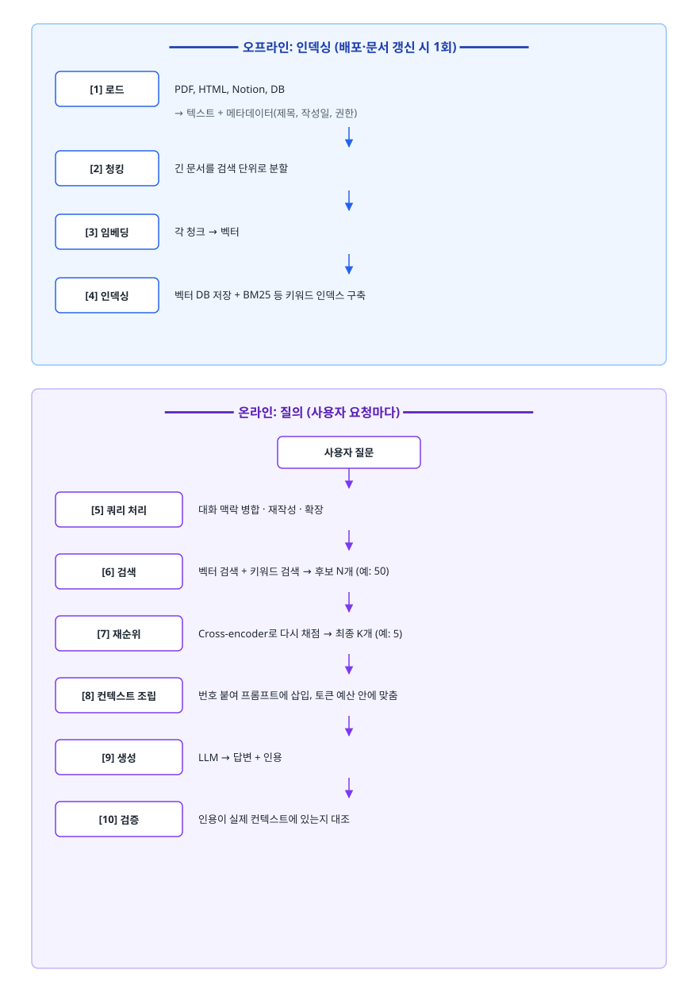
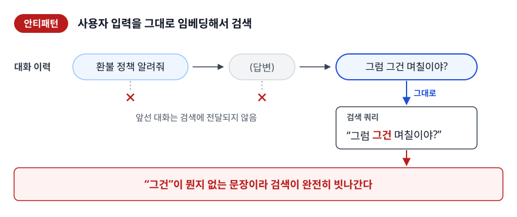
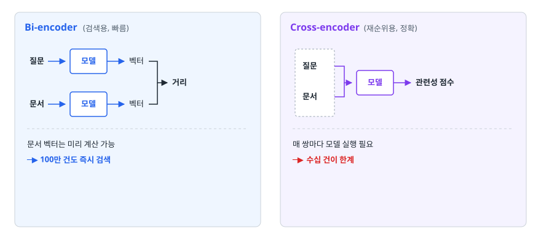

# RAG 파이프라인 (Retrieval-Augmented Generation)

> 문서를 넣으면 답이 나오는 마법이 아니라, 로드부터 평가까지 일곱 단계로 이루어진 검색 시스템이라는 관점에서 RAG를 설명하고 병목을 찾아낼 수 있게 됩니다.

## 학습 목표

- [ ] RAG가 LLM의 어떤 한계를 어떻게 메우는지 설명할 수 있다
- [ ] 오프라인 인덱싱과 온라인 질의 두 경로를 분리해서 그릴 수 있다
- [ ] 청킹 전략 네 가지를 비교하고 문서 종류에 맞게 고를 수 있다
- [ ] 하이브리드 검색, 쿼리 재작성, 리랭커가 각각 어떤 실패를 고치는지 안다
- [ ] 답변이 나쁠 때 검색 문제인지 생성 문제인지 지표로 구분할 수 있다

## 선행 지식

- [../llm-integration/01-llm-basics-prompting.md](../llm-integration/01-llm-basics-prompting.md) — 토큰, 컨텍스트 윈도우
- [../vector-database/01-vector-search.md](../vector-database/01-vector-search.md) — 임베딩과 벡터 검색 (4장 이후를 읽을 때 도움이 된다)

---

## 1. 왜 필요한가

LLM에게 "우리 회사 연차 규정에서 반차는 몇 시간인가요"라고 물으면 답이 옵니다. 문제는 그 답이 **어느 회사 규정인지 모른다**는 것입니다. 모델은 우리 회사 인사 규정을 본 적이 없습니다. 그런데도 답이 나오는 이유는 [환각 문서](../llm-integration/02-hallucination-integration.md)에서 다루듯, 모르는 질문 앞에서도 답변 형태의 토큰 열을 생성하는 쪽으로 기울어 있기 때문입니다.

순수 LLM에는 네 가지 구멍이 있습니다.

| 한계 | 구체적으로 | RAG가 메우는 방식 |
|------|-----------|-----------------|
| 지식 컷오프 | 학습 데이터 시점 이후를 모른다 | 최신 문서를 검색해 컨텍스트로 넣는다 |
| 비공개 데이터 | 사내 문서·DB를 본 적이 없다 | 사내 문서를 인덱싱해 검색 대상으로 만든다 |
| 출처 부재 | 왜 그렇게 답했는지 확인 불가 | 어느 문서 몇 번째 청크에서 왔는지 제시한다 |
| 갱신 비용 | 지식을 바꾸려면 재학습 | 문서 한 줄만 고치면 즉시 반영 |

가장 과소평가되는 것이 세 번째입니다. **틀린 답이 나오는 것보다 틀렸는지 확인할 수 없는 것이 더 큰 문제**입니다. RAG는 답변에 출처를 붙일 수 있게 만들어, 검증 가능한 시스템으로 바꿔줍니다.

### 비유: 오픈북 시험

RAG를 한 문장으로 말하면 **닫힌 책 시험을 오픈북 시험으로 바꾸는 것**입니다. 학생(LLM)의 실력은 그대로지만, 관련 페이지를 펼쳐서 손에 쥐여주면 훨씬 정확한 답을 씁니다.

> **비유의 한계**: 실제 오픈북 시험에서는 학생이 목차를 보고 필요한 페이지를 스스로 찾습니다. 기본형 RAG에서는 **시스템이 대신 골라준 페이지만** 학생이 볼 수 있습니다. 그래서 잘못된 페이지를 쥐여주면 학생은 그 위에서 그럴듯하게 틀린 답을 씁니다. 검색 품질이 곧 답변 품질인 이유이고, 에이전트형 RAG가 "모델이 직접 다시 검색"하게 만드는 이유이기도 합니다.

---

## 2. 전체 파이프라인

RAG를 3단계(Indexing / Retrieval / Generation)로 요약하는 설명이 많은데, 실제로 튜닝할 때는 더 잘게 봐야 어디가 문제인지 찾을 수 있습니다. 그리고 **두 경로가 서로 다른 시점에 돈다**는 점이 중요합니다.

<!-- diagram:ai-rag-pipeline-1 -->


<!-- 위 그림이 대체한 원본 ASCII.
     내용을 고칠 때는 그림도 함께 갱신할 것.
```
━━━━━━━━━ 오프라인: 인덱싱 (배포·문서 갱신 시 1회) ━━━━━━━━━

  [1] 로드            PDF, HTML, Notion, DB
                      → 텍스트 + 메타데이터(제목, 작성일, 권한)
                          ↓
  [2] 청킹            긴 문서를 검색 단위로 분할
                          ↓
  [3] 임베딩          각 청크 → 벡터
                          ↓
  [4] 인덱싱          벡터 DB 저장 + BM25 등 키워드 인덱스 구축


━━━━━━━━━ 온라인: 질의 (사용자 요청마다) ━━━━━━━━━━━━━━━━━

  사용자 질문
       ↓
  [5] 쿼리 처리       대화 맥락 병합 · 재작성 · 확장
       ↓
  [6] 검색            벡터 검색 + 키워드 검색 → 후보 N개 (예: 50)
       ↓
  [7] 재순위          Cross-encoder로 다시 채점 → 최종 K개 (예: 5)
       ↓
  [8] 컨텍스트 조립   번호 붙여 프롬프트에 삽입, 토큰 예산 안에 맞춤
       ↓
  [9] 생성            LLM → 답변 + 인용
       ↓
  [10] 검증           인용이 실제 컨텍스트에 있는지 대조
```
-->

이 그림에서 실무적으로 중요한 사실 두 개.

- **인덱싱 파이프라인과 질의 파이프라인은 반드시 같은 임베딩 모델을 써야 합니다.** 모델이 다르면 벡터 공간이 달라 유사도가 아무 의미가 없습니다. 임베딩 모델을 교체하려면 전체 문서를 다시 임베딩해야 합니다.
- **비용과 지연은 온라인 경로에서만 발생합니다.** 그래서 인덱싱 시점에 미리 해둘 수 있는 일(요약 생성, 메타데이터 추출, 키워드 인덱스 구축)은 최대한 오프라인으로 옮깁니다.

---

## 3. 청킹

### 왜 통째로 넣으면 안 되나

세 가지 이유가 있고, 셋 다 독립적입니다.

1. **컨텍스트 윈도우 제약**: 100페이지 문서 여러 건을 한 번에 넣을 수 없습니다.
2. **검색 정밀도**: 문서 단위로 검색하면 "이 문서 어딘가에 답이 있다"까지만 알 수 있습니다. LLM에게 100페이지를 통째로 주면 관련 없는 99페이지가 노이즈가 됩니다.
3. **임베딩 희석**: 임베딩은 텍스트 전체의 의미를 하나의 벡터로 압축합니다. 텍스트가 길수록 여러 주제가 섞여 평균화되고, **어떤 질문과도 어중간하게 비슷한 벡터**가 됩니다. 이게 가장 놓치기 쉬운 이유입니다.

### 전략 비교

| 전략 | 자르는 기준 | 장점 | 단점 | 적합한 문서 |
|------|-----------|------|------|-----------|
| 고정 크기 | N자 / N토큰마다 | 구현 단순, 크기 예측 가능 | 문장·표·코드 한가운데를 자른다 | 로그, 자막처럼 구조가 없는 텍스트 |
| 문장/문단 | 마침표, 빈 줄 | 의미 경계 보존 | 길이가 들쭉날쭉해 어떤 청크는 너무 짧다 | 뉴스, 블로그 |
| 재귀 분할 | 구분자 우선순위대로 | 의미 보존 + 크기 균일. **실무 기본값** | 구분자 설정을 문서 종류마다 손봐야 | 대부분의 문서 |
| 의미 기반 | 인접 문장 임베딩 유사도 | 주제 전환 지점에서 자연스럽게 분할 | 인덱싱 시 임베딩 호출 비용, 구현 복잡 | 주제가 여러 번 바뀌는 긴 보고서 |

> 표 요약: **재귀 분할로 시작하고, 검색 품질을 측정한 뒤 문제가 있는 문서 종류에만 다른 전략을 적용합니다.** 처음부터 의미 기반 청킹으로 시작하는 것은 대개 과한 최적화입니다.

재귀 분할이 실무 기본값인 이유는 동작 방식에 있습니다. 큰 구분자부터 시도해서 자르고, 결과가 목표 크기보다 크면 더 작은 구분자로 다시 쪼갭니다.

```python
from langchain_text_splitters import RecursiveCharacterTextSplitter

splitter = RecursiveCharacterTextSplitter(
    chunk_size=800,
    chunk_overlap=100,
    # 위에서부터 시도: 문단 → 줄 → 문장 → 어절 → 글자
    separators=["\n\n", "\n", ". ", " ", ""],
)
chunks = splitter.split_text(document)
```

### 안티패턴: 구조를 무시한 고정 분할

```python
# 안티패턴
chunks = [text[i:i+500] for i in range(0, len(text), 500)]
```

**왜 문제인가**: 마크다운 표가 헤더와 본문 행으로 쪼개지면 두 조각 다 의미를 잃습니다. 코드 블록이 함수 중간에서 잘리면 검색돼도 LLM이 쓸 수 없습니다. 무엇보다 **문장이 "결제 실패 시에는 자동으"에서 끊기면** 그 청크의 임베딩은 아무 질문과도 제대로 매칭되지 않습니다.

```python
# 개선 1 — 구조를 먼저 존중하고, 그다음 크기를 맞춘다
splitter = RecursiveCharacterTextSplitter(
    chunk_size=800, chunk_overlap=100,
    separators=["\n## ", "\n### ", "\n\n", "\n", ". ", " ", ""],
)

# 개선 2 — 청크마다 출처와 위치를 메타데이터로 남긴다 (인용과 필터링에 필수)
docs = [
    {"text": c, "source": path, "section": current_heading, "chunk_no": i}
    for i, c in enumerate(chunks)
]
```

### 크기와 오버랩 트레이드오프

```
청크가 작을 때 (200토큰)          청크가 클 때 (2000토큰)

임베딩이 주제에 집중됨 ✓          여러 주제가 섞여 희석됨 ✗
검색은 정확하게 꽂힘 ✓            어떤 질문과도 어중간하게 유사 ✗
답변에 필요한 맥락이 잘림 ✗       맥락이 충분함 ✓
Top-K를 늘려야 해서 결국 비쌈 ✗   Top-K 하나가 이미 비쌈 ✗
```

양쪽 다 대가가 있습니다. 그래서 실무 감각은 이렇습니다. 일반 산문 문서는 500~1000 토큰 근처에서 시작하고, **문서 종류에 따라 조정합니다.** 코드는 함수·클래스 단위, FAQ는 질문-답변 쌍 단위, API 문서는 엔드포인트 단위가 자연스러운 경계입니다. 숫자를 고민하기 전에 **"이 문서에서 하나의 답을 이루는 최소 덩어리는 무엇인가"**를 먼저 답하면 크기가 저절로 정해집니다.

오버랩은 경계에서 잘린 맥락을 보완합니다. 청크 A의 끝과 청크 B의 시작을 겹쳐두면, 경계에 걸친 문장이 최소한 한쪽에는 온전히 들어갑니다. 보통 청크 크기의 10~20% 정도를 씁니다. 다만 **오버랩은 공짜가 아닙니다.** 겹치는 만큼 같은 문서에서 나오는 청크 수가 늘어 저장 용량과 임베딩 비용이 함께 오르고, 검색 결과에 거의 같은 청크가 중복으로 올라오는 일이 생깁니다. 컨텍스트 조립 단계에서 중복 제거를 함께 두는 것이 좋습니다.

---

## 4. 검색 품질 개선

RAG가 기대만큼 안 될 때 원인의 대부분은 생성이 아니라 검색에 있습니다. 개선 수단은 세 가지이고, 각각 **다른 종류의 실패**를 고칩니다.

### 하이브리드 검색: 고유명사를 놓치는 문제

벡터 검색(Dense)은 의미가 비슷하면 단어가 달라도 찾습니다. 대신 정확한 문자열에는 약합니다. 키워드 검색(Sparse, BM25 등)은 정반대입니다.

| | Dense (벡터) | Sparse (BM25) |
|---|---|---|
| 매칭 기준 | 의미 유사도 | 단어 빈도·희소성 |
| 잘하는 것 | "강아지" 질문에 "반려견" 문서 | "ERR_CONN_5031" 같은 정확한 토큰 |
| 못하는 것 | 모델 번호, 에러 코드, 사내 약어 | 동의어, 다른 표현 |
| 학습 필요 | 임베딩 모델 필요 | 없음 (통계 기반) |

> 표 요약: **둘의 실패 지점이 겹치지 않습니다.** 그래서 합치면 서로의 구멍을 메웁니다. 사내 문서처럼 고유 용어가 많은 도메인일수록 하이브리드의 효과가 큽니다.

두 결과를 합칠 때 점수를 그냥 더하면 안 됩니다. **BM25 점수와 코사인 유사도는 스케일이 완전히 다릅니다.** 그래서 점수 대신 순위만 쓰는 RRF(Reciprocal Rank Fusion)를 씁니다.

```python
def rrf(rankings: list[list[str]], k: int = 60, top_n: int = 20) -> list[str]:
    """rankings: 각 검색기가 반환한 문서 ID 리스트(순위순).
    점수 스케일을 무시하고 순위만으로 합친다."""
    scores: dict[str, float] = {}
    for ranking in rankings:
        for rank, doc_id in enumerate(ranking):
            scores[doc_id] = scores.get(doc_id, 0.0) + 1.0 / (k + rank + 1)
    return sorted(scores, key=scores.get, reverse=True)[:top_n]

merged = rrf([dense_search(q, k=50), bm25_search(q, k=50)])
```

`k=60`은 관례적으로 쓰이는 값으로, 상위 순위 간 점수 차이를 완만하게 만들어 한 검색기가 결과를 독점하지 않게 합니다.

### 쿼리 재작성: 질문이 검색에 부적합한 문제

사용자가 던지는 문장은 검색용으로 만들어진 것이 아닙니다.

<!-- diagram:ai-rag-pipeline-2 -->


<!-- 위 그림이 대체한 원본 ASCII.
     내용을 고칠 때는 그림도 함께 갱신할 것.
```
안티패턴: 사용자 입력을 그대로 임베딩해서 검색

  대화 이력: "환불 정책 알려줘" → (답변) → "그럼 그건 며칠이야?"
  검색 쿼리: "그럼 그건 며칠이야?"
  → "그건"이 뭔지 없는 문장이라 검색이 완전히 빗나간다
```
-->

**왜 문제인가**: 검색은 대화 이력을 모릅니다. 지시대명사, 생략된 주어, 오타가 그대로 벡터가 되어 엉뚱한 곳을 가리킵니다.

```python
# 개선 — 검색 전에 독립적으로 이해되는 질문으로 다시 쓴다
REWRITE = """아래 대화를 참고해, 마지막 질문을 그 자체로 이해 가능한
검색용 질문 한 문장으로 다시 써라. 답하지 말고 질문만 출력한다.

대화:
{history}

마지막 질문: {question}
검색용 질문:"""

search_query = call_llm(REWRITE.format(history=h, question=q), temperature=0.0)
# → "환불 신청 후 실제 환불까지 며칠이 걸리나요?"
```

같은 계열의 기법이 두 개 더 있습니다.

- **다중 쿼리(Multi-query)**: 한 질문을 표현이 다른 여러 질문으로 확장해 각각 검색한 뒤 합칩니다. 재현율이 오르지만 검색 횟수가 늘어난다
- **HyDE**: 질문에 대한 **가상의 답변**을 LLM으로 먼저 생성하고, 그 답변을 임베딩해 검색합니다. 질문과 문서는 문체가 달라 유사도가 낮게 나오는 경우가 있는데, 답변끼리 비교하면 잘 맞는다는 아이디어입니다. LLM 호출이 한 번 더 들어간다

셋 다 **온라인 경로에 LLM 호출을 추가**하므로 지연과 비용이 습니다. 검색 실패가 실제로 쿼리 표현 때문인지 먼저 확인하고 적용해야 합니다.

### 리랭커: 순위가 어긋나는 문제

임베딩 검색은 질문과 문서를 **각각 따로** 벡터로 만든 뒤 거리를 잰다(bi-encoder). 빠른 대신, 둘을 함께 읽고 판단하지 않기 때문에 미묘한 관련성을 놓칩니다. Cross-encoder는 질문과 문서를 **붙여서 한 번에** 모델에 넣고 관련성 점수를 냅니다. 훨씬 정확하지만 문서 하나마다 모델을 돌려야 해서 느립니다.

<!-- diagram:ai-rag-pipeline-3 -->


<!-- 위 그림이 대체한 원본 ASCII.
     내용을 고칠 때는 그림도 함께 갱신할 것.
```
Bi-encoder (검색용, 빠름)          Cross-encoder (재순위용, 정확)

 질문 ─▶[모델]─▶ 벡터 ┐            ┌ 질문 ┐
                      ├▶ 거리      │      ├▶[모델]─▶ 관련성 점수
 문서 ─▶[모델]─▶ 벡터 ┘            └ 문서 ┘

 문서 벡터는 미리 계산 가능         매 쌍마다 모델 실행 필요
 → 100만 건도 즉시 검색            → 수십 건이 한계
```
-->

그래서 둘을 **직렬로** 씁니다. 빠른 검색으로 후보를 50개까지 좁히고, 그 50개만 cross-encoder로 다시 채점해 상위 5개를 남깁니다. 각자 잘하는 구간에서만 쓰는 구조입니다.

```
전체 100만 청크 ──[벡터+BM25]──▶ 후보 50개 ──[cross-encoder]──▶ 최종 5개
                    빠름·거침                    느림·정확
```

### 컨텍스트 조립에서 챙길 것

- **번호를 붙여 넣습니다.** `[1] 본문...` 형태여야 인용을 강제하고 나중에 대조할 수 있다
- **중복을 제거합니다.** 오버랩과 다중 쿼리 때문에 거의 같은 청크가 여러 개 올라오면 토큰만 낭비된다
- **토큰 예산을 지킵니다.** Top-K를 고정 개수로 두지 말고 누적 토큰 기준으로 자르는 편이 안전하다
- **긴 컨텍스트의 중간이 약합니다.** 컨텍스트가 길어지면 앞과 뒤에 비해 중간에 놓인 정보가 답변에 덜 반영되는 경향이 보고되어 있습니다. 리랭킹 결과가 있다면 가장 관련성 높은 청크를 중간에 파묻지 않는 것이 안전하다

---

## 5. 평가

"답변이 이상하다"는 보고를 받았을 때 **검색이 문제인지 생성이 문제인지 구분하지 못하면 아무것도 고칠 수 없습니다.** 그래서 두 단계를 나눠 측정합니다.

### 검색 지표

| 지표 | 무엇을 보나 | 낮으면 의미하는 것 |
|------|-----------|-----------------|
| Recall@K | 정답 문서가 상위 K에 들어왔는가 | 아예 못 찾고 있습니다. 청킹·임베딩·하이브리드를 손봐야 한다 |
| Precision@K | 상위 K 중 실제로 관련 있는 비율 | 노이즈가 많습니다. 컨텍스트가 지저분해져 생성이 흔들린다 |
| MRR | 첫 정답이 몇 번째에 오는가 | 찾긴 하는데 아래에 있습니다. 리랭커가 필요한 신호 |
| NDCG | 순위 가중치를 반영한 관련성 | 순위 품질 전반 |

**Recall이 낮은 것과 MRR이 낮은 것은 처방이 다릅니다.** Recall이 낮으면 후보에 아예 없는 것이므로 검색 방식 자체를 바꿔야 하고, Recall은 높은데 MRR이 낮으면 후보에는 있으니 재순위로 끌어올리면 됩니다.

### 생성 지표

| 지표 | 무엇을 보나 |
|------|-----------|
| Faithfulness | 답변의 각 주장이 컨텍스트로 뒷받침되는가 (= 환각 여부) |
| Answer Relevancy | 답변이 질문에 실제로 답하고 있는가 |
| Context Precision | 검색된 컨텍스트 중 답에 실제로 쓰인 비율 |
| Context Recall | 정답을 구성하는 데 필요한 정보가 컨텍스트에 다 있었는가 |

RAGAS는 이 지표들을 자동 계산해주는 평가 프레임워크입니다. 내부적으로 LLM을 판정자로 쓰므로 **판정 자체에 비용이 들고 완벽하지도 않습니다.** 절대 점수를 신뢰하기보다 변경 전후를 비교하는 상대 지표로 쓰는 편이 실용적입니다.

### 진단표

측정값 조합으로 어디를 고칠지 바로 정할 수 있습니다.

| Context Recall | Faithfulness | 진단 | 조치 |
|---|---|---|---|
| 낮음 | 낮음 | 근거를 못 찾아서 지어내고 있다 | 청킹·임베딩·하이브리드 검색부터 |
| 낮음 | 높음 | 근거가 없으면 모른다고는 하고 있다 | 검색 개선. 생성은 정상 |
| 높음 | 낮음 | 근거를 줬는데도 벗어난다 | 프롬프트 제약, temperature, 컨텍스트 정리 |
| 높음 | 높음 | 정상 | Answer Relevancy와 지연·비용을 본다 |

---

## 6. 실무에서는

- **골든 데이터셋을 먼저 만듭니다.** 실제 사용자 질문 30~100건에 정답 문서 ID와 기대 답변을 붙여두면, 청크 크기나 Top-K를 바꿀 때마다 숫자로 비교할 수 있습니다. 이게 없으면 "느낌상 나아진 것 같다"에서 벗어나지 못합니다.
- **문서 갱신 전략을 처음부터 정합니다.** 문서가 바뀌면 해당 청크를 어떻게 찾아 지우고 다시 넣을지가 의외로 큰 문제입니다. 청크 메타데이터에 원본 문서 ID와 버전을 넣어두면 삭제 후 재삽입이 단순해집니다.
- **권한을 메타데이터로 관리합니다.** 사내 RAG에서 가장 위험한 사고는 권한 없는 문서가 답변에 인용되는 것입니다. 청크마다 접근 권한을 메타데이터로 넣고 검색 시 필터링해야 합니다. 필터링 방식의 함정은 [벡터 검색 문서](../vector-database/01-vector-search.md)에서 다룹니다.
- **RAG 이전에 검색이 되는지부터 봅니다.** 사용자 질문을 그대로 기존 검색 엔진에 넣었을 때 원하는 문서가 안 나온다면, 벡터 검색을 붙여도 대개 안 나옵니다. 문제가 문서 자체의 품질(오래됨, 중복, 구조 없음)인 경우가 실제로 많습니다.

---

## 7. 면접 포인트

> 면접에서 이 주제가 나오면 이렇게 답한다

**Q. RAG 파이프라인을 설명해주세요.**
A. 오프라인 인덱싱과 온라인 질의 두 경로로 나눠 설명하겠습니다. 인덱싱은 문서를 로드해 청킹하고, 각 청크를 임베딩해 벡터 DB와 키워드 인덱스에 저장하는 과정으로 문서가 갱신될 때만 돕니다. 질의는 사용자 요청마다 도는 경로로, 질문을 검색에 적합하게 재작성하고, 벡터와 키워드로 후보를 뽑아 리랭커로 상위 몇 개를 고른 뒤, 번호를 붙여 프롬프트에 넣고 답변을 생성합니다. 두 경로가 같은 임베딩 모델을 써야 한다는 점이 중요하고, 비용과 지연은 온라인 경로에서만 나므로 미리 계산할 수 있는 건 인덱싱으로 옮깁니다.
- 꼬리 질문: "임베딩 모델을 바꾸고 싶으면요?" → 벡터 공간이 달라지므로 전체 문서를 재임베딩해야 합니다. 그래서 초기 모델 선택이 생각보다 무거운 결정이라고 답합니다.

**Q. 청크 크기는 어떻게 정하나요?**
A. 정답 숫자가 있다기보다 트레이드오프에서 나옵니다. 청크가 작으면 임베딩이 한 주제에 집중돼 검색은 정확해지지만 답변에 필요한 맥락이 잘리고, 크면 맥락은 충분하지만 여러 주제가 섞여 임베딩이 희석돼 어떤 질문과도 어중간하게 유사해집니다. 그래서 저는 숫자보다 "이 문서에서 하나의 답을 이루는 최소 덩어리"를 먼저 정합니다. 코드면 함수 단위, FAQ면 질문-답변 쌍, 일반 산문이면 500에서 1000토큰 사이에서 시작해 골든 데이터셋으로 Recall@K를 측정하며 조정합니다.
- 꼬리 질문: "오버랩은 왜 두나요?" → 경계에 걸친 문장이 양쪽 다 반토막 나는 것을 막기 위해서입니다. 다만 저장·임베딩 비용이 그만큼 늘고 검색 결과에 중복이 생기므로 컨텍스트 조립에서 중복 제거가 필요합니다.

**Q. 하이브리드 검색이 왜 필요한가요?**
A. 벡터 검색과 키워드 검색이 서로 다른 곳에서 실패하기 때문입니다. 벡터 검색은 의미를 잡아 "강아지"로 물어도 "반려견" 문서를 찾지만, 에러 코드나 제품 모델명 같은 정확한 문자열은 오히려 놓칩니다. BM25는 반대로 정확한 토큰에 강하고 동의어에 약합니다. 사내 문서처럼 고유 용어가 많은 도메인에서 효과가 특히 큽니다. 합칠 때는 BM25 점수와 코사인 유사도의 스케일이 달라 그냥 더하면 안 되고, 순위만 사용하는 RRF를 쓰는 것이 일반적입니다.
- 꼬리 질문: "그다음에 리랭커까지 붙이는 이유는요?" → 검색은 질문과 문서를 따로 임베딩해 거리를 재는 bi-encoder라 미묘한 관련성을 놓칩니다. cross-encoder는 둘을 함께 읽어 정확하지만 느리므로, 검색으로 50개까지 좁힌 뒤 그 안에서만 돌린다고 답합니다.

**Q. RAG 답변 품질이 나쁘면 어디부터 보시겠어요?**
A. 검색 문제인지 생성 문제인지부터 분리합니다. Context Recall과 Faithfulness를 같이 보면 바로 갈립니다. Context Recall이 낮으면 애초에 근거를 못 가져온 것이니 청킹과 임베딩, 하이브리드 검색을 손봐야 하고, Context Recall은 높은데 Faithfulness가 낮으면 근거를 줬는데도 벗어나는 것이라 프롬프트 제약과 temperature, 컨텍스트 정리 쪽입니다. Recall은 높은데 MRR이 낮다면 후보에는 있으나 순위가 밀린 것이므로 리랭커를 붙입니다.
- 꼬리 질문: "지표를 어떻게 측정하나요?" → 실제 질문 30~100건에 정답 문서와 기대 답변을 붙인 골든 데이터셋을 만들어두고, RAGAS 같은 프레임워크로 자동 채점합니다. 절대 점수보다 변경 전후 비교로 씁니다.

---

## 자주 하는 실수

| 실수 | 왜 틀렸나 | 올바른 이해 |
|------|----------|-----------|
| "RAG를 붙였으니 환각이 사라진다" | 검색이 틀리면 틀린 근거 위에서 그럴듯하게 답한다 | 검색 품질이 곧 답변 품질입니다. 출력 검증이 여전히 필요하다 |
| 인덱싱과 질의에 다른 임베딩 모델 사용 | 벡터 공간이 달라 유사도 계산이 무의미해진다 | 같은 모델을 써야 하고, 바꾸려면 전체 재임베딩이 필요하다 |
| Top-K를 크게 잡으면 좋아진다고 생각 | 관련 없는 청크가 노이즈로 들어가 답변이 흐려지고 비용만 는다 | K를 늘렸을 때 Precision과 Faithfulness가 실제로 유지되는지 측정한다 |
| 청크를 문자 수로만 자름 | 표·코드·문장이 한가운데서 끊겨 임베딩이 의미를 잃는다 | 구조적 구분자를 우선하는 재귀 분할을 쓴다 |
| 후속 질문을 그대로 검색에 넣음 | "그건 며칠이야?" 같은 문장은 지시대명사 때문에 검색이 빗나간다 | 대화 맥락을 병합해 독립적인 질문으로 재작성한 뒤 검색한다 |
| 검색 점수와 BM25 점수를 그냥 더함 | 스케일이 전혀 달라 한쪽이 결과를 지배한다 | 순위 기반 RRF를 쓰거나 점수를 정규화한 뒤 가중합한다 |

---

## 한 줄 정리

RAG는 LLM에게 오픈북을 쥐여주는 구조이고, 잘 만든다는 것은 **어느 페이지를 펼쳐줄지 고르는 검색 시스템을 잘 만들고 그 결과를 단계별로 측정한다**는 뜻입니다.

---

## 연관 개념

- [qna-rag.md](./qna-rag.md) - RAG 면접 질문 모음(Q1~Q6 전체가 이 문서 범위)
- [../vector-database/01-vector-search.md](../vector-database/01-vector-search.md) - 임베딩과 ANN 검색이 실제로 어떻게 동작하는지
- [../llm-integration/01-llm-basics-prompting.md](../llm-integration/01-llm-basics-prompting.md) - 토큰·컨텍스트 윈도우와 프롬프트 기법
- [../llm-integration/02-hallucination-integration.md](../llm-integration/02-hallucination-integration.md) - 검색 결과를 근거로 강제하는 프롬프트와 출력 검증
- [../ai-agent/01-agent-langgraph.md](../ai-agent/01-agent-langgraph.md) - 검색을 도구로 두고 모델이 스스로 재검색하는 에이전트형 RAG
