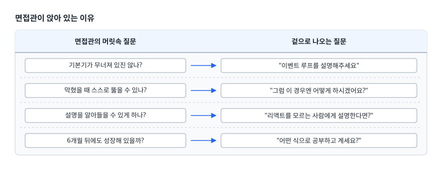
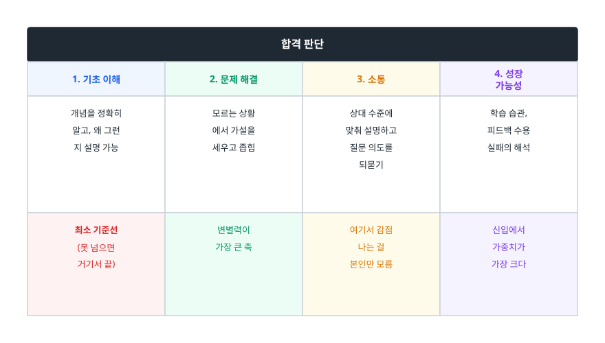
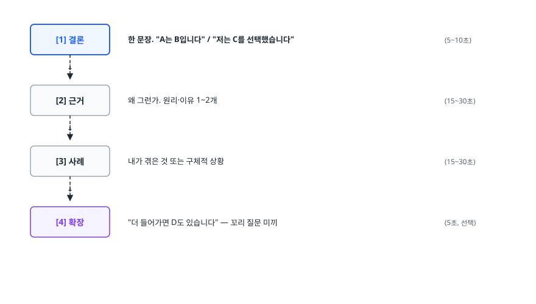
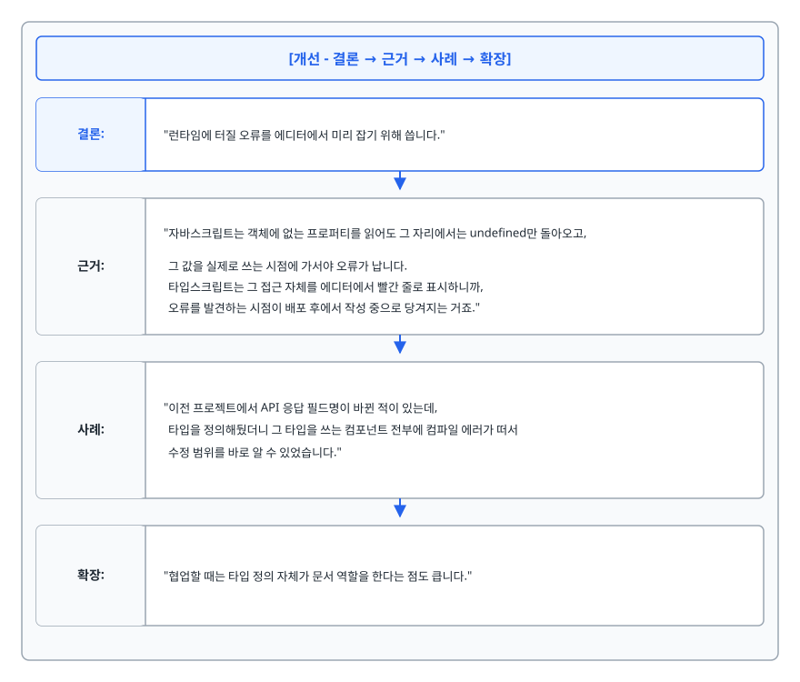
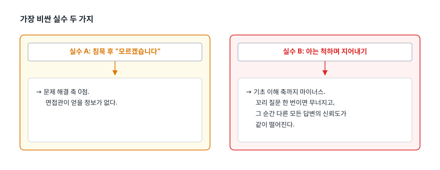
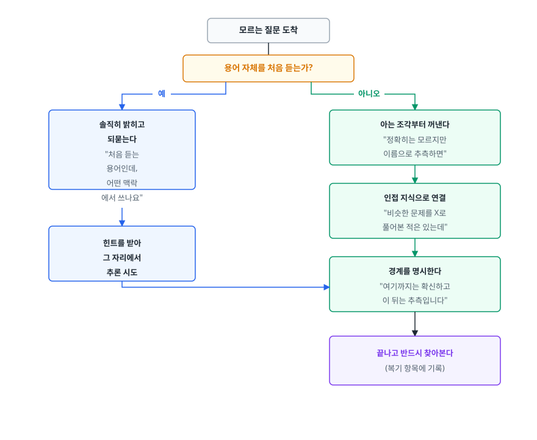
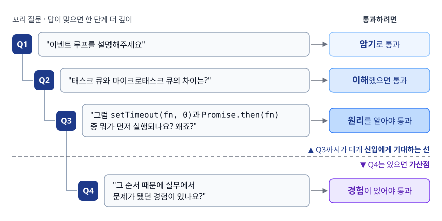
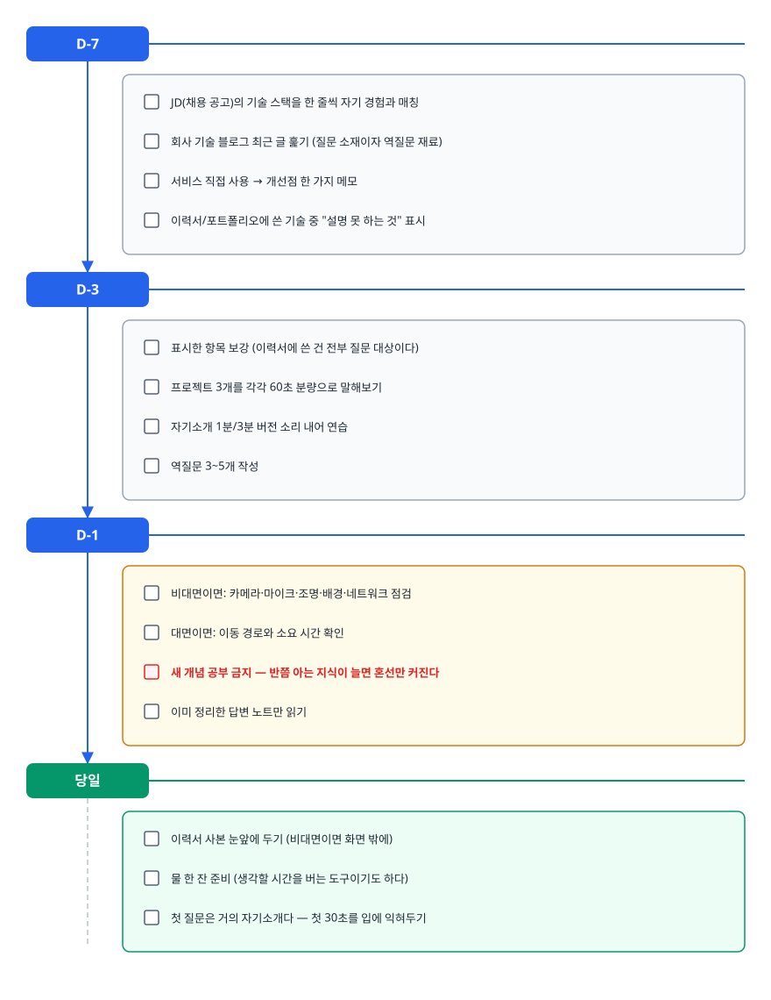
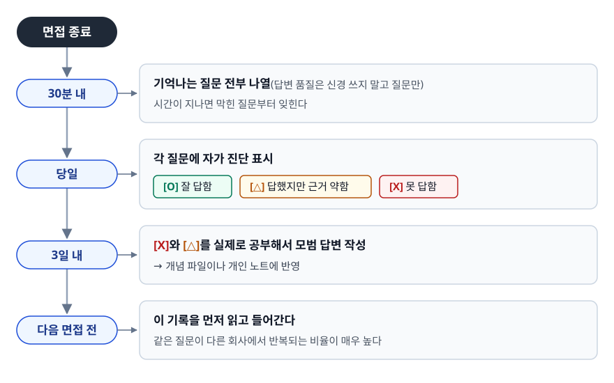

# 기술 면접 전략 (Technical Interview Strategy)

> 면접관이 답의 맞고 틀림 말고 무엇을 채점하고 있는지, 모르는 질문 앞에서 점수를 잃지 않는 방법은 무엇인지, 그리고 왜 답변은 결론부터 시작해야 하는지 설명할 수 있게 된다.

## 학습 목표

- [ ] 기술 면접이 평가하는 네 가지 축을 구분해 말할 수 있다
- [ ] 결론 먼저 구조로 30초 안에 요지를 전달할 수 있다
- [ ] 모르는 질문을 만났을 때 "모릅니다"에서 끝나지 않는 답변을 만들 수 있다
- [ ] 꼬리 질문이 나오는 이유를 이해하고 한 주제를 3단계까지 파고들어 준비할 수 있다
- [ ] 면접 직후 복기 루프를 돌려 다음 면접의 합격률을 올릴 수 있다

## 선행 지식

- 없음 — 이 문서부터 시작해도 된다. 경험을 정리하는 STAR 기법이 궁금하면 [qna-behavioral.md](./qna-behavioral.md)를 먼저 훑어도 되지만, 순서를 지킬 필요는 없다.

---

## 1. 왜 필요한가

### "아는데 떨어졌다"의 정체

면접 준비의 대부분은 지식을 채우는 데 쓰인다. 그런데 실제 탈락 후기를 보면 이런 문장이 반복된다.

> "분명 공부했던 내용인데 입에서 안 나왔다."
> "맞게 답한 것 같은데 면접관 표정이 안 좋았다."
> "첫 질문에서 꼬이니까 그 뒤로 계속 무너졌다."

같은 폴더의 [qna-frontend-companies.md](./qna-frontend-companies.md) 후기 중에도 "리듀서 내부의 불변성을 유지하려고 얕은 복사를 쓴다고 대답했다가 깊은 복사라고 말해버렸다"는 기록이 있다. 지식이 없어서가 아니라 **긴장 상태에서 지식을 꺼내는 경로가 준비되지 않아서** 생긴 사고다.

기술 면접은 지식 시험이 아니다. 지식 시험이라면 필기로 보면 된다. 굳이 사람을 마주 앉히는 이유는 **"이 사람과 6개월 뒤에도 같이 일하고 싶은가"를** 판단하기 위해서다. 그래서 채점표가 지식 하나가 아니다.

### 면접관이 앉아 있는 이유

면접관은 대부분 그 팀의 현직 개발자다. 그 사람의 관심사는 "이 지원자가 우리 코드베이스에 들어왔을 때"로 수렴한다.

<!-- diagram:iv-interview-strategy-1 -->


<!-- 위 그림이 대체한 원본 ASCII.
     내용을 고칠 때는 그림도 함께 갱신할 것.
```
면접관의 머릿속 질문                        겉으로 나오는 질문
──────────────────────────────────────────────────────────────
기본기가 무너져 있진 않나?          →  "이벤트 루프를 설명해주세요"
막혔을 때 스스로 뚫을 수 있나?      →  "그럼 이 경우엔 어떻게 하시겠어요?"
설명을 알아들을 수 있게 하나?       →  "리액트를 모르는 사람에게 설명한다면?"
6개월 뒤에도 성장해 있을까?         →  "어떤 식으로 공부하고 계세요?"
```
-->

오른쪽 질문에 정답을 말해도 왼쪽 질문에 답이 안 되면 떨어진다. 반대로 오른쪽을 완벽히 몰라도 왼쪽에 답이 되면 붙기도 한다. 전략이 필요한 이유다.

---

## 2. 채점되는 네 개의 축

### 축의 구조

<!-- diagram:iv-interview-strategy-2 -->


<!-- 위 그림이 대체한 원본 ASCII.
     내용을 고칠 때는 그림도 함께 갱신할 것.
```
┌─────────────────────────────────────────────────────────┐
│                    합격 판단                             │
├──────────────┬──────────────┬──────────────┬────────────┤
│ 1. 기초 이해 │ 2. 문제 해결 │ 3. 소통      │ 4. 성장    │
│              │              │              │   가능성   │
├──────────────┼──────────────┼──────────────┼────────────┤
│ 개념을 정확히│ 모르는 상황  │ 상대 수준에  │ 학습 습관, │
│ 알고, 왜 그런│ 에서 가설을  │ 맞춰 설명하고│ 피드백 수용│
│ 지 설명 가능 │ 세우고 좁힘  │ 질문 의도를  │ 실패의 해석│
│              │              │ 되묻기       │            │
├──────────────┼──────────────┼──────────────┼────────────┤
│ 최소 기준선  │ 변별력이     │ 여기서 감점  │ 신입에서   │
│ (못 넘으면   │ 가장 큰 축   │ 나는 걸      │ 가중치가   │
│  거기서 끝)  │              │ 본인만 모름  │ 가장 크다  │
└──────────────┴──────────────┴──────────────┴────────────┘
```
-->

### 각 축이 실제로 보는 것

**1. 기초 이해** — 통과 기준선이다. "동기와 비동기의 차이"처럼 거의 모든 회사가 묻는 질문이 여기 속한다. 이 축의 핵심은 넓이가 아니라 **깊이의 일관성**이다. 열 개를 얕게 아는 사람보다 세 개를 "왜"까지 아는 사람이 높은 점수를 받는다. 얕은 지식은 꼬리 질문 두 번이면 바닥이 드러나기 때문이다.

**2. 문제 해결** — 변별력이 가장 큰 축이다. 면접관이 일부러 모를 만한 질문을 던지는 순간이 여기다. "DB와 전역 상태를 못 쓰는 상황에서 웹 API 단에 데이터를 저장하려면?" 같은 질문은 정답을 아는지가 아니라, **모르는 상태에서 어떻게 접근하는지**를 본다.

**3. 소통** — 지원자가 가장 인지하지 못하는 감점 구간이다. 질문 의도를 잘못 잡고 5분을 떠들면 지식이 있어도 "같이 일하기 피곤하겠다"가 된다.

**4. 성장 가능성** — 신입일수록 비중이 커진다. 현재 실력은 어차피 낮다는 전제이므로, 6개월 뒤 어디까지 올라올지를 추정한다. "어떤 식으로 공부하나요"가 인사치레 질문이 아닌 이유다.

| 축 | 좋은 신호 | 나쁜 신호 | 준비 방법 |
|----|----------|----------|----------|
| 기초 이해 | "왜 그렇게 동작하는지"까지 이어짐 | 외운 문장을 그대로 읊음 | 개념마다 "왜" 3단계 파기 |
| 문제 해결 | 모르는 것도 조건을 나눠 추론 | 모르면 즉시 침묵 | 미지의 문제로 사고 연습 |
| 소통 | 질문 의도를 되묻고 시작 | 묻지 않은 것까지 장황하게 | 소리 내어 답하는 모의 면접 |
| 성장 가능성 | 실패를 구조적으로 해석 | 실패를 외부 탓으로 돌림 | 회고 기록을 실제로 남기기 |

> 표 요약: 네 축 중 **혼자 공부해서 올릴 수 있는 건 1번뿐**이다. 나머지 셋은 소리 내어 말하는 연습과 기록이 있어야 올라간다. 준비 시간의 일부를 반드시 여기에 배분해야 한다.

---

## 3. 답변 구조화: 결론 먼저

### 비유: 뉴스 기사와 소설

소설은 사건을 시간 순으로 쌓아 마지막에 결말을 준다. 뉴스 기사는 반대로 첫 문단에 결론을 박아두고 뒤로 갈수록 세부를 붙인다. 독자가 언제 읽기를 멈춰도 핵심은 전달되도록 설계된 구조다. 면접 답변은 소설이 아니라 뉴스 기사여야 한다.

> **비유의 한계**: 뉴스는 독자가 끊는 시점을 통제할 수 없지만, 면접관은 적극적으로 끊고 들어온다. 결론을 먼저 말하는 진짜 이유는 "끊겨도 괜찮아서"가 아니라 **면접관이 어디를 파고들지 스스로 고르게 하기 위해서**다. 좋은 면접은 일방적 발표가 아니라 대화다.

### 구조

<!-- diagram:iv-interview-strategy-3 -->


<!-- 위 그림이 대체한 원본 ASCII.
     내용을 고칠 때는 그림도 함께 갱신할 것.
```
[1] 결론      한 문장. "A는 B입니다" / "저는 C를 선택했습니다"
      ↓        (5~10초)
[2] 근거      왜 그런가. 원리·이유 1~2개
      ↓        (15~30초)
[3] 사례      내가 겪은 것 또는 구체적 상황
      ↓        (15~30초)
[4] 확장      "더 들어가면 D도 있습니다" — 꼬리 질문 미끼
             (5초, 선택)
```
-->

다 합쳐 40초에서 길어도 1분 15초 남짓이다. 이보다 길면 면접관은 요지를 잃고, 이보다 짧으면 근거가 없어 보인다.

### 안티패턴 → 개선

**Q. 왜 TypeScript를 쓰시나요?**

```
[안티패턴 - 정의부터 쌓아 올리기]

"타입스크립트는 마이크로소프트가 만든 자바스크립트의 상위 집합이고요,
정적 타입을 지원해서 컴파일 타임에 타입을 체크할 수 있고,
인터페이스나 제네릭 같은 기능도 있고, 자바스크립트로 트랜스파일되고요,
그래서... 음... 좋아서 씁니다."
```

**왜 문제인가**: 위키백과 첫 문단을 읊었을 뿐 "왜 쓰냐"는 질문에 아직 답하지 않았다. 면접관은 20초쯤 지난 시점에 이미 "이 사람은 써봤지만 왜 쓰는지는 생각해본 적 없다"로 결론 낸다. 마지막의 "좋아서"는 그 판단을 굳힌다.

<!-- diagram:iv-interview-strategy-4 -->


<!-- 위 그림이 대체한 원본 ASCII.
     내용을 고칠 때는 그림도 함께 갱신할 것.
```
[개선 - 결론 → 근거 → 사례 → 확장]

결론: "런타임에 터질 오류를 에디터에서 미리 잡기 위해 씁니다."

근거: "자바스크립트는 객체에 없는 프로퍼티를 읽어도 그 자리에서는 undefined만 돌아오고,
      그 값을 실제로 쓰는 시점에 가서야 오류가 납니다.
      타입스크립트는 그 접근 자체를 에디터에서 빨간 줄로 표시하니까,
      오류를 발견하는 시점이 배포 후에서 작성 중으로 당겨지는 거죠."

사례: "이전 프로젝트에서 API 응답 필드명이 바뀐 적이 있는데,
      타입을 정의해뒀더니 그 타입을 쓰는 컴포넌트 전부에 컴파일 에러가 떠서
      수정 범위를 바로 알 수 있었습니다."

확장: "협업할 때는 타입 정의 자체가 문서 역할을 한다는 점도 큽니다."
```
-->

같은 지식인데 채점 결과가 다르다. 앞은 "기초 이해"만 반쯤 채우고, 뒤는 기초·소통·문제 해결을 동시에 채운다.

---

## 4. 모르는 질문을 만났을 때

### 가장 비싼 실수 두 가지

<!-- diagram:iv-interview-strategy-5 -->


<!-- 위 그림이 대체한 원본 ASCII.
     내용을 고칠 때는 그림도 함께 갱신할 것.
```
실수 A: 침묵 후 "모르겠습니다"
   → 문제 해결 축 0점. 면접관이 얻을 정보가 없다.

실수 B: 아는 척하며 지어내기
   → 기초 이해 축까지 마이너스. 꼬리 질문 한 번이면 무너지고,
     그 순간 다른 모든 답변의 신뢰도가 같이 떨어진다.
```
-->

B가 A보다 훨씬 비싸다. 면접관은 대개 그 분야를 매일 다루는 사람이라, 지어낸 답은 대부분 그 자리에서 티가 난다.

### 대응 흐름

<!-- diagram:iv-interview-strategy-6 -->


<!-- 위 그림이 대체한 원본 ASCII.
     내용을 고칠 때는 그림도 함께 갱신할 것.
```
                모르는 질문 도착
                       │
          ┌────────────┴────────────┐
          │ 용어 자체를 처음 듣는가? │
          └────────────┬────────────┘
              예 │          │ 아니오
                 ↓          ↓
      ┌──────────────┐  ┌──────────────────────┐
      │ 솔직히 밝히고│  │ 아는 조각부터 꺼낸다 │
      │ 되묻는다     │  │ "정확히는 모르지만   │
      │ "처음 듣는   │  │  이름으로 추측하면"  │
      │  용어인데,   │  └──────────┬───────────┘
      │  어떤 맥락   │             ↓
      │  에서 쓰나요"│  ┌──────────────────────┐
      └──────┬───────┘  │ 인접 지식으로 연결   │
             │          │ "비슷한 문제를 X로   │
             ↓          │  풀어본 적은 있는데" │
      ┌──────────────┐  └──────────┬───────────┘
      │ 힌트를 받아  │             ↓
      │ 그 자리에서  │  ┌──────────────────────┐
      │ 추론 시도    │  │ 경계를 명시한다      │
      └──────┬───────┘  │ "여기까지는 확신하고 │
             └────────→ │  이 뒤는 추측입니다" │
                        └──────────┬───────────┘
                                   ↓
                        ┌──────────────────────┐
                        │ 끝나고 반드시 찾아본다│
                        │ (복기 항목에 기록)   │
                        └──────────────────────┘
```
-->

### 안티패턴 → 개선

**Q. 클로저와 가비지 컬렉션은 어떤 관계가 있나요?** (실제 출제 질문)

```
[안티패턴 1 - 즉시 항복]
"아, 그건 잘 모르겠습니다." (끝)
```

**왜 문제인가**: 클로저는 알고 GC도 아는 사람이 "둘의 관계"라는 조합만 안 떠올랐을 뿐인데, 면접관 기록에는 "클로저 모름"으로 남는다. 아는 것조차 채점받지 못한 손해다.

```
[안티패턴 2 - 지어내기]
"클로저를 쓰면 가비지 컬렉터가 자동으로 최적화해줘서
메모리를 더 효율적으로 쓸 수 있습니다."
```

**왜 문제인가**: 사실과 반대 방향이다. 꼬리 질문 한 번("어떻게 최적화되나요?")에 무너지고, 그 뒤로는 앞서 맞게 답한 것들까지 의심받는다.

```
[개선 - 아는 조각에서 추론]

"두 개념을 이어서 생각해본 적은 없는데, 아는 선에서 추론해보겠습니다.

 클로저는 외부 함수가 끝난 뒤에도 내부 함수가 그 스코프의 변수를 참조하는 구조입니다.
 가비지 컬렉터는 참조가 끊긴 객체를 회수하고요.

 그러면 클로저가 살아 있는 동안은 그 변수에 대한 참조가 유지되니까,
 외부 함수가 반환됐는데도 변수가 회수되지 않겠네요.
 이게 의도한 거면 상태 유지고, 의도치 않았으면 메모리 누수일 것 같습니다.

 예를 들어 이벤트 핸들러를 클로저로 등록하고 해제하지 않으면
 그 안에서 잡고 있는 값이 계속 남는 문제가 이 경우일 것 같은데, 맞는 방향일까요?"
```

**무엇이 달라졌나**: 클로저 이해도(축 1), 미지 문제 접근법(축 2), 확신과 추측의 구분(축 3), 되묻는 태도(축 3)가 한 답변에 모두 드러났다. 결론이 정확하지 않더라도 이 답변은 점수를 얻는다.

**한 가지 금지**: "이 뒤는 추측입니다"라고 말한 다음에는 반드시 추측 어미로 끝내라. "~일 것 같습니다", "~로 알고 있습니다". 추측을 단정형으로 말하는 순간 안티패턴 2와 같아진다.

---

## 5. 꼬리 질문은 왜 계속 나오는가

### 꼬리 질문의 목적

면접관은 지원자의 **지식 경계선**을 찾고 있다. 어디까지 알고 어디부터 모르는지가 확인돼야 등급을 매길 수 있기 때문이다. 그래서 답이 맞으면 더 깊이, 또 맞으면 더 깊이 들어간다.

**즉, 꼬리 질문이 계속된다는 건 지금까지 잘 답하고 있다는 신호다.** 막히는 지점이 나올 때까지 파는 것이 정상 진행이므로, "결국 막혔다"는 사실 자체는 감점이 아니다. 막힌 뒤의 반응이 채점 대상이다.

### 한 주제가 3단계까지 파이는 모양

<!-- diagram:iv-interview-strategy-7 -->


<!-- 위 그림이 대체한 원본 ASCII.
     내용을 고칠 때는 그림도 함께 갱신할 것.
```
Q1  "이벤트 루프를 설명해주세요"                     ← 암기로 통과
     │
     └─ Q2  "태스크 큐와 마이크로태스크 큐의 차이는?"  ← 이해했으면 통과
             │
             └─ Q3  "그럼 setTimeout(fn, 0)과 Promise.then(fn)
                     중 뭐가 먼저 실행되나요? 왜죠?"    ← 원리를 알아야 통과
                     │
                     └─ Q4  "그 순서 때문에 실무에서
                             문제가 됐던 경험이 있나요?" ← 경험이 있어야 통과
```
-->

Q3까지가 대개 신입에게 기대하는 선이고, Q4는 있으면 가산점이다. 준비할 때 개념을 한 줄 정의로 끝내지 말고 **최소 3단계까지 스스로 질문을 이어보는** 훈련이 필요하다.

### 자문 훈련법

개념 하나를 정하고 다음 세 질문을 순서대로 던진다.

1. **"왜 이게 필요한가"** — 이 기술이 없던 시절의 문제는 무엇이었나
2. **"어떻게 동작하나"** — 내부에서 실제로 무슨 일이 일어나나
3. **"언제 안 쓰나"** — 이 기술이 오히려 손해인 상황은 언제인가

3번을 답할 수 있으면 그 주제는 대체로 안전하다. 장점만 아는 사람과 트레이드오프를 아는 사람은 여기서 갈린다.

---

## 6. 면접 전 준비 체크리스트

시간 순으로 배치한다. 뒤로 갈수록 지식보다 컨디션 영역이다.

<!-- diagram:iv-interview-strategy-8 -->


<!-- 위 그림이 대체한 원본 ASCII.
     내용을 고칠 때는 그림도 함께 갱신할 것.
```
D-7 ─────────────────────────────────────────────
 □ JD(채용 공고)의 기술 스택을 한 줄씩 자기 경험과 매칭
 □ 회사 기술 블로그 최근 글 훑기 (질문 소재이자 역질문 재료)
 □ 서비스 직접 사용 → 개선점 한 가지 메모
 □ 이력서/포트폴리오에 쓴 기술 중 "설명 못 하는 것" 표시

D-3 ─────────────────────────────────────────────
 □ 표시한 항목 보강 (이력서에 쓴 건 전부 질문 대상이다)
 □ 프로젝트 3개를 각각 60초 분량으로 말해보기
 □ 자기소개 1분/3분 버전 소리 내어 연습
 □ 역질문 3~5개 작성

D-1 ─────────────────────────────────────────────
 □ 비대면이면: 카메라·마이크·조명·배경·네트워크 점검
 □ 대면이면: 이동 경로와 소요 시간 확인
 □ 새 개념 공부 금지 — 반쯤 아는 지식이 늘면 혼선만 커진다
 □ 이미 정리한 답변 노트만 읽기

당일 ────────────────────────────────────────────
 □ 이력서 사본 눈앞에 두기 (비대면이면 화면 밖에)
 □ 물 한 잔 준비 (생각할 시간을 버는 도구이기도 하다)
 □ 첫 질문은 거의 자기소개다 — 첫 30초를 입에 익혀두기
```
-->

**"새 개념 공부 금지"가 특히 중요하다.** D-1에 처음 본 개념은 면접장에서 "들어는 봤는데" 상태로 나온다. 이 상태가 안티패턴 2(지어내기)를 유발하는 가장 흔한 원인이다.

---

## 7. 역질문 준비

면접 끝의 "질문 있으신가요?"는 마지막 채점 구간이다. "없습니다"는 관심 없음으로 읽힌다.

| 질문 유형 | 예시 | 무엇이 드러나나 |
|----------|------|----------------|
| 팀/업무 구조 | "입사하면 어떤 팀에서 어떤 사이클로 일하게 되나요?" | 실제로 일할 그림을 그려봤다 |
| 기술적 고민 | "기술 블로그에서 본 A 도입 이후 남은 과제가 있나요?" | 사전 조사를 진짜로 했다 |
| 성장/온보딩 | "신입 온보딩은 어떤 식으로 진행되나요?" | 오래 다닐 생각이 있다 |
| 즉석 반응 | "아까 말씀하신 B 구조가 흥미로웠는데, 왜 그 방식을 택하셨나요?" | 면접 내내 경청했다 |

> 표 요약: 가장 강한 역질문은 **면접 중에 즉석으로 만들어진 질문**이다. 미리 준비한 3개는 안전망으로 두고, 면접관이 흘린 정보를 잡아 되묻는 쪽을 우선하라. 반대로 검색 5분이면 나오는 정보(연봉 테이블 외 복지 목록, 회사 설립 연도 등)를 묻는 것은 조사 안 했다는 자백이다.

---

## 8. 면접 후 복기

한 번 본 면접은 다음 면접의 교재다. 복기하지 않으면 같은 질문에 두 번 막힌다. [qna-frontend-companies.md](./qna-frontend-companies.md)가 기업별 질문 목록으로 정리돼 있는 이유가 이것이다.

<!-- diagram:iv-interview-strategy-9 -->


<!-- 위 그림이 대체한 원본 ASCII.
     내용을 고칠 때는 그림도 함께 갱신할 것.
```
면접 종료
   │
   ├─ 30분 내 ──→ 기억나는 질문 전부 나열 (답변 품질은 신경 쓰지 말고 질문만)
   │              시간이 지나면 막힌 질문부터 잊힌다
   │
   ├─ 당일 ─────→ 각 질문에 자가 진단 표시
   │              [O] 잘 답함  [△] 답했지만 근거 약함  [X] 못 답함
   │
   ├─ 3일 내 ───→ [X]와 [△]를 실제로 공부해서 모범 답변 작성
   │              → 개념 파일이나 개인 노트에 반영
   │
   └─ 다음 면접 전 → 이 기록을 먼저 읽고 들어간다
                     같은 질문이 다른 회사에서 반복되는 비율이 매우 높다
```
-->

**복기 노트에 반드시 남길 항목 세 가지**

1. 막힌 질문의 **원문 그대로** (요약하면 뉘앙스가 사라진다)
2. 그때 내가 실제로 한 답변 (부끄러워도 적어야 개선 지점이 보인다)
3. 지금이라면 할 답변

3번만 적고 2번을 빼면 "다음엔 잘하자" 수준의 반성으로 끝난다. 무엇이 어떻게 달라졌는지가 남아야 학습이다.

감사 메일은 선택 사항이다. 보낸다고 결과가 뒤집히지는 않지만, 면접에서 답을 못 한 질문을 짧게 보완해 적을 기회는 된다. 길게 쓰면 오히려 부담이 되므로 몇 줄이면 충분하다.

---

## 9. 실무에서는

- **비대면 면접**은 침묵이 대면보다 훨씬 길게 느껴진다. 생각할 시간이 필요하면 "잠시 정리하고 말씀드리겠습니다"라고 소리 내어 알리는 편이 낫다. 화면 너머에서는 고민 중인지 연결이 끊긴 건지 구분되지 않는다.
- **구술 코딩 테스트**가 예고 없이 들어오는 경우가 있다. 코드를 못 짜는 것보다 말없이 화면만 보는 게 더 감점이므로, 접근 방향부터 소리 내어 말하며 진행한다. 사고 과정 자체가 평가 대상이다.
- **면접 전형에 코딩 테스트가 함께 묶여 있는 경우가 흔하다.** [qna-frontend-companies.md](./qna-frontend-companies.md)의 후기 중에도 사전 코딩 테스트 준비가 덜 된 상태로 대면 면접에 들어가 아쉬움이 남았다는 기록이 있다. 면접 답변 연습과 별개로 알고리즘 기본 문제 풀이를 유지해두는 편이 전체 과정에 유리하다.
- **포트폴리오를 화면 공유로 함께 보며 질문하는 형식**이 흔하다. 노션이나 GitHub 링크를 미리 열어두고, 어떤 페이지부터 보여줄지 순서를 정해두면 초반 10초를 아낀다.

---

## 10. 면접 포인트

> 면접에서 이 주제가 나오면 이렇게 답한다

**Q. 모르는 질문을 받으면 어떻게 하시겠어요?** (실제로 이렇게 직접 묻는 경우도 있다)

A. 아는 부분과 모르는 부분의 경계를 먼저 말씀드립니다. 용어 자체가 처음이면 솔직히 밝히고 어떤 맥락에서 쓰이는지 되묻고, 부분적으로 안다면 아는 조각에서 출발해 추론한 뒤 "여기부터는 추측입니다"라고 표시합니다. 확실하지 않은 걸 단정해서 말하면 다른 답변의 신뢰도까지 떨어진다고 생각하기 때문입니다. 면접이 끝나면 그 질문은 반드시 찾아보고 기록해둡니다.
- 꼬리 질문: "추측이 틀리면 손해 아닌가요?" → 틀린 추측이라도 접근 과정이 드러나면 평가받을 수 있지만, 침묵은 아무 정보도 주지 못한다고 답한다.

**Q. 어떤 식으로 공부하고 계신가요?** (여러 회사에서 반복해서 나오는 질문이다)

A. 새 기술을 배울 때 "왜 이게 나왔는지"부터 확인하는 편입니다. 이전 방식의 어떤 문제를 풀려고 만들어졌는지를 알면 언제 쓰지 말아야 하는지도 같이 보이기 때문입니다. 최근에는 [구체적 주제]를 이런 방식으로 정리했고, 막혔던 부분은 별도로 기록해두고 다시 봅니다.
- 꼬리 질문: "그 주제에서 트레이드오프가 뭐였나요?" → 반드시 이어진다. 예시로 든 주제는 단점까지 준비해두어야 한다.

**Q. 본인의 강점이 뭐라고 생각하나요?**

A. (강점 한 단어) + (그것을 증명하는 구체 사례) + (지원 직무에서 어떻게 쓰일지) 순서로 답한다. "성실합니다", "책임감이 강합니다" 같은 태도 형용사는 증거가 없으면 아무 정보도 전달하지 못한다. "장애 원인을 끝까지 좁혀 들어갑니다" 같은 행동 서술로 바꾸고, 그 행동을 실제로 한 사건을 붙인다.
- 꼬리 질문: "다른 지원자보다 나은 점은?" — 실제 출제 질문이다. 비교 대상을 모르므로 "다른 분보다 낫다"가 아니라 "제가 가진 조합"으로 답한다. 예: "프론트만 한 게 아니라 배포까지 직접 해봐서, 화면 문제인지 서버 문제인지 스스로 좁힐 수 있습니다."

**Q. 실패한 경험과 거기서 배운 점을 말씀해주세요.**

A. 축소하거나 남 탓으로 돌리면 성장 가능성 축에서 그대로 손해다. 실패를 하나 고르되 **원인을 외부 상황이 아니라 내 판단에서** 찾고, 그 뒤에 무엇을 바꿨는지까지 이어간다. "요구사항을 과소평가해 일정을 놓쳤습니다"에서 멈추지 말고 "그 뒤로는 착수 전에 불확실한 항목을 먼저 표시하고 그 부분만 따로 시간을 잡습니다"처럼 지금도 유지 중인 습관으로 닫는다.
- 꼬리 질문: "그 방식으로 실제로 나아졌나요?" → 바뀐 뒤의 사례가 하나 있어야 한다. 없으면 반성문으로 들린다.

**Q. 상사가 잘못된 방향(A)으로 지시하면 어떻게 하시겠어요?** (실제 출제 질문)

A. 먼저 제가 놓친 맥락이 있는지 확인합니다. 그래도 A가 문제라고 판단되면 반대 의견이 아니라 근거를 준비해서 전달합니다. "A는 안 됩니다"가 아니라 "A로 하면 이런 케이스에서 이런 문제가 예상되는데, B는 어떻습니까"처럼 대안과 함께요. 그렇게 논의한 뒤에도 A로 결정되면 결정에 따르되, 우려했던 지점을 기록으로 남기고 모니터링합니다.
- 꼬리 질문: "따랐는데 진짜 문제가 터지면요?" → "제가 말했잖아요"가 아니라 기록을 근거로 회고하고 다음 결정 기준을 함께 만든다고 답한다.

---

## 자주 하는 실수

| 실수 | 왜 틀렸나 | 올바른 이해 |
|------|----------|-----------|
| 지식만 채우고 면접장에 들어간다 | 채점 축 4개 중 1개만 준비한 것 | 소리 내어 답하는 연습이 지식 암기만큼 중요하다 |
| 모르면 바로 "모르겠습니다"로 끝낸다 | 아는 조각까지 채점받지 못한다 | 경계를 밝히고 추론까지 보여준 뒤 마무리한다 |
| 확실하지 않은 걸 단정형으로 말한다 | 한 번 들키면 다른 답변 신뢰도까지 무너진다 | "~로 알고 있습니다"로 확신 수준을 표시한다 |
| 꼬리 질문이 이어지면 망했다고 느낀다 | 잘 답하고 있어서 더 파는 것이다 | 막히는 지점을 찾는 정상 절차. 막힌 뒤 반응이 채점 대상 |
| 이력서에 안 써본 기술을 적어둔다 | 이력서에 쓴 건 전부 질문 대상이다 | 설명 못 할 항목은 이력서에서 빼는 게 낫다 |
| 면접 전날 새 개념을 공부한다 | 반쯤 아는 지식이 지어내기를 유발한다 | 전날은 이미 정리한 노트만 복습 |
| 역질문을 "없습니다"로 넘긴다 | 관심 없음의 신호로 읽힌다 | 즉석 질문 1개 + 준비한 질문 2개 |
| 면접 후 복기를 안 한다 | 같은 질문이 다음 회사에서 반복된다 | 30분 내 질문 나열, 3일 내 모범 답변 작성 |

---

## 한 줄 정리

기술 면접은 정답을 맞히는 시험이 아니라 기초·문제 해결·소통·성장 가능성 네 축을 채점하는 대화이므로, 결론부터 말하고 모르는 것은 경계를 밝힌 뒤 추론까지 보여주며, 끝난 뒤 반드시 복기해 다음 면접의 교재로 삼는다.

---

## 연관 개념

- [02-self-introduction.md](./02-self-introduction.md) - 첫 질문인 자기소개를 설계하는 법
- [03-portfolio-project.md](./03-portfolio-project.md) - 프로젝트 질문에서 의사결정 근거를 보여주는 법
- [qna-behavioral.md](./qna-behavioral.md) - STAR 기법과 인성 면접 질문 모음
- [qna-frontend-companies.md](./qna-frontend-companies.md) - 기업별 실제 출제 질문과 후기
- [../06-software-engineering/02-testing-tdd.md](../06-software-engineering/02-testing-tdd.md) - 테스트 관련 꼬리 질문에 대비할 때
