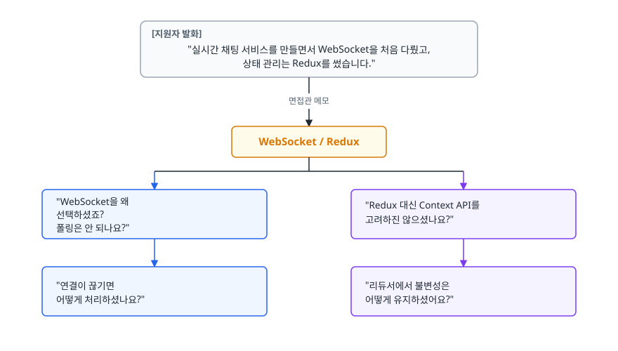
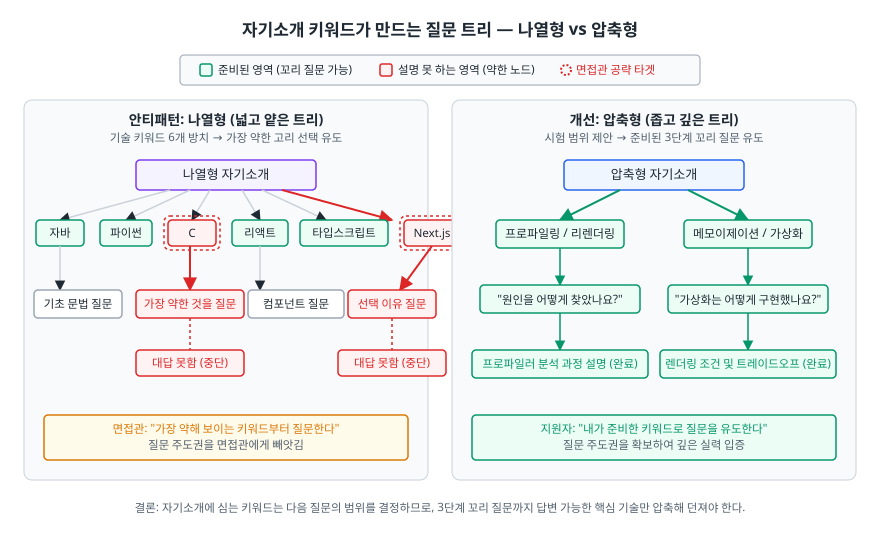
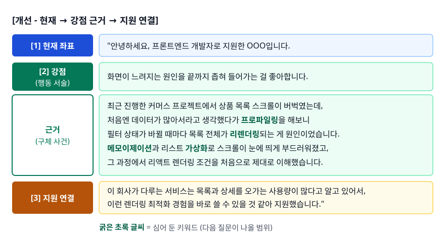
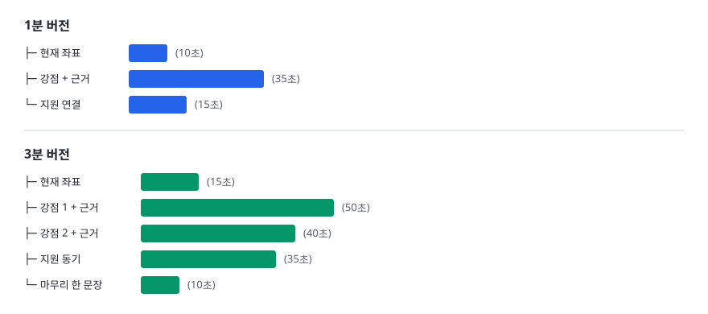
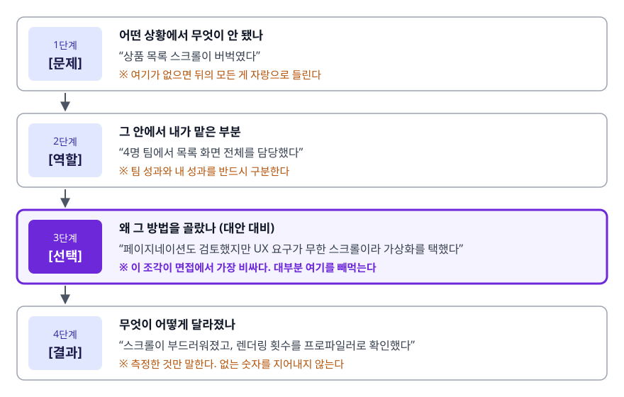
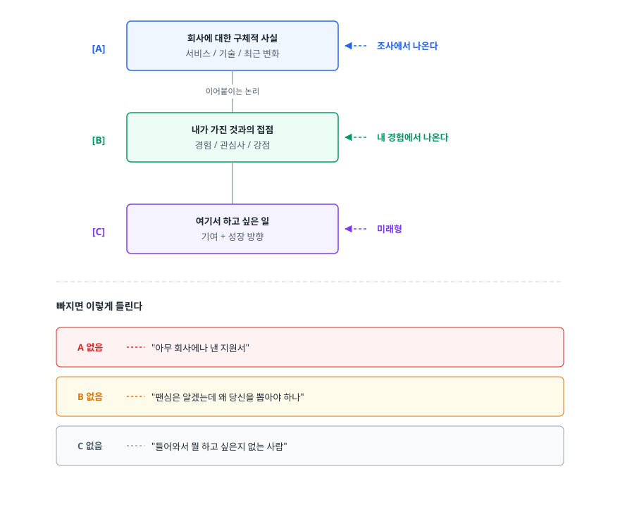
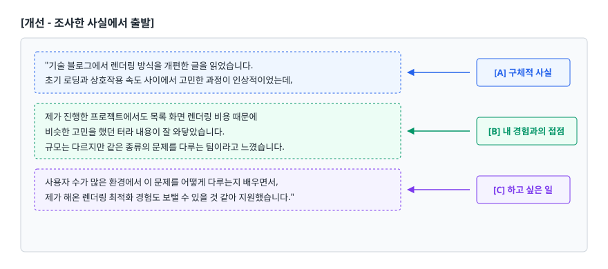
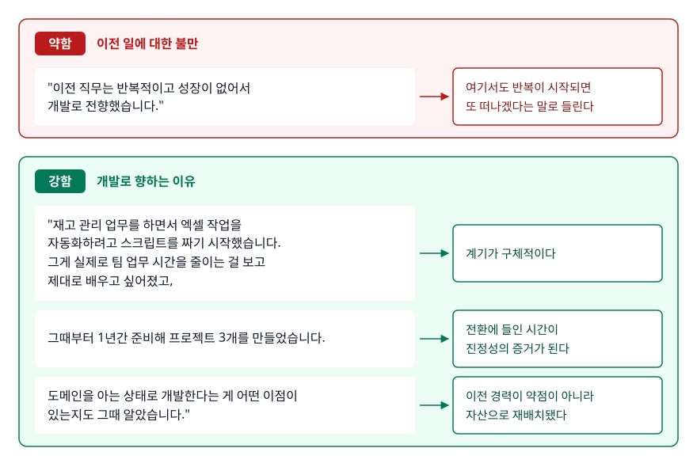
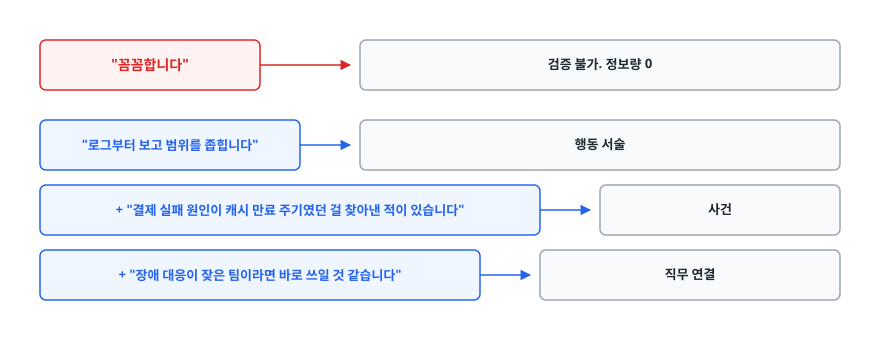

# 자기소개와 지원 동기 (Self-Introduction & Motivation)

> 자기소개에 키워드를 심으면 면접을 이끌 수 있지만, 그 키워드가 그대로 질문 목록이 되어 돌아옵니다. 이 문서는 1분 버전과 3분 버전을 어떻게 다르게 짜는지, 지원 동기를 회사 조사와 어떻게 잇는지를 설명합니다.

## 학습 목표

- [ ] 자기소개에 넣은 단어가 어떻게 다음 질문이 되는지 설명할 수 있다
- [ ] 현재 → 강점 근거 → 지원 연결 구조로 1분 자기소개를 만들 수 있다
- [ ] 1분 버전과 3분 버전의 차이를 알고 상황에 맞게 꺼낼 수 있다
- [ ] 프로젝트를 문제 → 역할 → 기술 선택 이유 → 결과 순으로 압축할 수 있다
- [ ] 검색 5분이면 나오는 지원 동기와 실제로 조사한 지원 동기를 구분할 수 있다
- [ ] 강점·약점·5년 후 질문을 형용사가 아닌 사건으로 답할 수 있다

## 선행 지식

- [01-interview-strategy.md](./01-interview-strategy.md) - 답변을 결론부터 구성하는 원리. 자기소개도 같은 원리를 따릅니다.

---

## 1. 왜 필요한가

### 자기소개는 인사가 아니라 어젠다 세팅이다

면접은 대체로 자기소개로 시작합니다. [qna-frontend-companies.md](./qna-frontend-companies.md)에 정리된 기업별 질문 목록에서도 A·B·C 기업이 모두 이 질문을 일반 질문의 첫 항목에 두었습니다. 그런데 많은 지원자는 이 시간을 "본론 전 워밍업"으로 취급합니다.

면접관은 지원자가 말하는 동안 이력서 여백에 키워드를 적고 그 키워드에서 질문을 뽑습니다. 실제로 벌어지는 일은 그쪽입니다.

<!-- diagram:iv-self-introduction-1 -->


<!-- 위 그림이 대체한 원본 ASCII.
     내용을 고칠 때는 그림도 함께 갱신할 것.
```
[지원자 발화]
"실시간 채팅 서비스를 만들면서 WebSocket을 처음 다뤘고,
 상태 관리는 Redux를 썼습니다."
              │
              │ 면접관 메모
              ↓
        WebSocket / Redux
              │
   ┌──────────┴──────────┐
   ↓                     ↓
"WebSocket을 왜        "Redux 대신 Context API를
 선택하셨죠?           고려하진 않으셨나요?"
 폴링은 안 되나요?"
   │                     │
   ↓                     ↓
"연결이 끊기면        "리듀서에서 불변성은
 어떻게 처리하셨나요?"  어떻게 유지하셨어요?"
```
-->

**자기소개에 넣은 단어가 곧 그날의 시험 범위가 됩니다.** 그래서 자기소개를 설계해야 합니다. 준비된 지원자는 자신 있는 주제로 면접관을 안내하지만, 준비 안 된 지원자는 설명 못 하는 기술 이름을 흘려서 스스로 함정을 팝니다.

### 비유: 영화 예고편

자기소개는 예고편에 가깝습니다. 본편(면접 본론)에서 무엇을 보게 될지 미리 알려 주고, 관객이 계속 앉아 있게 만듭니다.

> **비유의 한계**: 예고편은 결말을 감춥니다. 자기소개는 정반대로 해야 합니다. 가장 강한 카드를 숨겼다가 나중에 꺼내면 그 "나중"이 오지 않습니다. 면접 시간이 끝나거나 면접관의 관심이 다른 데로 넘어갑니다. 강한 것부터 앞에 둡니다.

---

## 2. 구조: 현재 → 강점 근거 → 지원 연결

<!-- diagram:iv-self-introduction -->


### 3단 구조

```
┌────────────────────────────────────────────────────────┐
│ [1] 현재 좌표          "저는 지금 누구인가"           │
│     10~15초                                            │
│     이름 + 지금 무엇을 하는 사람인지 한 문장           │
│     ※ 과거 연대기가 아니라 현재 위치                   │
├────────────────────────────────────────────────────────┤
│ [2] 강점 + 근거        "그렇게 말할 수 있는 이유"      │
│     25~35초                                            │
│     강점 1~2개 + 각각을 뒷받침하는 구체 사건           │
│     ※ 여기 심은 키워드가 다음 질문이 된다             │
├────────────────────────────────────────────────────────┤
│ [3] 지원 연결          "그래서 왜 여기인가"            │
│     10~15초                                            │
│     회사/직무의 구체적 무엇과 내 강점을 잇는다         │
└────────────────────────────────────────────────────────┘
                총 45~65초
```

세 덩어리 각각이 다른 질문에 답합니다. **[1]이 없으면 상대가 나를 분류하지 못하고, [2]가 없으면 주장만 남고, [3]이 없으면 "아무 데나 넣었구나"가 됩니다.**

### 안티패턴 → 개선

```
[안티패턴 - 이력서 낭독형]

"안녕하세요. 저는 1998년생 OOO입니다.
 OO대학교 컴퓨터공학과를 2023년에 졸업했고,
 재학 중에 자바, 파이썬, C를 배웠습니다.
 이후 OO 부트캠프에서 6개월간 프론트엔드 과정을 수료했고
 리액트, 타입스크립트, Next.js를 배웠습니다.
 팀 프로젝트를 3개 진행했고, 개인 프로젝트도 2개 했습니다.
 성실하고 책임감이 강하다는 말을 많이 듣습니다.
 열심히 하겠습니다. 감사합니다."
```

**왜 문제인가**

1. **이력서에 이미 다 있는 정보입니다.** 면접관 손에 그 이력서가 들려 있는데 다시 읽어주는 셈이니, 시간 낭비인 데다 "말할 게 그것뿐인가"라는 인상을 남깁니다.
2. **"배웠습니다"만 있고 "했습니다"가 없습니다.** 배웠다는 사실만으로는 자격이 되지 않습니다. 그 기술로 무엇을 만들어 어떤 문제를 풀었는지까지 말해야 실력의 근거가 됩니다.
3. **키워드를 던져놓고 회수하지 않습니다.** 자바·파이썬·C·리액트·타입스크립트·Next.js가 한 번에 다 나왔으니, 면접관은 이 중 아무거나 고를 수 있고 가장 약한 것을 고를 확률이 높습니다.
4. **"성실", "책임감"은 정보량이 0입니다.** 반대로 말하는 지원자가 없으니, 이런 형용사에는 변별력이 없습니다.
5. **[3]이 없습니다.** 이 자기소개는 어느 회사에 제출해도 똑같습니다.

<!-- diagram:iv-self-introduction-2 -->


<!-- 위 그림이 대체한 원본 ASCII.
     내용을 고칠 때는 그림도 함께 갱신할 것.
```
[개선 - 현재 → 강점 근거 → 지원 연결]

"안녕하세요, 프론트엔드 개발자로 지원한 OOO입니다.       ← [1] 현재 좌표

 화면이 느려지는 원인을 끝까지 좁혀 들어가는 걸 좋아합니다.  ← [2] 강점(행동 서술)
 최근 진행한 커머스 프로젝트에서 상품 목록 스크롤이 버벅였는데,
 처음엔 데이터가 많아서라고 생각했다가 프로파일링을 해보니
 필터 상태가 바뀔 때마다 목록 전체가 리렌더링되는 게 원인이었습니다.  ← 근거(구체 사건)
 메모이제이션과 리스트 가상화로 스크롤이 눈에 띄게 부드러워졌고,
 그 과정에서 리액트 렌더링 조건을 처음으로 제대로 이해했습니다.

 이 회사가 다루는 서비스는 목록과 상세를 오가는 사용량이 많다고 알고 있어서,   ← [3] 지원 연결
 이런 렌더링 최적화 경험을 바로 쓸 수 있을 것 같아 지원했습니다."
```
-->

**무엇이 달라졌나**

- 키워드가 "리렌더링 / 메모이제이션 / 가상화 / 프로파일링"으로 좁혀졌습니다. 다음 질문이 이 안에서 나올 확률이 크게 올라갑니다. 즉 **내가 시험 범위를 제안한 셈**입니다.
- "배웠다"가 "원인을 찾아 고쳤다"로 바뀌었습니다. 같은 프로젝트인데 서술만 바꿔도 정보량이 다릅니다.
- 형용사("성실") 대신 행동("끝까지 좁혀 들어간다")을 썼고, 그 행동의 증거를 바로 붙였습니다.

**주의**: 이 방식은 심어 둔 키워드마다 3단계 꼬리 질문까지 준비돼 있어야 성립합니다. "가상화를 어떻게 구현하셨나요?"에 답을 못 하면 오히려 역효과입니다. 자신 있는 것만 심어야 합니다.

---

## 3. 1분 버전과 3분 버전

면접관이 "간단히 소개해주세요"라고 하면 1분, "자유롭게 말씀해주세요"라고 하거나 임원 면접이면 3분에 가깝습니다. 두 버전은 **구조가 다릅니다.** 길이만 조절한 판본이 아닙니다.

| 구분 | 1분 버전 | 3분 버전 |
|------|---------|---------|
| 사용 상황 | 기술 면접 첫 질문, 다대다 면접 | 임원/인성 면접, 시간 여유 있는 1:1 |
| 프로젝트 | 1개만, 그것도 한 문장으로 | 1~2개를 문제→역할→선택→결과로 전개 |
| 강점 | 1개 | 2개 (기술적 강점 + 협업 강점) |
| 지원 동기 | 한 문장 | 회사 조사 내용을 근거로 3~4문장 |
| 구성 원칙 | 버릴 것을 고른다 | 채울 것이 아니라 **깊이를 더한다** |
| 실패 유형 | 정보가 없어 밋밋함 | 늘어져서 요지 실종 |

> 표 요약: **3분 버전은 1분 버전의 각 문장을 한 단계씩 파고든 것**입니다. 새로운 항목을 추가해 분량을 채우면 늘어집니다. 만들 때는 3분을 먼저 쓰고 1분으로 깎는 편이 쉽습니다.

### 시간 배분

<!-- diagram:iv-self-introduction-3 -->


<!-- 위 그림이 대체한 원본 ASCII.
     내용을 고칠 때는 그림도 함께 갱신할 것.
```
1분 버전
├─ 현재 좌표      ▓▓                      (10초)
├─ 강점 + 근거    ▓▓▓▓▓▓▓                 (35초)
└─ 지원 연결      ▓▓▓                     (15초)

3분 버전
├─ 현재 좌표      ▓▓▓                     (15초)
├─ 강점 1 + 근거  ▓▓▓▓▓▓▓▓▓▓              (50초)
├─ 강점 2 + 근거  ▓▓▓▓▓▓▓▓                (40초)
├─ 지원 동기      ▓▓▓▓▓▓▓                 (35초)
└─ 마무리 한 문장 ▓▓                      (10초)
```
-->

합쳐서 2분 30초 남짓입니다. "3분" 소리를 들었다고 시간을 꽉 채울 필요는 없습니다. 이쯤에서 끊고 나머지는 면접관의 질문에 맡기는 편이 안전합니다.

**타이머를 켜고 소리 내어 읽어봐야 합니다.** 글로 쓸 때 1분 같던 원고가 말로는 2분이 되는 일이 흔합니다. 긴장하면 말이 빨라지는 사람은 원고를 더 짧게 잡아야 합니다.

---

## 4. 프로젝트를 넣는 순서

자기소개 안에서 프로젝트를 언급할 때는 네 조각을 이 순서로 압축합니다. 순서가 바뀌면 전달력이 급격히 떨어집니다.

<!-- diagram:iv-self-introduction-4 -->


<!-- 위 그림이 대체한 원본 ASCII.
     내용을 고칠 때는 그림도 함께 갱신할 것.
```
[문제]  어떤 상황에서 무엇이 안 됐나
   ↓    "상품 목록 스크롤이 버벅였다"
        ※ 여기가 없으면 뒤의 모든 게 자랑으로 들린다

[역할]  그 안에서 내가 맡은 부분
   ↓    "4명 팀에서 목록 화면 전체를 담당했다"
        ※ 팀 성과와 내 성과를 반드시 구분한다

[선택]  왜 그 방법을 골랐나 (대안 대비)
   ↓    "페이지네이션도 검토했지만 UX 요구가 무한 스크롤이라 가상화를 택했다"
        ※ 이 조각이 면접에서 가장 비싸다. 대부분 여기를 빼먹는다

[결과]  무엇이 어떻게 달라졌나
        "스크롤이 부드러워졌고, 렌더링 횟수를 프로파일러로 확인했다"
        ※ 측정한 것만 말한다. 없는 숫자를 지어내지 않는다
```
-->

### 왜 [선택]이 가장 비싼가

[문제]-[역할]-[결과]만 말하면 "시킨 걸 해냈다"까지만 전달됩니다. [선택]이 들어가야 **판단할 줄 아는 사람**이 됩니다. 면접관은 "이 사람에게 새 문제를 맡겼을 때 스스로 결정할 수 있는가"를 확인하려 하고, 그 근거가 여기서 나옵니다.

<!-- diagram:iv-self-introduction-5 -->
![왜 [선택]이 가장 비싼가](../assets/diagrams/iv-self-introduction-5.svg)

<!-- 위 그림이 대체한 원본 ASCII.
     내용을 고칠 때는 그림도 함께 갱신할 것.
```
[약함] "Next.js를 사용해서 SEO를 개선했습니다."
       → 유행이라서 쓴 건지 필요해서 쓴 건지 구분되지 않는다.

[강함] "검색 유입과 링크 공유가 중요한 서비스인데 CSR이라 초기 HTML이 거의 비어
       있었습니다. 자바스크립트를 실행하는 크롤러는 결국 내용을 읽어가지만
       SNS 미리보기처럼 실행하지 않는 쪽에서는 빈 카드가 나왔습니다.
       메타 태그만 따로 처리하는 방법도 검토했는데, 마침 라우팅 구조를
       새로 짜야 하는 시점이라 Next.js로 옮겼습니다.
       대신 빌드와 배포가 복잡해지는 건 감수했습니다."
       → 문제 인식 → 대안 검토 → 선택 → 트레이드오프 수용까지 다 들어 있다.
```
-->

"Next.js를 쓴 이유"는 실제로 자주 나오는 질문이라, 자기소개에서 Next.js를 언급했다면 위 수준의 답이 준비돼 있어야 합니다. 프로젝트 서술을 더 깊이 다루는 방법은 [03-portfolio-project.md](./03-portfolio-project.md)에서 이어집니다.

---

## 5. 지원 동기: 조사 없이는 만들 수 없다

### 3층 구조

지원 동기에 설득력이 있으려면 세 층이 다 있어야 합니다. 하나라도 빠지면 흔한 실패 유형 중 하나가 됩니다.

<!-- diagram:iv-self-introduction-6 -->


<!-- 위 그림이 대체한 원본 ASCII.
     내용을 고칠 때는 그림도 함께 갱신할 것.
```
        ┌──────────────────────────┐
   [A]  │ 회사에 대한 구체적 사실  │  ← 조사에서 나온다
        │ 서비스 / 기술 / 최근 변화 │
        └────────────┬─────────────┘
                     │  이어붙이는 논리
        ┌────────────┴─────────────┐
   [B]  │ 내가 가진 것과의 접점    │  ← 내 경험에서 나온다
        │ 경험 / 관심사 / 강점      │
        └────────────┬─────────────┘
                     │
        ┌────────────┴─────────────┐
   [C]  │ 여기서 하고 싶은 일      │  ← 미래형
        │ 기여 + 성장 방향          │
        └──────────────────────────┘

빠지면 이렇게 들린다
  A 없음 → "아무 회사에나 낸 지원서"
  B 없음 → "팬심은 알겠는데 왜 당신을 뽑아야 하나"
  C 없음 → "들어와서 뭘 하고 싶은지 없는 사람"
```
-->

### 조사는 어디서 하나

```
JD(채용 공고)     ── 요구 기술 스택을 한 줄씩 내 경험과 매칭한다.
                     "우대사항"에 적힌 것이 그 팀의 현재 고민이다.

기술 블로그       ── 가장 강한 재료. 팀이 최근 무슨 문제를 풀었는지
                     그들의 언어로 적혀 있다. 역질문 소재로도 쓰인다.

서비스 직접 사용  ── 회원가입부터 핵심 기능까지 실제로 써본다.
                     불편했던 지점 하나를 메모해두면 그 자체가 대화 소재다.

채용 페이지/인터뷰 ── 팀 구성과 일하는 방식. "사수가 있는지"처럼
                     실제로 나오는 질문의 배경 정보이기도 하다.
```

### 안티패턴 → 개선

```
[안티패턴 - 검색 5분이면 나오는 문장]

"귀사는 업계를 선도하는 기업이고 빠르게 성장하고 있습니다.
 이런 환경에서 저도 함께 성장하고 싶어 지원했습니다."
```

**왜 문제인가**: [A] 자리에 사실 대신 수식어가 들어갔습니다. "선도", "성장"은 회사 이름만 바꾸면 어디든 붙습니다. [B]가 아예 없고 [C]는 "성장하고 싶다"뿐인데, 이건 회사가 나에게 주는 것이지 내가 회사에 주는 것이 아닙니다. 지원 동기를 물었는데 수혜 희망만 답한 셈입니다.

<!-- diagram:iv-self-introduction-7 -->


<!-- 위 그림이 대체한 원본 ASCII.
     내용을 고칠 때는 그림도 함께 갱신할 것.
```
[개선 - 조사한 사실에서 출발]

"기술 블로그에서 렌더링 방식을 개편한 글을 읽었습니다.        ← [A] 구체적 사실
 초기 로딩과 상호작용 속도 사이에서 고민한 과정이 인상적이었는데,

 제가 진행한 프로젝트에서도 목록 화면 렌더링 비용 때문에      ← [B] 내 경험과의 접점
 비슷한 고민을 했던 터라 내용이 잘 와닿았습니다.
 규모는 다르지만 같은 종류의 문제를 다루는 팀이라고 느꼈습니다.

 사용자 수가 많은 환경에서 이 문제를 어떻게 다루는지 배우면서,  ← [C] 하고 싶은 일
 제가 해온 렌더링 최적화 경험도 보탤 수 있을 것 같아 지원했습니다."
```
-->

**주의**: 블로그 글을 언급하면 그 글에 대한 질문이 따라올 수 있습니다. 제목만 보고 인용하지 말고 반드시 끝까지 읽어야 합니다. 인용은 조사의 증거인 동시에 검증 대상입니다.

---

## 6. 피해야 할 표현

| 표현 | 왜 문제인가 | 대체 |
|------|-----------|------|
| "성실하고 책임감이 강합니다" | 반대로 말하는 지원자가 없어 변별력 0 | 그 성실함이 드러난 사건 하나 |
| "무엇이든 열심히 하겠습니다" | 무엇을 할지 모른다는 뜻으로도 읽힌다 | 하고 싶은 일을 하나 특정 |
| "빠르게 배울 수 있습니다" | 근거 없이는 주장일 뿐 | 짧은 기간에 실제로 익힌 사례 |
| "다양한 기술을 경험했습니다" | 깊이 없음의 완곡한 표현이 된다 | 하나를 골라 깊이로 승부 |
| "부족하지만 열심히" | 스스로 낮추면 상대도 그 평가를 받아들인다 | 사실만 담담하게 |
| "귀사의 비전에 공감합니다" | 비전 문구를 읽었다는 뜻 이상이 아니다 | 구체적 사실 + 내 경험 접점 |
| "OO도 하고 XX도 하고 ΔΔ도" | 나열은 시험 범위만 넓힌다 | 자신 있는 2개로 압축 |
| "제가 다 했습니다" (팀 프로젝트) | 검증되면 신뢰가 통째로 무너진다 | 내 역할을 정확히 구분 |

> 표 요약: 전부 **검증 불가능한 형용사**에서 문제가 생깁니다. 형용사를 지우고 동사와 사건으로 바꾸면 대부분 해결됩니다.

---

## 7. 신입 / 경력 전환자 / 경력자

같은 3단 구조를 쓰되 무게중심이 다릅니다.

| 구분 | 강조할 것 | 면접관의 속마음 | 함정 |
|------|----------|----------------|------|
| 신입 | 학습 속도와 기초, 프로젝트에서 내린 결정 | "6개월 뒤 얼마나 커 있을까" | 경력자 흉내를 내며 규모를 부풀림 |
| 경력 전환자 | 이전 경력이 개발에 주는 실질적 이점, 전환의 진정성 | "왜 바꿨고, 또 바꾸지 않을까" | 이전 경력을 감추거나 반대로 그것만 말함 |
| 경력자 | 담당 범위, 의사결정, 성과의 지속성 | "우리 문제를 바로 다룰 수 있나" | 회사 성과와 내 기여의 경계가 흐림 |

### 신입

경력이 없다는 걸 사과하지 않습니다. 애초에 신입 채용은 경력을 기대하지 않습니다. 대신 **결정의 흔적**을 보여줍니다. 프로젝트 규모는 작아도 되지만, "왜 그렇게 했는지"에 답할 수 있으면 평가 축의 문제 해결과 성장 가능성을 동시에 채웁니다.

부트캠프나 학원을 거쳤다면 "어떤 곳이었나요"를 실제로 묻는 회사가 있습니다. 커리큘럼을 읊는 답에는 정보가 없습니다. 같은 기수 수십 명이 똑같이 말할 내용이기 때문입니다. 그 안에서 **내가 따로 고른 부분**을 답해야 합니다. 커리큘럼 밖에서 파본 주제, 팀 프로젝트에서 자원해서 맡은 역할, 수료 후에도 혼자 이어간 작업 같은 것들. 변별은 정해진 과정에서 벗어난 지점에서 생깁니다.

### 경력 전환자

가장 자주 받는 질문은 "왜 바꿨나요"이고 그 뒤에는 **"또 바꾸지 않을까"**가 숨어 있습니다. 그래서 답은 이전 일에 대한 불만이 아니라 개발로 향하는 이유여야 합니다.

<!-- diagram:iv-self-introduction-8 -->


<!-- 위 그림이 대체한 원본 ASCII.
     내용을 고칠 때는 그림도 함께 갱신할 것.
```
[약함] "이전 직무는 반복적이고 성장이 없어서 개발로 전향했습니다."
       → 여기서도 반복이 시작되면 또 떠나겠다는 말로 들린다.

[강함] "재고 관리 업무를 하면서 엑셀 작업을 자동화하려고 스크립트를 짜기 시작했습니다.
       그게 실제로 팀 업무 시간을 줄이는 걸 보고 제대로 배우고 싶어졌고,
       그때부터 1년간 준비해 프로젝트 3개를 만들었습니다.
       도메인을 아는 상태로 개발한다는 게 어떤 이점이 있는지도 그때 알았습니다."
       → 계기가 구체적이고, 전환에 들인 시간이 진정성의 증거가 되며,
         이전 경력이 약점이 아니라 자산으로 재배치됐다.
```
-->

경력 전환자의 이전 경력은 지우는 게 아니라 **번역하는 것**입니다. 고객 응대 경험이면 요구사항 정리 능력으로, 데이터 다루던 경험이면 도메인 이해로 옮겨 붙입니다.

---

## 8. 강점, 약점, 그리고 5년 후

자기소개 다음으로 반복되는 세 질문입니다. 셋 다 자기소개와 같은 원리로 답합니다. 형용사를 걷어내고 사건에서 출발합니다.

### 강점

강점은 단어 하나로 끝내지 않고 **행동 서술 + 그 행동을 한 사건 + 직무 연결** 세 조각으로 만듭니다.

<!-- diagram:iv-self-introduction-9 -->


<!-- 위 그림이 대체한 원본 ASCII.
     내용을 고칠 때는 그림도 함께 갱신할 것.
```
"꼼꼼합니다"                       → 검증 불가. 정보량 0
"로그부터 보고 범위를 좁힙니다"     → 행동 서술
 + "결제 실패 원인이 캐시 만료 주기였던 걸 찾아낸 적이 있습니다"   → 사건
 + "장애 대응이 잦은 팀이라면 바로 쓰일 것 같습니다"              → 직무 연결
```
-->

### 약점

약점 질문은 **자기 인식**을 봅니다. 자기 비판 능력을 얼마나 갖췄는지 재는 자리가 아닙니다. 그래서 실패하는 답이 세 종류입니다.

| 유형 | 예 | 왜 감점인가 |
|------|-----|------------|
| 회피형 | "특별한 약점은 없습니다" | 자기 인식이 없다는 뜻으로 읽힌다 |
| 위장형 | "완벽주의라 일을 오래 붙잡습니다" | 강점을 약점으로 포장한 게 그대로 보인다 |
| 자해형 | "마감을 자주 놓칩니다" | 직무 수행 자체가 의심된다 |

**실제 약점 + 그것을 관리하는 장치 + 최근에 달라진 점**을 묶으면 안전합니다. "추정으로 코드를 고치다 시간을 버리는 일이 있어서, 지금은 30분 안에 원인이 안 좁혀지면 로그부터 다시 보는 규칙을 정해뒀습니다"처럼 관리 방법이 붙으면 약점이 오히려 성장 가능성의 근거가 됩니다.

### 5년 후

"5년 뒤 어떤 개발자가 되고 싶나요"는 **그 그림을 여기서 그릴 수 있는가**를 확인합니다. 야망의 크기를 재는 질문은 아닙니다. 직급("팀장이 되고 싶습니다")보다 역량과 역할로 답하는 편이 안전합니다. 지금 하고 있는 것 → 그 방향의 다음 단계 → 이 회사에서 할 수 있는 부분 순으로 이으면 지원 동기의 [C]층과 그대로 연결됩니다.

---

## 9. 실무에서는

- **자기소개는 원고를 통째로 외우지 말고 문장 3~4개의 뼈대만 외웁니다.** 통암기는 단어 하나에 걸리는 순간 뒤가 끊기고 읽는 티가 목소리에 그대로 납니다. 뼈대만 있으면 면접 분위기에 맞춰 살을 조절할 수 있습니다.
- **비대면 면접에서는 원고를 화면 옆에 띄워두고 싶어지지만 권장하지 않습니다.** 시선이 카메라에서 벗어나는 게 그대로 보이고, 읽는 사람 특유의 억양이 나옵니다. 키워드 몇 개만 포스트잇에 적어두는 정도가 낫습니다.
- **다대다 면접에서 앞 지원자와 소재가 겹치는 상황이 흔합니다.** 같은 부트캠프 출신이면 프로젝트까지 비슷할 수 있습니다. 이럴 때 차별점은 그 안에서 내가 내린 결정에서 나오므로, [선택] 조각을 준비해둔 사람만 살아남습니다. 프로젝트 이름만으로는 부족합니다.
- **자기소개 직후 "방금 말씀하신 것 중에 ~"로 이어지는 경우가 흔합니다.** 마지막 문장에 가장 자신 있는 키워드를 두면 그쪽으로 유도될 확률이 올라갑니다.

---

## 10. 면접 포인트

> 면접에서 이 주제가 나오면 이렇게 답한다

**Q. 자기소개를 해주세요.**

A. 현재 좌표 한 문장 → 강점과 그것을 증명하는 구체적 사건 → 지원 연결 순으로 1분 안에 마칩니다. 이력서에 이미 적힌 학력과 수료 이력은 반복하지 않습니다. **자신 있는 키워드 2개만 남기고 나머지는 버립니다.** 언급한 기술은 전부 질문 대상이 되므로, 설명할 자신이 없는 이름은 아예 꺼내지 않습니다.
- 꼬리 질문: "방금 말씀하신 OO은 왜 그렇게 하셨어요?" → 자기소개에 심은 키워드마다 문제-역할-선택-결과가 준비돼 있어야 합니다.

**Q. 왜 프론트엔드(백엔드) 개발자가 되기로 했나요?** (실제 출제 질문)

A. "적성에 맞아서" 같은 추상적 답 대신 계기가 된 사건 하나를 듭니다. 처음 만든 화면이 실제로 동작했을 때의 경험이든, 업무 자동화 스크립트가 팀에 쓰인 경험이든, **구체적이면 진정성이 따라옵니다.** 이어서 그 뒤로 무엇을 했는지(학습 기간, 만든 것)를 붙이면 일시적 흥미가 아니라는 증거가 됩니다.
- 꼬리 질문: "다른 직군은 고려 안 하셨나요?" → 고려했다면 솔직히 말하고 왜 지금 직군으로 좁혔는지 기준을 설명하는 편이 자연스럽습니다.

**Q. 왜 우리 회사인가요?**

A. 조사한 구체적 사실 → 내 경험과의 접점 → 하고 싶은 일 3층 구조로 답합니다. 회사 이름을 다른 회사로 바꿔도 성립하는 문장이면 다시 써야 합니다. 기술 블로그 글, 실제로 써본 서비스의 특정 기능처럼 **검증 가능한 사실**에서 출발합니다.
- 꼬리 질문: "그 글에서 어떤 부분이 인상적이었나요?" → 인용한 자료는 반드시 끝까지 읽어두어야 합니다.

**Q. 본인이 다른 지원자보다 나은 점은 무엇인가요?** (실제 출제 질문)

A. 다른 지원자를 모르므로 비교로 답하지 않습니다. 대신 "제가 가진 조합"으로 답합니다. 기술 하나만으로는 변별이 어렵지만, 두 가지의 결합은 상대적으로 드뭅니다. 예를 들어 "화면 작업과 배포 파이프라인을 둘 다 다뤄봐서 문제가 프론트 쪽인지 인프라 쪽인지 스스로 좁힐 수 있습니다"처럼 조합에서 나오는 실질적 이점을 듭니다.
- 꼬리 질문: "그 조합이 실제로 도움이 된 상황이 있었나요?" → 조합을 말했으면 그것이 발휘된 사건이 반드시 따라와야 합니다.

---

## 자주 하는 실수

| 실수 | 왜 틀렸나 | 올바른 이해 |
|------|----------|-----------|
| 이력서 내용을 그대로 읽는다 | 면접관 손에 이미 이력서가 있다 | 이력서에 없는 "왜"와 "어떻게"를 말한다 |
| 다룬 기술을 전부 나열한다 | 시험 범위만 넓어지고 약한 걸 골라 물어본다 | 자신 있는 2개로 압축해 유도한다 |
| "성실합니다" 같은 형용사로 강점을 말한다 | 검증 불가능해 정보량이 0 | 행동 서술 + 그 행동을 한 사건 |
| 지원 동기를 회사 소개문에서 가져온다 | 이름만 바꾸면 어디든 성립한다 | 블로그·서비스 사용 등 조사한 사실에서 출발 |
| 원고를 통째로 외운다 | 한 단어 막히면 전체가 멈추고 낭독 톤이 난다 | 뼈대 문장 3~4개만 외우고 살은 즉석에서 |
| 3분 버전을 항목 추가로 늘린다 | 늘어져서 요지가 사라진다 | 같은 항목을 한 단계 더 파고든다 |
| 팀 성과를 내 성과처럼 말한다 | 꼬리 질문 한 번에 경계가 드러난다 | "팀은 X를 했고 저는 그중 Y를 맡았습니다" |
| 신입인데 경력자처럼 규모를 부풀린다 | 검증되면 신뢰 전체가 무너진다 | 규모가 작아도 결정의 근거로 승부한다 |
| 약점을 "완벽주의"로 포장한다 | 강점을 약점처럼 말한 게 그대로 보인다 | 실제 약점 + 관리 장치 + 달라진 점 |

---

## 한 줄 정리

자기소개는 인사가 아닙니다. 그날의 시험 범위를 내가 제안하는 시간이므로, 현재 좌표 → 증거 있는 강점 → 지원 연결 구조로 자신 있는 키워드만 남겨 설계합니다. 지원 동기는 회사 이름을 바꾸면 성립하지 않을 만큼 구체적인 사실에서 출발해야 합니다.

---

## 연관 개념

- [01-interview-strategy.md](./01-interview-strategy.md) - 답변 구조화, 꼬리 질문 대비, 면접 전 체크리스트
- [03-portfolio-project.md](./03-portfolio-project.md) - 자기소개에서 압축한 프로젝트를 깊이 있게 풀어내는 법
- [qna-behavioral.md](./qna-behavioral.md) - 자기소개·지원동기·강점약점 질문의 답변 프레임
- [qna-frontend-companies.md](./qna-frontend-companies.md) - 기업별로 실제 나온 일반 질문 목록
