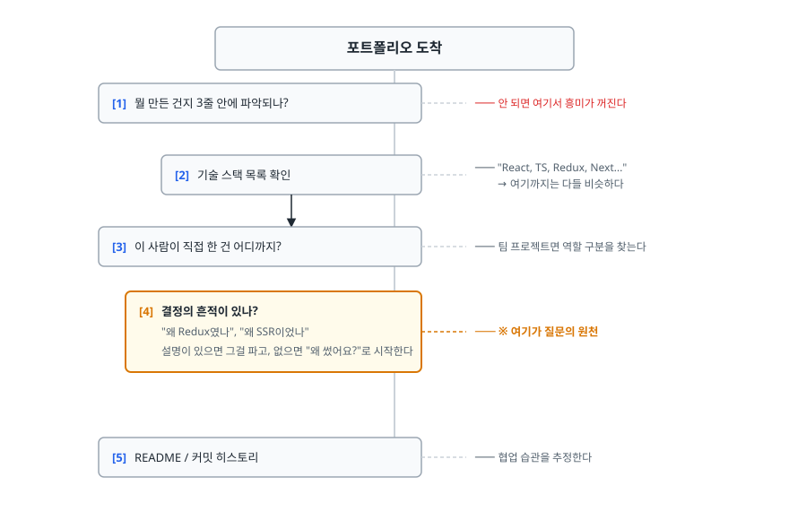
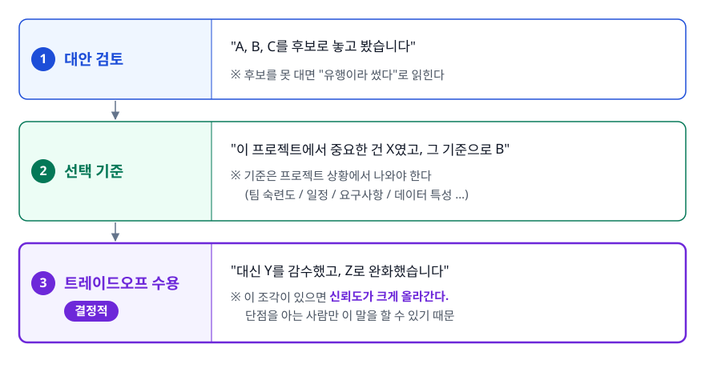
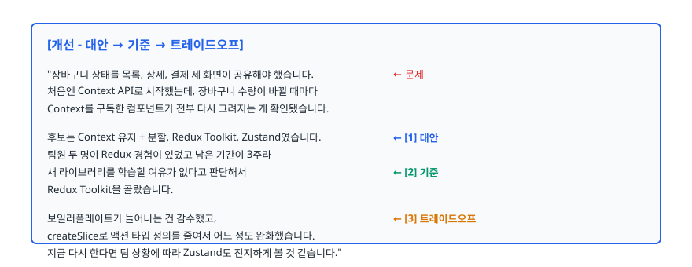
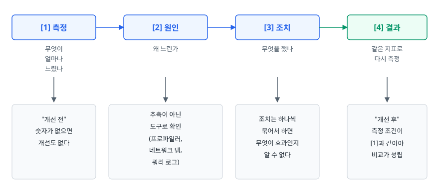
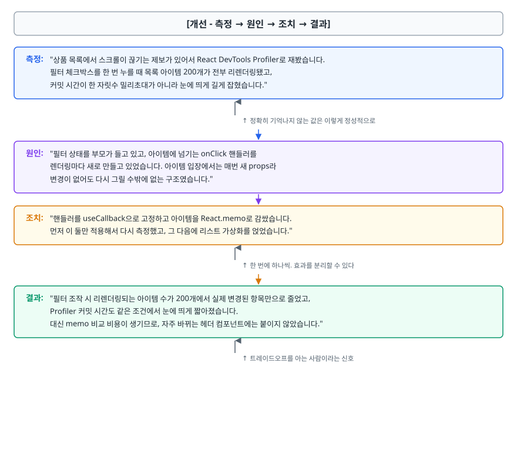
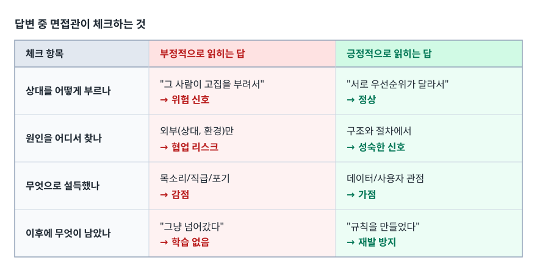
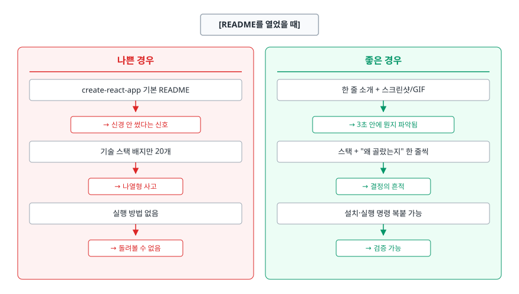
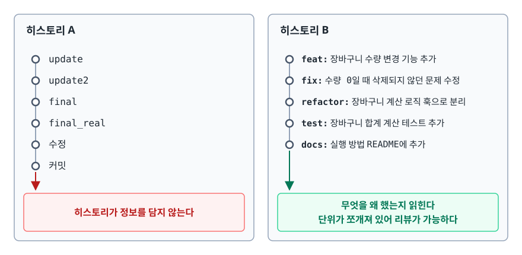

# 포트폴리오와 프로젝트 설명 (Portfolio & Project Deep Dive)

> 면접관이 포트폴리오에서 실제로 찾는 것이 기술 목록이 아니라 의사결정의 흔적인 이유, 기술 선택을 방어하는 프레임, 성능 개선을 숫자로 정리하는 절차, 그리고 README와 커밋 히스토리가 남기는 인상을 설명할 수 있게 됩니다.

## 학습 목표

- [ ] 기술 나열형 서술과 의사결정형 서술의 차이를 구분할 수 있다
- [ ] "왜 이 기술을 썼나요"에 대안 검토 → 선택 기준 → 트레이드오프 순으로 답할 수 있다
- [ ] 성능 개선 경험을 측정 → 원인 → 조치 → 결과 구조로 정리할 수 있다
- [ ] 협업·갈등 경험을 상대 비난 없이 해결 과정 중심으로 서술할 수 있다
- [ ] STAR와 이 문서의 프레임이 어떻게 대응되는지 알고 골라 쓸 수 있다
- [ ] README와 커밋 히스토리가 면접 전에 이미 평가받고 있음을 이해한다
- [ ] 프로젝트에서 나올 꼬리 질문을 미리 뽑아 대비할 수 있다

## 선행 지식

- [02-self-introduction.md](./02-self-introduction.md) - 프로젝트를 60초로 압축하는 문제-역할-선택-결과 순서. 이 문서는 그 각 조각을 확장합니다.

---

## 1. 왜 필요한가

### 면접관은 포트폴리오를 이렇게 읽는다

기술 면접에서 CS 질문은 어느 지원자에게나 비슷하게 나갑니다. 변별이 실제로 일어나는 곳은 **포트폴리오 질문**입니다. 이건 지원자마다 다르고, 대답을 준비해오기도 어렵고, 거짓말이 가장 빨리 드러나는 영역이기 때문입니다.

[qna-frontend-companies.md](./qna-frontend-companies.md)의 후기 중에 "노션을 바탕으로 질문을 해주시는 것을 보고 포트폴리오를 아예 보지 않는 것은 아니라고 생각했다"는 기록이 있습니다. 포트폴리오를 훑어보고 거기서 질문을 뽑아 오는 면접관이 실제로 있다는 뜻입니다. 그 짧은 시간에 시선이 움직이는 경로는 대체로 이렇습니다.

<!-- diagram:iv-portfolio-project-1 -->


<!-- 위 그림이 대체한 원본 ASCII.
     내용을 고칠 때는 그림도 함께 갱신할 것.
```
포트폴리오 도착
      │
      ├─[1] 뭘 만든 건지 3줄 안에 파악되나?  ─── 안 되면 여기서 흥미가 꺼진다
      │
      ├─[2] 기술 스택 목록 확인            ─── "React, TS, Redux, Next..."
      │        │                                  → 여기까지는 다들 비슷하다
      │        ↓
      ├─[3] 이 사람이 직접 한 건 어디까지?  ─── 팀 프로젝트면 역할 구분을 찾는다
      │
      ├─[4] 결정의 흔적이 있나?             ─── ※ 여기가 질문의 원천
      │        "왜 Redux였나", "왜 SSR이었나"
      │        설명이 있으면 그걸 파고, 없으면 "왜 썼어요?"로 시작한다
      │
      └─[5] README / 커밋 히스토리          ─── 협업 습관을 추정한다
```
-->

**[2]에서 지원자 대부분이 동점이 된다.** 부트캠프나 학교 커리큘럼이 비슷하면 스택도 비슷하기 때문입니다. 점수는 [3]과 [4]에서 갈립니다.

### 비유: 완공 사진과 설계 도면

건축가의 포트폴리오에 완공된 건물 사진만 잔뜩 있으면 "예쁘네"로 끝납니다. 심사위원이 보고 싶은 건 도면과 회의록입니다. 왜 기둥을 여기 세웠는지, 예산이 부족했을 때 무엇을 포기했는지가 거기에 있습니다.

> **비유의 한계**: 건축과 달리 소프트웨어 포트폴리오는 **실제로 동작해야 한다**는 전제가 먼저입니다. 배포 링크가 죽어 있거나 로컬에서도 안 뜨는 프로젝트는 도면이 아무리 훌륭해도 그 앞에서 걸립니다. 결정의 근거는 동작하는 결과물 위에 얹는 것입니다.

---

## 2. 기술 나열 vs 의사결정 서술

| 구분 | 기술 나열형 | 의사결정형 |
|------|-----------|-----------|
| 문장 형태 | "Redux를 사용했습니다" | "전역 상태가 세 화면에서 공유돼 Redux를 택했습니다" |
| 전달되는 것 | 그 기술을 써봤다는 사실 | 문제 인식 + 판단 기준 |
| 대체 가능성 | 같은 스택 쓴 지원자 전원과 동점 | 같은 스택이어도 서술이 다르다 |
| 꼬리 질문 대응 | "왜요?"에서 바로 막힌다 | 이미 답의 절반이 들어 있다 |
| 면접관의 결론 | "튜토리얼을 따라 했구나" | "판단을 해본 사람이구나" |

> 표 요약: 같은 프로젝트, 같은 스택인데 평가가 갈리는 지점은 **"썼다"와 "택했다"의 차이** 하나입니다. 포트폴리오 문서를 다시 볼 때 "사용했습니다"로 끝나는 문장을 전부 찾아 이유를 붙이는 것만으로 체감 품질이 달라집니다.

### 기술 선택을 방어하는 3단 프레임

<!-- diagram:iv-portfolio-project-2 -->


<!-- 위 그림이 대체한 원본 ASCII.
     내용을 고칠 때는 그림도 함께 갱신할 것.
```
┌──────────────────────────────────────────────────────────┐
│ [1] 대안 검토                                            │
│     "A, B, C를 후보로 놓고 봤습니다"                     │
│     ※ 후보를 못 대면 "유행이라 썼다"로 읽힌다            │
├──────────────────────────────────────────────────────────┤
│ [2] 선택 기준                                            │
│     "이 프로젝트에서 중요한 건 X였고, 그 기준으로 B"     │
│     ※ 기준은 프로젝트 상황에서 나와야 한다               │
│       (팀 숙련도 / 일정 / 요구사항 / 데이터 특성 …)      │
├──────────────────────────────────────────────────────────┤
│ [3] 트레이드오프 수용                                    │
│     "대신 Y를 감수했고, Z로 완화했습니다"                │
│     ※ 이 조각이 있으면 신뢰도가 크게 올라간다.           │
│       단점을 아는 사람만 이 말을 할 수 있기 때문         │
└──────────────────────────────────────────────────────────┘
```
-->

[3]이 핵심입니다. 장점만 말하는 사람은 문서를 읽은 사람이고, 단점까지 말하는 사람은 써본 사람입니다. 면접관은 이 차이를 구분하려고 "그 기술의 단점은 뭔가요?"를 묻습니다.

### 안티패턴 → 개선

**Q. 상태 관리로 Redux를 쓰셨네요. 왜 선택하셨나요?**

```
[안티패턴 - 기능 설명으로 회피]

"Redux는 전역 상태 관리 라이브러리인데, 스토어에 상태를 모아두고
 액션과 리듀서로 상태를 변경하는 구조입니다.
 단방향 데이터 흐름이라 상태 추적이 쉽고, 데브툴도 좋습니다.
 그래서 사용했습니다."
```

**왜 문제인가**: "왜 이 프로젝트에서"를 물었는데 "Redux란 무엇인가"를 답했습니다. 이 답변은 Redux를 안 써본 사람도 문서만 읽으면 할 수 있습니다. 게다가 이 프로젝트에 전역 상태가 필요했는지조차 확인되지 않았습니다. 면접관은 곧바로 "Context API로는 안 됐나요?"를 던지고, 여기서 준비 안 된 지원자는 무너집니다.

<!-- diagram:iv-portfolio-project-3 -->


<!-- 위 그림이 대체한 원본 ASCII.
     내용을 고칠 때는 그림도 함께 갱신할 것.
```
[개선 - 대안 → 기준 → 트레이드오프]

"장바구니 상태를 목록, 상세, 결제 세 화면이 공유해야 했습니다.  ← 문제
 처음엔 Context API로 시작했는데, 장바구니 수량이 바뀔 때마다
 Context를 구독한 컴포넌트가 전부 다시 그려지는 게 확인됐습니다.

 후보는 Context 유지 + 분할, Redux Toolkit, Zustand였습니다.       ← [1] 대안
 팀원 두 명이 Redux 경험이 있었고 남은 기간이 3주라
 새 라이브러리를 학습할 여유가 없다고 판단해서                    ← [2] 기준
 Redux Toolkit을 골랐습니다.

 보일러플레이트가 늘어나는 건 감수했고,                            ← [3] 트레이드오프
 createSlice로 액션 타입 정의를 줄여서 어느 정도 완화했습니다.
 지금 다시 한다면 팀 상황에 따라 Zustand도 진지하게 볼 것 같습니다."
```
-->

**무엇이 달라졌나**: 선택 기준이 기술 스펙이 아니라 **프로젝트 제약, 즉 팀 숙련도와 남은 기간에서** 나왔습니다. 실무 의사결정이 실제로 그렇게 이루어지기 때문에, 이 서술은 "일해본 감각"으로 읽힙니다. 마지막의 "지금 다시 한다면"은 회고 능력을 보여주는 문장이라 성장 가능성 축에도 점수가 붙습니다.

**주의**: 마지막 문장은 양날의 검입니다. "지금이라면 Zustand"라고 말하면 "그럼 Zustand는 뭐가 다른데요?"가 반드시 따라옵니다. 답할 수 있을 때만 꺼냅니다.

---

## 3. 성능 개선 경험을 숫자로 정리하기

### 4단계 절차

성능 개선은 포트폴리오에서 가장 강한 소재인 동시에 가장 자주 망가지는 소재입니다. 순서를 지키면 살고, 순서가 없으면 자랑이 됩니다.

<!-- diagram:iv-portfolio-project-4 -->


<!-- 위 그림이 대체한 원본 ASCII.
     내용을 고칠 때는 그림도 함께 갱신할 것.
```
[1] 측정  ──→ [2] 원인  ──→ [3] 조치  ──→ [4] 결과
 무엇이       왜 느린가      무엇을 했나    같은 지표로
 얼마나                                     다시 측정
 느렸나
   │             │              │              │
   ↓             ↓              ↓              ↓
 "개선 전"     추측이 아닌    조치는 하나씩   "개선 후"
 숫자가 없으면 도구로 확인    묶어서 하면    측정 조건이
 개선도 없다   (프로파일러,   무엇이 효과인지 [1]과 같아야
               네트워크 탭,   알 수 없다     비교가 성립
               쿼리 로그)
```
-->

**[1]을 건너뛴 개선은 존재를 증명할 수 없다.** "빨라진 것 같습니다"는 면접에서 아무 점수도 얻지 못합니다. 반대로 [1]과 [4]가 같은 조건에서 측정됐다면, 개선 폭이 작아도 신뢰받습니다.

> 아래 예시에 나오는 숫자는 서술 **형식**을 보여주기 위한 가상의 값입니다. 절대 그대로 옮겨 쓰지 말고, 본인이 직접 측정한 값을 넣어라. 측정하지 않은 숫자를 적는 것은 면접에서 가장 위험한 선택 중 하나입니다.

### 비유: 진료 기록

증상(측정) → 검사와 진단(원인) → 처방(조치) → 경과 관찰(결과). 의사가 검사 없이 처방하면 돌팔이고, 경과를 안 보면 치료가 끝났는지 알 수 없습니다. 성능 개선 서술도 같은 골격을 가집니다.

> **비유의 한계**: 질병에는 대체로 표준 치료가 있지만 성능 문제에는 정답이 없습니다. 캐시를 붙이면 응답은 빨라지고 데이터 일관성은 나빠집니다. **성능 개선은 언제나 무언가를 내주고 얻는 거래**라서, 무엇을 내줬는지까지 말해야 답이 완성됩니다.

### 안티패턴 → 개선

```
[안티패턴 1 - 근거 없는 숫자]
"쿼리를 최적화해서 성능을 50% 개선했습니다."
```

**왜 문제인가**: 무엇을 어떻게 쟀는지가 없습니다. "50%"는 응답 시간인지 처리량인지, 어떤 조건에서 몇 번 측정한 평균인지 알 수 없습니다. 면접관이 "어떻게 측정하셨어요?"를 물으면 대부분 여기서 무너집니다. **검증 못 할 숫자는 없느니만 못하다.**

```
[안티패턴 2 - 조치만 나열]
"React.memo와 useMemo를 적용하고 이미지를 lazy loading으로 바꿨습니다."
```

**왜 문제인가**: [1] 측정과 [2] 원인이 없으니 이 조치들이 필요했는지 알 수 없습니다. 특히 메모이제이션은 비교 비용이 있어서 무분별하게 붙이면 오히려 손해입니다. 이 답변은 "리렌더링 문제가 있었다고 들어서 일단 다 붙였다"로 읽힐 위험이 큽니다. 그래서 "memo를 붙이면 항상 빨라지나요?" 같은 확인 질문이 뒤따르기 쉽습니다.

<!-- diagram:iv-portfolio-project-5 -->


<!-- 위 그림이 대체한 원본 ASCII.
     내용을 고칠 때는 그림도 함께 갱신할 것.
```
[개선 - 측정 → 원인 → 조치 → 결과]

측정: "상품 목록에서 스크롤이 끊기는 제보가 있어서 React DevTools Profiler로 재봤습니다.
      필터 체크박스를 한 번 누를 때 목록 아이템 200개가 전부 리렌더링됐고,
      커밋 시간이 한 자릿수 밀리초대가 아니라 눈에 띄게 길게 잡혔습니다."
                                    ↑ 정확히 기억나지 않는 값은 이렇게 정성적으로

원인: "필터 상태를 부모가 들고 있고, 아이템에 넘기는 onClick 핸들러를
      렌더링마다 새로 만들고 있었습니다. 아이템 입장에서는 매번 새 props라
      변경이 없어도 다시 그릴 수밖에 없는 구조였습니다."

조치: "핸들러를 useCallback으로 고정하고 아이템을 React.memo로 감쌌습니다.
      먼저 이 둘만 적용해서 다시 측정했고, 그 다음에 리스트 가상화를 얹었습니다."
                                    ↑ 한 번에 하나씩. 효과를 분리할 수 있다

결과: "필터 조작 시 리렌더링되는 아이템 수가 200개에서 실제 변경된 항목만으로 줄었고,
      Profiler 커밋 시간도 같은 조건에서 눈에 띄게 짧아졌습니다.
      대신 memo 비교 비용이 생기므로, 자주 바뀌는 헤더 컴포넌트에는 붙이지 않았습니다."
                                    ↑ 트레이드오프를 아는 사람이라는 신호
```
-->

핵심은 하나입니다. **정확히 기억나지 않으면 정성적으로 말한다.** 기억나지 않는 숫자를 지어내는 것보다, "정확한 수치는 기록을 봐야 하는데 체감상/프로파일러상 뚜렷하게 줄었습니다"가 훨씬 안전합니다. 지어낸 숫자는 꼬리 질문 한 번에 드러납니다.

### 측정 도구를 말할 수 있어야 한다

"어떻게 측정하셨나요"는 거의 반드시 따라옵니다. 영역별로 최소한 하나는 손에 익혀두어야 합니다.

| 영역 | 측정 수단 | 무엇을 보나 |
|------|----------|------------|
| 프론트 렌더링 | React DevTools Profiler | 어떤 컴포넌트가 왜 다시 그려졌나 |
| 로딩 성능 | 브라우저 개발자도구 Network / Lighthouse | 번들 크기, 로딩 순서, 지표 점수 |
| 백엔드 쿼리 | `EXPLAIN` 실행 계획, 쿼리 로그 | 인덱스를 타는지, 실행 횟수 |
| API 응답 | 부하 테스트 도구, 서버 로그 | 응답 시간 분포, 처리량 |

> 표 요약: 어떤 도구든 좋으니 **개선 전과 후를 같은 방법으로 잰 기록**이 남아 있어야 합니다. 스크린샷 하나만 있어도 포트폴리오의 설득력이 크게 달라집니다.

---

## 4. STAR와 여기 나온 프레임들

[qna-behavioral.md](./qna-behavioral.md)가 쓰는 STAR(Situation-Task-Action-Result)는 경험을 빠짐없이 말하게 해주는 범용 틀입니다. 이 문서에 나온 프레임들은 그 틀을 답변 종류별로 좁힌 것에 가깝습니다. 아래 대응은 일대일 등식이 아니라 "STAR의 이 칸이 이 답변에서는 대체로 무엇에 해당하는가" 정도로 보면 됩니다.

| STAR | 프로젝트 설명 | 성능 개선 | 갈등 경험 |
|------|-------------|----------|----------|
| Situation | 문제 | 측정(개선 전) | 상황 |
| Task | 역할 | 원인 | 분석 |
| Action | 선택 | 조치 | 행동 |
| Result | 결과 | 결과(개선 후) | 결과 |

> 표 요약: 오른쪽 세 열은 **면접관이 실제로 채점하는 조각(선택 이유, 측정 근거)이 빠지지 않도록** 칸 이름을 구체화한 것입니다. 경험을 노트에 정리할 때는 STAR로 적어두고, 말할 때는 질문에 맞는 열을 꺼내 쓰면 됩니다.

---

## 5. 협업과 갈등 경험

### 면접관이 확인하려는 것

"협업 중 갈등을 어떻게 해결했나요"는 갈등 해결 능력만 보는 질문이 아닙니다. 진짜 확인 대상은 **이 사람이 팀에 들어왔을 때 갈등을 만들 사람인가입니다. 그래서 답변 내용보다 **상대를 서술하는 태도**가 먼저 채점됩니다.

<!-- diagram:iv-portfolio-project-6 -->


<!-- 위 그림이 대체한 원본 ASCII.
     내용을 고칠 때는 그림도 함께 갱신할 것.
```
[답변 중 면접관이 체크하는 것]

 상대를 어떻게 부르나        "그 사람이 고집을 부려서" → 위험 신호
                             "서로 우선순위가 달라서"  → 정상

 원인을 어디서 찾나          외부(상대, 환경)만 → 협업 리스크
                             구조와 절차에서    → 성숙한 신호

 무엇으로 설득했나           목소리/직급/포기 → 감점
                             데이터/사용자 관점 → 가점

 이후에 무엇이 남았나        "그냥 넘어갔다" → 학습 없음
                             "규칙을 만들었다" → 재발 방지
```
-->

### 안티패턴 → 개선

```
[안티패턴 - 상대를 문제로 규정]

"백엔드 담당 팀원이 API 스펙을 계속 바꿔서 힘들었습니다.
 제가 몇 번이나 정해달라고 얘기했는데도 안 지켜져서,
 결국 제가 목데이터로 먼저 작업하고 나중에 맞췄습니다."
```

**왜 문제인가**: 사실일 수 있지만 면접관에게는 "이 사람은 팀 문제를 개인 탓으로 돌린다"로 들립니다. 게다가 해결책이 "혼자 우회했다"라서 협업이 아니라 회피입니다. 스펙이 왜 계속 바뀌었는지(요구사항 변경? 초기 합의 부재?)에 대한 분석도 없습니다.

```
[개선 - 구조 문제로 재해석 + 절차로 해결]

상황: "API 스펙이 개발 중에 세 번 바뀌면서 프론트 작업을 다시 하는 일이 반복됐습니다."

분석: "처음엔 백엔드 쪽 문제라고 생각했는데, 얘기해보니 기획 요구사항이
      계속 추가되는 게 원인이었습니다. 스펙을 문서 없이 메신저로 주고받다 보니
      변경이 언제 누구에게 전달됐는지도 서로 달랐고요."

행동: "스펙을 문서 한 곳에 모으고 변경 시 코멘트를 남기기로 팀에 제안했습니다.
      그리고 확정 안 된 부분은 목 서버로 먼저 작업하되,
      변경이 잦을 것 같은 필드는 미리 알려달라고 요청했습니다."

결과: "이후 스펙 변경이 없어진 건 아니지만, 변경이 전달되지 않아 생기는 재작업은
      사라졌습니다. 이 경험 이후로는 프로젝트 시작할 때 스펙을 어디에 두고
      어떻게 알릴지부터 정하고 들어갑니다."
```

**무엇이 달라졌나**: 원인이 사람에서 **정보 전달 구조**로 옮겨갔고, 해결이 회피가 아니라 절차 개선이 됐으며, 마지막에 재사용 가능한 학습이 남았습니다. 같은 사건인데 협업 리스크가 협업 자산으로 뒤집혔습니다.

**갈등 경험이 정말 없다면** 억지로 만들지 말고 "심각한 갈등은 없었지만 의견이 갈린 적은 있다"로 시작해 의사결정 과정을 서술합니다. 지어낸 갈등은 세부를 물으면 바로 흔들립니다.

### 성향을 직접 묻는 형태

사례 대신 성향을 바로 묻는 질문도 자주 나옵니다. "일하면서 싫은 사람은 어떤 유형인가요", "솔직함과 무례함의 차이가 뭐라고 생각하나요", "사수가 없어도 성장할 수 있는 편인가요" 같은 것들입니다. 겉모습은 달라도 확인하려는 건 하나입니다. **이 사람이 팀에서 마찰을 어떻게 처리하나.**

- **싫은 사람 유형** — 성격이 아니라 행동으로 답합니다. "말이 많은 사람"이 아니라 "정한 걸 공유 없이 바꾸는 경우가 힘들었습니다"처럼. 그리고 그때 본인이 어떻게 대응했는지를 반드시 붙입니다. 유형만 말하고 끝내면 불만 토로가 됩니다.
- **솔직함과 무례함** — 기준을 하나 제시하면 충분합니다. 지적 대상이 사람인지 사안인지, 상대가 바꿀 수 있는 것인지, 전달 시점과 자리가 맞는지 정도면 됩니다.
- **사수 유무** — 한쪽을 단정하기보다 실제로 일하는 방식으로 답합니다. "막히면 일정 시간은 혼자 파보되, 결정 근거는 공유해서 검증받는 편입니다"처럼. 팀 상황을 모르는 채로 "혼자서도 잘합니다"나 "사수가 꼭 필요합니다" 중 하나를 고르면 손해입니다.
- **타 직군 협업** — 백엔드·디자이너와의 협업 경험은 사용한 도구 이름보다 **정보를 어떻게 맞췄는지**가 핵심입니다. 스펙을 어디에 두고 변경을 어떻게 알렸는지, 디자인 시안과 구현이 어긋났을 때 무엇을 기준으로 정리했는지를 준비해둡니다.

---

## 6. README와 커밋 히스토리

### 이미 평가가 시작된 자료

면접 전에 GitHub 링크를 열어보는 면접관이 많습니다. 이때 처음 보이는 것이 README와 커밋 목록입니다. **말할 기회를 얻기 전에 이미 인상이 형성된다.**

<!-- diagram:iv-portfolio-project-7 -->


<!-- 위 그림이 대체한 원본 ASCII.
     내용을 고칠 때는 그림도 함께 갱신할 것.
```
[README를 열었을 때]

  나쁜 경우                        좋은 경우
  ───────────────────────────      ────────────────────────────
  create-react-app 기본 README     한 줄 소개 + 스크린샷/GIF
  → 신경 안 썼다는 신호            → 3초 안에 뭔지 파악됨

  기술 스택 배지만 20개            스택 + "왜 골랐는지" 한 줄씩
  → 나열형 사고                    → 결정의 흔적

  실행 방법 없음                   설치·실행 명령 복붙 가능
  → 돌려볼 수 없음                 → 검증 가능

  팀 프로젝트인데 역할 구분 없음   담당 영역 명시
  → 뭘 했는지 알 수 없음           → 질문할 지점이 명확
```
-->

README에 넣으면 좋은 항목을 우선순위 순으로 두면 이렇습니다.

1. **한 줄 소개** — 무엇을 하는 서비스인가
2. **스크린샷 또는 시연 GIF** — 텍스트 열 줄보다 강하다
3. **배포 링크** — 반드시 살아 있어야 합니다. 죽은 링크는 없느니만 못하다
4. **실행 방법** — 명령어를 그대로 복사해 붙일 수 있게
5. **기술 스택과 선택 이유** — 한 줄씩이면 충분하다
6. **담당 역할** — 팀 프로젝트라면 필수
7. **트러블슈팅 기록** — 있으면 그 자체가 면접 대본이 된다

7번이 특히 효과가 큽니다. 겪은 문제와 해결 과정을 적어두면 면접관이 그걸 읽고 질문하는데, **그 질문은 내가 준비한 영역 안에서 나온다.** 자기소개에서 키워드로 시험 범위를 유도하는 것과 같은 원리입니다.

### 커밋 히스토리가 드러내는 것

<!-- diagram:iv-portfolio-project-8 -->


<!-- 위 그림이 대체한 원본 ASCII.
     내용을 고칠 때는 그림도 함께 갱신할 것.
```
[히스토리 A]                         [히스토리 B]
  ● update                             ● feat: 장바구니 수량 변경 기능 추가
  ● update2                            ● fix: 수량 0일 때 삭제되지 않던 문제 수정
  ● final                              ● refactor: 장바구니 계산 로직 훅으로 분리
  ● final_real                         ● test: 장바구니 합계 계산 테스트 추가
  ● 수정                               ● docs: 실행 방법 README에 추가
  ● 커밋
                                     └─ 무엇을 왜 했는지 읽힌다
  └─ 히스토리가 정보를 담지 않는다      단위가 쪼개져 있어 리뷰가 가능하다
```
-->

A가 곧바로 탈락 사유가 되지는 않습니다. 다만 면접관은 여기서 "코드 리뷰 문화가 있는 팀에 들어오면 적응 비용이 얼마나 들까"를 가늠합니다. 커밋 메시지 규칙(`feat`, `fix`, `refactor` 같은 접두사)을 쓰는 것 자체보다, **하나의 커밋이 하나의 변경을 담고 있는가**가 더 중요합니다. 500줄짜리 커밋 하나는 접두사가 붙어 있어도 리뷰할 수 없습니다.

브랜치 전략을 적용했다면 그것도 이야깃거리가 됩니다. 다만 "왜 그 전략이었나"를 답할 수 있어야 하므로, 자세한 내용은 [../07-version-control/03-branching-strategy.md](../07-version-control/03-branching-strategy.md)를 참고해 정리해두는 편이 좋습니다.

---

## 7. 자주 받는 꼬리 질문

프로젝트 하나당 아래 질문에 답을 준비해두면 대부분의 포트폴리오 면접이 커버됩니다. 실제 출제 사례가 있는 항목은 표시했습니다.

| 유형 | 질문 | 답변 방향 |
|------|------|----------|
| 선택 이유 | "왜 이 기술을 쓰셨나요?" (Next.js 도입 이유 — 실제 출제) | 대안 → 기준 → 트레이드오프 |
| 대안 배제 | "A 대신 B를 쓸 수도 있었을 텐데요?" | B를 검토했음을 보이고 배제 근거 제시 |
| 단점 인식 | "그 기술의 단점은 뭔가요?" | 실제로 겪은 불편 + 어떻게 완화했나 |
| 지속성 | "그 기술은 언제까지 쓰일 것 같나요?" (Next.js로 실제 출제) | 예언 대신 갈아탈 때 볼 기준을 말한다 |
| 역할 구분 | "팀에서 정확히 어느 부분을 맡으셨나요?" | 담당 범위를 좁게, 대신 깊게 |
| 규모 검증 | "사용자가 10배로 늘면 어디가 먼저 터질까요?" | 병목 후보를 짚고 확인 방법까지 |
| 고도화 | "시스템 고도화를 위해 뭘 해봤나요?" (실제 출제) | 개선 시도 1개를 측정-원인-조치-결과로 |
| 재설계 | "다시 만든다면 뭘 바꾸시겠어요?" | 회고 능력 확인. 반드시 하나는 준비 |
| MVP 사고 | "MVP로 만든다면 꼭 필요한 기능은?" (실제 출제) | 사용자 핵심 가치 기준으로 잘라내기 |
| 미완성 | "구현하려다 못 한 게 있나요?" | 이유가 기술적 판단이면 오히려 가점 |

> 표 요약: 이 질문들은 하나같이 **코드를 짤 줄 아는가가 아니라 판단할 줄 아는가**를 봅니다. 코드는 이미 GitHub에 있습니다. 면접에서 확인하는 건 그 코드를 만든 사고 과정입니다.

### 특히 준비해야 할 두 가지

**"다시 만든다면 뭘 바꾸시겠어요?"** — 이 질문에 "없습니다"는 최악입니다. 회고를 안 했거나 문제를 못 본다는 뜻이 됩니다. 하나를 고르되 "그때는 왜 그렇게 했고, 지금은 왜 다르게 볼 수 있는지"까지 붙입니다.

**"사용자가 늘면 어디가 먼저 터질까요?"** — 대부분의 포트폴리오는 트래픽이 없는 상태로 만들어집니다. 그래서 이 질문의 정답은 실측이 아니라 **추론의 타당성**입니다. "목록 조회에 페이지네이션이 없어서 데이터가 쌓이면 응답이 먼저 느려질 것 같고, 확인하려면 쿼리 실행 계획부터 보겠습니다"처럼 후보와 검증 방법을 함께 말하면 충분합니다.

---

## 8. 실무에서는

- **프로젝트는 3개를 나열하기보다 1개를 깊게 파는 편이 유리하다.** 면접 시간은 한정돼 있고, 얕은 프로젝트 3개는 얕은 질문 3번으로 끝납니다. 대표작 1개에 대해 앞의 꼬리 질문 표를 다 답할 수 있으면 그게 더 강합니다.
- **배포 링크는 면접 전날 반드시 확인한다.** 무료 호스팅은 일정 기간 미사용 시 잠들거나 만료되는 경우가 있고, 도메인·인증서 만료도 흔합니다. 면접관 앞에서 안 열리면 그 자체가 인상으로 남습니다.
- **화면 공유로 포트폴리오를 함께 보는 형식이 흔하다.** 어떤 화면부터 보여줄지, 코드는 어느 파일을 열지 미리 정해두면 초반이 매끄럽습니다. 자신 있는 트러블슈팅 기록 쪽으로 유도하는 것도 방법입니다.
- **개선 과정을 기록으로 남기는 습관이 결국 가장 큰 자산이다.** 측정 스크린샷, 트러블슈팅 메모, 결정 사유를 적어둔 이슈. 면접 준비 기간에 이걸 되살리는 건 거의 불가능하므로, 프로젝트를 진행하는 중에 남겨야 합니다.

---

## 9. 면접 포인트

> 면접에서 이 주제가 나오면 이렇게 답한다

**Q. 이 프로젝트에서 가장 어려웠던 부분은 무엇인가요?**

A. "기능이 많아서 힘들었다" 같은 노동량 서술은 피하고, **판단이 필요했던 지점**을 고릅니다. 예를 들어 "요구사항은 무한 스크롤인데 데이터가 늘수록 스크롤이 끊기는 문제가 있었고, 페이지네이션으로 바꿀지 가상화를 붙일지 결정해야 했다"처럼 선택지가 있던 상황이 좋습니다. 그다음 무엇을 기준으로 결정했고 무엇을 감수했는지로 이어갑니다.
- 꼬리 질문: "그 방법 말고 다른 건 고려 안 하셨어요?" → 후보를 최소 2개는 준비해두어야 합니다.

**Q. 성능을 개선했다고 하셨는데, 어떻게 측정하셨나요?**

A. 도구 이름과 측정 조건을 함께 말합니다. "React DevTools Profiler로 필터 조작 시 커밋을 기록해 비교했습니다"처럼 **무엇을, 어떤 동작에서, 어떤 도구로** 세 가지가 들어가야 합니다. 정확한 수치가 기억나지 않으면 지어내지 말고 "정확한 값은 기록을 봐야 하지만 리렌더링 대상이 전체에서 변경분만으로 줄었습니다"처럼 정성적으로 답합니다.
- 꼬리 질문: "React.memo를 붙이면 항상 빨라지나요?" → 아닙니다. props 비교 비용이 있어서 자주 바뀌는 컴포넌트에는 손해라고 답합니다. 이 질문은 무분별한 적용을 걸러내는 함정입니다.

**Q. 팀 프로젝트에서 본인이 맡은 부분은 어디까지인가요?**

A. 범위를 넓게 잡으려는 유혹을 참고 **좁게 말하되 깊게 답할 수 있는 영역**을 고릅니다. "전부 다 관여했다"는 검증되는 순간 신뢰가 무너집니다. "화면 4개 중 목록과 상세를 맡았고, 상태 관리 구조는 제가 초안을 잡고 팀 리뷰로 확정했습니다"처럼 경계를 분명히 하면, 그 안쪽 질문에는 자신 있게 답할 수 있습니다.
- 꼬리 질문: "본인이 안 맡은 부분은 어떻게 돌아가는지 아세요?" → 전체 흐름은 설명할 수 있어야 합니다. 내 파트만 아는 사람으로 보이면 협업 축에서 감점됩니다.

**Q. 다시 만든다면 무엇을 바꾸시겠어요?**

A. 하나를 구체적으로 고르고, 당시 결정이 틀렸다고 말하기보다 **당시 제약 하에서는 합리적이었지만 지금은 다르게 볼 수 있는 이유**를 설명합니다. "폴더를 기능별이 아니라 타입별로 나눴는데, 화면이 늘어나면서 관련 파일이 흩어져 수정할 때마다 여러 폴더를 오갔습니다. 지금이라면 기능 단위로 묶겠습니다"처럼 경험에서 나온 근거가 있으면 충분합니다.
- 꼬리 질문: "그러면 지금 구조에서 뭐가 가장 불편했나요?" → 실제로 겪은 불편을 하나 준비해둡니다.

---

## 자주 하는 실수

| 실수 | 왜 틀렸나 | 올바른 이해 |
|------|----------|-----------|
| 기술 스택을 목록으로만 적는다 | 같은 스택 쓴 지원자 전원과 동점이 된다 | 항목마다 선택 이유 한 줄을 붙인다 |
| "사용했습니다"로 문장이 끝난다 | 판단이 없었다는 뜻으로 읽힌다 | "이런 이유로 택했습니다"로 바꾼다 |
| 측정 없이 "개선했다"고 말한다 | 개선을 증명할 방법이 없다 | 개선 전후를 같은 조건으로 측정한다 |
| 기억나지 않는 수치를 지어낸다 | 측정 방법을 물으면 즉시 드러난다 | 정성적 서술이 지어낸 숫자보다 안전하다 |
| 조치를 한꺼번에 적용한다 | 무엇이 효과였는지 설명할 수 없다 | 하나씩 적용하고 그때마다 측정 |
| 갈등 경험에서 상대를 문제로 규정한다 | 협업 리스크로 읽힌다 | 원인을 구조·절차에서 찾는다 |
| 팀 성과와 내 기여를 섞는다 | 역할을 물으면 경계가 드러난다 | 담당을 좁게 말하고 그 안을 깊게 |
| README를 기본 템플릿 그대로 둔다 | 면접 전에 이미 인상이 형성된다 | 소개·스크린샷·실행법·역할을 채운다 |
| 배포 링크를 확인 안 하고 들어간다 | 안 열리는 순간 설명 기회가 사라진다 | 면접 전날 직접 열어본다 |
| "다시 만들면 바꿀 게 없다"고 답한다 | 회고를 안 했다는 신호 | 하나는 반드시 준비한다 |

---

## 한 줄 정리

포트폴리오는 만든 것의 목록이 아니라 내린 결정의 기록이므로, 기술은 대안-기준-트레이드오프로 방어하고 성능은 측정-원인-조치-결과로 증명하며, 갈등은 사람이 아니라 구조의 문제로 재해석해 서술해야 합니다.

---

## 연관 개념

- [01-interview-strategy.md](./01-interview-strategy.md) - 꼬리 질문이 이어지는 이유와 대응 원리
- [02-self-introduction.md](./02-self-introduction.md) - 프로젝트를 60초로 압축해 자기소개에 넣는 법
- [qna-behavioral.md](./qna-behavioral.md) - STAR 기법으로 프로젝트·갈등 경험을 정리하는 프레임
- [qna-frontend-companies.md](./qna-frontend-companies.md) - 기업별로 실제 나온 포트폴리오 질문
- [../07-version-control/03-branching-strategy.md](../07-version-control/03-branching-strategy.md) - 커밋과 브랜치 전략을 설명해야 할 때
- [../09-system-design/performance/01-performance-optimization.md](../09-system-design/performance/01-performance-optimization.md) - 성능 개선 근거를 기술적으로 보강할 때
- [../06-software-engineering/03-clean-code-refactoring.md](../06-software-engineering/03-clean-code-refactoring.md) - 리팩터링 경험을 설명해야 할 때
